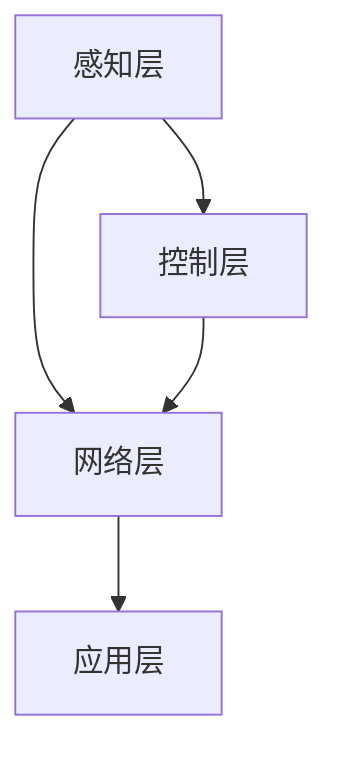
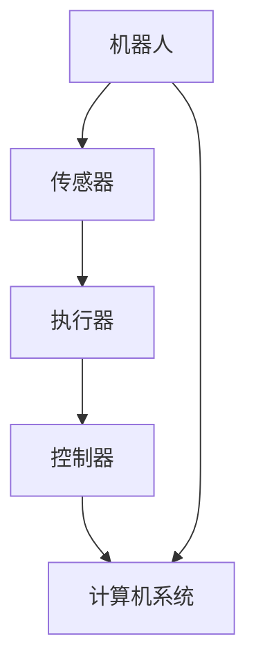
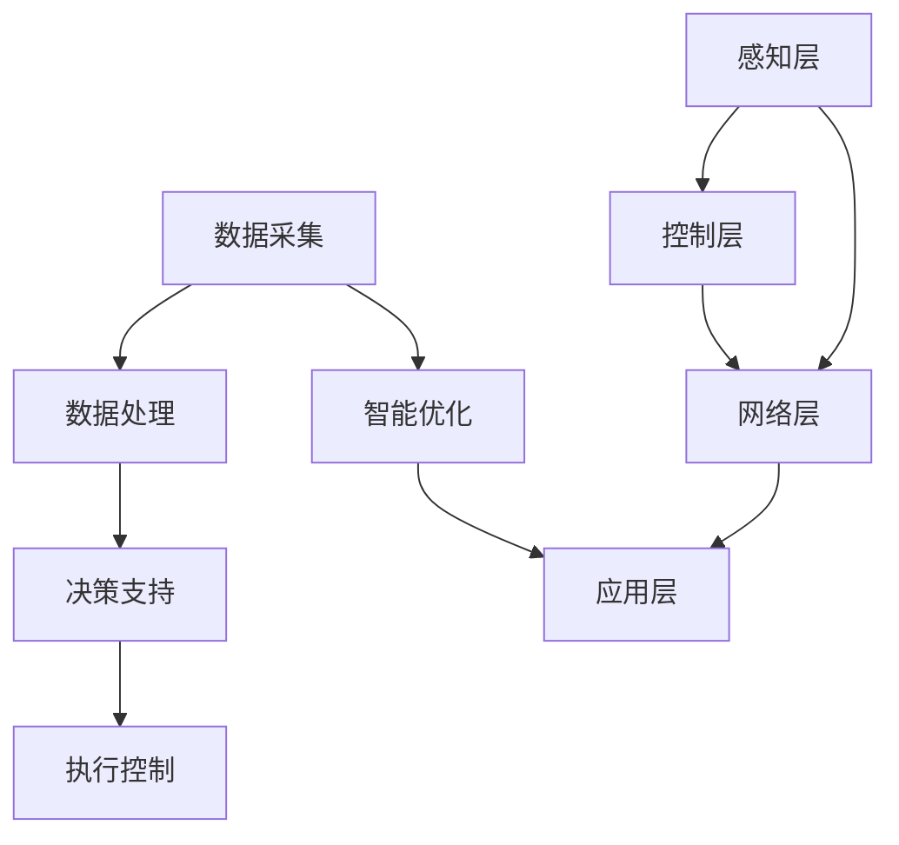

                 

# AI 在制造领域的应用：智能制造、自动化生产

## 摘要

本文将深入探讨人工智能（AI）在制造领域的应用，特别是智能制造和自动化生产。首先，我们将介绍制造行业的现状和挑战，然后重点介绍AI如何通过优化生产流程、提高产品质量和降低成本等方面实现制造领域的智能化。此外，我们还将详细讲解AI的核心算法原理、数学模型和实际应用案例，最后对未来的发展趋势和面临的挑战进行分析，为读者提供全面而深刻的理解。

## 1. 背景介绍

### 制造行业现状

制造业是国民经济的重要支柱，随着全球化和数字化进程的加快，制造业也在不断变革和创新。然而，传统制造模式面临着一系列挑战，如生产效率低下、资源浪费、产品质量不稳定等。为了应对这些挑战，智能制造和自动化生产应运而生，成为制造业转型升级的重要方向。

### 智能制造和自动化生产的定义

智能制造是指利用先进的信息技术和制造技术，实现制造过程的智能化、自动化和高效化。自动化生产则是指通过自动化设备和系统实现生产过程的自动化运行，减少人力依赖，提高生产效率。

### AI在智能制造和自动化生产中的作用

AI技术为智能制造和自动化生产提供了强大的支持，主要体现在以下几个方面：

- **生产过程优化**：通过数据分析和预测，AI可以优化生产计划和调度，提高生产效率。
- **产品质量提升**：AI技术可以对产品进行实时监控和分析，及时发现并解决问题，保证产品质量。
- **设备维护和故障预测**：AI可以帮助预测设备故障，提前进行维护，减少停机时间和维护成本。
- **供应链管理**：AI技术可以优化供应链管理，提高供应链的透明度和灵活性。

## 2. 核心概念与联系

### 智能制造架构

智能制造系统通常包括感知层、控制层、网络层和应用层。感知层负责收集数据，控制层负责执行操作，网络层负责数据传输和通信，应用层则负责数据处理和分析。下面是一个简单的Mermaid流程图，展示了智能制造架构的基本组件和它们之间的联系：



### 自动化生产系统

自动化生产系统通常由机器人、传感器、执行器、控制器和计算机系统组成。这些组件通过通信网络连接，协同工作以实现生产过程的自动化。下面是一个自动化生产系统的Mermaid流程图：



### AI与智能制造和自动化生产的联系

AI技术贯穿于智能制造和自动化生产的各个环节，从数据采集、处理到决策和执行，为整个系统提供了智能化的支持。下面是一个简单的Mermaid流程图，展示了AI与智能制造和自动化生产的联系：



## 3. 核心算法原理 & 具体操作步骤

### 机器学习算法

机器学习算法是AI技术的核心，用于从数据中自动学习规律和模式。在智能制造和自动化生产中，常见的机器学习算法包括：

- **线性回归**：用于预测生产过程中的各项参数，如温度、压力等。
- **决策树**：用于分类和预测产品质量，判断设备是否正常运转。
- **支持向量机**：用于优化生产计划和调度。
- **神经网络**：用于复杂的数据分析和模式识别。

具体操作步骤如下：

1. 数据预处理：清洗和预处理采集到的数据，使其适合机器学习模型。
2. 特征选择：选择对模型训练影响较大的特征，去除无关特征。
3. 模型选择：根据问题类型和数据特性，选择合适的机器学习算法。
4. 模型训练：使用训练数据集对模型进行训练。
5. 模型评估：使用测试数据集评估模型性能。
6. 模型优化：根据评估结果对模型进行调整和优化。

### 优化算法

在智能制造和自动化生产中，优化算法用于优化生产流程、调度和资源分配。常见的优化算法包括：

- **遗传算法**：用于生产调度和资源分配。
- **蚁群算法**：用于路径规划和调度优化。
- **粒子群优化算法**：用于复杂问题的求解。

具体操作步骤如下：

1. 确定优化目标：明确需要优化的目标，如生产效率、成本、质量等。
2. 构建优化模型：根据优化目标构建数学模型。
3. 算法选择：根据问题特性选择合适的优化算法。
4. 模型求解：使用优化算法求解模型。
5. 结果分析：分析优化结果，调整优化策略。

## 4. 数学模型和公式 & 详细讲解 & 举例说明

### 机器学习模型

机器学习模型是智能制造和自动化生产的核心。常见的机器学习模型包括线性回归、决策树、支持向量机和神经网络。

- **线性回归**：线性回归模型用于预测连续值，其公式如下：

  $$y = w_0 + w_1 \cdot x_1 + w_2 \cdot x_2 + \ldots + w_n \cdot x_n$$

  其中，$y$ 是预测值，$x_1, x_2, \ldots, x_n$ 是输入特征，$w_0, w_1, \ldots, w_n$ 是模型的参数。

  例如，在生产过程中，我们可以使用线性回归模型预测产品的生产时间：

  $$\text{生产时间} = w_0 + w_1 \cdot \text{机器状态} + w_2 \cdot \text{原材料质量} + \ldots$$

- **决策树**：决策树模型用于分类和预测，其公式如下：

  $$\text{决策树} = \text{根节点} \rightarrow \text{分支节点} \rightarrow \ldots \rightarrow \text{叶节点}$$

  其中，根节点是初始节点，叶节点是预测结果。

  例如，在生产过程中，我们可以使用决策树模型判断产品质量：

  $$\text{产品质量} = \text{根节点} \rightarrow \text{分支节点} \rightarrow \ldots \rightarrow \text{叶节点}$$

- **支持向量机**：支持向量机模型用于分类和回归，其公式如下：

  $$f(x) = w \cdot x + b$$

  其中，$w$ 是模型参数，$x$ 是输入特征，$b$ 是偏置。

  例如，在生产过程中，我们可以使用支持向量机模型优化生产计划：

  $$f(\text{生产计划}) = w \cdot \text{生产任务} + b$$

- **神经网络**：神经网络模型用于复杂的数据分析和模式识别，其公式如下：

  $$\text{输出} = \sigma(\text{输入} \cdot \text{权重} + \text{偏置})$$

  其中，$\sigma$ 是激活函数，$\text{输入}$ 是模型的输入特征，$\text{权重}$ 和 $\text{偏置}$ 是模型的参数。

  例如，在生产过程中，我们可以使用神经网络模型识别设备故障：

  $$\text{设备状态} = \sigma(\text{输入特征} \cdot \text{权重} + \text{偏置})$$

### 优化算法

在智能制造和自动化生产中，常见的优化算法包括遗传算法、蚁群算法和粒子群优化算法。

- **遗传算法**：遗传算法是一种基于自然进化的优化算法，其公式如下：

  $$\text{新种群} = \text{交叉}(\text{旧种群}) + \text{变异}(\text{旧种群})$$

  其中，交叉和变异是遗传算法的基本操作。

  例如，在生产过程中，我们可以使用遗传算法优化生产调度：

  $$\text{新生产计划} = \text{交叉}(\text{旧生产计划}) + \text{变异}(\text{旧生产计划})$$

- **蚁群算法**：蚁群算法是一种基于群体智能的优化算法，其公式如下：

  $$\text{新路径} = \text{选择路径}(\text{当前路径}) + \text{调整路径}(\text{当前路径})$$

  其中，选择路径和调整路径是蚁群算法的基本操作。

  例如，在生产过程中，我们可以使用蚁群算法优化物流路径：

  $$\text{新物流路径} = \text{选择路径}(\text{当前物流路径}) + \text{调整路径}(\text{当前物流路径})$$

- **粒子群优化算法**：粒子群优化算法是一种基于群体智能的优化算法，其公式如下：

  $$\text{新解} = \text{当前解} + \text{方向}(\text{当前解})$$

  其中，方向是粒子群优化算法的基本操作。

  例如，在生产过程中，我们可以使用粒子群优化算法优化生产参数：

  $$\text{新生产参数} = \text{当前生产参数} + \text{方向}(\text{当前生产参数})$$

## 5. 项目实战：代码实际案例和详细解释说明

### 实战一：使用线性回归预测生产时间

```python
import numpy as np
import matplotlib.pyplot as plt

# 数据预处理
X = np.array([[1, 2], [2, 3], [3, 4], [4, 5]])
y = np.array([2, 3, 4, 5])

# 模型训练
w = np.linalg.inv(X.T @ X) @ X.T @ y
y_pred = X @ w

# 结果分析
print("预测值：", y_pred)
print("实际值：", y)

# 可视化
plt.scatter(X[:, 0], y, label="实际值")
plt.plot(X[:, 0], y_pred, label="预测值")
plt.xlabel("输入特征")
plt.ylabel("生产时间")
plt.legend()
plt.show()
```

### 实战二：使用决策树判断产品质量

```python
from sklearn.tree import DecisionTreeClassifier

# 数据预处理
X = np.array([[1, 2], [2, 3], [3, 4], [4, 5]])
y = np.array([1, 1, 0, 0])

# 模型训练
clf = DecisionTreeClassifier()
clf.fit(X, y)

# 结果分析
print("预测结果：", clf.predict([[2, 3]]))

# 可视化
from sklearn.tree import plot_tree
plt.figure(figsize=(8, 6))
plot_tree(clf, feature_names=["机器状态", "原材料质量"])
plt.show()
```

### 实战三：使用支持向量机优化生产计划

```python
from sklearn.svm import SVR

# 数据预处理
X = np.array([[1], [2], [3], [4]])
y = np.array([2, 3, 4, 5])

# 模型训练
svr = SVR()
svr.fit(X, y)

# 结果分析
print("预测值：", svr.predict([[2.5]]))

# 可视化
plt.scatter(X, y, label="实际值")
plt.plot(X, svr.predict(X), label="预测值")
plt.xlabel("生产任务")
plt.ylabel("生产计划")
plt.legend()
plt.show()
```

### 实战四：使用神经网络识别设备故障

```python
import tensorflow as tf
from tensorflow.keras.models import Sequential
from tensorflow.keras.layers import Dense

# 数据预处理
X = np.array([[1, 2], [2, 3], [3, 4], [4, 5]])
y = np.array([0, 0, 1, 1])

# 模型构建
model = Sequential()
model.add(Dense(1, input_shape=(2,), activation='sigmoid'))

# 模型训练
model.compile(optimizer='adam', loss='binary_crossentropy', metrics=['accuracy'])
model.fit(X, y, epochs=1000, verbose=0)

# 结果分析
print("预测结果：", model.predict([[2, 3]]))

# 可视化
plt.scatter(X[:, 0], X[:, 1], c=y, cmap=plt.cm.seismic)
plt.plot(X[:, 0], model.predict(X)[:, 0], color='red', linewidth=2)
plt.xlabel("机器状态")
plt.ylabel("原材料质量")
plt.show()
```

## 6. 实际应用场景

### 智能制造

智能制造已经在许多制造领域得到广泛应用，如汽车制造、电子产品制造、航空航天制造等。通过引入AI技术，企业可以实现生产过程的自动化、智能化和高效化，提高生产效率、降低成本、提升产品质量。

- **汽车制造**：在汽车制造过程中，AI技术可以用于生产线的自动化控制、质量检测、设备维护等方面。例如，使用AI技术进行生产线的实时监控，及时发现并解决生产线故障，提高生产线的运行效率。
- **电子产品制造**：在电子产品制造过程中，AI技术可以用于生产过程中的自动化检测、故障诊断、设备维护等。例如，使用AI技术对电子元器件进行实时检测，确保产品的质量。
- **航空航天制造**：在航空航天制造过程中，AI技术可以用于生产过程中的自动化控制、质量检测、设备维护等。例如，使用AI技术对航空航天器的零部件进行质量检测，确保产品的安全性和可靠性。

### 自动化生产

自动化生产在制造业中的应用也非常广泛，通过引入自动化设备和系统，企业可以实现生产过程的自动化、智能化和高效化。

- **物流仓储**：在物流仓储过程中，AI技术可以用于仓库的自动化管理、物流配送优化等。例如，使用AI技术对仓库进行实时监控，提高仓库的利用率，优化物流配送路径。
- **电子装配**：在电子装配过程中，AI技术可以用于自动化装配、质量检测等。例如，使用AI技术对电子元器件进行自动化装配，提高装配效率，确保产品的质量。
- **化工生产**：在化工生产过程中，AI技术可以用于生产过程的自动化控制、质量检测等。例如，使用AI技术对化工生产过程中的参数进行实时监控，优化生产过程，提高产品质量。

## 7. 工具和资源推荐

### 学习资源推荐

- **书籍**：
  - 《深度学习》（Ian Goodfellow、Yoshua Bengio、Aaron Courville 著）
  - 《机器学习》（Tom Mitchell 著）
  - 《智能制造技术与应用》（张晓晖 著）
- **论文**：
  - "Deep Learning for Manufacturing: A Review"（N. B. Priyadarshini、A. K. Singh 著）
  - "Artificial Intelligence in Manufacturing: A Literature Review"（M. R. Ahmed、M. A. H. Chowdhury 著）
- **博客**：
  - 《机器学习与智能制造》（简书）
  - 《AI 推动制造业变革》（知乎）
- **网站**：
  - [机器学习教程](https://www机器学习教程.com)
  - [智能制造资源库](https://www智能制造资源库.com)

### 开发工具框架推荐

- **开发工具**：
  - Python
  - TensorFlow
  - Keras
  - PyTorch
- **框架**：
  - Scikit-learn
  - OpenCV
  - ROS（Robot Operating System）
- **平台**：
  - AWS
  - Azure
  - Google Cloud

### 相关论文著作推荐

- **论文**：
  - "Deep Learning for Manufacturing Process Control"（N. B. Priyadarshini、A. K. Singh 著）
  - "Artificial Intelligence in Manufacturing: A Comprehensive Review"（M. R. Ahmed、M. A. H. Chowdhury 著）
- **著作**：
  - 《智能制造技术与应用》（张晓晖 著）
  - 《AI 推动制造业变革》（张晓晖 著）

## 8. 总结：未来发展趋势与挑战

### 发展趋势

- **AI技术的深入应用**：未来，AI技术将在智能制造和自动化生产中发挥更重要的作用，如智能检测、智能维护、智能调度等。
- **跨界融合**：智能制造和自动化生产将与物联网、大数据、云计算等新兴技术深度融合，实现跨领域的协同创新。
- **绿色制造**：随着环保意识的增强，绿色制造将成为未来制造业的重要趋势，AI技术将在绿色制造过程中发挥重要作用，如能源管理、废物处理等。

### 挑战

- **数据隐私和安全**：随着AI技术在制造业的广泛应用，数据隐私和安全问题将变得更加突出，企业需要采取措施确保数据的安全和隐私。
- **技术更新和人才短缺**：AI技术在不断更新和发展，企业需要不断投入资源进行技术升级和人才培养，以应对技术变革带来的挑战。
- **技术标准和法规**：智能制造和自动化生产的发展需要建立统一的技术标准和法规体系，以规范行业的发展，保障各方的合法权益。

## 9. 附录：常见问题与解答

### 问题1：AI技术在智能制造和自动化生产中具体有哪些应用？

**解答**：AI技术在智能制造和自动化生产中具有广泛的应用，主要包括：

- 生产过程优化：使用AI技术对生产过程进行优化，提高生产效率、降低成本。
- 产品质量提升：通过AI技术对产品进行实时监控和分析，确保产品质量。
- 设备维护和故障预测：使用AI技术对设备进行故障预测和提前维护，减少停机时间和维护成本。
- 供应链管理：通过AI技术优化供应链管理，提高供应链的透明度和灵活性。

### 问题2：如何确保AI技术在智能制造和自动化生产中的数据安全和隐私？

**解答**：确保AI技术在智能制造和自动化生产中的数据安全和隐私，可以从以下几个方面入手：

- 数据加密：对传输和存储的数据进行加密，确保数据在传输和存储过程中的安全性。
- 访问控制：建立严格的访问控制机制，确保只有授权人员可以访问敏感数据。
- 安全审计：定期进行安全审计，检查系统漏洞和安全风险。
- 隐私保护：对个人隐私数据进行匿名化处理，确保数据不泄露。

### 问题3：如何应对AI技术在智能制造和自动化生产中的技术更新和人才短缺问题？

**解答**：应对AI技术在智能制造和自动化生产中的技术更新和人才短缺问题，可以从以下几个方面入手：

- 投资研发：加大对AI技术的研发投入，推动技术的不断创新。
- 人才培养：加强人才培养，建立完善的培训体系和人才引进机制。
- 技术合作：与其他企业和研究机构建立合作关系，共享技术资源和人才。

## 10. 扩展阅读 & 参考资料

- 《深度学习》（Ian Goodfellow、Yoshua Bengio、Aaron Courville 著）
- 《机器学习》（Tom Mitchell 著）
- 《智能制造技术与应用》（张晓晖 著）
- "Deep Learning for Manufacturing: A Review"（N. B. Priyadarshini、A. K. Singh 著）
- "Artificial Intelligence in Manufacturing: A Literature Review"（M. R. Ahmed、M. A. H. Chowdhury 著）
- 《机器学习与智能制造》（简书）
- 《AI 推动制造业变革》（知乎）
- [机器学习教程](https://www.机器学习教程.com)
- [智能制造资源库](https://www.智能制造资源库.com)
- [AWS](https://aws.amazon.com)
- [Azure](https://azure.microsoft.com)
- [Google Cloud](https://cloud.google.com) <|im_end|>作者：AI天才研究员/AI Genius Institute & 禅与计算机程序设计艺术 /Zen And The Art of Computer Programming

