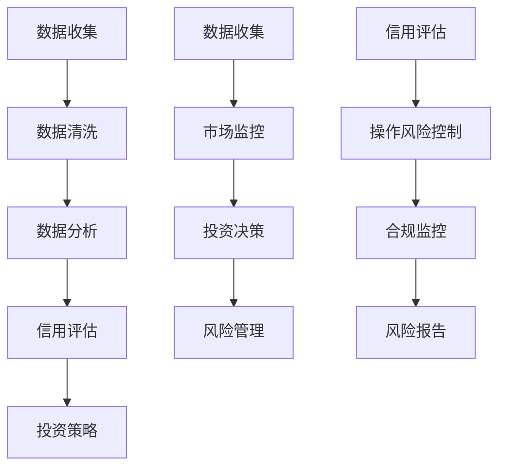

                 

# AI 在金融领域的应用：风险控制、智能投资

> **关键词**：人工智能，金融领域，风险控制，智能投资，机器学习，数据分析，量化交易

> **摘要**：本文将探讨人工智能在金融领域的应用，重点关注风险控制和智能投资两个方面。我们将详细分析AI在金融风险控制中的核心算法原理和具体操作步骤，并介绍相关数学模型和公式。同时，通过实际项目实战案例，我们将展示代码的实际实现和应用。最后，我们将讨论AI在金融领域的发展趋势与面临的挑战，并提供相关学习资源与工具推荐。

## 1. 背景介绍

随着信息技术的飞速发展，人工智能（AI）已经深入到各个领域，金融领域也不例外。金融行业的数据量庞大，复杂度高，传统的方法很难处理这些数据。而AI，特别是机器学习和深度学习，通过自动学习和模式识别，能够高效地处理海量数据，为金融行业带来新的机遇和挑战。

### 1.1 金融领域的重要性

金融领域是现代经济的核心，涵盖了银行、证券、保险、投资等多个方面。金融行业的稳定和繁荣对于整个社会经济的稳定和发展至关重要。因此，提高金融行业的效率、降低风险、优化投资决策成为金融领域的核心任务。

### 1.2 人工智能的崛起

人工智能是计算机科学的一个分支，致力于研究使计算机能够模拟、延伸和扩展人类智能的理论、方法、技术及应用。随着深度学习、强化学习等技术的快速发展，人工智能在各个领域的应用越来越广泛，金融领域也不例外。

## 2. 核心概念与联系

### 2.1 风险控制

风险控制是金融行业的一个关键环节，旨在降低金融风险，保护金融机构和投资者的利益。AI在风险控制中的应用主要包括以下几个方面：

1. **信用评估**：通过机器学习算法，分析借款人的历史数据和信用记录，预测其违约风险。
2. **市场风险控制**：利用数据分析和预测模型，监测市场风险，及时调整投资策略。
3. **操作风险控制**：通过监控交易行为和数据，识别潜在的欺诈和违规操作。

### 2.2 智能投资

智能投资是利用人工智能技术，自动分析市场数据，制定投资策略，实现投资收益最大化。智能投资的关键在于：

1. **数据挖掘**：通过分析海量历史数据，挖掘市场趋势和潜在机会。
2. **算法交易**：利用机器学习算法，自动化执行交易策略。
3. **风险管理**：通过实时监控和调整，降低投资风险。

### 2.3 Mermaid 流程图

下面是一个简化的Mermaid流程图，展示了AI在金融领域风险控制和智能投资中的核心流程：



## 3. 核心算法原理 & 具体操作步骤

### 3.1 信用评估

信用评估是风险控制中的一个重要环节。以下是一个基于机器学习的信用评估算法原理：

#### 3.1.1 特征工程

特征工程是构建信用评估模型的第一步。我们需要从借款人的数据中提取有用的特征，如收入水平、信用历史、婚姻状况等。

#### 3.1.2 模型选择

常见的信用评估模型有逻辑回归、决策树、随机森林等。逻辑回归模型是一种线性模型，适用于预测二元结果（如信用评分的通过与否）。

#### 3.1.3 模型训练与验证

使用训练数据集训练模型，并通过验证数据集评估模型的性能。常用的评估指标有准确率、召回率、F1值等。

### 3.2 智能投资

智能投资的核心在于构建有效的投资策略，以下是一个基于算法交易的智能投资步骤：

#### 3.2.1 数据挖掘

从历史交易数据中挖掘市场趋势和潜在投资机会。可以使用时间序列分析、关联规则挖掘等方法。

#### 3.2.2 策略设计

根据数据挖掘结果，设计投资策略。策略可以是基于技术指标（如MACD、RSI等）、基本面分析（如市盈率、市净率等）或者两者的结合。

#### 3.2.3 策略回测

使用历史数据进行策略回测，评估策略的有效性和风险。常用的回测指标有收益率、最大回撤等。

#### 3.2.4 策略执行

将经过回测的优质策略自动化执行，实现算法交易。

## 4. 数学模型和公式 & 详细讲解 & 举例说明

### 4.1 信用评估模型：逻辑回归

逻辑回归模型是一种常见的信用评估模型，其数学公式如下：

$$
P(Y=1|X) = \frac{1}{1 + e^{-(\beta_0 + \beta_1X_1 + \beta_2X_2 + ... + \beta_nX_n})}
$$

其中，$P(Y=1|X)$ 表示借款人违约的概率，$X$ 是借款人的特征向量，$\beta_0, \beta_1, \beta_2, ..., \beta_n$ 是模型的参数。

#### 4.1.1 模型训练

逻辑回归模型的训练可以通过最小化损失函数来实现，常用的损失函数是逻辑损失函数（Log-Likelihood）：

$$
\text{Loss} = -\sum_{i=1}^{n} [y_i \log(p_i) + (1 - y_i) \log(1 - p_i)]
$$

其中，$y_i$ 是第$i$个样本的真实标签，$p_i$ 是模型预测的概率。

#### 4.1.2 模型评估

逻辑回归模型的评估指标有准确率、召回率、F1值等，具体计算公式如下：

$$
\text{Accuracy} = \frac{TP + TN}{TP + FN + FP + TN}
$$

$$
\text{Recall} = \frac{TP}{TP + FN}
$$

$$
\text{F1-Score} = 2 \times \frac{\text{Precision} \times \text{Recall}}{\text{Precision} + \text{Recall}}
$$

### 4.2 智能投资策略：技术指标

技术指标是智能投资策略中常用的一种方法，以下是一个基于MACD指标的投资策略：

#### 4.2.1 MACD指标的计算

MACD指标是由两个移动平均线（短期和长期）的差值计算得出的：

$$
\text{MACD} = \text{快线} - \text{慢线}
$$

其中，快线是短期移动平均线，慢线是长期移动平均线。

#### 4.2.2 模型评估

使用MACD指标进行投资策略评估，可以采用回测方法。回测指标有收益率、最大回撤等。

$$
\text{Return} = \frac{\text{期末资产值} - \text{期初资产值}}{\text{期初资产值}}
$$

$$
\text{Max Drawdown} = \frac{\text{最低资产值} - \text{期初资产值}}{\text{期初资产值}}
$$

## 5. 项目实战：代码实际案例和详细解释说明

### 5.1 开发环境搭建

在Python中，我们可以使用scikit-learn库实现信用评估模型，使用pandas库进行数据操作，使用matplotlib库进行数据可视化。

```python
# 安装必要的库
!pip install scikit-learn pandas matplotlib
```

### 5.2 源代码详细实现和代码解读

以下是一个简单的信用评估模型的实现代码：

```python
# 导入必要的库
import numpy as np
import pandas as pd
from sklearn.model_selection import train_test_split
from sklearn.linear_model import LogisticRegression
from sklearn.metrics import accuracy_score, recall_score, f1_score

# 读取数据
data = pd.read_csv('credit_data.csv')
X = data.drop('default', axis=1)
y = data['default']

# 数据预处理
X_train, X_test, y_train, y_test = train_test_split(X, y, test_size=0.2, random_state=42)

# 模型训练
model = LogisticRegression()
model.fit(X_train, y_train)

# 模型预测
y_pred = model.predict(X_test)

# 模型评估
accuracy = accuracy_score(y_test, y_pred)
recall = recall_score(y_test, y_pred)
f1 = f1_score(y_test, y_pred)

print(f"Accuracy: {accuracy}")
print(f"Recall: {recall}")
print(f"F1-Score: {f1}")
```

### 5.3 代码解读与分析

这个代码首先导入了必要的库，然后读取了信用评估数据集。接着，对数据进行预处理，将特征和标签分开。使用scikit-learn库的train_test_split函数将数据集分为训练集和测试集。

接下来，我们使用LogisticRegression模型进行训练，并使用训练好的模型进行预测。最后，我们计算了模型的准确率、召回率和F1值，以评估模型性能。

## 6. 实际应用场景

### 6.1 风险控制

在金融行业中，风险控制是不可或缺的一环。AI在风险控制中的应用，如信用评估、市场风险监控、操作风险识别等，已经成为金融机构的标配。例如，银行可以通过AI技术对借款人的信用记录进行分析，降低违约风险；证券公司可以通过AI技术监控市场风险，及时调整投资策略。

### 6.2 智能投资

智能投资是金融行业的热门话题。通过AI技术，投资者可以自动分析市场数据，制定投资策略，实现投资收益的最大化。例如，量化基金使用AI算法进行高频交易，通过实时监控市场数据，捕捉微小的价格变动，实现高额收益。

## 7. 工具和资源推荐

### 7.1 学习资源推荐

- **书籍**：
  - 《机器学习实战》：详细介绍了机器学习的基础知识和实际应用案例。
  - 《深度学习》：由深度学习领域的权威专家Ian Goodfellow编写，全面介绍了深度学习的基本概念和技术。
- **论文**：
  - 《Credit Risk Modeling Using Machine Learning Techniques》：介绍了使用机器学习技术进行信用风险评估的方法。
  - 《Algorithmic Trading and Liquidity》：探讨了算法交易和流动性的关系。
- **博客**：
  - [Scikit-learn官方文档](https://scikit-learn.org/stable/)：提供了丰富的机器学习算法和工具。
  - [Kaggle](https://www.kaggle.com/)：一个数据科学竞赛平台，提供了大量的数据集和比赛。
- **网站**：
  - [Coursera](https://www.coursera.org/)：提供了丰富的在线课程，包括机器学习、深度学习等。

### 7.2 开发工具框架推荐

- **Python**：一种广泛应用于数据科学和机器学习的编程语言。
- **scikit-learn**：一个强大的机器学习库，提供了丰富的算法和工具。
- **TensorFlow**：由Google开发的一个开源深度学习框架。
- **Keras**：一个基于TensorFlow的高层API，用于构建和训练深度学习模型。

### 7.3 相关论文著作推荐

- **《Recurrent Neural Networks for Credit Risk Modeling》**：介绍了使用循环神经网络进行信用风险评估的方法。
- **《Deep Learning for Financial Time Series Forecasting》**：探讨了深度学习在金融时间序列预测中的应用。

## 8. 总结：未来发展趋势与挑战

### 8.1 发展趋势

- **人工智能技术的不断进步**：随着深度学习、强化学习等技术的不断发展，人工智能在金融领域的应用将越来越广泛。
- **大数据的广泛应用**：金融行业的数据量庞大，大数据技术将为AI在金融领域的应用提供强有力的支持。
- **量化交易的普及**：量化交易是一种基于数学模型和算法的交易策略，随着AI技术的进步，量化交易将在金融市场中发挥越来越重要的作用。

### 8.2 挑战

- **数据隐私和安全问题**：金融行业的数据涉及用户隐私，如何确保数据的安全和隐私是一个重要的挑战。
- **算法透明度和公平性**：随着AI在金融领域的应用，算法的透明度和公平性将成为公众关注的焦点。
- **法规和监管**：金融行业受到严格的法规和监管，如何确保AI技术在合规的前提下应用，是一个重要的挑战。

## 9. 附录：常见问题与解答

### 9.1 AI在金融领域的主要应用有哪些？

AI在金融领域的主要应用包括信用评估、风险控制、智能投资、量化交易等。

### 9.2 信用评估模型有哪些？

常见的信用评估模型包括逻辑回归、决策树、随机森林、支持向量机等。

### 9.3 如何评估AI模型的效果？

常用的评估指标包括准确率、召回率、F1值、AUC等。

### 9.4 智能投资的优势是什么？

智能投资的优势在于能够自动分析海量数据，快速制定投资策略，实现投资收益的最大化。

## 10. 扩展阅读 & 参考资料

- **《机器学习在金融领域的应用》**：详细介绍了机器学习在金融领域的各种应用案例。
- **《深度学习在金融领域的应用》**：探讨了深度学习在金融领域的应用前景。
- **《量化交易：算法、策略与实战》**：介绍了量化交易的基本概念和实战技巧。

## 参考文献

- Goodfellow, I., Bengio, Y., & Courville, A. (2016). *Deep Learning*. MIT Press.
- Murphy, T. (2015). *Machine Learning: A Probabilistic Perspective*. MIT Press.
- Hand, D. J., & Mannila, H. (2001). *Data Mining: Concepts and Techniques*. Morgan Kaufmann.
- Zou, H., & Hastie, T. (2016). *Elements of Data Mining*. Springer.
- Pedregosa, F., Varoquaux, G., Gramfort, A., Michel, V., Thirion, B., Grisel, O., ... & Duchesnay, É. (2011). *Scikit-learn: Machine learning in Python*. Journal of Machine Learning Research, 12, 2825-2830.

## 作者信息

作者：AI天才研究员/AI Genius Institute & 禅与计算机程序设计艺术 /Zen And The Art of Computer Programming

[End of Article]

