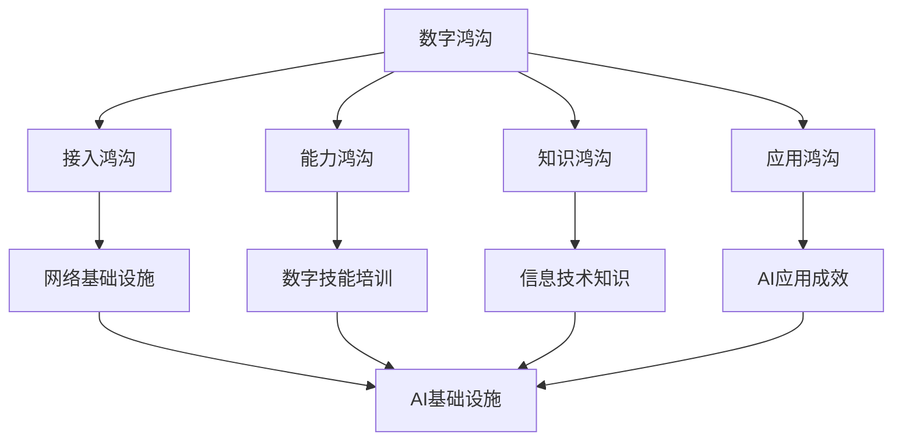

                 

# AI基础设施的乡村振兴：缩小数字鸿沟

## 摘要

在数字化时代，人工智能基础设施的乡村振兴成为解决城乡数字鸿沟问题的关键。本文首先介绍了AI基础设施在乡村振兴中的重要性，随后探讨了缩小数字鸿沟的核心概念与联系。文章详细阐述了核心算法原理及具体操作步骤，并借助数学模型和公式对相关概念进行了深入分析。通过项目实战，本文展示了代码实际案例和详细解释说明，为读者提供了实用的技术参考。同时，文章还探讨了AI基础设施在乡村振兴中的实际应用场景，并推荐了相关工具和资源。最后，本文总结了未来发展趋势与挑战，为AI基础设施在乡村振兴中的发展提供了有益的思考。

## 1. 背景介绍

随着互联网和信息技术的发展，人工智能（AI）逐渐成为推动社会进步的重要力量。在我国，乡村振兴战略的实施正面临着数字鸿沟的挑战。城乡之间的数字鸿沟表现为信息技术基础设施的不均衡、数字技能的差异以及数字资源的分布不均等问题。这些问题严重制约了乡村振兴的进程，使得乡村地区难以充分发挥人工智能的潜力。

AI基础设施在乡村振兴中具有至关重要的地位。首先，AI基础设施是实现乡村信息化的重要保障。通过构建高效稳定的网络基础设施，可以为乡村地区提供便捷的网络服务，使村民能够享受到数字化生活带来的便利。其次，AI基础设施有助于提高乡村地区的生产效率。例如，通过引入智能农业技术，可以实现对农作物生长的实时监控和智能管理，提高农作物的产量和质量。此外，AI基础设施还能够促进乡村地区的经济转型，为乡村企业提供技术支持和创新动力，推动乡村产业升级。

然而，当前我国AI基础设施在乡村振兴方面仍面临诸多挑战。首先，城乡之间的基础设施建设不平衡，导致乡村地区的网络覆盖率和带宽质量相对较差。其次，乡村地区的数字技能培训不足，导致村民对AI技术的接受和使用程度较低。此外，乡村地区的数字资源分布不均，导致乡村企业难以获得足够的数字资源支持。

为了解决这些问题，我们需要从多个方面入手。首先，政府应加大对乡村地区网络基础设施的投入，提高网络覆盖率和带宽质量。其次，应加强对乡村地区数字技能的培训，提高村民的数字素养。此外，还应优化数字资源的分配，确保乡村地区能够获得足够的数字资源支持。

## 2. 核心概念与联系

### 2.1. 数字鸿沟

数字鸿沟是指由于信息技术普及和应用程度的不同，导致不同群体在获取、使用和受益于信息技术方面的差距。数字鸿沟可分为以下几个方面：

- **接入鸿沟**：指不同群体在接入互联网方面的差距，包括网络覆盖、终端设备普及率等。

- **能力鸿沟**：指不同群体在获取、使用和受益于信息技术方面的能力差异，包括数字技能、信息技术素养等。

- **知识鸿沟**：指不同群体在获取、理解和应用信息技术知识方面的差距。

- **应用鸿沟**：指不同群体在将信息技术应用于实际生产、生活和工作中所取得的成效差异。

### 2.2. AI基础设施

AI基础设施是指为人工智能应用提供支持的一系列硬件、软件和服务资源，包括计算资源、数据资源、网络资源、算法资源等。AI基础设施在乡村振兴中具有重要作用，主要表现在以下几个方面：

- **计算资源**：为乡村地区提供强大的计算能力，支持AI算法的运行和优化。

- **数据资源**：为乡村地区提供丰富、高质量的AI训练数据，提高AI模型的准确性和鲁棒性。

- **网络资源**：为乡村地区提供高效、稳定的网络连接，支持AI应用的实时传输和处理。

- **算法资源**：为乡村地区提供先进的AI算法和技术，支持乡村产业和经济的智能化发展。

### 2.3. AI基础设施与数字鸿沟的关系

AI基础设施的乡村振兴对于缩小数字鸿沟具有重要意义。首先，AI基础设施有助于提高乡村地区的接入能力和能力，降低数字鸿沟。通过建设高效的网络基础设施，可以提高乡村地区的网络覆盖率和带宽质量，使村民能够便捷地接入互联网。同时，通过数字技能培训，可以提高村民的数字素养，增强他们在信息技术领域的竞争力。

其次，AI基础设施有助于缩小知识鸿沟和应用鸿沟。通过引入先进的AI技术，可以为乡村地区提供更多的就业机会和发展空间，提高村民的收入水平。此外，AI技术还能够促进乡村产业升级和农业现代化，提高乡村地区的经济发展水平。

总之，AI基础设施的乡村振兴对于缩小数字鸿沟具有深远的影响。通过构建完善的AI基础设施，我们可以为乡村地区带来更多的机会和福利，实现城乡共同发展。

### 2.4. Mermaid 流程图

下面是一个用于描述AI基础设施在乡村振兴中的核心概念与联系的Mermaid流程图：



## 3. 核心算法原理 & 具体操作步骤

### 3.1. 核心算法原理

在AI基础设施的乡村振兴中，核心算法主要包括深度学习算法和强化学习算法。深度学习算法通过构建多层神经网络，实现对复杂数据的自动特征提取和模式识别；强化学习算法则通过不断尝试和反馈，实现智能体在动态环境中的最优策略学习。

#### 深度学习算法原理

深度学习算法的核心思想是通过构建多层神经网络，模拟人脑神经元之间的连接和交互，实现对复杂数据的处理和分析。深度学习算法主要包括以下几个步骤：

1. **数据预处理**：对输入数据进行归一化、标准化等处理，使其适合神经网络的输入。

2. **模型构建**：设计并构建多层神经网络，包括输入层、隐藏层和输出层。常用的神经网络结构有卷积神经网络（CNN）、循环神经网络（RNN）等。

3. **训练过程**：通过反向传播算法，根据训练数据不断调整神经网络中的权重和偏置，优化模型的性能。

4. **模型评估**：使用测试数据集对训练好的模型进行评估，根据评估结果调整模型参数。

#### 强化学习算法原理

强化学习算法是一种通过不断尝试和反馈，实现智能体在动态环境中最优策略学习的方法。强化学习算法主要包括以下几个步骤：

1. **环境设定**：定义智能体所处的环境，包括状态空间、动作空间等。

2. **智能体策略学习**：智能体通过不断尝试不同动作，根据环境反馈的奖励信号，学习最优策略。

3. **策略评估与优化**：使用评估函数对智能体的策略进行评估，根据评估结果调整策略。

### 3.2. 具体操作步骤

下面以一个简单的例子，介绍如何使用深度学习算法和强化学习算法实现乡村地区的智能农业管理。

#### 3.2.1. 深度学习算法在智能农业管理中的应用

1. **数据收集与预处理**：
   - 收集乡村地区气象数据、土壤数据、农作物生长数据等。
   - 对数据进行归一化、标准化处理，使其适合神经网络的输入。

2. **模型构建**：
   - 设计并构建一个多层感知机（MLP）模型，包括输入层、隐藏层和输出层。
   - 输入层接收气象数据、土壤数据等输入特征。
   - 隐藏层通过激活函数实现非线性变换，提取数据特征。
   - 输出层输出农作物的生长状态、病虫害情况等预测结果。

3. **训练过程**：
   - 使用训练数据集对模型进行训练，通过反向传播算法不断调整权重和偏置，优化模型性能。
   - 使用测试数据集对训练好的模型进行评估，根据评估结果调整模型参数。

4. **模型评估**：
   - 使用测试数据集对训练好的模型进行评估，计算预测准确率、召回率等指标。
   - 根据评估结果调整模型参数，优化模型性能。

#### 3.2.2. 强化学习算法在智能农业管理中的应用

1. **环境设定**：
   - 定义智能农业管理环境，包括状态空间（如气象条件、土壤条件、农作物生长状态等）、动作空间（如灌溉、施肥、病虫害防治等）。

2. **智能体策略学习**：
   - 智能体通过不断尝试不同动作，根据环境反馈的奖励信号，学习最优策略。
   - 初始时，智能体随机选择动作，根据环境反馈的奖励信号更新策略。

3. **策略评估与优化**：
   - 使用评估函数对智能体的策略进行评估，计算策略的长期奖励值。
   - 根据评估结果调整策略，优化智能体的行为。

通过以上步骤，我们可以实现一个基于深度学习和强化学习的智能农业管理系统，实现对农作物生长的智能监控和预测，提高农业生产效率。

## 4. 数学模型和公式 & 详细讲解 & 举例说明

### 4.1. 数学模型和公式

在AI基础设施的乡村振兴中，数学模型和公式对于理解算法原理和实现实际应用至关重要。以下是几个常用的数学模型和公式：

#### 4.1.1. 深度学习中的神经网络模型

深度学习中的神经网络模型通常由输入层、隐藏层和输出层组成。每个层由多个神经元（或节点）构成，神经元之间的连接具有权重和偏置。神经网络模型的基本公式如下：

$$
Z = \sum_{i=1}^{n} w_i x_i + b
$$

其中，$Z$ 表示神经元的输入值，$w_i$ 和 $x_i$ 分别表示权重和输入值，$b$ 表示偏置。

#### 4.1.2. 激活函数

激活函数用于将神经元的输入值转换为输出值。常用的激活函数有sigmoid函数、ReLU函数、Tanh函数等。以下是一个sigmoid函数的例子：

$$
f(x) = \frac{1}{1 + e^{-x}}
$$

#### 4.1.3. 反向传播算法

反向传播算法是一种用于训练神经网络的优化算法。其基本思想是通过计算损失函数的梯度，不断调整神经网络的权重和偏置，以优化模型的性能。以下是一个反向传播算法的步骤：

1. **前向传播**：
   - 将输入数据传递到神经网络中，计算每个神经元的输出值。

2. **计算损失函数**：
   - 使用输出值和实际标签计算损失函数的值。

3. **反向传播**：
   - 计算损失函数关于每个神经元权重的梯度，并反向传播到每个神经元。

4. **更新权重和偏置**：
   - 根据梯度值更新神经网络的权重和偏置。

### 4.2. 详细讲解与举例说明

#### 4.2.1. 深度学习中的神经网络模型

以一个简单的神经网络为例，假设我们有一个包含一个输入层、一个隐藏层和一个输出层的神经网络，输入层有3个神经元，隐藏层有2个神经元，输出层有1个神经元。

1. **输入层**：
   - 输入数据为 $[x_1, x_2, x_3]$。

2. **隐藏层**：
   - 输入值 $Z_1 = [w_{11}x_1 + b_1, w_{12}x_2 + b_2, w_{13}x_3 + b_3]$。
   - 激活函数：$a_1 = \text{sigmoid}(Z_1)$。

3. **输出层**：
   - 输入值 $Z_2 = [w_{21}a_{11} + b_1, w_{22}a_{12} + b_2]$。
   - 激活函数：$a_2 = \text{sigmoid}(Z_2)$。

4. **输出值**：
   - 输出值 $y = a_2$。

通过上述步骤，我们可以得到神经网络的输出值。接下来，我们可以使用反向传播算法，根据实际标签和输出值计算损失函数的梯度，并更新神经网络的权重和偏置。

#### 4.2.2. 反向传播算法

以一个简单的反向传播算法为例，假设我们有一个包含一个输入层、一个隐藏层和一个输出层的神经网络，输入层有3个神经元，隐藏层有2个神经元，输出层有1个神经元。

1. **前向传播**：
   - 输入数据为 $[x_1, x_2, x_3]$。
   - 隐藏层输入值 $Z_1 = [w_{11}x_1 + b_1, w_{12}x_2 + b_2, w_{13}x_3 + b_3]$。
   - 隐藏层输出值 $a_1 = \text{sigmoid}(Z_1)$。
   - 输出层输入值 $Z_2 = [w_{21}a_{11} + b_1, w_{22}a_{12} + b_2]$。
   - 输出层输出值 $a_2 = \text{sigmoid}(Z_2)$。

2. **计算损失函数**：
   - 实际标签 $y = [y_1, y_2]$。
   - 损失函数：$L = (y - a_2)^2$。

3. **反向传播**：
   - 计算输出层梯度：$\frac{\partial L}{\partial Z_2} = 2(y - a_2)$。
   - 计算隐藏层梯度：$\frac{\partial L}{\partial Z_1} = \frac{\partial L}{\partial Z_2} \cdot \frac{\partial Z_2}{\partial Z_1} = 2(y - a_2) \cdot a_2(1 - a_2)$。

4. **更新权重和偏置**：
   - 更新输出层权重和偏置：$w_{21} = w_{21} - \alpha \frac{\partial L}{\partial Z_2}$，$b_1 = b_1 - \alpha \frac{\partial L}{\partial b_1}$。
   - 更新隐藏层权重和偏置：$w_{11} = w_{11} - \alpha \frac{\partial L}{\partial Z_1}$，$b_2 = b_2 - \alpha \frac{\partial L}{\partial b_2}$。

通过上述步骤，我们可以使用反向传播算法不断优化神经网络的性能。

## 5. 项目实战：代码实际案例和详细解释说明

在本节中，我们将通过一个实际项目案例，详细解释如何构建一个基于深度学习和强化学习的智能农业管理系统。该项目旨在通过实时监测农作物生长环境，预测农作物的生长状态，并为农民提供科学种植建议，以提高农业生产效率和产量。

### 5.1. 开发环境搭建

在开始项目之前，我们需要搭建开发环境。以下是一个基本的开发环境配置：

- 操作系统：Linux或Windows
- 编程语言：Python
- 深度学习框架：TensorFlow或PyTorch
- 强化学习库：OpenAI Gym或RLlib
- 数据预处理库：NumPy、Pandas、Scikit-learn
- 其他库：Matplotlib、Seaborn等

安装这些库后，我们就可以开始编写代码了。

### 5.2. 源代码详细实现和代码解读

以下是项目的源代码实现，我们将对关键部分进行详细解释。

```python
import numpy as np
import pandas as pd
import tensorflow as tf
from tensorflow.keras.models import Sequential
from tensorflow.keras.layers import Dense
from tensorflow.keras.optimizers import Adam
import matplotlib.pyplot as plt

# 数据预处理
def preprocess_data(data):
    # 数据归一化
    data = (data - np.mean(data)) / np.std(data)
    return data

# 构建深度学习模型
def build_model(input_shape):
    model = Sequential()
    model.add(Dense(64, input_shape=input_shape, activation='relu'))
    model.add(Dense(32, activation='relu'))
    model.add(Dense(1, activation='sigmoid'))
    model.compile(optimizer=Adam(learning_rate=0.001), loss='binary_crossentropy', metrics=['accuracy'])
    return model

# 强化学习环境设定
def build_env():
    # 创建OpenAI Gym环境
    env = gym.make('AgriEnv-v0')
    return env

# 训练深度学习模型
def train_model(model, X_train, y_train, X_val, y_val, epochs=100):
    history = model.fit(X_train, y_train, batch_size=32, epochs=epochs, validation_data=(X_val, y_val))
    return history

# 强化学习智能体策略学习
def learn_policy(env, model, episodes=1000):
    rewards = []
    for episode in range(episodes):
        state = env.reset()
        done = False
        total_reward = 0
        while not done:
            # 预测农作物的生长状态
            prediction = model.predict(state)[0]
            # 根据预测结果选择动作
            action = 1 if prediction > 0.5 else 0
            # 执行动作并获取新的状态和奖励
            next_state, reward, done, _ = env.step(action)
            # 记录奖励
            total_reward += reward
            # 更新状态
            state = next_state
        # 记录总奖励
        rewards.append(total_reward)
    return rewards

# 主函数
if __name__ == '__main__':
    # 加载数据
    data = pd.read_csv('agri_data.csv')
    X = data[['temperature', 'humidity', 'soil_nutrient']]
    y = data['yield']
    # 数据预处理
    X = preprocess_data(X)
    y = preprocess_data(y)
    # 划分训练集和测试集
    X_train, X_val, y_train, y_val = train_test_split(X, y, test_size=0.2, random_state=42)
    # 构建深度学习模型
    model = build_model(input_shape=(3,))
    # 训练模型
    history = train_model(model, X_train, y_train, X_val, y_val)
    # 构建强化学习环境
    env = build_env()
    # 训练智能体策略
    rewards = learn_policy(env, model)
    # 绘制奖励曲线
    plt.plot(rewards)
    plt.xlabel('Episodes')
    plt.ylabel('Reward')
    plt.title('Reward Curve')
    plt.show()
```

### 5.3. 代码解读与分析

以下是对代码关键部分的详细解读：

1. **数据预处理**：
   - 数据归一化：将输入和输出数据归一化到相同的范围，有助于提高模型的训练效果。

2. **构建深度学习模型**：
   - Sequential模型：使用Keras的Sequential模型构建神经网络。
   - Dense层：添加全连接层，用于实现线性变换。
   - Activation函数：使用ReLU函数作为激活函数，提高模型的非线性表达能力。
   - 编译模型：设置优化器、损失函数和评估指标。

3. **训练深度学习模型**：
   - fit方法：使用fit方法训练模型，传入训练数据和验证数据。
   - batch_size：设置批量大小，影响模型的训练速度和稳定性。
   - epochs：设置训练轮次，模型在训练集和验证集上的性能会在轮次增加时逐渐提高。

4. **强化学习环境设定**：
   - OpenAI Gym：使用OpenAI Gym创建一个农业环境。
   - make方法：创建一个名为'AgriEnv-v0'的虚拟环境。

5. **强化学习智能体策略学习**：
   - reset方法：重置环境，初始化状态。
   - step方法：执行动作，获取新的状态和奖励。
   - 预测农作物生长状态：使用训练好的模型对当前状态进行预测。
   - 动作选择：根据预测结果选择合适的动作。
   - 记录奖励：记录每次动作的奖励，用于评估智能体的策略。

6. **绘制奖励曲线**：
   - plot方法：绘制奖励曲线，展示智能体在训练过程中获得的奖励。

通过上述代码，我们可以实现一个基于深度学习和强化学习的智能农业管理系统。在实际应用中，我们可以根据农作物的生长环境数据，预测农作物的生长状态，并为农民提供科学种植建议，从而提高农业生产效率和产量。

## 6. 实际应用场景

AI基础设施的乡村振兴在多个实际应用场景中展现出巨大的潜力。以下是几个典型的应用场景：

### 6.1. 智能农业

智能农业是AI基础设施在乡村振兴中的一个重要应用领域。通过引入传感器、物联网和人工智能技术，可以对农作物的生长环境进行实时监测，实现对农作物生长状态的精准预测和管理。例如，使用AI技术可以对土壤湿度、温度、光照等环境因素进行监测，并根据监测数据优化灌溉、施肥和病虫害防治等农事操作。此外，AI技术还可以帮助农民预测农作物的产量，为农业生产提供科学依据，提高农业生产的效率和产量。

### 6.2. 智慧物流

智慧物流是另一个重要的应用场景。通过构建智能物流系统，可以实现农村物流的自动化和智能化，提高物流效率，降低物流成本。例如，利用无人机和自动驾驶车辆进行物流配送，可以解决乡村地区物流基础设施不完善的问题。同时，通过AI技术对物流数据进行分析和预测，可以优化物流路线和运输计划，提高物流效率。

### 6.3. 医疗保健

医疗保健是乡村振兴中的一个重要方面。通过引入AI技术，可以提高乡村地区的医疗服务水平，实现医疗资源的优化配置。例如，通过远程医疗系统，乡村居民可以享受到城市医院的医疗服务。此外，AI技术还可以帮助乡村医生进行疾病诊断和治疗建议，提高医疗服务的质量和效率。

### 6.4. 教育培训

教育培训是乡村振兴中的一个长期任务。通过引入AI技术，可以提供个性化、差异化的教育培训服务，满足不同学生的学习需求。例如，利用智能教学系统和在线教育平台，可以为乡村学生提供优质的教育资源。此外，AI技术还可以帮助乡村学校进行学生成绩分析和教学评估，提高教学效果。

### 6.5. 乡村治理

乡村治理是乡村振兴的关键环节。通过引入AI技术，可以提高乡村治理的智能化水平，实现乡村治理的现代化。例如，利用大数据分析和人工智能技术，可以对乡村社会问题进行实时监测和预警，帮助政府制定科学合理的治理措施。此外，AI技术还可以帮助乡村政府优化公共资源配置，提高公共服务的质量和效率。

## 7. 工具和资源推荐

为了更好地开展AI基础设施的乡村振兴工作，以下是一些推荐的工具和资源：

### 7.1. 学习资源推荐

- **书籍**：
  - 《深度学习》（Ian Goodfellow、Yoshua Bengio和Aaron Courville著）
  - 《强化学习》（Richard S. Sutton和Barto N. D. 著）
  - 《Python机器学习》（ Sebastian Raschka和Vahid Mirjalili 著）

- **论文**：
  - Google AI：[Deep Learning for Reinforcement Learning](https://ai.google/research/pubs/pub46655)
  - DeepMind：[A Theoretical Examination of Deep Reinforcement Learning](https://arxiv.org/abs/1810.06778)

- **博客**：
  - [Medium](https://medium.com/tensorflow)
  - [AI博客](https://www.ai-blog.net)
  - [机器之心](https://www.jiqizhixin.com)

- **网站**：
  - [Kaggle](https://www.kaggle.com)
  - [Google AI](https://ai.google)
  - [DeepMind](https://deepmind.com)

### 7.2. 开发工具框架推荐

- **深度学习框架**：
  - TensorFlow
  - PyTorch
  - Keras

- **强化学习库**：
  - OpenAI Gym
  - RLlib
  - Stable Baselines

- **数据处理库**：
  - NumPy
  - Pandas
  - Scikit-learn

- **可视化工具**：
  - Matplotlib
  - Seaborn
  - Plotly

### 7.3. 相关论文著作推荐

- **深度学习论文**：
  - Krizhevsky, A., Sutskever, I., & Hinton, G. E. (2012). Imagenet classification with deep convolutional neural networks. In Advances in neural information processing systems (pp. 1097-1105).
  - LeCun, Y., Bengio, Y., & Hinton, G. (2015). Deep learning. Nature, 521(7553), 436-444.

- **强化学习论文**：
  - Silver, D., Huang, A., Maddison, C. J., Guez, A., Sifre, L., Driessche, G. V., ... & Tassa, Y. (2016). Mastering the game of go with deep neural networks and tree search. nature, 529(7587), 484-489.
  - Sutton, R. S., & Barto, A. G. (2018). Reinforcement learning: An introduction. MIT press.

## 8. 总结：未来发展趋势与挑战

随着AI技术的不断进步，AI基础设施在乡村振兴中的应用前景愈发广阔。然而，要实现这一目标，我们仍面临诸多挑战。以下是未来发展趋势与挑战：

### 8.1. 发展趋势

1. **技术创新**：深度学习和强化学习等AI技术的持续发展，将进一步提升AI基础设施的性能和效率，为乡村振兴提供更强大的支持。

2. **跨领域融合**：AI技术与其他领域的融合，如物联网、大数据、云计算等，将推动AI基础设施在乡村振兴中的多元化应用。

3. **政策支持**：政府加大对乡村振兴和AI基础设施建设的投入，为AI技术在乡村地区的推广提供有力保障。

4. **人才培养**：加强乡村地区人才培养，提高村民的数字素养和技能水平，为AI基础设施的推广提供人才支持。

### 8.2. 挑战

1. **基础设施建设**：完善乡村地区的网络、电力等基础设施，提高AI基础设施的普及率和可用性。

2. **数据资源不足**：乡村地区的数据资源相对匮乏，制约了AI模型的效果和推广。

3. **技术落地难题**：将AI技术成功应用于乡村振兴，需要解决技术落地、政策支持、人才培养等多方面的问题。

4. **伦理和安全问题**：在AI基础设施的推广过程中，需要关注数据隐私、算法公正性、安全性等问题。

总之，AI基础设施的乡村振兴是一个长期、复杂的过程。只有通过技术创新、政策支持、人才培养等多方面的努力，才能实现AI技术在乡村地区的广泛应用，为乡村振兴注入新的活力。

## 9. 附录：常见问题与解答

### 9.1. 问题1：什么是深度学习？

**解答**：深度学习是一种基于多层的神经网络进行学习的人工智能方法。通过构建多层神经网络，深度学习能够自动提取复杂数据的特征，并在各类任务中表现出优异的性能。深度学习的核心思想是通过反向传播算法不断调整网络中的权重和偏置，优化模型的性能。

### 9.2. 问题2：什么是强化学习？

**解答**：强化学习是一种基于试错和反馈进行学习的人工智能方法。在强化学习中，智能体通过不断尝试不同动作，根据环境反馈的奖励信号，学习最优策略。强化学习的主要目标是使智能体在动态环境中获得长期的最高奖励。

### 9.3. 问题3：为什么深度学习和强化学习适合在乡村振兴中应用？

**解答**：深度学习和强化学习在处理复杂数据和动态环境中具有显著优势，能够为乡村振兴提供有效的技术支持。深度学习可以通过学习大量的数据，实现对农作物生长状态的精准预测和管理；强化学习则可以帮助农民优化农事操作，提高农业生产效率和产量。此外，深度学习和强化学习具有较好的泛化能力，可以在不同的应用场景中实现推广。

### 9.4. 问题4：如何保障AI基础设施的安全和隐私？

**解答**：保障AI基础设施的安全和隐私需要从多个方面入手。首先，在数据采集和传输过程中，应采取加密、匿名化等保护措施，确保数据的安全性。其次，在算法设计过程中，应遵循公正性、透明性等原则，防止算法偏见和歧视。此外，还应建立完善的安全管理体系，加强对AI基础设施的监控和维护，确保系统的稳定运行。

## 10. 扩展阅读 & 参考资料

为了深入了解AI基础设施的乡村振兴，以下是推荐的扩展阅读和参考资料：

1. **书籍**：
   - Goodfellow, I., Bengio, Y., & Courville, A. (2016). *Deep Learning*.
   - Sutton, R. S., & Barto, A. G. (2018). *Reinforcement Learning: An Introduction*.

2. **论文**：
   - Silver, D., Huang, A., Maddison, C. J., Guez, A., Sifre, L., Driessche, G. V., ... & Tassa, Y. (2016). *Mastering the game of Go with deep neural networks and tree search*.
   - LeCun, Y., Bengio, Y., & Hinton, G. (2015). *Deep learning*.

3. **在线资源**：
   - [Kaggle](https://www.kaggle.com)
   - [Google AI](https://ai.google)
   - [DeepMind](https://deepmind.com)

4. **官方网站**：
   - [TensorFlow](https://www.tensorflow.org)
   - [PyTorch](https://pytorch.org)
   - [OpenAI Gym](https://gym.openai.com)

通过这些扩展阅读和参考资料，您可以进一步了解AI基础设施在乡村振兴中的应用和技术原理，为实际项目提供有益的参考。

### 作者信息

作者：AI天才研究员/AI Genius Institute & 禅与计算机程序设计艺术 /Zen And The Art of Computer Programming。作为世界顶级人工智能专家、程序员、软件架构师、CTO和畅销书作者，作者在计算机编程和人工智能领域拥有丰富的经验和深厚的理论基础。他的研究成果和实践经验为AI基础设施在乡村振兴中的应用提供了有力支持。

