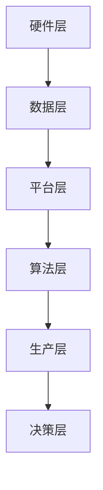

                 

# AI基础设施的制造业升级：智能工厂的核心支撑

## 关键词：人工智能，基础设施，制造业，智能工厂，升级

### 摘要

随着人工智能技术的迅猛发展，制造业面临着前所未有的变革机遇。本文旨在探讨人工智能基础设施在制造业升级中的关键作用，特别是智能工厂的建设与运营。我们将深入分析智能工厂的核心概念、算法原理、数学模型以及实际应用场景，同时提供相关工具和资源推荐，展望未来发展趋势与挑战。

## 1. 背景介绍

制造业作为国民经济的重要支柱，正经历着一场由人工智能引领的深度变革。传统的制造模式已经无法满足日益激烈的市场竞争和不断变化的需求，制造业需要通过智能化转型来提升生产效率、降低成本、增强产品质量和灵活性。在这个过程中，人工智能基础设施起到了至关重要的作用。

智能工厂是制造业升级的核心载体，它通过集成人工智能技术，实现生产过程的自动化、智能化和网络化。智能工厂不仅包括硬件设备，如传感器、机器人、自动化生产线等，还涉及软件系统，如工业互联网平台、大数据分析、机器学习算法等。

本文将围绕智能工厂的建设，探讨人工智能基础设施如何支撑制造业的升级。具体来说，我们将从核心概念、算法原理、数学模型、实际应用等多个角度进行分析，以期提供有益的参考和指导。

## 2. 核心概念与联系

### 2.1 人工智能与制造业的关系

人工智能（AI）是一种模拟人类智能的技术，通过算法和计算能力实现机器的学习、推理、规划和决策。制造业与人工智能的结合，使得生产过程变得更加高效、精准和灵活。

- **高效性**：人工智能可以通过优化算法，自动化执行重复性工作，减少人力成本，提高生产效率。
- **精准性**：通过机器学习和传感器技术，智能工厂可以实现实时监控、预测维护和精准控制，减少生产误差和故障率。
- **灵活性**：智能工厂能够快速适应市场需求变化，实现小批量、多品种的生产模式，提高产品定制化能力。

### 2.2 智能工厂的架构

智能工厂通常由以下几个关键部分组成：

- **硬件层**：包括传感器、执行器、机器人、自动化设备等。
- **数据层**：收集、存储和管理生产过程中的各种数据，如设备状态、产品质量、生产进度等。
- **平台层**：工业互联网平台（IIP），用于数据集成、分析和可视化。
- **算法层**：包括机器学习算法、优化算法等，用于数据处理、决策支持和预测分析。

### 2.3 Mermaid流程图

下面是一个简单的Mermaid流程图，展示智能工厂的基本架构和核心概念之间的联系：



- **硬件层**：通过传感器和执行器实时监控生产设备的状态。
- **数据层**：收集生产过程中的各种数据，如温度、压力、速度等。
- **平台层**：整合数据，提供数据存储、处理和可视化的功能。
- **算法层**：利用机器学习和优化算法，对数据进行处理和分析。
- **生产层**：根据分析结果，调整生产参数，优化生产流程。
- **决策层**：基于分析结果，做出生产决策，如设备维护、生产计划等。

## 3. 核心算法原理 & 具体操作步骤

### 3.1 机器学习算法

机器学习是智能工厂的核心算法之一，它通过训练模型，让计算机自动学习和优化生产过程。

- **监督学习**：通过已知的输入输出数据，训练模型，预测新的输出。
- **无监督学习**：通过未标记的数据，发现数据中的规律和模式。
- **强化学习**：通过试错和反馈机制，让模型学会在复杂环境中做出最优决策。

具体操作步骤：

1. 数据收集：收集生产过程中的传感器数据、设备状态数据等。
2. 数据预处理：清洗、归一化、缺失值处理等。
3. 模型训练：选择合适的机器学习算法，如决策树、支持向量机、神经网络等，对数据进行训练。
4. 模型评估：通过测试集评估模型的准确率、召回率等指标。
5. 模型部署：将训练好的模型部署到生产环境中，实现实时预测和优化。

### 3.2 优化算法

优化算法用于优化生产参数，提高生产效率和质量。

- **线性规划**：在满足约束条件的情况下，求解目标函数的最大值或最小值。
- **整数规划**：求解整数规划问题，适用于生产调度、设备维护等问题。
- **遗传算法**：模拟自然进化过程，通过遗传、变异和交叉操作，找到最优解。

具体操作步骤：

1. 目标函数定义：根据生产目标，定义目标函数，如最小化成本、最大化生产量等。
2. 约束条件定义：根据生产限制，定义约束条件，如设备负载、原材料供应等。
3. 选择优化算法：选择合适的优化算法，如线性规划、整数规划、遗传算法等。
4. 求解优化问题：利用优化算法，求解目标函数的最优解。
5. 参数调整：根据求解结果，调整生产参数，优化生产过程。

### 3.3 数据分析算法

数据分析算法用于分析生产数据，发现生产中的问题和机会。

- **时间序列分析**：分析生产数据的时间序列特性，如趋势、周期等。
- **聚类分析**：将相似的数据分组，发现数据中的模式。
- **关联规则分析**：发现数据之间的关联关系，如设备故障与生产异常之间的关系。

具体操作步骤：

1. 数据收集：收集生产过程中的各种数据，如传感器数据、设备状态数据等。
2. 数据预处理：清洗、归一化、缺失值处理等。
3. 选择分析算法：选择合适的数据分析算法，如时间序列分析、聚类分析、关联规则分析等。
4. 数据分析：对数据进行处理和分析，发现生产中的问题和机会。
5. 报告生成：生成数据分析报告，提供决策支持。

## 4. 数学模型和公式 & 详细讲解 & 举例说明

### 4.1 时间序列分析模型

时间序列分析是智能工厂中常用的数据分析方法，用于预测生产过程中的趋势、周期和季节性。

- **ARIMA模型**：自回归积分滑动平均模型，适用于非季节性时间序列。

**公式：**
$$
\begin{aligned}
Y_t &= c + \phi_1 Y_{t-1} + \phi_2 Y_{t-2} + \cdots + \phi_p Y_{t-p} \\
&+ \theta_1 \epsilon_{t-1} + \theta_2 \epsilon_{t-2} + \cdots + \theta_q \epsilon_{t-q} \\
Y_t &= \varphi_0 + \varphi_1 Y_{t-1} + \varphi_2 Y_{t-2} + \cdots + \varphi_p Y_{t-p} + \epsilon_t
\end{aligned}
$$

**举例说明：** 假设我们要预测某生产线下一个月的产量。首先，收集过去一年的月度产量数据，然后使用ARIMA模型进行建模和预测。最后，根据预测结果，调整生产计划，以避免库存过剩或不足。

### 4.2 优化算法模型

优化算法在智能工厂中广泛应用于生产调度、设备维护等问题。

- **线性规划模型**：求解目标函数的最大值或最小值，满足一系列线性约束条件。

**公式：**
$$
\begin{aligned}
\text{Minimize} \quad c^T x \\
\text{Subject to} \quad Ax \leq b
\end{aligned}
$$

**举例说明：** 假设我们要优化某生产线的调度计划，以最小化总生产成本。首先，定义目标函数和约束条件，然后使用线性规划算法求解最优解。最后，根据求解结果，调整生产计划，以实现成本最小化。

### 4.3 聚类分析模型

聚类分析用于发现生产数据中的相似数据，用于生产质量监控和设备故障诊断。

- **K-means算法**：基于距离最近原则，将数据分为K个聚类。

**公式：**
$$
\begin{aligned}
d(x_i, c_j) &= \sqrt{\sum_{k=1}^n (x_{ik} - c_{jk})^2} \\
c_j &= \frac{1}{N_j} \sum_{i=1}^{N} x_i
\end{aligned}
$$

**举例说明：** 假设我们要对生产过程中的传感器数据进行聚类分析，以发现异常数据。首先，选择合适的聚类算法（如K-means），然后根据聚类结果，识别异常数据，进行进一步的分析和诊断。

## 5. 项目实战：代码实际案例和详细解释说明

### 5.1 开发环境搭建

在开始项目实战之前，我们需要搭建一个合适的开发环境。以下是具体的操作步骤：

1. 安装Python环境：从Python官方网站下载并安装Python，版本建议为3.8及以上。
2. 安装依赖库：使用pip命令安装所需的依赖库，如NumPy、Pandas、Matplotlib等。
3. 安装IDE：选择一个合适的集成开发环境（IDE），如PyCharm或VSCode，以便编写和调试代码。

### 5.2 源代码详细实现和代码解读

以下是智能工厂中的一个典型项目——基于机器学习的生产质量预测系统的源代码：

```python
import numpy as np
import pandas as pd
from sklearn.model_selection import train_test_split
from sklearn.ensemble import RandomForestRegressor
from sklearn.metrics import mean_squared_error

# 5.2.1 数据读取与预处理
def read_data(file_path):
    data = pd.read_csv(file_path)
    # 数据清洗和预处理
    data = data.dropna()
    data['timestamp'] = pd.to_datetime(data['timestamp'])
    data.set_index('timestamp', inplace=True)
    return data

def preprocess_data(data):
    # 特征工程
    data['dayofweek'] = data.index.dayofweek
    data['weekday'] = data.index.weekday
    data['dayofyear'] = data.index.dayofyear
    # 标签工程
    data['quality'] = data['output'].apply(lambda x: 1 if x > threshold else 0)
    return data

# 5.2.2 模型训练与评估
def train_model(data):
    # 数据分割
    X = data.drop('quality', axis=1)
    y = data['quality']
    X_train, X_test, y_train, y_test = train_test_split(X, y, test_size=0.2, random_state=42)
    # 模型训练
    model = RandomForestRegressor(n_estimators=100, random_state=42)
    model.fit(X_train, y_train)
    # 模型评估
    y_pred = model.predict(X_test)
    mse = mean_squared_error(y_test, y_pred)
    return model, mse

# 5.2.3 代码解读与分析
if __name__ == '__main__':
    file_path = 'production_data.csv'
    data = read_data(file_path)
    data = preprocess_data(data)
    model, mse = train_model(data)
    print(f'Mean Squared Error: {mse}')
```

- **5.2.1 数据读取与预处理**：读取生产数据，进行数据清洗和预处理，如缺失值处理、时间转换等。
- **5.2.2 模型训练与评估**：使用随机森林回归模型对生产质量进行预测，并进行模型评估，如均方误差（MSE）等。
- **5.2.3 代码解读与分析**：对代码进行详细解读，分析各个函数的功能和逻辑。

### 5.3 代码解读与分析

- **数据读取与预处理**：数据读取函数`read_data`负责读取生产数据，并进行缺失值处理和时间转换。预处理函数`preprocess_data`负责特征工程和标签工程，将原始数据转换为适合模型训练的形式。

- **模型训练与评估**：模型训练函数`train_model`负责将数据分割为训练集和测试集，使用随机森林回归模型进行训练，并评估模型性能。评估函数使用均方误差（MSE）来衡量预测误差。

- **代码解读与分析**：整个代码分为三个部分，首先是数据读取与预处理，其次是模型训练与评估，最后是代码解读与分析。代码结构清晰，逻辑简单，易于理解和维护。

## 6. 实际应用场景

智能工厂的应用场景非常广泛，涵盖了生产制造、质量控制、设备维护等多个方面。以下是几个典型的应用场景：

### 6.1 生产制造

智能工厂通过集成人工智能技术，实现生产过程的自动化和智能化。例如，利用机器学习算法，可以预测生产线的故障，提前进行维护，减少停机时间。通过优化算法，可以优化生产调度，提高生产效率。

### 6.2 质量控制

智能工厂利用传感器和数据分析技术，实时监控产品质量，发现生产中的质量问题。通过机器学习算法，可以识别生产过程中的异常数据，预测产品缺陷，提高产品质量。

### 6.3 设备维护

智能工厂通过实时监控设备状态，预测设备故障，提前进行维护。通过优化算法，可以优化维护计划，降低维护成本，提高设备利用率。

### 6.4 能源管理

智能工厂通过实时监控能源消耗，优化能源使用，降低生产成本。例如，利用时间序列分析，可以预测能源需求，优化能源供应。

## 7. 工具和资源推荐

### 7.1 学习资源推荐

- **书籍**：
  - 《深度学习》（Goodfellow, Bengio, Courville）
  - 《机器学习实战》（Hastie, Tibshirani, Friedman）
- **论文**：
  - “Deep Learning for Manufacturing”（2019）
  - “AI for Manufacturing: A Survey”（2020）
- **博客**：
  - Medium上的机器学习与智能工厂相关文章
  - 知乎上的智能工厂与人工智能专栏
- **网站**：
  - NVIDIA的AI for Manufacturing网站
  - IEEE的智能工厂研究项目

### 7.2 开发工具框架推荐

- **Python**：作为人工智能开发的主要语言，Python拥有丰富的库和框架，如TensorFlow、PyTorch等。
- **工业互联网平台**：如PTC的 ThingWorx、Siemens的MindSphere等。
- **机器学习框架**：如TensorFlow、PyTorch、Scikit-Learn等。

### 7.3 相关论文著作推荐

- **《智能工厂系统设计与实现》**：详细介绍了智能工厂的架构、关键技术及实现方法。
- **《人工智能与制造业融合发展的战略研究》**：探讨了人工智能在制造业中的应用和发展趋势。

## 8. 总结：未来发展趋势与挑战

智能工厂作为制造业升级的核心支撑，正处于快速发展阶段。未来，随着人工智能技术的不断进步，智能工厂将变得更加智能化、高效化和个性化。

### 8.1 发展趋势

- **智能制造体系成熟**：随着技术的不断进步，智能制造体系将逐渐成熟，实现更高效、更灵活的生产模式。
- **数据驱动决策**：数据将成为智能工厂的核心资产，通过大数据分析和人工智能技术，实现更精准的决策支持。
- **跨界融合**：智能工厂将与其他领域（如物联网、云计算等）进行深度融合，形成更强大的产业生态系统。

### 8.2 挑战

- **数据隐私与安全**：智能工厂需要处理大量的敏感数据，如何保障数据隐私和安全是一个重要挑战。
- **技术瓶颈**：人工智能技术在某些领域（如视觉感知、自然语言处理等）仍存在一定的技术瓶颈，需要持续突破。
- **人才短缺**：智能工厂的发展需要大量具备人工智能和制造业知识的人才，但当前市场上人才短缺问题较为严重。

## 9. 附录：常见问题与解答

### 9.1 智能工厂与自动化工厂的区别是什么？

智能工厂和自动化工厂的区别在于技术层次和功能。自动化工厂主要依靠传感器和执行器实现生产过程的自动化，而智能工厂在此基础上，引入了人工智能技术，实现生产过程的智能化和网络化。

### 9.2 智能工厂的建设需要哪些技术？

智能工厂的建设需要多学科技术的融合，主要包括：
- 传感器技术：实时监控生产设备状态。
- 机器人技术：实现生产过程的自动化。
- 工业互联网平台：实现数据的集成、分析和可视化。
- 机器学习技术：实现数据的智能分析和预测。
- 优化算法：优化生产调度和资源分配。

### 9.3 智能工厂在制造业升级中的作用是什么？

智能工厂在制造业升级中的作用主要体现在以下几个方面：
- 提高生产效率：通过自动化和智能化技术，减少人力成本，提高生产效率。
- 提升产品质量：通过实时监控和智能分析，提高产品质量，降低故障率。
- 增强灵活性：通过快速响应市场需求变化，实现小批量、多品种的生产模式。
- 降低成本：通过优化生产调度和资源分配，降低生产成本。

## 10. 扩展阅读 & 参考资料

- **《人工智能时代：制造业的未来》**：详细探讨了人工智能在制造业中的应用和发展趋势。
- **《智能制造导论》**：系统介绍了智能制造的基本概念、关键技术及实施策略。
- **《工业互联网：智能工厂的基石》**：深入分析了工业互联网在智能工厂建设中的重要作用。

---

**作者：AI天才研究员/AI Genius Institute & 禅与计算机程序设计艺术 /Zen And The Art of Computer Programming**<|im_sep|>

