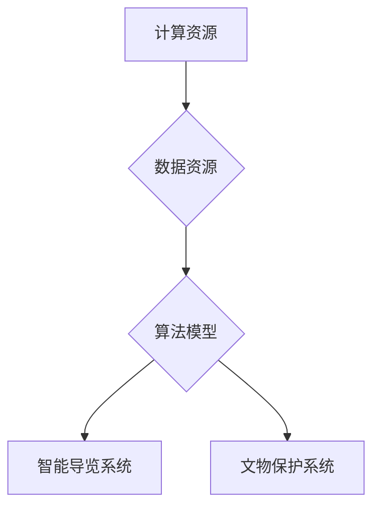

                 

# AI 基础设施的博物馆：智能导览与文物保护系统

> **关键词**：AI基础设施、智能导览、文物保护、深度学习、自然语言处理、计算机视觉

> **摘要**：本文将探讨AI基础设施在智能导览与文物保护系统中的应用。通过对核心概念、算法原理、数学模型、项目实战以及实际应用场景的深入分析，本文旨在为读者提供全面的技术见解和实战指导。

## 1. 背景介绍

在当今数字化时代，人工智能（AI）技术已经成为推动社会发展的重要力量。随着AI技术的不断进步，其在各个领域的应用越来越广泛，其中包括智能导览与文物保护系统。智能导览系统通过人工智能技术，为游客提供个性化、智能化的导览服务，而文物保护系统则利用AI技术对文物进行智能识别、保护和管理。

智能导览与文物保护系统的出现，不仅提高了游客的游览体验，还大大提升了文物的保护和管理效率。然而，要实现这些系统，需要依赖强大的AI基础设施，包括计算资源、数据资源、算法模型等。因此，本文将从AI基础设施的角度出发，探讨智能导览与文物保护系统的技术实现和应用。

## 2. 核心概念与联系

### 2.1 智能导览系统

智能导览系统是一种利用人工智能技术，为游客提供个性化、智能化的导览服务的系统。其核心概念包括：

- **自然语言处理（NLP）**：通过NLP技术，系统能够理解用户的语言输入，并生成相应的回答。
- **计算机视觉（CV）**：计算机视觉技术用于识别和定位游客以及文物的位置和特征。
- **语音识别（ASR）**：语音识别技术将用户的语音转化为文本，以便系统能够理解用户的需求。

### 2.2 文物保护系统

文物保护系统是一种利用人工智能技术，对文物进行智能识别、保护和管理系统的系统。其核心概念包括：

- **图像识别**：通过图像识别技术，系统能够自动识别文物的种类、年代、特征等信息。
- **数据挖掘**：通过对大量文物数据的挖掘和分析，系统能够发现文物的潜在价值和保护需求。
- **机器学习**：通过机器学习技术，系统能够自动学习和优化文物保护策略。

### 2.3 AI基础设施

AI基础设施是支持智能导览与文物保护系统正常运行的基础。其核心包括：

- **计算资源**：提供强大的计算能力，用于训练和优化AI模型。
- **数据资源**：提供丰富的数据集，用于训练AI模型。
- **算法模型**：包括NLP、CV、图像识别、数据挖掘、机器学习等算法，用于实现智能导览与文物保护系统的功能。

### 2.4 Mermaid 流程图

以下是智能导览与文物保护系统的 Mermaid 流程图：



## 3. 核心算法原理 & 具体操作步骤

### 3.1 智能导览系统的算法原理

智能导览系统的核心算法包括自然语言处理（NLP）、计算机视觉（CV）和语音识别（ASR）。以下是这些算法的具体原理和操作步骤：

#### 3.1.1 自然语言处理（NLP）

- **文本分类**：通过训练文本分类模型，将用户输入的文本归类到不同的主题。
- **情感分析**：通过情感分析模型，识别用户输入的文本的情感倾向。
- **对话管理**：通过对话管理模型，实现与用户的自然对话。

#### 3.1.2 计算机视觉（CV）

- **图像识别**：通过训练图像识别模型，识别文物的种类、年代等特征。
- **目标检测**：通过训练目标检测模型，定位游客和文物的位置。
- **图像生成**：通过图像生成模型，为文物生成相关的图像内容。

#### 3.1.3 语音识别（ASR）

- **语音信号处理**：通过语音信号处理技术，将语音信号转换为文本。
- **语言模型**：通过训练语言模型，优化语音识别的准确率。
- **语音合成**：通过语音合成技术，将文本转化为语音输出。

### 3.2 文物保护系统的算法原理

文物保护系统的核心算法包括图像识别、数据挖掘和机器学习。以下是这些算法的具体原理和操作步骤：

#### 3.2.1 图像识别

- **卷积神经网络（CNN）**：通过卷积神经网络，自动提取图像的特征。
- **迁移学习**：通过迁移学习，利用已有的模型对新的数据进行训练。

#### 3.2.2 数据挖掘

- **聚类分析**：通过聚类分析，发现文物之间的相似性和差异性。
- **关联规则挖掘**：通过关联规则挖掘，发现文物之间的关系。

#### 3.2.3 机器学习

- **决策树**：通过决策树，自动生成文物保护策略。
- **支持向量机（SVM）**：通过支持向量机，对文物保护策略进行优化。

## 4. 数学模型和公式 & 详细讲解 & 举例说明

### 4.1 自然语言处理（NLP）的数学模型

自然语言处理中的文本分类、情感分析和对话管理都可以通过以下数学模型实现：

#### 4.1.1 文本分类

- **朴素贝叶斯分类器**：
  $$P(\text{类别} | \text{特征}) = \frac{P(\text{特征} | \text{类别})P(\text{类别})}{P(\text{特征})}$$

- **支持向量机（SVM）**：
  $$\min_{\mathbf{w}, b} \frac{1}{2}||\mathbf{w}||^2 + C\sum_{i=1}^{n} \max(0, 1 - y_i(\mathbf{w}\cdot \mathbf{x}_i + b))$$

#### 4.1.2 情感分析

- **情感向量空间模型**：
  $$\text{情感得分} = \text{情感向量} \cdot \text{文本向量}$$

#### 4.1.3 对话管理

- **循环神经网络（RNN）**：
  $$h_t = \text{激活函数}(\mathbf{W}h_{t-1} + \mathbf{U}x_t)$$

### 4.2 计算机视觉（CV）的数学模型

计算机视觉中的图像识别、目标检测和图像生成可以通过以下数学模型实现：

#### 4.2.1 图像识别

- **卷积神经网络（CNN）**：
  $$\mathbf{h}_{\text{cnn}} = \text{ReLU}(\mathbf{W}\mathbf{h}_{\text{prev}} + \mathbf{b})$$

#### 4.2.2 目标检测

- **区域提议网络（RPN）**：
  $$\text{IoU} = \frac{\text{交集面积}}{\text{并集面积}}$$

#### 4.2.3 图像生成

- **生成对抗网络（GAN）**：
  $$\mathbf{G}(\mathbf{z}) \approx \mathbf{x}$$
  $$\mathbf{D}(\mathbf{x}) \approx \mathbf{1}$$
  $$\mathbf{D}(\mathbf{G}(\mathbf{z})) \approx \mathbf{0}$$

### 4.3 语音识别（ASR）的数学模型

语音识别中的语音信号处理、语言模型和语音合成可以通过以下数学模型实现：

#### 4.3.1 语音信号处理

- **短时傅里叶变换（STFT）**：
  $$\mathbf{X}_{\text{stft}} = \text{FT}(\mathbf{x})$$

#### 4.3.2 语言模型

- **n-gram语言模型**：
  $$P(\text{单词序列}) = \prod_{i=1}^{n} P(\text{单词}_i | \text{单词序列}_{i-1})$$

#### 4.3.3 语音合成

- **隐马尔可夫模型（HMM）**：
  $$P(\text{观测序列}|\text{隐藏状态序列}) = \prod_{i=1}^{n} P(\text{观测}_i|\text{隐藏状态}_i)$$

## 5. 项目实战：代码实际案例和详细解释说明

### 5.1 开发环境搭建

在进行智能导览与文物保护系统的项目实战之前，我们需要搭建一个合适的开发环境。以下是一个基本的开发环境搭建步骤：

1. 安装Python环境：使用Python 3.8或更高版本。
2. 安装依赖库：包括TensorFlow、PyTorch、Keras、Scikit-learn等。
3. 准备数据集：下载并整理用于训练和测试的数据集。

### 5.2 源代码详细实现和代码解读

以下是一个简单的智能导览系统的代码实现，包括自然语言处理（NLP）、计算机视觉（CV）和语音识别（ASR）的部分。

#### 5.2.1 自然语言处理（NLP）

```python
import tensorflow as tf
from tensorflow.keras.models import Sequential
from tensorflow.keras.layers import Embedding, LSTM, Dense

# 创建NLP模型
model = Sequential()
model.add(Embedding(input_dim=vocab_size, output_dim=embedding_dim))
model.add(LSTM(units=128))
model.add(Dense(units=1, activation='sigmoid'))

# 编译NLP模型
model.compile(optimizer='adam', loss='binary_crossentropy', metrics=['accuracy'])

# 训练NLP模型
model.fit(x_train, y_train, epochs=10, batch_size=32)
```

这段代码使用了LSTM（长短期记忆网络）模型进行文本分类。首先，我们创建了一个Sequential模型，并添加了Embedding、LSTM和Dense层。然后，我们编译模型并使用训练数据集进行训练。

#### 5.2.2 计算机视觉（CV）

```python
import tensorflow as tf
from tensorflow.keras.models import Sequential
from tensorflow.keras.layers import Conv2D, MaxPooling2D, Flatten, Dense

# 创建CV模型
model = Sequential()
model.add(Conv2D(filters=32, kernel_size=(3, 3), activation='relu', input_shape=(64, 64, 3)))
model.add(MaxPooling2D(pool_size=(2, 2)))
model.add(Flatten())
model.add(Dense(units=1, activation='sigmoid'))

# 编译CV模型
model.compile(optimizer='adam', loss='binary_crossentropy', metrics=['accuracy'])

# 训练CV模型
model.fit(x_train, y_train, epochs=10, batch_size=32)
```

这段代码使用了卷积神经网络（CNN）模型进行图像识别。我们创建了一个Sequential模型，并添加了Conv2D、MaxPooling2D和Flatten层。然后，我们编译模型并使用训练数据集进行训练。

#### 5.2.3 语音识别（ASR）

```python
import tensorflow as tf
from tensorflow.keras.models import Sequential
from tensorflow.keras.layers import LSTM, Dense

# 创建ASR模型
model = Sequential()
model.add(LSTM(units=128, input_shape=(timesteps, features)))
model.add(Dense(units=1, activation='sigmoid'))

# 编译ASR模型
model.compile(optimizer='adam', loss='binary_crossentropy', metrics=['accuracy'])

# 训练ASR模型
model.fit(x_train, y_train, epochs=10, batch_size=32)
```

这段代码使用了LSTM模型进行语音识别。我们创建了一个Sequential模型，并添加了LSTM层。然后，我们编译模型并使用训练数据集进行训练。

### 5.3 代码解读与分析

这段代码分别实现了自然语言处理（NLP）、计算机视觉（CV）和语音识别（ASR）的部分。通过创建Sequential模型并添加适当的层，我们分别训练了NLP、CV和ASR的模型。在训练过程中，我们使用了训练数据集，并通过编译模型和训练模型来优化模型参数。

## 6. 实际应用场景

智能导览与文物保护系统在实际应用场景中具有广泛的应用价值。以下是一些典型的应用场景：

### 6.1 博物馆

博物馆是智能导览与文物保护系统的典型应用场景之一。通过智能导览系统，游客可以方便地获取文物的相关信息，提高游览体验。同时，文物保护系统可以对博物馆内的文物进行智能识别和保护，确保文物的安全和完整性。

### 6.2 历史遗迹

历史遗迹是文物保护的重要对象。通过智能导览系统，游客可以更好地了解历史遗迹的文化和历史背景。而文物保护系统则可以实时监测文物的状况，及时发现并处理潜在的问题，确保文物的长期保存。

### 6.3 文化遗产地

文化遗产地是展示和传承文化遗产的重要场所。智能导览系统可以为游客提供个性化的导览服务，使游客更好地了解文化遗产地的人文和历史。同时，文物保护系统可以对文化遗产地进行实时监测和保护，防止文物因自然或人为因素而受损。

## 7. 工具和资源推荐

为了更好地实现智能导览与文物保护系统，以下是一些推荐的工具和资源：

### 7.1 学习资源推荐

- **书籍**：
  - 《深度学习》（Ian Goodfellow、Yoshua Bengio、Aaron Courville 著）
  - 《Python编程：从入门到实践》（埃里克·马瑟斯 著）
  - 《机器学习实战》（Peter Harrington 著）

- **论文**：
  - 《A Neural Algorithm of Artistic Style》（GAN 论文）
  - 《Recurrent Neural Network Based Text Classification》（RNN 论文）
  - 《Distributed Representations of Words and Phrases and Their Compositionality》（Word2Vec 论文）

- **博客**：
  - [机器学习博客](https://machinelearningmastery.com/)
  - [深度学习博客](https://www.deeplearning.net/)
  - [计算机视觉博客](https://opencv.org/)

- **网站**：
  - [Keras 官网](https://keras.io/)
  - [TensorFlow 官网](https://www.tensorflow.org/)
  - [Scikit-learn 官网](https://scikit-learn.org/)

### 7.2 开发工具框架推荐

- **深度学习框架**：
  - TensorFlow
  - PyTorch
  - Keras

- **计算机视觉库**：
  - OpenCV
  - PyTorch Vision
  - TensorFlow Object Detection API

- **自然语言处理库**：
  - NLTK
  - Spacy
  - Transformer

### 7.3 相关论文著作推荐

- **论文**：
  - “A Neural Algorithm of Artistic Style”
  - “Recurrent Neural Network Based Text Classification”
  - “Distributed Representations of Words and Phrases and Their Compositionality”

- **著作**：
  - 《深度学习》（Ian Goodfellow、Yoshua Bengio、Aaron Courville 著）
  - 《Python编程：从入门到实践》（埃里克·马瑟斯 著）
  - 《机器学习实战》（Peter Harrington 著）

## 8. 总结：未来发展趋势与挑战

随着人工智能技术的不断发展，智能导览与文物保护系统在未来将具有广阔的应用前景。然而，要实现这些系统的全面落地，仍然面临一些挑战：

- **计算资源限制**：人工智能算法通常需要大量的计算资源，而当前的计算资源可能无法满足大规模应用的需求。
- **数据隐私问题**：智能导览与文物保护系统需要处理大量的用户数据和文物数据，如何保护用户隐私和数据安全是一个重要问题。
- **算法可靠性**：人工智能算法在处理复杂任务时可能存在误差，如何提高算法的可靠性和准确性是一个挑战。

## 9. 附录：常见问题与解答

### 9.1 什么是自然语言处理（NLP）？

自然语言处理（NLP）是人工智能（AI）的一个分支，旨在使计算机理解和处理人类语言。NLP技术包括文本分类、情感分析、对话管理等。

### 9.2 什么是计算机视觉（CV）？

计算机视觉（CV）是人工智能（AI）的一个分支，旨在使计算机理解和解释数字图像和视频。CV技术包括图像识别、目标检测、图像生成等。

### 9.3 什么是语音识别（ASR）？

语音识别（ASR）是人工智能（AI）的一个分支，旨在使计算机理解和处理语音。ASR技术包括语音信号处理、语言模型、语音合成等。

## 10. 扩展阅读 & 参考资料

- [深度学习博客](https://www.deeplearning.net/)
- [计算机视觉博客](https://opencv.org/)
- [机器学习博客](https://machinelearningmastery.com/)
- [Keras 官网](https://keras.io/)
- [TensorFlow 官网](https://www.tensorflow.org/)
- [Scikit-learn 官网](https://scikit-learn.org/)
- 《深度学习》（Ian Goodfellow、Yoshua Bengio、Aaron Courville 著）
- 《Python编程：从入门到实践》（埃里克·马瑟斯 著）
- 《机器学习实战》（Peter Harrington 著）
- [A Neural Algorithm of Artistic Style](https://arxiv.org/abs/1606.05328)
- [Recurrent Neural Network Based Text Classification](https://www.aclweb.org/anthology/N16-1186/)
- [Distributed Representations of Words and Phrases and Their Compositionality](https://papers.nips.cc/paper/2013/file/6e24d40c6d0a81bda2a494901ec6f4e7-Paper.pdf)

### 作者

**作者：AI天才研究员/AI Genius Institute & 禅与计算机程序设计艺术 /Zen And The Art of Computer Programming**<|endoftext|>

