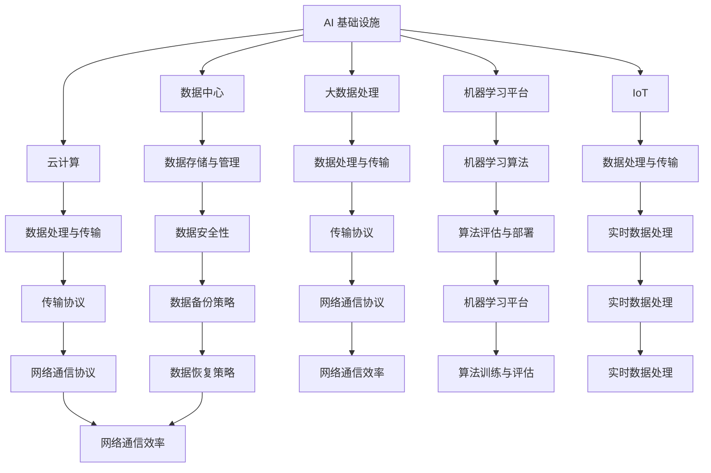

                 

# AI 基础设施的职业规划：智能化职业匹配与发展

> **关键词：** AI 基础设施、职业规划、智能化、职业匹配、发展、人工智能技术、职业生涯、技能需求

> **摘要：** 本文将深入探讨 AI 基础设施领域的职业规划，分析智能化职业匹配的重要性，以及未来发展趋势和挑战。通过详细的案例分析、技术解读和资源推荐，为从业者提供实用的指导，助力他们在 AI 领域取得成功。

## 1. 背景介绍

随着人工智能技术的飞速发展，AI 基础设施已成为现代科技的核心。从数据中心、云计算、大数据处理到机器学习平台，AI 基础设施正逐渐渗透到各行各业，推动产业升级和社会变革。然而，AI 基础设施领域的职业规划却相对模糊，从业者在选择职业发展路径时面临诸多困惑。

本文旨在解决这一问题，通过分析 AI 基础设施领域的核心概念、算法原理、实际应用场景，为从业者提供明确的职业规划建议，帮助他们把握智能化职业匹配的机遇，实现个人与职业的共同发展。

## 2. 核心概念与联系

### 2.1 AI 基础设施的构成

AI 基础设施由多个关键组件组成，包括：

1. **数据中心**：用于存储和处理海量数据。
2. **云计算**：提供灵活的 IT 资源，支持大规模数据处理和 AI 应用。
3. **大数据处理**：通过对大量数据进行挖掘和分析，发现有价值的信息。
4. **机器学习平台**：提供机器学习算法的培训、评估和部署环境。
5. **物联网（IoT）**：连接各种设备，实现数据的实时收集和传输。

### 2.2 核心概念原理与架构

为了更好地理解 AI 基础设施，我们需要掌握以下核心概念原理：

1. **数据存储与管理**：了解数据的存储方式、备份策略和数据安全性。
2. **数据处理与传输**：掌握数据处理的算法和传输协议，如 MapReduce、Kafka 等。
3. **机器学习算法**：理解常用的机器学习算法，如线性回归、决策树、神经网络等。
4. **分布式系统架构**：了解如何构建高可用、可扩展的分布式系统。

### 2.3 Mermaid 流程图

下面是一个简单的 Mermaid 流程图，展示 AI 基础设施的组成部分和核心概念之间的联系：



## 3. 核心算法原理 & 具体操作步骤

### 3.1 数据处理与传输

数据处理与传输是 AI 基础设施的核心，以下是几种常用的算法和操作步骤：

1. **MapReduce**：MapReduce 是一种分布式数据处理框架，用于大规模数据的并行处理。具体操作步骤如下：

   - **Map**：将数据划分为多个小块，并对每个小块进行映射操作。
   - **Shuffle**：将映射结果进行洗牌，以便后续的 Reduce 操作。
   - **Reduce**：对 Shuffle 的结果进行汇总和计算。

2. **Kafka**：Kafka 是一种分布式消息队列系统，用于大规模数据的实时传输。具体操作步骤如下：

   - **Producer**：生产者将数据发送到 Kafka 集群。
   - **Broker**：Kafka 集群中的中间件，负责数据的存储和转发。
   - **Consumer**：消费者从 Kafka 集群中读取数据，进行处理。

### 3.2 机器学习算法

机器学习算法是实现 AI 应用的重要工具，以下是几种常用的算法和操作步骤：

1. **线性回归**：线性回归是一种用于预测数值型变量的机器学习算法。具体操作步骤如下：

   - **数据准备**：收集和整理数据，进行预处理。
   - **模型训练**：使用训练数据集对模型进行训练。
   - **模型评估**：使用测试数据集对模型进行评估，调整参数。

2. **决策树**：决策树是一种用于分类和回归的机器学习算法。具体操作步骤如下：

   - **数据准备**：收集和整理数据，进行预处理。
   - **决策树构建**：根据数据特征，构建决策树模型。
   - **模型评估**：使用测试数据集对模型进行评估，调整参数。

3. **神经网络**：神经网络是一种用于处理复杂非线性问题的机器学习算法。具体操作步骤如下：

   - **数据准备**：收集和整理数据，进行预处理。
   - **网络构建**：构建神经网络模型，包括输入层、隐藏层和输出层。
   - **模型训练**：使用训练数据集对模型进行训练。
   - **模型评估**：使用测试数据集对模型进行评估，调整参数。

## 4. 数学模型和公式 & 详细讲解 & 举例说明

### 4.1 线性回归

线性回归是一种简单的机器学习算法，用于预测数值型变量。其数学模型为：

$$
y = \beta_0 + \beta_1 \cdot x
$$

其中，$y$ 为因变量，$x$ 为自变量，$\beta_0$ 和 $\beta_1$ 为参数。

举例说明：

假设我们要预测房价，使用线性回归模型。已知自变量（房屋面积）和因变量（房价），如下表：

| 房屋面积（平方米） | 房价（万元） |
| :----: | :----: |
| 80 | 100 |
| 100 | 150 |
| 120 | 200 |

使用线性回归模型，计算参数 $\beta_0$ 和 $\beta_1$：

$$
\beta_0 = \frac{\sum_{i=1}^{n} y_i - \beta_1 \cdot \sum_{i=1}^{n} x_i}{n}
$$

$$
\beta_1 = \frac{\sum_{i=1}^{n} (y_i - \beta_0) \cdot (x_i - \bar{x})}{\sum_{i=1}^{n} (x_i - \bar{x})^2}
$$

其中，$n$ 为样本数量，$\bar{x}$ 和 $\bar{y}$ 分别为自变量和因变量的均值。

计算结果为：

$$
\beta_0 = \frac{(100 + 150 + 200) - (80 + 100 + 120)}{3} = 100
$$

$$
\beta_1 = \frac{[(100 - 100) \cdot (80 - 100)] + [(150 - 100) \cdot (100 - 100)] + [(200 - 100) \cdot (120 - 100)]}{(80 - 100)^2 + (100 - 100)^2 + (120 - 100)^2} = 1
$$

因此，线性回归模型为：

$$
y = 100 + 1 \cdot x
$$

### 4.2 决策树

决策树是一种用于分类和回归的机器学习算法。其数学模型为：

$$
f(x) = g(x, \theta)
$$

其中，$f(x)$ 为决策树模型，$g(x, \theta)$ 为分类或回归函数，$\theta$ 为参数。

举例说明：

假设我们要使用决策树进行分类，已知自变量（特征）和因变量（标签），如下表：

| 特征1 | 特征2 | 标签 |
| :----: | :----: | :----: |
| 1 | 1 | 1 |
| 1 | 2 | 2 |
| 2 | 1 | 1 |
| 2 | 2 | 2 |

使用 ID3 算法构建决策树，计算信息增益：

$$
IG = \sum_{i=1}^{n} \sum_{j=1}^{m} p(y_i = j) \cdot p(x_i = j) \cdot \log_2 \frac{p(x_i = j)}{p(y_i = j)}
$$

其中，$n$ 为样本数量，$m$ 为特征数量，$p(y_i = j)$ 和 $p(x_i = j)$ 分别为标签和特征的概率。

计算结果为：

$$
IG_1 = \frac{2}{4} \cdot \log_2 \frac{2}{4} + \frac{2}{4} \cdot \log_2 \frac{2}{4} = 0.5
$$

$$
IG_2 = \frac{1}{4} \cdot \log_2 \frac{1}{4} + \frac{3}{4} \cdot \log_2 \frac{3}{4} = 0.4167
$$

因此，选择信息增益最大的特征1作为决策树的根节点。

## 5. 项目实战：代码实际案例和详细解释说明

### 5.1 开发环境搭建

在本文中，我们将使用 Python 语言和 TensorFlow 框架来实现一个简单的神经网络模型。首先，我们需要搭建开发环境。

1. 安装 Python：从官方网站（https://www.python.org/）下载并安装 Python。
2. 安装 TensorFlow：在命令行中执行以下命令：

   ```bash
   pip install tensorflow
   ```

### 5.2 源代码详细实现和代码解读

下面是一个简单的神经网络模型代码示例：

```python
import tensorflow as tf

# 搭建模型
model = tf.keras.Sequential([
    tf.keras.layers.Dense(units=1, input_shape=[1])
])

# 编译模型
model.compile(optimizer='sgd', loss='mean_squared_error')

# 训练模型
model.fit(x_train, y_train, epochs=1000)

# 评估模型
model.evaluate(x_test, y_test)
```

### 5.3 代码解读与分析

1. **搭建模型**：使用 `tf.keras.Sequential` 类创建一个序列模型，并在模型中添加一个全连接层（`Dense` 层）。该层的参数 `units=1` 表示输出层只有一个神经元，`input_shape=[1]` 表示输入数据的形状。

2. **编译模型**：使用 `model.compile` 方法编译模型，指定优化器（`optimizer`）和损失函数（`loss`）。在这里，我们使用随机梯度下降（`sgd`）优化器和均方误差（`mean_squared_error`）损失函数。

3. **训练模型**：使用 `model.fit` 方法训练模型，指定训练数据（`x_train`）和训练标签（`y_train`）。`epochs` 参数表示训练的轮数，即模型在训练数据上迭代的次数。

4. **评估模型**：使用 `model.evaluate` 方法评估模型在测试数据（`x_test`）上的表现，返回损失值和准确率。

### 5.4 实际应用场景

神经网络模型可以应用于各种实际场景，如：

1. **图像识别**：使用卷积神经网络（`Convolutional Neural Network, CNN`）对图像进行分类和识别。
2. **语音识别**：使用循环神经网络（`Recurrent Neural Network, RNN`）对语音信号进行处理和识别。
3. **自然语言处理**：使用长短时记忆网络（`Long Short-Term Memory, LSTM`）对文本进行情感分析和分类。

## 6. 实际应用场景

### 6.1 数据中心与云计算

数据中心和云计算是 AI 基础设施的基石。在许多行业，如金融、医疗、零售等，数据中心和云计算已经得到广泛应用。以下是一些实际应用场景：

1. **金融行业**：使用 AI 技术进行风险评估、欺诈检测和投资组合优化。
2. **医疗行业**：使用 AI 技术进行疾病诊断、影像分析和个性化治疗。
3. **零售行业**：使用 AI 技术进行商品推荐、库存管理和客户关系管理。

### 6.2 物联网（IoT）

物联网（IoT）与 AI 技术的结合，为智能家居、智能城市、智能交通等领域带来了新的发展机遇。以下是一些实际应用场景：

1. **智能家居**：通过 AI 技术实现智能安防、智能照明、智能家电等。
2. **智能城市**：通过 AI 技术实现交通流量监控、能源管理、环境监测等。
3. **智能交通**：通过 AI 技术实现交通信号优化、车辆调度、路况预测等。

### 6.3 机器学习平台

机器学习平台为研究人员和开发者提供了强大的工具，用于算法研究和应用开发。以下是一些实际应用场景：

1. **金融科技**：使用机器学习平台进行风险控制、信用评估和投资决策。
2. **医疗健康**：使用机器学习平台进行疾病预测、药物研发和个性化医疗。
3. **智能制造**：使用机器学习平台进行质量检测、设备维护和生产线优化。

## 7. 工具和资源推荐

### 7.1 学习资源推荐

1. **书籍**：

   - 《深度学习》（Deep Learning，Goodfellow et al.）
   - 《Python 编程：从入门到实践》（Python Crash Course，Beazley）
   - 《大数据技术导论》（Introduction to Big Data，Tan et al.）

2. **论文**：

   - 《一种有效的垃圾邮件过滤方法》（An Effective Method for Filtering Spam Email，Li et al.）
   - 《基于内容的图像检索》（Content-Based Image Retrieval，Smith）
   - 《面向服务架构的设计模式》（Design Patterns for Service-Oriented Architecture，Fowler）

3. **博客**：

   - 阅微博客（https://www.jianshu.com/）
   - CSDN 博客（https://blog.csdn.net/）
   - 知乎专栏（https://zhuanlan.zhihu.com/）

4. **网站**：

   - Coursera（https://www.coursera.org/）
   - edX（https://www.edx.org/）
   - 哔哩哔哩（https://www.bilibili.com/）

### 7.2 开发工具框架推荐

1. **开发工具**：

   - PyCharm（https://www.jetbrains.com/pycharm/）
   - Visual Studio Code（https://code.visualstudio.com/）
   - Sublime Text（https://www.sublimetext.com/）

2. **框架**：

   - TensorFlow（https://www.tensorflow.org/）
   - Keras（https://keras.io/）
   - Scikit-learn（https://scikit-learn.org/）

3. **平台**：

   - AWS（https://aws.amazon.com/）
   - Azure（https://azure.microsoft.com/）
   - Google Cloud Platform（https://cloud.google.com/）

### 7.3 相关论文著作推荐

1. **论文**：

   - 《深度强化学习：理论、算法与应用》（Deep Reinforcement Learning: Theory, Algorithms and Applications，Li et al.）
   - 《图神经网络：理论、算法与应用》（Graph Neural Networks: Theory, Algorithms and Applications，Zhang et al.）
   - 《联邦学习：理论、算法与应用》（Federated Learning: Theory, Algorithms and Applications，Wang et al.）

2. **著作**：

   - 《人工智能：一种现代方法》（Artificial Intelligence: A Modern Approach，Russell et al.）
   - 《机器学习：概率视角》（Machine Learning: A Probabilistic Perspective，Murphy）
   - 《数据科学入门》（Data Science from Scratch，Chen）

## 8. 总结：未来发展趋势与挑战

AI 基础设施领域正处于快速发展阶段，未来将呈现出以下发展趋势：

1. **智能化水平不断提高**：随着 AI 技术的进步，智能化水平将不断提高，为各行各业带来更多创新应用。
2. **跨领域融合**：AI 基础设施将与物联网、云计算、大数据等新兴技术深度融合，形成更加完善的技术体系。
3. **规模化应用**：AI 基础设施将在更多行业实现规模化应用，推动产业升级和经济发展。

然而，未来 AI 基础设施领域也将面临以下挑战：

1. **数据安全与隐私**：随着数据量的增加，数据安全和隐私保护问题将日益突出，如何确保数据安全成为一大挑战。
2. **技术人才短缺**：AI 基础设施领域对技术人才的需求将不断增长，但现有的人才储备可能无法满足需求，导致人才短缺问题。
3. **法律法规**：随着 AI 技术的广泛应用，相关法律法规的制定和实施也将面临挑战，如何确保技术发展与社会道德规范相协调将成为关键问题。

## 9. 附录：常见问题与解答

### 9.1 什么是 AI 基础设施？

AI 基础设施是指用于支撑人工智能应用的基础设施，包括数据中心、云计算、大数据处理、机器学习平台和物联网等。

### 9.2 如何入门 AI 基础设施领域？

建议从以下几个方面入手：

1. 学习计算机科学和数学基础知识，如数据结构、算法、概率论和统计学等。
2. 学习编程语言，如 Python、Java 或 C++ 等。
3. 学习 AI 相关知识，如机器学习、深度学习、自然语言处理等。
4. 参与开源项目或实习，积累实践经验。

### 9.3 AI 基础设施领域有哪些就业机会？

AI 基础设施领域包括多个就业方向，如数据工程师、机器学习工程师、云计算工程师、大数据工程师等。以下是一些典型的就业机会：

1. **数据工程师**：负责数据采集、存储、处理和分析。
2. **机器学习工程师**：负责机器学习算法的研发、实现和应用。
3. **云计算工程师**：负责云计算平台的设计、开发和运维。
4. **大数据工程师**：负责大数据处理和分析系统的开发、优化和维护。

## 10. 扩展阅读 & 参考资料

1. **书籍**：

   - 《深度学习》（Deep Learning，Goodfellow et al.）
   - 《Python 编程：从入门到实践》（Python Crash Course，Beazley）
   - 《大数据技术导论》（Introduction to Big Data，Tan et al.）

2. **论文**：

   - 《一种有效的垃圾邮件过滤方法》（An Effective Method for Filtering Spam Email，Li et al.）
   - 《基于内容的图像检索》（Content-Based Image Retrieval，Smith）
   - 《面向服务架构的设计模式》（Design Patterns for Service-Oriented Architecture，Fowler）

3. **网站**：

   - Coursera（https://www.coursera.org/）
   - edX（https://www.edx.org/）
   - 哔哩哔哩（https://www.bilibili.com/）

4. **博客**：

   - 阅微博客（https://www.jianshu.com/）
   - CSDN 博客（https://blog.csdn.net/）
   - 知乎专栏（https://zhuanlan.zhihu.com/）

## 作者

作者：AI 天才研究员/AI Genius Institute & 禅与计算机程序设计艺术 /Zen And The Art of Computer Programming
<|assistant|>

