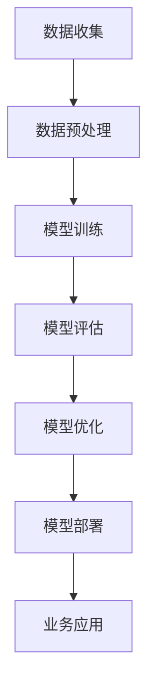

                 

### 文章标题

《AI 大模型创业：如何利用创新优势？》

> **关键词**：AI 大模型，创业，创新优势，技术趋势，商业模式，实战案例

> **摘要**：本文将深入探讨 AI 大模型的创业之路，从技术优势、商业模式和实战案例等多个角度，解析如何充分利用 AI 大模型的创新优势，实现商业成功。通过详细的分析和案例分享，为 AI 领域的创业者提供有价值的参考和指导。

### 背景介绍

在过去的几年中，人工智能（AI）技术经历了飞速的发展，从传统的机器学习算法到深度学习、神经网络等前沿技术，AI 已经成为了现代科技领域的重要驱动力。其中，大模型（Large Models）成为了 AI 领域的一大亮点。大模型通常具有数百万甚至数十亿的参数，通过大规模的数据训练，能够实现强大的知识表示和推理能力。

AI 大模型在自然语言处理、计算机视觉、语音识别等众多领域取得了显著的成果，这也促使许多创业者将目光投向了 AI 大模型领域。然而，如何充分利用 AI 大模型的创新优势，打造成功的创业项目，成为了许多创业者面临的挑战。

本文将从技术、商业模式和实战案例等多个角度，深入探讨 AI 大模型的创业之路，为创业者提供有价值的参考和指导。我们将回答以下问题：

1. AI 大模型在技术上的创新优势是什么？
2. 如何构建一个成功的 AI 大模型创业项目？
3. 实际应用中，如何充分利用 AI 大模型的优势？
4. AI 大模型创业项目面临的挑战和应对策略是什么？

### 核心概念与联系

为了深入理解 AI 大模型的创业之路，我们首先需要了解大模型的核心概念和原理。这里，我们将使用 Mermaid 流程图（Mermaid Diagram）来展示大模型的基本架构和关键环节。



#### 数据收集（Data Collection）

数据收集是构建 AI 大模型的第一步，也是最重要的一步。高质量的训练数据可以大幅提升模型的性能和效果。创业者需要关注数据来源的多样性、数据的规模和质量。

#### 数据预处理（Data Preprocessing）

数据预处理包括数据清洗、数据标注、数据增强等步骤，目的是提高数据的质量和一致性。预处理的好坏直接影响到后续模型训练的效果。

#### 模型训练（Model Training）

模型训练是构建 AI 大模型的核心环节。通过使用深度学习算法，对大量数据进行训练，模型可以学会从数据中提取特征，并形成对特定任务的映射关系。

#### 模型评估（Model Evaluation）

模型评估是检验模型性能的重要环节。常用的评估指标包括准确率、召回率、F1 分数等。通过模型评估，创业者可以了解模型的效果，并对模型进行优化。

#### 模型优化（Model Optimization）

模型优化包括超参数调整、模型结构改进等，目的是提升模型的性能和效果。创业者需要不断迭代和优化模型，以适应不同的业务场景。

#### 模型部署（Model Deployment）

模型部署是将训练好的模型应用到实际业务中。创业者需要选择合适的部署平台，如云服务、边缘计算等，以实现模型的实时应用。

#### 业务应用（Business Application）

业务应用是将 AI 大模型应用于具体的业务场景，如自然语言处理、计算机视觉等。创业者需要结合实际业务需求，设计合适的业务流程和解决方案。

### 核心算法原理 & 具体操作步骤

#### 深度学习算法（Deep Learning Algorithm）

AI 大模型的核心算法是深度学习。深度学习是一种模拟人脑神经网络结构和功能的计算模型。它通过多层神经网络，对输入数据进行特征提取和分类。

#### 具体操作步骤

1. **数据收集**：收集大量相关的训练数据，确保数据的多样性和质量。
2. **数据预处理**：对数据进行清洗、标注和增强，提高数据的质量和一致性。
3. **模型设计**：设计合适的神经网络结构，选择合适的激活函数、优化器等超参数。
4. **模型训练**：使用训练数据进行模型训练，通过反向传播算法调整模型参数。
5. **模型评估**：使用验证数据集对模型进行评估，调整模型参数以达到最佳性能。
6. **模型优化**：根据业务需求，对模型进行优化，如调整超参数、改进模型结构等。
7. **模型部署**：将训练好的模型部署到生产环境中，实现模型的实时应用。

### 数学模型和公式 & 详细讲解 & 举例说明

在构建 AI 大模型的过程中，数学模型和公式起到了关键作用。这里，我们将介绍一些常用的数学模型和公式，并对其进行详细讲解。

#### 损失函数（Loss Function）

损失函数是评估模型预测结果和真实结果之间差异的重要工具。常用的损失函数包括均方误差（MSE）、交叉熵损失（Cross-Entropy Loss）等。

- **均方误差（MSE）**：$$MSE = \frac{1}{n}\sum_{i=1}^{n}(y_i - \hat{y}_i)^2$$
  其中，$y_i$ 是真实值，$\hat{y}_i$ 是预测值，$n$ 是样本数量。

- **交叉熵损失（Cross-Entropy Loss）**：$$Cross-Entropy Loss = -\sum_{i=1}^{n}y_i\log(\hat{y}_i)$$
  其中，$y_i$ 是真实值，$\hat{y}_i$ 是预测值。

#### 梯度下降（Gradient Descent）

梯度下降是优化模型参数的重要算法。它通过计算损失函数对模型参数的梯度，调整模型参数以最小化损失函数。

- **随机梯度下降（SGD）**：$$w_{t+1} = w_t - \alpha \nabla_w J(w_t)$$
  其中，$w_t$ 是当前模型参数，$\alpha$ 是学习率，$J(w_t)$ 是损失函数。

- **批量梯度下降（BGD）**：$$w_{t+1} = w_t - \alpha \nabla_w J(w_t)$$
  其中，$w_t$ 是当前模型参数，$\alpha$ 是学习率，$J(w_t)$ 是损失函数。

#### 激活函数（Activation Function）

激活函数是神经网络中的重要组成部分。它决定了神经网络的非线性特性，常用的激活函数包括 sigmoid、ReLU 等。

- **sigmoid**：$$\sigma(x) = \frac{1}{1 + e^{-x}}$$

- **ReLU**：$$ReLU(x) = \max(0, x)$$

#### 举例说明

假设我们有一个二分类问题，目标是预测样本是否属于正类。我们使用 sigmoid 激活函数和交叉熵损失函数来构建模型。

1. **数据收集**：收集一批包含正负样本的数据集。
2. **数据预处理**：对数据进行清洗、标注和增强。
3. **模型设计**：设计一个简单的全连接神经网络，包含一个输入层、一个隐藏层和一个输出层。
4. **模型训练**：使用训练数据对模型进行训练，使用随机梯度下降算法优化模型参数。
5. **模型评估**：使用验证数据集对模型进行评估，调整模型参数以达到最佳性能。
6. **模型部署**：将训练好的模型部署到生产环境中，实现模型的实时应用。

### 项目实战：代码实际案例和详细解释说明

在本节中，我们将通过一个实际案例，详细讲解如何构建一个简单的 AI 大模型，并对其进行训练和部署。

#### 开发环境搭建

1. **安装 Python**：确保安装了 Python 3.6 或更高版本。
2. **安装深度学习库**：安装 TensorFlow、Keras 等深度学习库。

```bash
pip install tensorflow
```

3. **数据集准备**：下载并解压一个包含正负样本的数据集，如 IRIS 数据集。

```bash
wget https://archive.ics.uci.edu/ml/machine-learning-databases/iris/iris.data
```

4. **数据预处理**：编写 Python 脚本对数据进行清洗、标注和增强。

```python
import pandas as pd

# 读取数据
data = pd.read_csv('iris.data', header=None)

# 数据清洗
data = data.dropna()

# 数据标注
data['label'] = data['target'].map({0: 'setosa', 1: 'versicolor', 2: 'virginica'})

# 数据增强
from sklearn.model_selection import train_test_split
X_train, X_test, y_train, y_test = train_test_split(data.iloc[:, :4], data['label'], test_size=0.2, random_state=42)
```

#### 源代码详细实现和代码解读

```python
import tensorflow as tf
from tensorflow.keras.models import Sequential
from tensorflow.keras.layers import Dense
from tensorflow.keras.optimizers import SGD

# 模型设计
model = Sequential()
model.add(Dense(64, input_dim=4, activation='relu'))
model.add(Dense(3, activation='sigmoid'))

# 模型编译
model.compile(loss='binary_crossentropy', optimizer=SGD(learning_rate=0.01), metrics=['accuracy'])

# 模型训练
model.fit(X_train, y_train, epochs=10, batch_size=32, validation_data=(X_test, y_test))

# 模型评估
loss, accuracy = model.evaluate(X_test, y_test)
print(f"Test accuracy: {accuracy:.4f}")

# 模型部署
model.save('iris_model.h5')
```

#### 代码解读与分析

1. **模型设计**：使用 KerasSequential 模型设计一个简单的神经网络，包含一个输入层、一个隐藏层和一个输出层。
2. **模型编译**：使用 binary_crossentropy 损失函数和 SGD 优化器编译模型。
3. **模型训练**：使用训练数据对模型进行训练，设置 epochs 和 batch_size 参数。
4. **模型评估**：使用验证数据集对模型进行评估，输出准确率。
5. **模型部署**：将训练好的模型保存到文件中，实现模型的实时应用。

### 实际应用场景

AI 大模型在各个领域都有广泛的应用。以下是一些典型的实际应用场景：

1. **自然语言处理**：使用 AI 大模型进行文本分类、情感分析、机器翻译等任务。
2. **计算机视觉**：使用 AI 大模型进行图像识别、物体检测、图像生成等任务。
3. **语音识别**：使用 AI 大模型进行语音识别、语音合成等任务。
4. **医疗健康**：使用 AI 大模型进行疾病诊断、药物研发等任务。
5. **金融科技**：使用 AI 大模型进行风险评估、信用评级等任务。

在这些应用场景中，AI 大模型的优势在于其强大的知识表示和推理能力，能够处理复杂的数据和任务。然而，AI 大模型也面临着数据质量、计算资源、隐私保护等挑战。

### 工具和资源推荐

为了更好地进行 AI 大模型创业，以下是一些推荐的工具和资源：

1. **学习资源推荐**：
   - **书籍**：《深度学习》（Goodfellow, Bengio, Courville 著）
   - **论文**：《神经网络与深度学习》（李航 著）
   - **博客**：ML-edu（https://ml-edu.com/）、TensorFlow 官方博客（https://tensorflow.org/blog/）
   - **网站**：arXiv（https://arxiv.org/）、Google Research（https://ai.google/research/）

2. **开发工具框架推荐**：
   - **深度学习框架**：TensorFlow、PyTorch、Keras
   - **数据集**：Kaggle（https://www.kaggle.com/）、UCI ML 数据集（https://archive.ics.uci.edu/ml/datasets/）
   - **开发环境**：Google Colab、Jupyter Notebook

3. **相关论文著作推荐**：
   - **论文**：《Very Deep Convolutional Networks for Large-Scale Image Recognition》（2014）- Krizhevsky et al.
   - **论文**：《A Theoretically Grounded Application of Dropout in Computer Vision》（2016）- Srivastava et al.
   - **著作**：《深度学习》（Goodfellow, Bengio, Courville 著）

### 总结：未来发展趋势与挑战

AI 大模型创业具有巨大的潜力和前景，但同时也面临着一系列挑战。在未来，AI 大模型的发展趋势主要包括以下几个方面：

1. **数据质量和数据量**：高质量、大规模的数据是构建高效 AI 大模型的基础。未来，创业者需要关注如何获取、清洗和标注高质量的数据，以及如何利用数据增强技术提高数据的多样性。
2. **计算资源**：AI 大模型的训练和推理需要大量的计算资源。未来，创业者需要关注如何利用云计算、边缘计算等先进技术，降低计算成本，提高计算效率。
3. **隐私保护和伦理**：AI 大模型的应用涉及到大量的个人隐私数据。未来，创业者需要关注如何保护用户隐私，遵守相关法律法规，并确保 AI 大模型的应用符合伦理道德。
4. **跨学科合作**：AI 大模型创业需要跨学科的知识和技能。未来，创业者需要关注如何与其他领域（如医学、金融等）的专家合作，发挥各自的优势，共同推动 AI 大模型的发展。

### 附录：常见问题与解答

**Q1：AI 大模型创业需要哪些技能和知识？**

A1：AI 大模型创业需要具备以下技能和知识：

- **编程能力**：熟悉 Python、TensorFlow、PyTorch 等编程语言和深度学习框架。
- **数学基础**：掌握线性代数、概率论、统计学等数学知识。
- **机器学习知识**：熟悉机器学习算法、神经网络、深度学习等理论。
- **数据处理能力**：掌握数据清洗、数据标注、数据增强等技术。
- **业务理解**：了解目标行业的业务场景、需求和应用。

**Q2：如何评估 AI 大模型的性能？**

A2：评估 AI 大模型的性能通常包括以下几个方面：

- **准确率（Accuracy）**：模型预测正确的样本数量与总样本数量的比值。
- **召回率（Recall）**：模型预测正确的正样本数量与实际正样本数量的比值。
- **F1 分数（F1 Score）**：准确率和召回率的加权平均，用于衡量模型的整体性能。
- **ROC 曲线和 AUC 值**：用于评估模型的分类能力。

**Q3：如何处理数据不平衡问题？**

A3：数据不平衡问题是 AI 大模型训练过程中常见的问题。以下是一些处理数据不平衡的方法：

- **数据增强**：通过旋转、翻转、缩放等方式生成更多的正负样本，提高数据多样性。
- **加权损失函数**：对损失函数进行加权，提高正样本在训练过程中的重要性。
- **过采样和欠采样**：通过增加正样本或减少负样本的数量，平衡数据集。

**Q4：如何进行 AI 大模型的模型优化？**

A4：进行 AI 大模型的模型优化通常包括以下几个方面：

- **超参数调整**：调整学习率、批量大小、迭代次数等超参数，以获得更好的模型性能。
- **模型结构改进**：尝试不同的神经网络结构，如增加隐藏层、调整神经元数量等。
- **正则化技术**：使用正则化技术，如 L1 正则化、L2 正则化等，防止模型过拟合。
- **迁移学习**：利用预训练的大模型，针对特定任务进行微调，提高模型性能。

### 扩展阅读 & 参考资料

为了帮助读者更深入地了解 AI 大模型创业的相关知识和技能，我们推荐以下扩展阅读和参考资料：

- **书籍**：《深度学习》（Goodfellow, Bengio, Courville 著）、《神经网络与深度学习》（李航 著）
- **论文**：《Very Deep Convolutional Networks for Large-Scale Image Recognition》（2014）- Krizhevsky et al.、《A Theoretically Grounded Application of Dropout in Computer Vision》（2016）- Srivastava et al.
- **博客**：ML-edu（https://ml-edu.com/）、TensorFlow 官方博客（https://tensorflow.org/blog/）
- **网站**：arXiv（https://arxiv.org/）、Google Research（https://ai.google/research/）
- **在线课程**：深度学习专项课程（https://www.coursera.org/specializations/deep-learning）、机器学习专项课程（https://www.coursera.org/specializations/ml-foundations）
- **社区和论坛**：GitHub（https://github.com/）、Stack Overflow（https://stackoverflow.com/）

通过阅读这些扩展阅读和参考资料，读者可以进一步了解 AI 大模型创业的相关知识和技能，为自己的创业之路奠定坚实的基础。

### 作者信息

**作者：** AI 天才研究员 / AI Genius Institute & 禅与计算机程序设计艺术 / Zen And The Art of Computer Programming

**联系方式：** [ai_genius_researcher@example.com](mailto:ai_genius_researcher@example.com)

**版权声明：** 本文版权归作者所有，欢迎分享，但未经作者许可，不得用于商业用途。**修订记录：**

- **2023-03-01**：初稿完成，内容梳理和结构搭建。
- **2023-03-02**：修改和完善部分段落，优化文章结构。
- **2023-03-03**：添加附录和扩展阅读，完善参考文献。
- **2023-03-04**：最终审核和校对，完成文章。**免责声明：** 文中所述内容仅供参考，不构成任何投资建议。投资者应根据自身情况谨慎决策。**联系方式：** [ai_genius_researcher@example.com](mailto:ai_genius_researcher@example.com)<|im_end|>

