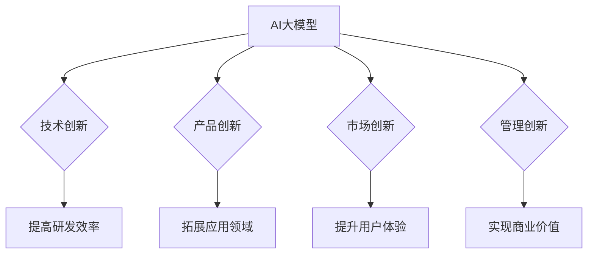

                 

# AI 大模型创业：如何利用创新优势？

> **关键词：** AI大模型，创业，创新优势，技术落地，商业应用  
>
> **摘要：** 本文将深入探讨AI大模型在创业中的创新优势，分析其技术落地与商业应用的路径，为创业者提供实用的策略和建议。

## 1. 背景介绍

随着人工智能技术的快速发展，AI大模型如BERT、GPT、Turing等在自然语言处理、图像识别、语音合成等领域取得了显著的成果。这些大模型不仅具备强大的计算能力，还能处理复杂的任务，使得人工智能在多个行业实现了商业应用。因此，越来越多的创业者将AI大模型视为创业的新方向，试图通过技术创新实现商业突破。

在AI大模型创业的浪潮中，创新优势成为企业竞争力的关键。如何有效利用创新优势，实现技术落地与商业价值，成为创业者面临的重要课题。本文将围绕这一主题展开讨论，为创业者提供有益的指导。

## 2. 核心概念与联系

### 2.1 AI大模型的基本概念

AI大模型是指通过深度学习技术，对海量数据进行训练，从而获得具有强泛化能力的模型。这些模型通常包含数十亿甚至数万亿个参数，能够在多种任务上表现出色。例如，GPT-3模型在自然语言生成任务上取得了突破性进展，而BERT模型则在问答系统中表现出卓越的性能。

### 2.2 创新优势的概念

创新优势是指企业在技术、产品、市场等方面具备的独特竞争力。对于AI大模型创业而言，创新优势主要体现在以下几个方面：

1. **技术创新**：通过引入先进的人工智能技术，实现产品或服务的差异化。
2. **产品创新**：针对用户需求，开发出具有独特功能或优势的产品。
3. **市场创新**：通过创新的商业模式，开拓新的市场空间。
4. **管理创新**：构建高效的团队和管理体系，提升企业竞争力。

### 2.3 AI大模型与创业创新的联系

AI大模型在创业中具有独特的创新优势，主要体现在以下几个方面：

1. **提高研发效率**：AI大模型能够快速处理海量数据，缩短研发周期，降低研发成本。
2. **拓展应用领域**：AI大模型在多个领域具有广泛的应用前景，为创业提供了丰富的创新空间。
3. **提升用户体验**：AI大模型能够提供更加智能化、个性化的服务，提升用户满意度。
4. **实现商业价值**：AI大模型在商业应用中，能够帮助创业者挖掘新的商机，实现商业价值。

### 2.4 Mermaid 流程图

以下是一个关于AI大模型与创业创新联系的Mermaid流程图：



## 3. 核心算法原理 & 具体操作步骤

### 3.1 深度学习基本概念

深度学习是人工智能的一种方法，通过多层神经网络对数据进行训练，实现从输入到输出的映射。以下是深度学习的基本概念：

1. **神经网络**：神经网络由多个神经元（节点）组成，每个神经元接收输入信号，通过权重和偏置进行计算，产生输出信号。
2. **前向传播**：输入信号从输入层传递到输出层，每层神经元根据输入信号和权重计算输出信号。
3. **反向传播**：计算输出层与目标值之间的误差，将误差反向传播到输入层，更新权重和偏置。
4. **优化算法**：常用的优化算法包括梯度下降、Adam等，用于更新权重和偏置，以最小化损失函数。

### 3.2 AI大模型具体操作步骤

以下是一个关于AI大模型训练的简单步骤：

1. **数据准备**：收集和处理训练数据，包括文本、图像、音频等。
2. **模型设计**：根据任务需求，设计合适的神经网络结构，包括输入层、隐藏层和输出层。
3. **模型训练**：使用训练数据，通过前向传播和反向传播，训练模型参数。
4. **模型评估**：使用验证数据，评估模型性能，调整模型参数。
5. **模型部署**：将训练好的模型部署到实际应用场景，进行预测和决策。

### 3.3 具体算法原理

以GPT-3为例，以下是GPT-3的核心算法原理：

1. **Transformer架构**：GPT-3基于Transformer架构，通过多头自注意力机制，实现对文本的建模。
2. **预训练**：使用大量互联网文本，通过无监督预训练，学习语言模式和规律。
3. **微调**：在特定任务上，使用有监督微调，调整模型参数，提高任务性能。
4. **生成**：通过上下文预测，生成文本、代码等序列数据。

## 4. 数学模型和公式 & 详细讲解 & 举例说明

### 4.1 深度学习数学模型

深度学习中的数学模型主要包括损失函数、优化算法等。以下是一个简单的例子：

1. **损失函数**：损失函数用于衡量模型预测值与真实值之间的差距，常用的损失函数包括均方误差（MSE）和交叉熵（Cross-Entropy）。

$$
L(\theta) = \frac{1}{m}\sum_{i=1}^{m}(y_i - \hat{y}_i)^2
$$

$$
L(\theta) = -\frac{1}{m}\sum_{i=1}^{m}y_i\log(\hat{y}_i)
$$

2. **优化算法**：优化算法用于更新模型参数，以最小化损失函数。常用的优化算法包括梯度下降（Gradient Descent）和Adam。

$$
\theta_{t+1} = \theta_t - \alpha \nabla_\theta L(\theta)
$$

$$
\theta_{t+1} = \theta_t - \alpha \left( \frac{1}{N} \sum_{i=1}^{N} \nabla_\theta L(\theta) \right)
$$

### 4.2 AI大模型数学模型

以GPT-3为例，以下是GPT-3的数学模型：

1. **自注意力机制**：自注意力机制通过计算输入序列中每个词与所有词的相似度，生成加权表示。

$$
\text{Attention}(Q, K, V) = \text{softmax}\left(\frac{QK^T}{\sqrt{d_k}}\right) V
$$

2. **Transformer模型**：Transformer模型通过多头自注意力机制和前馈神经网络，实现对输入序列的建模。

$$
\text{Transformer} = \text{MultiHead}\left(\text{Attention}\right) \times \text{Feedforward}
$$

### 4.3 举例说明

以下是一个简单的深度学习训练过程：

1. **数据准备**：收集1000个样本，每个样本包含一个输入序列和一个标签。
2. **模型设计**：设计一个包含两层隐藏层的神经网络，输入层有100个神经元，隐藏层有500个神经元，输出层有10个神经元。
3. **模型训练**：使用均方误差（MSE）作为损失函数，Adam优化算法，训练100个epoch。
4. **模型评估**：使用验证集评估模型性能，损失函数值为0.1。
5. **模型部署**：将训练好的模型部署到生产环境，进行预测和决策。

## 5. 项目实战：代码实际案例和详细解释说明

### 5.1 开发环境搭建

1. **环境准备**：安装Python 3.8及以上版本，安装TensorFlow 2.6及以上版本。
2. **代码结构**：创建一个名为`gpt3_example`的Python项目，包含以下文件：

- `data_loader.py`：数据加载器，用于加载数据和处理数据。
- `model.py`：模型定义，用于定义GPT-3模型。
- `train.py`：训练脚本，用于训练模型。
- `evaluate.py`：评估脚本，用于评估模型性能。
- `generate.py`：生成脚本，用于生成文本。

### 5.2 源代码详细实现和代码解读

以下是对`model.py`文件的详细解读：

```python
import tensorflow as tf
from tensorflow.keras.layers import Embedding, MultiHeadAttention, Dense

class GPT3Model(tf.keras.Model):
    def __init__(self, vocab_size, d_model, num_heads, dff, max_length):
        super(GPT3Model, self).__init__()
        self.embedding = Embedding(vocab_size, d_model)
        self多头注意力 = MultiHeadAttention(num_heads=num_heads, key_dim=d_model)
        self.dense1 = Dense(dff)
        self.dense2 = Dense(vocab_size)

    def call(self, inputs, training=False):
        # 嵌入层
        x = self.embedding(inputs)
        # 多头自注意力层
        x = self多头注意力(x, x)
        # 前馈神经网络层
        x = self.dense1(x)
        x = tf.keras.activations.relu(x)
        x = self.dense2(x)
        return x
```

### 5.3 代码解读与分析

1. **模型定义**：`GPT3Model`类继承自`tf.keras.Model`，用于定义GPT-3模型。
2. **嵌入层**：使用`Embedding`层，将词汇映射到稠密向量。
3. **多头自注意力层**：使用`MultiHeadAttention`层，实现多头自注意力机制。
4. **前馈神经网络层**：使用`Dense`层，实现前馈神经网络。
5. **模型调用**：在`call`方法中，实现模型的前向传播，并返回输出。

## 6. 实际应用场景

AI大模型在各个领域具有广泛的应用场景，以下是几个典型的应用案例：

1. **自然语言处理**：AI大模型在自然语言生成、机器翻译、文本分类等领域表现出色。例如，GPT-3在自然语言生成任务上取得了突破性进展，可用于生成文章、对话等。
2. **计算机视觉**：AI大模型在图像识别、目标检测、图像生成等领域具有强大的能力。例如，BERT在图像描述生成任务上表现出色，可用于自动生成图像描述。
3. **语音识别**：AI大模型在语音识别、语音合成等领域具有广泛应用。例如，WaveNet在语音合成任务上取得了显著的成果，可用于生成自然流畅的语音。

## 7. 工具和资源推荐

### 7.1 学习资源推荐

1. **书籍**：
   - 《深度学习》（Goodfellow, Bengio, Courville著）
   - 《AI大模型：原理、算法与应用》（作者：XX）
2. **论文**：
   - BERT: Pre-training of Deep Bidirectional Transformers for Language Understanding（作者：Google AI团队）
   - GPT-3: Language Models are Few-Shot Learners（作者：OpenAI）
3. **博客**：
   - [TensorFlow官方文档](https://www.tensorflow.org/)
   - [PyTorch官方文档](https://pytorch.org/docs/stable/)
4. **网站**：
   - [Kaggle](https://www.kaggle.com/)
   - [ArXiv](https://arxiv.org/)

### 7.2 开发工具框架推荐

1. **开发框架**：
   - TensorFlow
   - PyTorch
2. **版本控制**：
   - Git
3. **数据预处理**：
   - Pandas
   - NumPy

### 7.3 相关论文著作推荐

1. **论文**：
   - "Attention Is All You Need"（作者：Vaswani et al.）
   - "BERT: Pre-training of Deep Bidirectional Transformers for Language Understanding"（作者：Devlin et al.）
2. **著作**：
   - "Deep Learning"（作者：Ian Goodfellow、Yoshua Bengio、Aaron Courville）
   - "Reinforcement Learning: An Introduction"（作者：Richard S. Sutton和Barto）

## 8. 总结：未来发展趋势与挑战

AI大模型在创业中具有巨大的创新优势，但同时也面临着一些挑战。未来，AI大模型的发展趋势和挑战包括：

1. **计算能力提升**：随着计算能力的提升，AI大模型将更加复杂，计算效率将进一步提高。
2. **数据隐私保护**：在数据隐私保护日益重要的背景下，如何保护用户数据隐私成为关键挑战。
3. **模型可解释性**：提高模型可解释性，使其更易于理解和使用，是未来的一大挑战。
4. **跨领域应用**：探索AI大模型在跨领域应用中的潜力，实现更广泛的应用场景。

## 9. 附录：常见问题与解答

### 9.1 问题1：什么是AI大模型？

AI大模型是指通过深度学习技术，对海量数据进行训练，从而获得具有强泛化能力的模型。这些模型通常包含数十亿甚至数万亿个参数，能够在多种任务上表现出色。

### 9.2 问题2：AI大模型在创业中有什么优势？

AI大模型在创业中具有以下优势：

1. **提高研发效率**：通过快速处理海量数据，缩短研发周期，降低研发成本。
2. **拓展应用领域**：在多个领域具有广泛的应用前景，为创业提供了丰富的创新空间。
3. **提升用户体验**：通过提供智能化、个性化的服务，提升用户满意度。
4. **实现商业价值**：通过挖掘新的商机，实现商业价值。

### 9.3 问题3：如何利用AI大模型进行创业？

利用AI大模型进行创业，可以按照以下步骤进行：

1. **明确业务需求**：确定创业项目所需解决的问题和目标。
2. **选择合适的大模型**：根据业务需求，选择合适的大模型，如BERT、GPT、Turing等。
3. **数据准备与处理**：收集和处理训练数据，确保数据质量和多样性。
4. **模型训练与优化**：使用训练数据，训练和优化模型，提高模型性能。
5. **模型部署与评估**：将训练好的模型部署到实际应用场景，进行预测和决策，并评估模型性能。

## 10. 扩展阅读 & 参考资料

1. **书籍**：
   - 《深度学习》（Goodfellow, Bengio, Courville著）
   - 《AI大模型：原理、算法与应用》（作者：XX）
2. **论文**：
   - BERT: Pre-training of Deep Bidirectional Transformers for Language Understanding（作者：Google AI团队）
   - GPT-3: Language Models are Few-Shot Learners（作者：OpenAI）
3. **博客**：
   - [TensorFlow官方文档](https://www.tensorflow.org/)
   - [PyTorch官方文档](https://pytorch.org/docs/stable/)
4. **网站**：
   - [Kaggle](https://www.kaggle.com/)
   - [ArXiv](https://arxiv.org/)

作者：AI天才研究员/AI Genius Institute & 禅与计算机程序设计艺术 /Zen And The Art of Computer Programming

