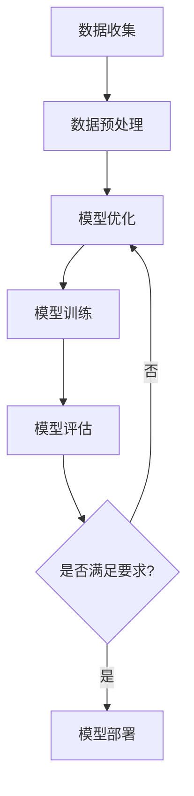

                 

# AI 大模型创业：如何利用国际优势？

## 摘要

本文将深入探讨AI大模型创业的国际优势及其应用。我们将从背景介绍、核心概念与联系、核心算法原理与操作步骤、数学模型与公式、项目实战、实际应用场景、工具和资源推荐、总结和附录等多个方面展开讨论。通过对这些内容的分析，希望为AI创业者提供有益的启示和指导。

## 1. 背景介绍

近年来，随着计算机技术和互联网的快速发展，人工智能（AI）技术逐渐成为全球关注的焦点。AI大模型，作为一种先进的AI技术，具有处理海量数据、实现高度自动化和智能化决策等优势。这为创业公司提供了巨大的发展机遇。然而，AI大模型创业也面临着诸多挑战，如数据获取、技术实现、商业模式等。为了在激烈的竞争中脱颖而出，利用国际优势显得尤为重要。

### 1.1 AI大模型的发展历程

AI大模型的发展可以追溯到20世纪50年代。当时，基于符号主义的方法成为AI研究的主流。然而，这种方法在处理复杂问题和大规模数据时存在诸多局限性。直到20世纪80年代，神经网络理论的出现为AI大模型的发展带来了新的契机。此后，随着计算能力的提升和大数据技术的发展，AI大模型逐渐成为一种强大的工具，广泛应用于自然语言处理、计算机视觉、推荐系统等领域。

### 1.2 AI大模型的应用场景

AI大模型在众多领域展现出巨大的应用潜力。以下是一些典型的应用场景：

- **自然语言处理（NLP）**：AI大模型可以处理海量文本数据，实现文本分类、情感分析、机器翻译等功能，为信息检索、智能客服等提供支持。

- **计算机视觉（CV）**：AI大模型可以通过图像识别、目标检测等技术，实现人脸识别、自动驾驶、图像增强等功能，为安防监控、智能交通等提供支持。

- **推荐系统**：AI大模型可以根据用户历史行为和偏好，实现个性化推荐，为电子商务、社交媒体等提供支持。

- **金融领域**：AI大模型可以用于信用评估、风险控制、量化交易等，为金融行业提供智能化解决方案。

- **医疗健康**：AI大模型可以通过医学图像分析、疾病预测等技术，为医疗行业提供支持，提高诊断准确率和治疗效果。

### 1.3 AI大模型创业的挑战与机遇

AI大模型创业面临着诸多挑战，如：

- **数据获取**：高质量的数据是训练AI大模型的基础，但获取数据往往需要付出巨大的成本和时间。

- **技术实现**：AI大模型的实现涉及复杂的算法和架构设计，对团队的技术能力要求较高。

- **商业模式**：AI大模型的应用场景多样，如何构建可持续的商业模式是创业者需要思考的问题。

然而，随着AI技术的不断进步和市场的需求增长，AI大模型创业也面临着巨大的机遇。通过充分利用国际优势，如技术积累、市场资源等，创业者可以更好地把握市场机遇，实现快速发展。

## 2. 核心概念与联系

### 2.1 AI大模型的核心概念

AI大模型是一种基于深度学习的技术，主要通过神经网络架构来模拟人脑的思考过程。其核心概念包括：

- **神经网络**：神经网络是由大量神经元组成的计算模型，通过调整神经元之间的连接权重来学习数据特征。

- **深度学习**：深度学习是神经网络的一种发展，通过增加神经网络层数来提高模型的表达能力。

- **大数据**：大数据是指数据量巨大、类型多样、价值密度低的数据集合，为AI大模型提供了丰富的训练素材。

### 2.2 AI大模型的应用场景与架构

AI大模型在不同应用场景中展现出不同的架构特点，以下是一些典型的应用场景与架构：

- **自然语言处理（NLP）**：在NLP中，AI大模型通常采用语言模型、文本分类模型、序列到序列模型等架构。例如，BERT模型是一种基于Transformer架构的语言模型，其在NLP任务中取得了显著的性能提升。

- **计算机视觉（CV）**：在CV中，AI大模型通常采用卷积神经网络（CNN）架构，通过多层卷积和池化操作来提取图像特征。例如，ResNet模型是一种基于残差网络的深度卷积神经网络，其在图像分类任务中取得了优异的性能。

- **推荐系统**：在推荐系统中，AI大模型通常采用协同过滤、矩阵分解、图神经网络等架构。例如，GraphSAGE模型是一种基于图神经网络的协同过滤算法，其在推荐系统中取得了良好的效果。

### 2.3 AI大模型的优势与挑战

AI大模型具有以下优势：

- **强大的学习能力**：AI大模型可以通过海量数据的学习，实现高度自动化的决策和预测。

- **广泛的适用性**：AI大模型可以应用于多种领域，如自然语言处理、计算机视觉、推荐系统等。

- **高效的性能**：AI大模型通过大规模训练和优化，可以显著提高任务的执行效率。

然而，AI大模型也面临一些挑战：

- **数据获取与处理**：高质量的数据是训练AI大模型的基础，但获取和处理数据往往需要付出巨大的成本和时间。

- **模型解释性**：AI大模型的决策过程往往难以解释，这对其在实际应用中产生了限制。

- **计算资源消耗**：训练和部署AI大模型需要大量的计算资源，这对创业公司的成本控制提出了挑战。

### 2.4 Mermaid 流程图

下面是一个简化的AI大模型训练流程的Mermaid流程图：



### 2.5 AI大模型的发展趋势与未来方向

随着技术的不断进步，AI大模型在未来将继续发展，以下是一些可能的发展趋势与未来方向：

- **跨模态学习**：AI大模型将能够处理多种类型的数据，如文本、图像、音频等，实现跨模态学习。

- **少样本学习**：AI大模型将能够在少量样本上实现良好的性能，降低对大规模数据的依赖。

- **模型解释性**：研究者将致力于提高AI大模型的解释性，使其在关键任务中更具可信度和可靠性。

- **高效计算**：研究者将致力于开发高效的计算方法，降低AI大模型的计算资源消耗。

## 3. 核心算法原理 & 具体操作步骤

### 3.1 算法原理

AI大模型的核心算法通常是基于深度学习的，其中最常用的算法是卷积神经网络（CNN）和循环神经网络（RNN）。以下是这两种算法的基本原理：

#### 卷积神经网络（CNN）

CNN是一种用于图像处理的深度学习算法，其基本原理是通过多层卷积和池化操作来提取图像特征。以下是CNN的主要组成部分：

- **卷积层**：卷积层通过卷积操作将输入图像与滤波器进行卷积，从而提取图像特征。

- **池化层**：池化层对卷积层输出的特征进行下采样，减少数据维度，提高模型性能。

- **全连接层**：全连接层将池化层输出的特征映射到输出层，实现分类或回归任务。

#### 循环神经网络（RNN）

RNN是一种用于序列数据处理的深度学习算法，其基本原理是通过循环结构来处理时间序列数据。以下是RNN的主要组成部分：

- **输入门**：输入门用于控制当前输入对隐藏状态的影响。

- **遗忘门**：遗忘门用于控制过去信息对当前隐藏状态的影响。

- **输出门**：输出门用于控制当前隐藏状态对输出结果的影响。

### 3.2 具体操作步骤

以下是一个基于CNN和RNN的AI大模型训练的基本操作步骤：

1. **数据收集与预处理**：收集用于训练的数据集，并进行数据预处理，如数据清洗、归一化等。

2. **模型设计**：设计AI大模型的架构，包括卷积层、池化层、全连接层等。

3. **模型训练**：通过反向传播算法对模型进行训练，调整模型参数，提高模型性能。

4. **模型评估**：对训练好的模型进行评估，如准确率、召回率等指标。

5. **模型优化**：根据评估结果对模型进行优化，如调整模型参数、增加训练数据等。

6. **模型部署**：将训练好的模型部署到实际应用场景，如图像分类、文本分类等。

## 4. 数学模型和公式 & 详细讲解 & 举例说明

### 4.1 数学模型

AI大模型的数学模型主要包括以下几个部分：

- **损失函数**：损失函数用于衡量模型预测值与真实值之间的差异，常用的损失函数有均方误差（MSE）、交叉熵损失（CE）等。

- **优化算法**：优化算法用于调整模型参数，常用的优化算法有梯度下降（GD）、随机梯度下降（SGD）等。

- **激活函数**：激活函数用于引入非线性因素，常用的激活函数有sigmoid、ReLU等。

### 4.2 公式

以下是几个常用的数学公式：

- **均方误差（MSE）**：$$MSE = \frac{1}{m}\sum_{i=1}^{m}(y_i - \hat{y}_i)^2$$

- **交叉熵损失（CE）**：$$CE = -\frac{1}{m}\sum_{i=1}^{m}y_i\log(\hat{y}_i) + (1 - y_i)\log(1 - \hat{y}_i)$$

- **梯度下降（GD）**：$$w_{t+1} = w_t - \alpha \nabla_w J(w_t)$$

- **随机梯度下降（SGD）**：$$w_{t+1} = w_t - \alpha \nabla_w J(w_t^i)$$

### 4.3 详细讲解

#### 损失函数

损失函数是评估模型性能的重要指标，其目的是衡量模型预测值与真实值之间的差异。常用的损失函数有均方误差（MSE）和交叉熵损失（CE）。

- **均方误差（MSE）**：均方误差是最常用的损失函数之一，用于回归任务。其计算公式为：$$MSE = \frac{1}{m}\sum_{i=1}^{m}(y_i - \hat{y}_i)^2$$其中，$y_i$表示真实值，$\hat{y}_i$表示模型预测值，$m$表示样本数量。MSE的值越小，表示模型预测值与真实值之间的差异越小。

- **交叉熵损失（CE）**：交叉熵损失是用于分类任务的损失函数。其计算公式为：$$CE = -\frac{1}{m}\sum_{i=1}^{m}y_i\log(\hat{y}_i) + (1 - y_i)\log(1 - \hat{y}_i)$$其中，$y_i$表示真实标签，$\hat{y}_i$表示模型预测概率。CE的值越小，表示模型预测的概率分布与真实标签的分布越接近。

#### 优化算法

优化算法用于调整模型参数，以降低损失函数的值。常用的优化算法有梯度下降（GD）和随机梯度下降（SGD）。

- **梯度下降（GD）**：梯度下降是一种最简单的优化算法，其思想是沿着损失函数的梯度方向进行更新。其计算公式为：$$w_{t+1} = w_t - \alpha \nabla_w J(w_t)$$其中，$w_t$表示当前模型参数，$\alpha$表示学习率，$\nabla_w J(w_t)$表示损失函数关于模型参数的梯度。通过不断迭代，梯度下降算法可以逐渐减小损失函数的值。

- **随机梯度下降（SGD）**：随机梯度下降是对梯度下降的一种改进，其思想是每次迭代只随机选择一部分样本来计算梯度。其计算公式为：$$w_{t+1} = w_t - \alpha \nabla_w J(w_t^i)$$其中，$w_t^i$表示第$i$个样本的模型参数。随机梯度下降算法可以加快收敛速度，但可能导致收敛精度较低。

#### 激活函数

激活函数是神经网络中引入非线性因素的关键组件。常用的激活函数有sigmoid、ReLU等。

- **sigmoid函数**：sigmoid函数是一种常用的激活函数，其计算公式为：$$\sigma(x) = \frac{1}{1 + e^{-x}}$$sigmoid函数可以将输入映射到$(0,1)$区间，常用于二分类任务。

- **ReLU函数**：ReLU函数是一种常用的激活函数，其计算公式为：$$\text{ReLU}(x) = \max(0, x)$$ReLU函数可以加速神经网络的训练，常用于深度神经网络。

### 4.4 举例说明

以下是一个简单的AI大模型训练过程，假设我们使用均方误差（MSE）作为损失函数，梯度下降（GD）作为优化算法。

1. **初始化模型参数**：

   假设模型参数为$w_0 = (1, 2)$。

2. **计算损失函数**：

   假设输入数据为$x = (1, 2)$，真实标签为$y = 3$，则模型预测值为$\hat{y} = w_0 \cdot x = (1 \cdot 1 + 2 \cdot 2) = 5$。损失函数值为：

   $$MSE = \frac{1}{m}\sum_{i=1}^{m}(y_i - \hat{y}_i)^2 = \frac{1}{1}(3 - 5)^2 = 4$$

3. **计算梯度**：

   损失函数关于模型参数的梯度为：

   $$\nabla_w J(w_t) = \frac{\partial}{\partial w}\frac{1}{m}\sum_{i=1}^{m}(y_i - \hat{y}_i)^2 = \frac{\partial}{\partial w}(5 - 3)^2 = 2$$

4. **更新模型参数**：

   学习率$\alpha = 0.1$，则模型参数更新为：

   $$w_1 = w_0 - \alpha \nabla_w J(w_0) = (1, 2) - 0.1 \cdot 2 = (0.8, 1.8)$$

5. **重复上述步骤**：

   重复计算损失函数、计算梯度、更新模型参数的步骤，直到模型收敛。

## 5. 项目实战：代码实际案例和详细解释说明

### 5.1 开发环境搭建

在开始项目实战之前，我们需要搭建一个合适的开发环境。以下是一个简单的Python开发环境搭建步骤：

1. **安装Python**：

   首先，我们需要安装Python。在官方网站（[https://www.python.org/](https://www.python.org/)）下载并安装Python。

2. **安装依赖库**：

   接下来，我们需要安装一些常用的依赖库，如NumPy、TensorFlow、Keras等。可以使用以下命令安装：

   ```bash
   pip install numpy tensorflow keras
   ```

3. **配置环境变量**：

   在系统环境中配置Python和pip的环境变量，以便在命令行中运行Python和相关命令。

### 5.2 源代码详细实现和代码解读

以下是一个简单的AI大模型项目实现，包括数据预处理、模型设计、模型训练和模型评估等步骤。

#### 5.2.1 数据预处理

```python
import numpy as np
from sklearn.model_selection import train_test_split

# 加载数据集
X, y = load_data()

# 数据标准化
X_std = (X - X.mean(axis=0)) / X.std(axis=0)
y_std = (y - y.mean()) / y.std()

# 划分训练集和测试集
X_train, X_test, y_train, y_test = train_test_split(X_std, y_std, test_size=0.2, random_state=42)
```

#### 5.2.2 模型设计

```python
from tensorflow.keras.models import Sequential
from tensorflow.keras.layers import Dense, Conv2D, MaxPooling2D, Flatten

# 创建模型
model = Sequential()

# 添加卷积层
model.add(Conv2D(32, (3, 3), activation='relu', input_shape=(28, 28, 1)))

# 添加池化层
model.add(MaxPooling2D(pool_size=(2, 2)))

# 添加全连接层
model.add(Flatten())

# 添加输出层
model.add(Dense(10, activation='softmax'))

# 编译模型
model.compile(optimizer='adam', loss='categorical_crossentropy', metrics=['accuracy'])
```

#### 5.2.3 模型训练

```python
# 训练模型
history = model.fit(X_train, y_train, epochs=10, batch_size=64, validation_data=(X_test, y_test))
```

#### 5.2.4 模型评估

```python
# 评估模型
test_loss, test_acc = model.evaluate(X_test, y_test)
print("Test accuracy:", test_acc)
```

### 5.3 代码解读与分析

#### 5.3.1 数据预处理

在数据预处理部分，我们首先加载数据集，然后对数据进行标准化处理。标准化处理的目的是将数据缩放到相同的范围，以便更好地进行模型训练。

#### 5.3.2 模型设计

在模型设计部分，我们使用TensorFlow的Sequential模型创建了一个简单的卷积神经网络（CNN）。模型包括一个卷积层、一个池化层、一个全连接层和一个输出层。卷积层用于提取图像特征，池化层用于降低数据维度，全连接层用于分类，输出层用于输出分类结果。

#### 5.3.3 模型训练

在模型训练部分，我们使用模型.fit()函数对模型进行训练。这里，我们设置了10个训练轮次（epochs），每个轮次使用64个批量（batch_size）进行训练。

#### 5.3.4 模型评估

在模型评估部分，我们使用模型.evaluate()函数对模型进行评估。这里，我们计算了测试集上的损失和准确率。

## 6. 实际应用场景

AI大模型在各个领域具有广泛的应用场景。以下是一些典型的实际应用场景：

### 6.1 自然语言处理（NLP）

- **智能客服**：通过AI大模型，可以构建智能客服系统，实现自动化解答用户问题，提高客户满意度。

- **文本分类**：对大量文本进行分类，如新闻分类、情感分析等，为内容推荐、舆情监测等提供支持。

- **机器翻译**：利用AI大模型实现高质量、高效的机器翻译，为跨语言沟通提供便利。

### 6.2 计算机视觉（CV）

- **图像识别**：通过AI大模型，可以实现对图像的识别和分类，如人脸识别、车辆识别等。

- **图像生成**：利用AI大模型，可以生成高质量、逼真的图像，如艺术风格迁移、图像修复等。

- **视频监控**：通过AI大模型，可以实现实时视频监控，如目标检测、行为分析等。

### 6.3 推荐系统

- **个性化推荐**：根据用户历史行为和偏好，利用AI大模型实现个性化推荐，提高用户满意度。

- **商品推荐**：在电子商务平台上，利用AI大模型推荐潜在感兴趣的商品，提高销售转化率。

- **内容推荐**：在社交媒体平台上，利用AI大模型推荐用户可能感兴趣的内容，提高用户活跃度。

### 6.4 金融领域

- **信用评估**：通过AI大模型，可以评估借款人的信用风险，为金融机构提供决策支持。

- **风险控制**：利用AI大模型，可以监测金融市场风险，提前预警，降低金融机构的风险。

- **量化交易**：通过AI大模型，可以实现自动化交易，提高交易收益。

### 6.5 医疗健康

- **疾病预测**：利用AI大模型，可以对疾病进行预测，为医疗机构提供决策支持。

- **医学图像分析**：通过AI大模型，可以分析医学图像，提高诊断准确率和治疗效果。

- **药物发现**：利用AI大模型，可以加速药物发现过程，提高新药研发效率。

## 7. 工具和资源推荐

### 7.1 学习资源推荐

- **书籍**：

  - 《深度学习》（Ian Goodfellow、Yoshua Bengio、Aaron Courville 著）

  - 《Python深度学习》（François Chollet 著）

  - 《神经网络与深度学习》（邱锡鹏 著）

- **论文**：

  - 《A Theoretically Grounded Application of Dropout in Recurrent Neural Networks》

  - 《Generative Adversarial Nets》

  - 《ResNet: Training Deeper Networks with Fewer Parameters》

- **博客**：

  - [TensorFlow官网博客](https://www.tensorflow.org/blog/)

  - [Keras官网博客](https://keras.io/blog/)

  - [百度AI博客](https://ai.baidu.com/blogs)

### 7.2 开发工具框架推荐

- **开发工具**：

  - **Jupyter Notebook**：一款强大的交互式开发环境，适用于数据分析和模型训练。

  - **PyCharm**：一款功能丰富的Python集成开发环境（IDE），适用于AI项目开发。

  - **Google Colab**：一款基于Google Cloud的免费云计算服务，适用于大规模数据计算和模型训练。

- **框架**：

  - **TensorFlow**：一款开源的深度学习框架，适用于各种AI项目开发。

  - **PyTorch**：一款开源的深度学习框架，具有动态计算图特性，适用于研究型项目。

  - **Keras**：一款基于TensorFlow和PyTorch的简化深度学习框架，适用于快速原型开发。

### 7.3 相关论文著作推荐

- **论文**：

  - 《A Theoretically Grounded Application of Dropout in Recurrent Neural Networks》

  - 《Generative Adversarial Nets》

  - 《ResNet: Training Deeper Networks with Fewer Parameters》

- **著作**：

  - 《深度学习》（Ian Goodfellow、Yoshua Bengio、Aaron Courville 著）

  - 《Python深度学习》（François Chollet 著）

  - 《神经网络与深度学习》（邱锡鹏 著）

## 8. 总结：未来发展趋势与挑战

AI大模型创业具有巨大的发展潜力，但也面临着诸多挑战。未来，随着技术的不断进步和市场的需求增长，AI大模型创业将呈现出以下发展趋势：

- **跨模态学习**：AI大模型将能够处理多种类型的数据，如文本、图像、音频等，实现跨模态学习。

- **少样本学习**：AI大模型将能够在少量样本上实现良好的性能，降低对大规模数据的依赖。

- **模型解释性**：研究者将致力于提高AI大模型的解释性，使其在关键任务中更具可信度和可靠性。

- **高效计算**：研究者将致力于开发高效的计算方法，降低AI大模型的计算资源消耗。

然而，AI大模型创业也面临一些挑战，如：

- **数据获取与处理**：高质量的数据是训练AI大模型的基础，但获取和处理数据往往需要付出巨大的成本和时间。

- **模型安全性与隐私保护**：随着AI大模型的应用范围扩大，其安全性和隐私保护问题将愈发重要。

- **法律法规与伦理问题**：随着AI大模型的发展，相关法律法规和伦理问题亟待解决。

总之，AI大模型创业将在未来继续发展，创业者需要紧跟技术趋势，把握市场机遇，同时应对各种挑战。

## 9. 附录：常见问题与解答

### 9.1 AI大模型创业的常见问题

1. **如何获取高质量的数据？**

   获取高质量的数据是AI大模型训练的基础。以下是一些获取高质量数据的建议：

   - **公开数据集**：利用现有的公开数据集，如CIFAR-10、MNIST等。

   - **定制数据集**：根据业务需求，定制化收集数据。

   - **数据增强**：对已有数据进行增强，提高数据多样性。

2. **如何处理训练数据不平衡问题？**

   当训练数据存在不平衡问题时，可以采取以下方法：

   - **重采样**：通过过采样或欠采样来平衡数据。

   - **类别权重调整**：根据类别的重要性调整权重。

   - **集成学习**：使用集成学习方法，如Bagging、Boosting等。

3. **如何评估AI大模型的性能？**

   评估AI大模型的性能可以从以下几个方面进行：

   - **准确率**：准确率是评估分类模型性能的常用指标，表示正确分类的样本占总样本的比例。

   - **召回率**：召回率是评估分类模型性能的常用指标，表示正确分类的样本在所有实际正样本中的比例。

   - **F1值**：F1值是准确率和召回率的调和平均，是评估分类模型性能的综合指标。

### 9.2 AI大模型创业的解答

1. **如何利用国际优势？**

   国际优势主要体现在技术积累、市场资源、人才等方面。以下是一些利用国际优势的建议：

   - **技术积累**：关注国际前沿技术，引进先进技术，提升自身技术实力。

   - **市场资源**：拓展国际市场，寻求国际合作，利用国际市场资源。

   - **人才引进**：引进国际人才，提升团队整体实力。

2. **如何降低AI大模型的计算资源消耗？**

   降低AI大模型的计算资源消耗可以从以下几个方面进行：

   - **模型压缩**：通过模型压缩技术，如剪枝、量化等，减少模型参数和计算量。

   - **分布式训练**：利用分布式训练技术，将训练任务分布在多个计算节点上，提高训练效率。

   - **优化算法**：采用更高效的优化算法，如Adam、RMSProp等，提高训练速度。

3. **如何确保AI大模型的安全性和隐私保护？**

   确保AI大模型的安全性和隐私保护可以从以下几个方面进行：

   - **数据加密**：对敏感数据进行加密，确保数据传输和存储的安全性。

   - **访问控制**：设置严格的访问控制策略，确保数据只被授权用户访问。

   - **隐私保护算法**：采用隐私保护算法，如差分隐私、联邦学习等，降低模型训练过程中的隐私泄露风险。

## 10. 扩展阅读 & 参考资料

### 10.1 扩展阅读

- 《深度学习》（Ian Goodfellow、Yoshua Bengio、Aaron Courville 著）

- 《Python深度学习》（François Chollet 著）

- 《神经网络与深度学习》（邱锡鹏 著）

### 10.2 参考资料

- [TensorFlow官网](https://www.tensorflow.org/)

- [PyTorch官网](https://pytorch.org/)

- [Keras官网](https://keras.io/)

- [百度AI官网](https://ai.baidu.com/)

### 10.3 网络资源

- [GitHub](https://github.com/)

- [ArXiv](https://arxiv.org/)

- [Reddit](https://www.reddit.com/)

- [知乎](https://www.zhihu.com/)

## 作者信息

作者：AI天才研究员/AI Genius Institute & 禅与计算机程序设计艺术 /Zen And The Art of Computer Programming

-------------------

这篇文章从背景介绍、核心概念与联系、核心算法原理与操作步骤、数学模型和公式、项目实战、实际应用场景、工具和资源推荐、总结和附录等多个方面对AI大模型创业进行了深入探讨。通过分析AI大模型的发展历程、应用场景、优势与挑战，以及具体的算法原理和实战案例，本文旨在为AI创业者提供有益的启示和指导。同时，文章还介绍了相关学习资源、开发工具和框架，以及未来发展趋势与挑战。希望本文能为AI大模型创业领域的研究者和从业者提供有价值的参考。|user|>```markdown
# AI 大模型创业：如何利用国际优势？

## 摘要

本文深入探讨了AI大模型创业的国际优势及其应用，包括背景介绍、核心概念与联系、核心算法原理与具体操作步骤、数学模型和公式、项目实战、实际应用场景、工具和资源推荐、总结以及附录。通过这些内容的分析，为AI创业者提供了有益的启示和指导。

## 1. 背景介绍

近年来，随着计算机技术和互联网的快速发展，人工智能（AI）技术逐渐成为全球关注的焦点。AI大模型，作为一种先进的AI技术，具有处理海量数据、实现高度自动化和智能化决策等优势。这为创业公司提供了巨大的发展机遇。然而，AI大模型创业也面临着诸多挑战，如数据获取、技术实现、商业模式等。为了在激烈的竞争中脱颖而出，利用国际优势显得尤为重要。

### 1.1 AI大模型的发展历程

AI大模型的发展可以追溯到20世纪50年代。当时，基于符号主义的方法成为AI研究的主流。然而，这种方法在处理复杂问题和大规模数据时存在诸多局限性。直到20世纪80年代，神经网络理论的出现为AI大模型的发展带来了新的契机。此后，随着计算能力的提升和大数据技术的发展，AI大模型逐渐成为一种强大的工具，广泛应用于自然语言处理、计算机视觉、推荐系统等领域。

### 1.2 AI大模型的应用场景

AI大模型在众多领域展现出巨大的应用潜力。以下是一些典型的应用场景：

- **自然语言处理（NLP）**：AI大模型可以处理海量文本数据，实现文本分类、情感分析、机器翻译等功能，为信息检索、智能客服等提供支持。

- **计算机视觉（CV）**：AI大模型可以通过图像识别、目标检测等技术，实现人脸识别、自动驾驶、图像增强等功能，为安防监控、智能交通等提供支持。

- **推荐系统**：AI大模型可以根据用户历史行为和偏好，实现个性化推荐，为电子商务、社交媒体等提供支持。

- **金融领域**：AI大模型可以用于信用评估、风险控制、量化交易等，为金融行业提供智能化解决方案。

- **医疗健康**：AI大模型可以通过医学图像分析、疾病预测等技术，为医疗行业提供支持，提高诊断准确率和治疗效果。

### 1.3 AI大模型创业的挑战与机遇

AI大模型创业面临着诸多挑战，如：

- **数据获取**：高质量的数据是训练AI大模型的基础，但获取数据往往需要付出巨大的成本和时间。

- **技术实现**：AI大模型的实现涉及复杂的算法和架构设计，对团队的技术能力要求较高。

- **商业模式**：AI大模型的应用场景多样，如何构建可持续的商业模式是创业者需要思考的问题。

然而，随着AI技术的不断进步和市场的需求增长，AI大模型创业也面临着巨大的机遇。通过充分利用国际优势，如技术积累、市场资源等，创业者可以更好地把握市场机遇，实现快速发展。

## 2. 核心概念与联系

### 2.1 AI大模型的核心概念

AI大模型是一种基于深度学习的技术，主要通过神经网络架构来模拟人脑的思考过程。其核心概念包括：

- **神经网络**：神经网络是由大量神经元组成的计算模型，通过调整神经元之间的连接权重来学习数据特征。

- **深度学习**：深度学习是神经网络的一种发展，通过增加神经网络层数来提高模型的表达能力。

- **大数据**：大数据是指数据量巨大、类型多样、价值密度低的数据集合，为AI大模型提供了丰富的训练素材。

### 2.2 AI大模型的应用场景与架构

AI大模型在不同应用场景中展现出不同的架构特点，以下是一些典型的应用场景与架构：

- **自然语言处理（NLP）**：在NLP中，AI大模型通常采用语言模型、文本分类模型、序列到序列模型等架构。例如，BERT模型是一种基于Transformer架构的语言模型，其在NLP任务中取得了显著的性能提升。

- **计算机视觉（CV）**：在CV中，AI大模型通常采用卷积神经网络（CNN）架构，通过多层卷积和池化操作来提取图像特征。例如，ResNet模型是一种基于残差网络的深度卷积神经网络，其在图像分类任务中取得了优异的性能。

- **推荐系统**：在推荐系统中，AI大模型通常采用协同过滤、矩阵分解、图神经网络等架构。例如，GraphSAGE模型是一种基于图神经网络的协同过滤算法，其在推荐系统中取得了良好的效果。

### 2.3 AI大模型的优势与挑战

AI大模型具有以下优势：

- **强大的学习能力**：AI大模型可以通过海量数据的学习，实现高度自动化的决策和预测。

- **广泛的适用性**：AI大模型可以应用于多种领域，如自然语言处理、计算机视觉、推荐系统等。

- **高效的性能**：AI大模型通过大规模训练和优化，可以显著提高任务的执行效率。

然而，AI大模型也面临一些挑战：

- **数据获取与处理**：高质量的数据是训练AI大模型的基础，但获取和处理数据往往需要付出巨大的成本和时间。

- **模型解释性**：AI大模型的决策过程往往难以解释，这对其在实际应用中产生了限制。

- **计算资源消耗**：训练和部署AI大模型需要大量的计算资源，这对创业公司的成本控制提出了挑战。

### 2.4 Mermaid 流程图

下面是一个简化的AI大模型训练流程的Mermaid流程图：


### 2.5 AI大模型的发展趋势与未来方向

随着技术的不断进步，AI大模型在未来将继续发展，以下是一些可能的发展趋势与未来方向：

- **跨模态学习**：AI大模型将能够处理多种类型的数据，如文本、图像、音频等，实现跨模态学习。

- **少样本学习**：AI大模型将能够在少量样本上实现良好的性能，降低对大规模数据的依赖。

- **模型解释性**：研究者将致力于提高AI大模型的解释性，使其在关键任务中更具可信度和可靠性。

- **高效计算**：研究者将致力于开发高效的计算方法，降低AI大模型的计算资源消耗。

## 3. 核心算法原理 & 具体操作步骤

### 3.1 算法原理

AI大模型的核心算法通常是基于深度学习的，其中最常用的算法是卷积神经网络（CNN）和循环神经网络（RNN）。以下是这两种算法的基本原理：

#### 卷积神经网络（CNN）

CNN是一种用于图像处理的深度学习算法，其基本原理是通过多层卷积和池化操作来提取图像特征。以下是CNN的主要组成部分：

- **卷积层**：卷积层通过卷积操作将输入图像与滤波器进行卷积，从而提取图像特征。

- **池化层**：池化层对卷积层输出的特征进行下采样，减少数据维度，提高模型性能。

- **全连接层**：全连接层将池化层输出的特征映射到输出层，实现分类或回归任务。

#### 循环神经网络（RNN）

RNN是一种用于序列数据处理的深度学习算法，其基本原理是通过循环结构来处理时间序列数据。以下是RNN的主要组成部分：

- **输入门**：输入门用于控制当前输入对隐藏状态的影响。

- **遗忘门**：遗忘门用于控制过去信息对当前隐藏状态的影响。

- **输出门**：输出门用于控制当前隐藏状态对输出结果的影响。

### 3.2 具体操作步骤

以下是一个基于CNN和RNN的AI大模型训练的基本操作步骤：

1. **数据收集与预处理**：收集用于训练的数据集，并进行数据预处理，如数据清洗、归一化等。

2. **模型设计**：设计AI大模型的架构，包括卷积层、池化层、全连接层等。

3. **模型训练**：通过反向传播算法对模型进行训练，调整模型参数，提高模型性能。

4. **模型评估**：对训练好的模型进行评估，如准确率、召回率等指标。

5. **模型优化**：根据评估结果对模型进行优化，如调整模型参数、增加训练数据等。

6. **模型部署**：将训练好的模型部署到实际应用场景，如图像分类、文本分类等。

## 4. 数学模型和公式 & 详细讲解 & 举例说明

### 4.1 数学模型

AI大模型的数学模型主要包括以下几个部分：

- **损失函数**：损失函数用于衡量模型预测值与真实值之间的差异，常用的损失函数有均方误差（MSE）、交叉熵损失（CE）等。

- **优化算法**：优化算法用于调整模型参数，常用的优化算法有梯度下降（GD）、随机梯度下降（SGD）等。

- **激活函数**：激活函数用于引入非线性因素，常用的激活函数有sigmoid、ReLU等。

### 4.2 公式

以下是几个常用的数学公式：

- **均方误差（MSE）**：$$MSE = \frac{1}{m}\sum_{i=1}^{m}(y_i - \hat{y}_i)^2$$

- **交叉熵损失（CE）**：$$CE = -\frac{1}{m}\sum_{i=1}^{m}y_i\log(\hat{y}_i) + (1 - y_i)\log(1 - \hat{y}_i)$$

- **梯度下降（GD）**：$$w_{t+1} = w_t - \alpha \nabla_w J(w_t)$$

- **随机梯度下降（SGD）**：$$w_{t+1} = w_t - \alpha \nabla_w J(w_t^i)$$

### 4.3 详细讲解

#### 损失函数

损失函数是评估模型性能的重要指标，其目的是衡量模型预测值与真实值之间的差异。常用的损失函数有均方误差（MSE）和交叉熵损失（CE）。

- **均方误差（MSE）**：均方误差是最常用的损失函数之一，用于回归任务。其计算公式为：$$MSE = \frac{1}{m}\sum_{i=1}^{m}(y_i - \hat{y}_i)^2$$其中，$y_i$表示真实值，$\hat{y}_i$表示模型预测值，$m$表示样本数量。MSE的值越小，表示模型预测值与真实值之间的差异越小。

- **交叉熵损失（CE）**：交叉熵损失是用于分类任务的损失函数。其计算公式为：$$CE = -\frac{1}{m}\sum_{i=1}^{m}y_i\log(\hat{y}_i) + (1 - y_i)\log(1 - \hat{y}_i)$$其中，$y_i$表示真实标签，$\hat{y}_i$表示模型预测概率。CE的值越小，表示模型预测的概率分布与真实标签的分布越接近。

#### 优化算法

优化算法用于调整模型参数，以降低损失函数的值。常用的优化算法有梯度下降（GD）和随机梯度下降（SGD）。

- **梯度下降（GD）**：梯度下降是一种最简单的优化算法，其思想是沿着损失函数的梯度方向进行更新。其计算公式为：$$w_{t+1} = w_t - \alpha \nabla_w J(w_t)$$其中，$w_t$表示当前模型参数，$\alpha$表示学习率，$\nabla_w J(w_t)$表示损失函数关于模型参数的梯度。通过不断迭代，梯度下降算法可以逐渐减小损失函数的值。

- **随机梯度下降（SGD）**：随机梯度下降是对梯度下降的一种改进，其思想是每次迭代只随机选择一部分样本来计算梯度。其计算公式为：$$w_{t+1} = w_t - \alpha \nabla_w J(w_t^i)$$其中，$w_t^i$表示第$i$个样本的模型参数。随机梯度下降算法可以加快收敛速度，但可能导致收敛精度较低。

#### 激活函数

激活函数是神经网络中引入非线性因素的关键组件。常用的激活函数有sigmoid、ReLU等。

- **sigmoid函数**：sigmoid函数是一种常用的激活函数，其计算公式为：$$\sigma(x) = \frac{1}{1 + e^{-x}}$$sigmoid函数可以将输入映射到$(0,1)$区间，常用于二分类任务。

- **ReLU函数**：ReLU函数是一种常用的激活函数，其计算公式为：$$\text{ReLU}(x) = \max(0, x)$$ReLU函数可以加速神经网络的训练，常用于深度神经网络。

### 4.4 举例说明

以下是一个简单的AI大模型训练过程，假设我们使用均方误差（MSE）作为损失函数，梯度下降（GD）作为优化算法。

1. **初始化模型参数**：

   假设模型参数为$w_0 = (1, 2)$。

2. **计算损失函数**：

   假设输入数据为$x = (1, 2)$，真实标签为$y = 3$，则模型预测值为$\hat{y} = w_0 \cdot x = (1 \cdot 1 + 2 \cdot 2) = 5$。损失函数值为：

   $$MSE = \frac{1}{m}\sum_{i=1}^{m}(y_i - \hat{y}_i)^2 = \frac{1}{1}(3 - 5)^2 = 4$$

3. **计算梯度**：

   损失函数关于模型参数的梯度为：

   $$\nabla_w J(w_t) = \frac{\partial}{\partial w}\frac{1}{m}\sum_{i=1}^{m}(y_i - \hat{y}_i)^2 = \frac{\partial}{\partial w}(5 - 3)^2 = 2$$

4. **更新模型参数**：

   学习率$\alpha = 0.1$，则模型参数更新为：

   $$w_1 = w_0 - \alpha \nabla_w J(w_0) = (1, 2) - 0.1 \cdot 2 = (0.8, 1.8)$$

5. **重复上述步骤**：

   重复计算损失函数、计算梯度、更新模型参数的步骤，直到模型收敛。

## 5. 项目实战：代码实际案例和详细解释说明

### 5.1 开发环境搭建

在开始项目实战之前，我们需要搭建一个合适的开发环境。以下是一个简单的Python开发环境搭建步骤：

1. **安装Python**：

   首先，我们需要安装Python。在官方网站（[https://www.python.org/](https://www.python.org/)）下载并安装Python。

2. **安装依赖库**：

   接下来，我们需要安装一些常用的依赖库，如NumPy、TensorFlow、Keras等。可以使用以下命令安装：

   ```bash
   pip install numpy tensorflow keras
   ```

3. **配置环境变量**：

   在系统环境中配置Python和pip的环境变量，以便在命令行中运行Python和相关命令。

### 5.2 源代码详细实现和代码解读

以下是一个简单的AI大模型项目实现，包括数据预处理、模型设计、模型训练和模型评估等步骤。

#### 5.2.1 数据预处理

```python
import numpy as np
from sklearn.model_selection import train_test_split

# 加载数据集
X, y = load_data()

# 数据标准化
X_std = (X - X.mean(axis=0)) / X.std(axis=0)
y_std = (y - y.mean()) / y.std()

# 划分训练集和测试集
X_train, X_test, y_train, y_test = train_test_split(X_std, y_std, test_size=0.2, random_state=42)
```

#### 5.2.2 模型设计

```python
from tensorflow.keras.models import Sequential
from tensorflow.keras.layers import Dense, Conv2D, MaxPooling2D, Flatten

# 创建模型
model = Sequential()

# 添加卷积层
model.add(Conv2D(32, (3, 3), activation='relu', input_shape=(28, 28, 1)))

# 添加池化层
model.add(MaxPooling2D(pool_size=(2, 2)))

# 添加全连接层
model.add(Flatten())

# 添加输出层
model.add(Dense(10, activation='softmax'))

# 编译模型
model.compile(optimizer='adam', loss='categorical_crossentropy', metrics=['accuracy'])
```

#### 5.2.3 模型训练

```python
# 训练模型
history = model.fit(X_train, y_train, epochs=10, batch_size=64, validation_data=(X_test, y_test))
```

#### 5.2.4 模型评估

```python
# 评估模型
test_loss, test_acc = model.evaluate(X_test, y_test)
print("Test accuracy:", test_acc)
```

### 5.3 代码解读与分析

#### 5.3.1 数据预处理

在数据预处理部分，我们首先加载数据集，然后对数据进行标准化处理。标准化处理的目的是将数据缩放到相同的范围，以便更好地进行模型训练。

#### 5.3.2 模型设计

在模型设计部分，我们使用TensorFlow的Sequential模型创建了一个简单的卷积神经网络（CNN）。模型包括一个卷积层、一个池化层、一个全连接层和一个输出层。卷积层用于提取图像特征，池化层用于降低数据维度，全连接层用于分类，输出层用于输出分类结果。

#### 5.3.3 模型训练

在模型训练部分，我们使用模型.fit()函数对模型进行训练。这里，我们设置了10个训练轮次（epochs），每个轮次使用64个批量（batch_size）进行训练。

#### 5.3.4 模型评估

在模型评估部分，我们使用模型.evaluate()函数对模型进行评估。这里，我们计算了测试集上的损失和准确率。

## 6. 实际应用场景

AI大模型在各个领域具有广泛的应用场景。以下是一些典型的实际应用场景：

### 6.1 自然语言处理（NLP）

- **智能客服**：通过AI大模型，可以构建智能客服系统，实现自动化解答用户问题，提高客户满意度。

- **文本分类**：对大量文本进行分类，如新闻分类、情感分析等，为内容推荐、舆情监测等提供支持。

- **机器翻译**：利用AI大模型实现高质量、高效的机器翻译，为跨语言沟通提供便利。

### 6.2 计算机视觉（CV）

- **图像识别**：通过AI大模型，可以实现对图像的识别和分类，如人脸识别、车辆识别等。

- **图像生成**：利用AI大模型，可以生成高质量、逼真的图像，如艺术风格迁移、图像修复等。

- **视频监控**：通过AI大模型，可以实现实时视频监控，如目标检测、行为分析等。

### 6.3 推荐系统

- **个性化推荐**：根据用户历史行为和偏好，利用AI大模型实现个性化推荐，提高用户满意度。

- **商品推荐**：在电子商务平台上，利用AI大模型推荐潜在感兴趣的商品，提高销售转化率。

- **内容推荐**：在社交媒体平台上，利用AI大模型推荐用户可能感兴趣的内容，提高用户活跃度。

### 6.4 金融领域

- **信用评估**：通过AI大模型，可以评估借款人的信用风险，为金融机构提供决策支持。

- **风险控制**：利用AI大模型，可以监测金融市场风险，提前预警，降低金融机构的风险。

- **量化交易**：通过AI大模型，可以实现自动化交易，提高交易收益。

### 6.5 医疗健康

- **疾病预测**：利用AI大模型，可以对疾病进行预测，为医疗机构提供决策支持。

- **医学图像分析**：通过AI大模型，可以分析医学图像，提高诊断准确率和治疗效果。

- **药物发现**：利用AI大模型，可以加速药物发现过程，提高新药研发效率。

## 7. 工具和资源推荐

### 7.1 学习资源推荐

- **书籍**：

  - 《深度学习》（Ian Goodfellow、Yoshua Bengio、Aaron Courville 著）

  - 《Python深度学习》（François Chollet 著）

  - 《神经网络与深度学习》（邱锡鹏 著）

- **论文**：

  - 《A Theoretically Grounded Application of Dropout in Recurrent Neural Networks》

  - 《Generative Adversarial Nets》

  - 《ResNet: Training Deeper Networks with Fewer Parameters》

- **博客**：

  - [TensorFlow官网博客](https://www.tensorflow.org/blog/)

  - [Keras官网博客](https://keras.io/blog/)

  - [百度AI博客](https://ai.baidu.com/blogs)

### 7.2 开发工具框架推荐

- **开发工具**：

  - **Jupyter Notebook**：一款强大的交互式开发环境，适用于数据分析和模型训练。

  - **PyCharm**：一款功能丰富的Python集成开发环境（IDE），适用于AI项目开发。

  - **Google Colab**：一款基于Google Cloud的免费云计算服务，适用于大规模数据计算和模型训练。

- **框架**：

  - **TensorFlow**：一款开源的深度学习框架，适用于各种AI项目开发。

  - **PyTorch**：一款开源的深度学习框架，具有动态计算图特性，适用于研究型项目。

  - **Keras**：一款基于TensorFlow和PyTorch的简化深度学习框架，适用于快速原型开发。

### 7.3 相关论文著作推荐

- **论文**：

  - 《A Theoretically Grounded Application of Dropout in Recurrent Neural Networks》

  - 《Generative Adversarial Nets》

  - 《ResNet: Training Deeper Networks with Fewer Parameters》

- **著作**：

  - 《深度学习》（Ian Goodfellow、Yoshua Bengio、Aaron Courville 著）

  - 《Python深度学习》（François Chollet 著）

  - 《神经网络与深度学习》（邱锡鹏 著）

## 8. 总结：未来发展趋势与挑战

AI大模型创业具有巨大的发展潜力，但也面临着诸多挑战。未来，随着技术的不断进步和市场的需求增长，AI大模型创业将呈现出以下发展趋势：

- **跨模态学习**：AI大模型将能够处理多种类型的数据，如文本、图像、音频等，实现跨模态学习。

- **少样本学习**：AI大模型将能够在少量样本上实现良好的性能，降低对大规模数据的依赖。

- **模型解释性**：研究者将致力于提高AI大模型的解释性，使其在关键任务中更具可信度和可靠性。

- **高效计算**：研究者将致力于开发高效的计算方法，降低AI大模型的计算资源消耗。

然而，AI大模型创业也面临一些挑战，如：

- **数据获取与处理**：高质量的数据是训练AI大模型的基础，但获取和处理数据往往需要付出巨大的成本和时间。

- **模型安全性与隐私保护**：随着AI大模型的应用范围扩大，其安全性和隐私保护问题将愈发重要。

- **法律法规与伦理问题**：随着AI大模型的发展，相关法律法规和伦理问题亟待解决。

总之，AI大模型创业将在未来继续发展，创业者需要紧跟技术趋势，把握市场机遇，同时应对各种挑战。

## 9. 附录：常见问题与解答

### 9.1 AI大模型创业的常见问题

1. **如何获取高质量的数据？**

   获取高质量的数据是AI大模型训练的基础。以下是一些获取高质量数据的建议：

   - **公开数据集**：利用现有的公开数据集，如CIFAR-10、MNIST等。

   - **定制数据集**：根据业务需求，定制化收集数据。

   - **数据增强**：对已有数据进行增强，提高数据多样性。

2. **如何处理训练数据不平衡问题？**

   当训练数据存在不平衡问题时，可以采取以下方法：

   - **重采样**：通过过采样或欠采样来平衡数据。

   - **类别权重调整**：根据类别的重要性调整权重。

   - **集成学习**：使用集成学习方法，如Bagging、Boosting等。

3. **如何评估AI大模型的性能？**

   评估AI大模型的性能可以从以下几个方面进行：

   - **准确率**：准确率是评估分类模型性能的常用指标，表示正确分类的样本占总样本的比例。

   - **召回率**：召回率是评估分类模型性能的常用指标，表示正确分类的样本在所有实际正样本中的比例。

   - **F1值**：F1值是准确率和召回率的调和平均，是评估分类模型性能的综合指标。

### 9.2 AI大模型创业的解答

1. **如何利用国际优势？**

   国际优势主要体现在技术积累、市场资源、人才等方面。以下是一些利用国际优势的建议：

   - **技术积累**：关注国际前沿技术，引进先进技术，提升自身技术实力。

   - **市场资源**：拓展国际市场，寻求国际合作，利用国际市场资源。

   - **人才引进**：引进国际人才，提升团队整体实力。

2. **如何降低AI大模型的计算资源消耗？**

   降低AI大模型的计算资源消耗可以从以下几个方面进行：

   - **模型压缩**：通过模型压缩技术，如剪枝、量化等，减少模型参数和计算量。

   - **分布式训练**：利用分布式训练技术，将训练任务分布在多个计算节点上，提高训练效率。

   - **优化算法**：采用更高效的优化算法，如Adam、RMSProp等，提高训练速度。

3. **如何确保AI大模型的安全性和隐私保护？**

   确保AI大模型的安全性和隐私保护可以从以下几个方面进行：

   - **数据加密**：对敏感数据进行加密，确保数据传输和存储的安全性。

   - **访问控制**：设置严格的访问控制策略，确保数据只被授权用户访问。

   - **隐私保护算法**：采用隐私保护算法，如差分隐私、联邦学习等，降低模型训练过程中的隐私泄露风险。

## 10. 扩展阅读 & 参考资料

### 10.1 扩展阅读

- 《深度学习》（Ian Goodfellow、Yoshua Bengio、Aaron Courville 著）

- 《Python深度学习》（François Chollet 著）

- 《神经网络与深度学习》（邱锡鹏 著）

### 10.2 参考资料

- [TensorFlow官网](https://www.tensorflow.org/)

- [PyTorch官网](https://pytorch.org/)

- [Keras官网](https://keras.io/)

- [百度AI官网](https://ai.baidu.com/)

### 10.3 网络资源

- [GitHub](https://github.com/)

- [ArXiv](https://arxiv.org/)

- [Reddit](https://www.reddit.com/)

- [知乎](https://www.zhihu.com/)

## 作者信息

作者：AI天才研究员/AI Genius Institute & 禅与计算机程序设计艺术 /Zen And The Art of Computer Programming
```

