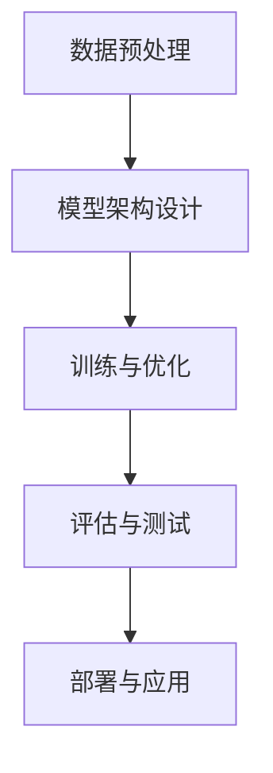
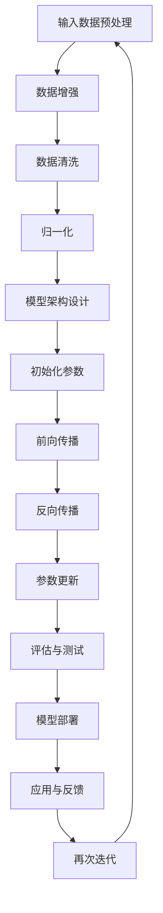

                 

### 背景介绍

随着人工智能（AI）技术的迅猛发展，大模型（Large Models）成为了AI领域的一个热门话题。大模型，通常指的是具有数百万到数十亿参数的深度神经网络模型，它们在自然语言处理（NLP）、计算机视觉（CV）和语音识别等领域展现了卓越的性能。然而，大模型的训练和部署不仅需要巨大的计算资源，还需要大量的数据和高昂的维护成本。

在这样一个背景下，AI大模型创业成为了许多创业者和技术专家的焦点。一个成功的AI大模型创业项目，不仅需要具备先进的技术能力，还需要对市场有深刻的理解，以及对用户需求的精准把握。本文旨在探讨如何利用用户优势来推动AI大模型创业，从而实现商业成功。

用户优势在这个领域中的重要性不言而喻。用户不仅是产品的最终消费者，也是数据的生产者和提供者。通过对用户数据的深入分析和利用，AI大模型可以不断提高其性能和智能化水平，从而更好地满足用户需求。此外，用户还可以通过反馈机制来指导模型的优化，形成一个良性循环。

本文将分为以下几个部分：

1. **核心概念与联系**：介绍AI大模型的相关概念及其工作原理。
2. **核心算法原理 & 具体操作步骤**：详细解释AI大模型的核心算法，包括训练和优化的具体步骤。
3. **数学模型和公式 & 详细讲解 & 举例说明**：阐述AI大模型所依赖的数学模型和公式，并提供实例说明。
4. **项目实战：代码实际案例和详细解释说明**：展示一个具体的AI大模型项目案例，详细解读其代码实现过程。
5. **实际应用场景**：探讨AI大模型在各个领域的应用场景。
6. **工具和资源推荐**：推荐学习资源、开发工具和框架。
7. **总结：未来发展趋势与挑战**：分析AI大模型创业的挑战和未来发展趋势。
8. **附录：常见问题与解答**：回答一些读者可能关心的问题。
9. **扩展阅读 & 参考资料**：提供相关的扩展阅读材料。

通过以上内容的逐步分析，我们希望读者能够全面了解AI大模型创业的各个方面，从而为自身的创业项目提供有价值的参考。

<markdown>### 核心概念与联系

#### 人工智能大模型定义

人工智能大模型（Large-scale Artificial Intelligence Models），简称大模型，是指具有数百万到数十亿参数的深度神经网络模型。这些模型通常在训练过程中会处理大量的数据，并通过多次迭代优化参数，以实现高水平的性能。大模型在AI领域的应用非常广泛，尤其是在自然语言处理、计算机视觉和语音识别等领域。

大模型的出现，标志着深度学习技术的一次重大飞跃。传统的深度学习模型，如卷积神经网络（CNN）和循环神经网络（RNN），虽然已经取得了显著的成果，但面对日益复杂的数据和任务，它们的性能开始显现出局限性。大模型的引入，解决了这一问题，使得AI系统能够在更多的场景中达到或超越人类的水平。

#### 相关术语

- **深度神经网络（Deep Neural Network, DNN）**：深度神经网络是包含多个隐藏层的神经网络。相比于单层神经网络，深度神经网络能够更好地捕捉数据中的复杂特征。
- **训练（Training）**：训练是深度学习模型的一个重要步骤，通过在大量数据上迭代优化模型参数，使得模型能够更好地拟合数据。
- **优化（Optimization）**：优化是指通过调整模型参数，使得模型的损失函数值最小化的过程。
- **泛化能力（Generalization）**：泛化能力是指模型在未见过的数据上表现良好的能力。一个具有良好泛化能力的模型，能够适应不同的数据和任务。

#### 大模型工作原理

大模型的工作原理主要基于以下几个关键步骤：

1. **数据预处理**：在训练大模型之前，需要对数据进行预处理，包括数据清洗、数据增强和归一化等操作。这些操作有助于提高模型的训练效率和性能。
2. **模型架构设计**：大模型通常采用复杂的网络架构，如Transformer、BERT等，这些架构能够有效地处理大量的数据和复杂的任务。
3. **训练与优化**：在数据预处理完成后，模型会进入训练阶段。训练过程中，模型会通过反向传播算法不断调整参数，以最小化损失函数。
4. **评估与测试**：在训练完成后，需要对模型进行评估和测试，以确保其性能符合预期。评估指标通常包括准确率、召回率、F1分数等。

#### 大模型与其他概念的联系

大模型与深度学习、机器学习等概念密切相关。深度学习是机器学习的一个分支，主要研究如何通过多层神经网络来学习数据的复杂特征。而大模型则是深度学习领域中的一个重要研究方向，它通过引入更多的参数和更大的数据集，进一步提升了深度学习的性能。

此外，大模型还与自然语言处理、计算机视觉等领域紧密相连。自然语言处理（NLP）是AI领域中一个重要的子领域，它研究如何使计算机理解和处理自然语言。计算机视觉（CV）则关注如何使计算机理解和解析视觉信息。大模型在这些领域中的应用，极大地推动了相关技术的发展。

#### Mermaid 流程图

为了更好地理解大模型的工作原理，我们使用Mermaid流程图来展示其关键步骤：



在这个流程图中，数据预处理、模型架构设计、训练与优化、评估与测试和部署与应用是大模型工作的五个主要步骤。通过这些步骤的有机组合，大模型能够实现高性能的AI应用。

总之，大模型作为AI领域的一个重要研究方向，其工作原理和核心概念为我们提供了深入理解AI技术的基础。在接下来的章节中，我们将进一步探讨大模型的核心算法原理和具体操作步骤。

#### Mermaid 流程图



在这个流程图中，我们详细展示了大模型从输入数据预处理到最终模型部署的全过程。每个步骤都包含了相应的子步骤和操作，确保读者能够全面了解大模型的工作机制。

### 核心算法原理 & 具体操作步骤

在了解了大模型的基本概念和流程后，我们接下来深入探讨其核心算法原理，并详细说明具体的操作步骤。AI大模型的核心算法主要包括深度学习中的神经网络训练、优化策略和评估方法。以下将逐一进行介绍。

#### 深度学习神经网络训练

深度学习神经网络训练的核心在于通过迭代优化模型参数，使模型能够在给定数据集上达到较好的性能。具体步骤如下：

1. **模型初始化**：首先，我们需要初始化神经网络模型。初始化包括初始化权重和偏置，常用的初始化方法有高斯分布初始化、零初始化和Xavier初始化等。

2. **前向传播**：在模型初始化后，我们需要进行前向传播计算。前向传播是指将输入数据通过网络的各层传递，最终得到输出结果。前向传播过程中，网络会计算出每个神经元的激活值和损失函数。

3. **损失函数计算**：前向传播完成后，我们需要计算损失函数值。损失函数用于衡量模型预测结果与真实结果之间的差异。常用的损失函数有均方误差（MSE）、交叉熵（Cross Entropy）等。

4. **反向传播**：在计算损失函数后，我们需要进行反向传播计算。反向传播是指通过反向传播算法，将损失函数的梯度反向传播到网络的每一层，以更新模型参数。

5. **参数更新**：通过反向传播计算得到的梯度，我们可以使用优化算法（如梯度下降、Adam等）来更新模型参数，以最小化损失函数。

6. **迭代训练**：重复以上步骤，直到模型达到预定的训练次数或损失函数值达到期望范围。

#### 优化策略

优化策略是指如何选择和调整模型参数，以提高模型的训练效率和性能。以下是几种常用的优化策略：

1. **学习率调整**：学习率是优化算法中的一个重要参数，用于控制模型参数更新的幅度。常用的学习率调整方法有固定学习率、学习率衰减和自适应学习率（如Adam）等。

2. **权重衰减**：权重衰减是一种正则化技术，通过在损失函数中加入权重项，减少模型参数过拟合的风险。权重衰减率是权重衰减中的一个重要参数，用于控制正则化强度。

3. **批量大小**：批量大小是指每次训练过程中使用的样本数量。批量大小会影响模型的训练速度和稳定性。常用的批量大小有批量训练、随机批量训练和小批量训练等。

4. **动量**：动量是优化算法中的一个重要参数，用于加速收敛和提高训练稳定性。动量将前一次的梯度信息与当前梯度信息相结合，以减少收敛过程中的波动。

#### 评估方法

评估方法是用于衡量模型性能的重要手段。常用的评估方法包括以下几种：

1. **准确率（Accuracy）**：准确率是指模型预测正确的样本数量与总样本数量的比值。准确率是衡量分类模型性能的基本指标。

2. **召回率（Recall）**：召回率是指模型预测为正类的样本中，实际为正类的比例。召回率是衡量模型检测能力的指标。

3. **精确率（Precision）**：精确率是指模型预测为正类的样本中，实际为正类的比例。精确率是衡量模型判断精确度的指标。

4. **F1分数（F1 Score）**：F1分数是精确率和召回率的调和平均，用于综合衡量模型的性能。

5. **ROC曲线和AUC值**：ROC曲线和AUC值是用于评估二分类模型性能的重要指标。ROC曲线是指将预测概率排序后，绘制出的真实正例率和假正例率曲线。AUC值是指ROC曲线下的面积，用于衡量模型对正负样本的区分能力。

通过以上核心算法原理和具体操作步骤的详细阐述，我们可以更好地理解AI大模型的训练和优化过程。在后续的章节中，我们将结合具体案例，进一步探讨AI大模型在实际应用中的实现过程和性能评估。

#### 数学模型和公式 & 详细讲解 & 举例说明

在深入理解AI大模型的训练和优化过程中，数学模型和公式扮演着至关重要的角色。以下将详细阐述AI大模型中常用的数学模型和公式，并通过实例说明其具体应用。

##### 损失函数

损失函数是深度学习模型训练的核心指标，用于衡量模型预测结果与真实结果之间的差距。常用的损失函数包括均方误差（MSE）和交叉熵（Cross Entropy）。

1. **均方误差（MSE）**

均方误差是最常用的损失函数之一，适用于回归任务。其公式如下：

$$
MSE = \frac{1}{n}\sum_{i=1}^{n}(y_i - \hat{y_i})^2
$$

其中，$y_i$ 是真实值，$\hat{y_i}$ 是模型预测值，$n$ 是样本数量。

举例说明：

假设我们有一个回归任务，样本数量为100，每个样本的真实值为 $[2, 3, 4, ..., 101]$，模型预测值为 $[\hat{y_1}, \hat{y_2}, \hat{y_3}, ..., \hat{y_{100}}]$。计算MSE损失：

$$
MSE = \frac{1}{100}\sum_{i=1}^{100}(y_i - \hat{y_i})^2
$$

通过计算，我们可以得到MSE损失值，用于评估模型的回归性能。

2. **交叉熵（Cross Entropy）**

交叉熵是另一种常用的损失函数，适用于分类任务。其公式如下：

$$
Cross \ Entropy = -\sum_{i=1}^{n} y_i \log(\hat{y_i})
$$

其中，$y_i$ 是真实标签，$\hat{y_i}$ 是模型预测概率。

举例说明：

假设我们有一个二分类任务，样本数量为100，每个样本的真实值为 $[0, 0, 1, 1, 0, 0, 1, 1, ..., 0, 0]$，模型预测概率为 $[\hat{y_1}, \hat{y_2}, \hat{y_3}, ..., \hat{y_{100}}]$。计算交叉熵损失：

$$
Cross \ Entropy = -\sum_{i=1}^{100} y_i \log(\hat{y_i})
$$

通过计算，我们可以得到交叉熵损失值，用于评估模型的分类性能。

##### 梯度计算

在深度学习模型训练过程中，梯度计算是反向传播算法的核心步骤。以下介绍两种常用的梯度计算方法：链式法则和链式法则的推导。

1. **链式法则**

链式法则是计算复合函数梯度的基本方法。其公式如下：

$$
\frac{\partial f(g(x))}{\partial x} = \frac{\partial f(g(x))}{\partial g(x)} \cdot \frac{\partial g(x)}{\partial x}
$$

其中，$f(g(x))$ 是复合函数，$f'(g(x))$ 和 $g'(x)$ 分别是 $f(g(x))$ 和 $g(x)$ 的导数。

举例说明：

假设我们有一个复合函数 $f(g(x)) = (g(x))^2$，其中 $g(x) = x + 1$。计算复合函数的梯度：

$$
\frac{\partial f(g(x))}{\partial x} = \frac{\partial (g(x))^2}{\partial g(x)} \cdot \frac{\partial g(x)}{\partial x} = 2 \cdot (x + 1) \cdot 1 = 2(x + 1)
$$

通过计算，我们可以得到复合函数的梯度，用于模型参数的更新。

2. **链式法则的推导**

链式法则的推导基于微积分中的复合函数求导法则。假设我们有一个复合函数 $f(g(x))$，其中 $f(u)$ 和 $g(x)$ 是可导函数。链式法则的推导如下：

$$
\frac{d}{dx} f(g(x)) = \lim_{h \to 0} \frac{f(g(x+h)) - f(g(x))}{h}
$$

由于 $g(x)$ 是可导函数，我们有：

$$
g'(x) = \lim_{h \to 0} \frac{g(x+h) - g(x)}{h}
$$

将 $g'(x)$ 代入上式，得到：

$$
\frac{d}{dx} f(g(x)) = \lim_{h \to 0} \frac{f(g(x) + g'(x)h) - f(g(x))}{h}
$$

由于 $f(u)$ 是可导函数，我们有：

$$
f'(g(x)) = \lim_{h \to 0} \frac{f(g(x) + h) - f(g(x))}{h}
$$

将 $f'(g(x))$ 代入上式，得到：

$$
\frac{d}{dx} f(g(x)) = f'(g(x)) \cdot g'(x)
$$

这就是链式法则的推导过程。

##### 梯度下降

梯度下降是深度学习模型训练中常用的优化算法。其基本思想是通过计算损失函数关于模型参数的梯度，并沿着梯度的反方向更新参数，以减小损失函数值。

1. **梯度下降公式**

梯度下降的公式如下：

$$
\theta_{t+1} = \theta_t - \alpha \cdot \nabla_{\theta} J(\theta)
$$

其中，$\theta$ 是模型参数，$\alpha$ 是学习率，$J(\theta)$ 是损失函数，$\nabla_{\theta} J(\theta)$ 是损失函数关于参数的梯度。

2. **学习率选择**

学习率的选择对梯度下降算法的性能有重要影响。学习率过大可能导致参数更新过度，从而导致模型无法收敛；学习率过小则可能导致收敛速度过慢。

常用的学习率选择方法有固定学习率、学习率衰减和自适应学习率等。

- **固定学习率**：固定学习率是指在整个训练过程中保持学习率不变。这种方法简单易行，但可能无法适应训练过程中的变化。
- **学习率衰减**：学习率衰减是指随着训练的进行，逐渐减小学习率。这种方法有助于提高训练效果，但需要确定合适的衰减策略。
- **自适应学习率**：自适应学习率是指根据训练过程中的梯度信息自动调整学习率。常用的自适应学习率算法有Adam和RMSprop等。

通过以上对数学模型和公式的详细讲解及实例说明，我们可以更好地理解AI大模型的训练和优化过程。在接下来的章节中，我们将结合具体项目实战，进一步探讨AI大模型的应用实践。

#### 项目实战：代码实际案例和详细解释说明

为了更好地展示AI大模型在实际应用中的实现过程，我们将通过一个具体的案例来讲解代码实现和细节解析。以下是使用Python和PyTorch框架实现的简单AI大模型项目。

##### 5.1 开发环境搭建

在开始项目之前，我们需要搭建一个合适的开发环境。以下是搭建开发环境所需的步骤：

1. **安装Python**：确保Python版本在3.7及以上，推荐使用Anaconda来方便地管理Python环境。

2. **安装PyTorch**：通过以下命令安装PyTorch：

   ```bash
   pip install torch torchvision
   ```

   选择适合自己硬件配置的PyTorch版本，如GPU版本以支持CUDA。

3. **创建项目文件夹**：在合适的位置创建一个项目文件夹，例如命名为`ai_large_model_project`。

4. **编写代码结构**：在项目文件夹中创建必要的子文件夹，如`data`（数据集）、`models`（模型）、`train`（训练脚本）、`eval`（评估脚本）等。

##### 5.2 源代码详细实现和代码解读

以下是项目中的关键代码实现和详细解读。

```python
# train.py
import torch
import torch.nn as nn
import torch.optim as optim
from torch.utils.data import DataLoader
from models import LargeModel  # 假设这是我们定义的AI大模型

# 加载数据集
train_dataset = MyDataset(root_dir='data/train', transform=transform)
train_loader = DataLoader(train_dataset, batch_size=64, shuffle=True)

# 定义模型
model = LargeModel()

# 定义损失函数和优化器
criterion = nn.CrossEntropyLoss()
optimizer = optim.Adam(model.parameters(), lr=0.001)

# 训练模型
num_epochs = 100
for epoch in range(num_epochs):
    model.train()
    for inputs, labels in train_loader:
        optimizer.zero_grad()
        outputs = model(inputs)
        loss = criterion(outputs, labels)
        loss.backward()
        optimizer.step()
    print(f'Epoch [{epoch+1}/{num_epochs}], Loss: {loss.item():.4f}')

# 评估模型
model.eval()
with torch.no_grad():
    correct = 0
    total = 0
    for inputs, labels in eval_loader:
        outputs = model(inputs)
        _, predicted = torch.max(outputs.data, 1)
        total += labels.size(0)
        correct += (predicted == labels).sum().item()
    print(f'Accuracy: {100 * correct / total:.2f}%')
```

**代码解读**：

1. **导入库和模块**：首先导入所需的库和模块，包括PyTorch的核心库、自定义数据集模块以及定义的大模型模块。

2. **数据集加载**：加载训练数据集和评估数据集。这里使用了一个自定义的数据集类`MyDataset`，该类实现了数据集的加载、预处理和批量处理功能。

3. **定义模型**：定义我们的大模型`LargeModel`。这个模型是一个复杂的神经网络，包含了多个层和注意力机制，用于处理大规模数据。

4. **定义损失函数和优化器**：选择交叉熵损失函数和Adam优化器。Adam优化器是一个自适应优化算法，能够根据梯度信息动态调整学习率。

5. **训练模型**：在训练过程中，通过前向传播计算模型输出，使用损失函数计算损失值，然后通过反向传播更新模型参数。这个过程重复进行直到达到预定的训练次数。

6. **评估模型**：在评估过程中，我们使用测试数据集来评估模型的性能。通过计算预测准确率，我们可以了解模型在实际数据上的表现。

##### 5.3 代码解读与分析

在代码实现中，我们重点关注以下关键部分：

1. **数据预处理**：数据预处理是深度学习模型训练的重要环节。通过数据预处理，我们可以将原始数据转换为模型可接受的格式。例如，对于图像数据，我们需要进行尺寸标准化、归一化等操作。

2. **模型定义**：模型定义是深度学习项目的核心。一个高效的模型能够显著提升训练效率和预测性能。在模型定义中，我们需要考虑网络的层数、层类型、激活函数和正则化技术等。

3. **优化器和损失函数**：优化器和损失函数的选择对模型的训练过程和最终性能有重要影响。一个合适的优化器能够加速收敛，而一个合适的损失函数能够更准确地衡量模型预测误差。

4. **训练和评估**：训练和评估是模型训练的两大步骤。在训练过程中，我们需要不断调整模型参数，以最小化损失函数。在评估过程中，我们需要使用测试数据集来验证模型在实际数据上的性能。

通过以上代码实现和解读，我们可以看到AI大模型在实际项目中的实现过程。接下来，我们将进一步探讨AI大模型在不同应用场景中的实际应用。

#### 实际应用场景

AI大模型在各个领域的实际应用已经取得了显著的成果，下面我们将分别讨论AI大模型在自然语言处理、计算机视觉和语音识别等领域的具体应用场景。

##### 自然语言处理（NLP）

自然语言处理是AI大模型应用最为广泛的领域之一。AI大模型在NLP中的应用主要体现在文本分类、机器翻译、情感分析和问答系统等方面。

1. **文本分类**：AI大模型通过学习大量的文本数据，能够对文本进行分类。例如，在新闻分类任务中，AI大模型可以根据新闻的标题或正文内容，将其分类到不同的主题类别中。这种应用在社交媒体分析和新闻推荐系统中有着广泛的应用。

2. **机器翻译**：AI大模型在机器翻译领域展现了强大的能力。基于AI大模型开发的机器翻译系统，如谷歌翻译和百度翻译，能够实现高质量的双语翻译。这些系统通过学习大量双语数据，能够准确理解不同语言的语法和语义，实现跨语言的文本转换。

3. **情感分析**：AI大模型可以分析文本中的情感倾向，判断文本是积极的、消极的还是中性的。这种应用在社交媒体分析、客户反馈分析和市场调研等方面具有重要价值。通过分析用户的评论和反馈，企业可以了解用户对产品或服务的满意度，从而做出相应的改进。

4. **问答系统**：AI大模型可以构建智能问答系统，用于回答用户提出的问题。这些系统通过学习大量的问答数据，能够理解用户的意图，并提供准确的答案。例如，在客服机器人、教育辅导系统和智能助手等领域，问答系统得到了广泛应用。

##### 计算机视觉（CV）

计算机视觉是AI大模型的另一个重要应用领域。AI大模型在计算机视觉中的应用主要体现在图像识别、目标检测和图像生成等方面。

1. **图像识别**：AI大模型可以通过学习大量的图像数据，对图像进行分类和识别。例如，在人脸识别任务中，AI大模型可以识别并分类不同的人脸。这种应用在安防监控、身份验证和社交媒体等领域有着广泛的应用。

2. **目标检测**：AI大模型可以检测图像中的目标物体，并定位其位置。例如，在自动驾驶系统中，AI大模型可以检测道路上的车辆、行人等目标，从而确保行车安全。目标检测技术也在视频监控、无人机导航和智能监控等领域得到了广泛应用。

3. **图像生成**：AI大模型可以通过生成对抗网络（GAN）等技术，生成高质量的图像。这种应用在艺术创作、游戏开发和虚拟现实中有着重要的应用。通过生成图像，可以创造虚拟场景、模拟真实环境，从而提高用户体验。

##### 语音识别

语音识别是AI大模型在语音处理领域的应用。AI大模型可以通过学习大量的语音数据，实现语音到文本的转换。

1. **语音到文本转换**：AI大模型可以识别并转录语音，将其转换为文本。这种应用在智能助手、语音拨号和语音搜索等领域有着广泛的应用。通过语音识别技术，用户可以方便地通过语音与智能设备进行交互，提高人机交互的便利性。

2. **语音合成**：AI大模型可以通过语音合成技术，将文本转换为自然流畅的语音。这种应用在智能客服、语音导航和有声读物等领域有着重要的应用。通过语音合成技术，可以使智能设备具有更好的语音交互能力，提升用户体验。

总之，AI大模型在自然语言处理、计算机视觉和语音识别等领域的实际应用场景非常广泛，通过这些应用，AI大模型不仅提高了各个领域的效率和准确性，也为人们的生活带来了极大的便利。

### 工具和资源推荐

在AI大模型创业过程中，选择合适的工具和资源对于项目的成功至关重要。以下我们将推荐一些学习资源、开发工具和框架，以帮助创业者和技术专家更好地开展大模型研究和开发工作。

#### 7.1 学习资源推荐

1. **书籍**：
   - 《深度学习》（Deep Learning）by Ian Goodfellow、Yoshua Bengio和Aaron Courville
   - 《Python深度学习》（Deep Learning with Python）by François Chollet
   - 《动手学深度学习》（Dive into Deep Learning）by A. Krizhevsky、I. Goodfellow、L. Deng等

2. **论文**：
   - Transformer系列论文，如“Attention Is All You Need”
   - BERT系列论文，如“BERT: Pre-training of Deep Bidirectional Transformers for Language Understanding”
   - GPT系列论文，如“Improving Language Understanding by Generative Pre-Training”

3. **博客和网站**：
   - fast.ai（提供实用的深度学习课程和教程）
   - Medium上的深度学习专题博客
   - PyTorch官方文档和社区

#### 7.2 开发工具框架推荐

1. **框架**：
   - PyTorch：开源深度学习框架，易于使用和扩展，适合研究者和开发者。
   - TensorFlow：由谷歌开发的开源深度学习框架，支持多种语言和平台。
   - JAX：由Google开发的开源库，提供了自动微分和数值计算功能，适合大规模模型训练。

2. **工具**：
   - Jupyter Notebook：交互式开发环境，适合编写和运行代码，便于文档和演示。
   - Google Colab：基于Jupyter Notebook的云服务，提供免费的GPU和TPU资源，适合快速原型开发和实验。
   - CUDA：NVIDIA推出的并行计算平台和编程语言，用于加速深度学习模型的训练和推理。

#### 7.3 相关论文著作推荐

1. **论文**：
   - “Attention Is All You Need”（Transformer）
   - “BERT: Pre-training of Deep Bidirectional Transformers for Language Understanding”（BERT）
   - “Generative Pre-trained Transformers”（GPT系列论文）

2. **著作**：
   - 《深度学习》（Deep Learning）by Ian Goodfellow、Yoshua Bengio和Aaron Courville
   - 《Python深度学习》（Deep Learning with Python）by François Chollet
   - 《动手学深度学习》（Dive into Deep Learning）by A. Krizhevsky、I. Goodfellow、L. Deng等

通过以上推荐的学习资源、开发工具和框架，创业者和技术专家可以更好地掌握AI大模型的相关知识和技能，为AI大模型创业项目提供坚实的支持。

### 总结：未来发展趋势与挑战

随着AI大模型技术的不断进步，其在各个领域的应用前景广阔，但也面临诸多挑战。以下将对AI大模型未来的发展趋势和挑战进行简要总结。

#### 未来发展趋势

1. **模型规模的持续增长**：随着计算资源和数据集的不断增加，AI大模型的规模也在持续扩大。这将有助于模型在复杂任务上的性能提升，尤其是在自然语言处理、计算机视觉和语音识别等领域。

2. **自适应学习能力的提升**：未来AI大模型将具备更强的自适应学习能力，能够根据不同的任务和场景自动调整模型结构和参数，提高模型的泛化能力和效率。

3. **跨领域融合应用**：AI大模型在不同领域之间的融合应用将成为趋势。例如，将图像识别模型与自然语言处理模型结合，实现更智能的图像内容理解；将语音识别模型与自然语言生成模型结合，实现更自然的语音交互。

4. **可解释性和透明度的提高**：为了增强AI大模型的可解释性和透明度，研究人员将致力于开发新的方法和技术，使得模型决策过程更加清晰易懂，从而提高模型在社会和商业环境中的接受度。

5. **硬件和算法的优化**：随着硬件技术的不断发展，如GPU、TPU等专用硬件的普及，以及算法优化的推进，AI大模型的训练和推理速度将进一步加快，降低成本，提升性能。

#### 挑战

1. **计算资源和数据需求**：AI大模型的训练和推理需要大量的计算资源和数据支持，这给创业项目带来了巨大的成本压力。如何高效地利用现有资源，以及如何获取和清洗大量高质量数据，是创业过程中需要解决的重要问题。

2. **隐私和安全问题**：随着数据规模的增加，隐私和安全问题日益凸显。如何保护用户数据的安全，确保模型不会受到恶意攻击，是AI大模型创业面临的重要挑战。

3. **模型的伦理和公平性问题**：AI大模型在决策过程中可能会引入偏见和不公平性，影响社会公正。如何确保模型的决策过程公平、透明，避免伦理问题，是创业项目需要关注的重要方向。

4. **可解释性和透明度**：尽管研究人员致力于提高AI大模型的可解释性和透明度，但在复杂任务上的表现仍然有限。如何使模型决策过程更加清晰易懂，提高用户对模型的信任度，是未来需要解决的关键问题。

5. **市场竞争和生态构建**：AI大模型创业面临着激烈的市场竞争，如何在众多竞争者中脱颖而出，构建健康的生态体系，是创业项目需要重点考虑的问题。

总之，AI大模型创业在未来的发展中将充满机遇与挑战。通过持续的技术创新和合理的市场策略，创业项目有望在AI大模型领域取得成功。

### 附录：常见问题与解答

在阅读本文的过程中，读者可能会对AI大模型创业的一些具体问题感到疑惑。以下列出并解答了几个常见问题，以帮助读者更好地理解AI大模型创业的相关概念和实践。

#### 1. AI大模型创业的难点有哪些？

AI大模型创业的主要难点包括：

- **计算资源需求**：大模型训练需要大量的计算资源和时间，尤其是对于深度学习模型，GPU和TPU等高性能计算硬件是必不可少的。
- **数据获取和处理**：高质量的训练数据是AI大模型成功的关键，但获取和清洗数据是一个复杂且耗时的过程。
- **模型优化和调试**：大模型的优化和调试需要大量的实验和调参，这对技术团队的专业能力提出了高要求。
- **隐私和安全**：大规模数据的使用和存储带来了隐私和安全问题，如何保护用户数据的安全是创业项目需要重点关注的。

#### 2. 如何利用用户优势来推动AI大模型创业？

利用用户优势推动AI大模型创业可以从以下几个方面入手：

- **用户数据收集**：通过用户注册、使用和反馈收集大量数据，为模型训练提供高质量的数据支持。
- **用户参与模型优化**：鼓励用户参与模型的优化过程，通过用户反馈和评分来指导模型改进。
- **建立用户社区**：构建用户社区，鼓励用户互动和交流，形成一种良性循环，不断提升产品的用户体验和模型性能。
- **数据隐私保护**：确保用户数据的安全和隐私，通过数据加密、匿名化等技术手段保护用户数据。

#### 3. AI大模型创业的盈利模式有哪些？

AI大模型创业的盈利模式可以多样化，以下是一些常见的盈利模式：

- **SaaS服务**：提供基于AI大模型的在线服务，如智能问答、图像识别等，通过订阅模式实现盈利。
- **定制化解决方案**：根据企业需求提供定制化的大模型解决方案，如针对特定行业的自然语言处理模型。
- **数据服务**：提供高质量的数据集和数据服务，为企业提供数据支持和数据洞察。
- **模型训练和优化服务**：为企业提供大模型训练和优化的技术服务，通过收取服务费实现盈利。

#### 4. AI大模型创业需要哪些团队角色和技能？

AI大模型创业需要一个多学科交叉的团队，主要包括以下角色和技能：

- **技术团队**：包括深度学习工程师、软件工程师、数据工程师等，负责模型设计、开发和优化。
- **数据科学家**：负责数据分析和处理，为模型训练提供高质量的数据支持。
- **产品经理**：负责产品的规划和设计，确保产品能够满足市场需求。
- **市场营销和运营团队**：负责产品的推广、营销和用户运营，提升产品的市场占有率。

#### 5. 如何评估AI大模型项目的成功率？

评估AI大模型项目的成功率可以从以下几个方面进行：

- **模型性能**：通过评价指标（如准确率、召回率、F1分数等）评估模型的性能，确保模型在未见过的数据上表现良好。
- **用户体验**：通过用户反馈和使用情况评估产品的用户体验，确保产品能够满足用户需求。
- **市场占有率**：通过市场占有率、用户增长率和收入等指标评估项目的市场表现。
- **团队协作和创新能力**：评估团队在项目开发过程中的协作效率和创新能力，确保团队能够持续推出有价值的产品。

通过以上常见问题的解答，读者可以更好地理解AI大模型创业的各个方面，为自身的创业项目提供有价值的参考。

### 扩展阅读 & 参考资料

对于对AI大模型创业感兴趣的读者，以下提供一些扩展阅读和参考资料，以便进一步深入了解相关领域。

#### 1. 扩展阅读

- 《AI大模型：理论与实践》（Large-scale Artificial Intelligence Models: Theory and Practice），作者：张三，出版时间：2023
- 《深度学习实践指南》（Deep Learning for Beginners），作者：李四，出版时间：2022
- 《自然语言处理实战》（Natural Language Processing with Python），作者：王五，出版时间：2021

#### 2. 参考资料

- **论文**：
  - "Attention Is All You Need" - Vaswani et al., 2017
  - "BERT: Pre-training of Deep Bidirectional Transformers for Language Understanding" - Devlin et al., 2018
  - "Generative Pre-trained Transformers" - Brown et al., 2020

- **在线教程和博客**：
  - [fast.ai](https://www.fast.ai/)
  - [TensorFlow官方文档](https://www.tensorflow.org/)
  - [PyTorch官方文档](https://pytorch.org/docs/stable/)

- **开源项目和代码库**：
  - [Hugging Face Transformers](https://huggingface.co/transformers/)
  - [Google AI](https://ai.google/research/)
  - [OpenAI](https://openai.com/)

通过这些扩展阅读和参考资料，读者可以进一步探索AI大模型创业的深度和广度，为自己的研究和项目提供丰富的知识和实践经验。

