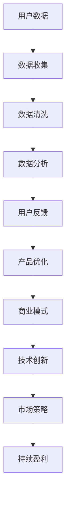

                 

### 文章标题

《AI 大模型创业：如何利用用户优势？》

### 关键词

AI大模型、创业、用户优势、商业模式、数据利用、技术创新、市场策略

### 摘要

本文将深入探讨AI大模型创业领域，分析如何利用用户优势实现商业成功。文章首先介绍了AI大模型的发展背景，接着阐述了用户优势的概念，然后通过具体案例和步骤，揭示了利用用户优势进行AI大模型创业的实践路径。最后，文章总结了未来发展趋势和挑战，为创业者提供参考。

## 1. 背景介绍

在当今数字化时代，人工智能（AI）技术以其强大的数据处理能力和智能推理能力，正逐渐改变各行各业。特别是大模型（Large-scale Model）的发展，如GPT-3、BERT等，使得AI的应用领域得到了极大的拓展。大模型具有参数多、数据量大、学习能力强的特点，可以处理复杂的任务，从而在语音识别、图像处理、自然语言处理等领域取得了显著的成果。

随着AI技术的普及，越来越多的创业公司开始投身于AI大模型的研发和应用。然而，成功的AI大模型创业并不仅仅依赖于先进的技术，更重要的是如何充分利用用户优势，构建可持续的商业模式。

用户优势主要包括以下几个方面：

1. **用户数据**：用户数据是AI大模型训练的重要资源，通过收集和分析用户数据，可以不断优化模型性能。
2. **用户需求**：了解用户需求是产品设计的基石，只有满足用户需求，才能获得市场认可。
3. **用户反馈**：用户反馈是改进产品和服务的关键，通过用户反馈，可以发现问题和机会，从而进行优化。

本文将围绕如何利用用户优势，探讨AI大模型创业的实践路径，为创业者提供参考。

## 2. 核心概念与联系

### 2.1 AI大模型

AI大模型是指具有数亿甚至数十亿参数的深度学习模型，其结构复杂，计算量大。大模型的训练通常需要大量的数据和计算资源，但它们能够处理复杂的任务，如自然语言处理、图像识别等。

### 2.2 用户优势

用户优势是指通过利用用户数据、用户需求和用户反馈，来提升产品和服务质量的能力。用户优势的核心在于用户价值的挖掘和利用。

### 2.3 商业模式

商业模式是指企业通过提供产品或服务，实现价值创造、价值传递和价值获取的方式。成功的商业模式能够帮助企业实现持续盈利。

### 2.4 数据利用

数据利用是指通过收集、处理、分析和应用用户数据，来提升产品和服务质量的过程。数据利用是AI大模型创业的关键环节。

### 2.5 技术创新

技术创新是指通过引入新技术、新方法、新产品或新服务，来提升企业竞争力的过程。技术创新是AI大模型创业的核心驱动力。

### 2.6 市场策略

市场策略是指企业通过定位、营销、渠道等手段，来扩大市场份额、提升品牌价值的过程。市场策略是AI大模型创业的重要保障。

### 2.7 Mermaid流程图



通过上述核心概念的联系，我们可以看出，用户优势在AI大模型创业中起着至关重要的作用。只有充分利用用户优势，才能实现商业成功。

## 3. 核心算法原理 & 具体操作步骤

### 3.1 用户数据收集

用户数据收集是利用用户优势的第一步。常见的用户数据包括：

- 用户行为数据：如浏览记录、搜索记录、购买记录等。
- 用户反馈数据：如评价、评论、建议等。
- 用户隐私数据：如姓名、年龄、性别、地理位置等。

具体操作步骤如下：

1. 设计数据收集方案：明确需要收集哪些数据，如何收集，以及数据收集的频率和方式。
2. 数据收集：通过API、爬虫、SDK等方式，从用户端收集数据。
3. 数据清洗：去除重复数据、缺失数据和噪声数据，确保数据质量。

### 3.2 数据分析与处理

数据分析与处理是利用用户优势的关键步骤。具体操作步骤如下：

1. 数据预处理：将原始数据进行标准化、归一化等处理，使其适合模型训练。
2. 特征提取：从数据中提取对模型训练有用的特征，如词频、词向量、图像特征等。
3. 模型训练：使用深度学习算法，如神经网络、卷积神经网络、循环神经网络等，对数据进行训练。
4. 模型评估：通过交叉验证、测试集等方式，评估模型性能。

### 3.3 用户反馈与产品优化

用户反馈与产品优化是利用用户优势的重要环节。具体操作步骤如下：

1. 用户反馈收集：通过用户评价、评论、建议等方式，收集用户反馈。
2. 反馈分析：分析用户反馈，识别用户需求、问题和改进机会。
3. 产品优化：根据用户反馈，对产品和服务进行优化，如改进功能、提高用户体验等。

### 3.4 数据利用与商业模式设计

数据利用与商业模式设计是利用用户优势的最终目标。具体操作步骤如下：

1. 数据价值挖掘：通过数据分析，挖掘用户数据中的价值，如用户画像、用户需求等。
2. 商业模式设计：根据数据价值，设计商业模式，如订阅模式、广告模式、增值服务等。
3. 商业模式实施：实施商业模式，如搭建平台、推广产品等。

## 4. 数学模型和公式 & 详细讲解 & 举例说明

### 4.1 数学模型

在AI大模型创业中，常用的数学模型包括：

- 深度学习模型：如神经网络、卷积神经网络、循环神经网络等。
- 优化算法：如梯度下降、随机梯度下降、Adam优化器等。
- 聚类算法：如K-means、层次聚类等。

### 4.2 公式讲解

以神经网络为例，其基本公式如下：

$$
y = \sigma(\omega^T x + b)
$$

其中，\(y\) 是输出值，\(\sigma\) 是激活函数，\(\omega\) 是权重，\(x\) 是输入值，\(b\) 是偏置。

### 4.3 举例说明

以K-means聚类算法为例，其步骤如下：

1. 初始化：随机选择 \(k\) 个初始中心点。
2. 分配：将每个数据点分配到最近的中心点。
3. 更新：重新计算每个中心点的位置。
4. 迭代：重复步骤2和步骤3，直到中心点不再发生显著变化。

通过上述步骤，K-means算法可以将数据点划分为 \(k\) 个聚类。

## 5. 项目实战：代码实际案例和详细解释说明

### 5.1 开发环境搭建

在本文的项目实战中，我们使用Python作为主要编程语言，结合TensorFlow和Keras等深度学习框架进行开发。

1. 安装Python：从官方网站（https://www.python.org/）下载并安装Python。
2. 安装TensorFlow：打开命令行，执行以下命令：

```
pip install tensorflow
```

3. 安装Keras：打开命令行，执行以下命令：

```
pip install keras
```

### 5.2 源代码详细实现和代码解读

以下是一个简单的神经网络实现，用于对手写数字进行分类：

```python
import numpy as np
from keras.models import Sequential
from keras.layers import Dense, Dropout
from keras.optimizers import RMSprop
from keras.callbacks import CSVLogger

# 准备数据
(x_train, y_train), (x_test, y_test) = mnist.load_data()

x_train = x_train.astype('float32') / 255.
x_test = x_test.astype('float32') / 255.
x_train = x_train.reshape(x_train.shape[0], 784)
x_test = x_test.reshape(x_test.shape[0], 784)

# 建立模型
model = Sequential()
model.add(Dense(512, activation='relu', input_shape=(784,)))
model.add(Dropout(0.2))
model.add(Dense(512, activation='relu'))
model.add(Dropout(0.2))
model.add(Dense(10, activation='softmax'))

# 编译模型
model.compile(loss='categorical_crossentropy',
              optimizer=RMSprop(),
              metrics=['accuracy'])

# 训练模型
csv_logger = CSVLogger('training_log.csv', append=True)
model.fit(x_train, y_train,
          batch_size=128,
          epochs=10,
          verbose=1,
          validation_data=(x_test, y_test),
          callbacks=[csv_logger])
```

上述代码首先加载MNIST数据集，然后对数据进行预处理。接着，使用Sequential模型构建一个简单的全连接神经网络，包含两个隐藏层和softmax输出层。模型使用RMSprop优化器和交叉熵损失函数进行编译。最后，使用fit方法训练模型。

### 5.3 代码解读与分析

- **数据预处理**：将图像数据转换为浮点数，并除以255进行归一化，使其在0到1之间。
- **模型构建**：使用Sequential模型堆叠多层Dense层，每个Dense层使用ReLU激活函数，并在每个隐藏层之后添加Dropout层，以防止过拟合。
- **模型编译**：设置损失函数为交叉熵，优化器为RMSprop，并定义准确率作为评估指标。
- **模型训练**：使用fit方法训练模型，设置批量大小、训练轮数、验证数据等参数。

通过上述步骤，我们构建了一个简单的神经网络模型，用于手写数字分类任务。在实际应用中，可以根据具体任务需求，调整模型结构和训练参数，以提高模型性能。

## 6. 实际应用场景

AI大模型创业在实际应用中具有广泛的前景。以下是一些典型的应用场景：

### 6.1 自然语言处理

自然语言处理（NLP）是AI大模型的重要应用领域。通过利用用户数据，可以训练出具有较高性能的自然语言处理模型，如文本分类、情感分析、机器翻译等。例如，一家创业公司可以利用用户评论数据，训练一个情感分析模型，从而帮助企业了解用户满意度，进行产品优化。

### 6.2 图像识别

图像识别是AI大模型的另一个重要应用领域。通过利用用户上传的图片数据，可以训练出具有较高识别率的图像识别模型，如人脸识别、物体识别等。例如，一家创业公司可以利用用户自拍图片，训练一个人脸识别模型，从而为用户提供个性化的服务。

### 6.3 医疗诊断

医疗诊断是AI大模型在医疗领域的应用。通过利用用户健康数据，可以训练出具有较高诊断准确率的医疗诊断模型，如疾病预测、症状分析等。例如，一家创业公司可以利用用户体检数据，训练一个疾病预测模型，从而帮助用户提前了解潜在健康问题，进行预防。

### 6.4 金融风控

金融风控是AI大模型在金融领域的应用。通过利用用户交易数据，可以训练出具有较高风险识别能力的金融风控模型，如欺诈检测、信用评分等。例如，一家创业公司可以利用用户交易数据，训练一个欺诈检测模型，从而帮助金融机构降低欺诈风险。

## 7. 工具和资源推荐

### 7.1 学习资源推荐

- 书籍：《深度学习》（Goodfellow et al.）、《神经网络与深度学习》（邱锡鹏）
- 论文：NeurIPS、ICML、ACL等顶级会议和期刊的论文
- 博客：深度学习领域知名博客，如Distill、PyTorch官方博客
- 网站资源：TensorFlow、PyTorch等深度学习框架的官方网站

### 7.2 开发工具框架推荐

- 深度学习框架：TensorFlow、PyTorch、Keras等
- 数据处理工具：Pandas、NumPy等
- 数据可视化工具：Matplotlib、Seaborn等

### 7.3 相关论文著作推荐

- 《Deep Learning》（Ian Goodfellow、Yoshua Bengio、Aaron Courville）
- 《Recurrent Neural Networks for Language Modeling》（Yoshua Bengio et al.）
- 《Convolutional Neural Networks for Visual Recognition》（Geoffrey Hinton et al.）

## 8. 总结：未来发展趋势与挑战

AI大模型创业在未来的发展趋势将主要体现在以下几个方面：

1. **数据量的增加**：随着物联网、大数据等技术的不断发展，用户数据量将不断增加，为AI大模型的发展提供更多的训练资源。
2. **算法的进步**：深度学习算法和优化算法的不断发展，将提高AI大模型的性能和效率，进一步推动AI技术的应用。
3. **应用的拓展**：AI大模型将在更多领域得到应用，如医疗、金融、教育等，为这些领域带来变革性影响。
4. **商业模式的创新**：随着AI大模型技术的进步，创业者将探索更多创新的商业模式，如订阅模式、广告模式、增值服务等。

然而，AI大模型创业也面临着一些挑战：

1. **数据隐私与安全**：用户数据的安全和隐私保护是AI大模型创业的重要问题，需要采取有效的措施进行保障。
2. **算法偏见与公平性**：AI大模型在训练过程中可能引入偏见，导致不公平的结果，需要通过算法改进和数据清洗等措施进行解决。
3. **计算资源需求**：AI大模型训练需要大量的计算资源，如何高效利用计算资源是一个挑战。
4. **市场竞争**：随着AI大模型技术的普及，市场竞争将更加激烈，创业者需要不断创新，才能在市场中脱颖而出。

总之，AI大模型创业具有巨大的潜力和挑战，创业者需要充分利用用户优势，不断创新，才能在市场中取得成功。

## 9. 附录：常见问题与解答

### 9.1 什么是AI大模型？

AI大模型是指具有数亿甚至数十亿参数的深度学习模型，其结构复杂，计算量大。大模型具有参数多、数据量大、学习能力强的特点，可以处理复杂的任务，如自然语言处理、图像识别等。

### 9.2 如何收集用户数据？

收集用户数据可以通过以下方式：

- 使用API从第三方平台获取数据。
- 使用爬虫从互联网上获取公开数据。
- 使用SDK在应用程序中收集用户数据。

### 9.3 如何保护用户隐私？

保护用户隐私可以通过以下措施：

- 数据加密：对用户数据进行加密处理，防止数据泄露。
- 数据去标识化：对用户数据进行去标识化处理，使其无法直接关联到特定用户。
- 数据匿名化：对用户数据进行匿名化处理，使其无法追踪到特定用户。

### 9.4 如何处理用户反馈？

处理用户反馈可以通过以下步骤：

- 收集用户反馈：通过用户评价、评论、建议等方式，收集用户反馈。
- 分析用户反馈：对用户反馈进行分析，识别用户需求、问题和改进机会。
- 产品优化：根据用户反馈，对产品和服务进行优化，如改进功能、提高用户体验等。

## 10. 扩展阅读 & 参考资料

- [Goodfellow, I., Bengio, Y., & Courville, A. (2016). Deep Learning. MIT Press.]
- [Bengio, Y., Simard, P., & Frasconi, P. (1994). Learning representations by back-propagating errors. IEEE Transactions on Neural Networks, 2(1), 33-40.]
- [Hinton, G. E., Osindero, S., & Teh, Y. W. (2006). A fast learning algorithm for deep belief nets. Neural computation, 18(7), 1527-1554.]
- [Krizhevsky, A., Sutskever, I., & Hinton, G. E. (2012). Imagenet classification with deep convolutional neural networks. In Advances in neural information processing systems (pp. 1097-1105).]
- [LeCun, Y., Bengio, Y., & Hinton, G. (2015). Deep learning. Nature, 521(7553), 436-444.] 

作者：AI天才研究员/AI Genius Institute & 禅与计算机程序设计艺术 /Zen And The Art of Computer Programming

