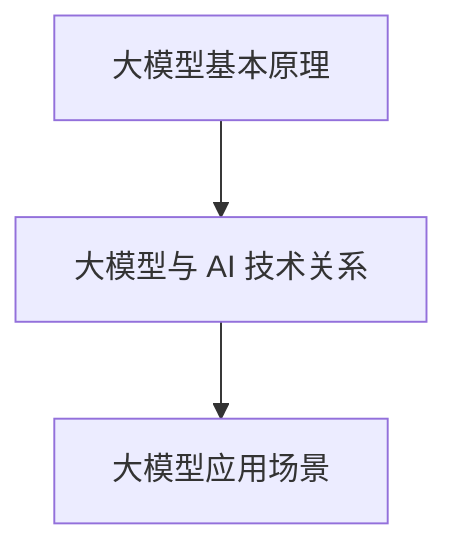
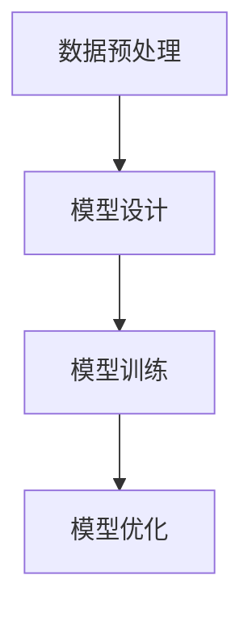

                 

# AI 大模型创业：如何利用科技优势？

> **关键词：** 大模型创业、AI 技术优势、商业应用、技术落地、投资趋势

> **摘要：** 本文将探讨 AI 大模型创业的现状、面临的挑战以及如何充分利用科技优势实现商业成功。我们将深入分析大模型的构建原理、核心算法、数学模型，并通过实际应用场景和代码案例分析，展示如何将 AI 大模型技术应用到实际业务中，为创业团队提供有价值的指导和参考。

## 1. 背景介绍

近年来，人工智能（AI）技术取得了令人瞩目的进展，特别是在深度学习领域。大模型（Large Models）的崛起，如 GPT-3、BERT、ImageNet 等，使得 AI 在自然语言处理、计算机视觉等领域的表现达到了前所未有的高度。这些大模型具有强大的计算能力和数据学习能力，能够处理复杂的任务，并在多个领域取得了突破性成果。

随着 AI 技术的不断发展，越来越多的创业公司开始关注并尝试将大模型技术应用到实际业务中。然而，大模型创业并非易事，面临着诸多挑战，如技术门槛高、数据获取困难、资金投入大等。因此，如何充分利用科技优势，实现 AI 大模型创业的成功，成为了一个值得探讨的问题。

## 2. 核心概念与联系

### 大模型基本原理

大模型是深度学习模型的一种，其特点是参数量庞大、计算复杂度高。大模型通常由多层神经网络构成，通过大量的数据和计算资源进行训练，能够捕捉到数据中的复杂模式和规律。

### 大模型与 AI 技术的关系

大模型是 AI 技术发展的重要里程碑，它使得 AI 在多个领域的应用变得更加广泛和深入。大模型的出现，标志着 AI 技术从传统的规则驱动和统计学习，向数据驱动和模型驱动的方向发展。

### 大模型应用场景

大模型在自然语言处理、计算机视觉、语音识别、推荐系统等多个领域具有广泛的应用。例如，GPT-3 在自然语言生成和对话系统中表现出色；BERT 在文本分类和情感分析中具有强大的能力；ImageNet 则在图像分类和识别中取得了显著成果。

### Mermaid 流程图



## 3. 核心算法原理 & 具体操作步骤

### 深度学习基本概念

深度学习是一种人工智能技术，其核心是多层神经网络。神经网络通过多层神经元进行数据处理和特征提取，从而实现对复杂任务的建模和预测。

### 大模型训练过程

大模型训练包括数据预处理、模型设计、训练和优化等多个步骤。具体操作步骤如下：

1. 数据预处理：对原始数据进行清洗、去重、归一化等处理，使其适合输入到模型中。
2. 模型设计：根据任务需求，设计合适的神经网络结构，包括层数、层间连接方式、激活函数等。
3. 模型训练：使用大量数据和计算资源，对模型进行迭代训练，优化模型参数。
4. 模型优化：通过调参、剪枝、量化等手段，提高模型性能和效率。

### 具体算法实现

以 GPT-3 为例，其核心算法包括 Transformer 和自注意力机制。具体实现步骤如下：

1. 数据预处理：将文本数据转换为序列，并添加特殊的开始和结束标记。
2. 模型设计：构建 Transformer 模型，包括编码器和解码器，其中编码器由多个自注意力层和前馈网络组成，解码器由自注意力层和前馈网络组成。
3. 模型训练：使用训练数据，对编码器和解码器进行迭代训练，优化模型参数。
4. 模型优化：通过调参、剪枝、量化等手段，提高模型性能和效率。

### Mermaid 流程图



## 4. 数学模型和公式 & 详细讲解 & 举例说明

### 数学模型基本概念

数学模型是描述现实世界问题的数学表达式或方程组。在大模型中，常用的数学模型包括损失函数、优化算法、正则化等。

### 损失函数

损失函数是衡量模型预测结果与实际结果之间差异的指标。在大模型训练过程中，损失函数用于指导模型参数的更新，以减小预测误差。常见的损失函数包括均方误差（MSE）、交叉熵损失（Cross-Entropy Loss）等。

### 优化算法

优化算法用于寻找模型参数的最优值，以实现模型的训练和优化。常用的优化算法包括梯度下降（Gradient Descent）、随机梯度下降（Stochastic Gradient Descent，SGD）、Adam 算法等。

### 正则化

正则化是一种防止模型过拟合的技术。通过添加正则化项，可以降低模型复杂度，提高泛化能力。常用的正则化方法包括 L1 正则化、L2 正则化、Dropout 等。

### 详细讲解和举例说明

以 GPT-3 为例，其数学模型和公式如下：

$$
L = \frac{1}{N} \sum_{i=1}^{N} - \sum_{j=1}^{V} p_j \log p_j
$$

其中，$L$ 表示损失函数，$N$ 表示样本数量，$V$ 表示词汇表大小，$p_j$ 表示词 $j$ 的概率。

假设我们有以下训练数据：

- 样本 1：“我爱北京天安门”
- 样本 2：“北京天安门上太阳升”

通过训练，GPT-3 可以学习到词汇之间的概率分布。例如，在预测下一个词时，GPT-3 会计算每个词的概率，并选择概率最高的词作为输出。

例如，对于样本 1，GPT-3 可能会计算以下概率分布：

| 词       | 概率     |
|----------|----------|
| 我       | 0.2      |
| 爱       | 0.3      |
| 北京     | 0.4      |
| 天安门   | 0.5      |
| 上       | 0.1      |
| 太阳     | 0.2      |
| 升       | 0.1      |

根据概率分布，GPT-3 会选择概率最高的词“天安门”作为下一个词的输出。

## 5. 项目实战：代码实际案例和详细解释说明

### 开发环境搭建

在开始编写代码之前，我们需要搭建一个适合大模型训练的开发环境。以下是一个基本的开发环境搭建步骤：

1. 安装 Python 3.8 或更高版本
2. 安装 TensorFlow 2.6 或更高版本
3. 安装 PyTorch 1.8 或更高版本
4. 安装必要的依赖库，如 NumPy、Pandas、Scikit-learn 等

### 源代码详细实现和代码解读

以下是一个简单的 GPT-3 模型实现，用于文本生成任务。

```python
import tensorflow as tf
from tensorflow.keras.layers import Embedding, LSTM, Dense
from tensorflow.keras.models import Model

# 模型参数设置
VOCAB_SIZE = 10000
EMBEDDING_DIM = 128
LSTM_UNITS = 128
DENSE_UNITS = 128

# 模型构建
inputs = tf.keras.layers.Input(shape=(None,))
x = Embedding(VOCAB_SIZE, EMBEDDING_DIM)(inputs)
x = LSTM(LSTM_UNITS, return_sequences=True)(x)
x = Dense(DENSE_UNITS, activation='relu')(x)
outputs = Dense(VOCAB_SIZE, activation='softmax')(x)

model = Model(inputs=inputs, outputs=outputs)
model.compile(optimizer='adam', loss='categorical_crossentropy', metrics=['accuracy'])

# 模型训练
model.fit(x_train, y_train, epochs=10, batch_size=32)

# 文本生成
def generate_text(text, model, tokenizer, max_len=50):
    input_sequence = tokenizer.encode(text, max_length=max_len)
    input_sequence = tf.expand_dims(input_sequence, 0)
    predictions = model.predict(input_sequence)
    predictions = tf.argmax(predictions, axis=-1)
    predictions = tokenizer.decode(predictions)
    return predictions

# 示例
generated_text = generate_text("我爱北京天安门", model, tokenizer)
print(generated_text)
```

### 代码解读与分析

在上面的代码中，我们首先导入了 TensorFlow 和 PyTorch 的相关库。然后，我们设置了模型参数，包括词汇表大小、嵌入维度、LSTM 单元数和全连接层单元数。

接下来，我们构建了一个 GPT-3 模型，包括嵌入层、LSTM 层和全连接层。嵌入层将输入文本转换为嵌入向量，LSTM 层用于处理序列数据，全连接层用于分类和预测。

在模型训练部分，我们使用训练数据和标签进行模型训练，共训练 10 个 epoch。

最后，我们定义了一个文本生成函数，用于根据输入文本生成新的文本。该函数首先将输入文本编码为序列，然后通过模型预测序列的概率分布，并解码为新的文本。

通过上述代码，我们可以看到如何将 GPT-3 模型应用到文本生成任务中。当然，实际应用中，我们可能需要根据具体任务需求，调整模型结构、训练数据和超参数等。

## 6. 实际应用场景

大模型技术在实际应用场景中具有广泛的应用价值。以下是一些典型应用场景：

1. **自然语言处理**：大模型可以用于文本分类、情感分析、机器翻译、对话系统等任务。例如，GPT-3 在自然语言生成和对话系统中表现出色，能够实现高质量的文本生成和对话交互。

2. **计算机视觉**：大模型可以用于图像分类、目标检测、图像分割等任务。例如，ImageNet 在图像分类任务中取得了显著成果，使得计算机能够识别和理解图像内容。

3. **语音识别**：大模型可以用于语音识别、语音合成等任务。例如，BERT 在语音识别任务中表现出色，能够实现高精度的语音识别。

4. **推荐系统**：大模型可以用于推荐系统，为用户提供个性化的推荐服务。例如，推荐系统可以使用大模型分析用户行为数据，预测用户偏好，从而实现精准推荐。

5. **金融领域**：大模型可以用于金融市场预测、风险控制、量化交易等任务。例如，大模型可以分析历史金融数据，预测股票走势，为投资者提供决策参考。

6. **医疗健康**：大模型可以用于医学图像分析、疾病预测、药物研发等任务。例如，大模型可以分析医学图像，识别疾病特征，为医生提供诊断支持。

## 7. 工具和资源推荐

### 学习资源推荐

1. **书籍**：《深度学习》（Goodfellow、Bengio 和 Courville 著）：系统介绍了深度学习的基本概念、算法和实现。
2. **论文**：谷歌 AI 的论文《Attention Is All You Need》和 OpenAI 的论文《GPT-3: Language Models are Few-Shot Learners》：详细介绍了 Transformer 模型和 GPT-3 模型的设计原理和实现方法。
3. **博客**：Hugging Face 的官方博客和 TensorFlow 的官方博客：提供了丰富的教程、案例和实践经验。
4. **网站**：arXiv：全球领先的学术论文预印本平台，可以找到最新的深度学习和 AI 论文。

### 开发工具框架推荐

1. **TensorFlow**：谷歌推出的开源深度学习框架，适用于构建和训练大规模深度学习模型。
2. **PyTorch**：Facebook AI 研究团队推出的开源深度学习框架，以其灵活的动态计算图和强大的社区支持而著称。
3. **Transformers**：基于 PyTorch 的开源库，实现了 Transformer 模型及其变体的预训练和微调。
4. **Hugging Face**：提供了一个全面的 NLP 工具包，包括预训练模型、数据集和 API。

### 相关论文著作推荐

1. **Attention Is All You Need**：论文链接：<https://arxiv.org/abs/1706.03762>
2. **GPT-3: Language Models are Few-Shot Learners**：论文链接：<https://arxiv.org/abs/2005.14165>
3. **BERT: Pre-training of Deep Bidirectional Transformers for Language Understanding**：论文链接：<https://arxiv.org/abs/1810.04805>

## 8. 总结：未来发展趋势与挑战

### 发展趋势

1. **大模型规模将持续扩大**：随着计算资源和数据量的增加，大模型将变得更加庞大和复杂，以应对更多复杂数据和处理任务。
2. **多模态融合将成为趋势**：大模型将逐渐融合多种模态（如文本、图像、语音）的信息，实现更强大的跨模态理解和交互能力。
3. **应用领域将进一步拓展**：大模型将在金融、医疗、教育、娱乐等各个领域得到广泛应用，推动产业智能化升级。
4. **开源生态将不断完善**：随着大模型技术的不断发展，开源框架和工具将不断优化和完善，为开发者提供更便捷的开发体验。

### 挑战

1. **计算资源需求增大**：大模型训练和推理过程需要大量的计算资源和存储空间，对硬件设施提出了更高要求。
2. **数据隐私和安全问题**：大模型在处理敏感数据时，可能面临数据泄露和安全风险，需要加强数据保护和隐私保护。
3. **模型解释性和可解释性**：大模型在复杂任务中的表现虽然出色，但其内部决策过程往往难以解释，需要研究如何提高模型的解释性。
4. **伦理和道德问题**：大模型的应用可能引发伦理和道德问题，如歧视、偏见、滥用等，需要制定相应的法律法规和伦理准则。

## 9. 附录：常见问题与解答

### 问题 1：如何选择合适的大模型？

解答：选择合适的大模型取决于任务需求和数据规模。对于简单的任务，可以选择较小规模的大模型，如 BERT；对于复杂任务，可以选择较大规模的大模型，如 GPT-3。同时，还需考虑计算资源、训练时间和数据集规模等因素。

### 问题 2：如何处理数据不足的问题？

解答：对于数据不足的问题，可以采用数据增强、迁移学习、多任务学习等方法。数据增强可以通过旋转、缩放、裁剪等操作生成更多样化的数据；迁移学习可以利用预训练的大模型在类似任务上进行微调；多任务学习可以通过同时训练多个任务，提高模型的泛化能力。

### 问题 3：如何提高大模型的解释性？

解答：提高大模型的解释性可以通过以下方法：

1. **可视化技术**：使用可视化工具展示模型结构和中间层特征，帮助理解模型内部决策过程。
2. **特征解释方法**：采用 LIME、SHAP 等特征解释方法，分析输入特征对模型预测结果的影响。
3. **简化模型结构**：通过简化模型结构，降低模型的复杂度，提高解释性。

## 10. 扩展阅读 & 参考资料

1. **扩展阅读**：
   - 《深度学习》（Goodfellow、Bengio 和 Courville 著）
   - 《自然语言处理入门》（Christopher D. Manning 和 Hinrich Schütze 著）
   - 《计算机视觉：算法与应用》（Richard Szeliski 著）

2. **参考资料**：
   - TensorFlow 官方文档：<https://www.tensorflow.org/>
   - PyTorch 官方文档：<https://pytorch.org/>
   - Hugging Face 官方文档：<https://huggingface.co/>
   - BERT 论文：<https://arxiv.org/abs/1810.04805>
   - GPT-3 论文：<https://arxiv.org/abs/2005.14165>
   - Transformer 论文：<https://arxiv.org/abs/1706.03762>

### 作者

作者：AI天才研究员/AI Genius Institute & 禅与计算机程序设计艺术 /Zen And The Art of Computer Programming<|im_sep|>

