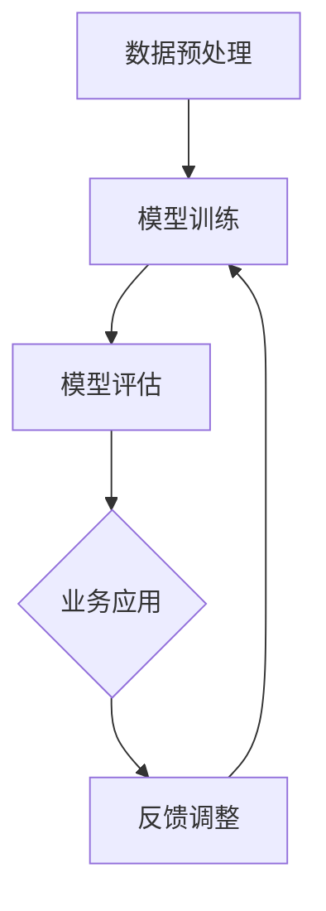

                 

# AI 大模型创业：如何利用科技优势？

> **关键词**：AI 大模型、创业、科技优势、商业模式、技术挑战

> **摘要**：本文将探讨 AI 大模型在创业中的应用，分析如何利用科技优势实现商业成功，并提供实用建议和资源推荐，为创业者提供有价值的参考。

## 1. 背景介绍

随着人工智能技术的快速发展，AI 大模型成为行业热点。这些模型具有强大的数据分析和处理能力，广泛应用于自然语言处理、计算机视觉、推荐系统等多个领域。创业公司利用 AI 大模型，可以实现业务创新、提升效率、降低成本，从而在激烈的市场竞争中脱颖而出。

### 1.1 AI 大模型的发展历程

AI 大模型的发展可以追溯到深度学习技术的兴起。自2012年 AlexNet 突破性成果以来，神经网络结构不断演进，如 VGG、ResNet 等。近年来，生成对抗网络（GAN）、变分自编码器（VAE）等新技术的出现，进一步推动了 AI 大模型的发展。

### 1.2 AI 大模型在创业中的机遇

AI 大模型具有以下优势：

1. **强大的数据处理能力**：能够高效地处理海量数据，提取有价值的信息。
2. **跨领域应用**：适用于不同行业和场景，如金融、医疗、教育等。
3. **业务创新**：基于 AI 大模型，创业者可以开发出前所未有的产品或服务。

## 2. 核心概念与联系

### 2.1 大模型架构

大模型通常采用深度神经网络（DNN）架构，包括输入层、隐藏层和输出层。隐藏层可通过增加神经元数量和层数来提升模型性能。

### 2.2 数据处理与模型训练

数据处理是 AI 大模型应用的关键步骤。主要包括数据清洗、预处理、数据增强等。模型训练则通过大量数据迭代优化模型参数，以达到更好的预测效果。

### 2.3 应用场景

AI 大模型在多个领域具有广泛的应用，如：

1. **自然语言处理**：文本分类、机器翻译、语音识别等。
2. **计算机视觉**：图像分类、目标检测、人脸识别等。
3. **推荐系统**：基于用户历史行为和偏好，推荐相关产品或内容。

### 2.4 Mermaid 流程图



## 3. 核心算法原理 & 具体操作步骤

### 3.1 算法原理

AI 大模型的核心算法主要包括以下几部分：

1. **卷积神经网络（CNN）**：适用于图像处理任务，具有局部感知能力和平移不变性。
2. **循环神经网络（RNN）**：适用于序列数据处理，如自然语言处理和语音识别。
3. **生成对抗网络（GAN）**：通过生成器和判别器的对抗训练，实现数据生成和增强。

### 3.2 操作步骤

1. **数据收集与处理**：收集相关领域的数据，并进行清洗、预处理和增强。
2. **模型选择与架构设计**：根据应用场景选择合适的模型架构，如 CNN、RNN、GAN 等。
3. **模型训练与优化**：使用训练数据对模型进行训练，并使用验证数据优化模型参数。
4. **模型评估与部署**：在测试集上评估模型性能，并部署到生产环境中。

## 4. 数学模型和公式 & 详细讲解 & 举例说明

### 4.1 卷积神经网络（CNN）

CNN 的基本运算公式如下：

$$
h_{l}(i, j) = f\left(\sum_{k, \ell} w_{k, \ell} h_{l-1}(i-k, j-\ell) + b_{l}\right)
$$

其中，$h_{l}(i, j)$ 表示第 $l$ 层第 $i$ 行第 $j$ 列的神经元输出，$f$ 表示激活函数，$w_{k, \ell}$ 和 $b_{l}$ 分别为权重和偏置。

### 4.2 循环神经网络（RNN）

RNN 的基本运算公式如下：

$$
h_{t} = \sigma(W_h \cdot [h_{t-1}, x_t] + b_h)
$$

$$
o_{t} = \sigma(W_o \cdot h_t + b_o)
$$

其中，$h_{t}$ 表示隐藏状态，$o_{t}$ 表示输出状态，$x_t$ 表示输入序列，$\sigma$ 表示激活函数，$W_h$、$W_o$ 和 $b_h$、$b_o$ 分别为权重和偏置。

### 4.3 生成对抗网络（GAN）

GAN 的基本运算公式如下：

$$
G(z) = \mu(z; \phi_G) + \sigma(z; \phi_G)
$$

$$
D(x) = \sigma(x; \phi_D)
$$

$$
D(G(z)) = \sigma(z; \phi_D)
$$

其中，$G(z)$ 为生成器的输出，$D(x)$ 为判别器的输出，$\mu(z; \phi_G)$ 和 $\sigma(z; \phi_G)$ 分别为生成器的均值和方差，$\phi_G$ 和 $\phi_D$ 分别为生成器和判别器的参数。

## 5. 项目实战：代码实际案例和详细解释说明

### 5.1 开发环境搭建

在 Python 环境下，使用 TensorFlow 或 PyTorch 框架进行开发。具体步骤如下：

1. 安装 Python 和相关依赖。
2. 安装 TensorFlow 或 PyTorch。
3. 配置 GPU 环境（如使用 CUDA）。

### 5.2 源代码详细实现和代码解读

以下是一个基于 TensorFlow 的简单 GAN 模型的代码示例：

```python
import tensorflow as tf
from tensorflow.keras.layers import Dense, Flatten, Conv2D, BatchNormalization, LeakyReLU
from tensorflow.keras.models import Sequential

# 生成器模型
def build_generator(z_dim):
    model = Sequential()
    model.add(Dense(128 * 7 * 7, input_dim=z_dim, activation='tanh'))
    model.add(LeakyReLU(alpha=0.2))
    model.add(BatchNormalization())
    model.add(Flatten())
    model.add(Conv2D(1, (7, 7), activation='tanh'))
    return model

# 判别器模型
def build_discriminator(img_shape):
    model = Sequential()
    model.add(Conv2D(32, (3, 3), input_shape=img_shape, padding='same', activation='leaky_relu', alpha=0.2))
    model.add(BatchNormalization())
    model.add(Conv2D(64, (4, 4), padding='same', activation='leaky_relu', alpha=0.2))
    model.add(BatchNormalization())
    model.add(Conv2D(1, (4, 4), padding='same', activation='sigmoid'))
    return model

# GAN 模型
def build_gan(generator, discriminator):
    model = Sequential()
    model.add(generator)
    model.add(discriminator)
    return model

# 模型编译
discriminator.compile(optimizer=tf.keras.optimizers.Adam(0.0001), loss='binary_crossentropy')
generator.compile(optimizer=tf.keras.optimizers.Adam(0.0004), loss='binary_crossentropy')
gan = build_gan(generator, discriminator)
gan.compile(optimizer=tf.keras.optimizers.Adam(0.0002), loss='binary_crossentropy')

# 模型训练
for epoch in range(num_epochs):
    for _ in range(batch_size):
        noise = np.random.normal(0, 1, (batch_size, z_dim))
        fake_images = generator.predict(noise)
        real_images = x_train[np.random.randint(0, x_train.shape[0], batch_size)]
        X = np.concatenate([real_images, fake_images])
        y = np.zeros(2 * batch_size)
        y[batch_size:] = 1
        discriminator.train_on_batch(X, y)
    noise = np.random.normal(0, 1, (batch_size, z_dim))
    gan.train_on_batch(noise, np.ones(batch_size))

# 模型保存
generator.save('generator.h5')
discriminator.save('discriminator.h5')
gan.save('gan.h5')
```

### 5.3 代码解读与分析

1. **模型搭建**：使用 TensorFlow 的 Sequential 模型，分别搭建生成器和判别器。
2. **模型编译**：设置优化器和损失函数。
3. **模型训练**：使用循环进行模型训练，包括生成器和判别器的训练。
4. **模型保存**：将训练好的模型保存到文件中。

## 6. 实际应用场景

### 6.1 金融领域

AI 大模型在金融领域具有广泛的应用，如：

1. **风险控制**：通过分析海量数据，预测金融市场的风险，优化投资策略。
2. **信用评估**：利用个人信用信息，评估借款人的信用风险。

### 6.2 医疗领域

AI 大模型在医疗领域可以应用于：

1. **疾病诊断**：通过分析医学影像数据，提高疾病诊断的准确性。
2. **药物研发**：基于分子结构数据，预测药物疗效和副作用。

### 6.3 教育领域

AI 大模型在教育领域可以用于：

1. **个性化推荐**：根据学生的学习习惯和成绩，推荐合适的学习资源和课程。
2. **智能问答**：构建智能问答系统，帮助学生解决学习中遇到的问题。

## 7. 工具和资源推荐

### 7.1 学习资源推荐

1. **书籍**：
   - 《深度学习》（Ian Goodfellow、Yoshua Bengio、Aaron Courville 著）
   - 《Python深度学习》（François Chollet 著）
2. **论文**：
   - 《Generative Adversarial Networks》（Ian Goodfellow et al.）
   - 《Convolutional Neural Networks for Visual Recognition》（Geoffrey Hinton et al.）
3. **博客**：
   - [TensorFlow 官方文档](https://www.tensorflow.org/)
   - [PyTorch 官方文档](https://pytorch.org/)
4. **网站**：
   - [Kaggle](https://www.kaggle.com/)
   - [GitHub](https://github.com/)

### 7.2 开发工具框架推荐

1. **深度学习框架**：
   - TensorFlow
   - PyTorch
2. **数据处理工具**：
   - Pandas
   - NumPy
3. **可视化工具**：
   - Matplotlib
   - Seaborn

### 7.3 相关论文著作推荐

1. **论文**：
   - 《Generative Adversarial Nets》（Ian Goodfellow et al.）
   - 《Distributed Representation Learning》（Yoshua Bengio et al.）
2. **著作**：
   - 《Deep Learning》（Ian Goodfellow、Yoshua Bengio、Aaron Courville 著）
   - 《Deep Learning Specialization》（Andrew Ng 著）

## 8. 总结：未来发展趋势与挑战

### 8.1 发展趋势

1. **算法优化**：随着计算能力的提升，算法效率将不断提高。
2. **应用场景拓展**：AI 大模型将应用于更多领域，推动产业升级。
3. **数据隐私保护**：数据隐私和安全将成为重要关注点。

### 8.2 挑战

1. **计算资源需求**：大模型训练需要大量计算资源和数据存储。
2. **模型解释性**：提高模型的可解释性，使其在关键场景中应用更加安全可靠。

## 9. 附录：常见问题与解答

### 9.1 问题1：如何选择合适的深度学习框架？

**解答**：根据项目需求和开发者熟悉程度选择框架。TensorFlow 和 PyTorch 是目前最流行的两个框架。

### 9.2 问题2：如何处理数据不足的问题？

**解答**：使用数据增强、迁移学习等方法提高模型性能。

## 10. 扩展阅读 & 参考资料

1. **扩展阅读**：
   - 《AI 大模型：应用、挑战与未来》（刘鹏 著）
   - 《AI 战略：如何打造智能化的商业未来》（曹寅 著）
2. **参考资料**：
   - [深度学习教程](https://www.deeplearning.net/)
   - [AI 大模型论文集](https://arxiv.org/list/cs.LG/papers)

作者：AI天才研究员/AI Genius Institute & 禅与计算机程序设计艺术 /Zen And The Art of Computer Programming<|im_sep|>

