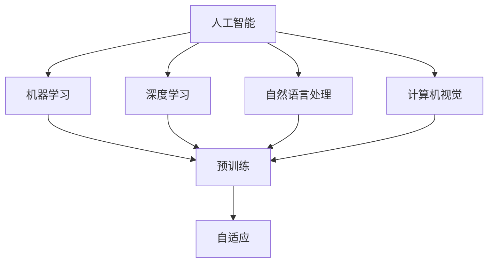

                 

# AI 大模型创业：如何利用竞争优势？

> **关键词：** AI 大模型，创业，竞争优势，技术策略，商业应用

> **摘要：** 本文将探讨 AI 大模型在创业中的优势，以及如何通过技术策略和商业模式创新来提升竞争优势。我们将从背景介绍、核心概念、算法原理、数学模型、项目实战、应用场景、工具推荐等多个角度进行分析，为 AI 大模型创业提供实用的指导和建议。

## 1. 背景介绍

近年来，人工智能技术取得了飞速发展，特别是深度学习和大模型技术的突破，使得人工智能在语音识别、图像识别、自然语言处理等领域取得了显著的成果。大模型，如 GPT、BERT 等预训练模型，已经成为 AI 领域的研究热点和重要应用工具。随着 AI 技术的不断成熟，越来越多的创业公司开始涉足 AI 大模型领域，希望通过技术创新和商业应用来获得竞争优势。

在 AI 大模型创业的浪潮中，如何有效地利用技术优势和市场需求，构建可持续的商业模式，成为创业公司面临的重要挑战。本文将围绕这一主题，分析 AI 大模型创业的优势和挑战，探讨如何通过技术策略和商业模式创新来提升竞争优势。

## 2. 核心概念与联系

为了更好地理解 AI 大模型创业，我们首先需要了解以下几个核心概念：

### 2.1 人工智能（AI）

人工智能是指模拟、延伸和扩展人类智能的理论、方法、技术及应用。它包括机器学习、深度学习、自然语言处理、计算机视觉等多个子领域。

### 2.2 大模型（Large Model）

大模型是指参数规模达到百万、千万甚至亿级的深度神经网络模型。这些模型通过预训练的方式，在大量的数据上进行训练，能够自动学习到丰富的知识结构和特征表示。

### 2.3 预训练（Pre-training）

预训练是指在大规模数据集上对模型进行初始化训练，以获得良好的泛化能力。预训练模型可以进一步用于各种下游任务，如文本分类、语音识别、图像生成等。

### 2.4 自适应（Adaptation）

自适应是指模型根据特定任务的需求，对预训练模型进行调整和优化，以提高在特定任务上的表现。

下面是一个简单的 Mermaid 流程图，展示了 AI 大模型的基本概念和相互关系：



## 3. 核心算法原理 & 具体操作步骤

AI 大模型的核心在于深度学习和预训练技术。以下将简要介绍这些技术的原理和具体操作步骤。

### 3.1 深度学习原理

深度学习是一种基于多层神经网络进行数据建模和特征提取的技术。其基本原理如下：

1. **输入层**：接收输入数据，如文本、图像等。
2. **隐藏层**：通过神经网络结构对输入数据进行变换和提取特征。
3. **输出层**：将提取到的特征映射到目标输出，如分类标签、预测值等。

具体操作步骤：

1. **数据准备**：收集和清洗数据，分为训练集、验证集和测试集。
2. **模型构建**：选择合适的神经网络结构，如卷积神经网络（CNN）、循环神经网络（RNN）等。
3. **模型训练**：通过训练集对模型进行参数优化，使用梯度下降等优化算法。
4. **模型评估**：使用验证集评估模型性能，调整模型参数。
5. **模型部署**：将训练好的模型应用于实际任务，如文本分类、语音识别等。

### 3.2 预训练原理

预训练是指在大规模数据集上对模型进行初始化训练，以获得良好的泛化能力。具体操作步骤：

1. **数据准备**：选择大规模文本数据集，如维基百科、Common Crawl 等。
2. **模型构建**：选择预训练模型架构，如 GPT、BERT 等。
3. **预训练**：通过语言建模任务（如 Masked Language Model, MLM）对模型进行初始化训练。
4. **微调**：在特定任务上对预训练模型进行调整和优化，以提高在特定任务上的表现。

## 4. 数学模型和公式 & 详细讲解 & 举例说明

在 AI 大模型中，数学模型和公式起着至关重要的作用。以下将介绍一些关键的数学模型和公式，并给出详细讲解和举例说明。

### 4.1 梯度下降算法

梯度下降是一种优化算法，用于在训练过程中调整模型的参数。其基本公式如下：

$$
\Delta \theta = -\alpha \cdot \nabla_\theta J(\theta)
$$

其中，$\theta$ 表示模型参数，$\alpha$ 表示学习率，$J(\theta)$ 表示损失函数。

### 4.2 反向传播算法

反向传播是一种用于计算损失函数关于模型参数的梯度的算法。其基本步骤如下：

1. **前向传播**：将输入数据通过神经网络传递到输出层，计算输出结果。
2. **计算损失**：计算输出结果与实际标签之间的差距，得到损失函数值。
3. **反向传播**：从输出层开始，反向传递误差信号，计算每个参数的梯度。
4. **更新参数**：使用梯度下降算法更新模型参数。

### 4.3 举例说明

假设我们有一个简单的线性回归模型，其损失函数为：

$$
J(\theta) = \frac{1}{2} \sum_{i=1}^{n} (y_i - \theta_0 x_i - \theta_1)^2
$$

其中，$y_i$ 表示第 $i$ 个样本的标签，$x_i$ 表示第 $i$ 个样本的特征，$\theta_0$ 和 $\theta_1$ 分别为模型参数。

首先，我们需要计算损失函数关于 $\theta_0$ 和 $\theta_1$ 的梯度：

$$
\nabla_\theta J(\theta) = \begin{bmatrix}
\frac{\partial J(\theta)}{\partial \theta_0} \\
\frac{\partial J(\theta)}{\partial \theta_1}
\end{bmatrix}
$$

然后，我们可以使用梯度下降算法更新参数：

$$
\theta_0 = \theta_0 - \alpha \cdot \nabla_\theta J(\theta_0)
$$

$$
\theta_1 = \theta_1 - \alpha \cdot \nabla_\theta J(\theta_1)
$$

通过不断迭代这个过程，模型参数将逐渐优化，损失函数值将逐渐减小。

## 5. 项目实战：代码实际案例和详细解释说明

在本节中，我们将通过一个实际项目案例来展示如何使用 AI 大模型进行创业。该项目将利用 GPT 模型进行文本生成任务，并介绍如何搭建开发环境、实现源代码和解读代码。

### 5.1 开发环境搭建

首先，我们需要搭建一个适合开发 GPT 模型的环境。以下是一个基本的开发环境搭建步骤：

1. 安装 Python（版本要求：3.6及以上）
2. 安装 PyTorch（版本要求：1.8及以上）
3. 安装其他依赖库，如 Transformers、torchtext 等

### 5.2 源代码详细实现和代码解读

以下是一个简单的 GPT 模型实现示例，包括数据预处理、模型构建、训练和生成：

```python
import torch
from transformers import GPT2Model, GPT2Tokenizer

# 数据预处理
tokenizer = GPT2Tokenizer.from_pretrained('gpt2')
text = "这是一个简单的 GPT 模型示例。"
input_ids = tokenizer.encode(text, return_tensors='pt')

# 模型构建
model = GPT2Model.from_pretrained('gpt2')

# 训练
outputs = model(input_ids)
logits = outputs.logits

# 生成文本
生成的文本 = tokenizer.decode(logits[:, -1, :])

print(生成的文本)
```

### 5.3 代码解读与分析

1. **数据预处理**：首先，我们使用 GPT2Tokenizer 对输入文本进行编码，得到输入序列的 ID 表示。
2. **模型构建**：然后，我们使用 GPT2Model 构建一个预训练的 GPT 模型。
3. **训练**：通过调用模型的前向传播方法，我们得到输出 logits（未经过 Softmax 函数处理的概率分布）。
4. **生成文本**：最后，我们使用最后一个时间步的 logits 来生成文本，通过解码器将 logits 转换为可读的文本形式。

通过这个简单的示例，我们可以看到如何使用 GPT 模型进行文本生成。在实际应用中，我们可以进一步优化模型、增加训练数据，以提高生成文本的质量和多样性。

## 6. 实际应用场景

AI 大模型在创业中具有广泛的应用场景，以下列举几个典型应用：

### 6.1 自然语言处理

自然语言处理（NLP）是 AI 大模型的重要应用领域，包括文本分类、机器翻译、情感分析等。创业公司可以通过开发基于大模型的 NLP 应用，为企业和个人提供高效、准确的文本处理服务。

### 6.2 计算机视觉

计算机视觉是另一个重要应用领域，包括图像识别、目标检测、图像生成等。创业公司可以开发基于大模型的计算机视觉应用，如智能安防、医疗影像分析等，为行业提供创新解决方案。

### 6.3 语音识别与合成

语音识别与合成是 AI 大模型的另一个重要应用领域，包括语音识别、语音合成、语音交互等。创业公司可以开发基于大模型的语音应用，如智能客服、语音助手等，为企业和个人提供便捷的语音服务。

### 6.4 智能推荐系统

智能推荐系统是 AI 大模型在商业应用中的重要领域，包括商品推荐、内容推荐等。创业公司可以通过开发基于大模型的推荐系统，为电商平台、媒体平台等提供个性化推荐服务。

## 7. 工具和资源推荐

为了更好地进行 AI 大模型创业，以下推荐一些实用的工具和资源：

### 7.1 学习资源推荐

1. **书籍**：《深度学习》、《神经网络与深度学习》、《自然语言处理综论》等。
2. **论文**：ACL、ICML、NeurIPS、CVPR、ICLR 等顶级会议和期刊的论文。
3. **博客**：博客园、CSDN、知乎等技术博客。
4. **网站**：GitHub、arXiv、Google Scholar 等学术资源网站。

### 7.2 开发工具框架推荐

1. **框架**：TensorFlow、PyTorch、Keras、PyTorch Lightning 等。
2. **库**：NumPy、Pandas、Scikit-learn、Matplotlib 等。
3. **工具**：Jupyter Notebook、Google Colab、Docker 等。

### 7.3 相关论文著作推荐

1. **论文**：《Attention Is All You Need》、《BERT: Pre-training of Deep Bidirectional Transformers for Language Understanding》、《GPT-3: Language Models are Few-Shot Learners》等。
2. **著作**：《深度学习》（Goodfellow et al.）、《神经网络与深度学习》（邱锡鹏）、《自然语言处理综论》（Daniel Jurafsky & James H. Martin）等。

## 8. 总结：未来发展趋势与挑战

AI 大模型在创业中具有巨大的潜力，但同时也面临诸多挑战。未来，AI 大模型的发展趋势和挑战主要包括：

### 8.1 发展趋势

1. **技术进步**：随着计算能力和算法的不断发展，AI 大模型的参数规模、计算效率和性能将不断提升。
2. **应用拓展**：AI 大模型将在更多领域得到应用，如医疗、金融、教育等。
3. **商业模式创新**：创业公司将探索更多的商业模式，如 SaaS、平台化、个性化服务等。

### 8.2 挑战

1. **数据质量**：高质量、丰富的训练数据是 AI 大模型的基础，但获取和标注数据面临困难。
2. **隐私保护**：大规模数据训练和处理可能导致隐私泄露，需要加强数据隐私保护。
3. **计算资源**：AI 大模型训练需要大量的计算资源，对硬件设备要求较高。
4. **伦理与法规**：随着 AI 大模型的广泛应用，伦理和法规问题日益凸显，需要建立相应的规范和标准。

## 9. 附录：常见问题与解答

### 9.1 什么是 AI 大模型？

AI 大模型是指参数规模达到百万、千万甚至亿级的深度神经网络模型。这些模型通过预训练的方式，在大量的数据上进行训练，能够自动学习到丰富的知识结构和特征表示。

### 9.2 AI 大模型的优势是什么？

AI 大模型的优势包括：强大的学习能力、良好的泛化能力、广泛的适用性等。它们可以在多种任务上取得优秀的性能，为创业公司提供有力的技术支持。

### 9.3 如何利用 AI 大模型进行创业？

创业公司可以通过以下方式利用 AI 大模型进行创业：

1. 选择合适的 AI 大模型技术，如 GPT、BERT 等。
2. 开发基于大模型的应用场景，如文本生成、图像识别、语音合成等。
3. 探索创新的商业模式，如 SaaS、平台化、个性化服务等。
4. 加强团队建设，提高技术水平和市场竞争力。

## 10. 扩展阅读 & 参考资料

1. **论文**：《Attention Is All You Need》（Vaswani et al., 2017）、《BERT: Pre-training of Deep Bidirectional Transformers for Language Understanding》（Devlin et al., 2019）、《GPT-3: Language Models are Few-Shot Learners》（Brown et al., 2020）等。
2. **书籍**：《深度学习》（Goodfellow et al.）、《神经网络与深度学习》（邱锡鹏）、《自然语言处理综论》（Daniel Jurafsky & James H. Martin）等。
3. **博客**：博客园、CSDN、知乎等技术博客。
4. **网站**：GitHub、arXiv、Google Scholar 等学术资源网站。

### 作者信息

**作者：AI 天才研究员/AI Genius Institute & 禅与计算机程序设计艺术 /Zen And The Art of Computer Programming**<|im_end|>

