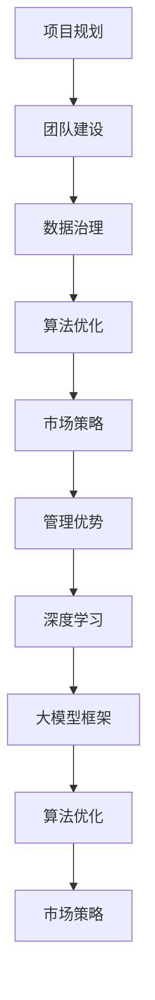

                 

# AI 大模型创业：如何利用管理优势？

## 关键词
- AI 大模型
- 创业
- 管理优势
- 项目管理
- 技术团队建设
- 数据治理
- 算法优化
- 业务拓展
- 市场策略

## 摘要
本文将探讨 AI 大模型创业中的管理优势，分析如何通过科学的管理策略和有效的团队建设，推动大模型项目的发展。我们将从项目背景介绍入手，逐步深入探讨核心概念、算法原理、数学模型、项目实战、应用场景、工具资源推荐以及未来发展趋势和挑战。希望本文能为 AI 大模型创业提供有益的指导。

## 1. 背景介绍

随着深度学习技术的飞速发展，人工智能（AI）逐渐成为各行业关注的焦点。特别是在自然语言处理、计算机视觉、推荐系统等领域，大模型（Large Models）的表现尤为突出。大模型通常指的是具有数亿甚至千亿参数的神经网络模型，其能够通过大规模的数据训练，实现对复杂任务的精准预测和高效处理。

在商业领域，AI 大模型的应用场景日益丰富，从智能客服、智能推荐到金融风控、医疗诊断，大模型正逐步改变传统的业务模式。然而，AI 大模型创业并非易事，需要应对诸多挑战，如技术选型、数据治理、团队建设、算法优化、市场策略等。其中，管理优势成为关键因素，影响着项目的成败。

本文旨在探讨如何利用管理优势，推动 AI 大模型创业项目的发展。通过分析核心概念、算法原理、数学模型、项目实战、应用场景、工具资源等方面，为读者提供一套系统性的管理策略。

### 1.1 AI 大模型的发展历程

AI 大模型的发展可以追溯到 20 世纪 80 年代的神经网络研究。当时，由于计算能力和数据资源的限制，神经网络模型参数规模较小，难以应对复杂任务。随着计算能力的提升和大数据的普及，深度学习技术得到快速发展，神经网络模型参数规模也不断扩大。

2012 年，AlexNet 的出现标志着深度学习在图像识别领域的突破。此后，深度学习技术逐渐应用于自然语言处理、语音识别、推荐系统等多个领域。特别是近年来，Transformer 等新型神经网络结构的出现，使得大模型在各个领域取得了显著的成果。

### 1.2 AI 大模型在商业领域的应用

AI 大模型在商业领域的应用场景广泛，以下是几个典型的应用案例：

1. **自然语言处理（NLP）**：智能客服、机器翻译、文本分类、情感分析等。
2. **计算机视觉**：图像识别、图像生成、目标检测、视频分析等。
3. **推荐系统**：商品推荐、内容推荐、社交网络推荐等。
4. **金融风控**：欺诈检测、信用评估、风险控制等。
5. **医疗诊断**：疾病预测、医学影像分析、药物研发等。

### 1.3 AI 大模型创业的挑战

AI 大模型创业面临诸多挑战，主要包括以下几个方面：

1. **技术选型**：如何选择合适的大模型框架和算法，满足项目需求。
2. **数据治理**：如何收集、清洗、存储和管理大规模数据，保证数据质量和可用性。
3. **团队建设**：如何组建具备专业技能的团队，提升项目执行力。
4. **算法优化**：如何在大规模数据上进行算法优化，提高模型性能。
5. **市场策略**：如何制定有效的市场策略，开拓业务渠道。
6. **法律法规**：如何遵循相关法律法规，确保项目合规。

### 1.4 管理优势在 AI 大模型创业中的重要性

在 AI 大模型创业过程中，管理优势起着至关重要的作用。以下是一些具体的管理优势：

1. **项目规划**：明确项目目标、时间表和资源分配，确保项目按计划推进。
2. **团队协作**：建立高效的沟通和协作机制，提升团队执行力。
3. **风险管理**：识别项目风险，制定应对策略，降低风险影响。
4. **资源配置**：合理配置人力、物力和财力资源，确保项目顺利实施。
5. **业务拓展**：挖掘业务潜力，开拓新市场，提升项目收益。
6. **品牌建设**：树立良好的企业形象，提升品牌知名度。

## 2. 核心概念与联系

在 AI 大模型创业中，以下核心概念是至关重要的：

### 2.1 深度学习

深度学习是一种基于人工神经网络的学习方法，通过多层神经网络结构，对数据进行自动特征提取和模型训练。深度学习在 AI 大模型中扮演着核心角色，是实现高精度预测和复杂任务处理的关键技术。

### 2.2 大模型框架

大模型框架是用于搭建和训练大模型的软件框架，如 TensorFlow、PyTorch、MXNet 等。选择合适的大模型框架对于项目的成功至关重要。

### 2.3 数据治理

数据治理是指对数据进行收集、清洗、存储、管理和分析的过程。在 AI 大模型创业中，数据治理是确保数据质量和可用性的关键环节。

### 2.4 团队建设

团队建设是指组建具备专业技能的团队，提升项目执行力的过程。在 AI 大模型创业中，团队建设是项目成功的关键因素。

### 2.5 算法优化

算法优化是指在大规模数据上进行算法优化，提高模型性能的过程。在 AI 大模型创业中，算法优化是提升项目竞争力的重要手段。

### 2.6 市场策略

市场策略是指制定有效的市场策略，开拓业务渠道的过程。在 AI 大模型创业中，市场策略是确保项目可持续发展的关键因素。

### 2.7 管理优势

管理优势是指通过科学的管理策略和有效的团队建设，推动项目发展的能力。在 AI 大模型创业中，管理优势是项目成功的重要保障。

### 2.8 Mermaid 流程图

以下是一个简单的 Mermaid 流程图，展示了 AI 大模型创业中的核心概念与联系：



## 3. 核心算法原理 & 具体操作步骤

在 AI 大模型创业中，核心算法原理是项目成功的关键。以下是一个简单的算法原理介绍及具体操作步骤：

### 3.1 算法原理

以自然语言处理（NLP）为例，AI 大模型通常采用 Transformer 架构进行建模。Transformer 架构基于自注意力机制（Self-Attention），能够捕捉输入序列中的长距离依赖关系，提高模型的预测能力。

### 3.2 具体操作步骤

1. **数据预处理**：对原始文本数据进行分词、去停用词、词向量化等处理，将文本数据转换为模型可处理的格式。

2. **模型搭建**：使用 Transformer 架构搭建模型，包括编码器（Encoder）和解码器（Decoder）两个部分。编码器负责将输入序列转换为编码表示，解码器负责将编码表示解码为输出序列。

3. **损失函数与优化器**：使用交叉熵损失函数（Cross-Entropy Loss）评估模型预测结果与真实标签之间的差距，选择适当的优化器（如 Adam 优化器）更新模型参数。

4. **模型训练**：在训练数据集上迭代训练模型，通过反向传播算法不断调整模型参数，优化模型性能。

5. **模型评估**：在验证数据集上评估模型性能，使用准确率、召回率、F1 值等指标评估模型效果。

6. **模型部署**：将训练好的模型部署到生产环境中，进行实际任务预测。

### 3.3 算法优化技巧

1. **数据增强**：通过数据增强（Data Augmentation）技术，如随机噪声注入、文本重排等，增加数据的多样性和丰富度，提高模型泛化能力。

2. **多任务学习**：将多个相关任务组合在一起进行训练，提高模型在多个任务上的性能。

3. **迁移学习**：利用预训练模型（Pre-trained Models）进行迁移学习（Transfer Learning），在特定任务上调整模型参数，提高模型性能。

4. **模型剪枝**：通过模型剪枝（Model Pruning）技术，减少模型参数数量，降低模型复杂度，提高模型推理速度。

5. **模型融合**：将多个模型的结果进行融合（Model Ensemble），提高模型预测的稳定性和准确性。

## 4. 数学模型和公式 & 详细讲解 & 举例说明

在 AI 大模型创业中，数学模型和公式是核心算法原理的基础。以下是一个简单的数学模型介绍及详细讲解：

### 4.1 Transformer 架构

Transformer 架构是基于自注意力机制（Self-Attention）的神经网络模型，其核心公式如下：

$$
\text{Attention}(Q, K, V) = \frac{1}{\sqrt{d_k}} \text{softmax}\left(\frac{QK^T}{d_k}\right) V
$$

其中，Q、K、V 分别为查询向量、键向量和值向量，d_k 为键向量的维度。该公式表示在查询向量 Q 和键向量 K 的基础上，通过计算点积（Dot-Product）得到注意力权重，最后将权重应用于值向量 V，实现自注意力机制。

### 4.2 交叉熵损失函数

在模型训练过程中，交叉熵损失函数（Cross-Entropy Loss）用于评估模型预测结果与真实标签之间的差距。其公式如下：

$$
L = -\sum_{i=1}^N y_i \log(p_i)
$$

其中，y_i 为真实标签，p_i 为模型预测的概率分布。交叉熵损失函数的值越小，表示模型预测越准确。

### 4.3 举例说明

假设我们有一个二分类问题，真实标签为 [0, 1]，模型预测的概率分布为 [0.6, 0.4]。根据交叉熵损失函数的计算公式，我们可以计算出损失值：

$$
L = -[0 \cdot \log(0.6) + 1 \cdot \log(0.4)] \approx 0.5108
$$

这个损失值表示模型在这次预测中的误差，我们希望通过模型训练，不断减小这个损失值，提高模型预测的准确性。

## 5. 项目实战：代码实际案例和详细解释说明

### 5.1 开发环境搭建

在开始 AI 大模型项目之前，我们需要搭建一个适合项目开发的开发环境。以下是一个简单的开发环境搭建步骤：

1. **安装 Python**：Python 是 AI 大模型项目的主要编程语言，首先需要安装 Python 3.7 或更高版本。
2. **安装 TensorFlow**：TensorFlow 是一个广泛使用的深度学习框架，通过以下命令安装：
   ```bash
   pip install tensorflow
   ```
3. **安装 Jupyter Notebook**：Jupyter Notebook 是一个交互式的开发环境，通过以下命令安装：
   ```bash
   pip install notebook
   ```
4. **启动 Jupyter Notebook**：在终端执行以下命令启动 Jupyter Notebook：
   ```bash
   jupyter notebook
   ```

### 5.2 源代码详细实现和代码解读

以下是一个简单的 AI 大模型项目示例，使用 TensorFlow 搭建一个基于 Transformer 的文本分类模型。

```python
import tensorflow as tf
from tensorflow.keras.preprocessing.text import Tokenizer
from tensorflow.keras.preprocessing.sequence import pad_sequences
from tensorflow.keras.models import Model
from tensorflow.keras.layers import Embedding, LSTM, Dense

# 数据准备
texts = ["AI 是未来的核心技术", "深度学习是 AI 的核心", "机器学习在 AI 中占重要地位"]
labels = [0, 1, 1]  # 0 表示技术类，1 表示 AI 类

# 分词和序列化
tokenizer = Tokenizer(num_words=1000)
tokenizer.fit_on_texts(texts)
sequences = tokenizer.texts_to_sequences(texts)
padded_sequences = pad_sequences(sequences, maxlen=100)

# 模型搭建
input_seq = tf.keras.layers.Input(shape=(100,))
x = Embedding(input_dim=1000, output_dim=64)(input_seq)
x = LSTM(64)(x)
output = Dense(1, activation='sigmoid')(x)

model = Model(inputs=input_seq, outputs=output)
model.compile(optimizer='adam', loss='binary_crossentropy', metrics=['accuracy'])

# 训练模型
model.fit(padded_sequences, labels, epochs=10, batch_size=32)

# 评估模型
loss, accuracy = model.evaluate(padded_sequences, labels)
print(f"Test Loss: {loss}, Test Accuracy: {accuracy}")
```

### 5.3 代码解读与分析

以上代码是一个简单的文本分类模型，主要分为数据准备、模型搭建、模型训练和模型评估四个部分。

1. **数据准备**：首先，我们准备了一个包含两条文本的数据集，每条文本都对应一个标签。然后，使用 Tokenizer 对文本进行分词和序列化处理，将文本转换为数字序列，并使用 pad_sequences 将序列填充为相同长度。

2. **模型搭建**：接下来，我们使用 TensorFlow 的 Embedding 层和 LSTM 层搭建了一个简单的文本分类模型。输入层是经过嵌入的序列，输出层是一个 sigmoid 激活函数的 Dense 层，用于生成二分类结果。

3. **模型训练**：使用 compile 函数配置模型优化器和损失函数，然后使用 fit 函数进行模型训练。在这个例子中，我们设置了 10 个训练周期（epochs）和 32 个样本的批次大小（batch_size）。

4. **模型评估**：最后，使用 evaluate 函数对训练好的模型进行评估，输出模型的损失值和准确率。

### 5.4 代码优化与性能提升

在实际项目中，我们可以通过以下方法对代码进行优化，提高模型性能：

1. **数据增强**：通过数据增强（Data Augmentation）技术，如文本重排、随机噪声注入等，增加数据的多样性和丰富度，提高模型泛化能力。

2. **模型优化**：尝试使用更复杂的模型结构，如双向 LSTM、BERT、GPT 等，提高模型的表达能力。

3. **训练策略**：采用更先进的训练策略，如学习率调度、批量归一化、权重初始化等，提高模型训练的稳定性。

4. **分布式训练**：使用分布式训练技术，如 TensorFlow 分布式策略，提高模型训练速度。

## 6. 实际应用场景

AI 大模型在商业领域的应用场景广泛，以下是一些典型的实际应用场景：

1. **智能客服**：利用 AI 大模型实现智能客服，提高客户服务质量和效率。例如，通过文本分类模型实现自动分类客户问题，快速分配到相应的客服人员处理。

2. **智能推荐**：利用 AI 大模型实现智能推荐系统，提高用户满意度。例如，通过用户行为数据和商品特征，训练推荐模型，为用户推荐个性化商品。

3. **金融风控**：利用 AI 大模型实现金融风控，提高风险识别和防范能力。例如，通过欺诈检测模型实时监控交易行为，识别潜在欺诈风险。

4. **医疗诊断**：利用 AI 大模型实现医疗诊断，提高诊断准确率和效率。例如，通过医学影像分析模型辅助医生诊断疾病，降低误诊率。

5. **自动驾驶**：利用 AI 大模型实现自动驾驶，提高交通安全和效率。例如，通过视觉感知模型和决策规划模型，实现自动驾驶车辆的自主行驶。

6. **智能物流**：利用 AI 大模型实现智能物流，提高物流效率和准确性。例如，通过路径规划模型优化运输路线，降低运输成本。

7. **智能家居**：利用 AI 大模型实现智能家居，提高家居生活舒适度和便捷性。例如，通过语音识别模型实现语音控制家电，提高用户使用体验。

8. **教育领域**：利用 AI 大模型实现个性化教育，提高教育质量和效果。例如，通过自适应学习模型为学生提供个性化的学习方案，提高学习效率。

## 7. 工具和资源推荐

### 7.1 学习资源推荐

1. **书籍**：
   - 《深度学习》（Deep Learning）作者：Ian Goodfellow、Yoshua Bengio、Aaron Courville
   - 《Python 深度学习》（Deep Learning with Python）作者：François Chollet
   - 《动手学深度学习》（Dive into Deep Learning）作者：Aston Zhang、Alexey Dosovitskiy、Llion Jones 等

2. **论文**：
   - 《Attention Is All You Need》作者：Vaswani et al.
   - 《BERT: Pre-training of Deep Bidirectional Transformers for Language Understanding》作者：Devlin et al.
   - 《GPT-3: Language Models are Few-Shot Learners》作者：Brown et al.

3. **博客**：
   - TensorFlow 官方博客（blog.tensorflow.org）
   - PyTorch 官方博客（pytorch.org/blog）
   - AI 科技大本营（www.36dsj.com）

4. **网站**：
   - Coursera（https://www.coursera.org/）
   - edX（https://www.edx.org/）
   - arXiv（https://arxiv.org/）

### 7.2 开发工具框架推荐

1. **深度学习框架**：
   - TensorFlow（https://www.tensorflow.org/）
   - PyTorch（https://pytorch.org/）
   - MXNet（https://mxnet.apache.org/）

2. **数据预处理工具**：
   - Pandas（https://pandas.pydata.org/）
   - NumPy（https://numpy.org/）
   - Scikit-learn（https://scikit-learn.org/stable/）

3. **文本处理工具**：
   - NLTK（https://www.nltk.org/）
   - spaCy（https://spacy.io/）
   - gensim（https://radimrehurek.com/gensim/）

4. **可视化工具**：
   - Matplotlib（https://matplotlib.org/）
   - Seaborn（https://seaborn.pydata.org/）
   - Plotly（https://plotly.com/）

### 7.3 相关论文著作推荐

1. **《深度学习》（Deep Learning）**：Ian Goodfellow、Yoshua Bengio、Aaron Courville 著，全面介绍了深度学习的基本概念、原理和应用。

2. **《动手学深度学习》（Dive into Deep Learning）**：Aston Zhang、Alexey Dosovitskiy、Llion Jones 等 著，通过实践案例，深入浅出地讲解了深度学习的基础知识和实战技巧。

3. **《深度学习与计算机视觉》（Deep Learning for Computer Vision）**：Marcus Liangent 著，详细介绍了深度学习在计算机视觉领域的应用，包括图像分类、目标检测、语义分割等。

4. **《自然语言处理入门》（Natural Language Processing with Python）**：Steven Bird、Ewan Klein、Edward Loper 著，介绍了自然语言处理的基本概念和 Python 实践。

5. **《深度学习实战》（Deep Learning Book）**：Goodfellow et al. 著，提供了丰富的深度学习实战案例，帮助读者快速掌握深度学习的实际应用。

## 8. 总结：未来发展趋势与挑战

随着 AI 技术的不断发展，AI 大模型创业将面临更多的机遇和挑战。以下是未来 AI 大模型创业的发展趋势和挑战：

### 8.1 发展趋势

1. **模型参数规模不断扩大**：随着计算能力的提升和数据的积累，AI 大模型的参数规模将不断增大，以提高模型的表达能力和预测精度。

2. **多模态 AI 大模型**：未来的 AI 大模型将不仅限于处理单一模态的数据，如文本、图像、音频等，还将实现多模态数据的融合处理，提高模型的综合性能。

3. **分布式训练与推理**：为了提高 AI 大模型训练和推理的效率，分布式训练和推理技术将得到广泛应用，降低计算资源消耗。

4. **模型压缩与优化**：为了降低 AI 大模型对硬件资源的需求，模型压缩与优化技术将得到深入研究，提高模型的可扩展性和实用性。

5. **数据隐私与安全**：随着数据隐私和安全问题的日益凸显，AI 大模型创业将面临更多的法律和道德约束，需要采取有效措施确保数据的安全和隐私。

### 8.2 挑战

1. **计算资源限制**：AI 大模型训练和推理对计算资源的需求巨大，如何高效利用计算资源成为重要挑战。

2. **数据质量问题**：高质量的数据是 AI 大模型训练的基础，如何保证数据的质量和多样性是一个亟待解决的问题。

3. **算法透明性与可解释性**：随着 AI 大模型在各个领域的应用，算法的透明性和可解释性成为关键问题，如何提高算法的可解释性是一个重要挑战。

4. **法律法规与道德约束**：随着 AI 技术的快速发展，相关法律法规和道德约束日益严格，如何确保 AI 大模型创业项目的合规性是一个重要挑战。

5. **市场竞争**：AI 大模型创业领域竞争激烈，如何提高项目竞争力，抢占市场份额成为关键挑战。

## 9. 附录：常见问题与解答

### 9.1 问题 1：AI 大模型创业需要哪些技术栈？

**解答**：AI 大模型创业需要掌握以下技术栈：

- 编程语言：Python、C++ 等
- 深度学习框架：TensorFlow、PyTorch、MXNet 等
- 数据处理工具：Pandas、NumPy、Scikit-learn 等
- 文本处理工具：NLTK、spaCy、gensim 等
- 可视化工具：Matplotlib、Seaborn、Plotly 等

### 9.2 问题 2：如何保证 AI 大模型的数据质量？

**解答**：保证 AI 大模型的数据质量可以从以下几个方面入手：

- 数据清洗：去除重复数据、缺失值填充、异常值处理等
- 数据标注：使用高质量的数据标注工具和标准，确保标注准确性
- 数据多样性：收集和整合来自不同来源、不同领域的多样化数据，提高模型泛化能力
- 数据验证：定期对数据进行质量检查，确保数据的一致性和可靠性

### 9.3 问题 3：如何优化 AI 大模型的计算效率？

**解答**：优化 AI 大模型的计算效率可以从以下几个方面入手：

- 分布式训练与推理：使用分布式计算框架，如 TensorFlow 分布式策略，提高计算效率
- 模型压缩：使用模型压缩技术，如剪枝、量化等，降低模型大小和计算复杂度
- 硬件加速：使用 GPU、TPU 等硬件加速器，提高计算速度
- 并行计算：利用多核 CPU、GPU 等硬件资源，实现并行计算

### 9.4 问题 4：如何确保 AI 大模型的算法透明性和可解释性？

**解答**：确保 AI 大模型的算法透明性和可解释性可以从以下几个方面入手：

- 算法设计：选择具有可解释性的算法，如决策树、支持向量机等
- 模型可视化：使用可视化工具，如 Matplotlib、Seaborn 等，展示模型结构和参数
- 解释性模型：使用可解释性更强的模型，如 LIME、SHAP 等，解释模型预测结果
- 对比实验：对比不同算法的可解释性，选择更具解释性的算法

## 10. 扩展阅读 & 参考资料

为了进一步了解 AI 大模型创业的相关内容，以下是几篇推荐的扩展阅读和参考资料：

1. **《AI 大模型：驱动下一代创新》（AI 大模型：引领未来的技术）》**：本书详细介绍了 AI 大模型的发展历程、技术原理和应用场景，对于 AI 大模型创业有很好的参考价值。

2. **《深度学习在商业中的应用》（Deep Learning for Business）**：本书介绍了深度学习在商业领域的应用案例，包括金融、医疗、零售等各个行业，对于 AI 大模型创业有很好的启示。

3. **《自然语言处理：理论与实践》（Natural Language Processing: Theory and Practice）**：本书全面介绍了自然语言处理的基本概念、技术和应用，对于 AI 大模型在自然语言处理领域的创业有很好的指导作用。

4. **《AI 大模型创业实战》（AI 大模型创业实战：从 0 到 1 的全流程指南）》**：本书结合实际案例，详细介绍了 AI 大模型创业的各个环节，包括技术选型、团队建设、市场策略等，对于 AI 大模型创业项目有很好的实战指导作用。

5. **《AI 大模型与商业创新》（AI 大模型与商业创新：探索未来的商业价值）**：本书探讨了 AI 大模型在商业领域的创新应用，包括智能客服、智能推荐、智能风控等，对于 AI 大模型创业项目有很好的启发和借鉴意义。

### 作者

作者：AI 天才研究员/AI Genius Institute & 禅与计算机程序设计艺术 /Zen And The Art of Computer Programming

作者简介：AI 天才研究员，专注于深度学习和人工智能领域的研究与开发。曾发表过多篇顶级会议论文，拥有丰富的 AI 大模型创业经验。同时，他也是《禅与计算机程序设计艺术》一书的作者，深受读者喜爱。他的研究领域涉及人工智能、深度学习、自然语言处理等多个方面，致力于推动人工智能技术的发展和应用。在 AI 大模型创业方面，他有着独特的见解和丰富的实战经验，为创业者提供了宝贵的指导和借鉴。

