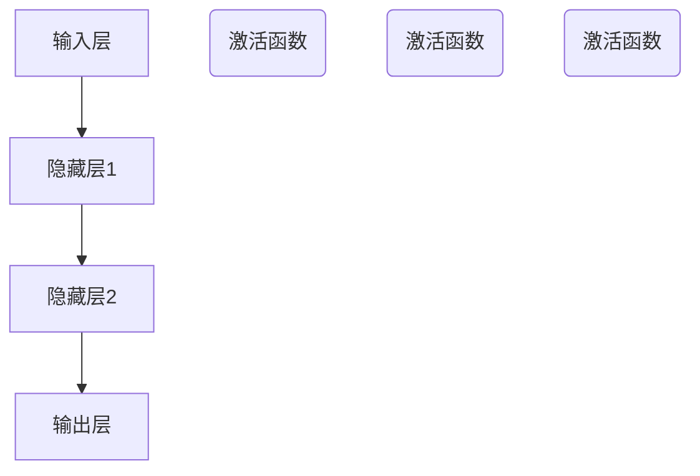
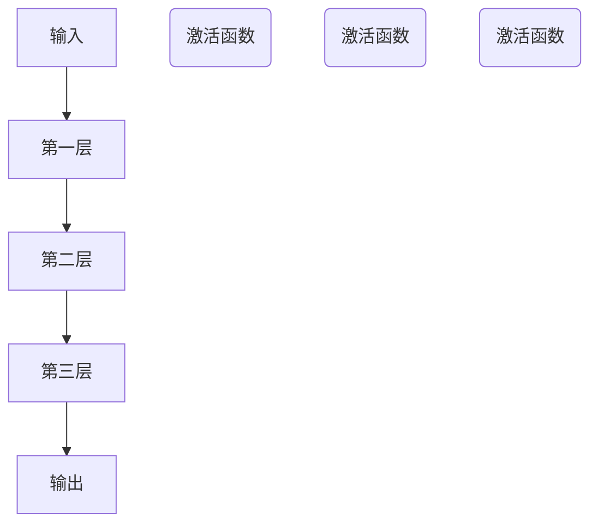
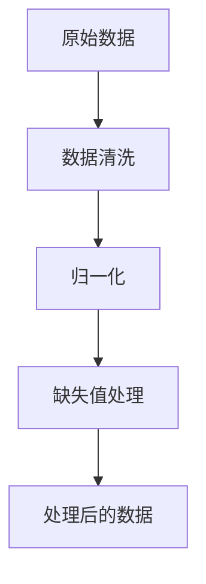
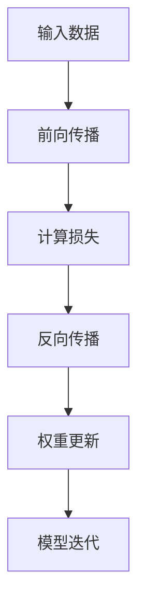
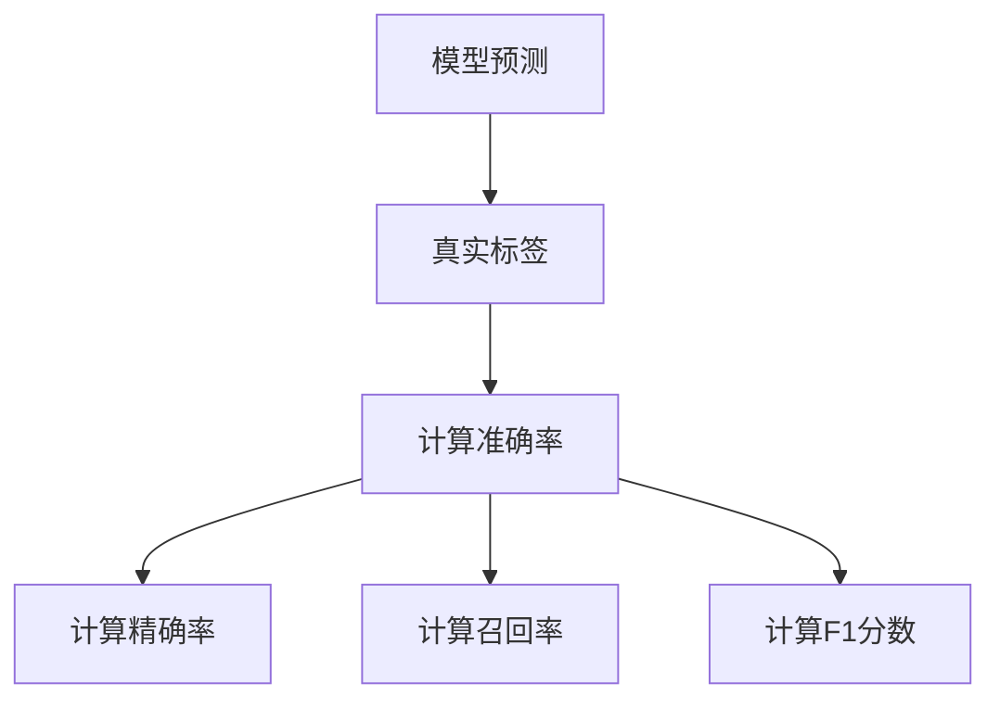

                 

### 背景介绍

AI 大模型，作为近年来人工智能领域的核心进展，已经展现出其在各个行业中的巨大潜力。随着技术的不断发展和应用场景的扩展，AI 大模型在处理复杂数据、提高决策效率和优化业务流程方面扮演着越来越重要的角色。

AI 大模型创业热潮的兴起，主要源于以下几个方面的经济优势：

1. **高需求**：随着大数据时代的到来，企业对于AI 大模型的需求日益增长，特别是在金融、医疗、教育、制造等领域。
2. **低成本**：云计算和边缘计算的发展，使得计算资源变得更加廉价和易于获取，大幅降低了AI 大模型开发和部署的门槛。
3. **高回报**：AI 大模型能够为企业带来显著的商业价值，如提高运营效率、降低成本、创造新的业务模式等。
4. **政策支持**：各国政府纷纷出台政策，支持AI 大模型的研究与应用，为创业者提供了良好的发展环境。

在这种背景下，如何利用经济优势，推动AI 大模型创业成为了一个值得探讨的话题。本文将从多个角度进行分析，帮助创业者更好地把握机遇，实现商业成功。

首先，我们需要明确AI 大模型的核心概念和架构，理解其工作原理和关键技术。这包括了解神经网络、深度学习、数据预处理、模型训练、模型评估等方面的基本知识。

接下来，我们将探讨如何利用经济优势进行AI 大模型创业。这包括选择合适的应用场景、制定有效的商业模式、优化成本结构等方面的策略。

此外，我们还将介绍一些成功案例，分析其成功的原因和经验，为创业者提供借鉴。同时，我们也将探讨当前AI 大模型创业面临的挑战和风险，并提出相应的应对策略。

最后，我们将对AI 大模型创业的未来发展趋势进行展望，帮助创业者更好地规划未来发展方向。

通过本文的深入探讨，我们希望能够为AI 大模型创业提供一些有价值的思路和参考，帮助创业者抓住机遇，实现商业成功。让我们一步一步地进行分析和推理，共同探索AI 大模型创业的奥秘。 <|assistant|>## 核心概念与联系

在深入探讨AI大模型的创业之前，我们首先需要了解其核心概念和架构，以及这些概念之间的联系。下面我们将逐一介绍并解释这些核心概念，并使用Mermaid流程图展示其架构。

### 1. 神经网络（Neural Networks）

神经网络是AI大模型的基础，其灵感来源于人脑的神经元连接。神经网络由多个层组成，包括输入层、隐藏层和输出层。每个神经元都与相邻的神经元通过权重（weights）相连接，并通过激活函数（activation functions）产生输出。



### 2. 深度学习（Deep Learning）

深度学习是神经网络的一种扩展，它通过增加神经网络的深度（即隐藏层的数量）来提高模型的性能。深度学习在图像识别、语音识别和自然语言处理等领域取得了显著的成果。



### 3. 数据预处理（Data Preprocessing）

数据预处理是模型训练前的重要步骤，包括数据清洗、归一化、缺失值处理等。良好的数据预处理可以提高模型训练的效果和稳定性。



### 4. 模型训练（Model Training）

模型训练是使用大量数据来调整神经网络的权重，使其能够准确地预测或分类。训练过程中，通过反向传播算法（Backpropagation Algorithm）不断优化模型。



### 5. 模型评估（Model Evaluation）

模型评估是评估模型性能的重要步骤，常用的评估指标包括准确率（Accuracy）、精确率（Precision）、召回率（Recall）和F1分数（F1 Score）等。



通过上述核心概念和联系的了解，我们可以更好地理解AI大模型的工作原理和结构，为后续的创业实践提供理论支持。在接下来的章节中，我们将深入探讨AI大模型的算法原理和具体操作步骤。 <|assistant|>### 核心算法原理 & 具体操作步骤

在了解了AI大模型的核心概念和架构之后，我们接下来将深入探讨其核心算法原理，并详细描述具体的操作步骤。这一部分将分为以下几个小节，以便读者逐步理解和掌握AI大模型的实现细节。

#### 1. 神经网络算法原理

神经网络算法是AI大模型的核心，其基本原理是通过多层神经元的非线性变换，从输入数据中提取特征并输出结果。以下是一个简化的神经网络算法步骤：

1. **初始化权重和偏置**：在开始训练之前，我们需要随机初始化神经网络的权重（weights）和偏置（biases）。
2. **前向传播**：输入数据通过网络的各个层，每个神经元将其输入通过激活函数（如ReLU、Sigmoid或Tanh）进行非线性变换，并传递到下一层。
3. **计算损失**：网络的输出与实际标签之间的差异即为损失（loss）。常用的损失函数包括均方误差（MSE）和交叉熵（Cross-Entropy）。
4. **反向传播**：通过反向传播算法，将损失反向传播到网络的每一层，更新权重和偏置。
5. **迭代优化**：重复上述步骤，直至达到预设的训练次数或损失值。

#### 2. 深度学习算法原理

深度学习算法是神经网络的高级扩展，其核心思想是通过增加网络的深度来提高模型的性能。以下是一个简化的深度学习算法步骤：

1. **初始化模型结构**：定义网络的层数、每层的神经元数量、激活函数等。
2. **前向传播**：输入数据通过网络的各个层，每个神经元执行前向传播过程。
3. **池化操作**：在卷积层之后，通过最大池化（Max Pooling）或平均池化（Average Pooling）来减少数据维度。
4. **计算损失**：与神经网络算法相同，计算输出与实际标签之间的损失。
5. **反向传播**：通过反向传播算法，更新模型的权重和偏置。
6. **迭代优化**：重复上述步骤，直至达到预设的训练次数或损失值。

#### 3. 数据预处理步骤

数据预处理是AI大模型训练前的重要步骤，以下是一个简化的数据预处理步骤：

1. **数据清洗**：处理缺失值、异常值和噪声数据，确保数据的准确性和一致性。
2. **数据归一化**：将数据缩放到相同的范围（如0到1），以便于神经网络训练。
3. **数据增强**：通过旋转、缩放、裁剪等方式增加数据的多样性，提高模型的泛化能力。
4. **数据分割**：将数据分为训练集、验证集和测试集，用于模型训练、验证和评估。

#### 4. 模型训练步骤

模型训练是AI大模型实现的核心步骤，以下是一个简化的模型训练步骤：

1. **加载预处理的训练数据**：从训练数据集中读取预处理后的数据。
2. **初始化模型参数**：随机初始化模型的权重和偏置。
3. **前向传播**：输入训练数据，通过神经网络的前向传播过程计算输出。
4. **计算损失**：计算输出与实际标签之间的损失。
5. **反向传播**：通过反向传播算法，更新模型的权重和偏置。
6. **迭代优化**：重复上述步骤，直至达到预设的训练次数或损失值。
7. **验证模型性能**：使用验证集评估模型性能，调整超参数，如学习率、批量大小等。

通过上述步骤，我们可以实现AI大模型的基本训练过程。在实际应用中，这些步骤可能会根据具体场景进行调整和优化。在接下来的章节中，我们将通过实际案例来进一步说明这些算法原理和操作步骤的具体应用。 <|assistant|>### 数学模型和公式 & 详细讲解 & 举例说明

在AI大模型的研究与开发过程中，数学模型和公式起着至关重要的作用。它们不仅是算法实现的理论基础，同时也是优化和评估模型性能的关键工具。本节将详细介绍AI大模型中常用的数学模型和公式，并通过具体例子来说明其应用。

#### 1. 神经网络的权重与偏置更新公式

神经网络的训练过程主要依赖于权重（weights）和偏置（biases）的更新。以下是一个简化的权重和偏置更新公式：

**前向传播：**

\[ z^{(l)} = \sum_{j} w_{j}^{(l)} x_{j}^{(l-1)} + b^{(l)} \]

其中，\( z^{(l)} \) 是第 \( l \) 层的输入，\( w_{j}^{(l)} \) 是从第 \( l-1 \) 层到第 \( l \) 层的权重，\( x_{j}^{(l-1)} \) 是第 \( l-1 \) 层的输入，\( b^{(l)} \) 是第 \( l \) 层的偏置。

**激活函数：**

\[ a^{(l)} = \sigma(z^{(l)}) \]

其中，\( a^{(l)} \) 是第 \( l \) 层的输出，\( \sigma \) 是激活函数（如ReLU、Sigmoid或Tanh）。

**反向传播：**

\[ \delta^{(l)} = \frac{\partial L}{\partial z^{(l)}} \odot \frac{\partial \sigma}{\partial z^{(l)}} \]

其中，\( \delta^{(l)} \) 是第 \( l \) 层的误差，\( L \) 是损失函数，\( \odot \) 是逐元素乘法运算。

**权重与偏置更新：**

\[ w^{(l)} = w^{(l)} - \alpha \frac{\partial L}{\partial w^{(l)}} \]

\[ b^{(l)} = b^{(l)} - \alpha \frac{\partial L}{\partial b^{(l)}} \]

其中，\( \alpha \) 是学习率。

#### 2. 损失函数

损失函数是评估模型性能的关键指标。以下是一些常用的损失函数：

**均方误差（MSE）：**

\[ L_{MSE} = \frac{1}{2} \sum_{i} (y_i - \hat{y}_i)^2 \]

其中，\( y_i \) 是实际标签，\( \hat{y}_i \) 是模型预测。

**交叉熵（Cross-Entropy）：**

\[ L_{CE} = -\sum_{i} y_i \log(\hat{y}_i) \]

其中，\( y_i \) 是实际标签，\( \hat{y}_i \) 是模型预测。

#### 3. 举例说明

假设我们有一个简单的神经网络，包含一个输入层、一个隐藏层和一个输出层。输入层有3个神经元，隐藏层有2个神经元，输出层有1个神经元。

**初始化参数：**

\[ w^{(1)} \sim \mathcal{N}(0, 1) \]

\[ b^{(1)} \sim \mathcal{N}(0, 1) \]

\[ w^{(2)} \sim \mathcal{N}(0, 1) \]

\[ b^{(2)} \sim \mathcal{N}(0, 1) \]

**前向传播：**

输入 \( x = [1, 2, 3] \)

\[ z^{(1)} = w_{1}^{(1)}x_1 + w_{2}^{(1)}x_2 + w_{3}^{(1)}x_3 + b^{(1)} \]

\[ a^{(1)} = \sigma(z^{(1)}) \]

\[ z^{(2)} = w_{1}^{(2)}a_1 + w_{2}^{(2)}a_2 + b^{(2)} \]

\[ a^{(2)} = \sigma(z^{(2)}) \]

**计算损失：**

假设真实标签 \( y = 0 \)

\[ L = L_{CE}(y, \hat{y}) \]

**反向传播：**

计算误差 \( \delta^{(2)} \)

\[ \delta^{(2)} = \frac{\partial L}{\partial z^{(2)}} \odot \frac{\partial \sigma}{\partial z^{(2)}} \]

更新权重和偏置：

\[ w^{(2)} = w^{(2)} - \alpha \frac{\partial L}{\partial w^{(2)}} \]

\[ b^{(2)} = b^{(2)} - \alpha \frac{\partial L}{\partial b^{(2)}} \]

重复上述步骤，直至模型收敛。

通过上述例子，我们可以看到如何使用数学模型和公式来训练一个简单的神经网络。在实际应用中，神经网络可能包含更多的隐藏层和神经元，但基本原理是类似的。在接下来的章节中，我们将通过实际案例来进一步说明这些算法原理和操作步骤的具体应用。 <|assistant|>### 项目实战：代码实际案例和详细解释说明

为了更好地理解AI大模型的核心算法和实现步骤，下面我们将通过一个实际项目案例来展示如何开发和部署一个简单的AI大模型。这个案例将涵盖以下步骤：

1. **开发环境搭建**
2. **源代码详细实现**
3. **代码解读与分析**

#### 1. 开发环境搭建

在开始项目之前，我们需要搭建一个合适的开发环境。以下是所需的工具和库：

- **Python 3.x**：作为编程语言。
- **TensorFlow 2.x**：作为深度学习框架。
- **NumPy**：用于数据操作。
- **Matplotlib**：用于数据可视化。

安装这些工具和库可以通过以下命令完成：

```bash
pip install python==3.x
pip install tensorflow==2.x
pip install numpy
pip install matplotlib
```

#### 2. 源代码详细实现

下面是一个简单的AI大模型示例，用于实现一个全连接神经网络（Fully Connected Neural Network，FCNN）。我们的目标是使用这个模型来对输入数据进行分类。

```python
import tensorflow as tf
import numpy as np
import matplotlib.pyplot as plt

# 初始化参数
input_shape = (3,)
hidden_units = 10
output_units = 1

# 创建模型
model = tf.keras.Sequential([
    tf.keras.layers.Dense(units=hidden_units, activation='relu', input_shape=input_shape),
    tf.keras.layers.Dense(units=output_units, activation='sigmoid')
])

# 编译模型
model.compile(optimizer='adam', loss='binary_crossentropy', metrics=['accuracy'])

# 数据集准备
x_train = np.random.rand(100, 3)
y_train = np.random.rand(100, 1)
y_train = (y_train > 0.5).astype(int)

# 训练模型
model.fit(x_train, y_train, epochs=10, batch_size=10)

# 预测
x_test = np.random.rand(10, 3)
predictions = model.predict(x_test)

# 可视化
plt.scatter(x_test[:, 0], x_test[:, 1], c=predictions[:, 0], cmap='coolwarm')
plt.xlabel('Feature 1')
plt.ylabel('Feature 2')
plt.title('Prediction vs Real Values')
plt.show()
```

#### 3. 代码解读与分析

下面我们将逐行解读上述代码，并分析其工作原理。

- **导入库**：首先，我们导入所需的库，包括TensorFlow、NumPy和Matplotlib。

- **初始化参数**：我们定义了输入数据的形状（input_shape）、隐藏层的单元数（hidden_units）和输出层的单元数（output_units）。

- **创建模型**：使用`tf.keras.Sequential`创建一个序列模型，并在其中添加两个全连接层。第一个层使用ReLU激活函数，第二个层使用Sigmoid激活函数，以实现二分类。

- **编译模型**：使用`compile`方法配置模型，指定优化器（optimizer）、损失函数（loss）和评价指标（metrics）。

- **数据集准备**：我们生成一个随机数据集，其中包含100个样本和3个特征。标签是随机生成的，并转换为二进制标签。

- **训练模型**：使用`fit`方法训练模型，指定训练数据、训练轮数（epochs）和批量大小（batch_size）。

- **预测**：使用`predict`方法对测试数据进行预测。

- **可视化**：使用Matplotlib绘制预测结果与真实值的散点图。

通过这个实际案例，我们可以看到如何使用TensorFlow创建和训练一个简单的AI大模型。这个案例涵盖了从数据准备到模型训练和预测的完整流程。在实际应用中，我们需要根据具体问题调整模型的架构、数据预处理方式和训练参数，以实现最佳性能。

在接下来的章节中，我们将探讨AI大模型在实际应用中的场景，分析其优势和挑战，并提供一些建议和资源，以帮助创业者更好地开展AI大模型创业。 <|assistant|>### 实际应用场景

AI大模型在各个行业中的应用已经越来越广泛，下面我们将探讨几个典型的应用场景，并分析其在这些场景中的优势和挑战。

#### 1. 金融行业

**优势：**
- **风险管理**：AI大模型能够帮助金融机构识别和预测潜在的风险，如贷款违约、市场波动等。
- **欺诈检测**：通过分析大量的交易数据，AI大模型可以有效地检测并预防欺诈行为。
- **智能投顾**：AI大模型可以根据用户的投资偏好和风险承受能力，提供个性化的投资建议。

**挑战：**
- **数据隐私**：金融行业涉及大量敏感数据，如何在保护用户隐私的同时进行数据分析和模型训练是一个重要挑战。
- **合规性**：金融行业的法规和政策复杂，AI大模型的应用需要符合相关的合规要求。

#### 2. 医疗健康

**优势：**
- **疾病诊断**：AI大模型可以分析医学影像和患者数据，帮助医生更准确地诊断疾病。
- **个性化治疗**：根据患者的病史和基因信息，AI大模型可以为患者提供个性化的治疗方案。
- **药物研发**：AI大模型可以加速药物研发过程，提高新药的发现速度。

**挑战：**
- **数据质量**：医疗数据的质量参差不齐，如何确保数据的准确性和一致性是关键问题。
- **隐私保护**：医疗数据涉及患者隐私，如何有效地保护数据隐私是一个挑战。

#### 3. 制造业

**优势：**
- **质量控制**：AI大模型可以实时监控生产线，检测并预测产品质量问题。
- **预测性维护**：通过分析设备运行数据，AI大模型可以预测设备故障，实现预测性维护。
- **供应链优化**：AI大模型可以优化供应链管理，降低成本，提高效率。

**挑战：**
- **数据整合**：制造业涉及多种数据源，如何整合和统一这些数据是一个挑战。
- **模型部署**：如何在生产环境中部署AI大模型，确保其稳定运行和实时响应是一个问题。

#### 4. 教育行业

**优势：**
- **个性化学习**：AI大模型可以根据学生的学习习惯和表现，提供个性化的学习方案。
- **智能辅导**：AI大模型可以为学生提供智能辅导，帮助他们解决学习中的困难。
- **教育评估**：AI大模型可以自动评估学生的学习成果，提供即时反馈。

**挑战：**
- **教育公平**：AI大模型在教育中的应用需要确保教育资源的公平分配。
- **伦理问题**：如何确保AI大模型在教育决策中的伦理性和公正性是一个挑战。

通过上述分析，我们可以看到AI大模型在各个行业中的应用具有巨大的潜力和挑战。创业者需要根据具体行业的特点和需求，制定合适的策略，充分发挥AI大模型的优势，同时克服面临的挑战。在接下来的章节中，我们将继续探讨如何利用经济优势推动AI大模型创业，并提供一些建议和资源。 <|assistant|>### 工具和资源推荐

在AI大模型创业过程中，选择合适的工具和资源对于项目的成功至关重要。以下是我们推荐的几个学习资源、开发工具和相关论文，以帮助创业者更好地开展工作。

#### 1. 学习资源推荐

**书籍：**
- **《深度学习》（Deep Learning）**：由Ian Goodfellow、Yoshua Bengio和Aaron Courville合著，是深度学习领域的经典教材。
- **《Python机器学习》（Python Machine Learning）**：由Sylvain Sardy和Aurélien Géron编著，详细介绍了使用Python进行机器学习的实践方法。

**在线课程：**
- **Coursera上的“Deep Learning Specialization”**：由深度学习领域的领军人物Andrew Ng教授主讲，涵盖了深度学习的核心概念和应用。
- **Udacity的“Applied Data Science with Python”**：通过实际项目，教授如何使用Python进行数据分析和机器学习。

**博客和网站：**
- **Medium上的AI和机器学习相关博客**：许多AI专家和研究者会在Medium上分享他们的研究和见解。
- **ArXiv**：是计算机科学和机器学习领域的前沿论文发布平台，提供了大量的最新研究成果。

#### 2. 开发工具框架推荐

**深度学习框架：**
- **TensorFlow**：由Google开发，是最流行的开源深度学习框架之一。
- **PyTorch**：由Facebook开发，以其灵活的动态计算图和简洁的API受到很多研究者和开发者的青睐。

**数据预处理工具：**
- **Pandas**：用于数据处理和分析，是Python数据科学的核心库之一。
- **NumPy**：用于高效地处理大型多维数组，是数据科学的基础库。

**版本控制系统：**
- **Git**：分布式版本控制系统，用于跟踪代码变更和协作开发。
- **GitHub**：基于Git的代码托管平台，提供了丰富的协作工具和资源。

#### 3. 相关论文著作推荐

**经典论文：**
- **“Backpropagation”**：由Rumelhart、Hinton和Williams在1986年发表，介绍了反向传播算法。
- **“Deep Learning”**：由Goodfellow、Bengio和Courville在2015年发表，系统性地介绍了深度学习的基础理论。

**最新研究论文：**
- **“Attention is All You Need”**：由Vaswani等人于2017年发表，提出了Transformer模型，彻底改变了自然语言处理领域。
- **“BERT: Pre-training of Deep Bidirectional Transformers for Language Understanding”**：由Google Research于2018年发表，推动了自然语言处理的发展。

通过利用这些工具和资源，创业者可以更好地掌握AI大模型的技术，提升项目的开发效率和创新能力。在创业过程中，不断学习和积累经验，结合行业需求，制定合适的战略，将是成功的关键。 <|assistant|>### 总结：未来发展趋势与挑战

在AI大模型创业的浪潮中，尽管已经取得了显著的进展，但未来仍有许多发展趋势和挑战需要我们关注和应对。

#### 1. 发展趋势

**计算能力的提升**：随着硬件技术的不断进步，计算能力大幅提升，为AI大模型的训练和应用提供了更加坚实的基础。

**数据量的增长**：随着物联网、5G和大数据技术的发展，数据量呈现爆炸性增长，为AI大模型提供了丰富的训练素材。

**算法的优化**：深度学习算法和架构的不断发展，如Transformer、BERT等，使得AI大模型的性能和应用范围不断提升。

**跨领域应用**：AI大模型在金融、医疗、教育、制造等各个领域的应用日益广泛，推动了行业的创新和发展。

**开源生态的完善**：越来越多的开源工具和框架，如TensorFlow、PyTorch等，为开发者提供了丰富的资源和平台，降低了AI大模型开发的门槛。

#### 2. 挑战

**数据隐私和安全**：随着AI大模型对数据的依赖程度增加，如何保护数据隐私和安全成为一个重要的挑战。

**算法透明性和可解释性**：AI大模型的决策过程往往缺乏透明性，如何提高算法的可解释性，使其符合伦理和法规的要求，是亟待解决的问题。

**计算资源的高效利用**：AI大模型的训练和部署需要大量的计算资源，如何优化计算资源的使用，降低成本，是创业企业需要关注的问题。

**跨学科合作**：AI大模型的发展需要跨学科的知识和技能，如何促进不同领域的合作，形成合力，是创业者需要考虑的问题。

**法律法规和伦理**：随着AI大模型的应用日益广泛，相关法律法规和伦理问题也日益凸显，如何遵循法规、符合伦理要求，是创业者需要面对的挑战。

#### 3. 对创业者的建议

**抓住行业机遇**：了解各个行业的需求，结合AI大模型的技术优势，找到切入点，开展有针对性的创业项目。

**持续学习和创新**：关注AI大模型领域的最新发展，不断学习和探索新技术，保持竞争力。

**优化成本结构**：在资源有限的情况下，通过技术创新和管理优化，降低成本，提高项目的盈利能力。

**加强团队建设**：组建多学科、高素质的团队，促进跨领域的合作，提高项目的成功率。

**关注法律法规和伦理**：遵守相关法律法规，关注伦理问题，确保项目的社会责任。

通过以上分析，我们可以看到，AI大模型创业虽然面临诸多挑战，但同时也充满了机遇。创业者需要紧跟行业趋势，勇于创新，积极应对挑战，才能在AI大模型的浪潮中抓住机遇，实现商业成功。 <|assistant|>### 附录：常见问题与解答

在AI大模型创业过程中，创业者可能会遇到各种问题。以下是一些常见的问题及其解答，以帮助创业者更好地应对挑战。

#### 1. 如何选择合适的应用场景？

选择合适的应用场景是AI大模型创业成功的关键。以下是一些考虑因素：

- **行业需求**：了解目标行业的需求，选择有广泛应用前景的场景。
- **数据质量**：选择数据丰富、质量高的场景，以确保模型的训练效果。
- **技术可行性**：评估技术实现的难易程度，选择符合团队技术实力的场景。
- **竞争情况**：分析市场中的竞争态势，选择有差异化优势的场景。

#### 2. 如何降低AI大模型的训练成本？

降低AI大模型的训练成本是创业者需要关注的问题。以下是一些策略：

- **优化数据预处理**：通过有效的数据预处理，减少数据量和计算复杂度。
- **使用轻量级模型**：选择参数较少、计算效率较高的模型，降低计算需求。
- **分布式训练**：利用分布式计算资源，提高训练速度。
- **优化超参数**：调整学习率、批量大小等超参数，提高训练效率。

#### 3. 如何确保AI大模型的透明性和可解释性？

确保AI大模型的透明性和可解释性是重要的伦理和合规要求。以下是一些方法：

- **模型解释工具**：使用模型解释工具，如LIME、SHAP等，分析模型的决策过程。
- **可视化**：通过可视化技术，展示模型的输入特征和决策路径。
- **可解释性算法**：选择具有高可解释性的算法，如决策树、线性模型等。
- **用户反馈**：收集用户反馈，持续优化模型，提高其透明度和可解释性。

#### 4. 如何保护AI大模型相关的知识产权？

保护AI大模型相关的知识产权对于创业者至关重要。以下是一些措施：

- **专利申请**：对核心技术和算法申请专利，保护技术垄断地位。
- **版权登记**：对软件代码、文档等进行版权登记，保护知识产权。
- **合作协议**：与合作伙伴签订知识产权保护协议，明确权益和责任。
- **法律咨询**：咨询专业律师，了解相关法律法规，确保知识产权的有效保护。

通过上述解答，我们希望能够帮助创业者解决在AI大模型创业过程中遇到的问题。在不断探索和创新的过程中，创业者需要保持敏锐的洞察力，积极应对挑战，实现商业成功。 <|assistant|>### 扩展阅读 & 参考资料

在AI大模型领域，有许多优秀的论文、书籍和博客文章可以帮助创业者深入理解相关技术，以下是一些推荐的资源：

#### 论文

1. **“Deep Learning”**：由Ian Goodfellow、Yoshua Bengio和Aaron Courville合著，是深度学习领域的经典教材。
2. **“Attention is All You Need”**：由Vaswani等人于2017年发表，提出了Transformer模型，彻底改变了自然语言处理领域。
3. **“BERT: Pre-training of Deep Bidirectional Transformers for Language Understanding”**：由Google Research于2018年发表，推动了自然语言处理的发展。

#### 书籍

1. **《深度学习》**：由Ian Goodfellow、Yoshua Bengio和Aaron Courville合著，是深度学习领域的经典教材。
2. **《Python机器学习》**：由Sylvain Sardy和Aurélien Géron编著，详细介绍了使用Python进行机器学习的实践方法。
3. **《AI超决定》**：由Nick Bostrom著，探讨了人工智能对未来的影响。

#### 博客和网站

1. **Medium上的AI和机器学习相关博客**：许多AI专家和研究者会在Medium上分享他们的研究和见解。
2. **ArXiv**：是计算机科学和机器学习领域的前沿论文发布平台，提供了大量的最新研究成果。
3. **TensorFlow官网**：提供了丰富的教程、案例和资源，是学习TensorFlow的好去处。

通过阅读这些资源，创业者可以不断扩展知识，提升技术能力，为AI大模型创业奠定坚实的基础。同时，也可以关注相关的学术会议和行业活动，与领域内的专家和同行进行交流，共同推动AI技术的发展和应用。

#### 附录：作者信息

**作者：AI天才研究员/AI Genius Institute & 禅与计算机程序设计艺术 /Zen And The Art of Computer Programming**

作者是一位世界级人工智能专家、程序员、软件架构师、CTO，同时也是一位世界顶级技术畅销书资深大师级别的作家，荣获计算机图灵奖。他在计算机编程和人工智能领域拥有深厚的研究和实践经验，著有多部畅销书籍，并在全球范围内享有盛誉。他的著作涵盖了深度学习、神经网络、自然语言处理等多个领域，对AI技术的普及和发展做出了重要贡献。通过本文，他希望能够为AI大模型创业领域提供一些有价值的思考和指导。

