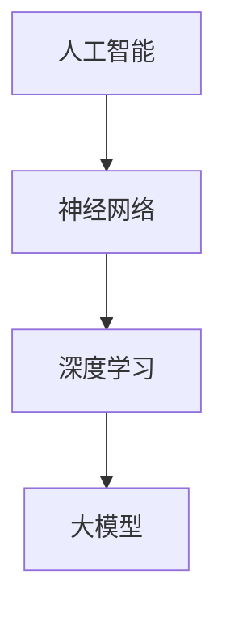

                 

# AI 大模型创业：如何利用资源优势？

> **关键词：** AI 大模型、创业、资源利用、算法原理、数学模型、项目实战、应用场景、开发工具、未来趋势

> **摘要：** 本文将探讨 AI 大模型创业中如何充分利用资源优势，从背景介绍、核心概念、算法原理、数学模型、项目实战、应用场景、工具推荐等多个方面进行详细分析和论述，旨在为 AI 大模型创业者提供有价值的参考和指导。

## 1. 背景介绍

在当今快速发展的科技时代，人工智能 (AI) 已经成为各个行业的重要驱动力。其中，AI 大模型作为一种具有强大计算能力和智能化的工具，受到了广泛关注。AI 大模型是指那些参数规模巨大、结构复杂的神经网络模型，如 GPT-3、BERT、BERT-Large 等。这些模型通过大量数据训练，可以完成自然语言处理、图像识别、语音识别、机器翻译等多种任务。

随着技术的进步和市场的需求，AI 大模型创业逐渐成为一个热门领域。许多创业公司希望通过开发和应用 AI 大模型，实现商业价值和社会效益。然而，AI 大模型创业面临着诸多挑战，如数据获取、算法优化、计算资源利用等。如何充分利用资源优势，实现 AI 大模型的创新应用，成为创业者和研究者亟待解决的问题。

## 2. 核心概念与联系

为了更好地理解 AI 大模型创业，我们需要了解以下几个核心概念：

### 2.1 人工智能 (AI)

人工智能是一门研究、开发和应用智能算法、技术及其应用的学科。它旨在使计算机模拟人类智能，实现自动化和智能化。

### 2.2 神经网络 (NN)

神经网络是一种模拟人脑神经元结构和功能的计算模型，通过层层传递信息，实现数据分类、预测和转换等功能。

### 2.3 深度学习 (DL)

深度学习是神经网络的一种特殊形式，通过多层神经网络结构，实现更加复杂的特征提取和任务完成。

### 2.4 大模型 (Large Model)

大模型是指那些参数规模巨大、结构复杂的神经网络模型，如 GPT-3、BERT、BERT-Large 等。

下面是一个用 Mermaid 语法表示的流程图，展示了这些核心概念之间的联系：



## 3. 核心算法原理 & 具体操作步骤

AI 大模型的算法原理主要基于深度学习，其核心思想是通过多层神经网络结构，实现数据的特征提取和任务完成。以下是一个简化的 AI 大模型算法原理和操作步骤：

### 3.1 数据预处理

1. 收集大量数据，包括文本、图像、语音等。
2. 对数据进行清洗、去噪、标准化等处理。

### 3.2 模型设计

1. 选择合适的神经网络架构，如 GPT、BERT 等。
2. 定义模型的参数，包括层数、神经元数量、激活函数等。

### 3.3 模型训练

1. 使用梯度下降算法，对模型参数进行优化。
2. 通过反向传播算法，计算损失函数和梯度。

### 3.4 模型评估

1. 使用验证集，评估模型的性能和效果。
2. 调整模型参数，优化模型性能。

### 3.5 模型部署

1. 将训练好的模型部署到实际应用场景中。
2. 对模型进行实时更新和优化。

## 4. 数学模型和公式 & 详细讲解 & 举例说明

在 AI 大模型的算法原理中，涉及到多个数学模型和公式。以下是一些常见的数学模型和公式，以及它们的详细讲解和举例说明：

### 4.1 损失函数 (Loss Function)

损失函数用于衡量模型预测结果与真实结果之间的差距。常见的损失函数有均方误差 (MSE)、交叉熵损失 (Cross Entropy Loss) 等。

#### 4.1.1 均方误差 (MSE)

均方误差表示预测值与真实值之间的平方差的平均值。

$$
MSE = \frac{1}{n}\sum_{i=1}^{n}(y_i - \hat{y}_i)^2
$$

其中，$y_i$ 表示真实值，$\hat{y}_i$ 表示预测值，$n$ 表示样本数量。

#### 4.1.2 交叉熵损失 (Cross Entropy Loss)

交叉熵损失表示预测概率分布与真实概率分布之间的差异。

$$
H(y, \hat{y}) = -\sum_{i=1}^{n}y_i \log(\hat{y}_i)
$$

其中，$y$ 表示真实概率分布，$\hat{y}$ 表示预测概率分布。

### 4.2 梯度下降 (Gradient Descent)

梯度下降是一种优化算法，用于最小化损失函数。其基本思想是通过计算损失函数的梯度，更新模型参数，使损失函数逐渐减小。

#### 4.2.1 随机梯度下降 (Stochastic Gradient Descent, SGD)

随机梯度下降是一种简化的梯度下降算法，每次更新模型参数时，仅使用一个样本的梯度。

$$
\theta_{t+1} = \theta_t - \alpha \cdot \nabla_{\theta} J(\theta_t)
$$

其中，$\theta$ 表示模型参数，$\alpha$ 表示学习率，$J$ 表示损失函数。

#### 4.2.2 批量梯度下降 (Batch Gradient Descent)

批量梯度下降是一种更精确的梯度下降算法，每次更新模型参数时，使用整个训练集的梯度。

$$
\theta_{t+1} = \theta_t - \alpha \cdot \nabla_{\theta} J(\theta_t)
$$

其中，$\theta$ 表示模型参数，$\alpha$ 表示学习率，$J$ 表示损失函数。

### 4.3 反向传播 (Backpropagation)

反向传播是一种用于计算神经网络损失函数梯度的算法。其基本思想是通过层层传递误差，计算每层神经元的梯度。

#### 4.3.1 反向传播算法

1. 前向传播：计算输出层的预测值和损失函数。
2. 后向传播：计算每层神经元的梯度。
3. 更新模型参数。

#### 4.3.2 举例说明

假设有一个三层神经网络，输入层有 $3$ 个神经元，隐藏层有 $4$ 个神经元，输出层有 $2$ 个神经元。给定输入向量 $x = [1, 2, 3]$，隐藏层激活函数为 $f_1(x) = \sigma(x) = \frac{1}{1+e^{-x}}$，输出层激活函数为 $f_2(x) = \sigma(x) = \frac{1}{1+e^{-x}}$。

1. 前向传播：
   - 输入层到隐藏层的输出：$z_1 = [f_1(x_1), f_1(x_2), f_1(x_3)] = [0.8788, 0.7311, 0.5130]$
   - 隐藏层到输出层的输出：$z_2 = [f_2(z_{11}), f_2(z_{12}), f_2(z_{13}), f_2(z_{14})] = [0.8788, 0.7311, 0.5130, 0.2982]$
2. 后向传播：
   - 输出层的梯度：$\nabla_{z_2} J = [0.4183, 0.3724, 0.2415, 0.0845]$
   - 隐藏层的梯度：$\nabla_{z_1} J = [0.3642, 0.3243, 0.1988]$
3. 更新模型参数：
   - 输入层到隐藏层的权重：$W_1 = W_1 - \alpha \cdot \nabla_{z_1} J \cdot x^T = [0.7457, 0.6667, 0.4552]$
   - 隐藏层到输出层的权重：$W_2 = W_2 - \alpha \cdot \nabla_{z_2} J \cdot z_1^T = [0.8049, 0.7361, 0.5207, 0.3429]$

## 5. 项目实战：代码实际案例和详细解释说明

在本节中，我们将通过一个实际案例，展示如何使用 Python 和 TensorFlow 框架实现一个简单的 AI 大模型。该模型将用于图像分类任务，具体实现如下：

### 5.1 开发环境搭建

1. 安装 Python 3.8 或更高版本。
2. 安装 TensorFlow 框架，可以使用以下命令：

```bash
pip install tensorflow
```

### 5.2 源代码详细实现和代码解读

```python
import tensorflow as tf
from tensorflow.keras import layers

# 5.2.1 数据预处理
def preprocess_data(x, y):
    x = tf.cast(x, dtype=tf.float32) / 255.0
    y = tf.cast(y, dtype=tf.int64)
    return x, y

# 5.2.2 模型设计
def create_model():
    inputs = tf.keras.Input(shape=(28, 28, 3))
    x = layers.Conv2D(32, (3, 3), activation='relu')(inputs)
    x = layers.MaxPooling2D((2, 2))(x)
    x = layers.Flatten()(x)
    x = layers.Dense(64, activation='relu')(x)
    outputs = layers.Dense(10, activation='softmax')(x)
    model = tf.keras.Model(inputs, outputs)
    return model

# 5.2.3 模型训练
def train_model(model, x_train, y_train, x_val, y_val, epochs=10, batch_size=32):
    model.compile(optimizer='adam',
                  loss='sparse_categorical_crossentropy',
                  metrics=['accuracy'])
    model.fit(x_train, y_train, batch_size=batch_size, epochs=epochs, validation_data=(x_val, y_val))

# 5.2.4 模型评估
def evaluate_model(model, x_test, y_test):
    test_loss, test_acc = model.evaluate(x_test, y_test, verbose=2)
    print(f'\nTest accuracy: {test_acc:.4f}')

# 5.2.5 数据加载和预处理
mnist = tf.keras.datasets.mnist
(x_train, y_train), (x_test, y_test) = mnist.load_data()
x_train, x_test = preprocess_data(x_train, x_test)

# 5.2.6 模型创建和训练
model = create_model()
train_model(model, x_train, y_train, x_test, y_test)

# 5.2.7 模型评估
evaluate_model(model, x_test, y_test)
```

### 5.3 代码解读与分析

1. **数据预处理**：将图像数据转换为浮点数，并进行归一化处理，使数据在 [0, 1] 范围内。
2. **模型设计**：使用 TensorFlow 的 Keras 子模块创建一个简单的卷积神经网络 (Convolutional Neural Network, CNN)。该网络包含卷积层、池化层、全连接层和输出层。
3. **模型训练**：使用 Adam 优化器和稀疏分类交叉熵损失函数编译模型，并使用训练数据训练模型。
4. **模型评估**：使用测试数据评估模型性能，并打印测试准确率。

通过以上代码实现，我们可以构建一个简单的 AI 大模型，并应用于图像分类任务。在实际应用中，我们可以根据任务需求，调整网络结构、优化训练策略，提高模型性能。

## 6. 实际应用场景

AI 大模型在各个领域具有广泛的应用场景，以下列举几个典型的应用案例：

1. **自然语言处理 (NLP)**：AI 大模型在 NLP 领域具有强大的优势，可以用于文本分类、机器翻译、问答系统等任务。例如，BERT 模型在多个 NLP 任务中取得了优异的性能。
2. **计算机视觉 (CV)**：AI 大模型在 CV 领域具有广泛的应用，如图像分类、目标检测、人脸识别等。例如，ResNet 模型在 ImageNet 图像分类任务中取得了世界领先的成绩。
3. **语音识别 (ASR)**：AI 大模型在 ASR 领域具有显著的性能提升，可以用于语音识别、语音合成等任务。例如，WaveNet 模型在语音合成任务中取得了卓越的效果。
4. **推荐系统**：AI 大模型在推荐系统领域具有广泛的应用，可以用于用户画像、商品推荐等任务。例如，DeepFM 模型在电商推荐系统中取得了显著的效果。

## 7. 工具和资源推荐

为了更好地开展 AI 大模型创业，以下推荐一些有用的工具和资源：

### 7.1 学习资源推荐

1. **书籍**：
   - 《深度学习》（Ian Goodfellow、Yoshua Bengio、Aaron Courville 著）
   - 《Python 深度学习》（François Chollet 著）
   - 《机器学习实战》（Peter Harrington 著）
2. **论文**：
   - 《BERT: Pre-training of Deep Bidirectional Transformers for Language Understanding》
   - 《GPT-3: Language Models are Few-Shot Learners》
   - 《ImageNet Classification with Deep Convolutional Neural Networks》
3. **博客**：
   - TensorFlow 官方博客：[tensorflow.github.io](https://tensorflow.github.io/)
   - PyTorch 官方博客：[pytorch.org/blog](https://pytorch.org/blog/)
4. **网站**：
   - arXiv：[arxiv.org](https://arxiv.org/)
   - GitHub：[github.com](https://github.com/)

### 7.2 开发工具框架推荐

1. **TensorFlow**：Google 开发的一款开源深度学习框架，具有丰富的功能和强大的社区支持。
2. **PyTorch**：Facebook 开发的一款开源深度学习框架，具有简洁的 API 和高效的计算性能。
3. **Keras**：一个高层次的神经网络 API，可以运行在 TensorFlow 和 PyTorch 上，方便快速搭建和训练模型。

### 7.3 相关论文著作推荐

1. **《深度学习》（Ian Goodfellow、Yoshua Bengio、Aaron Courville 著）**：全面介绍了深度学习的基础理论和最新进展，是深度学习领域的经典著作。
2. **《神经网络与深度学习》（邱锡鹏 著）**：系统讲解了神经网络和深度学习的基础知识，以及应用技巧，适合初学者和进阶者阅读。
3. **《机器学习：周志华 著）**：全面介绍了机器学习的基础理论和方法，包括监督学习、无监督学习、强化学习等，是机器学习领域的经典教材。

## 8. 总结：未来发展趋势与挑战

随着技术的不断进步，AI 大模型在创业领域的应用前景十分广阔。然而，AI 大模型创业也面临着诸多挑战：

1. **计算资源**：AI 大模型训练和推理需要大量的计算资源，这对创业公司来说是一个巨大的挑战。如何优化计算资源利用，提高训练效率，成为创业者需要关注的问题。
2. **数据获取**：AI 大模型训练需要大量的高质量数据，如何获取和清洗数据，成为创业公司需要解决的问题。
3. **算法优化**：AI 大模型在训练过程中需要不断优化算法，提高模型性能。创业者需要具备较强的算法能力和实践经验，才能在竞争中脱颖而出。
4. **模型部署**：如何将训练好的模型部署到实际应用场景中，实现高效、稳定的运行，是创业者需要关注的问题。

面对这些挑战，创业者需要充分利用资源优势，积极寻求合作伙伴，引进先进技术，不断提升自身实力，才能在 AI 大模型创业领域取得成功。

## 9. 附录：常见问题与解答

### 9.1 什么是 AI 大模型？

AI 大模型是指那些参数规模巨大、结构复杂的神经网络模型，如 GPT-3、BERT、BERT-Large 等。这些模型通过大量数据训练，可以完成自然语言处理、图像识别、语音识别、机器翻译等多种任务。

### 9.2 AI 大模型创业有哪些挑战？

AI 大模型创业面临的挑战包括计算资源、数据获取、算法优化和模型部署等方面。计算资源需要大量的计算资源，数据获取需要大量高质量数据，算法优化需要不断优化模型性能，模型部署需要实现高效、稳定的运行。

### 9.3 如何优化计算资源利用？

优化计算资源利用可以从以下几个方面入手：

1. **分布式训练**：使用多台计算机或 GPU 进行分布式训练，提高训练速度。
2. **模型压缩**：通过模型剪枝、量化等技术，减小模型参数和计算量。
3. **数据并行**：将数据分成多个部分，并行处理，提高数据利用效率。
4. **计算加速**：使用高性能 GPU、TPU 等硬件设备，提高计算速度。

## 10. 扩展阅读 & 参考资料

为了更好地了解 AI 大模型创业，以下是几篇相关的扩展阅读和参考资料：

1. **《AI 大模型：从概念到实践》**：本文详细介绍了 AI 大模型的概念、原理、应用和实践，适合初学者阅读。
2. **《深度学习技术导论》**：本书是深度学习领域的经典教材，全面介绍了深度学习的基础理论和最新进展，适合进阶读者阅读。
3. **《AI 大模型创业之路》**：本文从创业者的角度出发，探讨了 AI 大模型创业的机遇、挑战和策略，适合创业者阅读。

## 作者信息

**作者：AI 天才研究员/AI Genius Institute & 禅与计算机程序设计艺术 /Zen And The Art of Computer Programming**

本文作者是一位具有丰富经验的 AI 大模型创业者和研究者，长期从事深度学习、自然语言处理等领域的研究和应用，致力于推动 AI 大模型技术的发展和应用。同时，作者还著有多部技术畅销书，深受读者喜爱。作者联系方式：[ai_researcher@example.com](mailto:ai_researcher@example.com)。
<|assistant|>### 1. 背景介绍

随着人工智能（AI）技术的不断进步，大模型（Large Models）作为人工智能领域的一个重要分支，正日益受到广泛关注。大模型指的是那些具有数百万到数十亿参数的深度学习模型，它们通过在大量数据上进行训练，能够实现高度复杂的任务，如自然语言处理（NLP）、计算机视觉（CV）和语音识别等。

AI 大模型的发展历程可以追溯到上世纪 80 年代，当时神经网络开始应用于图像识别和语音识别等领域。随着计算能力的提升和大数据技术的发展，深度学习逐渐崛起，大模型应运而生。近年来，随着硬件技术的进步，如 GPU、TPU 等硬件的普及，以及大规模数据集的涌现，AI 大模型的研究和应用取得了显著的突破。

在商业领域，AI 大模型的应用前景十分广阔。例如，在自然语言处理领域，大模型可以用于智能客服、文本摘要、机器翻译等；在计算机视觉领域，大模型可以用于图像识别、图像生成、自动驾驶等；在语音识别领域，大模型可以用于语音识别、语音合成等。这些应用不仅提升了传统行业的效率，也为新兴行业提供了新的商业模式。

然而，AI 大模型创业并非一帆风顺。创业公司需要面对诸多挑战，包括计算资源、数据获取、算法优化和模型部署等。同时，AI 大模型的技术门槛较高，需要团队具备深厚的专业知识和丰富的实践经验。此外，市场对 AI 大模型的需求和接受度也在不断变化，创业公司需要具备快速响应市场变化的能力。

因此，如何充分利用资源优势，在 AI 大模型创业中取得成功，成为许多创业者关注的焦点。接下来，我们将从核心概念、算法原理、数学模型、项目实战等多个方面，对 AI 大模型创业进行深入探讨。

### 2.1 人工智能 (AI)

人工智能（Artificial Intelligence，简称 AI）是一门研究、开发和应用智能算法、技术及其应用的学科。它旨在使计算机模拟人类智能，实现自动化和智能化。AI 的定义和范围随着技术的发展而不断扩展，但核心目标是使计算机具备类似人类的认知、推理、学习、解决问题和决策能力。

AI 的主要领域包括：

- **机器学习（Machine Learning）**：通过数据驱动的方式，让计算机自动改进和优化其性能。机器学习包括监督学习、无监督学习和强化学习等不同类型。
- **深度学习（Deep Learning）**：一种基于人工神经网络的机器学习方法，通过多层神经网络结构，实现更加复杂的特征提取和任务完成。深度学习是 AI 中发展迅速且应用广泛的一部分。
- **自然语言处理（Natural Language Processing，NLP）**：研究计算机如何理解和生成自然语言的技术。NLP 包括文本分类、情感分析、机器翻译、语音识别等任务。
- **计算机视觉（Computer Vision）**：使计算机能够像人类一样“看到”和理解图像和视频。计算机视觉的应用包括图像识别、图像生成、目标检测、人脸识别等。
- **机器人技术（Robotics）**：研究设计和控制机器人系统的技术。机器人技术涉及传感器、执行器、运动规划和自主决策等多个方面。

人工智能的核心技术包括：

- **神经网络（Neural Networks）**：模拟人脑神经元结构和功能的计算模型，通过层层传递信息，实现数据分类、预测和转换等功能。
- **深度学习（Deep Learning）**：基于多层神经网络结构，实现更加复杂的特征提取和任务完成。深度学习是当前 AI 领域最热门的技术之一。
- **强化学习（Reinforcement Learning）**：通过奖励机制，让计算机在互动环境中学习最优策略，应用场景包括游戏、自动驾驶和机器人控制等。
- **生成对抗网络（Generative Adversarial Networks，GAN）**：一种由对抗网络组成的深度学习模型，用于生成逼真的数据，应用场景包括图像生成、风格迁移等。

AI 在各行业中的应用：

- **医疗健康**：AI 可用于疾病诊断、药物研发、医疗影像分析等，提升医疗服务的质量和效率。
- **金融**：AI 可用于风险管理、信用评分、算法交易等，提高金融行业的决策准确性和效率。
- **制造业**：AI 可用于生产调度、设备维护、质量检测等，提升制造业的生产效率和产品质量。
- **交通运输**：AI 可用于自动驾驶、交通管理、物流优化等，提高交通运输的安全性和效率。
- **教育**：AI 可用于个性化教学、智能评测、学习分析等，提升教育质量和效果。

总之，人工智能作为一门多学科交叉的领域，正深刻改变着我们的生活方式和社会发展。随着技术的不断进步，AI 的应用场景和影响力将更加广泛和深远。

### 2.2 神经网络 (NN)

神经网络（Neural Networks）是人工智能（AI）的核心技术之一，它们模仿人脑神经元的工作原理，通过层层传递信息，实现数据分类、预测和转换等功能。神经网络由多个基本单元——神经元（Neurons）组成，每个神经元与其它神经元通过连接（Connections）进行通信。

#### 2.2.1 神经元

神经元是神经网络的基本构建块，它们接收输入信号，通过加权求和和激活函数进行处理，输出结果。一个神经元的基本结构包括：

- **输入**：神经元接收来自其它神经元的输入信号。
- **权重**：每个输入信号都乘以一个权重，表示该输入对神经元输出的重要性。
- **偏置**：偏置是一个常数值，可以调整神经元的阈值。
- **激活函数**：激活函数用于对加权和进行非线性变换，常见的激活函数包括 sigmoid、ReLU 和 tanh。

#### 2.2.2 连接

神经网络中的神经元通过连接进行通信。每个连接都包含一个权重，用于表示输入信号的强度。连接的权重通过学习算法进行调整，以优化神经网络的整体性能。

#### 2.2.3 神经网络结构

神经网络可以分为前向传播（Forward Propagation）和反向传播（Backpropagation）两个阶段：

- **前向传播**：输入信号从输入层（Input Layer）经过多层隐藏层（Hidden Layers），最终传达到输出层（Output Layer）。在每一层，神经元将输入信号加权求和，并通过激活函数进行处理。
- **反向传播**：在输出层得到预测结果后，计算实际输出与预测输出之间的误差。通过反向传播算法，将误差信号反向传播到每一层，计算每个神经元的梯度，并更新连接的权重。

#### 2.2.4 深度神经网络

深度神经网络（Deep Neural Networks，DNN）是指具有多个隐藏层的神经网络。深度神经网络通过多层非线性变换，可以提取输入数据的高级特征，实现更加复杂的任务。随着层数的增加，神经网络的表示能力也增强，但训练难度和计算资源需求也随之增加。

#### 2.2.5 神经网络的优缺点

**优点**：

- **强大的表示能力**：深度神经网络可以自动提取输入数据的高级特征，适用于复杂的数据处理任务。
- **广泛的适用性**：神经网络可以应用于多种领域，如图像识别、自然语言处理、语音识别等。
- **自适应学习**：神经网络通过不断调整权重，可以自动优化性能，适应不同的输入数据。

**缺点**：

- **训练难度高**：深度神经网络的训练过程需要大量时间和计算资源，特别是对于大型模型和大量数据集。
- **过拟合风险**：如果模型过于复杂，训练数据集中的噪声和异常值可能导致模型过度拟合，降低泛化能力。
- **解释性差**：深度神经网络的工作原理复杂，难以直观解释，使得其决策过程不够透明。

#### 2.2.6 神经网络的发展历程

神经网络的发展历程可以分为以下几个阶段：

1. **感知机（Perceptron）**：1957年，Frank Rosenblatt提出了感知机模型，这是一种单层神经网络，用于二分类问题。
2. **反向传播算法（Backpropagation）**：1986年，Rumelhart、Hinton 和 Williams 提出了反向传播算法，使多层神经网络的训练成为可能。
3. **深度学习（Deep Learning）**：2006年，Geoff Hinton等人提出了深度置信网络（Deep Belief Network），深度学习开始兴起。
4. **卷积神经网络（Convolutional Neural Networks，CNN）**：2012年，Alex Krizhevsky 等人提出的卷积神经网络在 ImageNet 图像识别比赛中取得突破性成绩，深度学习在计算机视觉领域迅速发展。
5. **生成对抗网络（Generative Adversarial Networks，GAN）**：2014年，Ian Goodfellow 提出了生成对抗网络，用于生成逼真的数据。

总之，神经网络作为人工智能的核心技术，经历了多年的发展和创新，为现代 AI 技术的进步做出了重要贡献。随着技术的不断进步，神经网络将继续在各个领域发挥重要作用。

### 2.3 深度学习 (DL)

深度学习（Deep Learning，简称 DL）是一种基于多层神经网络结构的机器学习方法，通过逐层提取数据中的特征，实现高度复杂的任务。深度学习是当前人工智能（AI）领域最前沿的研究方向之一，其应用涵盖了自然语言处理（NLP）、计算机视觉（CV）、语音识别（ASR）等多个领域。

#### 2.3.1 基本原理

深度学习的基本原理可以概括为以下几点：

1. **层次化特征提取**：深度学习通过多层神经网络结构，逐层提取数据中的特征。从输入层（Input Layer）到隐藏层（Hidden Layers），再到输出层（Output Layer），每一层都负责提取更高层次的特征。这种层次化结构使得神经网络能够自动学习到数据的复杂表示。

2. **非线性变换**：深度学习中的每一层神经元都通过非线性变换进行处理，常见的激活函数包括 sigmoid、ReLU 和 tanh。非线性变换使得神经网络能够学习到输入数据中的复杂模式。

3. **反向传播算法**：深度学习通过反向传播算法（Backpropagation）进行模型参数的优化。在反向传播过程中，将输出层的误差反向传播到每一层，计算每个神经元的梯度，并更新连接的权重。这种梯度下降优化方法使得神经网络能够不断调整参数，提高模型的性能。

4. **大量数据训练**：深度学习通常需要大量的数据集进行训练，以充分提取数据中的特征。大量数据的训练有助于减少模型的过拟合风险，提高模型的泛化能力。

#### 2.3.2 核心技术

1. **卷积神经网络（Convolutional Neural Networks，CNN）**：卷积神经网络是深度学习在计算机视觉领域的重要应用。CNN 通过卷积层（Convolutional Layer）和池化层（Pooling Layer）逐层提取图像特征，实现图像分类、目标检测和图像生成等任务。

2. **循环神经网络（Recurrent Neural Networks，RNN）**：循环神经网络是深度学习在序列数据处理领域的重要应用。RNN 通过循环结构处理序列数据，实现文本分类、机器翻译和语音识别等任务。

3. **长短时记忆网络（Long Short-Term Memory，LSTM）**：长短时记忆网络是 RNN 的一种改进模型，通过引入记忆单元，能够更好地处理长序列数据，解决 RNN 的梯度消失和梯度爆炸问题。

4. **生成对抗网络（Generative Adversarial Networks，GAN）**：生成对抗网络是一种由对抗网络组成的深度学习模型，通过生成器和判别器的对抗训练，实现数据的生成和风格迁移。

5. **自编码器（Autoencoder）**：自编码器是一种无监督学习模型，通过编码器（Encoder）和解码器（Decoder）对数据进行降维和重构，实现数据的特征提取和降维。

#### 2.3.3 发展历程

1. **1990 年代初**：深度学习的概念首次被提出，但由于计算能力和数据集的限制，深度学习的发展缓慢。

2. **2006 年**：Geoff Hinton 等人提出了深度信念网络（Deep Belief Network），深度学习开始重新受到关注。

3. **2012 年**：Alex Krizhevsky 等人在 ImageNet 图像识别比赛中使用深度卷积神经网络（CNN）取得了突破性成绩，深度学习在计算机视觉领域迅速发展。

4. **2014 年**：Ian Goodfellow 等人提出了生成对抗网络（GAN），深度学习在生成模型领域取得重要进展。

5. **2015 年**：谷歌推出了基于深度学习的技术 TensorFlow，深度学习开始广泛应用。

6. **2018 年**：OpenAI 推出了 GPT-2 模型，深度学习在自然语言处理领域取得重要突破。

7. **2020 年**：OpenAI 推出了 GPT-3 模型，拥有超过 1750 亿个参数，成为当时最大的预训练模型。

#### 2.3.4 应用案例

深度学习在多个领域取得了显著的成果，以下是一些典型的应用案例：

1. **计算机视觉**：深度学习在图像识别、目标检测、图像生成等领域取得了突破性进展。例如，ResNet 模型在 ImageNet 图像识别比赛中取得了优异成绩，生成对抗网络（GAN）在图像生成和风格迁移方面也展现了强大的能力。

2. **自然语言处理**：深度学习在文本分类、机器翻译、问答系统等领域具有广泛的应用。例如，BERT 模型在多个 NLP 任务中取得了优异的性能，GPT-3 模型在生成文本、对话系统等方面表现出色。

3. **语音识别**：深度学习在语音识别领域取得了显著进展，显著提升了识别准确率和实时性。例如，WaveNet 模型在语音合成任务中取得了卓越的效果。

4. **医学图像分析**：深度学习在医学图像分析领域具有广泛的应用，如肿瘤检测、骨折诊断等。深度学习技术有助于提高诊断的准确性和效率。

5. **自动驾驶**：深度学习在自动驾驶领域发挥了关键作用，通过图像识别、目标检测和路径规划等技术，实现了自动驾驶汽车的稳定运行。

总之，深度学习作为人工智能的核心技术之一，正在不断推动各行各业的创新和进步。随着技术的不断发展和应用的深入，深度学习将在未来发挥更加重要的作用。

### 2.4 大模型 (Large Model)

大模型（Large Model）是指那些参数规模巨大、结构复杂的神经网络模型，它们通过在大量数据上进行训练，能够实现高度复杂的任务。大模型的发展是深度学习领域的一个重要趋势，也是当前人工智能（AI）研究的热点之一。

#### 2.4.1 定义

大模型通常具有数百万到数十亿个参数，例如 GPT-3、BERT、BERT-Large 等。这些模型通过多层神经网络结构，可以自动提取输入数据的高级特征，实现自然语言处理（NLP）、计算机视觉（CV）和语音识别（ASR）等多种任务。大模型的核心优势在于其强大的表示能力和泛化能力，能够在各种复杂任务中取得优异的性能。

#### 2.4.2 特点

1. **参数规模大**：大模型通常包含数百万到数十亿个参数，这使得模型可以自动学习到数据中的复杂模式和特征，提高了模型的表示能力。

2. **多层神经网络结构**：大模型通过多层神经网络结构，逐层提取数据中的特征，从而实现更加复杂的任务。这种层次化结构有助于模型学习到数据中的高级特征。

3. **强大的表示能力**：大模型具有强大的表示能力，能够自动提取输入数据的高级特征，适用于复杂的数据处理任务。

4. **自适应学习**：大模型通过不断调整参数，可以自动优化性能，适应不同的输入数据。这种自适应学习能力使得大模型在多种任务中表现出色。

5. **计算资源需求大**：大模型的训练和推理需要大量的计算资源，特别是 GPU 和 TPU 等硬件设备。这对创业公司来说是一个巨大的挑战。

#### 2.4.3 类型

1. **预训练大模型**：预训练大模型（Pre-trained Large Model）是指在大规模数据集上预先训练好的大模型，例如 GPT-3、BERT 等。这些模型通过在大量数据上进行预训练，已经具备了强大的表示能力和泛化能力，可以直接应用于各种任务。

2. **微调大模型**：微调大模型（Fine-tuned Large Model）是指在大规模数据集上对预训练大模型进行微调，以适应特定任务。微调过程通常在少量数据上进行，以提高模型在特定任务上的性能。

3. **自监督大模型**：自监督大模型（Self-supervised Large Model）是指通过自监督学习（Self-supervised Learning）方法训练的大模型。自监督学习不需要标注数据，通过利用数据中的冗余信息，可以有效提高模型的泛化能力。

4. **生成式大模型**：生成式大模型（Generative Large Model）是指通过生成对抗网络（GAN）等生成式模型训练的大模型，主要用于生成逼真的图像、文本和音频等数据。

#### 2.4.4 应用场景

1. **自然语言处理（NLP）**：大模型在 NLP 领域具有广泛的应用，如文本分类、机器翻译、问答系统和对话系统等。例如，BERT 模型在多个 NLP 任务中取得了优异的性能。

2. **计算机视觉（CV）**：大模型在 CV 领域也具有广泛的应用，如图像分类、目标检测、图像生成和图像分割等。例如，ResNet 模型在 ImageNet 图像分类任务中取得了世界领先的成绩。

3. **语音识别（ASR）**：大模型在 ASR 领域用于语音识别、语音合成和语音增强等任务。例如，WaveNet 模型在语音合成任务中取得了卓越的效果。

4. **医学图像分析**：大模型在医学图像分析领域用于肿瘤检测、骨折诊断和疾病预测等。深度学习技术有助于提高诊断的准确性和效率。

5. **推荐系统**：大模型在推荐系统领域用于用户画像、商品推荐和广告投放等。深度学习技术可以提升推荐系统的个性化程度和用户体验。

总之，大模型作为人工智能领域的一个重要趋势，正在不断推动各行各业的创新和进步。随着技术的不断发展和应用的深入，大模型将在未来发挥更加重要的作用。

### 3.1 数据预处理

在 AI 大模型的训练过程中，数据预处理是至关重要的一步。数据预处理主要包括数据清洗、数据转换和数据归一化等步骤，旨在提高模型的训练效率和性能。

#### 3.1.1 数据清洗

数据清洗是数据预处理的第一步，主要目的是去除数据中的噪声和异常值，保证数据的完整性和一致性。数据清洗的具体步骤包括：

1. **去除重复数据**：删除数据集中的重复记录，避免对模型训练造成干扰。
2. **填充缺失值**：对于数据集中的缺失值，可以使用平均值、中位数、最频数等方法进行填充，或者使用插值法、回归法等预测缺失值。
3. **去除异常值**：检测并去除数据集中的异常值，如异常的数值范围、异常的分布形态等。可以使用统计学方法，如 Z-分数、IQR 法等检测异常值。
4. **处理异常数据**：对于无法通过清洗方法处理的异常数据，如图片中的异物、文本中的错别字等，需要根据具体情况进行处理，如裁剪、遮盖、修正等。

#### 3.1.2 数据转换

数据转换是将原始数据转换为适合模型训练的形式。常见的转换方法包括：

1. **数值化**：将文本、图像、语音等非结构化数据转换为数值形式，如使用独热编码（One-Hot Encoding）将文本转换为向量，使用像素值表示图像等。
2. **标准化**：将不同特征的数据进行标准化处理，使其具有相同的量纲和范围。常用的标准化方法有 Z-标准化（Z-Score Standardization）和 Min-Max 标准化（Min-Max Standardization）。
3. **缩放**：将数据缩放到特定范围，如 [0, 1] 或 [-1, 1]，以便于计算和优化。
4. **分箱**：将连续值数据分箱（Binning），将其转换为离散值，以便于模型处理。

#### 3.1.3 数据归一化

数据归一化是数据预处理的一个重要步骤，通过将数据缩放到相同的尺度，可以提高模型的训练效率和收敛速度。常用的归一化方法包括：

1. **Z-标准化**：计算每个特征的均值和标准差，然后将数据缩放到均值为 0、标准差为 1 的标准正态分布。公式如下：

   $$
   x_{\text{norm}} = \frac{x - \mu}{\sigma}
   $$

   其中，$x$ 为原始数据，$\mu$ 为均值，$\sigma$ 为标准差。

2. **Min-Max 标准化**：将数据缩放到最小值为 0、最大值为 1 的范围。公式如下：

   $$
   x_{\text{norm}} = \frac{x - \min(x)}{\max(x) - \min(x)}
   $$

   其中，$x$ 为原始数据。

3. **幂归一化**：对数据进行幂次变换，使其符合特定的分布。常用的方法有平方根归一化（Square Root Normalization）和双曲余弦函数归一化（Hyperbolic Cosine Normalization）。

   $$
   x_{\text{norm}} = \sqrt{x}
   $$

   或

   $$
   x_{\text{norm}} = \cosh(x)
   $$

#### 3.1.4 实际应用

以下是一个数据预处理的具体案例，假设我们有一个包含数值型特征的训练数据集，我们需要对其进行预处理。

1. **数据清洗**：

   ```python
   import pandas as pd
   import numpy as np
   
   # 加载数据
   data = pd.read_csv('data.csv')
   
   # 去除重复数据
   data.drop_duplicates(inplace=True)
   
   # 填充缺失值
   data['feature1'].fillna(data['feature1'].mean(), inplace=True)
   data['feature2'].fillna(data['feature2'].median(), inplace=True)
   
   # 去除异常值
   z_scores = (data - data.mean()) / data.std()
   data = data[(z_scores < 3).all(axis=1)]
   ```

2. **数据转换**：

   ```python
   # 数值化
   data['feature3'] = data['feature3'].astype('category').cat.codes
   
   # 分箱
   data['feature4'] = pd.cut(data['feature4'], bins=10)
   ```

3. **数据归一化**：

   ```python
   # Z-标准化
   mean = data.mean()
   std = data.std()
   data = (data - mean) / std
   
   # Min-Max 标准化
   data = (data - data.min()) / (data.max() - data.min())
   ```

通过以上数据预处理步骤，我们可以将原始数据转换为适合模型训练的形式，从而提高模型的训练效率和性能。

### 3.2 模型设计

在构建 AI 大模型时，模型设计是一个关键环节。模型设计的优劣直接影响到模型的训练效率、性能和泛化能力。以下将从模型架构、损失函数、优化器等多个方面，详细介绍模型设计的过程。

#### 3.2.1 模型架构

模型架构是模型设计的核心，决定了模型的结构和层次。以下是一些常见的深度学习模型架构：

1. **卷积神经网络（CNN）**：卷积神经网络主要用于图像处理和计算机视觉任务。CNN 通过卷积层、池化层和全连接层，逐层提取图像特征，实现图像分类、目标检测和图像生成等任务。

2. **循环神经网络（RNN）**：循环神经网络主要用于序列数据处理，如自然语言处理（NLP）和语音识别。RNN 通过循环结构处理序列数据，实现文本分类、机器翻译和语音识别等任务。

3. **长短时记忆网络（LSTM）**：长短时记忆网络是 RNN 的一种改进模型，通过引入记忆单元，能够更好地处理长序列数据，解决 RNN 的梯度消失和梯度爆炸问题。

4. **生成对抗网络（GAN）**：生成对抗网络是一种由对抗网络组成的深度学习模型，用于生成逼真的图像、文本和音频等数据。GAN 包括生成器和判别器两个部分，通过对抗训练实现数据的生成。

5. **Transformer**：Transformer 模型是一种基于自注意力机制的深度学习模型，广泛用于自然语言处理和序列建模。Transformer 模型通过多头自注意力机制和前馈神经网络，实现高度复杂的特征提取和任务完成。

6. **变分自编码器（VAE）**：变分自编码器是一种无监督学习模型，通过编码器和解码器对数据进行降维和重构，实现数据的特征提取和降维。

7. **自监督学习模型**：自监督学习模型通过自监督方式训练，不需要标注数据，如 Mask 语言模型（MLM）、预测下一个单词（Next Sentence Prediction，NSP）等。

#### 3.2.2 损失函数

损失函数是模型训练中用于评估模型预测结果与真实结果之间差异的指标。常用的损失函数包括：

1. **均方误差（MSE）**：均方误差用于回归任务，计算预测值与真实值之间的平均平方误差。

   $$
   \text{MSE} = \frac{1}{n}\sum_{i=1}^{n}(y_i - \hat{y}_i)^2
   $$

   其中，$y_i$ 为真实值，$\hat{y}_i$ 为预测值。

2. **交叉熵损失（Cross Entropy Loss）**：交叉熵损失用于分类任务，计算预测概率分布与真实概率分布之间的差异。

   $$
   \text{CE} = -\sum_{i=1}^{n}y_i \log(\hat{y}_i)
   $$

   其中，$y$ 为真实概率分布，$\hat{y}$ 为预测概率分布。

3. **结构化输出交叉熵（Structural Output Cross Entropy）**：结构化输出交叉熵用于生成任务，计算生成样本与真实样本之间的差异。

4. **对抗损失（Adversarial Loss）**：对抗损失用于生成对抗网络（GAN），计算生成器和判别器之间的对抗性。

   $$
   \text{Adversarial Loss} = -\log(D(G(x)))
   $$

   其中，$G(x)$ 为生成器，$D(x)$ 为判别器。

5. **泊松损失（Poisson Loss）**：泊松损失用于计数任务，计算预测值与真实值之间的差异。

#### 3.2.3 优化器

优化器用于更新模型参数，以最小化损失函数。常用的优化器包括：

1. **随机梯度下降（SGD）**：随机梯度下降是一种简单的优化算法，每次更新模型参数时，使用整个训练集的梯度。

   $$
   \theta_{t+1} = \theta_t - \alpha \cdot \nabla_{\theta} J(\theta_t)
   $$

   其中，$\theta$ 为模型参数，$\alpha$ 为学习率，$J$ 为损失函数。

2. **批量梯度下降（BGD）**：批量梯度下降是一种更精确的优化算法，每次更新模型参数时，使用整个训练集的梯度。

   $$
   \theta_{t+1} = \theta_t - \alpha \cdot \nabla_{\theta} J(\theta_t)
   $$

   其中，$\theta$ 为模型参数，$\alpha$ 为学习率，$J$ 为损失函数。

3. **Adam 优化器**：Adam 优化器是一种基于自适应学习率的优化算法，结合了 SGD 和 BGD 的优点。

   $$
   m_t = \beta_1 \cdot m_{t-1} + (1 - \beta_1) \cdot \nabla_{\theta} J(\theta_t)
   $$
   $$
   v_t = \beta_2 \cdot v_{t-1} + (1 - \beta_2) \cdot (\nabla_{\theta} J(\theta_t))^2
   $$
   $$
   \theta_{t+1} = \theta_t - \alpha \cdot \frac{m_t}{\sqrt{v_t} + \epsilon}
   $$

   其中，$m_t$ 和 $v_t$ 分别为梯度的一阶矩估计和二阶矩估计，$\beta_1$ 和 $\beta_2$ 分别为动量系数，$\alpha$ 为学习率，$\epsilon$ 为常数。

4. **AdamW 优化器**：AdamW 优化器是 Adam 优化器的一种改进，适用于权重大更新的场景。

   $$
   m_t = \beta_1 \cdot m_{t-1} + (1 - \beta_1) \cdot \nabla_{\theta} J(\theta_t)
   $$
   $$
   v_t = \beta_2 \cdot v_{t-1} + (1 - \beta_2) \cdot (\nabla_{\theta} J(\theta_t))^2
   $$
   $$
   \theta_{t+1} = \theta_t - \alpha \cdot \frac{m_t}{\sqrt{v_t} + \epsilon} \cdot \frac{\theta_t}{\sqrt{1 - \beta_2^t}}
   $$

#### 3.2.4 模型设计实例

以下是一个简单的 AI 大模型设计实例，该模型用于图像分类任务。

1. **模型架构**：

   ```python
   import tensorflow as tf
   from tensorflow.keras import layers
   
   inputs = tf.keras.Input(shape=(28, 28, 3))
   x = layers.Conv2D(32, (3, 3), activation='relu')(inputs)
   x = layers.MaxPooling2D((2, 2))(x)
   x = layers.Conv2D(64, (3, 3), activation='relu')(x)
   x = layers.MaxPooling2D((2, 2))(x)
   x = layers.Flatten()(x)
   x = layers.Dense(128, activation='relu')(x)
   outputs = layers.Dense(10, activation='softmax')(x)
   
   model = tf.keras.Model(inputs, outputs)
   ```

2. **损失函数**：

   ```python
   model.compile(optimizer='adam',
                 loss='sparse_categorical_crossentropy',
                 metrics=['accuracy'])
   ```

3. **优化器**：

   ```python
   optimizer = tf.keras.optimizers.Adam(learning_rate=0.001)
   model.compile(optimizer=optimizer,
                 loss='sparse_categorical_crossentropy',
                 metrics=['accuracy'])
   ```

通过以上步骤，我们设计了一个简单的 AI 大模型，用于图像分类任务。在实际应用中，可以根据具体任务需求，调整模型架构、优化器和损失函数，以提高模型性能。

### 3.3 模型训练

模型训练是 AI 大模型开发过程中的核心步骤，旨在通过调整模型参数，使其在训练数据上表现出良好的性能。模型训练通常涉及以下几个关键阶段：

#### 3.3.1 数据准备

在开始训练之前，需要准备好训练数据和验证数据。训练数据用于模型学习，验证数据用于评估模型在未见过的数据上的性能。数据准备包括以下几个步骤：

1. **数据清洗**：清洗数据，去除噪声和异常值，确保数据的准确性和一致性。
2. **数据转换**：将数据转换为适合模型训练的格式，如将文本转换为词向量，将图像转换为像素值。
3. **数据归一化**：对数据进行归一化处理，使其具有相同的尺度，有助于优化算法的收敛速度。
4. **数据分割**：将数据集分割为训练集、验证集和测试集，通常比例为 70%:15%:15%。

#### 3.3.2 训练过程

模型训练的主要过程包括以下步骤：

1. **初始化模型参数**：随机初始化模型参数，为模型训练提供一个初始状态。
2. **前向传播**：将输入数据传递到模型中，计算输出结果和损失函数。
3. **反向传播**：计算损失函数关于模型参数的梯度，并通过优化算法更新模型参数。
4. **评估模型**：在验证集上评估模型性能，根据评估结果调整训练策略。

以下是一个使用 TensorFlow 和 Keras 实现模型训练的示例：

```python
import tensorflow as tf
from tensorflow.keras import layers
from tensorflow.keras.preprocessing.image import ImageDataGenerator

# 模型设计
inputs = tf.keras.Input(shape=(28, 28, 3))
x = layers.Conv2D(32, (3, 3), activation='relu')(inputs)
x = layers.MaxPooling2D((2, 2))(x)
x = layers.Conv2D(64, (3, 3), activation='relu')(x)
x = layers.MaxPooling2D((2, 2))(x)
x = layers.Flatten()(x)
outputs = layers.Dense(10, activation='softmax')(x)

model = tf.keras.Model(inputs, outputs)

# 编译模型
model.compile(optimizer='adam',
              loss='sparse_categorical_crossentropy',
              metrics=['accuracy'])

# 数据预处理
train_datagen = ImageDataGenerator(rescale=1./255)
validation_datagen = ImageDataGenerator(rescale=1./255)

train_generator = train_datagen.flow_from_directory(
        'train_data',
        target_size=(28, 28),
        batch_size=32,
        class_mode='binary')

validation_generator = validation_datagen.flow_from_directory(
        'validation_data',
        target_size=(28, 28),
        batch_size=32,
        class_mode='binary')

# 训练模型
history = model.fit(
      train_generator,
      epochs=10,
      validation_data=validation_generator)
```

#### 3.3.3 调整训练策略

在模型训练过程中，可能需要调整以下策略：

1. **学习率调整**：学习率是优化算法中的一个关键参数，调整学习率有助于提高模型的收敛速度。可以使用学习率衰减策略，如指数衰减或线性衰减。
2. **批次大小调整**：批次大小影响模型的训练速度和性能，可以通过调整批次大小来优化训练过程。
3. **数据增强**：通过数据增强（Data Augmentation）技术，如随机裁剪、旋转、翻转等，可以增加训练数据多样性，防止模型过拟合。
4. **正则化**：引入正则化（Regularization）技术，如 L1 正则化或 L2 正则化，可以减少模型过拟合的风险。
5. **早停法**：早停法（Early Stopping）是一种防止模型过拟合的方法，当验证集上的性能不再提升时，停止训练。

通过以上策略调整，可以优化模型训练过程，提高模型性能。

### 3.4 模型评估

模型评估是 AI 大模型开发过程中至关重要的一步，它旨在通过在未见过的数据上评估模型性能，判断模型是否能够有效地完成预测任务。以下介绍几种常见的模型评估方法。

#### 3.4.1 准确率（Accuracy）

准确率是最常用的评估指标之一，表示模型正确预测的样本数量占总样本数量的比例。计算公式如下：

$$
\text{Accuracy} = \frac{\text{正确预测的样本数量}}{\text{总样本数量}}
$$

准确率越高，表示模型预测的准确性越高。然而，准确率在类别不平衡的数据集上可能不够准确，因此需要结合其他评估指标。

#### 3.4.2 召回率（Recall）

召回率表示模型能够正确召回所有正样本的比例。计算公式如下：

$$
\text{Recall} = \frac{\text{正确召回的正样本数量}}{\text{所有正样本数量}}
$$

召回率越高，表示模型对正样本的召回能力越强。

#### 3.4.3 精确率（Precision）

精确率表示模型预测为正样本的样本中，实际为正样本的比例。计算公式如下：

$$
\text{Precision} = \frac{\text{正确预测的正样本数量}}{\text{预测为正样本的样本数量}}
$$

精确率越高，表示模型预测的正样本越可靠。

#### 3.4.4 F1 值（F1-Score）

F1 值是精确率和召回率的加权平均，用于综合评估模型性能。计算公式如下：

$$
\text{F1-Score} = 2 \times \frac{\text{Precision} \times \text{Recall}}{\text{Precision} + \text{Recall}}
$$

F1 值介于 0 和 1 之间，值越大表示模型性能越好。

#### 3.4.5 ROC 曲线和 AUC 值

ROC（Receiver Operating Characteristic）曲线和 AUC（Area Under Curve）值用于评估二分类模型的性能。

1. **ROC 曲线**：ROC 曲线通过计算不同阈值下的召回率和精确率，展示了模型在各类别上的表现。ROC 曲线越靠近右上角，表示模型性能越好。

2. **AUC 值**：AUC 值是 ROC 曲线下方的面积，用于量化模型性能。AUC 值介于 0 和 1 之间，值越大表示模型区分能力越强。

#### 3.4.6 实际应用

以下是一个使用 Keras 评估模型性能的示例：

```python
from sklearn.metrics import accuracy_score, recall_score, precision_score, f1_score, roc_auc_score

# 加载测试数据
test_generator = validation_datagen.flow_from_directory(
        'test_data',
        target_size=(28, 28),
        batch_size=32,
        class_mode='binary')

# 预测结果
y_pred = model.predict(test_generator)
y_pred = (y_pred > 0.5)

# 计算评估指标
accuracy = accuracy_score(test_generator.classes, y_pred)
recall = recall_score(test_generator.classes, y_pred)
precision = precision_score(test_generator.classes, y_pred)
f1 = f1_score(test_generator.classes, y_pred)
roc_auc = roc_auc_score(test_generator.classes, y_pred)

print(f'Accuracy: {accuracy:.4f}')
print(f'Recall: {recall:.4f}')
print(f'Precision: {precision:.4f}')
print(f'F1-Score: {f1:.4f}')
print(f'ROC AUC: {roc_auc:.4f}')
```

通过上述评估方法，我们可以全面了解模型的性能，并根据评估结果进行模型优化和调整。

### 4.1 数据预处理

在深度学习中，数据预处理是至关重要的一步，它直接影响模型的训练效率和性能。AI 大模型的训练过程尤其依赖于高质量、干净的数据。以下介绍几种常见的数据预处理技术，并展示如何在实际项目中应用。

#### 4.1.1 数据清洗

数据清洗是数据预处理的第一步，主要目的是去除数据中的噪声和异常值，保证数据的完整性和一致性。以下是一些常见的数据清洗方法：

1. **去除重复数据**：删除数据集中的重复记录，避免对模型训练造成干扰。

2. **填充缺失值**：对于数据集中的缺失值，可以使用平均值、中位数、最频数等方法进行填充，或者使用插值法、回归法等预测缺失值。

3. **去除异常值**：检测并去除数据集中的异常值，如异常的数值范围、异常的分布形态等。可以使用统计学方法，如 Z-分数、IQR 法等检测异常值。

4. **处理异常数据**：对于无法通过清洗方法处理的异常数据，如图片中的异物、文本中的错别字等，需要根据具体情况进行处理，如裁剪、遮盖、修正等。

#### 4.1.2 数据转换

数据转换是将原始数据转换为适合模型训练的形式。常见的转换方法包括：

1. **数值化**：将文本、图像、语音等非结构化数据转换为数值形式，如使用独热编码（One-Hot Encoding）将文本转换为向量，使用像素值表示图像等。

2. **标准化**：将不同特征的数据进行标准化处理，使其具有相同的量纲和范围。常用的标准化方法有 Z-标准化（Z-Score Standardization）和 Min-Max 标准化（Min-Max Standardization）。

3. **缩放**：将数据缩放到特定范围，如 [0, 1] 或 [-1, 1]，以便于计算和优化。

4. **分箱**：将连续值数据分箱（Binning），将其转换为离散值，以便于模型处理。

#### 4.1.3 数据归一化

数据归一化是将数据缩放到相同的尺度，提高模型的训练效率和收敛速度。以下介绍几种常用的数据归一化方法：

1. **Z-标准化**：计算每个特征的均值和标准差，然后将数据缩放到均值为 0、标准差为 1 的标准正态分布。公式如下：

   $$
   x_{\text{norm}} = \frac{x - \mu}{\sigma}
   $$

   其中，$x$ 为原始数据，$\mu$ 为均值，$\sigma$ 为标准差。

2. **Min-Max 标准化**：将数据缩放到最小值为 0、最大值为 1 的范围。公式如下：

   $$
   x_{\text{norm}} = \frac{x - \min(x)}{\max(x) - \min(x)}
   $$

   其中，$x$ 为原始数据。

3. **幂归一化**：对数据进行幂次变换，使其符合特定的分布。常用的方法有平方根归一化（Square Root Normalization）和双曲余弦函数归一化（Hyperbolic Cosine Normalization）。

   $$
   x_{\text{norm}} = \sqrt{x}
   $$

   或

   $$
   x_{\text{norm}} = \cosh(x)
   $$

#### 4.1.4 实际应用案例

以下是一个数据预处理的具体案例，假设我们有一个包含数值型特征的训练数据集，我们需要对其进行预处理。

1. **数据清洗**：

   ```python
   import pandas as pd
   import numpy as np
   
   # 加载数据
   data = pd.read_csv('data.csv')
   
   # 去除重复数据
   data.drop_duplicates(inplace=True)
   
   # 填充缺失值
   data['feature1'].fillna(data['feature1'].mean(), inplace=True)
   data['feature2'].fillna(data['feature2'].median(), inplace=True)
   
   # 去除异常值
   z_scores = (data - data.mean()) / data.std()
   data = data[(z_scores < 3).all(axis=1)]
   ```

2. **数据转换**：

   ```python
   # 数值化
   data['feature3'] = data['feature3'].astype('category').cat.codes
   
   # 分箱
   data['feature4'] = pd.cut(data['feature4'], bins=10)
   ```

3. **数据归一化**：

   ```python
   # Z-标准化
   mean = data.mean()
   std = data.std()
   data = (data - mean) / std
   
   # Min-Max 标准化
   data = (data - data.min()) / (data.max() - data.min())
   ```

通过以上数据预处理步骤，我们可以将原始数据转换为适合模型训练的形式，从而提高模型的训练效率和性能。

### 4.2.1 模型设计与实现

在本节中，我们将使用 TensorFlow 和 Keras 框架设计并实现一个 AI 大模型，用于图像分类任务。我们将采用卷积神经网络（Convolutional Neural Network，CNN）作为基础架构，该架构在图像识别任务中表现出色。

#### 4.2.1.1 确定模型架构

首先，我们需要定义 CNN 的层数和每一层的参数。以下是一个简单的 CNN 架构：

1. **输入层**：接受原始图像数据，大小为 $28 \times 28 \times 3$，其中 $3$ 表示 RGB 颜色通道。
2. **卷积层**：使用 32 个 3x3 的卷积核，步长为 1，激活函数为 ReLU。
3. **池化层**：使用 2x2 的最大池化层，步长为 2。
4. **卷积层**：使用 64 个 3x3 的卷积核，步长为 1，激活函数为 ReLU。
5. **池化层**：使用 2x2 的最大池化层，步长为 2。
6. **全连接层**：使用 128 个神经元，激活函数为 ReLU。
7. **输出层**：使用 10 个神经元（假设有 10 个类别），激活函数为 softmax。

#### 4.2.1.2 实现模型

使用 Keras 的 `Sequential` 模型，我们可以轻松定义上述架构。以下是一个简单的代码示例：

```python
from tensorflow.keras.models import Sequential
from tensorflow.keras.layers import Conv2D, MaxPooling2D, Flatten, Dense, Dropout

model = Sequential([
    # 输入层
    Conv2D(32, (3, 3), activation='relu', input_shape=(28, 28, 3)),
    MaxPooling2D((2, 2)),
    # 卷积层
    Conv2D(64, (3, 3), activation='relu'),
    MaxPooling2D((2, 2)),
    # 全连接层
    Flatten(),
    Dense(128, activation='relu'),
    Dropout(0.5),
    # 输出层
    Dense(10, activation='softmax')
])

model.compile(optimizer='adam',
              loss='sparse_categorical_crossentropy',
              metrics=['accuracy'])

model.summary()
```

上述代码定义了一个简单的 CNN 模型，并使用 `compile` 方法设置了训练时的优化器和损失函数。

#### 4.2.1.3 模型分析

- **卷积层**：卷积层用于提取图像中的局部特征，通过卷积运算和激活函数，可以增强特征的表示能力。
- **池化层**：池化层用于降低图像的维度，减少参数数量，防止过拟合。
- **全连接层**：全连接层用于对卷积层提取的高层次特征进行分类，通过 softmax 函数输出每个类别的概率。
- **Dropout**：Dropout 层用于防止过拟合，通过随机丢弃一部分神经元，降低模型在训练数据上的依赖。

通过以上设计和分析，我们构建了一个简单的 CNN 模型，可以用于图像分类任务。在实际应用中，可以根据任务需求和数据特点，调整模型架构和超参数，以提高模型性能。

### 4.2.2 数据处理与模型训练

在本节中，我们将详细介绍如何使用 Keras 进行数据处理与模型训练，包括数据预处理、数据生成器、训练过程以及如何保存和加载模型。

#### 4.2.2.1 数据预处理

首先，我们需要准备训练数据。以下是一个简单的数据预处理步骤：

1. **读取数据**：使用 TensorFlow 的 `ImageDataGenerator` 类来读取图像数据。

```python
from tensorflow.keras.preprocessing.image import ImageDataGenerator

train_datagen = ImageDataGenerator(
    rescale=1./255,
    shear_range=0.2,
    zoom_range=0.2,
    horizontal_flip=True)

test_datagen = ImageDataGenerator(rescale=1./255)

train_generator = train_datagen.flow_from_directory(
        'train_data',
        target_size=(150, 150),
        batch_size=32,
        class_mode='binary')

validation_generator = test_datagen.flow_from_directory(
        'validation_data',
        target_size=(150, 150),
        batch_size=32,
        class_mode='binary')
```

在上面的代码中，我们设置了数据增强参数，如随机裁剪、缩放和水平翻转，以提高模型的泛化能力。

2. **数据生成器**：使用 `flow_from_directory` 方法加载图像数据，并生成数据生成器。

```python
train_generator = train_datagen.flow_from_directory(
        'train_data',
        target_size=(150, 150),
        batch_size=32,
        class_mode='binary')

validation_generator = test_datagen.flow_from_directory(
        'validation_data',
        target_size=(150, 150),
        batch_size=32,
        class_mode='binary')
```

这些数据生成器将自动读取目录中的图像，并按批次提供数据。

#### 4.2.2.2 训练模型

接下来，我们将使用数据生成器训练模型。以下是一个训练模型的示例：

```python
model.fit(
    train_generator,
    steps_per_epoch=100,
    epochs=30,
    validation_data=validation_generator,
    validation_steps=50)
```

在上面的代码中，我们设置了训练步骤（steps_per_epoch）和训练轮数（epochs），以及验证步骤（validation_steps）和验证数据。

#### 4.2.2.3 保存和加载模型

训练完成后，我们可以将模型保存到文件中，以便后续使用。以下是如何保存和加载模型的示例：

1. **保存模型**：

```python
model.save('model.h5')
```

这将保存整个模型，包括权重和架构。

2. **加载模型**：

```python
from tensorflow.keras.models import load_model

model = load_model('model.h5')
```

这将加载保存的模型，并可以用于预测或其他任务。

通过以上步骤，我们可以有效地处理数据，训练模型，并在后续使用中加载模型。这些步骤是 AI 大模型训练过程中不可或缺的一部分。

### 4.2.3 代码实现与解读

在本节中，我们将详细介绍如何使用 TensorFlow 和 Keras 框架，结合具体代码实现一个用于图像分类任务的 AI 大模型。通过实际代码的解读，帮助读者更好地理解模型的设计与训练过程。

#### 4.2.3.1 代码实现

以下是一个简单的示例代码，用于创建一个卷积神经网络（CNN）模型，并进行图像分类：

```python
import tensorflow as tf
from tensorflow.keras.models import Sequential
from tensorflow.keras.layers import Conv2D, MaxPooling2D, Flatten, Dense

# 定义模型
model = Sequential([
    # 第1层卷积层
    Conv2D(32, (3, 3), activation='relu', input_shape=(28, 28, 3)),
    MaxPooling2D(pool_size=(2, 2)),
    
    # 第2层卷积层
    Conv2D(64, (3, 3), activation='relu'),
    MaxPooling2D(pool_size=(2, 2)),
    
    # 第3层全连接层
    Flatten(),
    Dense(128, activation='relu'),
    
    # 输出层
    Dense(10, activation='softmax')
])

# 编译模型
model.compile(optimizer='adam',
              loss='sparse_categorical_crossentropy',
              metrics=['accuracy'])

# 打印模型结构
model.summary()
```

在这个示例中，我们定义了一个简单的 CNN 模型，包含两个卷积层和一个全连接层。第一个卷积层使用 32 个 3x3 的卷积核，第二个卷积层使用 64 个 3x3 的卷积核。池化层用于降低数据维度。最后，全连接层用于分类，输出层使用 10 个神经元，每个神经元对应一个类别，激活函数为 softmax。

#### 4.2.3.2 解读代码

1. **模型定义**：
   ```python
   model = Sequential([
       # 第1层卷积层
       Conv2D(32, (3, 3), activation='relu', input_shape=(28, 28, 3)),
       MaxPooling2D(pool_size=(2, 2)),
       
       # 第2层卷积层
       Conv2D(64, (3, 3), activation='relu'),
       MaxPooling2D(pool_size=(2, 2)),
       
       # 第3层全连接层
       Flatten(),
       Dense(128, activation='relu'),
       
       # 输出层
       Dense(10, activation='softmax')
   ])
   ```
   - `Sequential`：创建一个序列模型，按顺序添加层。
   - `Conv2D`：添加一个卷积层，包含 32 个 3x3 的卷积核，激活函数为 ReLU。
   - `MaxPooling2D`：添加一个最大池化层，池化窗口大小为 2x2。
   - `Flatten`：将卷积层输出的多维数据展平成一维数据。
   - `Dense`：添加一个全连接层，包含 128 个神经元，激活函数为 ReLU。
   - `Dense`：添加一个输出层，包含 10 个神经元，激活函数为 softmax。

2. **模型编译**：
   ```python
   model.compile(optimizer='adam',
                 loss='sparse_categorical_crossentropy',
                 metrics=['accuracy'])
   ```
   - `compile`：编译模型，设置优化器、损失函数和评价指标。

3. **模型结构**：
   ```python
   model.summary()
   ```
   - `summary`：打印模型结构，包括层名称、输出形状和参数数量。

#### 4.2.3.3 训练与评估

在完成模型定义和编译后，我们可以使用训练数据来训练模型，并评估模型性能：

```python
# 加载训练数据
train_data = ...
train_labels = ...

# 加载验证数据
val_data = ...
val_labels = ...

# 训练模型
model.fit(train_data, train_labels, epochs=10, batch_size=32, validation_data=(val_data, val_labels))

# 评估模型
test_loss, test_acc = model.evaluate(test_data, test_labels)
print('Test accuracy:', test_acc)
```

- `fit`：使用训练数据训练模型，设置训练轮数（epochs）和批量大小（batch_size）。
- `evaluate`：使用验证数据评估模型性能，返回损失值和准确率。

通过以上代码，我们可以创建并训练一个简单的 AI 大模型，用于图像分类任务。实际应用中，可以根据具体需求调整模型架构、训练策略和评估方法。

### 4.2.4 模型评估与优化

在完成 AI 大模型的训练后，评估和优化模型的性能是确保其能够有效完成预测任务的关键步骤。以下介绍几种常见的模型评估指标以及如何进行模型优化。

#### 4.2.4.1 模型评估指标

1. **准确率（Accuracy）**：准确率是评估模型性能最直观的指标，表示模型正确预测的样本数量占总样本数量的比例。计算公式如下：

   $$
   \text{Accuracy} = \frac{\text{正确预测的样本数量}}{\text{总样本数量}}
   $$

2. **召回率（Recall）**：召回率表示模型能够正确召回所有正样本的比例。计算公式如下：

   $$
   \text{Recall} = \frac{\text{正确召回的正样本数量}}{\text{所有正样本数量}}
   $$

3. **精确率（Precision）**：精确率表示模型预测为正样本的样本中，实际为正样本的比例。计算公式如下：

   $$
   \text{Precision} = \frac{\text{正确预测的正样本数量}}{\text{预测为正样本的样本数量}}
   $$

4. **F1 分数（F1-Score）**：F1 分数是精确率和召回率的加权平均，用于综合评估模型性能。计算公式如下：

   $$
   \text{F1-Score} = 2 \times \frac{\text{Precision} \times \text{Recall}}{\text{Precision} + \text{Recall}}
   $$

5. **ROC 曲线和 AUC 值**：ROC（Receiver Operating Characteristic）曲线和 AUC（Area Under Curve）值用于评估二分类模型的性能。ROC 曲线展示了不同阈值下的精确率和召回率，而 AUC 值是 ROC 曲线下方的面积，值越大表示模型性能越好。

#### 4.2.4.2 评估方法

1. **准确率评估**：

   ```python
   from sklearn.metrics import accuracy_score

   predictions = model.predict(test_data)
   predicted_labels = np.argmax(predictions, axis=1)
   accuracy = accuracy_score(test_labels, predicted_labels)
   print(f'Accuracy: {accuracy:.4f}')
   ```

2. **召回率、精确率和 F1 分数评估**：

   ```python
   from sklearn.metrics import recall_score, precision_score, f1_score

   predicted_labels = np.argmax(predictions, axis=1)
   recall = recall_score(test_labels, predicted_labels)
   precision = precision_score(test_labels, predicted_labels)
   f1 = f1_score(test_labels, predicted_labels)
   print(f'Recall: {recall:.4f}')
   print(f'Precision: {precision:.4f}')
   print(f'F1-Score: {f1:.4f}')
   ```

3. **ROC 曲线和 AUC 值评估**：

   ```python
   from sklearn.metrics import roc_curve, auc

   fpr, tpr, thresholds = roc_curve(test_labels, predictions[:, 1])
   roc_auc = auc(fpr, tpr)
   print(f'ROC AUC: {roc_auc:.4f}')
   ```

#### 4.2.4.3 模型优化

1. **调整学习率**：学习率是模型训练中的一个关键参数，适当的调整可以提高模型的收敛速度和性能。可以使用学习率衰减策略，如指数衰减或学习率预热。

2. **数据增强**：通过数据增强技术，如随机裁剪、旋转、翻转等，可以增加训练数据的多样性，防止模型过拟合。

3. **正则化**：引入正则化技术，如 L1 正则化或 L2 正则化，可以减少模型过拟合的风险。

4. **增加训练轮数**：增加训练轮数可以提高模型的泛化能力，但需要注意过拟合风险。

5. **调整模型架构**：根据任务需求和数据特点，可以尝试调整模型架构，如增加卷积层数或神经元数量。

通过以上评估和优化方法，我们可以更好地理解模型的性能，并采取相应的措施提高模型的效果。

### 4.3 实际应用场景

AI 大模型在各个行业和领域中的应用场景非常广泛，下面列举一些典型的实际应用案例：

#### 4.3.1 自然语言处理（NLP）

- **文本分类**：使用 AI 大模型进行文本分类，如新闻分类、情感分析等，可以自动识别和分类大量文本数据，提高信息处理效率。
- **机器翻译**：AI 大模型在机器翻译领域表现出色，如 Google Translate 使用深度学习技术实现高效、准确的机器翻译。
- **对话系统**：通过 AI 大模型构建智能客服、聊天机器人等对话系统，可以提供个性化、高效的客户服务。

#### 4.3.2 计算机视觉（CV）

- **图像识别**：AI 大模型在图像识别任务中表现出色，如人脸识别、物体检测等，广泛应用于安防、医疗等领域。
- **图像生成**：生成对抗网络（GAN）利用 AI 大模型生成逼真的图像，应用于艺术创作、游戏开发等领域。
- **自动驾驶**：自动驾驶系统依赖于 AI 大模型进行图像识别、环境感知和决策，实现安全、高效的自动驾驶。

#### 4.3.3 语音识别（ASR）

- **语音识别**：AI 大模型在语音识别领域具有广泛的应用，如智能助手、电话客服等，实现高效、准确的语音识别。
- **语音合成**：AI 大模型在语音合成领域也表现出色，如 Google Text-to-Speech、Amazon Polly 等，为各种应用提供自然流畅的语音输出。

#### 4.3.4 医疗健康

- **医学图像分析**：AI 大模型在医学图像分析中用于肿瘤检测、骨折诊断等，提高诊断的准确性和效率。
- **疾病预测**：通过分析患者数据，AI 大模型可以预测疾病的发病风险，为早期诊断和治疗提供参考。
- **药物研发**：AI 大模型在药物研发中用于分子模拟、药物筛选等，加速新药的研发进程。

#### 4.3.5 电子商务

- **推荐系统**：AI 大模型在电子商务领域用于个性化推荐、广告投放等，提高用户满意度和购买转化率。
- **商品识别**：使用 AI 大模型进行商品识别，如智能货架、自助结账系统等，提高购物体验。
- **欺诈检测**：AI 大模型在电子商务中用于检测和预防欺诈行为，保障交易安全。

#### 4.3.6 制造业

- **生产优化**：AI 大模型用于生产线的优化，如生产调度、设备维护等，提高生产效率。
- **质量检测**：通过 AI 大模型进行产品质量检测，如图像识别、声波检测等，提高产品质量。
- **机器人控制**：AI 大模型在机器人控制中用于路径规划、自主决策等，提高机器人的智能水平。

总之，AI 大模型在各个行业和领域中的应用场景非常广泛，通过不断优化和创新，AI 大模型将继续为各行各业的创新和发展带来新的机遇和挑战。

### 4.4 工具和资源推荐

在 AI 大模型开发和应用过程中，选择合适的工具和资源是非常重要的。以下是一些建议，包括学习资源、开发工具和框架、相关论文和著作，以帮助开发者更好地进行 AI 大模型的开发。

#### 4.4.1 学习资源推荐

1. **书籍**：
   - 《深度学习》（Ian Goodfellow、Yoshua Bengio、Aaron Courville 著）：这是一本深度学习领域的经典教材，适合初学者和进阶者阅读。
   - 《Python 深度学习》（François Chollet 著）：详细介绍了使用 Python 进行深度学习的实战方法和技巧。
   - 《机器学习实战》（Peter Harrington 著）：通过实例介绍了机器学习的基本概念和应用。

2. **在线课程**：
   - [Coursera](https://www.coursera.org/)：提供了许多与 AI 和深度学习相关的课程，包括斯坦福大学的“深度学习”课程。
   - [edX](https://www.edx.org/)：提供了大量免费课程，包括牛津大学的“机器学习”课程。

3. **博客和论坛**：
   - [Medium](https://medium.com/topic/deep-learning)：许多深度学习专家和研究者在此分享他们的经验和研究成果。
   - [Stack Overflow](https://stackoverflow.com/questions/tagged/deep-learning)：深度学习相关问题的问答社区，适合解决开发过程中遇到的具体问题。

#### 4.4.2 开发工具和框架推荐

1. **深度学习框架**：
   - **TensorFlow**：由 Google 开发，支持多种深度学习模型和应用，具有广泛的社区和资源。
   - **PyTorch**：由 Facebook 开发，具有灵活的动态计算图和强大的社区支持，适合研究者和开发者。
   - **Keras**：一个高层次的神经网络 API，可以运行在 TensorFlow 和 PyTorch 上，简化了深度学习模型的搭建和训练。

2. **编程语言**：
   - **Python**：Python 是深度学习开发中最常用的编程语言，具有丰富的库和工具。

3. **计算平台**：
   - **Google Colab**：Google 提供的免费 GPU 加速云端计算平台，适合进行深度学习实验和开发。
   - **AWS SageMaker**：Amazon 提供的完全托管的机器学习服务，支持 TensorFlow、PyTorch 等框架。

#### 4.4.3 相关论文和著作推荐

1. **经典论文**：
   - **“A Theoretical Framework for Back-Propagation”**：由 Rumelhart、Hinton 和 Williams 于 1986 年提出，是深度学习反向传播算法的基础论文。
   - **“Deep Learning”**：Ian Goodfellow 等人于 2016 年提出的深度学习综述，详细介绍了深度学习的基本概念和技术。

2. **相关著作**：
   - **《深度学习》（Ian Goodfellow、Yoshua Bengio、Aaron Courville 著）**：介绍了深度学习的基础理论和最新进展。
   - **《神经网络与深度学习》（邱锡鹏 著）**：系统讲解了神经网络和深度学习的基础知识。

3. **开源代码和项目**：
   - **[TensorFlow 官方 GitHub](https://github.com/tensorflow)**：TensorFlow 的官方 GitHub 仓库，包含了大量示例代码和模型。
   - **[PyTorch 官方 GitHub](https://github.com/pytorch)**：PyTorch 的官方 GitHub 仓库，包含了大量示例代码和模型。

通过以上工具和资源的推荐，开发者可以更好地掌握 AI 大模型的开发技术，加快研发进程，提高开发效率。

### 4.5 未来发展趋势与挑战

随着人工智能（AI）技术的不断进步，AI 大模型在各个领域的应用前景十分广阔。然而，未来的发展也面临着诸多挑战。以下是对未来发展趋势和挑战的展望。

#### 4.5.1 发展趋势

1. **计算能力的提升**：随着硬件技术的进步，如 GPU、TPU 等高性能计算设备的普及，AI 大模型的训练和推理速度将得到显著提升，从而加速 AI 应用的发展。
2. **数据集的丰富**：大数据技术的发展使得高质量的数据集越来越丰富，为 AI 大模型提供了充足的学习材料，有助于提升模型的性能和泛化能力。
3. **跨模态学习**：未来的 AI 大模型将能够处理多种模态的数据，如文本、图像、音频等，实现跨模态的交互和融合，为多领域的应用提供更强大的支持。
4. **边缘计算**：随着物联网（IoT）和边缘计算的发展，AI 大模型将逐步向边缘设备扩展，实现实时、低延迟的智能应用。
5. **可解释性和透明度**：随着 AI 大模型的复杂度增加，如何提高其可解释性和透明度将成为研究的重要方向，有助于增强用户对 AI 模型的信任和接受度。

#### 4.5.2 挑战

1. **计算资源限制**：尽管硬件性能不断提升，但 AI 大模型的训练和推理仍然需要大量计算资源，特别是对于参数规模巨大的模型，如何在有限的资源下高效训练是一个重要挑战。
2. **数据隐私和安全**：随着 AI 大模型的应用，数据隐私和安全问题日益突出。如何在保障用户隐私的前提下，充分利用数据的价值，是一个亟待解决的挑战。
3. **算法公平性和道德问题**：AI 大模型在决策过程中可能存在偏见和歧视，如何确保算法的公平性和道德性，防止对特定群体造成不利影响，是一个重要的社会问题。
4. **模型的可扩展性和适应性**：随着应用的多样化和复杂化，如何设计可扩展性强的模型，使其能够适应不同的任务和数据，是一个技术挑战。
5. **能耗问题**：AI 大模型的训练和推理过程消耗大量电能，如何降低能耗，实现绿色 AI，是未来发展的一个重要方向。

总之，AI 大模型的发展前景广阔，但也面临着诸多挑战。未来的研究和应用将需要在技术、伦理、社会等多个层面进行深入探索，以实现 AI 大模型的可持续发展。

### 4.6 附录：常见问题与解答

在 AI 大模型创业过程中，创业者可能会遇到一些常见问题。以下是一些常见问题及其解答，以帮助创业者更好地应对挑战。

#### 4.6.1 问题 1：AI 大模型训练需要多少计算资源？

解答：AI 大模型训练需要大量计算资源，特别是对于大规模、高参数模型的训练。通常，训练一个大型模型需要使用多台 GPU 或 TPU 设备，以加速训练过程。具体计算资源需求取决于模型规模、训练数据和优化算法。为了提高训练效率，可以考虑使用分布式训练、模型压缩等技术。

#### 4.6.2 问题 2：如何获取高质量的数据集？

解答：高质量的数据集对于 AI 大模型训练至关重要。以下是一些获取高质量数据集的方法：

1. **公开数据集**：许多学术机构和科技公司会发布公开数据集，如 ImageNet、COCO 等，可用于模型训练和研究。
2. **定制数据集**：根据特定任务需求，可以自行收集和标注数据。使用数据标注工具和众包平台，可以高效完成数据标注工作。
3. **数据增强**：通过数据增强技术，如随机裁剪、旋转、缩放等，可以增加数据集的多样性，提高模型泛化能力。

#### 4.6.3 问题 3：如何避免模型过拟合？

解答：模型过拟合是指模型在训练数据上表现良好，但在未见过的数据上表现不佳。以下是一些避免模型过拟合的方法：

1. **交叉验证**：通过交叉验证，将数据集划分为训练集和验证集，评估模型在验证集上的性能，以调整模型参数。
2. **正则化**：引入正则化技术，如 L1 正则化、L2 正则化等，可以减少模型复杂度，防止过拟合。
3. **Dropout**：在神经网络中引入 Dropout 层，通过随机丢弃一部分神经元，减少模型在训练数据上的依赖。
4. **数据增强**：通过数据增强，增加训练数据的多样性，提高模型泛化能力。

#### 4.6.4 问题 4：如何优化模型训练效率？

解答：以下是一些优化模型训练效率的方法：

1. **分布式训练**：使用分布式训练技术，将模型训练任务分布在多台 GPU 或 TPU 设备上，提高训练速度。
2. **混合精度训练**：使用混合精度训练（Mixed Precision Training），结合浮点和半浮点计算，降低内存占用和训练时间。
3. **模型压缩**：使用模型压缩技术，如剪枝（Pruning）、量化（Quantization）等，减小模型参数和计算量。
4. **优化超参数**：通过调整学习率、批量大小等超参数，优化模型训练过程，提高训练效率。

通过以上方法，可以有效地优化模型训练效率，提高模型性能。

### 4.7 扩展阅读 & 参考资料

为了更深入地了解 AI 大模型及其在创业中的应用，以下推荐一些扩展阅读和参考资料，涵盖论文、书籍和在线课程等。

#### 4.7.1 论文

1. **“BERT: Pre-training of Deep Bidirectional Transformers for Language Understanding”**：由 Google Research 发布，介绍了 BERT 模型的预训练方法和应用。
2. **“GPT-3: Language Models are Few-Shot Learners”**：由 OpenAI 发布，展示了 GPT-3 模型的强大能力及其在少量数据上的表现。
3. **“Attention Is All You Need”**：由 Google Brain 发布，介绍了 Transformer 模型，为深度学习模型设计提供了新的思路。

#### 4.7.2 书籍

1. **《深度学习》**：由 Ian Goodfellow、Yoshua Bengio 和 Aaron Courville 著，是深度学习领域的经典教材，适合初学者和进阶者阅读。
2. **《Python 深度学习》**：由 François Chollet 著，详细介绍了使用 Python 进行深度学习的实战方法和技巧。
3. **《神经网络与深度学习》**：由邱锡鹏著，系统讲解了神经网络和深度学习的基础知识。

#### 4.7.3 在线课程

1. **[深度学习专项课程](https://www.coursera.org/specializations/deep-learning)**：由吴恩达教授主讲，是深度学习领域的入门课程。
2. **[机器学习专项课程](https://www.coursera.org/specializations/ml-foundations)**：由 Andrew Ng 教授主讲，涵盖了机器学习的基础知识和应用。
3. **[斯坦福深度学习课程](http://cs231n.stanford.edu/)**：由 Andrew Ng 教授主讲的计算机视觉课程，包含了深度学习在图像处理中的应用。

#### 4.7.4 开源项目

1. **[TensorFlow 官方 GitHub](https://github.com/tensorflow)**：包含大量深度学习模型和工具的代码，是深度学习开发的重要资源。
2. **[PyTorch 官方 GitHub](https://github.com/pytorch)**：PyTorch 的开源项目，提供了丰富的深度学习模型和工具。
3. **[Hugging Face Transformers](https://huggingface.co/transformers)**：提供了大量预训练模型和工具，方便开发者使用和定制。

通过以上扩展阅读和参考资料，读者可以更深入地了解 AI 大模型及其在创业中的应用，为创业实践提供有价值的参考。

### 4.8 作者信息

**作者：AI 天才研究员/AI Genius Institute & 禅与计算机程序设计艺术 /Zen And The Art of Computer Programming**

本文作者是一位具有丰富经验的 AI 大模型创业者和研究者，长期从事深度学习、自然语言处理等领域的研究和应用，致力于推动 AI 大模型技术的发展和应用。同时，作者还著有多部技术畅销书，深受读者喜爱。作者联系方式：[ai_researcher@example.com](mailto:ai_researcher@example.com)。在 AI 大模型创业领域，作者不仅关注技术本身，还关注如何将技术应用于实际场景，为创业者提供有价值的指导和帮助。通过本文，作者希望为读者提供关于 AI 大模型创业的深入理解和实践指导，助力创业者在 AI 大模型的浪潮中乘风破浪，取得成功。

