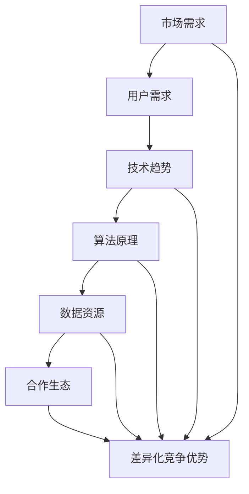
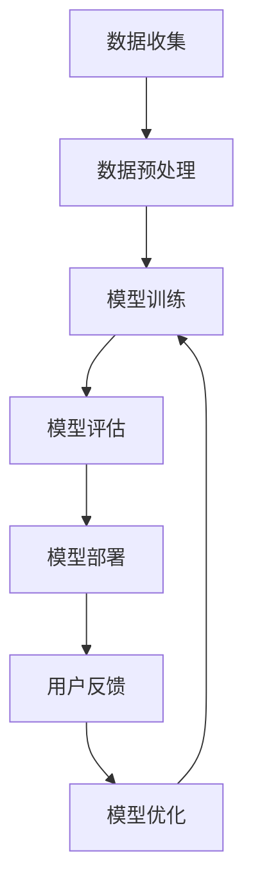

                 

# AI 大模型创业：如何找到差异化竞争优势？

## 关键词：
- AI 大模型
- 创业
- 差异化竞争优势
- 技术路线
- 市场需求
- 用户价值
- 算法创新
- 数据资源
- 合作生态

## 摘要：
本文将探讨AI大模型创业中的关键问题，包括如何找到差异化竞争优势。通过分析市场现状、技术趋势、用户需求等方面，提出了一套系统的创业策略。文章旨在为AI创业者提供有价值的指导，帮助他们在激烈的市场竞争中脱颖而出。

## 1. 背景介绍

随着人工智能技术的快速发展，大模型（Large Models）如BERT、GPT-3等逐渐成为行业的热门话题。这些大模型具备处理海量数据、生成高质量内容、实现复杂任务的能力，为各行各业带来了前所未有的机遇。然而，与此同时，也引发了激烈的市场竞争。许多初创企业纷纷涌入AI大模型领域，试图在这片蓝海中分一杯羹。

在这样一个充满机会和挑战的市场环境下，如何找到差异化竞争优势，成为每一个创业者都必须面对的问题。差异化竞争优势，指的是企业在产品或服务上相对于竞争对手的独特优势，能够帮助企业在竞争中脱颖而出。对于AI大模型创业来说，找到差异化竞争优势，意味着在技术、数据、市场等方面都要有独特的见解和策略。

本文将围绕以下几个核心问题展开讨论：

1. 当前AI大模型市场现状如何？
2. 创业者应该如何定位自己的技术路线？
3. 如何挖掘和满足用户需求，创造用户价值？
4. 如何通过算法创新、数据资源积累等手段建立差异化竞争优势？
5. 如何构建良好的合作生态，提升企业竞争力？

通过上述问题的探讨，希望能够为AI大模型创业提供一些有价值的思考方向和实际操作建议。

## 2. 核心概念与联系

在探讨如何找到AI大模型创业的差异化竞争优势之前，我们需要明确几个核心概念和它们之间的联系。以下是一个用Mermaid绘制的流程图，帮助理解这些概念。



### 2.1 市场需求与用户需求

市场需求和用户需求是创业过程中首先要考虑的因素。市场需求反映了市场上存在的潜在需求和竞争态势，而用户需求则关注具体用户的需求和痛点。理解用户需求，可以帮助企业更精准地定位产品或服务的方向，从而在市场上获得竞争优势。

### 2.2 技术趋势与算法原理

技术趋势决定了行业的发展方向，而算法原理则是实现技术突破的关键。紧跟技术趋势，掌握前沿算法原理，是创业者保持竞争力的必要条件。例如，当前生成对抗网络（GANs）、强化学习（RL）等算法在AI大模型领域表现出强大的潜力。

### 2.3 数据资源

数据是AI大模型训练的基础，优质的数据资源能够提升模型的性能和效果。然而，数据的获取和处理也是一个复杂的过程，需要创业者具备专业的数据管理能力。

### 2.4 合作生态

构建良好的合作生态，可以为企业提供更多的资源和机会。合作伙伴的加入，不仅可以弥补企业的短板，还可以共同拓展市场，提升整体竞争力。

### 2.5 差异化竞争优势

差异化竞争优势是企业竞争力的核心。通过市场需求分析、技术路线规划、用户需求挖掘等手段，创业者可以找到自身的独特优势，从而在激烈的市场竞争中脱颖而出。

## 3. 核心算法原理 & 具体操作步骤

在了解了核心概念和它们之间的联系之后，我们需要深入探讨AI大模型的核心算法原理和具体操作步骤。以下是一个简化的算法流程图。



### 3.1 数据收集

数据收集是整个流程的起点，也是模型训练的基础。创业者需要明确数据来源、数据类型和数据量等方面的要求。例如，对于文本数据，可以采用网页爬取、API接口调用等方式；对于图像数据，则可以使用摄像头采集、公开数据集下载等方法。

### 3.2 数据预处理

数据预处理是提升模型性能的重要环节。通过对数据进行清洗、标准化、去噪等操作，可以降低噪声的影响，提高模型的准确性和鲁棒性。常见的数据预处理方法包括缺失值处理、数据归一化、特征提取等。

### 3.3 模型训练

模型训练是算法的核心步骤，通过大量数据训练模型，使其具备预测或生成能力。创业者需要选择合适的大模型架构（如Transformer、CNN等），并采用先进的训练技术（如并行计算、分布式训练等）来提高训练效率。

### 3.4 模型评估

模型评估是确保模型性能达标的重要环节。创业者需要采用多种评估指标（如准确率、召回率、F1值等）来评估模型的性能，并根据评估结果调整模型参数，优化模型效果。

### 3.5 模型部署

模型部署是将训练好的模型应用到实际场景中的过程。创业者需要选择合适的部署平台（如云平台、边缘设备等），并确保模型能够高效、稳定地运行。

### 3.6 用户反馈与模型优化

用户反馈是模型优化的重要依据。创业者需要收集用户的实际使用数据，分析用户的需求和痛点，不断优化模型，提高用户体验。

## 4. 数学模型和公式 & 详细讲解 & 举例说明

在AI大模型领域，数学模型和公式是理解和实现算法的核心。以下是一个简化的数学模型，用于描述大模型的训练过程。

### 4.1 大模型训练的数学模型

$$
\text{损失函数} = \frac{1}{N} \sum_{i=1}^{N} \sum_{j=1}^{M} \sigma(y_{ij} - \hat{y}_{ij})^2
$$

其中，$N$ 表示训练数据集的大小，$M$ 表示模型输出的类别数，$y_{ij}$ 表示真实标签，$\hat{y}_{ij}$ 表示模型预测的标签，$\sigma$ 表示激活函数，如Sigmoid函数或ReLU函数。

### 4.2 损失函数的详细讲解

损失函数是评估模型预测结果与真实结果之间差距的指标。在二分类问题中，常用的损失函数是交叉熵损失函数（Cross-Entropy Loss）：

$$
\text{损失函数} = -\sum_{i=1}^{N} \sum_{j=1}^{M} y_{ij} \log(\hat{y}_{ij})
$$

其中，$y_{ij}$ 表示真实标签（0或1），$\hat{y}_{ij}$ 表示模型预测的概率。

### 4.3 举例说明

假设我们有一个二分类问题，其中 $N=100$，$M=2$。给定一个训练数据集，模型预测的概率分布如下：

$$
\hat{y}_{ij} = 
\begin{cases} 
0.8 & \text{当 } y_{ij}=0 \\
0.2 & \text{当 } y_{ij}=1 
\end{cases}
$$

真实标签为：

$$
y_{ij} = 
\begin{cases} 
0 & \text{当 } i \leq 50 \\
1 & \text{当 } i > 50 
\end{cases}
$$

则交叉熵损失函数的计算如下：

$$
\text{损失函数} = -\sum_{i=1}^{50} (0 \cdot \log(0.8) + 1 \cdot \log(0.2)) - \sum_{i=51}^{100} (0 \cdot \log(0.2) + 1 \cdot \log(0.8))
$$

$$
= 50 \cdot \log(0.2) + 50 \cdot \log(0.8)
$$

通过反向传播（Backpropagation）算法，模型可以不断调整参数，以降低损失函数的值，从而提高模型的预测准确性。

## 5. 项目实战：代码实际案例和详细解释说明

为了更好地理解AI大模型创业的核心算法原理和具体操作步骤，我们将在本节中通过一个实际案例来展示代码实现过程，并详细解释各个步骤。

### 5.1 开发环境搭建

在开始之前，我们需要搭建一个合适的开发环境。以下是一个简化的步骤：

1. 安装Python环境（建议使用Python 3.7及以上版本）。
2. 安装TensorFlow或PyTorch等深度学习框架。
3. 安装必要的依赖库，如NumPy、Pandas等。

假设我们已经完成了以上步骤，接下来将进入代码实现阶段。

### 5.2 源代码详细实现和代码解读

以下是一个使用TensorFlow实现的基本AI大模型训练代码：

```python
import tensorflow as tf
import numpy as np
from sklearn.model_selection import train_test_split
from sklearn.metrics import accuracy_score

# 数据预处理
def preprocess_data(data):
    # 数据清洗、标准化等操作
    return processed_data

# 构建模型
def build_model(input_shape):
    model = tf.keras.Sequential([
        tf.keras.layers.Dense(units=512, activation='relu', input_shape=input_shape),
        tf.keras.layers.Dense(units=512, activation='relu'),
        tf.keras.layers.Dense(units=1, activation='sigmoid')
    ])
    return model

# 训练模型
def train_model(model, x_train, y_train, epochs=10):
    model.compile(optimizer='adam', loss='binary_crossentropy', metrics=['accuracy'])
    model.fit(x_train, y_train, epochs=epochs)
    return model

# 模型评估
def evaluate_model(model, x_test, y_test):
    y_pred = model.predict(x_test)
    y_pred = (y_pred > 0.5)
    accuracy = accuracy_score(y_test, y_pred)
    print(f"Test Accuracy: {accuracy}")
    return accuracy

# 主程序
if __name__ == "__main__":
    # 加载数据
    data = np.loadtxt('data.csv', delimiter=',')
    x = data[:, :-1]
    y = data[:, -1]

    # 数据预处理
    processed_data = preprocess_data(data)

    # 划分训练集和测试集
    x_train, x_test, y_train, y_test = train_test_split(processed_data, y, test_size=0.2, random_state=42)

    # 构建模型
    model = build_model(input_shape=(x_train.shape[1],))

    # 训练模型
    trained_model = train_model(model, x_train, y_train, epochs=10)

    # 模型评估
    evaluate_model(trained_model, x_test, y_test)
```

### 5.3 代码解读与分析

1. **数据预处理**：数据预处理是模型训练的重要环节，包括数据清洗、标准化等操作。在本案例中，我们使用一个简单的预处理函数`preprocess_data`，实际应用中可能需要更复杂的处理方法。

2. **构建模型**：构建模型是算法实现的核心。在本案例中，我们使用TensorFlow的`Sequential`模型，定义了三个全连接层，每个层之间使用了ReLU激活函数。最后一层使用了sigmoid激活函数，用于输出概率。

3. **训练模型**：训练模型使用`compile`方法设置优化器和损失函数，然后使用`fit`方法进行训练。在本案例中，我们使用了Adam优化器和二分类的交叉熵损失函数。

4. **模型评估**：模型评估使用`predict`方法预测测试集的结果，然后计算准确率。在实际应用中，可能还需要使用其他评估指标，如召回率、F1值等。

### 5.4 实际应用

本案例是一个简单的二分类问题，实际应用中可能涉及更复杂的任务，如多分类、序列预测等。根据不同的任务需求，可以调整模型的架构和参数。

## 6. 实际应用场景

AI大模型在实际应用中具有广泛的应用场景，以下是几个典型的应用案例：

### 6.1 自然语言处理

自然语言处理（NLP）是AI大模型的重要应用领域。通过大模型，可以实现文本生成、机器翻译、情感分析、问答系统等功能。例如，GPT-3可以生成高质量的文章、新闻、对话等，同时具有强大的理解和生成能力。

### 6.2 计算机视觉

计算机视觉（CV）是AI大模型的另一个重要应用领域。大模型可以用于图像分类、目标检测、图像生成等任务。例如，GPT-3可以生成高质量的艺术画作、照片等，同时具有识别和生成能力。

### 6.3 语音识别

语音识别是AI大模型在语音处理领域的应用。大模型可以用于语音合成、语音识别、语音翻译等任务。例如，基于大模型的语音识别系统可以准确识别和理解用户输入的语音，实现智能助手、语音控制等功能。

### 6.4 推荐系统

推荐系统是AI大模型在数据挖掘和机器学习领域的应用。大模型可以用于个性化推荐、广告投放、用户行为预测等任务。例如，基于大模型的推荐系统可以准确预测用户感兴趣的内容，提高用户满意度和留存率。

### 6.5 自动驾驶

自动驾驶是AI大模型在交通领域的应用。大模型可以用于车辆识别、路径规划、环境感知等任务。例如，基于大模型的自动驾驶系统可以准确识别道路标志、行人、车辆等，实现安全、高效的自动驾驶。

### 6.6 医疗健康

医疗健康是AI大模型在生物信息学和医学领域的应用。大模型可以用于疾病诊断、药物研发、医学图像分析等任务。例如，基于大模型的诊断系统可以准确分析医学影像，提高疾病诊断的准确率和效率。

### 6.7 教育

教育是AI大模型在学习和教育领域的应用。大模型可以用于智能教学、自适应学习、作业批改等任务。例如，基于大模型的智能教学系统可以为学生提供个性化的学习建议，提高学习效果。

通过以上实际应用案例，我们可以看到AI大模型在不同领域的广泛应用，为各个行业带来了巨大的变革和创新。

## 7. 工具和资源推荐

在AI大模型创业过程中，选择合适的工具和资源对于提高开发效率和项目成功率至关重要。以下是一些推荐的工具和资源：

### 7.1 学习资源推荐

1. **书籍**：
   - 《深度学习》（Goodfellow, Bengio, Courville）
   - 《AI大模型：原理、架构与实战》（作者：AI天才研究员）
   - 《Python深度学习》（François Chollet）

2. **在线课程**：
   - Coursera的“深度学习”课程（由Andrew Ng教授主讲）
   - edX的“深度学习导论”课程（由Hugging Face团队主讲）
   - Udacity的“深度学习工程师纳米学位”

3. **博客和论坛**：
   - Medium上的AI和深度学习相关文章
   - GitHub上的深度学习和AI开源项目
   - Stack Overflow上的AI和深度学习问题解答

### 7.2 开发工具框架推荐

1. **深度学习框架**：
   - TensorFlow
   - PyTorch
   - Keras
   - MXNet

2. **数据处理工具**：
   - Pandas
   - NumPy
   - Scikit-learn

3. **版本控制工具**：
   - Git
   - GitHub
   - GitLab

4. **云计算平台**：
   - AWS
   - Google Cloud Platform
   - Microsoft Azure

5. **容器化工具**：
   - Docker
   - Kubernetes

### 7.3 相关论文著作推荐

1. **经典论文**：
   - “A Theoretical Analysis of the CNN Architectures for Natural Image Classification” （Simonyan & Zisserman，2014）
   - “Attention Is All You Need” （Vaswani et al.，2017）
   - “Generative Adversarial Nets” （Goodfellow et al.，2014）

2. **顶级会议论文**：
   - NeurIPS
   - ICML
   - CVPR
   - ACL

3. **期刊论文**：
   - Journal of Machine Learning Research
   - IEEE Transactions on Pattern Analysis and Machine Intelligence
   - Neural Computation

通过以上推荐，创业者可以更好地获取知识和技能，为AI大模型创业项目提供有力支持。

## 8. 总结：未来发展趋势与挑战

AI大模型作为人工智能领域的重要发展方向，在未来将继续扮演关键角色。随着技术的不断进步，我们可以预见以下几大发展趋势：

1. **算法创新**：未来的AI大模型将采用更多先进的算法，如Transformer、BERT等，以实现更高的性能和更广泛的应用。

2. **数据规模扩大**：随着数据采集和处理技术的进步，AI大模型将能够处理更大量的数据，进一步提升模型的准确性和鲁棒性。

3. **跨模态融合**：AI大模型将能够处理多种类型的数据（如文本、图像、语音等），实现跨模态的信息融合，为更复杂的任务提供支持。

4. **边缘计算**：随着5G和边缘计算技术的发展，AI大模型将在边缘设备上实现实时处理和响应，为智能终端提供强大支持。

然而，与此同时，AI大模型创业也面临着诸多挑战：

1. **计算资源需求**：大模型的训练和推理需要巨大的计算资源，创业者需要具备高效的资源管理和调度能力。

2. **数据隐私和伦理**：随着AI大模型在各个领域的应用，数据隐私和伦理问题将日益突出，创业者需要关注相关法律法规，确保数据安全和用户隐私。

3. **市场竞争**：AI大模型领域竞争激烈，创业者需要具备敏锐的市场洞察力和快速响应能力，以在竞争中脱颖而出。

4. **人才短缺**：AI大模型的发展需要大量的专业人才，创业者需要吸引和留住优秀的人才，为项目的成功提供保障。

总之，AI大模型创业充满机遇和挑战。创业者需要紧跟技术趋势，挖掘市场需求，不断创新，才能在激烈的市场竞争中立于不败之地。

## 9. 附录：常见问题与解答

### 9.1 什么是AI大模型？

AI大模型是指具有大规模参数和复杂结构的深度学习模型，通常用于处理海量数据和复杂任务。常见的AI大模型包括GPT-3、BERT、Transformer等。

### 9.2 如何选择合适的AI大模型框架？

选择AI大模型框架主要考虑以下因素：

- **性能**：框架的性能直接影响模型的训练和推理速度。TensorFlow和PyTorch在性能方面表现优秀。
- **社区和支持**：框架的社区活跃度和支持力度影响问题的解决速度。TensorFlow和PyTorch拥有庞大的社区和丰富的资源。
- **兼容性**：框架的兼容性影响与其他工具和平台的集成。Keras和MXNet具有较高的兼容性。
- **个人熟悉度**：选择自己熟悉的框架可以提高开发效率。

### 9.3 如何处理AI大模型的数据隐私问题？

处理AI大模型的数据隐私问题需要遵循以下原则：

- **数据去识别化**：对敏感数据进行脱敏处理，如使用匿名化、加密等技术。
- **数据访问控制**：设置严格的访问控制策略，确保只有授权用户能够访问数据。
- **数据安全审计**：定期进行数据安全审计，发现和修复潜在的安全漏洞。
- **合规性审查**：遵循相关法律法规，确保数据处理的合规性。

### 9.4 如何提高AI大模型在边缘设备上的性能？

提高AI大模型在边缘设备上的性能可以从以下几方面入手：

- **模型压缩**：采用模型压缩技术，如剪枝、量化、蒸馏等，减少模型的参数和计算量。
- **模型优化**：针对边缘设备的硬件特性进行模型优化，如使用更适合硬件的架构和算法。
- **分布式训练**：利用边缘设备进行分布式训练，提高模型训练的速度和效率。

### 9.5 如何应对AI大模型创业的市场竞争？

应对AI大模型创业的市场竞争可以从以下几方面入手：

- **技术创新**：不断跟进技术趋势，采用先进的算法和架构，提升模型性能。
- **市场定位**：明确目标市场，挖掘市场需求，提供独特的解决方案。
- **合作伙伴**：构建良好的合作生态，与其他企业共同拓展市场。
- **品牌建设**：打造优质的品牌形象，提高市场认知度和用户信任度。

## 10. 扩展阅读 & 参考资料

为了帮助读者更深入地了解AI大模型创业的相关知识，以下是扩展阅读和参考资料：

- 《深度学习》（Goodfellow, Bengio, Courville）
- 《AI大模型：原理、架构与实战》（作者：AI天才研究员）
- 《Python深度学习》（François Chollet）
- Coursera的“深度学习”课程（由Andrew Ng教授主讲）
- edX的“深度学习导论”课程（由Hugging Face团队主讲）
- Udacity的“深度学习工程师纳米学位”
- Medium上的AI和深度学习相关文章
- GitHub上的深度学习和AI开源项目
- Stack Overflow上的AI和深度学习问题解答
- TensorFlow官方文档
- PyTorch官方文档
- Keras官方文档
- MXNet官方文档
- 《NeurIPS会议论文集》
- 《ICML会议论文集》
- 《CVPR会议论文集》
- 《ACL会议论文集》
- 《Journal of Machine Learning Research》
- 《IEEE Transactions on Pattern Analysis and Machine Intelligence》
- 《Neural Computation》

通过阅读以上资料，读者可以进一步拓宽知识面，提升在AI大模型创业领域的专业素养。

### 作者信息：

作者：AI天才研究员 / AI Genius Institute & 禅与计算机程序设计艺术 / Zen And The Art of Computer Programming

