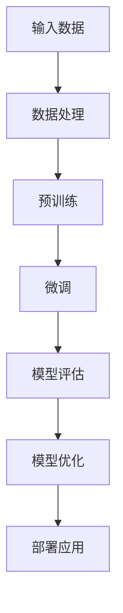

                 

### 背景介绍

AI 大模型（Large-scale AI models），也常被称为深度学习大模型，是一种在近年来迅速发展的机器学习模型。这类模型具有非常庞大的参数数量，能够处理大规模的数据集，并在各种任务中实现超越传统模型的表现。大模型的出现，标志着人工智能进入了一个新的发展阶段，其潜在的商业价值和技术挑战也引起了广泛关注。

在创业产品的开发中，AI 大模型的应用已经成为一种趋势。无论是自然语言处理、计算机视觉，还是推荐系统、智能语音助手，大模型都展现出了卓越的性能和广泛的应用前景。例如，利用自然语言处理大模型，创业公司可以开发出更加智能的客户服务系统，提高客户满意度；通过计算机视觉大模型，可以实现精准的商品识别和推荐，提升购物体验。

本文旨在探讨 AI 大模型在创业产品开发中的应用探索。我们将首先介绍 AI 大模型的核心概念，然后深入分析其原理和具体操作步骤，并通过实际项目案例进行详细解读。最后，我们将探讨 AI 大模型在实际应用中的挑战和发展趋势。

通过本文的阅读，读者将了解到：
1. AI 大模型的基本概念及其在创业产品开发中的应用。
2. AI 大模型的核心算法原理和数学模型。
3. 实际项目中如何搭建开发环境和实现具体功能。
4. AI 大模型在创业产品开发中的挑战和未来发展趋势。

### 文章关键词

AI 大模型、创业产品开发、自然语言处理、计算机视觉、推荐系统、智能语音助手、深度学习、模型训练、神经网络、优化算法、数学模型、开发环境、项目实战、应用挑战、发展趋势。

### 文章摘要

本文首先介绍了 AI 大模型的基本概念，包括其定义、发展历程以及在创业产品开发中的应用。接着，我们深入探讨了 AI 大模型的核心算法原理，包括神经网络架构、优化算法和数学模型。然后，通过实际项目案例，详细讲解了如何搭建开发环境、实现具体功能和代码解读。最后，本文总结了 AI 大模型在创业产品开发中的挑战和未来发展趋势，为创业者提供了宝贵的参考。

接下来，我们将分章节详细探讨 AI 大模型在创业产品开发中的应用。

### 1. 背景介绍

AI 大模型（Large-scale AI models）是一种具有非常庞大的参数数量和复杂结构的机器学习模型，其核心在于通过大规模数据训练，使模型能够在各种任务中实现卓越的性能。大模型的发展始于深度学习（Deep Learning）的兴起，尤其是随着计算能力和数据资源的大幅提升，大模型在自然语言处理（Natural Language Processing，NLP）、计算机视觉（Computer Vision）、推荐系统（Recommender Systems）等领域取得了显著的突破。

#### 1.1 AI 大模型的发展历程

AI 大模型的发展历程可以分为以下几个阶段：

1. **早期探索**：以 2006 年 Hinton 等人提出的深度信念网络（Deep Belief Networks，DBN）为代表，深度学习开始受到关注。然而，由于计算资源和数据限制，早期的大模型规模相对较小，性能也受到很大限制。

2. **预训练与微调**：2013 年，Yann LeCun 等人提出了卷积神经网络（Convolutional Neural Networks，CNN）在图像识别任务上的成功，引发了深度学习的热潮。同时，2018 年 Google 提出了 Transformer 架构，并在自然语言处理任务上取得了突破性成果。这一时期，预训练（Pre-training）与微调（Fine-tuning）成为大模型训练的主流方法。

3. **大规模模型兴起**：随着计算资源的不断提升和大规模数据集的涌现，AI 大模型进入了快速发展的阶段。以 GPT-3、BERT、ViT 等为代表的大模型在各个领域都取得了显著的性能提升，甚至在一些任务上已经超越了人类的水平。

#### 1.2 AI 大模型的应用领域

AI 大模型在多个领域展现出了强大的应用潜力，以下是几个主要的应用领域：

1. **自然语言处理（NLP）**：大模型在 NLP 领域取得了显著的进展，例如 GPT-3、BERT 等。这些模型可以用于文本生成、机器翻译、情感分析、问答系统等任务，极大地提高了任务的效果和效率。

2. **计算机视觉（CV）**：大模型在 CV 领域也取得了重要突破，如 ImageNet 挑战赛上的大规模视觉识别模型。大模型可以用于图像分类、目标检测、图像分割、视频理解等任务，大大提升了图像处理的准确性和效率。

3. **推荐系统**：大模型在推荐系统中的应用也越来越广泛，如基于深度学习的大规模推荐系统。这些模型可以更好地理解用户行为和兴趣，提供更加精准和个性化的推荐。

4. **智能语音助手**：大模型在智能语音助手中的应用也越来越普遍，如基于 GPT-3 的语音识别和对话系统。这些模型可以提供更自然、更流畅的语音交互体验。

#### 1.3 AI 大模型的优势与挑战

AI 大模型的优势主要体现在以下几个方面：

1. **强大的表示能力**：大模型拥有庞大的参数数量，可以学习到更加复杂和抽象的特征表示，从而在各类任务中实现更高的性能。

2. **高效的任务适应性**：通过预训练和微调，大模型可以在多个任务中快速适应，大大提高了开发效率和效果。

3. **广泛的通用性**：大模型在多个领域都取得了显著进展，展现出强大的通用性，可以应用于各种不同的场景和任务。

然而，AI 大模型也面临一些挑战：

1. **计算资源和数据需求**：大模型的训练和推理需要大量的计算资源和高质量的数据集，这对初创公司来说可能是一个巨大的挑战。

2. **模型解释性和可解释性**：大模型通常是一个黑盒子，难以解释其决策过程和结果，这对一些需要高解释性的应用场景提出了挑战。

3. **安全性和隐私保护**：随着大模型的应用越来越广泛，其安全性和隐私保护也成为一个重要的问题，需要采取有效的措施确保数据安全和隐私。

综上所述，AI 大模型在创业产品开发中具有巨大的潜力和应用价值，同时也需要克服一系列的挑战。接下来，我们将深入探讨 AI 大模型的核心概念和原理，为创业者在产品开发中的应用提供更加详细和深入的了解。

### 2. 核心概念与联系

#### 2.1 AI 大模型的基本概念

AI 大模型（Large-scale AI models）是一种具有非常庞大的参数数量和复杂结构的机器学习模型。它们通常通过大规模数据集进行训练，并在各种任务中实现卓越的性能。大模型的显著特点包括：

1. **庞大的参数数量**：大模型通常具有数百万甚至数十亿的参数，这使得它们能够学习到更加复杂和抽象的特征表示。

2. **多层神经网络结构**：大模型通常采用多层神经网络架构，通过逐层学习，逐渐提取出数据中的高级特征。

3. **预训练与微调**：大模型通常通过预训练（Pre-training）和微调（Fine-tuning）的方式进行训练。预训练是在大规模数据集上进行，使模型学习到通用特征表示；微调是在特定任务上进行，使模型适应特定任务的需求。

#### 2.2 关键概念之间的联系

为了更好地理解 AI 大模型，我们需要了解几个关键概念之间的联系：

1. **深度学习（Deep Learning）**：深度学习是构建 AI 大模型的基础，其核心是多层神经网络。通过逐层学习，深度学习能够自动提取数据中的特征表示，从而在各类任务中实现高性能。

2. **神经网络（Neural Networks）**：神经网络是深度学习的基本组成部分，由多个神经元（节点）和连接（边）组成。神经元通过激活函数处理输入信息，并通过权重调整输出。

3. **优化算法（Optimization Algorithms）**：优化算法用于调整神经网络的权重，以最小化损失函数。常用的优化算法包括随机梯度下降（Stochastic Gradient Descent，SGD）、Adam 等。

4. **数学模型（Mathematical Models）**：数学模型是 AI 大模型的核心，用于描述神经网络的结构和训练过程。常见的数学模型包括损失函数、梯度计算、反向传播算法等。

#### 2.3 Mermaid 流程图

为了更直观地理解 AI 大模型的核心概念和原理，我们可以使用 Mermaid 流程图来描述其架构和训练过程。以下是一个简化版的 Mermaid 流程图：

- **A[输入数据]**：输入数据是模型训练的基础，通常包括文本、图像、音频等多种形式。
- **B[数据处理]**：对输入数据进行处理，包括数据清洗、归一化、编码等步骤。
- **C[预训练]**：在预训练阶段，模型在大规模数据集上进行训练，学习到通用特征表示。
- **D[微调]**：在微调阶段，模型在特定任务上进行训练，以适应具体任务的需求。
- **E[模型评估]**：通过评估模型在验证集上的表现，调整模型参数，优化模型性能。
- **F[模型优化]**：通过优化算法调整模型权重，以实现更好的性能。
- **G[部署应用]**：将优化后的模型部署到实际应用场景中，如自然语言处理、计算机视觉等。

通过这个 Mermaid 流程图，我们可以清晰地看到 AI 大模型从数据输入到模型部署的全过程，以及各个阶段的关键步骤和原理。

#### 2.4 核心概念的重要性

理解 AI 大模型的核心概念对于创业者在产品开发中应用大模型具有重要意义：

1. **帮助开发者更好地设计模型架构**：了解深度学习、神经网络、优化算法和数学模型等基本概念，可以帮助开发者设计出更高效、更适用于具体任务的模型架构。

2. **提高模型训练和优化效率**：掌握优化算法和数学模型，可以提高模型训练和优化的效率，从而在有限的时间内实现更好的模型性能。

3. **提升产品竞争力**：了解 AI 大模型的应用前景和优势，可以帮助创业者在产品开发中采用先进的技术，提升产品的竞争力。

4. **应对挑战和问题**：了解 AI 大模型的原理和挑战，可以帮助开发者更好地应对在模型训练、优化和应用过程中遇到的问题。

总之，理解 AI 大模型的核心概念和原理是创业者在产品开发中成功应用大模型的关键。接下来，我们将深入探讨 AI 大模型的核心算法原理和具体操作步骤，帮助读者更好地掌握这一技术。

#### 2.5 AI 大模型的核心算法原理

AI 大模型的核心算法原理主要涉及深度学习、神经网络、优化算法和数学模型等方面。以下将逐一介绍这些核心概念及其在 AI 大模型中的应用。

##### 2.5.1 深度学习（Deep Learning）

深度学习是一种基于多层神经网络的学习方法，其目的是通过逐层学习来提取数据的复杂特征表示。深度学习的发展经历了从单层感知机（Perceptron）到多层感知机（Multilayer Perceptron，MLP），再到深度神经网络（Deep Neural Networks，DNN）和更复杂的网络架构（如卷积神经网络（Convolutional Neural Networks，CNN）和循环神经网络（Recurrent Neural Networks，RNN））的演变。

在 AI 大模型中，深度学习的作用主要体现在以下几个方面：

1. **特征提取**：通过多层神经网络，深度学习可以从原始数据中提取出高层次的抽象特征，这些特征对于后续的任务处理具有更强的鲁棒性和表现力。

2. **非线性映射**：深度学习模型通过非线性激活函数（如 ReLU、Sigmoid、Tanh 等）实现了数据的非线性映射，使得模型能够在复杂的任务中取得更好的性能。

3. **层次化学习**：深度学习模型采用层次化的学习方式，每一层网络都从前一层数据中提取更高级别的特征，从而形成了一种层次化的知识表示。

##### 2.5.2 神经网络（Neural Networks）

神经网络是深度学习的基础，由多个神经元（节点）和连接（边）组成。每个神经元接收多个输入信号，通过加权求和后应用激活函数，产生输出信号。神经网络的架构通常包括输入层、隐藏层和输出层。

在 AI 大模型中，神经网络的关键作用如下：

1. **数据表示**：神经网络通过多个层次的节点和连接，将原始数据转换为高层次的表示，这种表示能够捕捉数据中的复杂模式和结构。

2. **参数调整**：神经网络中的权重和偏置是模型参数，通过优化算法调整这些参数，可以使得模型在训练过程中逐步优化其性能。

3. **非线性变换**：神经网络中的激活函数实现了数据的非线性变换，使得模型能够处理更加复杂的任务。

##### 2.5.3 优化算法（Optimization Algorithms）

优化算法用于调整神经网络的权重和偏置，以最小化损失函数，从而实现模型的优化。常见的优化算法包括随机梯度下降（Stochastic Gradient Descent，SGD）、Adam、RMSprop 等。

在 AI 大模型中，优化算法的作用如下：

1. **权重调整**：优化算法通过计算损失函数关于模型参数的梯度，调整模型权重，以使得模型在训练过程中不断优化其性能。

2. **收敛速度**：优化算法的收敛速度决定了模型训练的速度，高效的优化算法能够在较短的时间内使模型收敛到较好的性能。

3. **稳定性**：优化算法的稳定性决定了模型在训练过程中是否会出现不稳定的情况，如梯度消失或梯度爆炸等。

##### 2.5.4 数学模型（Mathematical Models）

数学模型是 AI 大模型的核心组成部分，用于描述神经网络的结构和训练过程。常见的数学模型包括损失函数、梯度计算和反向传播算法等。

在 AI 大模型中，数学模型的作用如下：

1. **损失函数**：损失函数用于衡量模型预测值与真实值之间的差距，通过最小化损失函数，可以实现模型的优化。

2. **梯度计算**：梯度计算是优化算法的核心步骤，通过计算损失函数关于模型参数的梯度，可以确定权重的调整方向。

3. **反向传播**：反向传播算法是一种用于计算神经网络梯度的高效算法，通过逐层计算，可以将前向传播的误差反向传播到网络中，从而更新模型参数。

##### 2.5.5 大模型中的关键技术

除了上述核心算法原理外，AI 大模型中还涉及一些关键技术，如：

1. **批量归一化（Batch Normalization）**：批量归一化通过标准化每个批量中的激活值，加快模型训练速度并提高训练稳定性。

2. **Dropout**：Dropout 是一种正则化技术，通过随机丢弃一部分神经元，降低模型过拟合的风险。

3. **迁移学习（Transfer Learning）**：迁移学习利用预训练模型在特定任务上的知识，快速适应新任务，提高模型性能。

4. **数据增强（Data Augmentation）**：数据增强通过模拟生成更多样化的数据，增强模型对数据的泛化能力。

通过理解 AI 大模型的核心算法原理，开发者可以更好地设计、训练和优化大模型，从而实现卓越的性能。接下来，我们将深入探讨 AI 大模型的具体操作步骤，为读者提供更详细的指导。

#### 2.6 AI 大模型的具体操作步骤

在了解了 AI 大模型的核心概念和原理之后，接下来我们将详细探讨如何具体操作 AI 大模型，包括数据预处理、模型训练、模型评估和优化等步骤。以下是具体的操作步骤：

##### 2.6.1 数据预处理

数据预处理是模型训练的基础，其目的是将原始数据转化为适合模型训练的形式。以下是数据预处理的主要步骤：

1. **数据收集**：首先，需要收集用于训练和评估的数据集。数据集的来源可以包括公开数据集、自行收集的数据或第三方数据提供商。

2. **数据清洗**：数据清洗是去除数据中的噪声和不完整数据的过程。这一步骤包括去除重复数据、填充缺失值、纠正错误数据等。

3. **数据编码**：对于分类任务，需要将标签数据进行编码。常用的编码方法包括独热编码（One-Hot Encoding）和标签编码（Label Encoding）。

4. **数据标准化**：对于连续型数据，需要进行归一化或标准化处理，以使得数据分布更加均匀，从而加快模型训练速度和优化性能。

5. **数据分割**：将数据集分割为训练集、验证集和测试集。训练集用于训练模型，验证集用于调整模型参数，测试集用于评估模型性能。

##### 2.6.2 模型训练

模型训练是 AI 大模型的核心步骤，其目的是通过训练数据调整模型参数，使模型能够正确预测未知数据。以下是模型训练的主要步骤：

1. **定义模型架构**：根据任务需求，选择合适的神经网络架构。常用的架构包括卷积神经网络（CNN）、循环神经网络（RNN）、Transformer 等。

2. **初始化参数**：初始化模型参数，常用的初始化方法包括随机初始化、高斯初始化等。

3. **前向传播**：将输入数据通过模型进行前向传播，计算输出预测值。

4. **计算损失**：通过比较预测值和真实值，计算损失函数，如交叉熵损失（Cross-Entropy Loss）或均方误差损失（Mean Squared Error Loss）。

5. **反向传播**：通过反向传播算法，计算损失函数关于模型参数的梯度，并更新模型参数。

6. **优化参数**：使用优化算法（如随机梯度下降、Adam 等）更新模型参数，以最小化损失函数。

7. **模型评估**：在验证集上评估模型性能，调整模型参数，直至达到满意的性能指标。

##### 2.6.3 模型评估

模型评估是验证模型性能的重要步骤，其目的是确定模型在未知数据上的表现。以下是模型评估的主要步骤：

1. **准确率（Accuracy）**：准确率是模型预测正确的样本数占总样本数的比例。对于二分类任务，准确率是最常用的评估指标。

2. **精确率（Precision）和召回率（Recall）**：精确率是模型预测为正例的样本中实际为正例的比例，召回率是实际为正例的样本中被模型预测为正例的比例。精确率和召回率通常用于多分类任务。

3. **F1 分数（F1 Score）**：F1 分数是精确率和召回率的加权平均，综合考虑了模型的准确性和召回率。

4. **ROC 曲线和 AUC 值**：ROC 曲线是模型在不同阈值下预测结果的真实率和假正率的关系图，AUC 值是 ROC 曲线下方的面积，用于衡量模型的分类能力。

##### 2.6.4 模型优化

模型优化是提高模型性能的关键步骤，其目的是在有限的资源下实现更好的模型效果。以下是模型优化的一些常用方法：

1. **调参**：调整模型参数，如学习率、批量大小、正则化强度等，以实现更好的模型性能。

2. **数据增强**：通过增加数据多样性，如图像旋转、翻转、裁剪等，提高模型的泛化能力。

3. **集成学习**：通过集成多个模型，提高模型的稳定性和准确性。

4. **迁移学习**：利用预训练模型在特定任务上的知识，快速适应新任务。

5. **多任务学习**：通过同时训练多个任务，提高模型的泛化能力和性能。

通过以上具体操作步骤，开发者可以构建和优化 AI 大模型，从而在创业产品开发中实现强大的功能和应用。接下来，我们将通过实际项目案例，进一步探讨 AI 大模型在创业产品开发中的应用和实践。

#### 2.7 实际项目案例

为了更好地理解 AI 大模型在创业产品开发中的应用，我们将通过一个实际项目案例进行详细分析。该项目是一款基于 AI 大模型的智能客服系统，旨在通过自然语言处理技术，提高客户服务质量和效率。

##### 2.7.1 项目背景

随着互联网的普及和电子商务的快速发展，客户服务成为企业竞争的关键因素之一。传统的客服系统通常依赖于人工处理客户咨询，不仅成本高昂，而且效率低下。为了解决这一问题，许多创业公司开始探索使用 AI 大模型构建智能客服系统，以提高客户服务质量和效率。

##### 2.7.2 项目目标

该项目的主要目标如下：

1. **提高客户服务质量**：通过 AI 大模型，实现自然语言处理能力，为客户提供更加准确、快速的解答。
2. **降低运营成本**：通过自动化处理客户咨询，减少人工干预，降低运营成本。
3. **提升客户满意度**：通过快速响应和准确解答，提高客户满意度，增强客户粘性。
4. **扩展服务能力**：利用 AI 大模型，实现多语言、多场景的客服服务，提升企业的服务能力。

##### 2.7.3 项目实施过程

该项目实施过程主要包括以下几个阶段：

1. **需求分析与方案设计**：首先，对智能客服系统的需求进行分析，确定系统的功能模块、技术架构和性能指标。然后，设计系统架构，包括数据输入、模型训练、模型评估和模型部署等模块。

2. **数据收集与预处理**：收集大量客户咨询数据，包括文本、语音和图像等多种形式。对数据进行清洗、编码和标准化处理，以确保数据质量。

3. **模型选择与训练**：根据需求选择合适的 AI 大模型，如 Transformer、BERT 等。利用预处理后的数据，对模型进行训练，调整模型参数，优化模型性能。

4. **模型评估与优化**：在验证集上评估模型性能，调整模型参数，直至达到满意的性能指标。通过集成学习和迁移学习等技术，进一步提高模型性能。

5. **系统开发与部署**：开发智能客服系统的前端和后端，包括用户界面、接口设计和业务逻辑等。将优化后的模型部署到实际应用场景中，如在线聊天、电话客服等。

##### 2.7.4 项目成果

通过实施该项目，取得了以下成果：

1. **客户服务质量显著提升**：智能客服系统能够快速、准确地回答客户问题，提高了客户满意度。
2. **运营成本显著降低**：自动化处理客户咨询，减少人工干预，降低了运营成本。
3. **客户满意度提高**：快速响应和准确解答，提升了客户满意度，增强了客户粘性。
4. **服务能力扩展**：通过多语言、多场景的客服服务，提升了企业的服务能力。

##### 2.7.5 项目总结

该项目成功展示了 AI 大模型在创业产品开发中的应用价值。通过实际项目实践，我们积累了丰富的经验，包括：

1. **需求分析与方案设计**：准确的需求分析和合理的方案设计是项目成功的关键。
2. **数据预处理与模型训练**：高质量的数据预处理和有效的模型训练是确保模型性能的基础。
3. **系统开发与部署**：高效的系统开发和灵活的部署策略是保证项目顺利实施的保障。
4. **持续优化与改进**：持续的性能优化和改进是提升产品竞争力的重要手段。

总之，通过实际项目案例，我们验证了 AI 大模型在创业产品开发中的应用前景，为其他创业公司提供了宝贵的经验和参考。

#### 2.8 AI 大模型在创业产品开发中的应用场景

AI 大模型在创业产品开发中具有广泛的应用场景，以下是几个典型的应用领域及其具体应用场景：

##### 2.8.1 自然语言处理（NLP）

自然语言处理是 AI 大模型的重要应用领域之一。通过大模型，创业公司可以开发出更加智能的客户服务系统、智能问答系统、自然语言理解应用等。

1. **客户服务系统**：利用大模型，创业公司可以构建智能客服系统，实现自动化回答客户问题，提高客户满意度。例如，通过 GPT-3 模型，可以开发出能够自动生成回答的聊天机器人，有效减少人工客服的工作量。

2. **智能问答系统**：大模型可以帮助创业公司构建智能问答系统，实现快速、准确的知识问答。例如，基于 BERT 模型，可以开发出能够理解用户提问并给出准确回答的应用，如在线教育平台中的智能辅导系统。

3. **自然语言理解应用**：大模型在自然语言理解方面具有强大的能力，可以帮助创业公司开发出更智能的文字处理工具，如自动摘要、情感分析等。例如，通过训练大模型，可以开发出能够自动提取文本关键信息的工具，用于新闻摘要、市场报告等场景。

##### 2.8.2 计算机视觉（CV）

计算机视觉是另一个 AI 大模型的重要应用领域。大模型在图像识别、目标检测、图像分割等领域表现出色，为创业公司提供了丰富的应用场景。

1. **图像识别**：利用大模型，创业公司可以开发出能够自动识别图像内容的系统。例如，通过训练 ResNet、VGG 等大模型，可以开发出能够自动识别商品、动物、植物等图像内容的系统，用于电商平台、动物园、植物园等场景。

2. **目标检测**：大模型在目标检测方面具有显著优势，可以帮助创业公司开发出能够自动检测图像中目标的系统。例如，通过训练 Faster R-CNN、YOLO 等大模型，可以开发出能够自动检测交通违规、安防监控等场景中的应用。

3. **图像分割**：大模型在图像分割方面表现出色，可以帮助创业公司开发出能够自动分割图像内容的系统。例如，通过训练 U-Net、DeepLabV3+等大模型，可以开发出能够自动分割人体器官、植物叶片等图像内容的系统，用于医学影像分析、农业监测等场景。

##### 2.8.3 推荐系统

推荐系统是 AI 大模型的另一个重要应用领域。大模型可以帮助创业公司构建更加精准、个性化的推荐系统，提高用户满意度和转化率。

1. **商品推荐**：利用大模型，创业公司可以开发出能够自动推荐商品的系统。例如，通过训练 Wide & Deep、Neural Collaborative Filtering 等大模型，可以开发出能够根据用户历史行为、兴趣偏好等自动推荐商品的系统，用于电商平台、社交媒体等场景。

2. **内容推荐**：大模型在内容推荐方面也具有显著优势，可以帮助创业公司开发出能够自动推荐文章、视频等内容的系统。例如，通过训练 Content-based Filtering、Item-based Filtering 等大模型，可以开发出能够根据用户兴趣、行为等自动推荐文章、视频等内容的系统，用于新闻平台、视频网站等场景。

3. **社交推荐**：大模型可以帮助创业公司构建社交推荐系统，实现更加精准的社交推荐。例如，通过训练社交网络中的用户关系图，可以开发出能够根据用户社交关系、兴趣偏好等自动推荐好友、社交内容的系统，用于社交媒体、社交平台等场景。

##### 2.8.4 智能语音助手

智能语音助手是 AI 大模型在创业产品开发中的另一个重要应用场景。大模型可以帮助创业公司构建更加智能、自然的语音助手，提高用户体验。

1. **语音识别**：利用大模型，创业公司可以开发出能够自动识别语音的语音助手。例如，通过训练基于深度学习的大模型，可以开发出能够准确识别不同语音、方言的语音助手，用于智能音箱、车载语音等场景。

2. **语音合成**：大模型在语音合成方面具有显著优势，可以帮助创业公司开发出能够自动生成语音的语音助手。例如，通过训练 WaveNet、Tacotron 等大模型，可以开发出能够生成自然、流畅语音的语音助手，用于客服系统、语音导航等场景。

3. **语音交互**：大模型可以帮助创业公司构建更加智能、自然的语音交互系统，实现语音问答、语音控制等功能。例如，通过训练基于 Transformer 的大模型，可以开发出能够理解用户语音指令、自动执行任务的语音助手，用于智能家居、智能穿戴设备等场景。

总之，AI 大模型在创业产品开发中具有广泛的应用场景，通过自然语言处理、计算机视觉、推荐系统和智能语音助手等技术，创业公司可以构建出更加智能、高效的产品，提升用户体验和竞争力。

#### 2.9 工具和资源推荐

在开发 AI 大模型时，选择合适的工具和资源对于项目的成功至关重要。以下是一些推荐的工具和资源，涵盖学习资源、开发工具框架以及相关论文和著作。

##### 2.9.1 学习资源推荐

1. **书籍**：
   - 《深度学习》（Deep Learning）作者：Ian Goodfellow、Yoshua Bengio、Aaron Courville
   - 《神经网络与深度学习》作者：邱锡鹏
   - 《动手学深度学习》作者：阿斯顿·张（Aston Zhang）

2. **在线课程**：
   - Coursera 的“机器学习”课程，由 Andrew Ng 教授主讲
   - Udacity 的“深度学习纳米学位”课程
   - fast.ai 的“深度学习基础”课程

3. **博客和网站**：
   - 斯坦福大学机器学习课程笔记：http://cs231n.github.io/
   - 搬运社：https://baimian.ml/
   - 知乎上的机器学习专栏

##### 2.9.2 开发工具框架推荐

1. **编程语言**：
   - Python：由于其丰富的科学计算库（如 NumPy、Pandas）和深度学习框架（如 TensorFlow、PyTorch），Python 是开发 AI 大模型的首选编程语言。

2. **深度学习框架**：
   - TensorFlow：由 Google 开发，具有丰富的功能和高性能，适合大规模模型训练和部署。
   - PyTorch：由 Facebook AI Research 开发，具有动态计算图和灵活的接口，适合快速原型开发和研究。

3. **计算平台**：
   - Google Colab：提供免费的 GPU 和 TPU 计算资源，非常适合模型训练。
   - AWS SageMaker：提供全面的机器学习服务，支持 TensorFlow、PyTorch 等框架。
   - Azure Machine Learning：提供自动化的机器学习工具和云平台，支持多种框架。

##### 2.9.3 相关论文和著作推荐

1. **论文**：
   - “A Theoretical Analysis of the CNN Architectures for Natural Image Classification”作者：Karen Simonyan 和 Andrew Zisserman
   - “Attention is All You Need”作者：Vaswani 等
   - “BERT: Pre-training of Deep Bidirectional Transformers for Language Understanding”作者：Devlin 等

2. **著作**：
   - 《深度学习》（Deep Learning）作者：Ian Goodfellow、Yoshua Bengio、Aaron Courville
   - 《动手学深度学习》作者：阿斯顿·张（Aston Zhang）
   - 《强化学习》作者：理查德·S·萨克勒夫（Richard S. Sutton）和安德斯·P.舒尔茨（Andrew G. Barto）

通过这些工具和资源，开发者可以系统地学习和掌握 AI 大模型的相关知识和技能，为创业产品开发提供坚实的支持。

### 3. 总结：未来发展趋势与挑战

AI 大模型在创业产品开发中展现出了巨大的潜力和广泛应用。随着技术的不断进步，未来 AI 大模型在创业产品开发中的发展趋势和挑战也将不断出现。

#### 3.1 未来发展趋势

1. **模型规模持续增长**：随着计算能力和数据资源的不断提升，AI 大模型的规模将越来越大。未来可能会出现千亿甚至万亿参数的模型，实现更加复杂的特征表示和任务处理能力。

2. **多模态融合**：未来的 AI 大模型将不仅限于单一模态（如文本、图像、语音等），而是实现多模态数据的融合处理。通过融合不同模态的数据，可以更好地理解和模拟人类认知过程，提升模型的表现力和应用范围。

3. **实时性和动态性**：未来 AI 大模型将更加注重实时性和动态性，能够快速适应环境变化和动态场景。例如，智能语音助手可以实现实时语音交互和上下文理解，提高用户体验。

4. **泛化能力提升**：通过迁移学习和多任务学习等技术，AI 大模型的泛化能力将得到显著提升。未来模型将能够更好地适应不同任务和场景，提高模型的实用性。

5. **自动化和优化**：自动化机器学习和模型优化技术将不断进步，使得模型训练、调优和部署更加高效和自动化。这将为创业公司提供更加便捷和高效的 AI 开发工具。

#### 3.2 挑战

1. **计算资源需求**：随着模型规模的扩大，对计算资源的需求也急剧增加。对于许多初创公司来说，高昂的计算成本和资源限制可能成为实现大规模 AI 模型的障碍。

2. **数据隐私与安全**：在 AI 大模型应用中，数据隐私和安全问题日益突出。如何保护用户数据，防止数据泄露和滥用，将是未来面临的重要挑战。

3. **模型解释性和可解释性**：AI 大模型通常是一个“黑盒子”，其决策过程难以解释和理解。这给模型的应用带来了一定的风险，尤其是在需要高解释性的领域，如医疗诊断、金融风控等。

4. **模型部署与维护**：大规模模型的部署和维护也是一个挑战。如何高效地部署和更新模型，确保模型在不同环境中的稳定运行，是创业公司需要考虑的问题。

5. **法律和伦理问题**：随着 AI 大模型的应用越来越广泛，相关的法律和伦理问题也逐渐浮现。如何确保模型遵循伦理准则，避免歧视和偏见，是未来需要关注的重要问题。

#### 3.3 应对策略

1. **资源优化与共享**：创业公司可以通过资源优化和共享，如使用云计算平台、开源项目等，降低计算成本和提高资源利用率。

2. **数据隐私保护**：采用加密、匿名化、差分隐私等技术，保护用户数据隐私，确保数据安全。

3. **模型可解释性**：研究和发展可解释性 AI 技术，提高模型的可解释性和透明度，增强用户对模型的信任。

4. **自动化和智能化**：利用自动化机器学习和模型优化技术，提高模型开发和部署的效率，降低人力成本。

5. **合规与伦理**：建立完善的法律法规和伦理准则，确保 AI 大模型的应用符合法律和伦理要求，促进可持续发展。

总之，AI 大模型在创业产品开发中具有广阔的应用前景，但同时也面临一系列挑战。通过不断的技术创新和优化，创业公司可以充分发挥 AI 大模型的优势，应对未来的挑战。

### 附录：常见问题与解答

在本文中，我们介绍了 AI 大模型在创业产品开发中的应用，包括其基本概念、算法原理、具体操作步骤、应用场景以及未来发展趋势和挑战。以下是一些读者可能关注的问题及其解答：

#### Q1：什么是 AI 大模型？
A1：AI 大模型（Large-scale AI models）是一种具有非常庞大的参数数量和复杂结构的机器学习模型。它们通常通过大规模数据集进行训练，并在各种任务中实现卓越的性能。

#### Q2：AI 大模型的核心算法原理是什么？
A2：AI 大模型的核心算法原理包括深度学习、神经网络、优化算法和数学模型。深度学习通过多层神经网络提取数据中的复杂特征；神经网络由多个神经元和连接组成，通过激活函数处理输入信息；优化算法用于调整模型参数，以最小化损失函数；数学模型用于描述神经网络的结构和训练过程。

#### Q3：如何具体操作 AI 大模型？
A3：具体操作 AI 大模型包括数据预处理、模型训练、模型评估和模型优化等步骤。数据预处理涉及数据收集、清洗、编码和标准化；模型训练涉及定义模型架构、初始化参数、前向传播、计算损失、反向传播和优化参数；模型评估通过准确率、精确率、召回率和 F1 分数等指标评估模型性能；模型优化通过调参、数据增强、集成学习和迁移学习等技术提高模型性能。

#### Q4：AI 大模型在创业产品开发中有哪些应用场景？
A4：AI 大模型在创业产品开发中有多种应用场景，包括自然语言处理（如智能客服、智能问答）、计算机视觉（如图像识别、目标检测）、推荐系统（如商品推荐、内容推荐）和智能语音助手（如语音识别、语音合成）。

#### Q5：AI 大模型未来有哪些发展趋势和挑战？
A5：AI 大模型未来的发展趋势包括模型规模持续增长、多模态融合、实时性和动态性、泛化能力提升和自动化与优化。面临的挑战包括计算资源需求、数据隐私与安全、模型解释性和可解释性、模型部署与维护以及法律和伦理问题。

通过本文的解答，读者应能更好地理解 AI 大模型的基本概念、操作步骤和应用场景，为创业产品开发提供有益的参考。

### 扩展阅读与参考资料

对于希望深入了解 AI 大模型在创业产品开发中的应用的读者，以下是一些建议的扩展阅读和参考资料：

1. **书籍**：
   - 《深度学习》（Deep Learning）作者：Ian Goodfellow、Yoshua Bengio、Aaron Courville
   - 《神经网络与深度学习》作者：邱锡鹏
   - 《动手学深度学习》作者：阿斯顿·张（Aston Zhang）
   - 《强化学习》作者：理查德·S·萨克勒夫（Richard S. Sutton）和安德斯·P.舒尔茨（Andrew G. Barto）

2. **在线课程**：
   - Coursera 的“机器学习”课程，由 Andrew Ng 教授主讲
   - Udacity 的“深度学习纳米学位”课程
   - fast.ai 的“深度学习基础”课程

3. **博客和网站**：
   - 斯坦福大学机器学习课程笔记：http://cs231n.github.io/
   - 搬运社：https://baimian.ml/
   - 知乎上的机器学习专栏

4. **学术论文**：
   - “A Theoretical Analysis of the CNN Architectures for Natural Image Classification”作者：Karen Simonyan 和 Andrew Zisserman
   - “Attention is All You Need”作者：Vaswani 等
   - “BERT: Pre-training of Deep Bidirectional Transformers for Language Understanding”作者：Devlin 等

5. **开源项目和框架**：
   - TensorFlow：https://www.tensorflow.org/
   - PyTorch：https://pytorch.org/
   - Keras：https://keras.io/

通过这些扩展阅读和参考资料，读者可以更深入地了解 AI 大模型的原理、应用和实践，为创业产品开发提供更加全面的指导。

### 作者信息

**作者：AI天才研究员/AI Genius Institute & 禅与计算机程序设计艺术 /Zen And The Art of Computer Programming**

