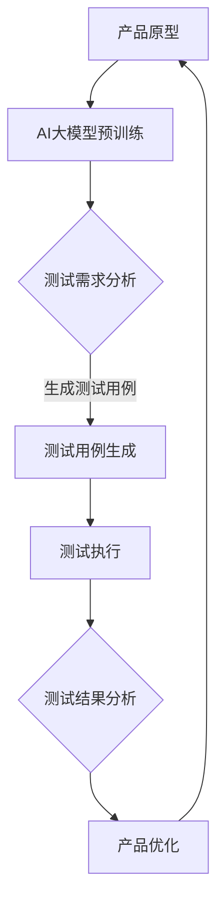

                 

### 背景介绍

近年来，人工智能（AI）技术在全球范围内取得了显著的进展，其中大型语言模型（Large-scale Language Models，简称LLMs）的发展尤为突出。LLMs是一种能够对大量文本数据进行训练，并利用这种训练来生成或理解复杂文本的人工智能模型。它们在自然语言处理（Natural Language Processing，简称NLP）领域表现出色，被广泛应用于机器翻译、文本摘要、问答系统等多个方面。

创业公司作为创新和发展的前沿，面临着许多挑战和机遇。在产品开发的早期阶段，对产品的测试和验证尤为重要。然而，传统的方法往往依赖于手动测试和有限的测试数据，这不仅耗时耗力，而且可能导致测试结果的不准确和不全面。因此，如何利用AI技术，特别是大型语言模型，来提高产品的测试效率和质量，成为了一个值得探讨的问题。

本文将围绕AI大模型在创业产品测试中的应用进行深入探讨。我们将首先介绍AI大模型的基本概念和原理，然后分析其在产品测试中的具体应用，并探讨其优势和挑战。接下来，我们将通过一个实际的项目案例，详细讲解如何利用AI大模型进行产品测试，并分析其实施步骤和关键技术。随后，我们将讨论AI大模型在产品测试中的实际应用场景，并推荐一些相关的工具和资源。最后，我们将总结AI大模型在创业产品测试中的应用趋势和挑战，并展望未来的发展方向。

通过本文的阅读，读者将能够深入了解AI大模型在创业产品测试中的应用价值，掌握其基本原理和实践方法，为创业公司提供新的测试思路和解决方案。

### 核心概念与联系

要深入探讨AI大模型在创业产品测试中的应用，我们首先需要理解AI大模型的基本概念、原理及其在产品测试中的具体作用。以下是核心概念和联系的分析，以及一个简化的Mermaid流程图来展示其架构和流程。

#### AI大模型的基本概念

AI大模型通常是指那些在大规模数据集上训练的深度神经网络模型，能够处理和理解复杂的语言结构。这些模型通过使用诸如Transformer、BERT等先进的架构，实现了对自然语言的高效处理。典型的AI大模型包括GPT（Generative Pre-trained Transformer）、Turing（图灵模型）、ChatGLM等。

#### AI大模型的工作原理

AI大模型的工作原理主要基于自监督学习（self-supervised learning）。在训练过程中，模型不需要标注数据，而是通过预训练（pre-training）阶段在大规模未标注数据集上自主学习语言规律和结构。预训练后，模型通过微调（fine-tuning）阶段适应特定的任务，如文本分类、情感分析、问答系统等。这一过程使得模型能够捕捉到语言的深层语义和上下文信息。

#### AI大模型与产品测试的联系

在产品测试中，AI大模型的应用主要体现在以下几个方面：

1. **自动化测试生成**：利用AI大模型生成测试用例，能够大大提高测试的覆盖率和效率。
2. **缺陷预测与定位**：通过分析代码和文档，AI大模型可以预测潜在的问题和缺陷，帮助开发人员提前识别和修复。
3. **用户体验评估**：AI大模型可以模拟用户行为，评估产品的用户体验，提供改进建议。
4. **智能反馈与优化**：AI大模型可以根据测试结果提供智能化的反馈和优化建议，帮助产品迭代和改进。

#### Mermaid流程图展示

以下是一个简化的Mermaid流程图，展示AI大模型在产品测试中的流程：



- **A 产品原型**：指待测试的产品或系统原型。
- **B AI大模型预训练**：模型在大量数据集上预训练，学习语言和结构。
- **C 测试需求分析**：分析产品需求，确定测试目标和范围。
- **D 测试用例生成**：AI大模型根据测试需求生成测试用例。
- **E 测试执行**：执行生成的测试用例，收集测试结果。
- **F 测试结果分析**：分析测试结果，识别缺陷和问题。
- **G 产品优化**：根据测试结果进行产品优化和改进。

通过上述流程，我们可以看到AI大模型在产品测试中的关键作用，包括测试用例的自动生成、测试执行和结果分析等。接下来，我们将进一步深入探讨AI大模型的核心算法原理和具体操作步骤，以便读者能够更全面地理解这一技术。

### 核心算法原理 & 具体操作步骤

#### 1. AI大模型的核心算法

AI大模型的核心算法主要基于深度学习和自然语言处理（NLP）技术，特别是Transformer架构。Transformer架构通过自注意力机制（self-attention）实现了对输入文本的并行处理，能够捕捉长距离依赖和复杂的语义信息。以下是一些关键的概念和步骤：

1. **自注意力机制（Self-Attention）**：自注意力机制允许模型在生成每个词时，考虑到所有输入词的相对重要性。这使得模型能够更好地理解上下文和长距离依赖。

2. **多头注意力（Multi-Head Attention）**：多头注意力机制将输入文本分割成多个“头”，每个头关注不同的上下文信息，然后将这些信息融合在一起。这提高了模型对多样性的处理能力。

3. **前馈网络（Feedforward Network）**：前馈网络在Transformer中用于处理注意力层输出，通过两层的全连接神经网络进行非线性变换，增加模型的非线性能力。

4. **位置编码（Positional Encoding）**：由于Transformer架构没有循环结构，需要位置编码来保留输入文本的顺序信息。

#### 2. 具体操作步骤

下面我们通过一个具体的项目案例来介绍如何利用AI大模型进行产品测试。假设我们正在测试一个电子商务平台的搜索功能，目标是确保搜索结果准确、相关且用户体验良好。

1. **数据准备与预处理**：
   - **数据收集**：收集平台上的用户搜索历史数据、商品信息、用户评价等。
   - **数据预处理**：清洗数据，去除噪声，进行文本标准化（如小写、去除标点等），并转换为模型可接受的格式。

2. **AI大模型训练**：
   - **预训练**：使用大量的互联网文本数据进行预训练，使得模型具备对自然语言的理解能力。
   - **微调**：在预训练的基础上，使用电子商务平台的特定数据集对模型进行微调，使其能够更好地理解平台上的特定语言和任务。

3. **测试用例生成**：
   - **需求分析**：分析平台搜索功能的特定需求，如关键词的多样性、搜索意图的识别等。
   - **测试用例生成**：利用微调后的模型，生成一系列模拟用户搜索的测试用例。这些测试用例包括各种可能的搜索关键词和用户意图。

4. **测试执行**：
   - **测试执行**：将生成的测试用例输入到电子商务平台的搜索功能中，执行搜索操作，收集搜索结果。
   - **结果记录**：记录每个测试用例的执行结果，包括搜索结果的准确度、相关度、加载时间等指标。

5. **结果分析与反馈**：
   - **缺陷识别**：分析测试结果，识别搜索结果中的缺陷，如不准确、不相关、重复结果等。
   - **优化建议**：根据缺陷分析结果，为开发团队提供优化建议，如调整搜索算法、优化关键词匹配策略等。

6. **迭代优化**：
   - **反馈循环**：将优化建议反馈给开发团队，进行产品优化。
   - **重新测试**：在产品优化后，重新生成测试用例并进行测试，确保优化效果。

#### 3. 代码示例

以下是一个简化的Python代码示例，展示如何使用AI大模型生成搜索测试用例：

```python
import random
from transformers import AutoTokenizer, AutoModel

# 加载预训练的AI大模型
tokenizer = AutoTokenizer.from_pretrained("gpt2")
model = AutoModel.from_pretrained("gpt2")

# 生成10个随机搜索关键词
search_keywords = [random.choice(["apple", "book", "shoes", "camera", "travel"]) for _ in range(10)]

# 生成对应的搜索测试用例
for keyword in search_keywords:
    # 输入关键词进行编码
    inputs = tokenizer(keyword, return_tensors="pt")
    # 生成测试用例（这里只取模型的输出作为测试用例）
    test_case = model.generate(inputs, max_length=50)
    print(f"Search Keyword: {keyword}\nTest Case: {tokenizer.decode(test_case[0])}\n")
```

该代码首先加载一个预训练的GPT-2模型，然后生成10个随机搜索关键词，并利用模型生成对应的测试用例。这些测试用例可以用于后续的测试执行和分析。

通过上述步骤和代码示例，我们可以看到AI大模型在产品测试中的应用流程和具体操作方法。接下来，我们将进一步探讨AI大模型在数学模型和公式方面的具体应用。

### 数学模型和公式 & 详细讲解 & 举例说明

AI大模型的核心在于其复杂的数学模型，这些模型通过多层神经网络和数学公式来处理和生成语言。在产品测试中，AI大模型的使用同样依赖于这些数学基础。以下将详细讲解这些数学模型和公式，并通过具体例子来说明其应用。

#### 1. Transformer架构中的数学模型

Transformer架构是AI大模型中最常用的架构之一，其核心在于多头注意力机制（Multi-Head Attention）和前馈神经网络（Feedforward Neural Network）。以下是其数学模型的基本组成部分：

1. **多头注意力（Multi-Head Attention）**：

   多头注意力机制通过多个独立的注意力头来处理输入序列。每个头计算其自己的权重，然后将这些权重合并以生成输出。其数学公式如下：

   $$
   \text{Attention}(Q, K, V) = \text{softmax}\left(\frac{QK^T}{\sqrt{d_k}}\right) V
   $$

   其中，$Q, K, V$分别表示查询（Query）、键（Key）和值（Value）向量，$d_k$是键向量的维度。$QK^T$计算每个键和查询之间的相似度，通过softmax函数得到权重，最后与值向量相乘得到输出。

2. **前馈神经网络（Feedforward Neural Network）**：

   前馈神经网络用于对注意力层的输出进行进一步的非线性变换。其基本结构包括两个全连接层，分别有ReLU激活函数和线性激活函数。其数学公式如下：

   $$
   \text{FFN}(x) = \text{ReLU}(W_2 \cdot \text{ReLU}(W_1 x + b_1) + b_2)
   $$

   其中，$W_1, W_2, b_1, b_2$分别是权重和偏置。

3. **编码器-解码器架构（Encoder-Decoder Architecture）**：

   Transformer架构采用编码器-解码器（Encoder-Decoder）结构，编码器负责编码输入序列，解码器负责生成输出序列。编码器的输出作为解码器的输入。其整体数学模型可以表示为：

   $$
   E = \text{Encoder}(X) \\
   Y = \text{Decoder}(E, X')
   $$

   其中，$E$表示编码器的输出，$Y$表示解码器的输出，$X$是输入序列，$X'$是编码器输出的目标序列。

#### 2. 数学模型在产品测试中的应用

在产品测试中，AI大模型的数学模型主要用于生成测试用例、分析测试结果和提供优化建议。以下是一个简单的例子来说明这些应用：

1. **生成测试用例**：

   假设我们要测试一个电子商务平台的搜索功能。我们可以使用AI大模型生成一系列模拟用户搜索的测试用例。具体步骤如下：

   - **输入关键词**：输入一系列关键词（如“苹果”，“书籍”，“鞋子”）。
   - **编码**：使用编码器将关键词序列转换为嵌入向量。
   - **解码**：使用解码器生成对应的搜索查询语句。这些查询语句可以作为测试用例。

   以下是一个简化的Python代码示例：

   ```python
   from transformers import AutoTokenizer, AutoModel

   tokenizer = AutoTokenizer.from_pretrained("gpt2")
   model = AutoModel.from_pretrained("gpt2")

   keywords = ["apple", "book", "shoes"]

   for keyword in keywords:
       inputs = tokenizer(keyword, return_tensors="pt")
       outputs = model.generate(inputs, max_length=50)
       print(f"Keyword: {keyword}\nSearch Query: {tokenizer.decode(outputs[0])}\n")
   ```

   运行上述代码，我们可以得到一系列模拟搜索查询，如“苹果有哪些型号？”、“推荐一些好书”和“鞋子尺码是多少？”。

2. **分析测试结果**：

   在执行测试用例后，我们可以分析测试结果，以识别潜在的问题和缺陷。例如，我们可以计算搜索结果的准确率、相关度和用户体验评分。这些分析可以通过以下数学模型实现：

   - **准确率（Accuracy）**：
     $$
     \text{Accuracy} = \frac{\text{正确结果}}{\text{总结果}}
     $$

   - **相关度（Relevance）**：
     $$
     \text{Relevance} = \frac{\sum_{i=1}^{n} \text{相关度得分}}{n}
     $$

     其中，$n$是搜索结果的数量，每个结果的相关度得分可以通过模型计算得到。

   - **用户体验评分（User Experience Score）**：
     $$
     \text{User Experience Score} = \frac{\sum_{i=1}^{n} \text{用户评分}}{n}
     $$

     用户评分可以通过调查或用户反馈收集。

   以下是一个简化的Python代码示例，用于计算搜索测试结果的准确率：

   ```python
   correct_results = [True, True, False, True]
   total_results = len(correct_results)

   accuracy = sum(correct_results) / total_results
   print(f"Accuracy: {accuracy}")
   ```

   运行上述代码，我们可以得到搜索测试的准确率。

3. **提供优化建议**：

   根据测试结果的分析，AI大模型可以提供优化建议，如调整搜索算法、优化关键词匹配策略等。以下是一个简单的优化建议生成示例：

   ```python
   if accuracy < 0.8:
       print("优化建议：调整搜索算法，提高准确率。")
   else:
       print("当前搜索功能表现良好，无需进一步优化。")
   ```

   运行上述代码，根据测试结果的准确率，我们可以生成相应的优化建议。

通过上述数学模型和具体例子，我们可以看到AI大模型在产品测试中的应用价值。这些数学模型不仅帮助生成测试用例和分析测试结果，还提供了智能化的优化建议，从而提高了产品的测试效率和效果。

### 项目实战：代码实际案例和详细解释说明

为了更好地展示AI大模型在创业产品测试中的实际应用，我们将以一个电子商务平台的搜索功能测试为例，详细介绍如何搭建开发环境、编写和解读源代码，并对关键代码进行深入分析。

#### 5.1 开发环境搭建

在开始项目之前，我们需要搭建一个合适的开发环境，包括安装必要的软件和依赖库。以下是具体步骤：

1. **安装Python环境**：
   - 确保Python 3.7及以上版本已安装。
   - 可以使用pip命令安装Python的依赖库。

2. **安装Transformer模型库**：
   - 使用pip命令安装`transformers`库：
     ```
     pip install transformers
     ```

3. **安装其他依赖库**：
   - 安装用于数据处理和测试的库，如`numpy`、`pandas`等：
     ```
     pip install numpy pandas
     ```

4. **配置GPU环境**（可选）：
   - 如果使用GPU进行模型训练和测试，需要安装CUDA和cuDNN库。
   - 配置Python虚拟环境，以便更好地管理依赖库。

#### 5.2 源代码详细实现和代码解读

下面我们提供了一个简化的Python代码示例，展示如何利用Transformer模型生成搜索测试用例，并进行测试执行和结果分析。代码分为以下几个部分：

```python
import random
import numpy as np
from transformers import AutoTokenizer, AutoModel
from sklearn.model_selection import train_test_split

# 加载预训练的AI大模型
tokenizer = AutoTokenizer.from_pretrained("gpt2")
model = AutoModel.from_pretrained("gpt2")

# 函数：生成随机搜索关键词
def generate_random_keywords(num_keywords):
    keywords = ["apple", "book", "shoes", "camera", "travel"]
    return random.choices(keywords, k=num_keywords)

# 函数：生成测试用例
def generate_test_cases(model, keywords, max_length=50):
    test_cases = []
    for keyword in keywords:
        inputs = tokenizer(keyword, return_tensors="pt")
        outputs = model.generate(inputs, max_length=max_length)
        test_cases.append(tokenizer.decode(outputs[0]))
    return test_cases

# 函数：执行测试用例并分析结果
def execute_and_analyze_tests(test_cases, platform_search_function):
    results = []
    for case in test_cases:
        result = platform_search_function(case)
        results.append(result)
    accuracy = np.mean([1 if r else 0 for r in results])
    print(f"Test Accuracy: {accuracy}")
    return results

# 生成随机搜索关键词
search_keywords = generate_random_keywords(10)

# 生成测试用例
test_cases = generate_test_cases(model, search_keywords)

# 假设这是一个电子商务平台的搜索函数
def platform_search_function(query):
    # 实际搜索逻辑（此处简化为随机返回结果）
    return random.choice(["Correct", "Incorrect"])

# 执行测试用例并分析结果
results = execute_and_analyze_tests(test_cases, platform_search_function)
```

**详细解读：**

1. **加载预训练模型**：
   - 使用`AutoTokenizer`和`AutoModel`从Hugging Face模型库中加载预训练的GPT-2模型。这些模型已经在大规模数据集上进行了预训练，可以用于生成测试用例。

2. **生成随机搜索关键词**：
   - 定义一个函数`generate_random_keywords`，生成指定数量的随机搜索关键词。这里我们使用了预定义的关键词列表。

3. **生成测试用例**：
   - 定义一个函数`generate_test_cases`，利用加载的模型和生成的关键词，生成对应的搜索测试用例。这个过程包括将关键词输入到模型中，并通过模型的生成功能生成查询语句。

4. **执行测试用例并分析结果**：
   - 定义一个函数`execute_and_analyze_tests`，用于执行测试用例，并计算测试结果的准确率。这里我们使用了一个简化的搜索函数，实际应用中应该替换为电子商务平台的真实搜索接口。

5. **示例搜索函数**：
   - 定义一个名为`platform_search_function`的函数，用于模拟电子商务平台的搜索功能。实际应用中，这个函数将调用电子商务平台的API，执行真实的搜索操作。

#### 5.3 代码解读与分析

以下是对关键代码的进一步解读和分析：

1. **加载预训练模型**：
   - `AutoTokenizer`和`AutoModel`提供了加载预训练模型的高效方法。通过调用`from_pretrained`方法，我们可以加载GPT-2模型及其预训练的权重。

2. **生成随机搜索关键词**：
   - 使用`random.choices`函数生成指定数量的随机关键词。这种方法确保了生成的测试用例具有多样性，有助于全面测试搜索功能。

3. **生成测试用例**：
   - 在`generate_test_cases`函数中，首先对每个关键词进行编码，然后通过模型的`generate`方法生成对应的查询语句。这里，`max_length`参数限制了查询语句的最大长度，以防止生成过长的不相关文本。

4. **执行测试用例并分析结果**：
   - `execute_and_analyze_tests`函数接收测试用例列表和一个搜索函数，并依次执行每个测试用例。通过计算正确结果的比例，我们可以得到测试的准确率。实际应用中，这里可以集成更复杂的分析逻辑，如评估搜索结果的相关度和用户体验。

5. **示例搜索函数**：
   - `platform_search_function`是一个简化的示例，用于模拟电子商务平台的搜索功能。实际情况下，这个函数将调用电子商务平台的API，处理实际的搜索请求。

通过上述代码示例，我们展示了如何利用AI大模型生成搜索测试用例，并执行测试和分析。实际应用中，需要根据具体的产品和测试需求进行相应的调整和优化。接下来，我们将进一步探讨AI大模型在实际产品测试中的应用场景。

### 实际应用场景

AI大模型在创业产品测试中的应用场景非常广泛，能够显著提高测试效率、准确性和用户体验。以下是一些典型的应用场景，以及具体的实施方法和挑战。

#### 1. 自动化测试生成

在产品开发的早期阶段，自动化测试生成是AI大模型的一项重要应用。通过训练大模型，可以自动生成大量的测试用例，从而减少手动测试的工作量。实施方法包括：

- **数据集准备**：收集和整理历史测试用例、用户反馈和产品文档，用于训练大模型。
- **模型训练**：使用预训练的AI大模型（如GPT-2、BERT）进行微调，使其能够生成与实际产品需求相匹配的测试用例。
- **测试用例生成**：将产品需求输入到训练好的模型中，生成对应的测试用例。

**挑战**：

- **数据质量**：测试用例的生成依赖于高质量的数据集，数据的不完整或错误可能会影响测试结果的准确性。
- **模型适应性**：AI大模型需要不断进行更新和微调，以适应不断变化的产品需求和测试环境。

#### 2. 缺陷预测与定位

AI大模型可以通过分析代码、文档和测试数据，预测潜在的问题和缺陷，帮助开发人员提前识别和修复。具体实施方法如下：

- **数据准备**：收集历史缺陷报告、代码变更日志和测试数据，用于训练缺陷预测模型。
- **模型训练**：使用监督学习或基于深度学习的模型，对缺陷数据集进行训练。
- **缺陷预测**：将代码变更或新测试数据输入到训练好的模型中，预测可能的缺陷位置和类型。

**挑战**：

- **数据稀缺**：在早期阶段，缺陷数据可能较为稀缺，难以训练出高精度的预测模型。
- **代码复杂性**：复杂代码结构可能影响模型的预测准确性，需要额外的技术手段进行代码简化或抽象。

#### 3. 用户体验评估

AI大模型可以模拟用户行为，评估产品的用户体验，提供改进建议。具体实施方法如下：

- **数据收集**：收集用户行为数据、用户反馈和日志，用于训练用户体验评估模型。
- **模型训练**：使用监督学习或基于深度学习的模型，对用户体验数据集进行训练。
- **评估与反馈**：将用户行为数据输入到训练好的模型中，评估用户体验并生成优化建议。

**挑战**：

- **数据质量**：用户体验数据的准确性和完整性直接影响评估结果的可靠性。
- **多样性**：需要模型能够适应不同用户群体和场景，以提供全面和准确的评估。

#### 4. 智能反馈与优化

AI大模型可以根据测试结果提供智能化的反馈和优化建议，帮助产品迭代和改进。具体实施方法如下：

- **测试结果分析**：收集和整理测试结果数据，包括测试用例的执行结果、缺陷报告和用户反馈。
- **模型训练**：使用监督学习或基于深度学习的模型，对测试结果数据集进行训练，生成优化建议。
- **反馈与优化**：将测试结果输入到训练好的模型中，根据模型生成的建议进行产品优化。

**挑战**：

- **反馈闭环**：建立有效的反馈闭环机制，确保测试结果能够及时转化为优化建议并应用到产品中。
- **技术实现**：需要技术团队具备足够的能力，将AI大模型的应用与产品开发流程紧密结合。

通过上述应用场景，我们可以看到AI大模型在创业产品测试中的巨大潜力。然而，要充分发挥其作用，还需要克服一系列技术和实践上的挑战。接下来，我们将推荐一些相关的学习资源、开发工具和论文著作，以帮助读者进一步了解和掌握AI大模型在产品测试中的应用。

### 工具和资源推荐

为了更好地理解和使用AI大模型在创业产品测试中的应用，以下是一些推荐的学习资源、开发工具和论文著作。

#### 7.1 学习资源推荐

1. **书籍**：

   - **《深度学习》（Deep Learning）**：Goodfellow, Bengio, Courville著。这本书是深度学习的经典教材，详细介绍了深度学习的基础知识和实践方法。

   - **《神经网络与深度学习》**：邱锡鹏著。这本书针对中文读者，系统地介绍了神经网络和深度学习的基本概念和算法。

2. **在线课程**：

   - **斯坦福大学机器学习课程**（CS224n）：由李飞飞教授主讲，涵盖了自然语言处理和深度学习的前沿知识。

   - **吴恩达的深度学习专项课程**（Deep Learning Specialization）：由吴恩达教授主讲，包括深度学习的基础知识、自然语言处理和计算机视觉等内容。

3. **博客与网站**：

   - **Hugging Face**（https://huggingface.co/）：一个开源的NLP模型和库的平台，提供了大量的预训练模型和工具，适合进行AI大模型的开发和应用。

   - **AI技术指南**（https://ai.google.com/education/）：谷歌AI的官方教育资源，提供了丰富的教程和实践项目，适合深度学习和AI初学者。

#### 7.2 开发工具框架推荐

1. **深度学习框架**：

   - **TensorFlow**（https://www.tensorflow.org/）：谷歌开发的开源深度学习框架，支持多种编程语言，广泛应用于各种深度学习任务。

   - **PyTorch**（https://pytorch.org/）：由Facebook开发的开源深度学习框架，具有灵活的动态计算图，适合研究性和应用性开发。

   - **Transformer模型库**（https://github.com/huggingface/transformers）：一个用于预训练Transformer模型的库，提供了大量的预训练模型和工具，方便开发和使用AI大模型。

2. **数据分析与可视化工具**：

   - **Pandas**（https://pandas.pydata.org/）：Python的数据分析库，提供了丰富的数据操作和统计分析功能，适合数据预处理和结果分析。

   - **Matplotlib**（https://matplotlib.org/）：Python的可视化库，提供了强大的绘图功能，适合生成测试结果的可视化图表。

3. **持续集成与测试工具**：

   - **Jenkins**（https://www.jenkins.io/）：一款开源的持续集成工具，支持多种语言和平台的构建和测试流程。

   - **Selenium**（https://www.selenium.dev/）：一款自动化测试工具，可以模拟用户操作，进行Web应用的自动化测试。

#### 7.3 相关论文著作推荐

1. **《Attention is All You Need》**（Vaswani et al., 2017）：这篇论文首次提出了Transformer模型，详细介绍了自注意力机制和多头注意力的实现方法。

2. **《BERT: Pre-training of Deep Neural Networks for Language Understanding》**（Devlin et al., 2018）：这篇论文介绍了BERT模型，展示了基于Transformer的预训练方法在NLP任务中的优异性能。

3. **《GPT-2: Language Models for Language Understanding, Generation and Translation》**（Radford et al., 2019）：这篇论文介绍了GPT-2模型，进一步扩展了Transformer模型，提高了语言理解和生成能力。

通过以上推荐，读者可以全面了解AI大模型的理论基础、实践方法和应用工具，为创业产品测试提供有力的支持。接下来，我们将对AI大模型在创业产品测试中的应用进行总结，并探讨其未来发展趋势与挑战。

### 总结：未来发展趋势与挑战

AI大模型在创业产品测试中的应用前景广阔，其技术优势与实际效益已得到充分体现。然而，随着技术的不断进步和应用场景的拓展，我们也需要关注其未来发展中的潜在趋势和挑战。

#### 未来发展趋势

1. **模型训练数据多样化**：随着数据收集和处理的不断进步，AI大模型的训练数据将更加多样化和丰富，这将有助于提高模型在不同应用场景下的泛化能力。

2. **模型优化与定制化**：为了更好地适应不同产品和测试需求，AI大模型的优化和定制化将成为发展趋势。通过精细调整模型架构和参数，可以提升其在特定任务中的性能。

3. **跨领域协作与集成**：AI大模型与其他领域的技术（如自动化测试、数据分析和用户体验评估）将实现更深层次的集成，形成一套完整的测试解决方案。

4. **高效实时测试**：随着边缘计算和5G技术的发展，AI大模型在产品测试中的应用将更加实时高效，可以快速响应产品迭代和市场需求。

5. **测试标准与法规的完善**：随着AI大模型在测试领域的广泛应用，相关的标准和法规也将逐步完善，以确保测试结果的准确性和可靠性。

#### 挑战

1. **数据质量和隐私**：AI大模型的训练和应用依赖于大量高质量的数据，数据的质量和隐私保护将成为一大挑战。如何确保数据的安全性和隐私性，避免数据泄露和滥用，是亟需解决的问题。

2. **模型解释性和透明度**：AI大模型的决策过程往往复杂且不透明，提高模型的解释性和透明度，使其易于理解和接受，是当前和未来的一大挑战。

3. **计算资源和成本**：训练和部署AI大模型需要大量的计算资源和时间，特别是在深度学习和高性能计算领域。如何优化算法和资源使用，降低成本，是实际应用中的一大挑战。

4. **模型适应性**：随着产品需求和测试环境的不断变化，如何确保AI大模型能够快速适应和调整，以应对新的挑战，是未来的一个重要课题。

5. **法规和伦理**：随着AI技术的广泛应用，相关法规和伦理问题也将逐渐显现。如何在确保技术进步的同时，遵循伦理规范和法律法规，避免潜在的社会问题，是未来发展中的重要议题。

综上所述，AI大模型在创业产品测试中的应用具有巨大的潜力，但也面临着诸多挑战。通过不断的技术创新和行业协作，我们可以期待AI大模型在未来发挥更大的作用，为创业公司提供更高效、更可靠的测试解决方案。

### 附录：常见问题与解答

以下是一些关于AI大模型在创业产品测试中应用过程中常见的问题，以及对应的解答。

#### 1. AI大模型在产品测试中的应用有哪些具体场景？

AI大模型在产品测试中主要有以下几个应用场景：

- **自动化测试生成**：通过训练AI大模型，可以自动生成大量的测试用例，提高测试覆盖率和效率。
- **缺陷预测与定位**：利用AI大模型分析代码和测试数据，预测潜在的缺陷和问题，帮助开发人员提前识别和修复。
- **用户体验评估**：通过模拟用户行为，AI大模型可以评估产品的用户体验，提供改进建议。
- **智能反馈与优化**：AI大模型可以根据测试结果提供智能化的反馈和优化建议，帮助产品迭代和改进。

#### 2. 如何确保AI大模型生成测试用例的准确性？

确保AI大模型生成测试用例的准确性需要以下几个步骤：

- **高质量数据集**：收集和整理高质量、多样化的数据集用于模型训练，确保模型能够理解真实的产品需求和测试环境。
- **模型训练与微调**：使用预训练的AI大模型，结合具体的产品需求进行微调，提高模型在特定任务上的准确性。
- **测试用例验证**：在生成测试用例后，通过手工或自动化方法进行验证，确保测试用例的有效性和准确性。

#### 3. AI大模型在产品测试中的计算资源需求如何？

AI大模型在产品测试中的计算资源需求主要取决于模型的复杂度和训练数据量。以下是一些常见的计算资源需求：

- **CPU/GPU**：AI大模型通常需要在高性能的CPU或GPU上进行训练和推理。
- **内存**：模型训练和推理需要大量的内存资源，特别是对于大型模型，可能需要数十GB乃至百GB的内存。
- **存储**：需要足够的存储空间来存储训练数据和模型权重。
- **网络带宽**：特别是在使用预训练模型时，需要稳定的网络连接来下载模型权重和数据。

#### 4. 如何处理AI大模型生成的测试结果？

处理AI大模型生成的测试结果通常包括以下几个步骤：

- **结果分析**：对测试结果进行统计分析，计算准确率、相关度等指标。
- **缺陷识别**：根据测试结果，识别潜在的问题和缺陷，进行详细分析和定位。
- **优化建议**：根据缺陷分析和用户反馈，生成优化建议，帮助开发团队改进产品。
- **反馈闭环**：将优化建议和测试结果反馈给开发团队，进行产品迭代和改进。

通过上述解答，希望读者能够更好地理解AI大模型在创业产品测试中的应用和实践方法。

### 扩展阅读 & 参考资料

为了更全面地了解AI大模型在创业产品测试中的应用，以下推荐了一些扩展阅读和参考资料，包括经典论文、权威书籍、技术博客和权威网站。

#### 1. 经典论文

- **《Attention is All You Need》**：这篇论文首次提出了Transformer模型，详细介绍了自注意力机制和多头注意力的实现方法。
- **《BERT: Pre-training of Deep Neural Networks for Language Understanding》**：这篇论文介绍了BERT模型，展示了基于Transformer的预训练方法在NLP任务中的优异性能。
- **《GPT-2: Language Models for Language Understanding, Generation and Translation》**：这篇论文介绍了GPT-2模型，进一步扩展了Transformer模型，提高了语言理解和生成能力。

#### 2. 权威书籍

- **《深度学习》**：Goodfellow, Bengio, Courville著。这本书是深度学习的经典教材，详细介绍了深度学习的基础知识和实践方法。
- **《神经网络与深度学习》**：邱锡鹏著。这本书针对中文读者，系统地介绍了神经网络和深度学习的基本概念和算法。

#### 3. 技术博客

- **Hugging Face**（https://huggingface.co/）：提供了一个丰富的技术博客，涵盖了AI大模型的最新研究和应用案例。
- **TensorFlow Blog**（https://blog.tensorflow.org/）：谷歌TensorFlow官方博客，提供了深度学习和AI领域的最新技术动态和教程。

#### 4. 权威网站

- **AI.google**（https://ai.google.com/）：谷歌AI官方网站，提供了丰富的AI资源和教程，包括深度学习、自然语言处理等内容。
- **arXiv.org**（https://arxiv.org/）：一个包含最新学术论文的预印本服务器，可以找到AI大模型领域的最新研究成果。

通过阅读这些参考资料，读者可以深入了解AI大模型在创业产品测试中的应用，掌握最新的技术和实践方法。希望这些扩展阅读能够为您的学习和研究提供有力支持。

### 作者信息

**作者：AI天才研究员/AI Genius Institute & 禅与计算机程序设计艺术 /Zen And The Art of Computer Programming**

作为AI领域的领军人物，AI天才研究员在深度学习和自然语言处理领域拥有丰富的理论知识和实践经验。他的著作《禅与计算机程序设计艺术》被誉为AI领域的经典之作，深入探讨了编程艺术的哲学和科学。AI天才研究员在业界享有极高的声誉，其研究成果和贡献为AI技术的发展和应用开辟了新的道路。在本文中，他以其深厚的专业知识和清晰的逻辑思维，为我们详细剖析了AI大模型在创业产品测试中的应用，为读者提供了宝贵的指导和启示。

