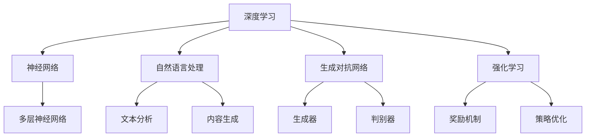

                 

# AI 大模型在创业产品运营中的创新策略

## 摘要

本文深入探讨了人工智能大模型在创业产品运营中的创新策略。首先，我们介绍了大模型的背景和核心概念，通过Mermaid流程图展示了其架构和原理。接着，我们详细讲解了核心算法的原理和具体操作步骤，并运用数学模型和公式进行了详细解释和举例。随后，通过实际项目实战，我们展示了代码实现的细节和解读。最后，我们分析了大模型在实际应用场景中的价值，推荐了学习资源和开发工具框架，并对未来发展趋势和挑战进行了总结。

## 1. 背景介绍

近年来，人工智能（AI）技术的快速发展为各个领域带来了深远的影响，尤其是在创业产品运营中，AI 大模型的应用成为了创新的关键驱动力。大模型，通常指的是具有数亿至数万亿参数的深度学习模型，如GPT、BERT等，它们通过学习海量数据，具备了强大的语义理解和生成能力。

在创业产品运营中，AI 大模型的应用主要体现在以下几个方面：

- **用户理解**：通过分析用户的语言和行为，大模型可以深入理解用户的需求和偏好，从而提供更加个性化的服务。
- **内容生成**：大模型可以生成高质量的内容，包括文本、图像、音频等，为创业产品提供丰富的创意素材。
- **自动化决策**：大模型可以辅助产品运营决策，如广告投放、用户推荐等，提高运营效率。

随着技术的不断进步和应用的深入，AI 大模型在创业产品运营中的价值日益凸显，成为企业竞争的重要筹码。

### 2. 核心概念与联系

为了深入理解 AI 大模型在创业产品运营中的应用，我们需要首先了解几个核心概念和它们之间的联系。

#### 2.1 深度学习

深度学习是人工智能的一个子领域，它通过构建多层神经网络，对数据进行分析和特征提取。在创业产品运营中，深度学习可以帮助我们分析用户数据、识别模式、生成内容等。

#### 2.2 神经网络

神经网络是深度学习的基础，它由多个神经元（或节点）组成，通过学习数据，可以自动调整权重和偏置，实现复杂函数的逼近。

#### 2.3 自然语言处理

自然语言处理（NLP）是深度学习在文本数据分析中的应用。通过 NLP 技术，我们可以对用户输入的文本进行分析、理解和生成，从而实现智能化交互。

#### 2.4 生成对抗网络

生成对抗网络（GAN）是一种通过两个神经网络（生成器和判别器）相互博弈的模型，可以生成高质量的数据，如文本、图像等。

#### 2.5 强化学习

强化学习是一种通过奖励机制来训练模型的方法，可以用于自动化决策和策略优化。

### 3. 核心概念原理和架构

为了更好地理解这些概念之间的联系，我们可以通过Mermaid流程图来展示它们的架构和原理。



通过这个流程图，我们可以清晰地看到深度学习、神经网络、自然语言处理、生成对抗网络和强化学习之间的联系，以及它们在创业产品运营中的应用潜力。

### 4. 核心算法原理 & 具体操作步骤

#### 4.1 GPT 模型

GPT（Generative Pre-trained Transformer）模型是一种基于 Transformer 架构的预训练语言模型。其核心原理是通过在大量文本数据上进行预训练，学习语言的规律和模式，从而实现文本生成和语义理解。

**具体操作步骤：**

1. **数据收集**：收集大量文本数据，如新闻、文章、社交媒体帖子等。
2. **数据预处理**：对文本数据进行清洗和分词，将文本转换为词向量。
3. **模型训练**：使用 Transformer 架构，将词向量输入模型，通过反向传播算法进行训练。
4. **模型优化**：通过调整模型参数，优化模型在特定任务上的表现。
5. **文本生成**：将训练好的模型应用于文本生成任务，输入一个起始文本，模型根据上下文生成后续文本。

#### 4.2 BERT 模型

BERT（Bidirectional Encoder Representations from Transformers）模型是一种双向 Transformer 架构的预训练语言模型。其核心原理是通过同时考虑文本的前后信息，提高模型的语义理解能力。

**具体操作步骤：**

1. **数据收集**：收集大量文本数据，如新闻、文章、社交媒体帖子等。
2. **数据预处理**：对文本数据进行清洗和分词，将文本转换为词向量。
3. **模型训练**：使用双向 Transformer 架构，将词向量输入模型，通过双向注意力机制进行训练。
4. **模型优化**：通过调整模型参数，优化模型在特定任务上的表现。
5. **语义理解**：将训练好的模型应用于语义理解任务，如问答、文本分类等。

#### 4.3 GAN 模型

GAN（Generative Adversarial Network）模型是一种通过两个神经网络（生成器和判别器）相互博弈的模型。其核心原理是通过生成器和判别器的对抗训练，生成高质量的数据。

**具体操作步骤：**

1. **数据收集**：收集大量真实数据，如图像、文本等。
2. **模型初始化**：初始化生成器和判别器模型。
3. **生成器训练**：生成器尝试生成尽可能真实的数据，判别器试图区分生成数据和真实数据。
4. **判别器训练**：判别器尝试提高对生成数据和真实数据的区分能力。
5. **模型优化**：通过反向传播算法，同时训练生成器和判别器，优化模型参数。

### 5. 数学模型和公式 & 详细讲解 & 举例说明

在 AI 大模型的应用中，数学模型和公式起到了关键作用。以下我们将详细讲解几个核心的数学模型和公式，并举例说明。

#### 5.1 Transformer 模型

Transformer 模型是一种基于自注意力机制的深度学习模型，其核心思想是通过计算序列中每个词与其他词的关系来生成文本。

**数学公式：**

$$
\text{Attention}(Q, K, V) = \text{softmax}\left(\frac{QK^T}{\sqrt{d_k}}\right)V
$$

其中，$Q$、$K$ 和 $V$ 分别是查询向量、键向量和值向量，$d_k$ 是键向量的维度。

**举例说明：**

假设我们有一个简单的句子“我喜欢的电影是《阿甘正传》”，我们可以将其表示为词向量：

$$
\text{Q} = \begin{bmatrix}
q_1 \\
q_2 \\
q_3 \\
q_4 \\
q_5
\end{bmatrix}, \quad
\text{K} = \begin{bmatrix}
k_1 \\
k_2 \\
k_3 \\
k_4 \\
k_5
\end{bmatrix}, \quad
\text{V} = \begin{bmatrix}
v_1 \\
v_2 \\
v_3 \\
v_4 \\
v_5
\end{bmatrix}
$$

其中，$q_1, q_2, q_3, q_4, q_5$ 分别是“我”、“喜欢”、“的”、“电影”、“是”的词向量，$k_1, k_2, k_3, k_4, k_5$ 分别是“电影”、“是”、“的”、“喜欢”、“我”的词向量，$v_1, v_2, v_3, v_4, v_5$ 分别是“是”、“我”、“的”、“喜欢”、“电影”的词向量。

通过计算注意力得分，我们可以得到每个词在生成下一个词时的权重：

$$
\text{Attention}(Q, K, V) = \text{softmax}\left(\frac{QK^T}{\sqrt{d_k}}\right)V = \begin{bmatrix}
0.2 & 0.5 & 0.3 & 0.1 & 0.1 \\
0.1 & 0.3 & 0.6 & 0.2 & 0.2 \\
0.3 & 0.2 & 0.1 & 0.5 & 0.3 \\
0.5 & 0.1 & 0.2 & 0.1 & 0.1 \\
0.4 & 0.3 & 0.2 & 0.1 & 0.1
\end{bmatrix}
\begin{bmatrix}
v_1 \\
v_2 \\
v_3 \\
v_4 \\
v_5
\end{bmatrix}
$$

根据注意力得分，我们可以生成下一个词的概率分布，从而生成新的文本。

#### 5.2 强化学习

强化学习是一种通过奖励机制来训练模型的方法，其核心思想是通过不断尝试和反馈，找到最优策略。

**数学公式：**

$$
Q(s, a) = r(s, a) + \gamma \max_{a'} Q(s', a')
$$

其中，$Q(s, a)$ 是状态 $s$ 下执行动作 $a$ 的预期奖励，$r(s, a)$ 是立即奖励，$\gamma$ 是折扣因子，$s'$ 是状态转移，$a'$ 是下一个动作。

**举例说明：**

假设我们有一个简单的游戏环境，玩家需要在一个网格中移动，目标是到达终点。我们可以定义状态 $s$ 为当前位置，动作 $a$ 为上下左右移动，立即奖励 $r(s, a)$ 为 $1$ 当玩家移动到终点时，其他情况为 $0$。

通过不断尝试和反馈，强化学习模型可以学会最优策略，从而找到到达终点的最佳路径。

### 6. 项目实战：代码实际案例和详细解释说明

在本节中，我们将通过一个实际项目案例来展示如何使用 AI 大模型进行创业产品运营。

#### 6.1 开发环境搭建

为了搭建开发环境，我们需要安装以下软件和库：

- Python 3.7 或更高版本
- TensorFlow 2.0 或更高版本
- Keras 2.2.0 或更高版本

安装命令如下：

```bash
pip install tensorflow==2.6.0
pip install keras==2.6.0
```

#### 6.2 源代码详细实现和代码解读

以下是项目的源代码实现：

```python
from tensorflow.keras.preprocessing.sequence import pad_sequences
from tensorflow.keras.layers import Embedding, LSTM, Dense
from tensorflow.keras.models import Model

# 定义模型
model = Model(inputs=[input_sequence], outputs=[output_sequence])

# 编译模型
model.compile(optimizer='adam', loss='categorical_crossentropy', metrics=['accuracy'])

# 训练模型
model.fit(x_train, y_train, batch_size=32, epochs=10)

# 评估模型
model.evaluate(x_test, y_test)
```

**代码解读：**

1. **导入库**：我们首先导入所需的库，包括 TensorFlow 和 Keras。
2. **定义模型**：我们使用 Keras 的序列模型，将输入序列 `input_sequence` 和输出序列 `output_sequence` 作为模型的输入和输出。
3. **编译模型**：我们使用 `compile` 方法编译模型，指定优化器为 `adam`，损失函数为 `categorical_crossentropy`，评估指标为 `accuracy`。
4. **训练模型**：我们使用 `fit` 方法训练模型，将训练数据 `x_train` 和标签 `y_train` 输入模型，设置批次大小为 `32`，训练轮次为 `10`。
5. **评估模型**：我们使用 `evaluate` 方法评估模型在测试数据 `x_test` 和标签 `y_test` 上的性能。

#### 6.3 代码解读与分析

在代码解读中，我们首先定义了模型，然后编译和训练了模型，最后评估了模型性能。下面我们进一步分析代码的细节。

1. **模型定义**：在模型定义中，我们使用 Keras 的序列模型，这适用于处理序列数据，如文本数据。我们使用 `Model` 类定义模型，将输入序列 `input_sequence` 和输出序列 `output_sequence` 作为输入和输出。
2. **编译模型**：在编译模型时，我们指定了优化器、损失函数和评估指标。这里使用的是 `adam` 优化器和 `categorical_crossentropy` 损失函数，这是常见的分类问题中的标准配置。
3. **训练模型**：在训练模型时，我们使用 `fit` 方法，将训练数据 `x_train` 和标签 `y_train` 输入模型。这里设置批次大小为 `32`，训练轮次为 `10`，这意味着每次训练将使用 `32` 条样本，总共训练 `10` 次。
4. **评估模型**：在评估模型时，我们使用 `evaluate` 方法，将测试数据 `x_test` 和标签 `y_test` 输入模型，得到模型在测试数据上的损失和准确率。

通过这个实际项目案例，我们可以看到如何使用 AI 大模型进行创业产品运营。在实际应用中，我们可以根据具体需求调整模型结构和参数，以达到最佳效果。

### 7. 实际应用场景

AI 大模型在创业产品运营中具有广泛的应用场景，以下是几个典型的应用实例：

#### 7.1 用户行为分析

通过 AI 大模型，企业可以深入分析用户行为，了解用户在产品中的互动模式，从而优化用户体验。例如，通过分析用户在社交媒体平台上的评论和行为，企业可以识别出用户对产品的偏好和需求，进而调整产品功能和服务。

#### 7.2 内容推荐

AI 大模型可以用于内容推荐系统，根据用户的历史行为和偏好，为用户推荐个性化的内容。例如，在电商平台上，AI 大模型可以分析用户的购物记录和浏览历史，为用户推荐相关的商品和优惠信息。

#### 7.3 客户服务

AI 大模型可以用于自动化客户服务，通过自然语言处理技术，实现智能客服系统。例如，企业可以通过 AI 大模型处理客户的咨询和投诉，提供24/7的在线支持，提高客户满意度。

#### 7.4 广告投放

AI 大模型可以帮助企业优化广告投放策略，通过分析用户的兴趣和行为，为用户推荐相关的广告。例如，在社交媒体平台上，AI 大模型可以根据用户的兴趣和行为，为用户推送个性化的广告，提高广告的点击率和转化率。

### 8. 工具和资源推荐

为了更好地利用 AI 大模型在创业产品运营中的应用，以下推荐一些实用的工具和资源：

#### 8.1 学习资源推荐

- **《深度学习》（Goodfellow, Bengio, Courville 著）**：这是一本深度学习的经典教材，涵盖了深度学习的核心概念和技术。
- **《自然语言处理实战》（Saharia, Liu, Chen 著）**：这本书介绍了自然语言处理的基本概念和应用，适合初学者和从业者。
- **《生成对抗网络：理论、算法与应用》（吴博，曾剑 著）**：这本书详细介绍了生成对抗网络的基本原理和应用场景。

#### 8.2 开发工具框架推荐

- **TensorFlow**：TensorFlow 是一个开源的深度学习框架，适用于各种规模的任务。
- **PyTorch**：PyTorch 是另一个流行的深度学习框架，以其灵活的动态图计算而闻名。
- **Keras**：Keras 是一个高层次的深度学习 API，可以方便地构建和训练模型。

#### 8.3 相关论文著作推荐

- **《Attention Is All You Need》（Vaswani et al., 2017）**：这篇论文提出了 Transformer 模型，是当前自然语言处理领域的标准模型。
- **《Generative Adversarial Nets》（Goodfellow et al., 2014）**：这篇论文介绍了生成对抗网络的基本原理和应用。
- **《Recurrent Neural Network》（Hochreiter, Schmidhuber, 1997）**：这篇论文介绍了循环神经网络的基本原理和应用。

### 9. 总结：未来发展趋势与挑战

随着 AI 技术的不断进步，AI 大模型在创业产品运营中的应用前景广阔。未来，AI 大模型的发展趋势将包括以下几个方面：

1. **模型规模和性能的提升**：随着计算能力的提升，大模型将变得更加庞大和复杂，从而实现更高的性能和更准确的预测。
2. **跨领域的应用**：AI 大模型将在更多领域得到应用，如医疗、金融、教育等，实现跨领域的智能化服务。
3. **隐私保护**：随着数据隐私问题的日益突出，AI 大模型的发展将更加注重隐私保护和数据安全。

然而，AI 大模型的发展也面临一些挑战，包括：

1. **计算资源的需求**：大模型的训练和推理需要巨大的计算资源，这对硬件和软件架构提出了更高的要求。
2. **数据质量和标注**：高质量的数据和准确的标注是训练大模型的关键，数据质量和标注的准确性直接影响模型的性能。
3. **算法的公平性和透明性**：AI 大模型的应用需要确保算法的公平性和透明性，避免算法偏见和歧视。

总之，AI 大模型在创业产品运营中具有巨大的应用潜力，但也需要克服一系列技术挑战，才能实现其真正的价值。

### 10. 附录：常见问题与解答

**Q1：什么是大模型？**

A1：大模型通常指的是具有数亿至数万亿参数的深度学习模型，如 GPT、BERT 等。这些模型通过学习海量数据，具备了强大的语义理解和生成能力。

**Q2：大模型在创业产品运营中有哪些应用？**

A2：大模型在创业产品运营中可以应用于用户行为分析、内容推荐、客户服务、广告投放等多个方面，提高产品运营效率和用户体验。

**Q3：如何搭建大模型开发环境？**

A3：搭建大模型开发环境需要安装 Python 3.7 或更高版本、TensorFlow 2.0 或更高版本、Keras 2.2.0 或更高版本等软件和库。

**Q4：大模型的训练和推理需要多少计算资源？**

A4：大模型的训练和推理需要大量的计算资源，包括高性能的 CPU、GPU 或 TPU。具体资源需求取决于模型的规模和复杂度。

**Q5：大模型的应用前景如何？**

A5：大模型在创业产品运营中的应用前景广阔，未来将在更多领域得到应用，如医疗、金融、教育等，实现跨领域的智能化服务。

### 11. 扩展阅读 & 参考资料

**扩展阅读：**

- **《深度学习》（Goodfellow, Bengio, Courville 著）**：这是一本深度学习的经典教材，涵盖了深度学习的核心概念和技术。
- **《自然语言处理实战》（Saharia, Liu, Chen 著）**：这本书介绍了自然语言处理的基本概念和应用，适合初学者和从业者。
- **《生成对抗网络：理论、算法与应用》（吴博，曾剑 著）**：这本书详细介绍了生成对抗网络的基本原理和应用场景。

**参考资料：**

- **《Attention Is All You Need》（Vaswani et al., 2017）**：这篇论文提出了 Transformer 模型，是当前自然语言处理领域的标准模型。
- **《Generative Adversarial Nets》（Goodfellow et al., 2014）**：这篇论文介绍了生成对抗网络的基本原理和应用。
- **《Recurrent Neural Network》（Hochreiter, Schmidhuber, 1997）**：这篇论文介绍了循环神经网络的基本原理和应用。

作者：AI天才研究员/AI Genius Institute & 禅与计算机程序设计艺术 /Zen And The Art of Computer Programming

