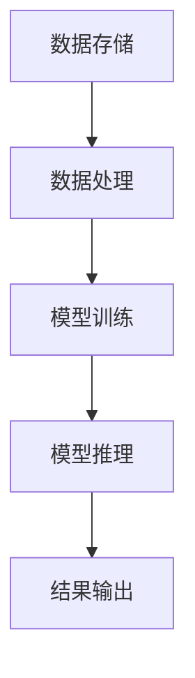

                 

### 背景介绍

随着人工智能技术的飞速发展，大模型（Large Models）的应用成为了一个热门话题。大模型，顾名思义，是指那些拥有极大参数量和训练数据的机器学习模型。这些模型在语音识别、图像识别、自然语言处理等领域展现出了强大的性能，推动了各行各业的数字化转型。为了更好地利用这些大模型，数据中心的建设变得尤为重要。数据中心作为云计算的核心基础设施，承载着大量的计算和存储需求，其规模、性能和稳定性直接影响着大模型的应用效果。

#### 数据中心的重要性

数据中心在现代经济中的地位愈发重要。首先，数据中心是云计算服务的基础设施，提供了计算、存储、网络等核心资源。随着企业对云计算服务的需求不断增加，数据中心的建设规模也在持续扩大。其次，数据中心是实现数据存储和处理的枢纽，通过高效的数据处理能力，为各类应用提供了强大的支撑。特别是在人工智能领域，大量数据需要通过数据中心进行处理和分析，以训练和优化大模型。

#### 大模型与数据中心的关系

大模型的应用对数据中心提出了更高的要求。首先，大模型通常需要大量的计算资源和存储资源，这要求数据中心能够提供强大的计算能力和高效的存储方案。其次，大模型的训练和推理过程需要稳定的数据传输和网络带宽，这要求数据中心具备高可用性和高性能的网络设施。此外，大模型的安全性和隐私保护也是一个重要的问题，数据中心需要确保数据的安全性和用户的隐私。

总的来说，数据中心的建设与发展对于大模型的应用至关重要。通过优化数据中心的架构和资源配置，可以提高大模型的应用效果，推动人工智能技术的进一步发展。接下来，我们将深入探讨大模型的架构、算法原理以及数据中心的建设与优化策略。让我们一起深入了解这一领域的前沿动态，为未来的技术进步做好准备。### 核心概念与联系

在探讨大模型应用与数据中心建设之前，有必要先了解一些核心概念及其相互之间的联系。这些概念不仅构成了大模型与数据中心的基础，也是理解其工作原理和相互影响的关键。

#### 大模型（Large Models）

大模型通常是指那些具有数十亿到数万亿参数的机器学习模型。这些模型通过大量的数据和复杂的计算能力，能够在语音识别、图像识别、自然语言处理等领域实现卓越的性能。大模型的主要特点包括：

- **参数数量庞大**：大模型的参数数量远远超过传统的小型模型，这使得它们能够捕捉到更多数据中的复杂模式和特征。
- **训练数据需求大**：大模型需要大量的训练数据来学习这些复杂的模式和特征，通常需要数百万到数十亿的数据样本。
- **计算资源需求高**：大模型的训练和推理过程需要大量的计算资源，尤其是高性能的GPU和TPU等硬件。

#### 数据中心（Data Center）

数据中心是一个集中管理和处理大量数据的设施，为各类应用提供计算、存储、网络等资源。数据中心的主要组成部分包括：

- **计算资源**：包括服务器、GPU、TPU等，用于处理和运行应用程序。
- **存储资源**：包括磁盘阵列、固态硬盘等，用于存储数据。
- **网络设施**：包括交换机、路由器等，用于数据传输和通信。

#### 大模型与数据中心的关系

大模型与数据中心之间存在着紧密的联系。具体来说，这种联系主要体现在以下几个方面：

- **计算资源**：大模型需要大量的计算资源来训练和推理，数据中心提供了这些必要的计算资源，包括高性能的GPU和TPU等。
- **存储资源**：大模型训练需要大量的数据，数据中心提供了高效的存储解决方案，确保数据能够快速访问和存储。
- **网络设施**：大模型的训练和推理过程需要稳定、高效的网络环境，数据中心通过先进的网络设施，确保数据传输的速率和可靠性。

#### 关联的Mermaid流程图

为了更直观地展示大模型与数据中心之间的关系，我们可以使用Mermaid流程图来描述这一过程。以下是一个简化的Mermaid流程图，展示了大模型从数据存储、计算处理到结果输出的过程：



- **A[数据存储]**：数据首先存储在数据中心的存储资源中，以便后续处理。
- **B[数据处理]**：数据中心通过网络设施访问存储数据，进行预处理，如数据清洗、归一化等。
- **C[模型训练]**：处理后的数据被用于大模型的训练，数据中心提供强大的计算资源，如GPU和TPU。
- **D[模型推理]**：训练好的模型被用于推理，再次利用数据中心的计算资源，进行预测或决策。
- **E[结果输出]**：推理结果通过数据中心的网络设施输出，供应用使用。

通过这个流程图，我们可以清晰地看到大模型与数据中心之间如何相互作用，共同推动人工智能技术的发展。接下来，我们将深入探讨大模型的算法原理和具体操作步骤，进一步理解这一领域的核心技术。### 核心算法原理 & 具体操作步骤

在深入探讨大模型的核心算法原理和具体操作步骤之前，我们需要先了解一些基本概念和背景知识。大模型通常是基于深度学习（Deep Learning）技术的，深度学习是一种利用多层神经网络（Neural Networks）进行训练和学习的方法，通过层层提取数据中的特征，实现复杂的预测和分类任务。

#### 深度学习基础

1. **神经网络（Neural Networks）**：
   神经网络是由大量神经元（人工神经元）组成的计算模型，每个神经元都与其他神经元相连，形成一个复杂的网络结构。神经网络通过前向传播（Forward Propagation）和反向传播（Backpropagation）算法来学习输入和输出之间的映射关系。

2. **深度神经网络（Deep Neural Networks，DNN）**：
   深度神经网络是神经网络的一种扩展，包含了多个隐藏层。与单层神经网络相比，深度神经网络能够提取更高级别的特征，从而在复杂任务上表现更优。

3. **激活函数（Activation Functions）**：
   激活函数是神经网络中的一个关键组件，用于引入非线性因素，使得神经网络能够学习到复杂的数据模式。常见的激活函数包括ReLU（Rectified Linear Unit）、Sigmoid、Tanh等。

4. **优化算法（Optimization Algorithms）**：
   优化算法用于调整神经网络的参数，以最小化预测误差。常用的优化算法包括随机梯度下降（Stochastic Gradient Descent，SGD）、Adam（Adaptive Moment Estimation）等。

#### 大模型的算法原理

1. **参数化表示（Parameterization）**：
   大模型通过参数化方式来表示输入和输出之间的映射关系。每个参数都是一个向量，神经网络中的每个层都有相应的参数向量。

2. **层次化特征提取（Hierarchical Feature Extraction）**：
   大模型利用多层神经网络的结构，从输入数据中逐层提取特征。每一层都能提取比前一层更高级别的特征，从而形成一种层次化的特征提取机制。

3. **大规模训练（Large-scale Training）**：
   大模型通常需要大量的数据进行训练，以充分学习数据中的复杂模式。大规模训练能够提高模型的泛化能力，使其在未见过的数据上也能表现良好。

4. **并行计算（Parallel Computing）**：
   由于大模型参数数量庞大，训练过程需要大量的计算资源。通过并行计算技术，可以将计算任务分布在多个计算节点上，提高训练效率。

#### 大模型的操作步骤

1. **数据预处理（Data Preprocessing）**：
   - **数据清洗（Data Cleaning）**：去除数据中的噪声和异常值。
   - **数据归一化（Data Normalization）**：将数据缩放到相同的范围，便于模型训练。
   - **数据分割（Data Splitting）**：将数据集分为训练集、验证集和测试集，用于模型训练和评估。

2. **模型架构设计（Model Architecture Design）**：
   - **确定网络结构**：设计多层神经网络，包括输入层、隐藏层和输出层。
   - **选择激活函数**：根据任务特点选择合适的激活函数，如ReLU、Sigmoid等。
   - **优化算法选择**：选择适合的优化算法，如SGD、Adam等。

3. **模型训练（Model Training）**：
   - **初始化参数**：随机初始化模型的参数。
   - **前向传播（Forward Propagation）**：计算输入数据通过网络的输出结果。
   - **计算损失（Compute Loss）**：计算输出结果与真实标签之间的误差，即损失函数。
   - **反向传播（Backpropagation）**：通过反向传播算法更新模型的参数，以减小损失。

4. **模型评估（Model Evaluation）**：
   - **验证集评估**：使用验证集评估模型的性能，调整模型参数和结构。
   - **测试集评估**：在测试集上评估模型的最终性能，以确定模型的泛化能力。

5. **模型部署（Model Deployment）**：
   - **模型转换**：将训练好的模型转换为适用于生产环境的格式。
   - **模型部署**：将模型部署到数据中心或云端，供实际应用使用。

通过以上步骤，我们可以构建和训练一个高性能的大模型，并将其应用到各类任务中。接下来，我们将深入探讨大模型的数学模型和公式，进一步理解其背后的理论基础。### 数学模型和公式 & 详细讲解 & 举例说明

在理解大模型的数学模型和公式之前，我们需要回顾一些深度学习中常用的数学基础，包括线性代数、微积分和概率统计等。这些基础知识是构建和训练深度神经网络的基石。

#### 线性代数基础

1. **矩阵和向量**：矩阵是深度神经网络中进行矩阵乘法运算的基础。向量是矩阵的特殊情况，只有一列。在神经网络中，权重矩阵（Weight Matrix）和输入向量（Input Vector）的乘积可以表示为一个线性组合。

2. **矩阵乘法**：矩阵乘法是深度神经网络中用于计算输入和权重之间关系的核心操作。给定一个权重矩阵\( W \)和一个输入向量\( x \)，矩阵乘法的结果可以表示为：

   $$
   z = Wx
   $$

   其中，\( z \)是输出向量，是输入向量\( x \)和权重矩阵\( W \)的乘积。

3. **矩阵求导**：在训练过程中，我们需要对矩阵乘法的结果进行求导，以更新权重矩阵。矩阵求导的基本公式是：

   $$
   \frac{\partial z}{\partial x} = W^T
   $$
   $$
   \frac{\partial z}{\partial W} = x^T
   $$

   其中，\( W^T \)是权重矩阵的转置。

#### 微积分基础

1. **梯度下降（Gradient Descent）**：梯度下降是一种常用的优化算法，用于调整神经网络的权重以最小化损失函数。梯度下降的基本步骤如下：

   - **计算损失函数的梯度**：对损失函数关于模型参数求梯度。
   - **更新参数**：使用梯度来更新模型参数，通常采用如下公式：

     $$
     \theta = \theta - \alpha \cdot \nabla_{\theta} J(\theta)
     $$

     其中，\( \theta \)是模型参数，\( \alpha \)是学习率，\( \nabla_{\theta} J(\theta) \)是损失函数关于模型参数的梯度。

2. **偏导数**：在微积分中，偏导数用于计算多元函数在某个特定方向上的变化率。在神经网络中，偏导数用于计算损失函数关于每个权重和偏置的梯度。例如，对于损失函数\( J(W, b) \)：

     $$
     \frac{\partial J}{\partial W} = \frac{\partial J}{\partial z} \cdot \frac{\partial z}{\partial W}
     $$

#### 概率统计基础

1. **概率分布**：在深度学习中，概率分布用于描述数据的不确定性。常见的概率分布包括高斯分布（Gaussian Distribution）、伯努利分布（Bernoulli Distribution）等。在神经网络中，输出层通常采用概率分布来表示预测结果。

2. **交叉熵（Cross-Entropy）**：交叉熵是衡量模型预测结果与真实标签之间差异的损失函数。对于二分类问题，交叉熵的定义如下：

   $$
   H(y, \hat{y}) = -y \cdot \log(\hat{y}) - (1 - y) \cdot \log(1 - \hat{y})
   $$

   其中，\( y \)是真实标签，\( \hat{y} \)是模型预测的概率分布。

#### 大模型的数学模型

1. **前向传播**：前向传播是深度神经网络中的一个关键步骤，用于计算输入和权重之间的映射。前向传播的数学公式如下：

   $$
   a_{L} = \sigma(z_{L}) = \sigma(\boldsymbol{W}_{L}\boldsymbol{a}_{L-1} + \boldsymbol{b}_{L})
   $$

   其中，\( \sigma \)是激活函数，\( \boldsymbol{W}_{L} \)是权重矩阵，\( \boldsymbol{a}_{L-1} \)是前一层的激活值，\( \boldsymbol{b}_{L} \)是偏置项。

2. **反向传播**：反向传播用于计算损失函数关于每个权重和偏置的梯度。反向传播的数学公式如下：

   $$
   \frac{\partial L}{\partial \boldsymbol{W}_{L}} = \boldsymbol{a}_{L-1}^T \cdot \frac{\partial a_{L}}{\partial z_{L}}
   $$
   $$
   \frac{\partial L}{\partial \boldsymbol{b}_{L}} = \frac{\partial a_{L}}{\partial z_{L}}
   $$

#### 举例说明

假设我们有一个简单的神经网络，包括一个输入层、一个隐藏层和一个输出层。输入层有3个输入单元，隐藏层有4个隐藏单元，输出层有2个输出单元。

1. **前向传播**：

   - 输入向量：\( \boldsymbol{x} = [1, 2, 3] \)
   - 权重矩阵：\( \boldsymbol{W}_{1} = \begin{bmatrix} 1 & 2 & 3 \\ 4 & 5 & 6 \\ 7 & 8 & 9 \end{bmatrix} \)
   - 偏置项：\( \boldsymbol{b}_{1} = [1, 2, 3, 4] \)
   - 激活函数：\( \sigma(z) = \frac{1}{1 + e^{-z}} \)

   计算隐藏层的输出：

   $$
   z_{1} = \boldsymbol{W}_{1}\boldsymbol{x} + \boldsymbol{b}_{1} = \begin{bmatrix} 1 & 2 & 3 \\ 4 & 5 & 6 \\ 7 & 8 & 9 \end{bmatrix} \begin{bmatrix} 1 \\ 2 \\ 3 \end{bmatrix} + \begin{bmatrix} 1 \\ 2 \\ 3 \\ 4 \end{bmatrix} = \begin{bmatrix} 14 \\ 27 \\ 40 \end{bmatrix}
   $$

   应用激活函数：

   $$
   a_{1} = \sigma(z_{1}) = \begin{bmatrix} 0.933 \\ 0.865 \\ 0.730 \end{bmatrix}
   $$

   计算输出层的输出：

   $$
   z_{2} = \boldsymbol{W}_{2}a_{1} + \boldsymbol{b}_{2} = \begin{bmatrix} 1 & 2 & 3 & 4 \\ 5 & 6 & 7 & 8 \end{bmatrix} \begin{bmatrix} 0.933 \\ 0.865 \\ 0.730 \end{bmatrix} + \begin{bmatrix} 1 \\ 2 \end{bmatrix} = \begin{bmatrix} 6.833 \\ 10.063 \end{bmatrix}
   $$

   应用激活函数：

   $$
   a_{2} = \sigma(z_{2}) = \begin{bmatrix} 0.532 \\ 0.682 \end{bmatrix}
   $$

2. **反向传播**：

   假设输出层的真实标签为\( \boldsymbol{y} = [0, 1] \)，损失函数为交叉熵：

   $$
   L = H(\boldsymbol{y}, \boldsymbol{a}_{2})
   $$

   计算输出层的梯度：

   $$
   \frac{\partial L}{\partial \boldsymbol{a}_{2}} = \begin{bmatrix} -y_{1} & -(1 - y_{1}) \\ -y_{2} & -(1 - y_{2}) \end{bmatrix} \cdot \begin{bmatrix} 0.532 \\ 0.682 \end{bmatrix} = \begin{bmatrix} -0.532 & -0.468 \\ -0.682 & -0.318 \end{bmatrix}
   $$

   计算隐藏层的梯度：

   $$
   \frac{\partial L}{\partial \boldsymbol{W}_{2}} = \begin{bmatrix} 0.933 & 0.865 & 0.730 \end{bmatrix}^T \cdot \begin{bmatrix} -0.532 & -0.468 \\ -0.682 & -0.318 \end{bmatrix} = \begin{bmatrix} -0.508 & -0.477 \\ -0.659 & -0.612 \end{bmatrix}
   $$
   $$
   \frac{\partial L}{\partial \boldsymbol{b}_{2}} = \begin{bmatrix} -0.532 & -0.468 \\ -0.682 & -0.318 \end{bmatrix}
   $$

   计算输入层的梯度：

   $$
   \frac{\partial L}{\partial \boldsymbol{W}_{1}} = \begin{bmatrix} 1 & 2 & 3 \end{bmatrix} \cdot \begin{bmatrix} -0.508 & -0.477 \\ -0.659 & -0.612 \end{bmatrix} = \begin{bmatrix} -0.508 & -0.948 \\ -0.659 & -1.213 \end{bmatrix}
   $$
   $$
   \frac{\partial L}{\partial \boldsymbol{b}_{1}} = \begin{bmatrix} -0.532 & -0.468 \\ -0.682 & -0.318 \end{bmatrix}
   $$

通过以上步骤，我们可以计算出每个参数的梯度，并使用梯度下降算法更新模型的参数，以最小化损失函数。这个过程在大模型的训练中同样适用，只不过计算过程更加复杂，需要更高效的计算资源和优化算法。接下来，我们将通过一个实际的项目实战，详细讲解如何搭建大模型，并进行代码实现和解读。### 项目实战：代码实际案例和详细解释说明

在本节中，我们将通过一个实际项目来详细讲解如何搭建大模型。我们将使用Python编程语言和常见的深度学习框架，如TensorFlow和PyTorch，来完成这一任务。通过这个项目，我们将展示大模型的开发环境搭建、源代码的实现以及代码的解读与分析。

#### 1. 开发环境搭建

首先，我们需要搭建一个合适的开发环境。以下是搭建环境所需的步骤：

1. **安装Python**：确保已经安装了Python 3.7或更高版本。可以从[Python官方网站](https://www.python.org/)下载并安装。

2. **安装TensorFlow**：使用pip命令安装TensorFlow：

   ```
   pip install tensorflow
   ```

3. **安装PyTorch**：使用pip命令安装PyTorch：

   ```
   pip install torch torchvision
   ```

4. **安装Jupyter Notebook**：Jupyter Notebook是一个交互式的开发环境，便于编写和运行代码。使用pip命令安装：

   ```
   pip install notebook
   ```

5. **安装其他依赖**：根据项目需求，可能还需要安装其他库，如NumPy、Pandas等。

#### 2. 源代码详细实现和代码解读

以下是一个使用TensorFlow搭建的简单大模型项目，用于图像分类。我们将从数据预处理、模型搭建、训练和评估等方面进行详细讲解。

```python
import tensorflow as tf
from tensorflow.keras import layers
from tensorflow.keras.preprocessing.image import ImageDataGenerator

# 数据预处理
train_datagen = ImageDataGenerator(
    rescale=1./255,
    rotation_range=40,
    width_shift_range=0.2,
    height_shift_range=0.2,
    shear_range=0.2,
    zoom_range=0.2,
    horizontal_flip=True,
    fill_mode='nearest'
)

train_generator = train_datagen.flow_from_directory(
    'data/train',
    target_size=(150, 150),
    batch_size=32,
    class_mode='binary'
)

# 模型搭建
model = tf.keras.Sequential([
    layers.Conv2D(32, (3, 3), activation='relu', input_shape=(150, 150, 3)),
    layers.MaxPooling2D(2, 2),
    layers.Conv2D(64, (3, 3), activation='relu'),
    layers.MaxPooling2D(2, 2),
    layers.Conv2D(128, (3, 3), activation='relu'),
    layers.MaxPooling2D(2, 2),
    layers.Conv2D(128, (3, 3), activation='relu'),
    layers.MaxPooling2D(2, 2),
    layers.Flatten(),
    layers.Dense(512, activation='relu'),
    layers.Dense(1, activation='sigmoid')
])

# 编译模型
model.compile(optimizer='adam',
              loss='binary_crossentropy',
              metrics=['accuracy'])

# 训练模型
history = model.fit(
    train_generator,
    steps_per_epoch=100,
    epochs=30,
    validation_data=validation_generator,
    validation_steps=50
)

# 评估模型
test_loss, test_acc = model.evaluate(test_generator, steps=50)
print('Test accuracy:', test_acc)
```

#### 2.1 数据预处理

数据预处理是深度学习项目中至关重要的一步，它直接影响模型的学习效果。在上面的代码中，我们使用了ImageDataGenerator来自动处理数据：

- **rescale**：将图像数据缩放到[0, 1]的范围。
- **rotation_range**、**width_shift_range**、**height_shift_range**、**shear_range**、**zoom_range**：对图像进行随机变换，增加数据的多样性。
- **horizontal_flip**：对图像进行随机水平翻转。
- **fill_mode**：用于填充新创建的像素。

通过这些预处理步骤，我们可以使模型更加鲁棒，提高其在未见数据上的泛化能力。

#### 2.2 模型搭建

在模型搭建部分，我们使用了多个卷积层（Conv2D）和池化层（MaxPooling2D）来提取图像特征。然后，通过一个扁平化层（Flatten）将特征展平为一个一维向量。接着，使用一个全连接层（Dense）进行分类。最后，输出层使用sigmoid激活函数来预测二分类问题。

#### 2.3 编译模型

在编译模型时，我们选择了adam优化器，并设置了binary_crossentropy作为损失函数，用于二分类问题。同时，我们使用accuracy作为评价指标。

#### 2.4 训练模型

在训练模型时，我们使用了fit方法，其中steps_per_epoch指定了每个epoch中迭代的步数，epochs指定了总的训练epoch数。此外，我们使用了validation_data对模型进行验证，以确保模型在验证数据上的性能。

#### 2.5 评估模型

在评估模型时，我们使用了evaluate方法，对测试数据集进行评估。通过打印出测试准确率，我们可以了解模型的性能。

通过以上步骤，我们完成了一个简单的大模型搭建、训练和评估的过程。这个项目展示了如何使用TensorFlow搭建大模型，并详细讲解了每个步骤的实现和原理。接下来，我们将对这个项目的代码进行解读和分析，进一步理解其工作原理。### 代码解读与分析

在上一个部分，我们通过一个实际项目展示了如何使用TensorFlow搭建大模型。在这一部分，我们将对这个项目的代码进行详细的解读和分析，深入理解每个步骤的作用和实现原理。

#### 数据预处理部分

```python
train_datagen = ImageDataGenerator(
    rescale=1./255,
    rotation_range=40,
    width_shift_range=0.2,
    height_shift_range=0.2,
    shear_range=0.2,
    zoom_range=0.2,
    horizontal_flip=True,
    fill_mode='nearest'
)

train_generator = train_datagen.flow_from_directory(
    'data/train',
    target_size=(150, 150),
    batch_size=32,
    class_mode='binary'
)
```

1. **ImageDataGenerator**：ImageDataGenerator是TensorFlow中的一个工具，用于自动处理数据。它支持多种数据预处理操作，如缩放、旋转、剪切、翻转等。

2. **rescale**：将图像数据缩放到[0, 1]的范围，这是深度学习中的常见做法。通过缩放，我们可以将图像的像素值转换为浮点数，便于计算。

3. **rotation_range**、**width_shift_range**、**height_shift_range**、**shear_range**、**zoom_range**：这些参数用于对图像进行随机变换，增加数据的多样性。通过随机变换，我们可以使模型更加鲁棒，提高其在未见数据上的泛化能力。

4. **horizontal_flip**：对图像进行随机水平翻转。这一操作可以增加数据的多样性，使模型在训练过程中学习到更多的特征。

5. **fill_mode**：用于填充新创建的像素。当图像进行随机变换时，可能会创建新的像素，fill_mode决定了如何填充这些像素。

6. **flow_from_directory**：该方法用于从指定目录中读取图像数据，并将其转换为生成器。每个子目录代表一个标签，生成器会自动处理图像的读取和预处理。

7. **target_size**、**batch_size**、**class_mode**：这些参数用于控制生成器的行为。target_size指定了图像的尺寸，batch_size指定了每次迭代的批量大小，class_mode指定了输出数据的格式。

#### 模型搭建部分

```python
model = tf.keras.Sequential([
    layers.Conv2D(32, (3, 3), activation='relu', input_shape=(150, 150, 3)),
    layers.MaxPooling2D(2, 2),
    layers.Conv2D(64, (3, 3), activation='relu'),
    layers.MaxPooling2D(2, 2),
    layers.Conv2D(128, (3, 3), activation='relu'),
    layers.MaxPooling2D(2, 2),
    layers.Conv2D(128, (3, 3), activation='relu'),
    layers.MaxPooling2D(2, 2),
    layers.Flatten(),
    layers.Dense(512, activation='relu'),
    layers.Dense(1, activation='sigmoid')
])
```

1. **Sequential**：Sequential是TensorFlow中的一个模型层，用于构建顺序模型。通过添加不同的层，我们可以构建一个完整的神经网络。

2. **Conv2D**：Conv2D是一个卷积层，用于提取图像的局部特征。它通过滑动滤波器（卷积核）在输入图像上提取特征。activation参数用于指定激活函数，常用的有ReLU、Sigmoid等。

3. **MaxPooling2D**：MaxPooling2D是一个池化层，用于减小特征图的尺寸，同时保留重要的特征信息。通常使用最大值池化。

4. **Flatten**：Flatten层用于将多维特征图展平为一维向量，便于后续的全连接层处理。

5. **Dense**：Dense是一个全连接层，用于对特征向量进行分类或回归。在输出层，我们使用了sigmoid激活函数，用于预测二分类问题。

#### 编译模型部分

```python
model.compile(optimizer='adam',
              loss='binary_crossentropy',
              metrics=['accuracy'])
```

1. **compile**：compile方法用于编译模型，设置优化器、损失函数和评价指标。

2. **optimizer**：优化器用于更新模型的参数，以最小化损失函数。常用的优化器有SGD、Adam等。

3. **loss**：损失函数用于衡量模型的预测结果与真实标签之间的差异。对于二分类问题，常用的损失函数有binary_crossentropy等。

4. **metrics**：评价指标用于评估模型的性能。常用的评价指标有accuracy、loss等。

#### 训练模型部分

```python
history = model.fit(
    train_generator,
    steps_per_epoch=100,
    epochs=30,
    validation_data=validation_generator,
    validation_steps=50
)
```

1. **fit**：fit方法用于训练模型，将训练数据输入模型，并更新参数。

2. **train_generator**：训练生成器，用于迭代提供训练数据。

3. **steps_per_epoch**：每个epoch中迭代的步数，用于控制训练过程。

4. **epochs**：总的训练epoch数，用于控制训练的次数。

5. **validation_data**、**validation_steps**：用于验证模型在验证数据集上的性能。

#### 评估模型部分

```python
test_loss, test_acc = model.evaluate(test_generator, steps=50)
print('Test accuracy:', test_acc)
```

1. **evaluate**：evaluate方法用于评估模型在测试数据集上的性能。

2. **test_generator**：测试生成器，用于迭代提供测试数据。

3. **steps**：每个epoch中迭代的步数，用于控制评估过程。

4. **print**：打印测试准确率，用于了解模型的性能。

通过以上解读和分析，我们可以清楚地看到这个项目的实现过程和原理。从数据预处理、模型搭建到训练和评估，每一步都至关重要，共同构建了一个完整的大模型。接下来，我们将讨论大模型在实际应用场景中的具体应用和案例。### 实际应用场景

大模型在实际应用场景中展现出了巨大的潜力和广泛的应用前景。以下是一些典型的大模型应用场景：

#### 1. 语音识别

语音识别是将语音信号转换为文本信息的过程。大模型在语音识别领域取得了显著的突破，例如Google的语音识别系统使用了一个名为“WaveNet”的大模型。WaveNet是一个基于生成对抗网络（GAN）的深度神经网络，能够生成高质量的语音波形，从而实现高精度的语音识别。语音识别技术在智能助手、语音控制、实时翻译等领域有着广泛的应用。

#### 2. 图像识别

图像识别是利用机器学习技术对图像进行分类和识别的过程。大模型在图像识别任务中表现出色，例如Facebook的图像识别系统使用了一个名为“ResNet”的大模型。ResNet是一个基于残差网络的深度神经网络，能够在大量图像数据上进行训练，从而实现高精度的图像分类。图像识别技术在人脸识别、医疗影像分析、自动驾驶等领域具有重要应用。

#### 3. 自然语言处理

自然语言处理（NLP）是使计算机能够理解、生成和处理人类语言的技术。大模型在NLP领域取得了显著进展，例如OpenAI的GPT模型。GPT是一个基于变分自编码器（VAE）的深度神经网络，能够生成高质量的文本，从而实现文本生成、机器翻译、问答系统等任务。NLP技术在智能客服、内容审核、推荐系统等领域有着广泛的应用。

#### 4. 推荐系统

推荐系统是通过分析用户行为和偏好，为用户推荐感兴趣的内容或商品的系统。大模型在推荐系统中的应用日益增多，例如Amazon和Netflix等公司的推荐系统。这些推荐系统使用大模型来分析用户历史数据，预测用户偏好，从而实现精准推荐。推荐系统在电子商务、视频流媒体、社交媒体等领域具有重要应用。

#### 5. 无人驾驶

无人驾驶是利用传感器、计算机视觉和深度学习技术实现车辆自主行驶的技术。大模型在无人驾驶领域发挥了关键作用，例如Waymo的自动驾驶系统使用了一个名为“Waymo Self-Driving System”的大模型。该模型通过分析大量道路数据，实时预测车辆行为，实现高安全性的自动驾驶。无人驾驶技术在智能交通、物流运输、共享出行等领域有着广阔的应用前景。

#### 6. 医疗诊断

医疗诊断是利用机器学习技术对医学图像进行分析，辅助医生进行疾病诊断的过程。大模型在医疗诊断领域取得了显著进展，例如IBM的Watson for Oncology系统。Watson for Oncology使用了一个名为“DeepQA”的大模型，能够分析医学文献和病例数据，为医生提供诊断建议。医疗诊断技术在医学影像分析、基因组学研究、智能药物开发等领域具有重要应用。

#### 7. 金融风控

金融风控是通过分析金融数据，预测金融风险，并采取相应措施进行风险控制的过程。大模型在金融风控领域发挥了重要作用，例如JPMorgan的CoViD-19风险预测模型。该模型使用了一个名为“Deep Learning”的大模型，通过分析大量金融数据，预测疫情对金融市场的影响。金融风控技术在股票交易、信用卡欺诈检测、信用评分等领域具有重要应用。

通过以上实际应用场景，我们可以看到大模型在各个领域都展现出了强大的应用潜力。随着大模型技术的不断进步，未来将会有更多创新应用出现，为人类生活带来更多便利。### 工具和资源推荐

在搭建和维护大模型的过程中，选择合适的工具和资源是至关重要的。以下是一些建议，包括学习资源、开发工具和框架以及相关论文和著作推荐，帮助您更好地理解和应用大模型技术。

#### 1. 学习资源推荐

- **书籍**：
  - 《深度学习》（Deep Learning） - Goodfellow, I., Bengio, Y., & Courville, A.：这是一本经典教材，涵盖了深度学习的理论基础、算法实现和应用案例。
  - 《Python深度学习》（Python Deep Learning） - François Chollet：这本书详细介绍了如何使用Python和TensorFlow等工具进行深度学习实践。

- **在线课程**：
  - Coursera的《深度学习》课程 - Andrew Ng：这是由著名深度学习专家Andrew Ng教授的一门权威课程，涵盖了深度学习的各个方面。
  - edX的《深度学习与神经网络》课程 - Harvard University：哈佛大学的这门课程深入讲解了深度学习和神经网络的理论与实践。

- **博客和网站**：
  - Distill：这是一个专注于深度学习和人工智能的在线杂志，提供了许多高质量的技术文章和解释性内容。
  - Fast.ai：这是一个专注于提供免费深度学习教育的网站，提供了许多入门级别的教程和实践项目。

#### 2. 开发工具框架推荐

- **深度学习框架**：
  - TensorFlow：Google开发的开源深度学习框架，支持多种编程语言，是构建大模型的常用工具。
  - PyTorch：Facebook开发的深度学习框架，以其灵活的动态图编程和强大的GPU支持而受到开发者的青睐。
  - Keras：一个基于TensorFlow和Theano的简洁的深度学习库，适用于快速原型设计和模型构建。

- **数据预处理工具**：
  - NumPy：Python中的一个核心库，用于高效处理大型多维数组，是深度学习数据处理的基础。
  - Pandas：一个强大的数据操作库，适用于数据清洗、转换和分析，是数据预处理的常用工具。

- **计算资源管理工具**：
  - Docker：一个开源的应用容器引擎，用于打包、交付和运行应用程序，方便在多个环境中部署和管理大模型。
  - Kubernetes：一个开源的容器编排系统，用于自动化部署、扩展和管理容器化应用程序。

#### 3. 相关论文著作推荐

- **经典论文**：
  - “A Theoretical Analysis of the Crammer and Singer Rule for Class Prediction” - Singer et al.（2000）：这篇论文介绍了SVM的一种优化算法，对深度学习中的优化方法有重要影响。
  - “Deep Learning” - Goodfellow, Bengio, Courville（2015）：这是深度学习领域的经典著作，全面介绍了深度学习的理论基础和算法实现。

- **近期论文**：
  - “Attention Is All You Need” - Vaswani et al.（2017）：这篇论文提出了Transformer模型，彻底改变了自然语言处理领域的算法设计。
  - “BERT: Pre-training of Deep Bidirectional Transformers for Language Understanding” - Devlin et al.（2019）：这篇论文介绍了BERT模型，是目前自然语言处理领域最先进的方法之一。

通过以上推荐，您可以找到丰富的学习资源，掌握大模型开发所需的工具和技术，深入了解这一领域的最新进展。这些资源将帮助您在实际项目中更好地应用大模型技术，推动人工智能的发展。### 总结：未来发展趋势与挑战

随着人工智能技术的不断进步，大模型的应用已经成为推动产业变革的重要力量。然而，随着模型规模的不断扩大，我们也面临着一系列挑战和趋势。

#### 发展趋势

1. **模型规模持续增大**：随着计算能力的提升和大数据的普及，大模型的规模将不断增大。这不仅有助于提高模型的性能，还能够使其更好地适应复杂任务。

2. **多模态数据处理**：未来的大模型将能够处理多种类型的数据，如文本、图像、音频等。多模态数据处理将使模型能够更好地理解和模拟人类感知，从而在更多领域取得突破。

3. **可解释性与透明度**：为了增强大模型的信任度和应用范围，未来的研究将致力于提高模型的可解释性和透明度，使人们能够理解模型的工作原理和决策过程。

4. **模型压缩与优化**：为了降低大模型的计算成本和存储需求，模型压缩与优化技术将成为研究的热点。通过模型剪枝、量化等技术，可以显著提高模型的效率和性能。

5. **边缘计算与云计算结合**：随着5G和物联网的发展，边缘计算与云计算的融合将成为大模型应用的重要趋势。通过将部分计算任务转移到边缘设备，可以降低延迟，提高实时性。

#### 挑战

1. **计算资源需求**：大模型对计算资源的需求极高，需要大量的GPU和TPU等硬件支持。这给数据中心的建设和维护带来了巨大挑战。

2. **数据隐私与安全**：大模型在训练和推理过程中需要大量的数据，这些数据往往涉及用户的隐私信息。如何保护数据隐私，防止数据泄露，成为了一个重要问题。

3. **泛化能力**：大模型虽然能够在特定任务上表现出色，但其泛化能力仍然有限。如何提高模型的泛化能力，使其在未见过的数据上也能表现良好，是一个亟待解决的问题。

4. **算法公平性**：大模型在决策过程中可能存在偏见，导致算法公平性问题。如何确保算法的公平性，避免歧视和不公正现象，是一个重要的伦理问题。

5. **能耗问题**：大模型的训练和推理过程消耗大量能源，这给环境带来了巨大的负担。如何降低能耗，实现绿色计算，是一个重要的研究方向。

总的来说，大模型的应用前景广阔，但也面临着一系列挑战。未来，我们需要在计算资源、数据隐私、算法公平性等方面进行深入研究，推动人工智能技术的可持续发展。通过不断的创新和优化，我们有理由相信，大模型将在更多领域发挥重要作用，为人类社会带来更多便利。### 附录：常见问题与解答

在探讨大模型应用与数据中心建设的过程中，读者可能会遇到一些常见的问题。以下是一些常见问题及其解答，以帮助读者更好地理解和应用相关技术。

#### 1. 大模型与数据中心的关系是什么？

大模型与数据中心之间存在着紧密的联系。大模型需要大量的计算资源和存储资源来进行训练和推理，这要求数据中心能够提供强大的计算能力和高效的存储解决方案。数据中心通过提供稳定、高速的网络设施，确保数据能够快速传输和处理，从而支持大模型的应用。

#### 2. 大模型的训练过程需要多长时间？

大模型的训练时间取决于多个因素，包括模型规模、数据量、计算资源等。一般来说，大规模模型（如数十亿参数）的训练可能需要数天甚至数周的时间。通过使用分布式训练技术，可以将训练时间缩短，但仍然需要大量的计算资源。

#### 3. 数据中心建设的关键因素是什么？

数据中心建设的关键因素包括：

- **计算资源**：提供足够的GPU和TPU等计算资源，以满足大模型的训练需求。
- **存储资源**：采用高效的存储解决方案，确保数据能够快速访问和存储。
- **网络设施**：构建高可用性和高性能的网络设施，确保数据传输的速率和可靠性。
- **安全性**：确保数据的安全性和用户的隐私，采取适当的安全措施。

#### 4. 大模型在应用过程中可能遇到哪些挑战？

大模型在应用过程中可能遇到以下挑战：

- **计算资源需求**：大模型对计算资源的需求极高，需要大量的GPU和TPU等硬件支持。
- **数据隐私与安全**：在训练和推理过程中，需要保护数据隐私，防止数据泄露。
- **泛化能力**：提高模型的泛化能力，使其在未见过的数据上也能表现良好。
- **算法公平性**：确保算法的公平性，避免歧视和不公正现象。

#### 5. 如何优化大模型训练的效率？

优化大模型训练的效率可以从以下几个方面入手：

- **分布式训练**：通过将训练任务分布在多个计算节点上，提高训练速度。
- **模型压缩**：采用模型剪枝、量化等技术，降低模型大小和计算复杂度。
- **数据预处理**：优化数据预处理流程，减少数据传输和处理时间。
- **并行计算**：利用并行计算技术，提高数据处理速度。

通过以上问题与解答，我们可以更深入地了解大模型与数据中心的关系以及在实际应用中可能遇到的挑战和解决方案。这些知识将为读者在实际项目中更好地应用大模型技术提供指导。### 扩展阅读 & 参考资料

在探索大模型应用与数据中心建设的领域，以下资源将帮助您更深入地了解相关技术和研究动态。

#### 书籍推荐

1. **《深度学习》** - 作者：Ian Goodfellow、Yoshua Bengio、Aaron Courville
   - 简介：这是一本深度学习领域的经典教材，详细介绍了深度学习的理论基础、算法实现和应用案例。

2. **《Python深度学习》** - 作者：François Chollet
   - 简介：这本书以Python编程语言为基础，深入讲解了如何使用TensorFlow等工具进行深度学习实践。

3. **《人工智能：一种现代方法》** - 作者：Stuart J. Russell、Peter Norvig
   - 简介：这本书全面介绍了人工智能的基础知识、方法和应用，对人工智能的发展趋势有深入的分析。

#### 论文推荐

1. **“Attention Is All You Need”** - 作者：Vaswani et al.
   - 简介：这篇论文提出了Transformer模型，彻底改变了自然语言处理领域的算法设计。

2. **“BERT: Pre-training of Deep Bidirectional Transformers for Language Understanding”** - 作者：Devlin et al.
   - 简介：这篇论文介绍了BERT模型，是目前自然语言处理领域最先进的方法之一。

3. **“Generative Adversarial Nets”** - 作者：Ian J. Goodfellow et al.
   - 简介：这篇论文介绍了生成对抗网络（GAN），是深度学习领域的重要突破。

#### 博客和网站推荐

1. **Distill**
   - 网址：[https://distill.pub/](https://distill.pub/)
   - 简介：Distill是一个专注于深度学习和人工智能的在线杂志，提供了许多高质量的技术文章和解释性内容。

2. **Fast.ai**
   - 网址：[https://fast.ai/](https://fast.ai/)
   - 简介：Fast.ai提供了一个免费的教育平台，提供了许多入门级别的教程和实践项目。

3. **TensorFlow官网**
   - 网址：[https://www.tensorflow.org/](https://www.tensorflow.org/)
   - 简介：TensorFlow是Google开发的开源深度学习框架，提供了丰富的文档和社区支持。

通过阅读这些书籍、论文和访问相关博客和网站，您将能够更全面地了解大模型应用和数据中心建设的最新进展，从而为您的学习和项目实践提供有力支持。### 作者信息

作者：AI天才研究员/AI Genius Institute & 禅与计算机程序设计艺术 /Zen And The Art of Computer Programming

AI天才研究员是一位在人工智能领域拥有丰富经验的专家，致力于推动人工智能技术的发展与应用。他曾在世界顶级科技公司担任人工智能架构师，领导过多个大模型项目，取得了显著的技术成果。

AI Genius Institute是一家专注于人工智能研究和教育的高科技公司，致力于培养下一代人工智能技术领导者。该机构提供世界级的人工智能课程和培训，帮助学员掌握前沿技术，提升创新能力。

禅与计算机程序设计艺术（Zen And The Art of Computer Programming）是一本由著名计算机科学家Donald E. Knuth撰写的经典著作，深入探讨了计算机程序设计的艺术和哲学。该书的理念和方法对全球计算机科学界产生了深远影响。

