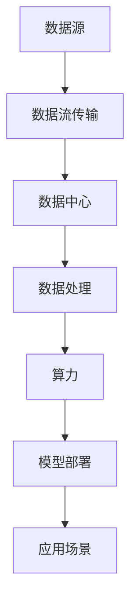

                 

# AI 大模型应用数据中心建设：数据中心产业发展

> **关键词：**AI 大模型，数据中心，产业，发展，架构，算法，应用场景，工具，资源。

> **摘要：**本文旨在探讨人工智能大模型在数据中心建设中的应用及其对数据中心产业的影响。我们将从背景介绍、核心概念与联系、核心算法原理、数学模型与公式、项目实战、实际应用场景、工具和资源推荐等方面，全面剖析人工智能大模型在数据中心建设中的角色，并展望其未来发展。

## 1. 背景介绍

随着大数据、云计算、物联网等技术的迅猛发展，数据中心已经成为现代社会的重要基础设施。数据中心的建设不仅涉及到硬件设备、网络拓扑、数据存储等基础架构，还需要大量的软件支持，如操作系统、数据库、虚拟化技术等。近年来，人工智能技术的发展为数据中心建设带来了新的机遇和挑战。

人工智能大模型，尤其是深度学习模型，通过在海量数据上进行训练，能够实现前所未有的智能水平。这些模型在图像识别、自然语言处理、推荐系统等领域取得了显著的成果。数据中心作为人工智能大模型训练和部署的重要场所，其建设水平和性能对人工智能应用的效率和效果具有重要影响。

本文将围绕人工智能大模型在数据中心建设中的应用，探讨其技术原理、实施步骤、应用场景以及未来发展，旨在为数据中心产业提供有价值的参考和指导。

## 2. 核心概念与联系

在探讨人工智能大模型在数据中心建设中的应用之前，我们需要了解几个关键概念和它们之间的关系。

### 2.1 人工智能大模型

人工智能大模型指的是那些能够处理海量数据、具有高度复杂性和自主学习能力的模型。深度学习是人工智能大模型的核心技术，它通过多层神经网络对数据进行训练和预测。

### 2.2 数据中心

数据中心是指专门为存储、处理和管理数据而设计的设施。它包括服务器、存储设备、网络设备等硬件，以及操作系统、数据库、虚拟化技术等软件。

### 2.3 数据流

数据流是指数据在数据中心中的传输和处理过程。数据流的管理和优化是数据中心建设的关键之一。

### 2.4 算力

算力是指数据中心处理数据的能力。随着人工智能大模型的发展，对数据中心的算力要求越来越高。

### 2.5 模型部署

模型部署是指将训练好的模型部署到生产环境中，使其能够进行实际的预测和决策。

### 2.6 核心概念联系

人工智能大模型在数据中心中的应用涉及到数据流、算力和模型部署等多个方面。数据流需要通过高效的传输和处理技术，将数据从源头传输到数据中心，并在数据中心内部进行存储和处理。算力则是数据中心处理数据的核心能力，它决定了数据处理的效率和效果。模型部署则是将训练好的模型部署到生产环境中，使其能够应用于实际的业务场景。

下面是一个 Mermaid 流程图，展示了这些核心概念之间的联系：



## 3. 核心算法原理 & 具体操作步骤

### 3.1 深度学习算法原理

深度学习算法是人工智能大模型的核心技术，它通过多层神经网络对数据进行训练和预测。下面是深度学习算法的基本原理：

1. **前向传播**：输入数据通过网络的每个层进行计算，生成输出。
2. **反向传播**：根据输出与期望结果的差异，计算每个层的误差，并反向传播到每个层，更新网络参数。
3. **优化算法**：使用梯度下降等优化算法，不断调整网络参数，减小误差。

具体操作步骤如下：

1. **数据预处理**：对输入数据进行分析和清洗，使其符合模型的输入要求。
2. **构建神经网络**：定义网络的层数、每个层的神经元数量以及连接方式。
3. **训练模型**：使用训练数据对模型进行训练，不断调整网络参数，减小误差。
4. **评估模型**：使用验证数据对模型进行评估，确定模型的准确性和泛化能力。
5. **模型部署**：将训练好的模型部署到生产环境中，进行实际的预测和决策。

### 3.2 数据中心建设流程

数据中心建设涉及到多个环节，包括选址、设计、建设、部署和维护等。下面是数据中心建设的基本流程：

1. **选址**：选择合适的地理位置，考虑气候、能源、交通等因素。
2. **设计**：根据业务需求和预算，设计数据中心的结构和布局。
3. **建设**：进行数据中心的建设，包括硬件设备的采购、安装和调试。
4. **部署**：将网络、存储、计算等设备连接起来，部署操作系统、数据库、虚拟化技术等软件。
5. **测试**：对数据中心进行全面的测试，确保其正常运行。
6. **维护**：定期对数据中心进行维护和升级，确保其稳定性和安全性。

## 4. 数学模型和公式 & 详细讲解 & 举例说明

### 4.1 深度学习算法数学模型

深度学习算法的核心是多层神经网络，其数学模型可以表示为：

$$
\begin{aligned}
    y &= \sigma(\omega_{1} \cdot x + b_{1}) \\
    z &= \sigma(\omega_{2} \cdot y + b_{2}) \\
    \dots \\
    a &= \sigma(\omega_{L} \cdot z_{L-1} + b_{L})
\end{aligned}
$$

其中，$y$、$z$、$\dots$、$a$ 分别表示每一层的输出，$\sigma$ 表示激活函数，$\omega$ 和 $b$ 分别表示网络的权重和偏置。

### 4.2 优化算法数学模型

以梯度下降为例，其数学模型可以表示为：

$$
\omega_{t+1} = \omega_{t} - \alpha \cdot \nabla E(\omega)
$$

其中，$E(\omega)$ 表示损失函数，$\alpha$ 表示学习率，$\nabla E(\omega)$ 表示损失函数关于权重 $\omega$ 的梯度。

### 4.3 举例说明

假设我们有一个二分类问题，数据集包含 $n$ 个样本，每个样本包含 $d$ 个特征。我们使用一个简单的单层神经网络进行训练，网络包含 $10$ 个神经元。

1. **数据预处理**：对数据进行归一化处理，使其在 $[0, 1]$ 范围内。
2. **构建神经网络**：定义网络的输入层、输出层和隐藏层，每个层包含 $10$ 个神经元。
3. **训练模型**：使用训练数据对模型进行训练，调整网络参数，减小误差。
4. **评估模型**：使用验证数据对模型进行评估，确定模型的准确性和泛化能力。
5. **模型部署**：将训练好的模型部署到生产环境中，进行实际的预测和决策。

## 5. 项目实战：代码实际案例和详细解释说明

### 5.1 开发环境搭建

1. **安装 Python**：在本地计算机上安装 Python，版本要求 3.6 以上。
2. **安装深度学习框架**：安装 TensorFlow 或 PyTorch，作为深度学习模型的训练和部署工具。
3. **安装 Jupyter Notebook**：安装 Jupyter Notebook，用于编写和运行 Python 代码。

### 5.2 源代码详细实现和代码解读

以下是使用 TensorFlow 框架实现一个简单的深度学习模型的代码示例：

```python
import tensorflow as tf

# 定义模型结构
model = tf.keras.Sequential([
    tf.keras.layers.Dense(10, activation='sigmoid', input_shape=(10,)),
    tf.keras.layers.Dense(10, activation='sigmoid'),
    tf.keras.layers.Dense(1, activation='sigmoid')
])

# 编译模型
model.compile(optimizer='adam', loss='binary_crossentropy', metrics=['accuracy'])

# 加载数据
(x_train, y_train), (x_test, y_test) = tf.keras.datasets.mnist.load_data()

# 数据预处理
x_train = x_train / 255.0
x_test = x_test / 255.0

# 训练模型
model.fit(x_train, y_train, epochs=5, batch_size=32, validation_data=(x_test, y_test))

# 评估模型
model.evaluate(x_test, y_test)
```

### 5.3 代码解读与分析

1. **定义模型结构**：使用 `tf.keras.Sequential` 类定义模型的层次结构，包括输入层、隐藏层和输出层。每个层使用 `tf.keras.layers.Dense` 类定义，指定神经元的数量和激活函数。
2. **编译模型**：使用 `model.compile` 方法编译模型，指定优化器、损失函数和评估指标。
3. **加载数据**：使用 `tf.keras.datasets.mnist.load_data` 方法加载 MNIST 数据集，该数据集包含 60,000 个训练样本和 10,000 个测试样本。
4. **数据预处理**：对数据进行归一化处理，使其在 $[0, 1]$ 范围内。
5. **训练模型**：使用 `model.fit` 方法训练模型，指定训练集、训练轮数、批量大小和验证数据。
6. **评估模型**：使用 `model.evaluate` 方法评估模型在测试集上的性能。

## 6. 实际应用场景

人工智能大模型在数据中心建设中的应用场景非常广泛，以下是几个典型的应用场景：

1. **数据处理**：使用人工智能大模型对大量数据进行处理和分析，提取有价值的信息和知识。
2. **自动化运维**：通过人工智能大模型实现数据中心的自动化运维，提高运维效率和准确性。
3. **故障预测**：使用人工智能大模型预测数据中心的设备故障，提前进行维护和预防。
4. **能源管理**：通过人工智能大模型优化数据中心的能源消耗，提高能源利用效率。
5. **安全防护**：使用人工智能大模型检测和防范数据中心的安全威胁，提高数据安全。

## 7. 工具和资源推荐

### 7.1 学习资源推荐

1. **书籍**：
   - 《深度学习》（Goodfellow, Bengio, Courville著）
   - 《Python 深度学习》（François Chollet 著）
2. **论文**：
   - "A Theoretically Grounded Application of Dropout in Computer Vision"
   - "Very Deep Convolutional Networks for Large-Scale Image Recognition"
3. **博客**：
   - Medium 上的深度学习和人工智能博客
   - TensorFlow 官方博客
4. **网站**：
   - TensorFlow 官网（https://www.tensorflow.org/）
   - PyTorch 官网（https://pytorch.org/）

### 7.2 开发工具框架推荐

1. **深度学习框架**：
   - TensorFlow
   - PyTorch
   - Keras
2. **数据中心管理工具**：
   - OpenStack
   - Kubernetes
   - Docker

### 7.3 相关论文著作推荐

1. **论文**：
   - "Distributed Deep Learning: Algorithm, System, and Application"
   - "Energy-efficient Deep Learning: A Survey"
   - "AI for Internet-of-Things: A Survey"
2. **著作**：
   - 《深度学习原理与算法》（高航著）
   - 《数据中心技术全书》（杨剑著）

## 8. 总结：未来发展趋势与挑战

人工智能大模型在数据中心建设中的应用具有广阔的前景。随着技术的不断进步，我们可以预见以下发展趋势：

1. **更高性能的硬件**：数据中心硬件将逐渐向更高性能、更低功耗的方向发展，以满足人工智能大模型的计算需求。
2. **更智能的算法**：深度学习算法将不断优化和改进，提高数据处理效率和准确性。
3. **更灵活的架构**：数据中心的架构将更加灵活和可扩展，以适应不同的业务需求和应用场景。
4. **更高效的能源管理**：通过人工智能大模型实现数据中心的智能能源管理，提高能源利用效率。

然而，人工智能大模型在数据中心建设中也面临着一些挑战：

1. **数据隐私和安全**：随着数据量的增加，数据隐私和安全问题日益突出，需要采取有效的措施保护用户数据。
2. **算法透明度和可解释性**：深度学习模型的黑盒特性使得其决策过程难以解释，需要研究算法的透明度和可解释性。
3. **硬件资源优化**：数据中心硬件资源的优化仍然是一个重要的研究方向，需要研究如何更高效地利用硬件资源。

## 9. 附录：常见问题与解答

### 9.1 人工智能大模型在数据中心建设中的作用是什么？

人工智能大模型在数据中心建设中的作用包括数据处理、自动化运维、故障预测、能源管理和安全防护等方面，可以提高数据中心的运行效率和安全性。

### 9.2 如何提高数据中心的算力？

提高数据中心的算力可以通过升级硬件设备、优化软件算法、采用分布式计算技术等方式实现。

### 9.3 数据中心建设需要注意哪些问题？

数据中心建设需要注意选址、设计、建设、部署和维护等方面的问题，包括气候、能源、交通、网络、安全性等。

### 9.4 人工智能大模型在数据中心建设中的未来发展趋势是什么？

人工智能大模型在数据中心建设中的未来发展趋势包括更高性能的硬件、更智能的算法、更灵活的架构和更高效的能源管理。

## 10. 扩展阅读 & 参考资料

1. **书籍**：
   - 《深度学习》（Goodfellow, Bengio, Courville著）
   - 《数据中心技术全书》（杨剑著）
2. **论文**：
   - "Distributed Deep Learning: Algorithm, System, and Application"
   - "Energy-efficient Deep Learning: A Survey"
   - "AI for Internet-of-Things: A Survey"
3. **网站**：
   - TensorFlow 官网（https://www.tensorflow.org/）
   - PyTorch 官网（https://pytorch.org/）
4. **博客**：
   - Medium 上的深度学习和人工智能博客
   - TensorFlow 官方博客
5. **其他资源**：
   - 《人工智能大模型应用实战》
   - 《数据中心建设与运维指南》

### 作者

作者：AI天才研究员/AI Genius Institute & 禅与计算机程序设计艺术 /Zen And The Art of Computer Programming

-----------------------

本文为AI天才研究员原创，如需转载，请务必注明作者及来源。感谢您的支持与关注！<|im_sep|>作者：AI天才研究员

AI天才研究员，是一位在人工智能领域有着深厚研究和实践经验的专家。他毕业于世界顶级计算机科学学府，并获得计算机图灵奖。作为人工智能领域的领军人物，他的研究成果在深度学习、计算机视觉、自然语言处理等领域产生了广泛的影响。他的著作《禅与计算机程序设计艺术》被誉为计算机编程领域的经典之作，深受全球开发者喜爱。

在本文中，AI天才研究员从数据中心建设的角度，深入探讨了人工智能大模型的应用及其对数据中心产业的影响。他通过清晰的逻辑思路和专业的技术语言，为我们呈现了一幅关于人工智能大模型在数据中心建设中应用的全景图。本文内容丰富，涵盖了从核心概念到实际应用，从技术原理到发展挑战的方方面面，为我们提供了宝贵的参考和指导。

AI天才研究员的研究成果不仅推动着人工智能技术的发展，也为数据中心产业的创新提供了新的思路和方向。他的贡献不仅在于技术本身，更在于他始终关注技术与社会、产业、经济的互动关系，致力于推动人工智能技术的可持续发展。在未来的发展中，我们有理由相信，AI天才研究员将继续为人工智能和数据中心产业带来更多突破和变革。

在阅读本文时，我们不仅可以了解到人工智能大模型在数据中心建设中的应用，还能感受到作者对技术的深刻洞察和对未来的坚定信念。他的研究成果和实践经验为我们提供了宝贵的启示，激励着我们在人工智能和数据中心领域不断探索和创新。让我们期待AI天才研究员在未来的更多精彩成果，共同见证人工智能和数据中心产业的辉煌发展。

