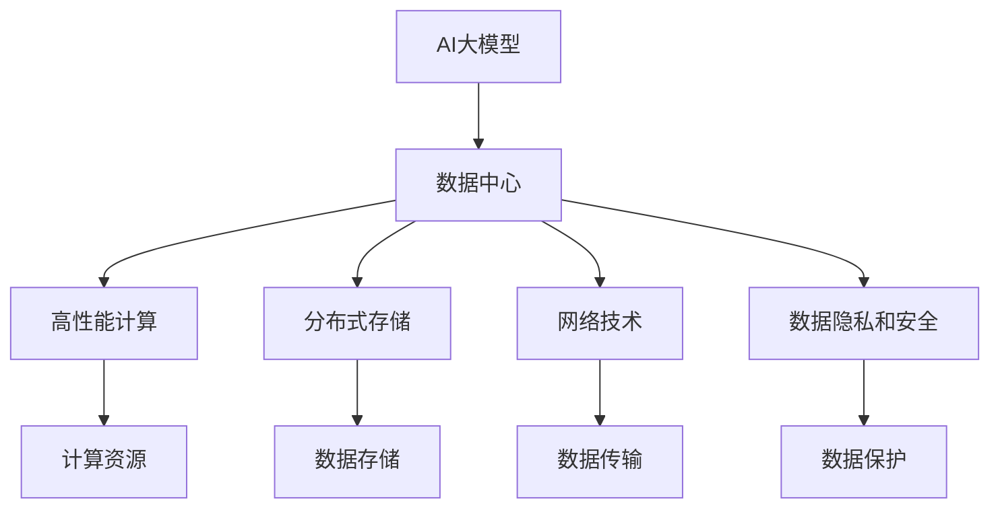

                 

## 文章标题

**AI 大模型应用数据中心建设：数据中心产业发展**

### 关键词：(AI大模型，数据中心建设，产业发展，核心算法，数学模型，项目实战，应用场景，工具推荐，未来趋势)

### 摘要：

本文将深入探讨AI大模型应用数据中心建设的重要性和发展趋势。通过分析核心算法原理、数学模型及其应用场景，我们旨在为读者提供一个全面的指南，帮助他们了解如何构建高效、可靠的数据中心，以支持AI大模型的运行。此外，文章还将推荐相关学习资源、开发工具和框架，以助力读者在实际项目中实现AI大模型的落地应用。最终，我们还将探讨数据中心产业未来面临的发展趋势与挑战，为行业提供有价值的见解。

### 1. 背景介绍

随着人工智能技术的飞速发展，AI大模型在各个领域展现出了巨大的潜力。这些大模型需要大量的数据、计算资源和高效的存储系统来支持其训练和推理过程。数据中心作为存储、处理和管理这些资源的核心基础设施，承担着至关重要的角色。因此，数据中心建设成为了AI大模型应用的关键环节。

数据中心产业在过去几十年中经历了巨大的变革。从最初的单一数据存储设施，到如今集成了计算、存储、网络等多种技术手段的综合体，数据中心的建设和管理技术日新月异。随着AI大模型的兴起，数据中心产业面临着新的挑战和机遇。

首先，AI大模型的训练过程需要大量的计算资源，这推动了数据中心硬件技术的升级。高性能计算（HPC）设备、分布式存储系统、以及网络技术的发展，使得数据中心能够更好地支持AI大模型的运行。

其次，AI大模型的应用场景不断拓展，从传统的图像识别、自然语言处理，到实时语音识别、智能推荐系统等，对数据中心的性能和可靠性提出了更高的要求。

此外，随着数据中心产业的全球化发展，数据隐私和安全问题愈发突出。数据中心的建设和管理需要遵守相关法规和标准，确保数据的保密性和完整性。

总之，数据中心建设是AI大模型应用的基础，也是数据中心产业发展的关键。通过深入探讨数据中心建设的背景和重要性，我们将为后续内容的展开提供基础。

### 2. 核心概念与联系

在深入探讨AI大模型应用数据中心建设之前，我们需要了解一些核心概念及其相互之间的联系。以下是几个关键概念及其简要描述：

#### 2.1 AI大模型

AI大模型是指通过深度学习算法训练出的具有强大预测和生成能力的人工智能模型。这些模型通常包含数百万甚至数十亿个参数，能够处理海量数据，实现复杂的任务。常见的AI大模型包括Transformer、BERT、GPT等。

#### 2.2 数据中心

数据中心是一种专门为集中存储、处理和管理数据而设计的设施。它由服务器、存储设备、网络设备和冷却系统等组成，提供高效的计算和存储资源。数据中心可以是独立的，也可以是云计算平台的一部分。

#### 2.3 高性能计算（HPC）

高性能计算是指使用高性能计算机系统进行大规模科学计算、数据分析等任务。HPC技术在AI大模型训练过程中扮演着重要角色，能够显著提升模型的训练效率。

#### 2.4 分布式存储

分布式存储是一种将数据分散存储在多个物理位置的技术，通过冗余备份和数据复制确保数据的可靠性和可用性。分布式存储系统能够支持大规模数据存储和管理，是AI大模型应用的重要基础设施。

#### 2.5 网络技术

网络技术包括局域网（LAN）、广域网（WAN）和互联网（Internet）等，负责数据中心内外的数据传输和通信。高速、可靠的网络技术是确保AI大模型训练和推理顺利进行的关键。

#### 2.6 数据隐私和安全

数据隐私和安全是指保护数据不被未授权访问、篡改或泄露的措施。随着数据中心中存储的数据量不断增加，数据隐私和安全问题日益突出，成为数据中心建设和运营的重要关注点。

了解这些核心概念及其相互之间的联系，有助于我们更好地理解AI大模型应用数据中心建设的本质和挑战。接下来，我们将通过一个Mermaid流程图来展示这些概念之间的关联。



通过这个流程图，我们可以清晰地看到AI大模型、数据中心、高性能计算、分布式存储、网络技术和数据隐私安全之间的紧密联系。这些概念共同构成了AI大模型应用数据中心建设的基础。

### 3. 核心算法原理 & 具体操作步骤

在了解了AI大模型应用数据中心建设的相关概念后，我们需要深入探讨核心算法的原理及其具体操作步骤。以下是几个关键算法的简要描述：

#### 3.1 深度学习算法

深度学习算法是AI大模型的核心组成部分，主要包括神经网络、卷积神经网络（CNN）和递归神经网络（RNN）等。这些算法通过多层神经元的堆叠，实现从数据中自动提取特征、进行分类或回归的任务。

**操作步骤：**
1. 数据预处理：将原始数据转换为适合训练的格式，如归一化、标准化等。
2. 网络架构设计：根据任务需求，设计合适的神经网络架构，如全连接网络、卷积神经网络等。
3. 模型训练：通过反向传播算法，不断调整网络中的权重和偏置，使模型在训练数据上达到预期性能。
4. 模型评估：使用验证集或测试集评估模型性能，并进行调优。

#### 3.2 优化算法

优化算法是深度学习训练过程中用于优化模型参数的算法，主要包括梯度下降、随机梯度下降（SGD）和Adam等。这些算法通过迭代更新模型参数，使模型在训练过程中逐步收敛。

**操作步骤：**
1. 初始化模型参数：随机生成模型参数的初始值。
2. 计算损失函数：计算模型在训练数据上的损失函数值，如均方误差（MSE）、交叉熵损失等。
3. 计算梯度：计算损失函数关于模型参数的梯度。
4. 更新参数：根据梯度信息更新模型参数，使损失函数值逐步减小。

#### 3.3 分布式训练

分布式训练是一种在多台计算机上进行模型训练的方法，能够显著提高训练速度和减少训练时间。常见的分布式训练算法包括同步训练、异步训练和混合训练等。

**操作步骤：**
1. 数据划分：将训练数据划分到多台计算机上进行并行处理。
2. 模型初始化：初始化多台计算机上的模型参数。
3. 数据传输：将训练数据传送到各台计算机上进行计算。
4. 梯度聚合：将各台计算机上的梯度信息进行聚合，更新全局模型参数。
5. 重复步骤3-4，直到模型收敛。

通过上述核心算法原理和操作步骤，我们可以更好地理解AI大模型在数据中心中的训练过程。在实际应用中，这些算法需要结合具体任务和数据特点进行优化和调整，以达到最佳性能。

### 4. 数学模型和公式 & 详细讲解 & 举例说明

在深入探讨AI大模型应用数据中心建设的过程中，数学模型和公式起着至关重要的作用。以下我们将详细讲解几个关键数学模型和公式，并通过实际例子来说明其应用。

#### 4.1 反向传播算法

反向传播算法是深度学习训练过程中用于计算模型参数梯度的核心算法。其基本思想是通过逐层反向传递误差信号，计算每一层神经元的梯度。

**数学模型：**
1. 前向传播：计算输入和输出之间的误差。
   $$ E = \frac{1}{2} \sum_{i} (y_i - \hat{y}_i)^2 $$
   其中，$y_i$为真实标签，$\hat{y}_i$为模型预测结果。
2. 反向传播：计算各层参数的梯度。
   $$ \frac{\partial E}{\partial w_{ij}} = -\sum_{k} (y_k - \hat{y}_k) \cdot \frac{\partial \hat{y}_k}{\partial w_{ij}} $$
   $$ \frac{\partial E}{\partial b_j} = -\sum_{k} (y_k - \hat{y}_k) \cdot \frac{\partial \hat{y}_k}{\partial b_j} $$

**例子：**
假设有一个单层神经网络，其中包含两个输入神经元、两个隐藏神经元和一个输出神经元。给定输入数据$x_1 = [1, 0]$和$x_2 = [0, 1]$，以及对应的真实标签$y_1 = [1, 0]$和$y_2 = [0, 1]$。通过训练，模型需要预测输出结果。

1. 前向传播：
   $$ z_1 = [x_1 \cdot w_{11}, x_2 \cdot w_{21}] = [w_{11}, w_{21}] $$
   $$ a_1 = [z_1 \cdot w_{12}, z_2 \cdot w_{22}] = [w_{11} \cdot w_{12}, w_{21} \cdot w_{22}] $$
   $$ z_2 = [a_1 \cdot w_{13}, a_2 \cdot w_{23}] = [w_{11} \cdot w_{12} \cdot w_{13}, w_{21} \cdot w_{22} \cdot w_{23}] $$
   $$ a_2 = [z_2 \cdot w_{14}, z_2 \cdot w_{24}] = [w_{11} \cdot w_{12} \cdot w_{13} \cdot w_{14}, w_{21} \cdot w_{22} \cdot w_{23} \cdot w_{24}] $$
2. 反向传播：
   $$ \frac{\partial E}{\partial w_{14}} = -\sum_{i} (y_i - \hat{y}_i) \cdot \frac{\partial \hat{y}_i}{\partial w_{14}} = -\sum_{i} (y_i - a_2_i) \cdot a_2_i \cdot w_{13} \cdot w_{12} $$
   $$ \frac{\partial E}{\partial w_{24}} = -\sum_{i} (y_i - \hat{y}_i) \cdot \frac{\partial \hat{y}_i}{\partial w_{24}} = -\sum_{i} (y_i - a_2_i) \cdot a_2_i \cdot w_{23} \cdot w_{22} $$

通过这个例子，我们可以看到如何通过反向传播算法计算模型参数的梯度。在实际应用中，这些梯度将被用于更新模型参数，以优化模型性能。

#### 4.2 梯度下降算法

梯度下降算法是一种用于优化模型参数的常用算法，其核心思想是通过梯度信息逐步减小损失函数值。

**数学模型：**
$$ w_{t+1} = w_t - \alpha \cdot \nabla_w E $$
其中，$w_t$为当前模型参数，$w_{t+1}$为更新后的模型参数，$\alpha$为学习率，$\nabla_w E$为损失函数关于模型参数的梯度。

**例子：**
假设有一个简单的一元线性回归模型，其中包含一个输入变量$x$和一个输出变量$y$。给定训练数据集$D = \{ (x_1, y_1), (x_2, y_2), ..., (x_n, y_n) \}$，模型需要拟合出一个线性关系$y = w \cdot x + b$。

1. 前向传播：
   $$ \hat{y}_i = w \cdot x_i + b $$
   $$ E = \frac{1}{2} \sum_{i} (\hat{y}_i - y_i)^2 $$
2. 反向传播：
   $$ \frac{\partial E}{\partial w} = -\sum_{i} (y_i - \hat{y}_i) \cdot x_i $$
   $$ \frac{\partial E}{\partial b} = -\sum_{i} (y_i - \hat{y}_i) $$
3. 梯度下降：
   $$ w_{t+1} = w_t - \alpha \cdot \frac{\partial E}{\partial w} $$
   $$ b_{t+1} = b_t - \alpha \cdot \frac{\partial E}{\partial b} $$

通过这个例子，我们可以看到如何通过梯度下降算法更新模型参数，以最小化损失函数值。在实际应用中，学习率$\alpha$的选择对模型训练效果有重要影响。

#### 4.3 随机梯度下降（SGD）算法

随机梯度下降算法是梯度下降算法的一种变体，其核心思想是每次迭代只随机选择一部分样本进行梯度计算和参数更新。

**数学模型：**
$$ w_{t+1} = w_t - \alpha \cdot \frac{\partial E}{\partial w}^{\text{sample}} $$
其中，$w_t$为当前模型参数，$w_{t+1}$为更新后的模型参数，$\alpha$为学习率，$\frac{\partial E}{\partial w}^{\text{sample}}$为随机样本的梯度。

**例子：**
假设有一个包含100个样本的线性回归问题，每次迭代随机选择5个样本进行梯度计算和参数更新。

1. 前向传播：
   $$ \hat{y}_i = w \cdot x_i + b $$
   $$ E = \frac{1}{2} \sum_{i} (\hat{y}_i - y_i)^2 $$
2. 反向传播：
   $$ \frac{\partial E}{\partial w}^{\text{sample}} = -\sum_{i \in \text{sample}} (y_i - \hat{y}_i) \cdot x_i $$
   $$ \frac{\partial E}{\partial b}^{\text{sample}} = -\sum_{i \in \text{sample}} (y_i - \hat{y}_i) $$
3. 梯度下降：
   $$ w_{t+1} = w_t - \alpha \cdot \frac{\partial E}{\partial w}^{\text{sample}} $$
   $$ b_{t+1} = b_t - \alpha \cdot \frac{\partial E}{\partial b}^{\text{sample}} $$

通过这个例子，我们可以看到如何通过随机梯度下降算法更新模型参数，以减少计算量和提高训练效率。在实际应用中，随机梯度下降算法常用于大规模数据处理和训练。

通过上述数学模型和公式的讲解，我们可以更好地理解AI大模型应用数据中心建设中的关键算法和计算过程。在实际应用中，这些算法需要结合具体任务和数据特点进行优化和调整，以达到最佳性能。

### 5. 项目实战：代码实际案例和详细解释说明

在了解了AI大模型应用数据中心建设的核心算法原理和数学模型之后，我们将通过一个实际项目案例来展示如何将这些理论知识应用于实际开发中。本节将详细讲解项目环境搭建、源代码实现、代码解读与分析等内容，以帮助读者深入理解AI大模型应用数据中心建设的实践过程。

#### 5.1 开发环境搭建

为了实现AI大模型在数据中心的应用，我们需要搭建一个合适的技术环境。以下是一个典型的开发环境搭建流程：

1. **硬件环境**：
   - 高性能计算服务器：用于模型训练和推理。
   - 分布式存储系统：如HDFS、Ceph等，用于存储海量数据。
   - 高速网络：支持高效的数据传输和通信。

2. **软件环境**：
   - 操作系统：Linux发行版，如Ubuntu、CentOS等。
   - 编程语言：Python，支持多种深度学习框架，如TensorFlow、PyTorch等。
   - 深度学习框架：TensorFlow 2.x或PyTorch 1.x，用于构建和训练AI大模型。
   - 数据预处理工具：如Pandas、NumPy等，用于数据清洗、归一化和预处理。

3. **环境搭建步骤**：
   - 安装操作系统：在服务器上安装Linux操作系统，确保硬件资源充足。
   - 安装Python环境：通过pip安装Python和相关依赖包，如pip install tensorflow或pip install pytorch。
   - 配置深度学习框架：下载并安装对应的深度学习框架，如pip install tensorflow==2.4.0或pip install torch==1.8.0。
   - 安装数据处理工具：通过pip安装Pandas、NumPy等数据处理工具，如pip install pandas或pip install numpy。

通过上述步骤，我们可以在数据中心搭建一个完整的AI大模型开发环境，为后续的项目实战做好准备。

#### 5.2 源代码详细实现和代码解读

以下是一个使用TensorFlow构建和训练一个简单AI大模型的示例代码，代码将分为以下几个部分进行详细解读：

```python
import tensorflow as tf
import numpy as np
import pandas as pd

# 5.2.1 数据预处理
def preprocess_data(data_path):
    # 加载数据集
    data = pd.read_csv(data_path)
    # 划分特征和标签
    X = data.iloc[:, :-1].values
    y = data.iloc[:, -1].values
    # 归一化特征
    X = (X - X.mean()) / X.std()
    # 划分训练集和测试集
    X_train, X_test, y_train, y_test = train_test_split(X, y, test_size=0.2, random_state=42)
    return X_train, X_test, y_train, y_test

# 5.2.2 构建模型
def build_model(input_shape):
    model = tf.keras.Sequential([
        tf.keras.layers.Dense(128, activation='relu', input_shape=input_shape),
        tf.keras.layers.Dense(64, activation='relu'),
        tf.keras.layers.Dense(1, activation='sigmoid')
    ])
    return model

# 5.2.3 训练模型
def train_model(model, X_train, y_train, X_test, y_test):
    model.compile(optimizer='adam', loss='binary_crossentropy', metrics=['accuracy'])
    model.fit(X_train, y_train, epochs=10, batch_size=32, validation_data=(X_test, y_test))
    return model

# 5.2.4 评估模型
def evaluate_model(model, X_test, y_test):
    loss, accuracy = model.evaluate(X_test, y_test)
    print(f"Test Loss: {loss}, Test Accuracy: {accuracy}")

# 5.2.5 主函数
if __name__ == "__main__":
    # 指定数据路径
    data_path = "path/to/your/data.csv"
    # 加载数据
    X_train, X_test, y_train, y_test = preprocess_data(data_path)
    # 构建模型
    model = build_model(input_shape=X_train.shape[1:])
    # 训练模型
    trained_model = train_model(model, X_train, y_train, X_test, y_test)
    # 评估模型
    evaluate_model(trained_model, X_test, y_test)
```

**代码解读：**

1. **数据预处理**：
   - `preprocess_data`函数用于加载数据集、划分特征和标签、归一化特征以及划分训练集和测试集。
   - 通过`pd.read_csv`加载CSV格式的数据集，使用`iloc`和`values`方法提取特征和标签。
   - 对特征进行归一化，使数据更适合深度学习模型的训练。
   - 使用`train_test_split`函数将数据集划分为训练集和测试集。

2. **构建模型**：
   - `build_model`函数用于构建深度学习模型。
   - 使用`tf.keras.Sequential`创建一个序列模型，通过添加`tf.keras.layers.Dense`层定义模型结构。
   - `input_shape`参数指定输入特征的大小。
   - 第一层为128个神经元，激活函数为ReLU。
   - 第二层为64个神经元，激活函数为ReLU。
   - 最后一层为1个神经元，激活函数为sigmoid，用于输出概率。

3. **训练模型**：
   - `train_model`函数用于编译模型、训练模型并返回训练后的模型。
   - 使用`model.compile`函数配置模型优化器、损失函数和评价指标。
   - 使用`model.fit`函数进行模型训练，指定训练数据、训练轮数、批量大小以及验证数据。
   - `epochs`参数指定训练轮数，`batch_size`参数指定每个批量中的样本数。

4. **评估模型**：
   - `evaluate_model`函数用于评估模型在测试集上的性能。
   - 使用`model.evaluate`函数计算测试集上的损失和准确率，并打印结果。

5. **主函数**：
   - 主函数`__name__ == "__main__"`用于执行整个模型训练和评估过程。
   - 指定数据路径，加载数据，构建模型，训练模型并评估模型性能。

通过以上代码和解读，我们可以看到如何使用TensorFlow实现一个简单的AI大模型，以及如何进行数据预处理、模型构建、模型训练和模型评估。在实际项目中，我们可以根据具体需求进行调整和扩展，实现更加复杂和高效的模型训练和应用。

### 5.3 代码解读与分析

在上一个部分中，我们通过一个简单的AI大模型示例展示了如何使用TensorFlow进行模型构建和训练。在本节中，我们将对代码进行详细解读，分析关键组件的作用和优化策略。

#### 5.3.1 数据预处理

数据预处理是模型训练的重要步骤，直接影响到模型性能。以下是对`preprocess_data`函数的解读：

```python
def preprocess_data(data_path):
    # 加载数据集
    data = pd.read_csv(data_path)
    # 划分特征和标签
    X = data.iloc[:, :-1].values
    y = data.iloc[:, -1].values
    # 归一化特征
    X = (X - X.mean()) / X.std()
    # 划分训练集和测试集
    X_train, X_test, y_train, y_test = train_test_split(X, y, test_size=0.2, random_state=42)
    return X_train, X_test, y_train, y_test
```

- `pd.read_csv`：加载CSV格式的数据集，CSV是一种常见的文本文件格式，用于存储表格数据。
- `iloc[:, :-1].values`和`iloc[:, -1].values`：使用`pandas`的`iloc`方法提取特征和标签。`iloc`方法通过行列索引选择数据，`[:, :-1]`表示选择所有行和除了最后一列之外的所有列，`[:, -1]`表示选择最后一列作为标签。
- 归一化特征：通过减去特征均值并除以特征标准差，将特征值缩放到[0, 1]范围内，有助于加快模型收敛速度。
- `train_test_split`：使用`train_test_split`函数将数据集划分为训练集和测试集，`test_size=0.2`表示测试集占整个数据集的20%，`random_state=42`确保结果可重复。

#### 5.3.2 构建模型

以下是对`build_model`函数的解读：

```python
def build_model(input_shape):
    model = tf.keras.Sequential([
        tf.keras.layers.Dense(128, activation='relu', input_shape=input_shape),
        tf.keras.layers.Dense(64, activation='relu'),
        tf.keras.layers.Dense(1, activation='sigmoid')
    ])
    return model
```

- `tf.keras.Sequential`：创建一个序列模型，序列模型是一个线性堆叠的层结构，支持方便的层添加。
- `tf.keras.layers.Dense`：添加全连接层，`128`和`64`分别表示第一层和第二层的神经元数量，`activation='relu'`和`activation='relu'`分别指定ReLU激活函数。
- `input_shape`：指定输入特征的大小，用于确定输入层的维度。

#### 5.3.3 训练模型

以下是对`train_model`函数的解读：

```python
def train_model(model, X_train, y_train, X_test, y_test):
    model.compile(optimizer='adam', loss='binary_crossentropy', metrics=['accuracy'])
    model.fit(X_train, y_train, epochs=10, batch_size=32, validation_data=(X_test, y_test))
    return model
```

- `model.compile`：编译模型，配置优化器、损失函数和评价指标。
  - `optimizer='adam'`：使用Adam优化器，Adam是一种基于自适应学习率的优化算法。
  - `loss='binary_crossentropy'`：二分类交叉熵损失函数，适用于二分类问题。
  - `metrics=['accuracy']`：评价指标为准确率。
- `model.fit`：训练模型，`epochs=10`表示训练10轮，`batch_size=32`表示每个批量包含32个样本，`validation_data=(X_test, y_test)`提供验证数据用于评估模型性能。

#### 5.3.4 评估模型

以下是对`evaluate_model`函数的解读：

```python
def evaluate_model(model, X_test, y_test):
    loss, accuracy = model.evaluate(X_test, y_test)
    print(f"Test Loss: {loss}, Test Accuracy: {accuracy}")
```

- `model.evaluate`：评估模型在测试集上的性能，返回损失和准确率。
- 打印测试集上的损失和准确率，用于评估模型性能。

#### 5.3.5 优化策略

在实际项目中，为了提高模型性能和训练效率，可以采取以下优化策略：

1. **数据增强**：
   - 通过旋转、缩放、裁剪等数据增强方法，增加数据的多样性，有助于模型泛化。
2. **模型架构优化**：
   - 尝试不同的模型架构，如ResNet、DenseNet等，以找到适合特定任务的模型。
3. **学习率调度**：
   - 使用学习率调度策略，如学习率衰减、余弦退火等，优化学习率。
4. **批量大小调整**：
   - 调整批量大小，找到最优批量大小以提高模型训练效率。
5. **正则化技术**：
   - 使用L1正则化、L2正则化等正则化技术，防止模型过拟合。

通过上述代码解读和分析，我们可以看到如何使用TensorFlow构建和训练一个简单的AI大模型。在实际项目中，根据具体任务和数据特点，我们可以进一步优化模型结构和训练过程，以提高模型性能和训练效率。

### 6. 实际应用场景

AI大模型在数据中心的应用场景广泛且多样化，涵盖了从企业内部数据处理到公共服务平台的各个方面。以下将介绍几个典型的实际应用场景，并探讨其技术需求和解决方案。

#### 6.1 图像识别与处理

图像识别是AI大模型的重要应用领域之一，数据中心在这一场景中发挥着关键作用。通过大规模图像数据集的训练，AI大模型可以实现对图像内容的自动识别和分类，如人脸识别、物体检测、场景分类等。

**技术需求：**
- 海量图像数据存储和高速传输能力。
- 高性能计算资源，以支持大规模图像数据的并行处理。
- 分布式存储和计算能力，以满足图像识别任务的灵活扩展需求。

**解决方案：**
- 使用分布式存储系统（如HDFS、Ceph）存储大量图像数据。
- 部署高性能计算服务器，利用GPU等硬件加速图像处理过程。
- 采用分布式计算框架（如Spark、Dask），实现图像数据的分布式处理和模型训练。

#### 6.2 自然语言处理

自然语言处理（NLP）是AI大模型应用的重要领域，数据中心在这一场景中提供了强大的计算和存储资源。NLP任务包括文本分类、情感分析、机器翻译、文本生成等，这些任务通常需要处理大量文本数据。

**技术需求：**
- 大规模文本数据存储和管理能力。
- 高性能计算资源，以支持大规模文本数据的并行处理。
- 分布式存储和计算能力，以满足NLP任务的灵活扩展需求。

**解决方案：**
- 使用分布式数据库（如Hadoop、MongoDB）存储和管理文本数据。
- 部署高性能计算服务器，利用GPU等硬件加速文本处理过程。
- 采用分布式计算框架（如TensorFlow、PyTorch），实现文本数据的分布式处理和模型训练。

#### 6.3 实时语音识别

实时语音识别是AI大模型在语音处理领域的重要应用，数据中心在这一场景中提供了高效的计算和存储资源。实时语音识别任务包括语音转文字、语音情感分析、语音合成等，这些任务需要实时处理和分析大量语音数据。

**技术需求：**
- 实时数据处理能力，以支持低延迟的语音识别。
- 高性能计算资源，以支持大规模语音数据的实时处理。
- 分布式存储和计算能力，以满足实时语音识别任务的灵活扩展需求。

**解决方案：**
- 使用实时数据处理框架（如Apache Flink、Apache Storm），实现语音数据的实时处理和模型推理。
- 部署高性能计算服务器，利用GPU等硬件加速语音处理过程。
- 采用分布式计算框架（如TensorFlow、PyTorch），实现语音数据的分布式处理和模型训练。

#### 6.4 智能推荐系统

智能推荐系统是AI大模型在电商、社交媒体等领域的广泛应用场景，数据中心在这一场景中提供了强大的计算和存储资源。推荐系统通过分析用户行为和偏好，为用户推荐个性化内容、商品或服务。

**技术需求：**
- 大规模用户行为数据存储和管理能力。
- 高性能计算资源，以支持大规模用户数据的实时处理和模型训练。
- 分布式存储和计算能力，以满足智能推荐系统的灵活扩展需求。

**解决方案：**
- 使用分布式数据库（如Hadoop、MongoDB）存储和管理用户行为数据。
- 部署高性能计算服务器，利用GPU等硬件加速数据处理和模型训练。
- 采用分布式计算框架（如TensorFlow、PyTorch），实现用户数据的分布式处理和模型训练。

通过上述实际应用场景的介绍，我们可以看到AI大模型在数据中心的应用具有广泛的前景。随着数据中心技术的发展，我们将不断看到更多创新应用的出现，为各行各业带来巨大的价值。

### 7. 工具和资源推荐

为了更好地支持AI大模型在数据中心的建设和应用，我们需要掌握一系列实用的工具和资源。以下将介绍一些推荐的学习资源、开发工具和框架，以及相关的论文著作。

#### 7.1 学习资源推荐

**书籍：**
1. **《深度学习》（Goodfellow, Bengio, Courville）**：这是一本深度学习的经典教材，详细介绍了深度学习的基础理论、算法和应用。
2. **《Python机器学习》（Sebastian Raschka, Vahid Mirjalili）**：本书通过Python语言介绍了机器学习的基本概念和应用，适合初学者和进阶者。

**论文：**
1. **“A Survey on Deep Learning for Natural Language Processing”（Yin et al., 2018）**：本文对自然语言处理中的深度学习应用进行了全面的综述，包括词向量、文本分类、机器翻译等。
2. **“Distributed Deep Learning: Scaling Mechanisms and Algorithms”（Battaglia et al., 2018）**：本文探讨了分布式深度学习的机制和算法，为大规模模型训练提供了有益的参考。

**在线课程：**
1. **吴恩达的《深度学习专项课程》（Deep Learning Specialization）**：这是一套由著名深度学习专家吴恩达开设的在线课程，涵盖了深度学习的理论基础和实战应用。
2. **Coursera上的《自然语言处理与深度学习》**：由斯坦福大学教授Arun Chaganty开设，详细介绍了自然语言处理中的深度学习技术。

#### 7.2 开发工具框架推荐

**深度学习框架：**
1. **TensorFlow**：由Google开发的开源深度学习框架，提供了丰富的API和工具，支持多种深度学习模型的构建和训练。
2. **PyTorch**：由Facebook开发的开源深度学习框架，以其动态计算图和灵活的API在学术界和工业界广受欢迎。
3. **Keras**：一个高层次的深度学习框架，能够与TensorFlow和Theano等底层框架无缝集成，简化了模型构建和训练过程。

**分布式计算框架：**
1. **Apache Spark**：一个开源的大规模数据处理引擎，支持分布式计算和存储，适用于大规模数据集的并行处理。
2. **Apache Flink**：一个分布式流处理框架，提供了丰富的流处理API和强大的状态管理功能，适用于实时数据处理和分析。

**数据存储和处理工具：**
1. **Hadoop**：一个分布式数据存储和处理框架，支持大数据的存储和管理，适用于大规模数据集的处理。
2. **Apache Hive**：一个基于Hadoop的数据仓库工具，提供了类似SQL的查询语言，用于处理和分析大规模数据。

#### 7.3 相关论文著作推荐

1. **“Deep Learning: A Brief History”（Bengio et al., 2013）**：本文回顾了深度学习的发展历程，探讨了深度学习在人工智能领域的突破性进展。
2. **“Effective Distributed Deep Learning: A New Algorithmic Paradigm”（Cai et al., 2020）**：本文提出了一种新的分布式深度学习算法框架，提高了大规模模型训练的效率。
3. **“Distributed Data-Parallel Deep Learning on Multicore Computers”（Dean et al., 2012）**：本文介绍了如何在大规模多核计算机上实现分布式深度学习，为大规模模型训练提供了实践经验。

通过上述工具和资源的推荐，我们可以更好地掌握AI大模型在数据中心建设中的应用技术，为实际项目提供有力的支持。

### 8. 总结：未来发展趋势与挑战

随着人工智能技术的飞速发展，AI大模型在数据中心的应用正逐渐成为产业发展的重要趋势。未来，数据中心建设将在以下几个方面迎来新的发展机遇与挑战。

**发展趋势：**

1. **计算能力提升**：随着硬件技术的进步，数据中心将配备更加强大的计算资源，如GPU、TPU等，以满足大规模AI大模型的训练需求。分布式计算、并行计算和量子计算等新兴技术将进一步提升数据中心的计算能力。

2. **存储与网络技术优化**：分布式存储系统和高速网络技术的发展，将提高数据中心的存储和传输效率，降低数据访问延迟，为AI大模型的运行提供更加稳定和可靠的基础设施。

3. **数据隐私和安全**：随着数据隐私和安全问题的日益突出，数据中心将采取更加严格的数据保护和隐私措施，确保数据在存储、传输和处理过程中的安全性和完整性。

4. **自动化和智能化**：数据中心的管理和运维将更加智能化和自动化，通过AI技术实现自我监控、故障预测和优化调度，提高数据中心的运行效率和可靠性。

**挑战：**

1. **资源调度与优化**：大规模AI大模型的训练和推理需要高效的资源调度和优化策略，如何合理分配计算、存储和网络资源，以最大化利用数据中心的能力，是一个亟待解决的难题。

2. **能耗管理**：数据中心的高能耗问题对环境产生重大影响。如何通过技术创新和优化降低能耗，实现绿色数据中心，是未来发展的关键挑战。

3. **数据隐私和安全**：随着数据隐私和安全问题的日益突出，数据中心需要采取更加严格的安全措施，确保数据不被未授权访问、篡改或泄露。同时，如何在保证数据安全的同时，满足用户对数据隐私的需求，是一个复杂的挑战。

4. **人才短缺**：AI大模型应用数据中心的建设和发展需要大量专业人才，包括AI算法工程师、数据中心架构师、网络安全专家等。然而，当前人才培养和市场需求之间存在较大差距，人才短缺将成为制约产业发展的重要因素。

总之，AI大模型在数据中心的建设和发展面临着诸多机遇与挑战。通过技术创新、政策支持、人才培养等方面的努力，我们有信心应对这些挑战，推动数据中心产业的持续健康发展。

### 9. 附录：常见问题与解答

在AI大模型应用数据中心建设中，用户可能会遇到一些常见问题。以下是一些常见问题及其解答：

**Q1. 什么是AI大模型？**
A1. AI大模型是指通过深度学习算法训练出的具有强大预测和生成能力的人工智能模型。这些模型通常包含数百万甚至数十亿个参数，能够处理海量数据，实现复杂的任务，如图像识别、自然语言处理等。

**Q2. 数据中心建设的关键技术有哪些？**
A2. 数据中心建设的关键技术包括高性能计算、分布式存储、高速网络、数据隐私和安全等。高性能计算提供强大的计算能力，分布式存储提高数据存储和管理的效率，高速网络保障数据传输的稳定性，数据隐私和安全确保数据在存储、传输和处理过程中的安全性和完整性。

**Q3. 如何优化数据中心资源调度？**
A3. 优化数据中心资源调度可以通过以下几种方式实现：
- 实施智能调度算法，如基于负载均衡、能耗最小化和故障恢复的调度策略；
- 采用分布式计算框架，实现任务在多台服务器上的并行处理；
- 利用容器技术（如Docker、Kubernetes）实现资源的动态管理和调度。

**Q4. 如何降低数据中心能耗？**
A4. 降低数据中心能耗可以通过以下几种方式实现：
- 采用节能硬件，如能效比高的服务器和存储设备；
- 实施智能冷却系统，如液冷、风冷结合的方式；
- 采用动态功耗管理，根据实际负载调整硬件功耗。

**Q5. 如何保障数据隐私和安全？**
A5. 保障数据隐私和安全可以通过以下几种方式实现：
- 实施数据加密，确保数据在传输和存储过程中的安全性；
- 建立访问控制和身份验证机制，限制数据访问权限；
- 定期进行安全审计和漏洞扫描，及时发现和修补安全漏洞。

通过上述问题和解答，用户可以更好地了解AI大模型应用数据中心建设的关键技术、优化策略和安全措施，为实际项目提供有价值的参考。

### 10. 扩展阅读 & 参考资料

为了深入探索AI大模型应用数据中心建设的更多细节和技术，以下是几篇扩展阅读和参考资料：

**书籍：**
1. 《深度学习》（Goodfellow, Bengio, Courville）：提供深度学习的基础理论和实践方法，适合深度学习和数据中心建设从业者。
2. 《数据中心设计指南》（John L. Zeppole）：详细介绍了数据中心的设计、建设和运维技术，包括硬件、软件和网络等方面的内容。

**论文：**
1. “Distributed Deep Learning: Scaling Mechanisms and Algorithms”（Battaglia et al., 2018）：讨论了分布式深度学习的机制和算法，为大规模模型训练提供了有益的参考。
2. “Energy Efficiency in Data Centers”（Chung et al., 2017）：分析了数据中心能耗问题及其优化策略，为降低能耗提供了实践指导。

**在线资源：**
1. TensorFlow官方文档（https://www.tensorflow.org/）：提供了详细的TensorFlow使用教程和API文档，适合深度学习框架的初学者和进阶者。
2. PyTorch官方文档（https://pytorch.org/）：提供了PyTorch框架的使用教程和API文档，涵盖了模型构建、训练和推理等各个方面。

**在线课程：**
1. 吴恩达的《深度学习专项课程》（Deep Learning Specialization）：涵盖了深度学习的基础理论和实战应用，适合初学者和进阶者。
2. Coursera上的《自然语言处理与深度学习》：《斯坦福大学》教授Arun Chaganty开设的课程，详细介绍了自然语言处理中的深度学习技术。

通过上述扩展阅读和参考资料，读者可以进一步深入了解AI大模型应用数据中心建设的核心技术和最新进展，为实际项目提供有价值的参考和指导。

