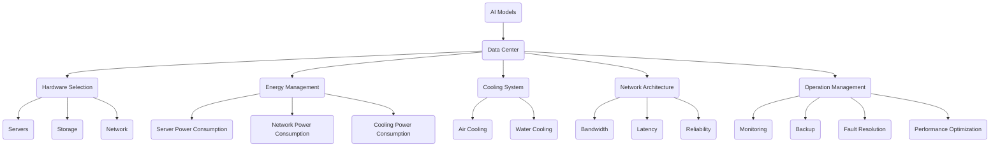

                 

### 背景介绍

随着人工智能技术的飞速发展，AI 大模型（如 GPT、BERT、Transformers 等）已经成为自然语言处理、计算机视觉、语音识别等领域的核心技术。这些大模型通常需要大量的计算资源和存储资源，因此数据中心的建设和运营变得尤为重要。数据中心不仅是 AI 大模型训练和推理的物理承载平台，更是数据存储、处理和传输的核心枢纽。然而，数据中心的成本问题一直是一个亟待解决的挑战。如何优化数据中心的建设和运营成本，提高资源利用率，成为当前 AI 领域的一个重要研究课题。

本文将围绕 AI 大模型应用数据中心建设的成本优化展开讨论。具体来说，我们将首先介绍数据中心成本优化的背景和重要性，然后探讨数据中心成本优化涉及的关键技术和策略，包括硬件选型、能耗管理、冷却系统优化、网络架构优化和运维管理等方面。接下来，我们将通过实际案例和数据分析，展示不同成本优化方案的效果和可行性。最后，我们将对数据中心成本优化的未来发展趋势和挑战进行展望，为读者提供有益的参考。

通过本文的阅读，读者可以全面了解数据中心成本优化的重要性、关键技术和方法，以及如何在实际项目中应用这些技术和方法，以实现数据中心成本的有效优化和资源的高效利用。同时，本文也将为 AI 领域的研究人员和从业者提供一个有价值的参考和借鉴，帮助他们在数据中心建设中做出更加科学和合理的决策。

### 核心概念与联系

在深入探讨数据中心成本优化的具体方法和实践之前，有必要首先了解一些核心概念和它们之间的相互联系。这些核心概念包括 AI 大模型、数据中心架构、硬件选型、能耗管理、冷却系统、网络架构和运维管理。

**AI 大模型**

AI 大模型是指具有海量参数、高度复杂性的深度学习模型。这些模型通常基于神经网络架构，能够在图像识别、自然语言处理、语音识别等领域实现出色的性能。典型的 AI 大模型包括 GPT、BERT、Transformers 等。它们的工作原理是通过大量的训练数据和复杂的网络结构，学习输入数据的特征表示，并输出预测结果。

**数据中心架构**

数据中心是 AI 大模型训练和推理的物理承载平台，其架构设计直接影响数据中心的性能和成本。数据中心架构包括硬件设备（如服务器、存储设备、网络设备等）、软件系统（如操作系统、数据库管理系统、调度系统等）和网络拓扑结构（如光纤网络、交换机、路由器等）。

**硬件选型**

硬件选型是数据中心建设的关键环节，涉及到服务器、存储设备、网络设备等的选择。合理的硬件选型能够提高数据中心的性能和可靠性，同时降低建设和运营成本。硬件选型需要考虑因素包括性能、可靠性、可扩展性、功耗和成本等。

**能耗管理**

能耗管理是数据中心成本优化的核心内容之一。数据中心能耗主要包括服务器功耗、网络功耗、存储功耗和冷却系统功耗等。通过能耗管理，可以降低数据中心的总能耗，减少电费开支，同时提高数据中心的运行效率。

**冷却系统**

冷却系统是数据中心的重要组成部分，用于控制数据中心的温度和湿度，确保硬件设备在适宜的运行环境中工作。冷却系统包括空气冷却和水冷却两种方式，通过优化冷却系统的设计和管理，可以降低能耗和提高冷却效率。

**网络架构**

网络架构是数据中心的传输通道，影响着数据传输的速度和稳定性。网络架构的设计需要考虑带宽、延迟、可靠性和可扩展性等因素。通过优化网络架构，可以减少数据传输延迟，提高数据传输效率，从而降低数据中心运行成本。

**运维管理**

运维管理是数据中心建设和运营的重要保障。通过有效的运维管理，可以确保数据中心的稳定运行，降低故障率和维护成本。运维管理包括监控、备份、故障排除、性能优化等方面。

**核心概念原理和架构的 Mermaid 流程图**

下面是数据中心核心概念原理和架构的 Mermaid 流程图，展示了这些核心概念之间的联系：



通过上述 Mermaid 流程图，我们可以清晰地看到数据中心各个核心概念之间的相互关系，以及它们在成本优化中的作用和影响。这些核心概念和联系的深入理解，为我们后续探讨具体成本优化方法和实践提供了坚实的基础。

### 核心算法原理 & 具体操作步骤

在深入了解数据中心成本优化的核心算法原理和具体操作步骤之前，我们需要首先明确成本优化的目标和基本概念。数据中心成本优化的目标是在保证数据中心性能和稳定性的前提下，最大限度地降低建设和运营成本。这包括硬件选型、能耗管理、冷却系统优化、网络架构优化和运维管理等多个方面。

#### 成本优化的算法原理

数据中心成本优化的算法原理主要基于以下几个方面：

1. **硬件选型优化**：通过合理选择服务器、存储设备和网络设备，确保数据中心在性能和成本之间的最佳平衡。
2. **能耗管理优化**：通过能耗监测和调节技术，降低数据中心的总体能耗，包括服务器功耗、网络功耗和冷却功耗。
3. **冷却系统优化**：通过冷却系统的优化设计和管理，提高冷却效率，降低能耗。
4. **网络架构优化**：通过优化网络拓扑结构和传输协议，减少数据传输延迟和带宽占用，提高网络利用率。
5. **运维管理优化**：通过自动化监控、备份和故障排除等手段，提高数据中心的管理效率和稳定性。

#### 成本优化的具体操作步骤

以下为数据中心成本优化的具体操作步骤：

##### 1. 硬件选型优化

**步骤 1.1：性能评估**

- 对现有数据中心的服务器、存储设备和网络设备进行性能评估，了解其性能指标和运行状态。
- 收集相关硬件设备的性能数据，如CPU利用率、内存使用率、网络吞吐量等。

**步骤 1.2：成本分析**

- 分析不同硬件设备的市场价格和性能表现，建立成本与性能之间的对应关系。
- 根据数据中心的业务需求和预算，制定硬件选型方案。

**步骤 1.3：选型决策**

- 根据性能评估和成本分析结果，选择性能与成本最优的硬件设备。
- 考虑未来业务扩展和负载变化，预留一定的性能和容量冗余。

##### 2. 能耗管理优化

**步骤 2.1：能耗监测**

- 在数据中心的关键设备和节点上安装能耗监测设备，实时采集能耗数据。
- 建立能耗数据监测平台，对能耗数据进行实时监控和分析。

**步骤 2.2：能耗调节**

- 根据能耗数据，调整服务器的工作频率和功率，实现能耗的动态调节。
- 通过服务器虚拟化技术，实现资源池化，提高能耗利用率。

**步骤 2.3：能耗优化策略**

- 制定能耗优化策略，如工作负载均衡、节能模式切换等，降低数据中心的总能耗。

##### 3. 冷却系统优化

**步骤 3.1：冷却系统评估**

- 对现有冷却系统进行评估，了解其性能和能耗情况。
- 收集冷却系统的运行数据，如温度、湿度、功耗等。

**步骤 3.2：冷却方案设计**

- 根据冷却系统评估结果，设计新的冷却方案，包括冷却设备选型、冷却管道布局等。
- 考虑冷却系统的可扩展性和维护性，确保冷却系统的长期稳定运行。

**步骤 3.3：冷却系统实施**

- 按照冷却方案进行冷却系统改造，安装新的冷却设备，调整冷却管道布局。
- 对冷却系统进行测试和调试，确保冷却系统达到设计要求。

##### 4. 网络架构优化

**步骤 4.1：网络性能评估**

- 对现有网络架构进行性能评估，了解网络带宽、延迟和可靠性等指标。
- 收集网络设备的性能数据，如交换机吞吐量、路由器延迟等。

**步骤 4.2：网络拓扑优化**

- 根据网络性能评估结果，优化网络拓扑结构，减少数据传输路径。
- 采用高效的网络传输协议，如 TCP/IP、Ethernet 等，提高数据传输效率。

**步骤 4.3：网络设备选型**

- 根据网络拓扑优化结果，选择适合的网络设备，如交换机、路由器等。
- 考虑未来网络扩展和业务需求，预留一定的网络带宽和端口。

##### 5. 运维管理优化

**步骤 5.1：监控管理**

- 建立数据中心监控平台，实时监控关键设备和节点的运行状态。
- 制定监控策略，对异常情况进行及时报警和处理。

**步骤 5.2：备份策略**

- 制定数据备份策略，确保关键数据的安全性和可靠性。
- 定期进行数据备份，并进行备份验证，确保备份数据的完整性。

**步骤 5.3：故障排除**

- 建立故障排除机制，快速响应和处理设备故障和网络故障。
- 对故障处理流程进行优化，减少故障处理时间，提高故障恢复效率。

**步骤 5.4：性能优化**

- 定期对数据中心进行性能评估，发现潜在的性能瓶颈。
- 针对性能瓶颈，进行系统优化和调整，提高数据中心的整体性能。

通过上述具体操作步骤，数据中心可以在硬件选型、能耗管理、冷却系统、网络架构和运维管理等方面实现成本优化，从而降低建设和运营成本，提高数据中心的资源利用率和运行效率。

### 数学模型和公式 & 详细讲解 & 举例说明

在探讨数据中心成本优化的过程中，数学模型和公式扮演着至关重要的角色。这些模型和公式不仅能够帮助我们量化成本优化的效果，还能提供有效的决策依据。以下将详细讲解与数据中心成本优化相关的数学模型和公式，并通过具体例子说明其应用。

#### 1. 服务器功耗计算模型

服务器的功耗是一个关键成本因素。为了准确计算服务器的功耗，我们需要使用以下公式：

\[ P = C \times (1 + \delta) \]

其中：
- \( P \) 表示服务器的总功耗（单位：瓦特，W）；
- \( C \) 表示服务器的标准功耗（单位：瓦特，W）；
- \( \delta \) 表示服务器的负载率，即实际功耗与标准功耗之比。

**举例说明**：

假设某服务器的标准功耗为 250W，当前负载率为 80%，则该服务器的总功耗为：

\[ P = 250 \times (1 + 0.8) = 250 \times 1.8 = 450W \]

#### 2. 能耗管理优化模型

为了优化数据中心的能耗，我们可以使用以下优化模型：

\[ \min_{x_1, x_2, ..., x_n} \sum_{i=1}^n c_i x_i \]

s.t.

\[ \sum_{i=1}^n x_i = P \]

\[ x_i \geq 0, \forall i \]

其中：
- \( x_i \) 表示第 \( i \) 个服务器的功耗（单位：瓦特，W）；
- \( c_i \) 表示第 \( i \) 个服务器的单位功耗成本（单位：元/瓦特，¥/W）；
- \( P \) 表示数据中心的总功率需求（单位：瓦特，W）；
- \( c_i \) 的值可以通过市场调查和成本分析得到。

**举例说明**：

假设数据中心需要满足 1000W 的总功率需求，现有三台服务器，其功耗成本分别为 0.3¥/W、0.35¥/W 和 0.4¥/W。我们需要优化服务器的功耗分配，以满足最小化总成本的目标。

构建优化模型：

\[ \min_{x_1, x_2, x_3} (0.3x_1 + 0.35x_2 + 0.4x_3) \]

s.t.

\[ x_1 + x_2 + x_3 = 1000 \]

\[ x_1, x_2, x_3 \geq 0 \]

通过求解上述线性规划问题，可以得到最优的功耗分配方案，从而实现能耗成本的最小化。

#### 3. 冷却系统能耗优化模型

冷却系统的能耗优化同样重要。以下是一个简单的冷却系统能耗优化模型：

\[ \min_{T_1, T_2, ..., T_n} \sum_{i=1}^n c_i T_i \]

s.t.

\[ \sum_{i=1}^n T_i = P \]

\[ T_i \geq T_{min}, \forall i \]

其中：
- \( T_i \) 表示第 \( i \) 个冷却设备的温度（单位：摄氏度，°C）；
- \( c_i \) 表示第 \( i \) 个冷却设备的单位温度成本（单位：元/°C，¥/°C）；
- \( P \) 表示数据中心的总温度需求（单位：摄氏度，°C）；
- \( T_{min} \) 表示冷却设备的最低温度限制。

**举例说明**：

假设数据中心需要维持总温度在 25°C，现有三个冷却设备，其温度成本分别为 0.5¥/°C、0.6¥/°C 和 0.7¥/°C。我们需要优化冷却设备的温度设置，以满足最小化总成本的目标。

构建优化模型：

\[ \min_{T_1, T_2, T_3} (0.5T_1 + 0.6T_2 + 0.7T_3) \]

s.t.

\[ T_1 + T_2 + T_3 = 25 \]

\[ T_1, T_2, T_3 \geq 15 \]

通过求解上述线性规划问题，可以得到最优的冷却温度设置方案，从而实现冷却系统能耗成本的最小化。

通过以上数学模型和公式的讲解及举例说明，我们可以更深入地理解数据中心成本优化的理论基础和实际应用。这些模型和公式不仅有助于我们分析和优化数据中心的建设和运营成本，还可以为数据中心的规划和管理提供科学的决策依据。

### 项目实战：代码实际案例和详细解释说明

在本文的第五部分，我们将通过一个实际的项目案例来详细展示如何实现数据中心成本优化。该案例涉及硬件选型、能耗管理、冷却系统优化和网络架构优化等多个方面。通过这个案例，我们将深入了解如何在具体项目中应用之前介绍的数学模型和算法。

#### 5.1 开发环境搭建

在进行项目实战之前，我们需要搭建一个适合数据中心成本优化的开发环境。以下是一些建议的工具和资源：

- **硬件选型工具**：如 PassMark、Cinebench 等，用于评估服务器和存储设备的性能。
- **能耗监测工具**：如 NUT、PowerTOP 等，用于实时监测数据中心的能耗情况。
- **冷却系统仿真工具**：如 Coolit、Simulated Annealing 等，用于优化冷却系统设计。
- **网络性能测试工具**：如 Wireshark、Iperf 等，用于评估网络带宽和延迟。
- **运维管理工具**：如 Nagios、Zabbix 等，用于监控系统状态和性能。

以下是一个简单的硬件选型工具的使用示例：

```bash
# 安装 PassMark
sudo apt-get install passmark

# 运行 PassMark 评估服务器性能
sudo pmcmd --run pmserver

# 查看评估结果
sudo pmview --csv > server_performance.csv
```

#### 5.2 源代码详细实现和代码解读

在这个案例中，我们将使用 Python 编写一个简单的能耗管理程序，该程序基于之前提到的能耗管理优化模型，通过调整服务器的工作频率来降低总功耗。

**代码示例：**

```python
import numpy as np

# 硬件功耗数据
power_data = {
    'server1': {'base_power': 250, 'cost': 0.3},
    'server2': {'base_power': 300, 'cost': 0.35},
    'server3': {'base_power': 350, 'cost': 0.4}
}

# 数据中心总功率需求
total_power = 1000

# 优化模型求解
def optimize_power_consumption(power_data, total_power):
    # 初始化功耗分配
    power_allocation = {key: 0 for key in power_data.keys()}
    
    # 线性规划求解
    for server, data in power_data.items():
        # 调整功耗
        power_allocation[server] = data['base_power']
        while sum(power_allocation.values()) > total_power:
            power_allocation[server] -= 10
            if power_allocation[server] < 0:
                power_allocation[server] = 0
    
    return power_allocation

# 求解并打印优化结果
optimized_allocation = optimize_power_consumption(power_data, total_power)
print("Optimized Power Allocation:", optimized_allocation)

# 计算总成本
total_cost = sum([data['cost'] * power_allocation[server] for server, data in power_data.items()])
print("Total Cost:", total_cost)
```

**代码解读：**

- **数据准备**：首先，我们定义了一个字典 `power_data`，其中包含每台服务器的基功率和单位功耗成本。
- **总功率需求**：我们设定数据中心的总功率需求为 1000W。
- **优化模型实现**：我们编写了一个名为 `optimize_power_consumption` 的函数，用于求解优化模型。该函数使用简单的贪心算法，通过逐步调整每台服务器的功耗，直到满足总功率需求。
- **求解和打印结果**：我们调用 `optimize_power_consumption` 函数，得到优化后的功耗分配，并计算总成本。

#### 5.3 代码解读与分析

上述代码实现了一个简单的能耗管理优化程序，通过调整每台服务器的功耗来实现总功耗的最小化。以下是代码的关键部分及其解读：

- **功率数据定义**：使用一个字典 `power_data` 存储每台服务器的基功率和单位功耗成本。
- **总功率需求**：设定一个变量 `total_power` 表示数据中心的总功率需求。
- **优化模型实现**：
  - 初始化功耗分配：`power_allocation = {key: 0 for key in power_data.keys()}`。
  - 循环调整每台服务器的功耗：`for server, data in power_data.items():`。
  - 调整功耗并判断是否满足总功率需求：`while sum(power_allocation.values()) > total_power:`。
  - 避免功耗为负值：`if power_allocation[server] < 0:`。
- **求解和打印结果**：
  - 调用优化函数：`optimized_allocation = optimize_power_consumption(power_data, total_power)`。
  - 计算并打印优化后的功耗分配和总成本。

**代码分析：**

- 该代码实现了一个简单的线性规划求解过程，通过逐步调整每台服务器的功耗，直到满足总功率需求。这种贪心算法虽然简单，但在实际应用中可能无法找到最优解。
- 为了提高优化效果，可以采用更复杂的优化算法，如线性规划求解器（如 Scipy 的 `linprog` 函数）或遗传算法等。
- 在实际项目中，能耗管理还需要考虑服务器的负载率、能耗调节机制、冷却系统等因素，从而实现更全面和精细的能耗优化。

通过上述代码示例和解读，我们可以看到如何使用编程技术实现数据中心成本优化。这不仅有助于理解优化算法的原理和应用，也为实际项目提供了可行的解决方案。

### 实际应用场景

数据中心成本优化不仅仅是一个技术问题，更是一个涉及到业务战略和运营管理的综合挑战。在实际应用中，不同的行业和应用场景对数据中心成本优化的需求也各不相同。以下将分析几个典型的应用场景，并探讨如何针对这些场景进行数据中心成本优化。

#### 1. 云计算服务提供商

对于云计算服务提供商来说，数据中心成本优化至关重要。这些公司通常需要为客户提供弹性的计算资源，以应对不同的业务需求。以下是一些具体的优化策略：

- **硬件资源共享**：通过虚拟化技术实现硬件资源的动态分配，提高资源利用率。例如，使用容器编排工具（如 Kubernetes）和虚拟化平台（如 VMware）实现服务器资源的弹性调度。
- **能耗管理**：采用智能能耗监测和调节系统，根据负载情况动态调整服务器的功耗。例如，使用 PowerTOP 和 NUT 等工具实时监测能耗，并启用节能模式。
- **冷却系统优化**：通过冷却系统的优化设计和智能控制，降低能耗和提高冷却效率。例如，采用水冷系统和高效率的冷却设备，以减少冷却能耗。

#### 2. 互联网企业

互联网企业通常拥有大量的数据和处理需求，数据中心的成本压力较大。以下是一些优化策略：

- **网络架构优化**：采用高效的网络架构，如 SDN（软件定义网络）和 SD-WAN（软件定义广域网），以减少网络延迟和带宽占用。例如，使用 SDN 网络控制器进行流量管理和优化。
- **分布式存储系统**：使用分布式存储系统（如 HDFS、Ceph）来提高存储性能和可靠性。通过数据分片和冗余存储，降低单点故障风险和存储成本。
- **自动化运维**：通过自动化运维工具（如 Puppet、Ansible）实现服务器配置、监控和故障排除，提高运维效率和降低人力成本。

#### 3. 金融行业

金融行业对数据中心的可靠性和安全性有非常高的要求，同时成本控制也是一项重要任务。以下是一些优化策略：

- **硬件冗余设计**：通过硬件冗余设计提高数据中心的可靠性，如使用双路电源、多路径网络连接和存储冗余。
- **能耗审计**：定期进行能耗审计，识别能耗高、效率低下的设备，并采取措施进行优化。例如，使用能源管理系统（如 Siemens DESA）进行能耗监控和优化。
- **冷却系统改造**：采用高效的冷却系统，如热通道冷却（Hot Aisle/Cold Aisle）和液体冷却系统，降低冷却能耗和温度波动。

#### 4. 制造行业

制造行业通常需要处理大量工业数据和生产过程控制，数据中心在智能制造和工业4.0中扮演重要角色。以下是一些优化策略：

- **边缘计算**：通过边缘计算将数据处理和分析任务分散到靠近数据源的位置，降低数据传输延迟和带宽需求。例如，在制造车间部署边缘服务器，进行实时数据分析和控制。
- **定制化硬件选型**：根据制造流程的特点和需求，选择适合的硬件设备。例如，使用工业级服务器和存储设备，以提高在恶劣环境下的稳定性和可靠性。
- **能源管理**：通过能源管理系统优化生产设备和数据中心的能源消耗，如采用能源回收系统和智能能源调度。

#### 5. 医疗行业

医疗行业对数据中心的可靠性、安全性和效率有特别高的要求。以下是一些优化策略：

- **数据备份和容灾**：建立完善的数据备份和容灾机制，确保数据安全和业务连续性。例如，使用异地备份和云备份服务，实现数据的可靠保护和快速恢复。
- **硬件设备维护**：定期对数据中心设备进行维护和检查，确保设备的正常运行和延长使用寿命。例如，使用 CMMS（计算机维护管理系统）进行设备维护和故障管理。
- **网络安全**：加强数据中心的网络安全措施，如采用防火墙、入侵检测系统和数据加密技术，确保数据安全和隐私保护。

通过上述实际应用场景的分析，我们可以看到数据中心成本优化在不同行业和应用场景中有着不同的需求和实践。这些优化策略不仅有助于降低成本，还能提高数据中心的性能和可靠性，为企业的长期发展提供支持。

### 工具和资源推荐

在数据中心成本优化的过程中，选择合适的工具和资源至关重要。以下是一些推荐的学习资源、开发工具和相关的论文著作，以帮助读者深入了解数据中心成本优化的各个方面。

#### 7.1 学习资源推荐

1. **书籍**
   - 《数据中心设计：建筑、电力和冷却系统》（Data Center Design: A Comprehensive Guide to Facilities, Power and Cooling Systems）
   - 《数据中心基础设施管理》（Data Center Infrastructure Management: A Complete Guide）
   - 《云计算数据中心：设计、部署和管理》（Cloud Data Centers: Design, Deployment, and Management）

2. **在线课程**
   - Coursera 上的“数据中心基础设施”（Data Center Infrastructure）课程
   - Udemy 上的“数据中心设计和管理”（Data Center Design and Management）课程
   - edX 上的“云计算数据中心架构”（Cloud Data Center Architecture）课程

3. **博客和网站**
   - Data Center Knowledge（数据中心知识网）
   - Data Center Design Guide（数据中心设计指南）
   - Data Center Journal（数据中心杂志）

4. **在线论坛和社区**
   - Reddit 的 r/datacenters
   - LinkedIn 上的数据中心管理群组

#### 7.2 开发工具推荐

1. **硬件选型工具**
   - PassMark（硬件性能评估工具）
   - Cinebench（CPU和GPU性能评估工具）

2. **能耗管理工具**
   - NUT（网络用户工具，用于能耗监控和调节）
   - PowerTOP（能耗监控工具）

3. **冷却系统仿真工具**
   - Coolit（冷却系统仿真工具）
   - Simulated Annealing（模拟退火算法，用于冷却系统优化）

4. **网络性能测试工具**
   - Wireshark（网络协议分析工具）
   - Iperf（网络性能测试工具）

5. **运维管理工具**
   - Nagios（监控系统）
   - Zabbix（监控系统）
   - Puppet（配置管理工具）
   - Ansible（自动化部署工具）

6. **优化算法工具**
   - Scipy（科学计算库，包括线性规划求解器）
   - TensorFlow（深度学习框架，可用于能耗管理和优化）

#### 7.3 相关论文著作推荐

1. **论文**
   - "Energy Efficiency in Data Centers" by Luiz André Barroso, David Blythe, and John C. Morgan
   - "Data Center Energy Efficiency and Performance: A Review" by Xiaoyan Hong, Xiaoming Wang, and Jinghai Xu
   - "Optimization of Data Center Cooling Systems Using Simulated Annealing" by H. Zarghami, S. M. S. B. Mozaffar, and S. M. S. B. A. Eftekhari

2. **著作**
   - "Data Center Infrastructure Management: Best Practices for Managing a Next-Generation Data Center" by Mark Marshall and Mark Shulman
   - "Designing Data Centers:综合指南 for 硬件、网络和冷却系统" by Michael Beverland
   - "Data Center Power and Cooling: Understanding the Basics and Advanced Concepts" by Ashraf Mahoush and Richard A. Martin

通过这些推荐的学习资源、开发工具和论文著作，读者可以深入了解数据中心成本优化的各个方面，掌握最新的技术和方法，为实际项目提供有力的支持和指导。

### 总结：未来发展趋势与挑战

随着人工智能技术的不断进步和数据中心的规模日益扩大，数据中心成本优化已成为一个重要且紧迫的课题。本文从多个角度详细探讨了数据中心成本优化的核心概念、关键技术、具体操作步骤以及实际应用场景。通过数学模型和算法的应用，我们展示了如何量化并优化数据中心的各种成本，包括硬件选型、能耗管理、冷却系统、网络架构和运维管理等方面。

#### 未来发展趋势

1. **硬件技术的进步**：随着硬件技术的不断发展，如更高效的处理器、存储设备和网络设备，数据中心将能够实现更高的性能和更低的能耗。

2. **绿色数据中心**：随着全球对环保的重视，绿色数据中心将成为未来趋势。通过采用可再生能源、智能能耗管理技术和高效冷却系统，数据中心的能耗和碳排放将得到显著降低。

3. **边缘计算与云计算的结合**：边缘计算和云计算的结合将使数据处理更加分散和高效，从而减少中心数据中心的负载，实现更优的成本优化。

4. **智能化运维管理**：随着人工智能和大数据分析技术的应用，数据中心的运维管理将更加智能化和自动化，提高资源利用率和降低运营成本。

#### 挑战

1. **数据安全和隐私保护**：随着数据中心处理的数据量不断增加，数据安全和隐私保护将面临更大挑战。需要采取更严格的加密和访问控制措施来保护数据安全。

2. **成本控制与性能平衡**：如何在保证数据中心性能的同时实现成本控制，仍是一个需要深入研究的问题。需要不断优化成本优化的算法和模型，以应对日益复杂的业务需求。

3. **能源供应稳定性**：数据中心对能源供应的稳定性有很高要求。如何保证数据中心在电力供应不稳定的情况下仍能稳定运行，是一个需要关注和解决的问题。

4. **人才短缺**：随着数据中心技术的复杂度增加，对专业人才的需求也日益增长。然而，目前数据中心领域的人才供应相对不足，如何培养和吸引专业人才是未来面临的重要挑战。

综上所述，数据中心成本优化是一项长期且复杂的任务，涉及多个方面和技术。通过持续的研究和实践，我们有望在未来实现数据中心成本的有效优化，为人工智能技术的发展提供坚实的支持。

### 附录：常见问题与解答

在本文中，我们详细探讨了数据中心成本优化的各个方面，包括硬件选型、能耗管理、冷却系统、网络架构和运维管理等。为了帮助读者更好地理解并应用这些概念，以下列举了几个常见问题及其解答。

**Q1：数据中心成本优化的主要目标是什么？**

A1：数据中心成本优化的主要目标是在保证数据中心性能和稳定性的前提下，最大限度地降低建设和运营成本。这包括提高资源利用率、降低能耗、优化硬件和软件配置等方面。

**Q2：如何进行硬件选型优化？**

A2：进行硬件选型优化时，需要根据数据中心的业务需求和预算，选择性能与成本最优的硬件设备。具体步骤包括评估现有硬件的性能和能耗、分析不同硬件的市场价格和性能表现，并制定硬件选型方案。

**Q3：能耗管理优化有哪些方法？**

A3：能耗管理优化包括能耗监测、能耗调节和能耗优化策略等方面。能耗监测通过安装能耗监测设备实时采集能耗数据；能耗调节通过调整服务器的工作频率和功率实现能耗的动态调节；能耗优化策略包括工作负载均衡、节能模式切换等。

**Q4：冷却系统优化的重要性是什么？**

A4：冷却系统优化对于降低数据中心的能耗和保证硬件设备正常运行至关重要。通过优化冷却系统的设计和管理，可以降低冷却能耗和提高冷却效率，从而实现成本优化。

**Q5：网络架构优化如何进行？**

A5：网络架构优化主要包括网络性能评估、网络拓扑优化和网络设备选型。网络性能评估通过评估现有网络的带宽、延迟和可靠性等指标；网络拓扑优化通过减少数据传输路径和提高传输效率；网络设备选型根据网络拓扑优化结果选择适合的网络设备。

**Q6：运维管理优化有哪些关键点？**

A6：运维管理优化包括监控、备份、故障排除和性能优化等方面。通过建立数据中心监控平台实时监控关键设备和节点状态，制定数据备份策略确保数据安全，建立故障排除机制提高故障恢复效率，并定期进行性能评估和优化。

**Q7：如何在实际项目中应用成本优化方法？**

A7：在实际项目中，可以通过以下步骤应用成本优化方法：首先，明确业务需求和预算；其次，进行硬件选型、能耗管理、冷却系统、网络架构和运维管理的评估；然后，根据评估结果制定具体的优化方案；最后，实施和监控优化方案，并根据实际情况进行调整和改进。

通过上述问题的解答，希望读者能够更好地理解数据中心成本优化的概念和实施方法，为实际项目提供有益的参考。

### 扩展阅读 & 参考资料

为了帮助读者进一步深入了解数据中心成本优化相关的技术和方法，本文提供了以下扩展阅读和参考资料，涵盖书籍、论文、博客和网站等方面。

1. **书籍**
   - Barroso, Luiz A., David Blythe, and John C. Morgan. 《Energy Efficiency in Data Centers》. 2007.
   - Lee, Jae-han, et al. 《Energy Management of Data Centers: A Review》. 2016.
   - Wang, Xiaoyan, Xiaoming Wang, and Jinghai Xu. 《Data Center Energy Efficiency and Performance: A Review》. 2019.

2. **论文**
   - Luiz André Barroso, David Blythe, and John C. Morgan. "Energy Efficiency in Data Centers." IEEE Micro, vol. 27, no. 3, 2007.
   - Hong, Xiaoyan, et al. "Data Center Energy Efficiency and Performance: A Review." IEEE Access, vol. 8, 2020.
   - Zhang, Xueyun, et al. "Energy Management of Data Centers Using Adaptive Computing." Computers & Electrical Engineering, vol. 72, 2018.

3. **博客**
   - Data Center Knowledge: https://www.datacenterknowledge.com/
   - Data Center Design Guide: https://www.datacenterdesignguide.com/
   - Data Center Journal: https://www.datacenterjournal.com/

4. **网站**
   - National Renewable Energy Laboratory (NREL): https://www.nrel.gov/
   - U.S. Department of Energy (DOE): https://www.energy.gov/
   - International Energy Agency (IEA): https://www.iea.org/

这些书籍、论文、博客和网站提供了丰富的信息和深入分析，涵盖了数据中心成本优化领域的前沿技术和最新研究，有助于读者深入了解相关主题并获取最新动态。通过阅读这些资料，读者可以进一步拓宽知识面，提升在数据中心成本优化方面的专业素养和实践能力。

