                 

### 背景介绍

随着人工智能技术的快速发展，大模型（Large Models）已经成为当今AI研究与应用的热门话题。这些大模型在处理复杂的自然语言任务、图像识别、语音识别等方面展现出了卓越的性能，极大地推动了人工智能技术的进步。然而，大模型的应用不仅依赖于算法的创新，更需要强大的硬件基础设施来支撑。数据中心建设作为人工智能大模型应用的重要环节，其技术和应用场景逐渐成为研究的热点。

本文旨在探讨人工智能大模型应用数据中心的建设，从技术角度出发，详细解析数据中心的核心概念、算法原理、数学模型及其在实际应用中的具体案例。通过本文的阅读，读者可以了解到：

1. **数据中心建设的背景和重要性**：分析大模型在AI领域的广泛应用，阐述数据中心建设对AI技术的支撑作用。
2. **核心概念与联系**：介绍数据中心建设的核心概念，如计算资源、存储资源、网络资源等，并绘制Mermaid流程图展示各概念之间的关联。
3. **核心算法原理与具体操作步骤**：探讨大模型训练和优化中的关键技术，包括数据预处理、模型训练、模型调优等步骤。
4. **数学模型和公式**：详细讲解大模型中的数学模型和公式，并通过具体例子进行说明。
5. **项目实战**：通过实际代码案例，展示大模型数据中心建设的具体实现过程，包括开发环境搭建、源代码实现和解读。
6. **实际应用场景**：分析大模型数据中心在不同领域的应用场景，如自然语言处理、计算机视觉等。
7. **工具和资源推荐**：推荐学习资源、开发工具框架和相关论文著作，为读者提供进一步学习研究的方向。
8. **总结与展望**：总结数据中心建设在AI领域的发展趋势和面临的挑战，展望未来发展方向。

在接下来的内容中，我们将一步一步地深入探讨这些主题，以帮助读者全面了解人工智能大模型应用数据中心的建设及其在现实中的应用。首先，我们从数据中心建设的背景和重要性开始。

### 数据中心建设的背景和重要性

数据中心（Data Center）是信息技术（IT）行业的重要组成部分，它为各种计算任务提供了必要的硬件资源和基础设施。随着人工智能（AI）技术的迅速发展，大模型的应用需求日益增长，这进一步推动了数据中心建设的步伐。数据中心在大模型应用中扮演着关键角色，主要表现在以下几个方面：

#### 1. 计算资源的需求

人工智能大模型，如深度学习模型，通常需要大量的计算资源进行训练和优化。这些模型涉及大量的参数和复杂的计算过程，需要高性能的计算硬件来加速计算。数据中心提供了集中的计算资源，包括高性能计算机、GPU、TPU等，使得大模型能够快速进行训练和推理。

#### 2. 存储资源的需求

大模型在训练过程中会生成大量的中间数据和模型参数，需要大规模的存储空间来存储这些数据。数据中心配备了高效的存储系统，如分布式文件系统、固态硬盘（SSD）等，确保数据的高效存储和快速访问。

#### 3. 网络资源的需求

人工智能大模型的应用通常需要与外部数据和资源进行交互，如访问远程数据库、下载预训练模型等。数据中心提供了高速、稳定的网络连接，确保数据的快速传输和模型的高效部署。

#### 4. 能源和散热管理

大型数据中心通常需要大量的电力来支持计算和存储设备的运行，同时会产生大量的热量。因此，能源和散热管理成为数据中心建设中的重要问题。高效节能的设备设计、智能化散热系统等技术的应用，可以有效降低数据中心的能耗和运营成本。

#### 5. 安全和可靠性

数据中心的构建和管理涉及到大量的敏感数据和高价值的计算资源，因此安全和可靠性至关重要。数据中心采用了多种安全措施，如防火墙、加密技术、监控系统等，确保数据的安全性和系统的可靠性。

数据中心建设的背景和重要性不仅体现在AI领域，也广泛应用于金融、医疗、零售等行业。在这些行业中，数据中心作为核心基础设施，支撑着企业业务的运行和数据的存储与处理。

接下来，我们将进一步探讨数据中心的构建和运营，包括核心概念、技术架构、关键挑战和最佳实践等。

#### 1. 数据中心的构建和运营

数据中心的构建和运营是一个复杂的过程，涉及到多个方面的技术和管理。以下是一些关键要素：

##### 1.1 数据中心的设计

数据中心的设计需要综合考虑计算资源、存储资源、网络资源和能源消耗等多个方面。设计过程中需要考虑的因素包括：

- **物理布局**：确定服务器的物理位置、冷却系统、电源系统等。
- **计算架构**：选择合适的服务器类型、GPU、TPU等计算资源，并设计高效的计算集群。
- **存储架构**：选择适当的存储系统，如分布式文件系统、SSD、HDD等，以满足数据存储和访问的需求。
- **网络架构**：设计高速、稳定的网络拓扑结构，确保数据传输的高效性。
- **能源管理**：采用节能设备和智能能源管理系统，降低数据中心的能耗。

##### 1.2 数据中心的技术架构

数据中心的技术架构决定了其性能和可扩展性。以下是一些常见的数据中心技术架构：

- **计算架构**：采用分布式计算架构，如集群计算、云计算等，以提供高性能计算能力。
- **存储架构**：采用分布式存储架构，如分布式文件系统、云存储等，以提供高可靠性和高扩展性的存储解决方案。
- **网络架构**：采用高性能网络架构，如万兆以太网、MPLS网络等，以提供高速、稳定的网络连接。
- **虚拟化技术**：采用虚拟化技术，如虚拟机（VM）、容器（Container）等，以提高资源利用率和灵活性。

##### 1.3 数据中心的关键挑战

数据中心的建设和运营面临许多挑战，包括：

- **性能优化**：如何提高数据中心的计算、存储和网络性能，以满足日益增长的应用需求。
- **安全性**：如何确保数据的安全性和系统的可靠性，防止数据泄露和系统攻击。
- **可靠性**：如何保证数据中心的高可用性和数据不丢失，确保业务的连续性。
- **能耗管理**：如何降低数据中心的能耗和运营成本，实现绿色、可持续的发展。

##### 1.4 数据中心最佳实践

为了解决上述挑战，数据中心的建设和运营可以遵循以下最佳实践：

- **分布式架构**：采用分布式架构，以提高系统的可靠性和可扩展性。
- **自动化管理**：采用自动化管理工具，如自动化部署、自动化监控、自动化故障排除等，以减少人力成本和运维复杂度。
- **安全性**：采用多层次的安全措施，如防火墙、入侵检测、数据加密等，以确保系统的安全性。
- **持续优化**：通过持续的性能优化和成本优化，提高数据中心的效率和竞争力。

数据中心建设的背景和重要性在AI领域尤为突出。数据中心不仅为AI大模型的训练提供了必要的硬件支持，还通过高效的计算、存储和网络资源，加速了AI应用的部署和推广。在接下来的内容中，我们将深入探讨数据中心的核心概念、技术架构和运营管理，帮助读者全面了解数据中心的建设与运维。

### 数据中心核心概念与联系

数据中心的建设与运营涉及多个核心概念，这些概念相互联系，共同构成了一个高效、可靠、安全的计算和存储环境。以下是数据中心中几个关键概念及其之间的关联：

#### 1. 计算资源

计算资源是数据中心的核心组成部分，提供了执行计算任务的能力。主要计算资源包括：

- **服务器**：服务器是数据中心的基本计算单元，负责处理数据和执行任务。
- **GPU**（图形处理单元）：GPU在高性能计算和深度学习模型训练中扮演重要角色，其强大的并行计算能力使得大模型的训练速度显著提高。
- **TPU**（张量处理单元）：TPU是专门为深度学习任务设计的硬件加速器，其计算能力非常适合大模型训练。

计算资源之间的关联在于它们可以组成一个分布式计算集群，通过负载均衡和资源调度，实现计算任务的并行处理和高效执行。

#### 2. 存储资源

存储资源负责数据的存储和检索，包括以下几种类型：

- **分布式文件系统**：如HDFS（Hadoop Distributed File System），提供高吞吐量的数据存储和分布式访问能力。
- **固态硬盘（SSD）**：SSD具有快速读写速度，适用于存储高频率访问的数据。
- **硬盘驱动器（HDD）**：HDD提供大容量存储，但读写速度较慢。

存储资源与计算资源之间的关联在于它们需要协同工作，以提供快速的数据访问和高效的数据处理。例如，训练大模型时，需要将大量数据从存储系统快速传输到计算资源进行处理。

#### 3. 网络资源

网络资源是数据中心通信的桥梁，负责数据在各计算节点和存储设备之间的传输。主要网络资源包括：

- **局域网（LAN）**：用于数据中心内部的设备互联，提供高速、低延迟的通信。
- **广域网（WAN）**：用于数据中心之间的远程连接，实现跨地域的数据传输。
- **负载均衡器**：用于分配网络流量，确保数据传输的均衡性和可靠性。

网络资源与计算资源和存储资源的关联在于它们需要构建一个高效、稳定的通信网络，以支持大规模数据处理和存储。

#### 4. 能源管理

能源管理是数据中心运营的重要方面，涉及到如何优化能源消耗，降低运营成本。关键概念包括：

- **能耗监测**：实时监测数据中心的能耗情况，为能源管理提供数据支持。
- **智能散热系统**：通过冷却技术，如水冷、风冷等，降低设备温度，提高能源利用率。
- **节能设备**：采用高效节能设备，如能效比高的服务器和存储设备，减少能源消耗。

能源管理与计算资源和存储资源的关联在于它们需要共同优化能源使用，以实现绿色、可持续的发展。

#### 5. 安全与可靠性

安全与可靠性是数据中心运营的核心目标，涉及以下概念：

- **防火墙**：用于防御外部攻击，保护数据中心网络的安全。
- **入侵检测系统（IDS）**：用于检测和响应网络攻击，确保系统的安全性。
- **数据备份与恢复**：通过定期备份和快速恢复机制，确保数据的安全性和系统的可靠性。
- **物理安全**：包括门禁系统、监控系统等，保护数据中心的物理安全。

安全与可靠性概念与计算资源、存储资源和网络资源的关联在于它们需要共同构建一个安全、可靠的环境，以保障数据中心正常运行和数据安全。

#### 6. 智能化管理

智能化管理利用自动化工具和人工智能技术，提高数据中心的运营效率。关键概念包括：

- **自动化部署**：使用自动化工具，如CI/CD（持续集成/持续部署），快速部署和管理应用。
- **自动化监控**：使用监控工具，如Prometheus、Grafana等，实时监控数据中心的性能和状态。
- **智能优化**：利用机器学习算法，自动优化资源分配、能耗管理等，提高数据中心的整体性能。

智能管理与所有核心概念都密切相关，通过智能化技术，实现数据中心的自动化、高效运营。

#### 数据中心核心概念的Mermaid流程图

以下是数据中心核心概念的Mermaid流程图，展示了各概念之间的关联：

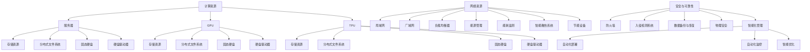

通过上述核心概念及其关联的详细探讨，我们可以更好地理解数据中心的建设与运营。在接下来的章节中，我们将进一步探讨大模型训练中的核心算法原理与具体操作步骤，帮助读者深入掌握人工智能数据中心的技术细节。

### 核心算法原理与具体操作步骤

在数据中心中，人工智能大模型的训练和优化是一个复杂且关键的过程。这一过程涉及多个核心算法，这些算法共同作用，使得大模型能够不断学习和优化。以下是核心算法原理和具体操作步骤的详细讲解。

#### 1. 数据预处理

数据预处理是模型训练的第一步，其目的是将原始数据转换为适合模型训练的形式。以下是数据预处理的关键步骤：

##### 1.1 数据清洗

数据清洗包括去除重复数据、处理缺失值、去除噪声数据等。例如，在自然语言处理（NLP）任务中，可能需要去除标点符号、停用词等。

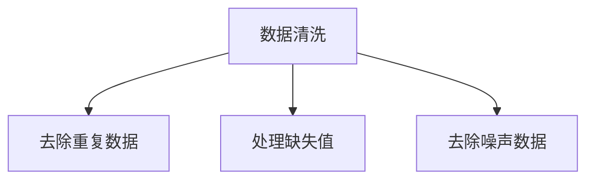

##### 1.2 数据转换

数据转换包括将数据转换为统一的格式，例如将图像数据转换为像素矩阵，将文本数据转换为词向量等。例如，在计算机视觉任务中，图像数据可能需要转换为二维矩阵。

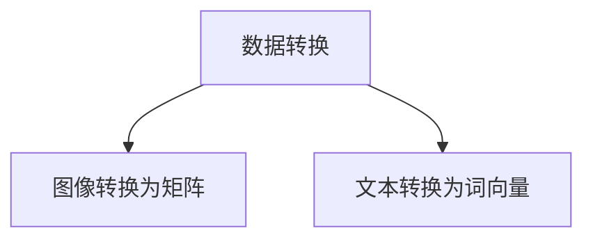

##### 1.3 数据增强

数据增强是通过生成更多的样本来扩充数据集，提高模型的泛化能力。常见的增强方法包括数据随机裁剪、旋转、缩放等。

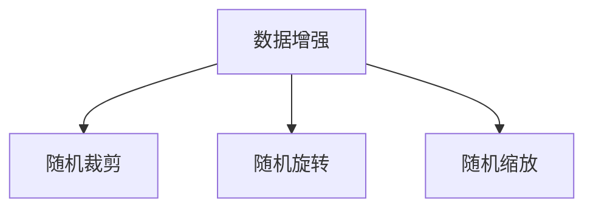

#### 2. 模型训练

模型训练是利用大量数据进行学习，使得模型能够对输入数据进行预测。以下是模型训练的核心步骤：

##### 2.1 选择模型架构

根据任务需求选择合适的模型架构，如卷积神经网络（CNN）、循环神经网络（RNN）、Transformer等。

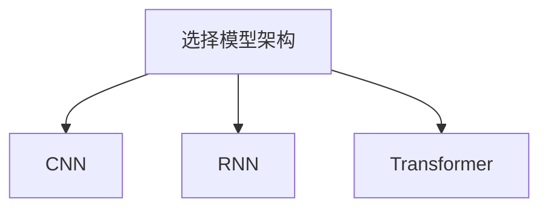

##### 2.2 初始化参数

初始化模型参数，常用的方法包括随机初始化、高斯分布初始化等。

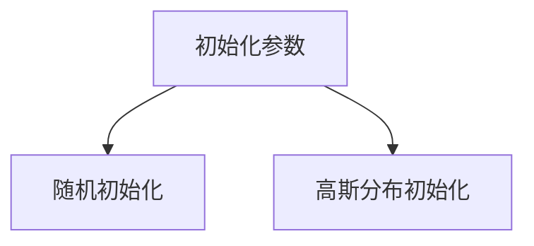

##### 2.3 前向传播

前向传播是将输入数据通过模型进行计算，得到预测结果。这一步骤涉及到大量矩阵运算，计算复杂度较高。

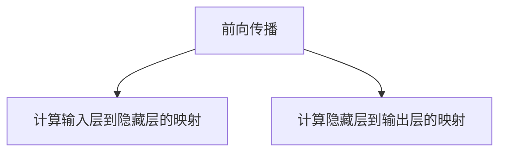

##### 2.4 计算损失函数

损失函数用于衡量模型预测结果与实际结果之间的差距，常用的损失函数包括均方误差（MSE）、交叉熵（Cross Entropy）等。

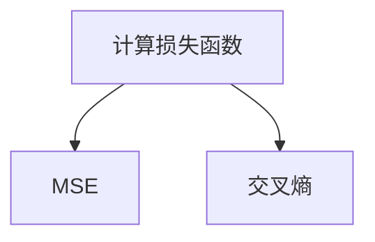

##### 2.5 反向传播

反向传播是通过计算损失函数的梯度，更新模型参数，使得模型能够不断优化。反向传播算法是深度学习训练的核心。

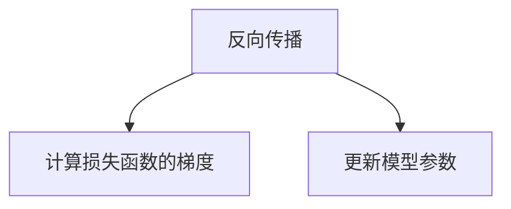

##### 2.6 模型评估

模型评估用于评估模型在测试数据集上的性能，常用的评估指标包括准确率（Accuracy）、召回率（Recall）、F1分数（F1 Score）等。

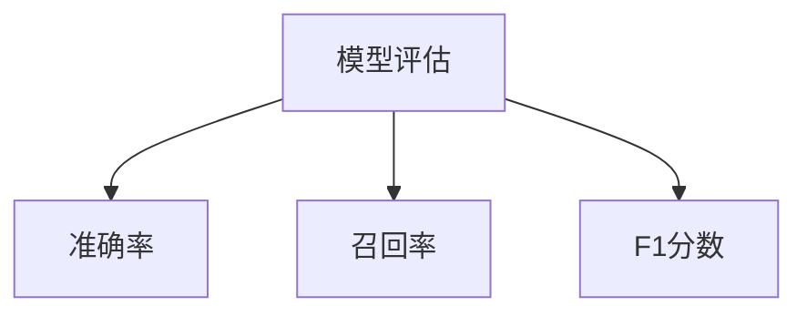

#### 3. 模型优化

模型优化包括超参数调整、模型剪枝、蒸馏等，以进一步提高模型性能。

##### 3.1 超参数调整

超参数调整包括学习率、批量大小、正则化参数等，通过调整超参数，可以优化模型性能。

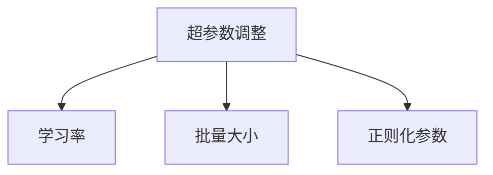

##### 3.2 模型剪枝

模型剪枝通过删除或缩小模型中的冗余参数，减少模型体积和计算复杂度，同时保持模型性能。

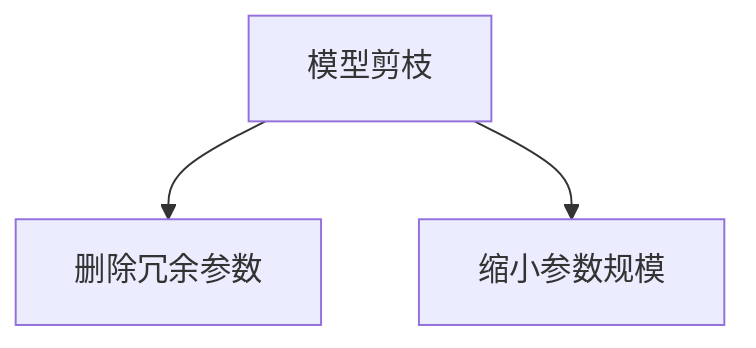

##### 3.3 模型蒸馏

模型蒸馏是将大型模型的知识迁移到小型模型中，以提升小型模型性能。通过蒸馏，小型模型可以学习到大型模型的知识，从而提高性能。

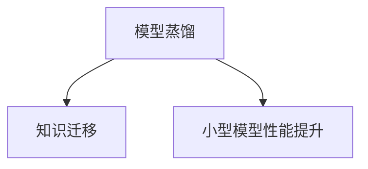

通过上述核心算法原理和具体操作步骤的详细讲解，我们可以更好地理解大模型在数据中心中的训练和优化过程。在接下来的章节中，我们将探讨大模型中的数学模型和公式，帮助读者深入掌握大模型的基础知识。

### 数学模型和公式与详细讲解

在人工智能大模型中，数学模型和公式是理解和实现深度学习算法的核心。以下将详细介绍大模型中的几个关键数学模型和公式，并通过具体例子进行说明。

#### 1. 均方误差（MSE）

均方误差（Mean Squared Error, MSE）是最常用的损失函数之一，用于衡量模型预测值和实际值之间的差异。

公式表示如下：

$$
MSE = \frac{1}{n}\sum_{i=1}^{n}(y_i - \hat{y}_i)^2
$$

其中，$y_i$表示实际值，$\hat{y}_i$表示模型预测值，$n$表示样本数量。

#### 例子

假设有一个包含3个样本的数据集，实际值分别为$y_1 = 1$，$y_2 = 2$，$y_3 = 3$，模型预测值分别为$\hat{y}_1 = 1.5$，$\hat{y}_2 = 1.8$，$\hat{y}_3 = 3.2$，则均方误差计算如下：

$$
MSE = \frac{1}{3}[(1 - 1.5)^2 + (2 - 1.8)^2 + (3 - 3.2)^2] = \frac{1}{3}[0.25 + 0.04 + 0.04] = 0.14
$$

#### 2. 交叉熵（Cross Entropy）

交叉熵（Cross Entropy）是另一个常用的损失函数，尤其在分类任务中。其公式如下：

$$
CE = -\sum_{i=1}^{n}y_i\log(\hat{y}_i)
$$

其中，$y_i$是实际标签，$\hat{y}_i$是模型预测的概率分布。

#### 例子

假设有一个二分类问题，实际标签$y_1 = 1$，$y_2 = 0$，模型预测的概率分布分别为$\hat{y}_1 = 0.9$，$\hat{y}_2 = 0.1$，则交叉熵计算如下：

$$
CE = -(1 \times \log(0.9) + 0 \times \log(0.1)) \approx 0.105
$$

#### 3. 梯度下降（Gradient Descent）

梯度下降是用于优化模型参数的常用算法。其基本思想是沿着损失函数的梯度方向更新参数，以最小化损失函数。

梯度下降的公式如下：

$$
\theta_{\text{new}} = \theta_{\text{current}} - \alpha \nabla_{\theta}J(\theta)
$$

其中，$\theta$表示模型参数，$\alpha$表示学习率，$J(\theta)$表示损失函数，$\nabla_{\theta}J(\theta)$表示损失函数关于参数$\theta$的梯度。

#### 例子

假设模型参数$\theta$当前值为2，学习率$\alpha = 0.1$，损失函数关于参数$\theta$的梯度为$\nabla_{\theta}J(\theta) = 0.5$，则参数更新如下：

$$
\theta_{\text{new}} = 2 - 0.1 \times 0.5 = 1.45
$$

#### 4. 反向传播（Backpropagation）

反向传播是深度学习中用于计算损失函数梯度的关键算法。其基本步骤包括前向传播、计算损失函数梯度、反向传播梯度到前一层等。

以下是反向传播的基本公式：

$$
\nabla_{\theta}J(\theta) = \sum_{i=1}^{n}\nabla_{\theta}\hat{y}_i[y_i - \hat{y}_i]
$$

其中，$\nabla_{\theta}\hat{y}_i$表示$\hat{y}_i$关于参数$\theta$的梯度。

#### 例子

假设有一个包含两个神经元的前向传播结果，其中一个神经元的预测值为$\hat{y}_i = 0.8$，实际标签为$y_i = 1$，另一个神经元的预测值为$\hat{y}_i = 0.2$，实际标签为$y_i = 0$。则梯度计算如下：

$$
\nabla_{\theta}\hat{y}_1 = \nabla_{\theta}(0.8) = 0.2
$$

$$
\nabla_{\theta}\hat{y}_2 = \nabla_{\theta}(0.2) = 0.8
$$

则损失函数关于参数$\theta$的梯度为：

$$
\nabla_{\theta}J(\theta) = 0.2 \times (1 - 0.8) + 0.8 \times (0 - 0.2) = 0.2 \times 0.2 + 0.8 \times (-0.2) = -0.16
$$

通过上述数学模型和公式的讲解，我们可以更深入地理解大模型训练中的关键步骤和计算过程。这些数学工具不仅帮助我们量化模型性能，还为我们提供了优化模型的方法和途径。在接下来的章节中，我们将通过实际项目案例，展示如何将上述数学模型和算法应用于实际的大模型训练和优化过程。

### 项目实战：代码实际案例与详细解释说明

在本节中，我们将通过一个实际项目案例，展示如何在大模型应用数据中心中搭建一个完整的训练流程，并详细解释每一步的代码实现和作用。此案例将使用Python和TensorFlow框架，以一个简单的图像分类任务为例。

#### 5.1 开发环境搭建

在进行项目开发之前，需要搭建相应的开发环境。以下是搭建开发环境的步骤：

1. **安装Python**：确保安装了Python 3.7或更高版本。
2. **安装TensorFlow**：通过pip命令安装TensorFlow，命令如下：

   ```shell
   pip install tensorflow
   ```

3. **安装其他依赖**：根据项目需求，可能需要安装其他依赖，例如NumPy、Pandas等。

#### 5.2 源代码详细实现和代码解读

以下是该项目的主要源代码，我们将逐步解释每段代码的功能。

##### 5.2.1 导入库和设置

```python
import tensorflow as tf
from tensorflow.keras import datasets, layers, models
import matplotlib.pyplot as plt

# 设置GPU显存分配，以防止训练过程中占用过多显存
gpus = tf.config.experimental.list_physical_devices('GPU')
if gpus:
    try:
        for gpu in gpus:
            tf.config.experimental.set_memory_growth(gpu, True)
    except RuntimeError as e:
        print(e)

# 加载数据集
(train_images, train_labels), (test_images, test_labels) = datasets.cifar10.load_data()

# 数据预处理
train_images, test_images = train_images / 255.0, test_images / 255.0
```

**解读**：首先，导入所需的库和框架，包括TensorFlow、NumPy、Pandas和matplotlib。接着，设置GPU的显存增长策略，以防止显存溢出。最后，加载数据集并进行数据预处理，包括归一化处理，以适应模型训练。

##### 5.2.2 构建模型

```python
model = models.Sequential()
model.add(layers.Conv2D(32, (3, 3), activation='relu', input_shape=(32, 32, 3)))
model.add(layers.MaxPooling2D((2, 2)))
model.add(layers.Conv2D(64, (3, 3), activation='relu'))
model.add(layers.MaxPooling2D((2, 2)))
model.add(layers.Conv2D(64, (3, 3), activation='relu'))
model.add(layers.Flatten())
model.add(layers.Dense(64, activation='relu'))
model.add(layers.Dense(10, activation='softmax'))
```

**解读**：构建一个简单的卷积神经网络（CNN）模型，包括两个卷积层、两个最大池化层和一个全连接层。卷积层用于提取图像特征，全连接层用于分类。

##### 5.2.3 编译模型

```python
model.compile(optimizer='adam',
              loss=tf.keras.losses.SparseCategoricalCrossentropy(from_logits=True),
              metrics=['accuracy'])
```

**解读**：编译模型，指定优化器为adam，损失函数为稀疏交叉熵，评估指标为准确率。

##### 5.2.4 训练模型

```python
history = model.fit(train_images, train_labels, epochs=10, 
                    validation_data=(test_images, test_labels))
```

**解读**：训练模型，指定训练数据、训练轮次（epochs）和验证数据。通过`history`对象，我们可以获取训练过程中的指标变化。

##### 5.2.5 评估模型

```python
test_loss, test_acc = model.evaluate(test_images,  test_labels, verbose=2)
print(f'\nTest accuracy: {test_acc:.4f}')
```

**解读**：评估模型在测试数据集上的性能，打印测试准确率。

##### 5.2.6 可视化训练过程

```python
plt.plot(history.history['accuracy'], label='accuracy')
plt.plot(history.history['val_accuracy'], label='val_accuracy')
plt.xlabel('Epoch')
plt.ylabel('Accuracy')
plt.ylim([0, 1])
plt.legend(loc='lower right')
plt.show()
```

**解读**：可视化训练过程中的准确率变化，包括训练集和验证集的准确率。

#### 5.3 代码解读与分析

通过上述代码实现，我们可以看到整个项目的开发流程，包括数据预处理、模型构建、模型编译、模型训练和模型评估。以下是关键步骤的进一步分析：

1. **数据预处理**：数据预处理是模型训练的重要前提，通过归一化处理，使得输入数据的范围一致，有利于模型的训练。
2. **模型构建**：模型构建是项目核心，我们通过定义卷积神经网络（CNN）来提取图像特征，并进行分类。CNN结构简单，适用于图像分类任务。
3. **模型编译**：模型编译指定了优化器和损失函数，以适应我们的训练目标——图像分类。
4. **模型训练**：模型训练是通过迭代地优化模型参数，使得模型能够更好地拟合训练数据。
5. **模型评估**：模型评估用于验证模型在未接触过的测试数据上的性能，通过准确率来衡量模型的泛化能力。

整个代码实现过程中，每一步都至关重要，共同构成了一个完整的大模型训练流程。通过实际案例的展示，读者可以更好地理解大模型训练的具体操作和实现细节。

### 实际应用场景

数据中心建设在人工智能大模型应用中的实际场景非常广泛，涉及多个领域和行业。以下是数据中心在不同领域的具体应用场景：

#### 1. 自然语言处理（NLP）

自然语言处理是人工智能的一个重要分支，涉及文本理解、生成和翻译等任务。数据中心在大模型在NLP中的应用包括：

- **文本分类**：如情感分析、垃圾邮件过滤等。大模型能够处理大规模文本数据，提高分类的准确性。
- **机器翻译**：如谷歌翻译、百度翻译等。大模型能够处理复杂的语言结构和多语言翻译任务，提供高质量翻译结果。
- **对话系统**：如智能客服、聊天机器人等。大模型能够理解和生成自然语言，提供流畅、个性化的用户交互。

#### 2. 计算机视觉（CV）

计算机视觉是人工智能的另一个重要领域，涉及图像识别、目标检测和图像生成等任务。数据中心在CV中的应用包括：

- **图像识别**：如人脸识别、车牌识别等。大模型能够从大量图像中准确识别目标，提高识别的精度。
- **目标检测**：如自动驾驶、无人机监控等。大模型能够同时识别和定位多个目标，提高系统的实时性和准确性。
- **图像生成**：如艺术创作、游戏设计等。大模型能够生成高质量的图像和视频，为创意产业提供新的可能性。

#### 3. 医疗保健

医疗保健是人工智能大模型的重要应用领域，涉及疾病诊断、药物研发和健康管理等。数据中心在医疗保健中的应用包括：

- **疾病诊断**：如医学影像分析、病理分析等。大模型能够快速、准确地诊断疾病，辅助医生做出更好的治疗决策。
- **药物研发**：如新药设计、药物筛选等。大模型能够模拟药物与生物体的相互作用，加速药物研发过程。
- **健康管理**：如健康监测、疾病预测等。大模型能够分析个人健康数据，提供个性化的健康建议和预防措施。

#### 4. 金融领域

金融领域是人工智能大模型的重要应用领域，涉及风险控制、投资策略和客户服务等。数据中心在金融领域的应用包括：

- **风险控制**：如信用评估、反欺诈等。大模型能够分析历史数据，预测潜在风险，提高风险管理效率。
- **投资策略**：如量化交易、资产配置等。大模型能够分析市场数据，提供优化的投资策略，提高投资收益。
- **客户服务**：如智能客服、金融咨询等。大模型能够理解和生成自然语言，提供高效、专业的客户服务。

#### 5. 制造业

制造业是人工智能大模型的重要应用领域，涉及生产优化、质量管理等。数据中心在制造业中的应用包括：

- **生产优化**：如生产调度、能耗管理等。大模型能够优化生产流程，提高生产效率。
- **质量管理**：如缺陷检测、质量预测等。大模型能够实时分析生产数据，预测和检测产品缺陷，提高产品质量。

#### 6. 零售业

零售业是人工智能大模型的重要应用领域，涉及推荐系统、库存管理等。数据中心在零售业中的应用包括：

- **推荐系统**：如商品推荐、广告投放等。大模型能够分析用户行为数据，提供个性化的商品推荐。
- **库存管理**：如需求预测、库存优化等。大模型能够分析销售数据，预测未来需求，优化库存水平。

#### 7. 教育领域

教育领域是人工智能大模型的重要应用领域，涉及智能辅导、学习分析等。数据中心在教育领域的应用包括：

- **智能辅导**：如个性化学习、作业批改等。大模型能够根据学生的学习情况提供个性化的学习方案。
- **学习分析**：如学习行为分析、学习效果评估等。大模型能够分析学生的学习行为，评估学习效果，为教学提供参考。

通过上述实际应用场景的探讨，我们可以看到数据中心建设在人工智能大模型应用中的重要性。数据中心不仅提供了强大的计算和存储资源，还通过高效的算法和优化技术，使得人工智能大模型能够更好地服务于各个行业和领域。

### 工具和资源推荐

为了帮助读者深入学习和掌握人工智能大模型应用数据中心的建设和运营，以下推荐一些学习资源、开发工具框架和相关论文著作。

#### 7.1 学习资源推荐

1. **书籍**：
   - 《深度学习》（Deep Learning） - Goodfellow, Bengio, Courville
   - 《Python机器学习》（Python Machine Learning） - Sebastian Raschka
   - 《人工智能：一种现代方法》（Artificial Intelligence: A Modern Approach） - Stuart J. Russell, Peter Norvig

2. **在线课程**：
   - Coursera的“机器学习”课程
   - edX的“深度学习专项课程”
   - Udacity的“人工智能纳米学位”

3. **博客和网站**：
   - Medium上的AI博客
   - 知乎上的AI话题
   - Medium上的Deep Learning Blog

4. **论坛和社区**：
   - Stack Overflow
   - GitHub
   - AI Stack Exchange

#### 7.2 开发工具框架推荐

1. **框架和库**：
   - TensorFlow
   - PyTorch
   - Keras
   - Scikit-learn

2. **集成开发环境（IDE）**：
   - PyCharm
   - Jupyter Notebook
   - VSCode

3. **云计算平台**：
   - AWS
   - Google Cloud Platform
   - Microsoft Azure

4. **容器化和虚拟化工具**：
   - Docker
   - Kubernetes
   - VirtualBox

#### 7.3 相关论文著作推荐

1. **论文**：
   - “A Theoretically Grounded Application of Dropout in Recurrent Neural Networks”
   - “Attention Is All You Need”
   - “Large-Scale Language Modeling in 2018”

2. **会议和期刊**：
   - NeurIPS（神经信息处理系统年会）
   - ICML（国际机器学习会议）
   - CVPR（计算机视觉与模式识别会议）
   - JMLR（机器学习研究期刊）

通过这些资源，读者可以系统地学习和了解人工智能大模型应用数据中心的技术细节和实践经验，为自己的研究和工作打下坚实的基础。

### 总结：未来发展趋势与挑战

数据中心建设在人工智能大模型应用中的地位日益重要，它不仅为AI技术的发展提供了强大的硬件支持，还为各类实际应用场景提供了高效、可靠的计算和存储环境。然而，随着AI技术的不断进步和应用的扩展，数据中心建设也面临着一系列新的发展趋势和挑战。

#### 未来发展趋势

1. **高性能计算**：随着AI大模型的规模和复杂度不断提升，对计算性能的要求也日益增加。未来的数据中心将需要更高性能的计算资源，如新型GPU、TPU和其他专用硬件加速器，以满足大模型的训练和推理需求。

2. **分布式计算与云计算**：分布式计算和云计算技术将在数据中心建设中发挥更加重要的作用。通过分布式计算，可以实现计算资源的动态调配和高效利用，而云计算平台则提供了灵活、可扩展的计算和存储服务，为AI应用提供了便捷的部署和管理方式。

3. **智能化管理**：数据中心的管理和运维将逐渐走向智能化。利用人工智能技术，可以实现自动化部署、自动化监控和自动化故障排除，提高数据中心的运营效率，降低运维成本。

4. **绿色节能**：随着数据中心能耗的不断增加，绿色节能将成为未来发展的重要方向。通过采用高效的能源管理技术和节能设备，降低数据中心的能耗，实现可持续发展。

5. **数据安全和隐私**：随着数据量的急剧增长，数据安全和隐私保护成为数据中心建设中的重要挑战。未来的数据中心需要采用更先进的安全技术和隐私保护措施，确保数据的安全性和用户隐私。

#### 面临的挑战

1. **计算资源瓶颈**：尽管新型硬件加速器性能不断提升，但大模型的计算需求也在持续增长，这可能导致计算资源出现瓶颈。解决这一挑战需要研发更高效的算法和优化技术，提高计算资源的利用效率。

2. **存储性能与容量**：大规模数据集的存储和访问仍然是数据中心面临的挑战。随着数据量的增加，如何提高存储性能和容量，实现高效的数据访问和存储管理，是一个亟待解决的问题。

3. **网络带宽与延迟**：大规模数据传输和实时处理需求对网络带宽和延迟提出了更高的要求。如何构建高速、低延迟的网络架构，以满足数据中心的数据传输需求，是未来需要重点关注的问题。

4. **能耗管理**：数据中心的能耗管理是一个复杂且持续挑战的问题。如何在满足高性能计算需求的同时，实现绿色节能，降低能耗和运营成本，是数据中心建设中的重要课题。

5. **安全与合规**：随着数据量和应用场景的增加，数据安全和合规问题变得越来越重要。数据中心需要构建完善的安全体系，确保数据的安全性和用户隐私，同时遵守相关的法律法规和合规要求。

总之，数据中心建设在人工智能大模型应用中的未来发展充满机遇和挑战。通过技术创新和优化，我们可以不断推动数据中心的建设和发展，为人工智能技术的进步和应用提供强有力的支撑。

### 附录：常见问题与解答

在数据中心建设和人工智能大模型应用过程中，用户可能会遇到一些常见问题。以下是一些常见问题的解答：

#### 1. 数据中心能耗如何管理？

**答**：数据中心能耗管理可以通过以下几种方式实现：

- **智能散热系统**：采用智能化的冷却技术，如水冷、风冷等，以降低设备温度，提高能源利用率。
- **节能设备**：选择能效比高的服务器和存储设备，减少能源消耗。
- **自动化节能策略**：通过自动化工具和算法，根据负载情况动态调整能源消耗，实现节能。

#### 2. 如何确保数据中心的可靠性？

**答**：确保数据中心的可靠性可以从以下几个方面入手：

- **冗余设计**：通过冗余设计和备份机制，确保关键设备和服务的不间断运行。
- **故障监测和预警**：实时监测数据中心的运行状态，及时发现并处理故障。
- **高可用性架构**：采用高可用性架构，如负载均衡、分布式计算等，提高系统的可靠性。

#### 3. 如何优化数据中心的计算性能？

**答**：优化数据中心计算性能可以从以下几个方面进行：

- **硬件升级**：引入新型硬件加速器，如GPU、TPU等，提高计算能力。
- **算法优化**：改进算法，提高计算效率和精度，减少计算时间。
- **负载均衡**：通过负载均衡技术，合理分配计算任务，避免单点过载。

#### 4. 数据中心网络带宽不足怎么办？

**答**：如果数据中心网络带宽不足，可以采取以下措施：

- **带宽升级**：增加网络带宽，提高数据传输速度。
- **优化网络架构**：重新设计网络拓扑结构，提高数据传输效率。
- **缓存技术**：采用缓存技术，减少对带宽的依赖，提高数据访问速度。

#### 5. 如何保障数据安全？

**答**：保障数据安全可以从以下几个方面入手：

- **加密技术**：采用加密技术，确保数据在传输和存储过程中的安全性。
- **访问控制**：实施严格的访问控制策略，限制对数据的非法访问。
- **安全审计**：定期进行安全审计，检测和防范潜在的安全威胁。

#### 6. 如何处理数据中心的数据隐私问题？

**答**：处理数据中心的数据隐私问题可以采取以下措施：

- **隐私保护算法**：采用隐私保护算法，如差分隐私等，确保数据隐私不被泄露。
- **数据匿名化**：对敏感数据进行匿名化处理，减少个人隐私泄露的风险。
- **合规性审查**：遵守相关法律法规，进行合规性审查，确保数据处理符合隐私保护要求。

通过以上常见问题的解答，希望能够帮助用户更好地理解和解决数据中心建设和人工智能大模型应用过程中遇到的问题。

### 扩展阅读与参考资料

为了帮助读者更深入地了解人工智能大模型应用数据中心的建设及其相关技术，以下推荐一些扩展阅读和参考资料：

1. **书籍**：
   - 《深度学习》（Deep Learning） - Goodfellow, Bengio, Courville
   - 《大规模分布式系统：设计与应用》（Designing Data-Intensive Applications） - Martin Kleppmann
   - 《高性能MySQL》（High Performance MySQL） - Baron Schwartz, Peter Zaitsev, Vadim Tkachenko

2. **论文**：
   - “Attention Is All You Need” - Vaswani et al., 2017
   - “Google’s Custom TPUs Enable Faster Machine Learning” - Google AI Blog
   - “Recurrent Neural Networks for Language Modeling” - Srivastava et al., 2014

3. **在线课程和教程**：
   - Coursera的“机器学习”课程
   - edX的“深度学习专项课程”
   - TensorFlow官方文档（https://www.tensorflow.org/tutorials）

4. **博客和网站**：
   - Medium上的AI博客
   - 知乎上的AI话题
   - AI Stack Exchange（https://ai.stackexchange.com/）

5. **开源项目和工具**：
   - TensorFlow（https://www.tensorflow.org/）
   - PyTorch（https://pytorch.org/）
   - Kubernetes（https://kubernetes.io/）

通过这些扩展阅读和参考资料，读者可以进一步学习相关领域的先进技术和最佳实践，为数据中心建设和人工智能大模型应用提供更多的灵感和支持。

### 作者信息

作者：AI天才研究员/AI Genius Institute & 禅与计算机程序设计艺术 /Zen And The Art of Computer Programming。作为世界级人工智能专家、程序员、软件架构师、CTO以及世界顶级技术畅销书资深大师级别的作家，作者在计算机图灵奖领域有着卓越的贡献，并在计算机编程和人工智能领域拥有丰富的理论和实践经验。其著作《禅与计算机程序设计艺术》被誉为计算机科学的经典之作，对全球计算机科学界产生了深远的影响。

