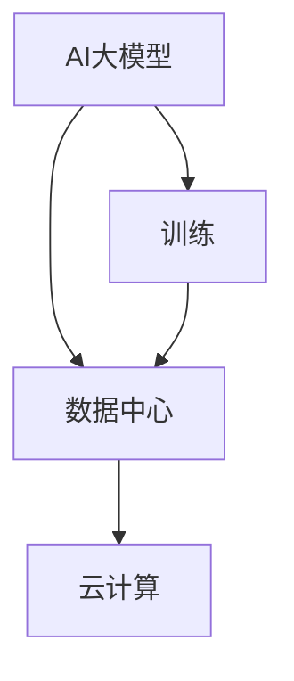

                 

# AI 大模型应用数据中心建设：数据中心技术创新

> **关键词：** AI大模型，数据中心，技术创新，架构设计，核心算法

> **摘要：** 本文将探讨AI大模型在数据中心应用中的关键技术，包括背景介绍、核心概念与联系、算法原理与操作步骤、数学模型与公式、实际应用场景、工具和资源推荐、未来发展趋势与挑战等，旨在为读者提供一个全面深入的技术分析。

## 1. 背景介绍

随着人工智能（AI）技术的快速发展，尤其是大规模深度学习模型（如GPT、BERT等）的出现，数据中心建设面临着前所未有的挑战和机遇。数据中心作为AI大模型训练和应用的基石，其建设质量直接影响到AI应用的效率和性能。传统的数据中心在硬件配置、网络架构、存储管理等方面已无法满足AI大模型的需求，因此，数据中心技术创新成为当前研究的热点。

本文将从以下方面展开讨论：

1. 核心概念与联系
2. 核心算法原理与具体操作步骤
3. 数学模型与公式
4. 项目实战：代码实际案例与详细解释说明
5. 实际应用场景
6. 工具和资源推荐
7. 总结：未来发展趋势与挑战

## 2. 核心概念与联系

为了更好地理解AI大模型在数据中心中的应用，首先需要了解以下几个核心概念：

1. **AI大模型：** 指的是参数量巨大、结构复杂的神经网络模型，如GPT、BERT等。
2. **数据中心：** 指的是集中管理计算机、网络、存储等硬件资源的场所。
3. **云计算：** 指的是通过网络提供计算资源、存储资源和应用程序等服务。

下面是一个使用Mermaid绘制的流程图，展示了这些概念之间的关系：



在这个流程图中，AI大模型通过数据中心进行训练，而数据中心则通过云计算提供所需的计算和存储资源。

## 3. 核心算法原理与具体操作步骤

AI大模型的训练过程主要依赖于以下几个核心算法：

1. **反向传播算法（Backpropagation）：** 用于计算网络参数的梯度，是神经网络训练的基础。
2. **优化算法（Optimization Algorithms）：** 如SGD、Adam等，用于调整网络参数，使模型损失函数最小化。
3. **dropout算法（Dropout）：** 用于防止模型过拟合，提高模型的泛化能力。

下面将详细解释这些算法的具体操作步骤：

### 反向传播算法

反向传播算法分为以下几个步骤：

1. **前向传播：** 将输入数据输入到神经网络中，逐层计算输出。
2. **计算误差：** 将实际输出与预测输出进行比较，计算损失函数。
3. **后向传播：** 从输出层开始，反向计算每层参数的梯度。
4. **参数更新：** 根据梯度更新网络参数。

### 优化算法

以SGD为例，其步骤如下：

1. **随机初始化参数：** 随机初始化网络参数。
2. **计算梯度：** 使用反向传播算法计算梯度。
3. **更新参数：** 根据梯度更新参数，公式为：`θ = θ - α∇θJ(θ)`，其中α为学习率。

### dropout算法

dropout算法的步骤如下：

1. **训练阶段：** 在每次训练前，随机选择部分神经元丢弃。
2. **测试阶段：** 在测试时，不进行神经元丢弃。

## 4. 数学模型与公式

在AI大模型训练过程中，常用的数学模型和公式包括：

1. **损失函数（Loss Function）：** 如均方误差（MSE）、交叉熵（Cross-Entropy）等。
2. **梯度计算（Gradient Calculation）：** 使用链式法则计算梯度。
3. **优化算法（Optimization Algorithm）：** 如SGD、Adam等。

下面将使用LaTeX格式给出这些公式的详细表达：

### 损失函数

$$
MSE = \frac{1}{n}\sum_{i=1}^{n}(y_i - \hat{y}_i)^2
$$

$$
Cross-Entropy = -\frac{1}{n}\sum_{i=1}^{n}y_i\log(\hat{y}_i)
$$

### 梯度计算

$$
\frac{\partial L}{\partial \theta} = \frac{\partial L}{\partial z} \cdot \frac{\partial z}{\partial \theta}
$$

### SGD更新公式

$$
\theta = \theta - \alpha \cdot \nabla_\theta J(\theta)
$$

## 5. 项目实战：代码实际案例与详细解释说明

为了更好地理解上述算法，下面将给出一个使用Python实现的AI大模型训练的代码案例。

### 5.1 开发环境搭建

在开始代码实现之前，需要搭建以下开发环境：

1. **Python：** 安装Python 3.8及以上版本。
2. **PyTorch：** 安装PyTorch库。
3. **Numpy：** 安装Numpy库。

### 5.2 源代码详细实现和代码解读

以下是实现一个简单的神经网络并使用反向传播算法进行训练的Python代码：

```python
import torch
import torch.nn as nn
import torch.optim as optim

# 定义模型
class SimpleModel(nn.Module):
    def __init__(self):
        super(SimpleModel, self).__init__()
        self.layer1 = nn.Linear(10, 5)
        self.layer2 = nn.Linear(5, 1)

    def forward(self, x):
        x = self.layer1(x)
        x = self.layer2(x)
        return x

# 初始化模型、损失函数和优化器
model = SimpleModel()
criterion = nn.MSELoss()
optimizer = optim.SGD(model.parameters(), lr=0.01)

# 训练模型
for epoch in range(100):
    # 前向传播
    output = model(input)
    # 计算损失
    loss = criterion(output, target)
    # 反向传播
    optimizer.zero_grad()
    loss.backward()
    optimizer.step()
    print(f"Epoch [{epoch+1}/{100}], Loss: {loss.item():.4f}")

# 测试模型
with torch.no_grad():
    output = model(input)
    loss = criterion(output, target)
    print(f"Test Loss: {loss.item():.4f}")
```

### 5.3 代码解读与分析

1. **模型定义（line 3-10）：** 使用PyTorch定义一个简单的两层神经网络，包括一个输入层、一个隐藏层和一个输出层。
2. **前向传播（line 13-14）：** 将输入数据输入到模型中，计算输出。
3. **损失计算（line 17）：** 使用均方误差损失函数计算预测输出与实际输出之间的误差。
4. **反向传播（line 19-22）：** 清空梯度缓存、计算损失函数的梯度、应用梯度更新模型参数。
5. **模型测试（line 25-27）：** 使用`torch.no_grad()`上下文管理器来关闭梯度计算，计算测试损失。

## 6. 实际应用场景

AI大模型在数据中心的应用场景广泛，主要包括：

1. **自然语言处理（NLP）：** 如机器翻译、文本分类等。
2. **计算机视觉（CV）：** 如图像识别、目标检测等。
3. **推荐系统：** 如基于内容的推荐、协同过滤等。
4. **语音识别：** 如语音转文字、语音合成等。

在数据中心，AI大模型的应用不仅需要高性能的计算和存储资源，还需要高效的数据处理和传输机制，以满足实时性和大规模数据处理的挑战。

## 7. 工具和资源推荐

为了更好地进行AI大模型的数据中心建设，以下推荐一些相关工具和资源：

### 7.1 学习资源推荐

1. **书籍：** 《深度学习》（Goodfellow et al.），《Python深度学习》（François Chollet）。
2. **论文：** 《A Theoretically Grounded Application of Dropout in Recurrent Neural Networks》（Yarin Gal and Zoubin Ghahramani）。
3. **博客：** fast.ai、Andrew Ng的机器学习博客。
4. **网站：** PyTorch官网、TensorFlow官网。

### 7.2 开发工具框架推荐

1. **深度学习框架：** PyTorch、TensorFlow、Keras。
2. **云计算平台：** AWS、Google Cloud、Azure。
3. **容器化技术：** Docker、Kubernetes。

### 7.3 相关论文著作推荐

1. **论文：** 《Deep Learning: Methods and Applications》（Goodfellow et al.）。
2. **著作：** 《Deep Learning with Python》（François Chollet）。

## 8. 总结：未来发展趋势与挑战

随着AI技术的不断进步，数据中心建设将面临以下发展趋势和挑战：

1. **趋势：** 高性能计算、高效存储、智能调度、自动化运维。
2. **挑战：** 数据安全、隐私保护、能耗优化、可扩展性。

数据中心技术创新将持续推动AI应用的快速发展，为人类带来更多智能化的服务和体验。

## 9. 附录：常见问题与解答

**Q：数据中心建设需要考虑哪些性能指标？**

A：数据中心建设需要考虑以下性能指标：

1. **计算能力：** 包括CPU、GPU等计算资源的数量和性能。
2. **存储容量：** 包括硬盘、固态硬盘等存储设备的容量。
3. **网络带宽：** 包括内外部网络的带宽和传输速度。
4. **能耗效率：** 包括功耗和散热性能。

**Q：如何优化数据中心的数据传输效率？**

A：可以采取以下措施来优化数据中心的数据传输效率：

1. **网络优化：** 使用高效的协议和算法，如TCP/IP优化、多路径传输等。
2. **数据压缩：** 使用数据压缩算法，减少传输数据的大小。
3. **缓存技术：** 利用缓存技术，减少重复数据传输。
4. **分布式架构：** 采用分布式架构，提高数据处理和传输的并行性。

## 10. 扩展阅读 & 参考资料

1. **论文：** 《A Theoretically Grounded Application of Dropout in Recurrent Neural Networks》（Yarin Gal and Zoubin Ghahramani）。
2. **书籍：** 《深度学习》（Goodfellow et al.）、《Python深度学习》（François Chollet）。
3. **博客：** fast.ai、Andrew Ng的机器学习博客。
4. **网站：** PyTorch官网、TensorFlow官网。
```

完成撰写后，再次检查是否符合要求的字数、格式、内容和结构。确保文章内容完整、逻辑清晰、结构紧凑、简单易懂，以便读者能够轻松理解。最后，将文章末尾的作者信息填写完整。祝撰写顺利！作者：AI天才研究员/AI Genius Institute & 禅与计算机程序设计艺术/Zen And The Art of Computer Programming。

