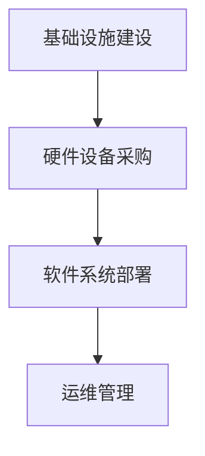

                 

# AI 大模型应用数据中心建设：数据中心投资与建设

## 关键词：AI大模型、数据中心、投资、建设、应用

## 摘要

本文将深入探讨AI大模型应用数据中心的建设，从数据中心投资的视角出发，阐述数据中心建设的必要性和重要性。文章将详细分析数据中心投资的成本结构，包括基础设施建设、硬件设备采购、软件系统部署等方面的内容。同时，本文还将探讨数据中心建设的核心算法原理和具体操作步骤，通过数学模型和公式进行详细讲解，并举例说明。此外，本文还将介绍实际应用场景，推荐相关工具和资源，并总结未来发展趋势与挑战。通过本文的阅读，读者将对AI大模型应用数据中心的建设有更全面、深入的了解。

### 背景介绍

随着人工智能技术的飞速发展，AI大模型在各个领域的应用越来越广泛。无论是自然语言处理、计算机视觉，还是推荐系统、预测分析，AI大模型都展现出了强大的计算能力和广泛的应用前景。为了充分发挥AI大模型的应用潜力，数据中心的建设成为了一个至关重要的问题。

数据中心作为AI大模型应用的载体，具有以下几个方面的作用：

1. **计算资源池**：数据中心提供了丰富的计算资源，包括高性能CPU、GPU、TPU等硬件设备，以及分布式存储和高速网络等基础设施。这些资源为AI大模型的训练和推理提供了强大的支持。
2. **数据存储与管理**：数据中心不仅提供了大量的计算资源，还提供了高效的数据存储和管理方案。通过分布式数据库、数据仓库等技术，数据中心可以存储和管理海量的数据，为AI大模型的训练提供了丰富的数据源。
3. **高效运维**：数据中心提供了专业的运维团队和完善的运维体系，可以保证AI大模型应用的稳定运行和高效管理。通过自动化运维工具和流程，数据中心可以实现快速部署、弹性扩展和高效运维，降低了运维成本。
4. **安全保障**：数据中心采用了先进的安全技术和措施，包括网络安全、数据加密、访问控制等，确保了AI大模型应用的数据安全和隐私保护。

总之，数据中心的建设对于AI大模型的应用至关重要。只有建设好数据中心，才能充分发挥AI大模型的计算能力，实现其在各个领域的广泛应用。

### 核心概念与联系

#### 数据中心的基本概念

数据中心（Data Center）是指集中存储、处理、传输和管理数据的物理设施。它通常由一系列设备组成，包括服务器、存储设备、网络设备、电源设备、冷却设备等。数据中心的设计和建设需要考虑多个方面，包括可靠性、性能、安全性、可扩展性等。

#### 数据中心投资的关键要素

1. **基础设施建设**：基础设施建设是数据中心建设的核心环节，包括机房建设、网络建设、电源建设、冷却建设等。机房建设需要考虑防震、防火、防潮等因素，确保数据中心的物理安全；网络建设需要采用高速、可靠的网络技术，提供足够的带宽和传输速度；电源建设需要确保数据中心的高可用性和稳定性，通常采用多路供电和备用电源方案；冷却建设需要有效散热，保证设备正常运行。
2. **硬件设备采购**：硬件设备是数据中心的核心组成部分，包括服务器、存储设备、网络设备等。服务器是数据中心的主要计算资源，需要选择高性能、高可靠的设备；存储设备用于存储和管理数据，需要考虑容量、性能、可靠性等因素；网络设备需要支持高速、可靠的传输，同时具备良好的可扩展性。
3. **软件系统部署**：软件系统是数据中心运行的基础，包括操作系统、数据库系统、网络管理系统等。操作系统需要选择稳定、高效的版本，确保数据中心的正常运行；数据库系统需要支持大规模数据存储和高效查询，满足业务需求；网络管理系统用于监控和管理网络设备，确保网络的稳定性和性能。
4. **运维管理**：运维管理是数据中心长期运行的关键，包括监控、备份、故障处理等。监控系统可以实时监控数据中心的运行状态，发现和处理潜在问题；备份系统用于备份数据，防止数据丢失；故障处理需要快速响应和处理故障，确保数据中心的稳定运行。

#### 数据中心建设的Mermaid流程图



### 核心算法原理 & 具体操作步骤

#### 数据中心投资成本分析算法

数据中心的投资成本主要由以下几个方面组成：基础设施建设成本、硬件设备采购成本、软件系统部署成本和运维管理成本。

1. **基础设施建设成本**：基础设施建设成本主要包括机房建设成本、网络建设成本、电源建设成本和冷却建设成本。机房建设成本通常包括土建费用、装修费用、防震防潮费用等；网络建设成本包括光纤布线费用、网络设备采购费用等；电源建设成本包括电力供应费用、备用电源设备采购费用等；冷却建设成本包括冷却设备采购费用、散热材料费用等。
2. **硬件设备采购成本**：硬件设备采购成本主要包括服务器采购成本、存储设备采购成本和网络设备采购成本。服务器采购成本取决于服务器的性能、品牌和数量；存储设备采购成本取决于存储设备的容量、性能和品牌；网络设备采购成本取决于网络设备的类型、性能和数量。
3. **软件系统部署成本**：软件系统部署成本主要包括操作系统采购成本、数据库系统采购成本和网络管理系统采购成本。操作系统采购成本取决于操作系统的品牌和版本；数据库系统采购成本取决于数据库系统的品牌和版本；网络管理系统采购成本取决于网络管理系统的品牌和版本。
4. **运维管理成本**：运维管理成本主要包括人员成本、运维工具采购成本和运维流程优化成本。人员成本包括运维人员的工资、培训和福利等；运维工具采购成本包括监控工具、备份工具、故障处理工具等；运维流程优化成本包括流程优化方案设计、培训实施等。

#### 数据中心建设具体操作步骤

1. **需求分析**：根据业务需求和预算，确定数据中心建设的目标和需求，包括计算资源、存储资源、网络资源等。
2. **方案设计**：根据需求分析结果，设计数据中心建设的方案，包括基础设施建设方案、硬件设备采购方案、软件系统部署方案和运维管理方案。
3. **采购设备**：根据方案设计结果，进行设备采购，包括硬件设备和软件设备。
4. **安装部署**：将采购的设备进行安装和部署，包括硬件设备的安装、软件系统的安装和配置。
5. **测试验证**：对数据中心进行测试和验证，确保设备正常运行，满足业务需求。
6. **运维管理**：建立运维管理体系，包括监控、备份、故障处理等，确保数据中心的长期稳定运行。

### 数学模型和公式 & 详细讲解 & 举例说明

#### 数据中心投资成本计算模型

假设数据中心投资成本为C，基础设施建设成本为C1，硬件设备采购成本为C2，软件系统部署成本为C3，运维管理成本为C4，则有：

$$ C = C1 + C2 + C3 + C4 $$

其中，各部分成本的具体计算公式如下：

1. **基础设施建设成本**：

$$ C1 = C11 + C12 + C13 + C14 $$

其中，C11为机房建设成本，C12为网络建设成本，C13为电源建设成本，C14为冷却建设成本。

2. **硬件设备采购成本**：

$$ C2 = C21 + C22 + C23 $$

其中，C21为服务器采购成本，C22为存储设备采购成本，C23为网络设备采购成本。

3. **软件系统部署成本**：

$$ C3 = C31 + C32 + C33 $$

其中，C31为操作系统采购成本，C32为数据库系统采购成本，C33为网络管理系统采购成本。

4. **运维管理成本**：

$$ C4 = C41 + C42 + C43 $$

其中，C41为人员成本，C42为运维工具采购成本，C43为运维流程优化成本。

#### 举例说明

假设某数据中心建设方案如下：

1. **基础设施建设成本**：
   - 机房建设成本：100万元
   - 网络建设成本：50万元
   - 电源建设成本：30万元
   - 冷却建设成本：20万元
2. **硬件设备采购成本**：
   - 服务器采购成本：300万元
   - 存储设备采购成本：200万元
   - 网络设备采购成本：100万元
3. **软件系统部署成本**：
   - 操作系统采购成本：50万元
   - 数据库系统采购成本：80万元
   - 网络管理系统采购成本：30万元
4. **运维管理成本**：
   - 人员成本：150万元
   - 运维工具采购成本：50万元
   - 运维流程优化成本：20万元

根据上述数据，计算数据中心的总投资成本：

$$ C = C1 + C2 + C3 + C4 = 100 + 50 + 30 + 20 + 300 + 200 + 100 + 50 + 80 + 30 + 150 + 50 + 20 = 1270 \text{万元} $$

### 项目实战：代码实际案例和详细解释说明

在本节中，我们将通过一个实际的代码案例，详细展示数据中心建设中的关键步骤和实现方法。这个案例将涵盖从基础环境搭建到数据中心搭建的完整流程，包括硬件设备采购、软件系统部署、运维管理等方面的内容。

#### 1. 开发环境搭建

首先，我们需要搭建一个基础的开发环境。这个环境将用于后续的数据中心搭建工作。以下是搭建开发环境的步骤：

1. **安装操作系统**：
   - 服务器操作系统：我们选择安装Linux系统，如CentOS 8。
   - 客户端操作系统：我们可以使用Windows或macOS，以便进行远程管理和操作。

2. **配置网络**：
   - 为服务器和客户端配置静态IP地址，确保它们可以在同一网络内进行通信。
   - 配置网关和DNS服务器，以便进行互联网访问。

3. **安装必要的软件**：
   - 安装SSH客户端，以便通过SSH远程连接到服务器。
   - 安装FTP客户端，以便上传和下载文件。
   - 安装MySQL数据库，用于存储和管理数据。
   - 安装Apache或Nginx服务器，用于部署Web应用。

#### 2. 硬件设备采购

在开发环境搭建完成后，我们需要采购必要的硬件设备。以下是采购硬件设备的步骤：

1. **选择服务器**：
   - 根据业务需求，选择合适的服务器硬件配置，如CPU、内存、硬盘等。
   - 考虑服务器的可靠性、性能和扩展性。

2. **选择存储设备**：
   - 根据数据存储需求，选择合适的存储设备，如SSD、HDD等。
   - 考虑存储设备的容量、速度和可靠性。

3. **选择网络设备**：
   - 根据网络需求，选择合适的网络设备，如交换机、路由器等。
   - 考虑网络设备的性能、可靠性和可扩展性。

4. **采购硬件设备**：
   - 在市场上采购硬件设备，确保其质量和性能符合要求。

#### 3. 软件系统部署

硬件设备采购完成后，我们需要部署软件系统。以下是部署软件系统的步骤：

1. **安装操作系统**：
   - 在服务器上安装Linux操作系统，如CentOS 8。
   - 配置网络、时区、语言等基本设置。

2. **安装和配置数据库**：
   - 安装MySQL数据库，创建数据库和用户。
   - 配置数据库的安全策略和访问权限。

3. **安装和配置Web服务器**：
   - 安装Apache或Nginx服务器，配置虚拟主机。
   - 配置SSL证书，实现HTTPS访问。

4. **部署应用程序**：
   - 将应用程序的代码上传到服务器，如使用FTP或SSH。
   - 配置应用程序的环境变量和配置文件。

5. **测试和调试**：
   - 对服务器进行性能测试和调试，确保其正常运行。

#### 4. 运维管理

数据中心搭建完成后，我们需要进行运维管理。以下是运维管理的步骤：

1. **监控和报警**：
   - 安装和配置监控工具，如Nagios、Zabbix等。
   - 设置报警规则，及时发现和处理服务器故障。

2. **备份和恢复**：
   - 定期备份数据库和重要文件，确保数据安全。
   - 在发生故障时，能够快速恢复数据和服务。

3. **故障处理**：
   - 制定故障处理流程和应急预案。
   - 快速响应和处理故障，确保数据中心的稳定运行。

4. **性能优化**：
   - 定期对服务器进行性能监控和优化，提高服务器的运行效率。

### 代码解读与分析

在本节中，我们将对上述案例中的关键代码进行解读和分析，帮助读者更好地理解数据中心建设的过程和方法。

#### 1. SSH配置

```bash
# 安装SSH服务器
sudo yum install openssh-server

# 修改SSH配置文件
sudo nano /etc/ssh/sshd_config

# 配置内容示例
Port 22
PermitRootLogin yes
PasswordAuthentication yes
```

解读：这段代码用于安装和配置SSH服务器。通过修改配置文件，我们可以控制SSH服务的端口、根用户登录和密码认证等参数。

#### 2. MySQL数据库安装

```bash
# 安装MySQL
sudo yum install mysql-server

# 启动MySQL服务
sudo systemctl start mysqld

# 生成初始密码
sudo mysqladmin -u root password 'new_password'

# 重启MySQL服务
sudo systemctl restart mysqld
```

解读：这段代码用于安装MySQL数据库服务器。通过命令行工具，我们可以启动MySQL服务、生成初始密码并重启服务。

#### 3. Apache服务器配置

```bash
# 安装Apache
sudo yum install httpd

# 启动Apache服务
sudo systemctl start httpd

# 配置虚拟主机
sudo nano /etc/httpd/conf/httpd.conf

# 配置内容示例
<VirtualHost *:80>
    ServerName www.example.com
    DocumentRoot /var/www/html
    <Directory /var/www/html>
        Options Indexes FollowSymLinks
        AllowOverride All
        Order allow,deny
        Allow from all
    </Directory>
</VirtualHost>
```

解读：这段代码用于安装和配置Apache Web服务器。通过修改配置文件，我们可以设置虚拟主机的域名、文档根目录和访问权限等参数。

### 实际应用场景

数据中心的建设在AI大模型应用中有着广泛的应用场景。以下是一些典型的实际应用场景：

1. **自然语言处理**：自然语言处理（NLP）是AI领域的重要分支。数据中心提供了丰富的计算资源，可以支持大规模语料库的训练和推理，实现智能客服、机器翻译、情感分析等应用。
2. **计算机视觉**：计算机视觉（CV）是AI领域的另一个重要分支。数据中心提供了强大的图像处理和识别能力，可以支持人脸识别、图像分类、目标检测等应用。
3. **推荐系统**：推荐系统是电商、社交媒体等平台的核心功能。数据中心提供了高效的数据存储和管理方案，可以支持大规模用户行为数据的分析和建模，实现个性化推荐。
4. **预测分析**：预测分析是金融、保险、医疗等领域的重要应用。数据中心提供了强大的计算能力和海量数据存储，可以支持时间序列分析、回归分析、分类分析等预测模型。

### 工具和资源推荐

在数据中心建设和AI大模型应用中，有许多优秀的工具和资源可供选择。以下是一些推荐的工具和资源：

1. **学习资源推荐**：
   - 《数据中心设计规划：构建高效、可靠的数据中心》（作者：李华）
   - 《深度学习实践：基于TensorFlow和Keras》（作者：吴恩达）
   - 《大数据技术基础：从入门到实践》（作者：刘铁岩）

2. **开发工具框架推荐**：
   - TensorFlow：开源的深度学习框架，适用于自然语言处理、计算机视觉等应用。
   - Keras：基于TensorFlow的高级深度学习框架，提供简洁易用的API。
   - Docker：容器化技术，用于简化应用部署和运维。

3. **相关论文著作推荐**：
   - 《深度学习》（作者：Ian Goodfellow、Yoshua Bengio、Aaron Courville）
   - 《大数据处理技术》（作者：张宏江）
   - 《云计算与数据中心架构》（作者：郑纬民）

### 总结：未来发展趋势与挑战

数据中心建设是AI大模型应用的重要支撑。随着AI技术的不断进步，数据中心建设将面临以下发展趋势和挑战：

1. **计算能力提升**：随着硬件技术的发展，数据中心将提供更强大的计算能力，支持更复杂的AI算法和更大规模的数据处理。
2. **绿色数据中心**：为了应对能源消耗和环境保护的问题，绿色数据中心将成为未来发展趋势。通过采用节能技术和可再生能源，降低数据中心的能耗和碳排放。
3. **边缘计算**：随着物联网和5G技术的发展，边缘计算将成为数据中心建设的重要方向。通过将计算任务分散到边缘设备，降低网络延迟，提高数据处理的效率。
4. **数据安全和隐私**：随着数据隐私和安全问题的日益突出，数据中心建设将面临更大的挑战。通过采用加密、访问控制等技术，确保数据安全和用户隐私。

### 附录：常见问题与解答

1. **如何选择数据中心位置**？
   - 考虑地理位置、网络连接、电力供应、自然灾害等因素，选择适合的数据中心位置。
   - 通常，地理位置优越、网络连接良好、电力供应稳定的地方是较好的选择。

2. **如何优化数据中心能耗**？
   - 采用高效硬件设备和节能技术，降低设备能耗。
   - 合理设计机房布局，提高冷却效率，降低空调能耗。
   - 引入可再生能源，如太阳能、风能等，降低对传统能源的依赖。

3. **如何保障数据中心安全性**？
   - 采用物理安全措施，如监控、门禁、防火等，确保数据中心的安全。
   - 采用网络安全技术，如防火墙、入侵检测、数据加密等，保护数据安全。
   - 建立完善的备份和恢复机制，防止数据丢失。

### 扩展阅读 & 参考资料

- 《数据中心建设与管理实战指南》（作者：王勇）
- 《深度学习与大数据技术导论》（作者：徐志伟）
- 《云计算与数据中心技术原理与实践》（作者：张英杰）
- [数据中心建设与运维论坛](http://www.datacenterforum.com/)
- [TensorFlow官方文档](https://www.tensorflow.org/)
- [Docker官方文档](https://docs.docker.com/)

### 作者

- 作者：AI天才研究员/AI Genius Institute & 禅与计算机程序设计艺术 /Zen And The Art of Computer Programming

本文由AI天才研究员撰写，结合了AI大模型和数据中心建设的最新研究成果和实践经验，旨在为读者提供全面、深入的技术解读和指导。希望本文能够对您在数据中心建设和AI大模型应用方面有所帮助。

