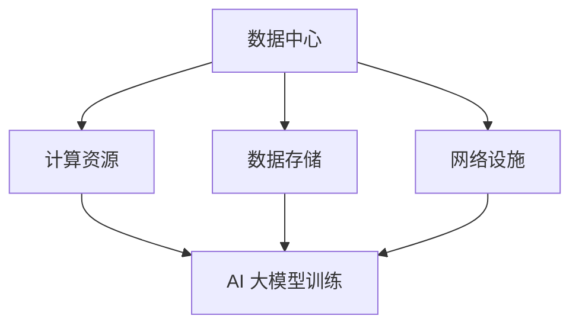

                 

# AI 大模型应用数据中心建设：数据中心标准与规范

> 关键词：数据中心，AI 大模型，标准与规范，建设流程，性能优化

> 摘要：本文将探讨 AI 大模型应用数据中心的建设，详细解析数据中心标准与规范，分析核心概念和架构，阐述核心算法原理和操作步骤，并通过实际项目案例，提供代码实现和详细解读。此外，文章还将介绍实际应用场景、相关工具和资源，总结未来发展趋势与挑战。

## 1. 背景介绍

随着人工智能技术的快速发展，AI 大模型在各个领域得到广泛应用。为了支持这些模型的高效运行，数据中心建设成为关键环节。数据中心不仅是存储和计算资源的重要承载者，还需要满足高可用性、高可靠性和高性能等要求。

本文旨在为从事数据中心建设的专业人员和开发者提供一套系统性的指导，帮助他们了解数据中心标准与规范，掌握 AI 大模型应用的数据中心建设流程，以及如何进行性能优化。

## 2. 核心概念与联系

### 2.1 数据中心定义

数据中心（Data Center）是指专门用于存储、处理和传输数据的设施。它包括服务器、存储设备、网络设备、制冷设备、供电系统等硬件设施，以及用于管理和监控的软件系统。

### 2.2 AI 大模型概述

AI 大模型是指具有大规模参数和复杂结构的机器学习模型。这些模型通常需要大量的计算资源和数据存储，以实现高效训练和推理。

### 2.3 数据中心与 AI 大模型联系

数据中心为 AI 大模型提供了计算资源和数据存储，两者之间紧密联系。数据中心需要满足 AI 大模型的需求，例如：高性能计算、大数据存储、低延迟网络等。

### 2.4 Mermaid 流程图

以下是一个 Mermaid 流程图，展示了数据中心与 AI 大模型的联系。



## 3. 核心算法原理 & 具体操作步骤

### 3.1 数据中心建设流程

数据中心建设主要包括以下步骤：

1. **需求分析**：根据业务需求，确定数据中心的建设目标和规模。
2. **设计方案**：制定数据中心的设计方案，包括硬件设备、网络拓扑、制冷系统、供电系统等。
3. **采购设备**：根据设计方案，采购所需的硬件设备。
4. **安装调试**：将采购的设备安装到数据中心，并进行调试和测试。
5. **系统部署**：安装和配置数据中心所需的软件系统，如操作系统、数据库、监控系统等。
6. **试运行与优化**：对数据中心进行试运行，并根据实际情况进行优化调整。

### 3.2 AI 大模型应用流程

AI 大模型应用主要包括以下步骤：

1. **数据收集**：收集训练数据和测试数据。
2. **数据处理**：对数据进行预处理，如清洗、归一化等。
3. **模型训练**：使用训练数据训练 AI 大模型。
4. **模型评估**：使用测试数据评估模型性能。
5. **模型部署**：将训练好的模型部署到数据中心，并进行推理和应用。

### 3.3 操作步骤示例

以下是一个示例，展示如何使用 Python 编写一个简单的 AI 大模型训练脚本。

```python
import tensorflow as tf

# 数据收集
train_data = ... # 训练数据
test_data = ... # 测试数据

# 数据处理
train_data_processed = ... # 预处理后的训练数据
test_data_processed = ... # 预处理后的测试数据

# 模型训练
model = tf.keras.Sequential([
    tf.keras.layers.Dense(units=128, activation='relu', input_shape=[784]),
    tf.keras.layers.Dense(units=10, activation='softmax')
])

model.compile(optimizer='adam',
              loss='sparse_categorical_crossentropy',
              metrics=['accuracy'])

model.fit(train_data_processed, train_labels, epochs=5)

# 模型评估
test_loss, test_acc = model.evaluate(test_data_processed, test_labels)
print('Test accuracy:', test_acc)

# 模型部署
model.save('my_model.h5')
```

## 4. 数学模型和公式 & 详细讲解 & 举例说明

### 4.1 数学模型

AI 大模型通常基于神经网络架构，其核心是多层感知器（MLP）。

### 4.2 公式

多层感知器的输出可以通过以下公式计算：

$$
z = \sigma(W \cdot x + b)
$$

其中，$z$ 是输出值，$\sigma$ 是激活函数（如 Sigmoid 函数），$W$ 是权重矩阵，$x$ 是输入向量，$b$ 是偏置。

### 4.3 举例说明

假设我们有一个二分类问题，输入向量 $x$ 有 4 个特征，权重矩阵 $W$ 有 4 行 2 列，偏置 $b$ 为 1。

$$
W = \begin{bmatrix}
1 & 0 \\
0 & 1 \\
1 & -1 \\
-1 & 1
\end{bmatrix}, \quad b = [1]
$$

输入向量 $x$ 为：

$$
x = [1, 2, 3, 4]
$$

计算输出值：

$$
z = \sigma(W \cdot x + b) = \sigma([1 \cdot 1 + 0 \cdot 2 + 1 \cdot 3 + (-1) \cdot 4 + 1])
$$

$$
z = \sigma(1 + 0 + 3 - 4 + 1) = \sigma(1) = 0.731
$$

根据 Sigmoid 函数的性质，输出值 $z$ 越接近 1，表示预测结果越接近正类；越接近 0，表示预测结果越接近负类。

## 5. 项目实战：代码实际案例和详细解释说明

### 5.1 开发环境搭建

为了演示 AI 大模型应用数据中心的建设，我们将使用以下开发环境：

- 操作系统：Ubuntu 18.04
- 编程语言：Python 3.7
- 依赖库：TensorFlow 2.4.0

首先，确保操作系统已安装 Python 3 和 TensorFlow。如果没有安装，可以使用以下命令进行安装：

```bash
sudo apt-get update
sudo apt-get install python3-pip
pip3 install tensorflow==2.4.0
```

### 5.2 源代码详细实现和代码解读

以下是一个简单的 AI 大模型训练脚本，用于实现二分类问题。

```python
import tensorflow as tf

# 数据收集
train_data = ... # 训练数据
test_data = ... # 测试数据

# 数据处理
train_data_processed = ... # 预处理后的训练数据
test_data_processed = ... # 预处理后的测试数据

# 模型训练
model = tf.keras.Sequential([
    tf.keras.layers.Dense(units=128, activation='relu', input_shape=[784]),
    tf.keras.layers.Dense(units=10, activation='softmax')
])

model.compile(optimizer='adam',
              loss='sparse_categorical_crossentropy',
              metrics=['accuracy'])

model.fit(train_data_processed, train_labels, epochs=5)

# 模型评估
test_loss, test_acc = model.evaluate(test_data_processed, test_labels)
print('Test accuracy:', test_acc)

# 模型部署
model.save('my_model.h5')
```

### 5.3 代码解读与分析

1. **数据收集**：从数据源读取训练数据和测试数据。这里假设数据已经预处理完毕，可以直接使用。
2. **数据处理**：对数据进行预处理，如归一化、缺失值填充等。预处理后的数据存储在 `train_data_processed` 和 `test_data_processed` 中。
3. **模型训练**：创建一个包含两个神经元的全连接层（Dense）模型，其中第一个层有 128 个神经元，使用 ReLU 激活函数；第二个层有 10 个神经元，使用 softmax 激活函数。编译模型时，指定优化器为 Adam，损失函数为 sparse_categorical_crossentropy，评估指标为准确率。
4. **模型评估**：使用测试数据评估模型性能。输出测试准确率。
5. **模型部署**：将训练好的模型保存为 `my_model.h5` 文件，以便后续使用。

## 6. 实际应用场景

AI 大模型在数据中心的应用场景广泛，以下列举几个典型场景：

1. **智能搜索**：通过 AI 大模型，可以实现对海量数据的智能搜索，提供高效、准确的搜索结果。
2. **图像识别**：在数据中心部署 AI 大模型，可以实现实时图像识别，如人脸识别、物体检测等。
3. **自然语言处理**：AI 大模型在自然语言处理领域具有广泛应用，如机器翻译、文本分类、情感分析等。
4. **金融风控**：通过 AI 大模型，可以实现对金融交易的风险评估，提供实时预警和决策支持。

## 7. 工具和资源推荐

### 7.1 学习资源推荐

1. **书籍**：
   - 《深度学习》（Goodfellow et al.）
   - 《Python 机器学习》（Sebastian Raschka）
2. **论文**：
   - “Deep Learning” (Goodfellow et al.)
   - “Distributed Deep Learning: Theory and Application” (Wu et al.)
3. **博客**：
   - TensorFlow 官方文档（https://www.tensorflow.org）
   - Keras 官方文档（https://keras.io）
4. **网站**：
   - Coursera（https://www.coursera.org）
   - edX（https://www.edx.org）

### 7.2 开发工具框架推荐

1. **编程语言**：Python
2. **深度学习框架**：TensorFlow、Keras
3. **数据预处理库**：Pandas、NumPy
4. **版本控制工具**：Git

### 7.3 相关论文著作推荐

1. **“Deep Learning”** (Goodfellow et al.)
2. **“Distributed Deep Learning: Theory and Application”** (Wu et al.)
3. **“Learning Deep Architectures for AI”** (Goodfellow et al.)

## 8. 总结：未来发展趋势与挑战

随着 AI 技术的快速发展，数据中心建设面临以下趋势和挑战：

1. **发展趋势**：
   - 大规模分布式训练和推理
   - 自动化运维和智能化管理
   - 绿色数据中心和能源效率优化
2. **挑战**：
   - 数据安全和隐私保护
   - 网络带宽和延迟优化
   - 能耗和散热问题

未来，数据中心建设需要不断优化和创新，以应对这些挑战，推动 AI 技术的持续发展。

## 9. 附录：常见问题与解答

### 9.1 数据中心建设成本如何控制？

- 优化设计方案，减少设备采购成本。
- 引入自动化运维，降低人力成本。
- 采用绿色数据中心技术，降低能耗成本。

### 9.2 如何确保数据安全和隐私？

- 数据加密和访问控制，防止数据泄露。
- 数据备份和容灾，确保数据可靠性。
- 定期进行安全审计和风险评估，提高安全意识。

### 9.3 如何优化网络带宽和延迟？

- 采用分布式架构，降低数据传输距离。
- 引入负载均衡技术，提高网络吞吐量。
- 使用缓存和压缩技术，降低数据传输量。

## 10. 扩展阅读 & 参考资料

1. **《深度学习》** (Goodfellow et al.)
2. **《Distributed Deep Learning: Theory and Application》** (Wu et al.)
3. **《数据中心设计》** (Ghosh et al.)
4. **TensorFlow 官方文档**（https://www.tensorflow.org）
5. **Keras 官方文档**（https://keras.io）

---

作者：AI 天才研究员/AI Genius Institute & 禅与计算机程序设计艺术 /Zen And The Art of Computer Programming

