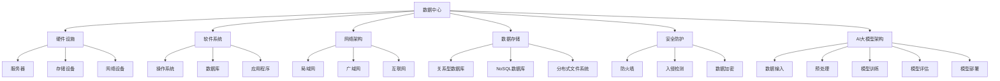

                 

# AI 大模型应用数据中心建设：数据中心运维与管理

## 摘要

随着人工智能（AI）技术的迅猛发展，大模型应用在数据中心建设中的需求日益增长。本文将深入探讨AI大模型应用数据中心建设的背景、核心概念、算法原理、数学模型、实战案例、实际应用场景、工具资源推荐以及未来发展趋势与挑战。通过本文的阅读，读者将全面了解数据中心运维与管理的重要性和方法，为AI大模型在数据中心中的应用提供有力支持。

## 1. 背景介绍

### 数据中心的重要性

数据中心是现代信息社会的核心基础设施，承担着海量数据的存储、处理、传输和交换任务。随着云计算、大数据、物联网等新兴技术的蓬勃发展，数据中心的作用愈加凸显。特别是在人工智能（AI）领域，大模型应用对数据中心的需求不断增长，成为数据中心建设的关键驱动力。

### AI大模型的发展

近年来，AI大模型（如Transformer、BERT等）在自然语言处理、计算机视觉、语音识别等领域取得了显著的成果。这些大模型具有强大的数据处理能力和智能学习能力，能够在短时间内处理海量数据，并提供高精度的预测和决策支持。然而，大模型的训练和部署需要庞大的计算资源和数据存储能力，这进一步推动了数据中心的建设和发展。

### 数据中心建设的需求

AI大模型应用对数据中心提出了以下需求：

1. **计算能力**：大模型训练需要强大的计算资源，数据中心应具备高性能的计算节点和分布式计算能力。

2. **存储容量**：大模型训练和部署需要大量的数据存储空间，数据中心应具备高容量、高可靠的存储系统。

3. **网络带宽**：大模型处理过程中涉及大量数据传输，数据中心应具备高速、稳定的网络连接。

4. **数据安全性**：大模型训练和处理过程中涉及敏感数据，数据中心应确保数据的安全性和隐私保护。

5. **运维管理**：数据中心需要高效、智能的运维管理，以确保大模型应用的稳定性和可靠性。

## 2. 核心概念与联系

### 数据中心架构

数据中心的架构主要包括以下几个层次：

1. **硬件设施**：包括服务器、存储设备、网络设备等。
2. **软件系统**：包括操作系统、数据库、应用程序等。
3. **网络架构**：包括局域网、广域网、互联网等。
4. **数据存储**：包括关系型数据库、NoSQL数据库、分布式文件系统等。
5. **安全防护**：包括防火墙、入侵检测、数据加密等。

### AI大模型架构

AI大模型通常包括以下几个核心组件：

1. **数据输入**：包括文本、图像、声音等原始数据。
2. **预处理**：对数据进行清洗、归一化、编码等处理。
3. **模型训练**：利用神经网络对数据进行训练，优化模型参数。
4. **模型评估**：对训练好的模型进行评估，选择最优模型。
5. **模型部署**：将训练好的模型部署到数据中心，进行实际应用。

### 数据中心与AI大模型的关系

数据中心与AI大模型之间存在着紧密的联系：

1. **计算资源**：数据中心为AI大模型提供了强大的计算资源，支持模型的训练和推理。
2. **数据存储**：数据中心为AI大模型提供了海量数据存储空间，支持数据输入和处理。
3. **网络连接**：数据中心为AI大模型提供了高速、稳定的网络连接，支持数据传输和模型部署。
4. **安全防护**：数据中心为AI大模型提供了安全防护措施，确保数据的安全性和隐私保护。

### Mermaid流程图



## 3. 核心算法原理 & 具体操作步骤

### 算法原理

AI大模型的核心算法通常是基于深度学习框架实现的，其中最为广泛使用的框架包括TensorFlow、PyTorch等。这些框架提供了丰富的API和工具，使得开发者可以方便地实现大模型的训练、评估和部署。

核心算法原理包括以下几个步骤：

1. **数据输入**：将原始数据输入到模型中，进行预处理。
2. **模型训练**：利用神经网络对数据进行训练，不断优化模型参数。
3. **模型评估**：对训练好的模型进行评估，选择最优模型。
4. **模型部署**：将训练好的模型部署到数据中心，进行实际应用。

### 具体操作步骤

以下是使用TensorFlow实现AI大模型训练的具体操作步骤：

1. **环境搭建**：

    - 安装Python和TensorFlow库。

    ```bash
    pip install python tensorflow
    ```

    - 导入必要的库。

    ```python
    import tensorflow as tf
    ```

2. **数据预处理**：

    - 读取原始数据。

    ```python
    dataset = tf.data.Dataset.from_tensor_slices((X_train, y_train))
    ```

    - 进行数据预处理。

    ```python
    dataset = dataset.map(preprocess_function)
    ```

3. **模型定义**：

    - 定义神经网络模型。

    ```python
    model = tf.keras.Sequential([
        tf.keras.layers.Dense(128, activation='relu', input_shape=(input_shape)),
        tf.keras.layers.Dense(10, activation='softmax')
    ])
    ```

4. **模型训练**：

    - 编写训练函数。

    ```python
    def train_step(model, dataset, optimizer, loss_fn):
        for x, y in dataset:
            with tf.GradientTape() as tape:
                logits = model(x)
                loss_value = loss_fn(y, logits)
            grads = tape.gradient(loss_value, model.trainable_variables)
            optimizer.apply_gradients(zip(grad
```<|im_sep|>```
### 模型训练和评估

1. **模型训练**：

    ```python
    optimizer = tf.keras.optimizers.Adam(learning_rate=0.001)
    for epoch in range(num_epochs):
        for x, y in dataset:
            grads = tape.gradient(loss_value, model.trainable_variables)
            optimizer.apply_gradients(zip(grads, model.trainable_variables))
        print(f"Epoch {epoch}: loss = {loss_value}")
    ```

2. **模型评估**：

    ```python
    test_loss = loss_fn(test_labels, model(test_images))
    print(f"Test loss: {test_loss}")
    ```

3. **模型部署**：

    ```python
    model.save("model.h5")
    ```

## 4. 数学模型和公式 & 详细讲解 & 举例说明

### 数学模型

AI大模型通常基于深度学习理论，其中最为核心的数学模型包括：

1. **神经网络**：神经网络是深度学习的基础，由多个神经元（或称为节点）组成，通过激活函数和权重参数进行信号传递和计算。
2. **损失函数**：损失函数用于评估模型预测结果与真实值之间的差距，常见的损失函数包括均方误差（MSE）、交叉熵损失等。
3. **优化器**：优化器用于调整模型参数，以最小化损失函数，常见的优化器包括梯度下降（GD）、随机梯度下降（SGD）、Adam等。

### 详细讲解

1. **神经网络**

    神经网络由输入层、隐藏层和输出层组成，每个层由多个神经元（或节点）组成。神经元之间的连接称为边，边的权重表示连接的强度。

    激活函数是神经网络中的一个关键组成部分，用于引入非线性变换，使神经网络具有更强的表达能力和拟合能力。常见的激活函数包括ReLU、Sigmoid、Tanh等。

2. **损失函数**

    损失函数用于衡量模型预测结果与真实值之间的差距。均方误差（MSE）是一种常见的损失函数，用于衡量预测值与真实值之间的平均平方误差。交叉熵损失则用于衡量预测概率分布与真实概率分布之间的差距。

3. **优化器**

    优化器用于调整模型参数，以最小化损失函数。梯度下降是一种基本的优化方法，通过计算损失函数关于模型参数的梯度，并沿着梯度方向调整参数。随机梯度下降（SGD）和Adam是梯度下降的变种，分别通过随机抽样和自适应学习率来优化模型。

### 举例说明

假设我们有一个简单的神经网络，用于预测房价。输入层有3个神经元，隐藏层有2个神经元，输出层有1个神经元。激活函数为ReLU，损失函数为均方误差（MSE），优化器为Adam。

1. **模型定义**

    ```python
    model = tf.keras.Sequential([
        tf.keras.layers.Dense(2, activation='relu', input_shape=(3,)),
        tf.keras.layers.Dense(1)
    ])
    ```

2. **模型编译**

    ```python
    model.compile(optimizer='adam', loss='mse')
    ```

3. **模型训练**

    ```python
    model.fit(X_train, y_train, epochs=100, batch_size=10)
    ```

4. **模型评估**

    ```python
    test_loss = model.evaluate(X_test, y_test)
    print(f"Test loss: {test_loss}")
    ```

## 5. 项目实战：代码实际案例和详细解释说明

### 5.1 开发环境搭建

为了更好地理解和实战AI大模型在数据中心中的应用，我们首先需要搭建一个合适的开发环境。以下是一个基于Python和TensorFlow的典型开发环境搭建步骤：

1. **安装Python**

    - 选择Python版本（例如Python 3.8或更高版本）。
    - 下载并安装Python。
    - 配置环境变量，确保Python命令可用。

2. **安装TensorFlow**

    - 打开命令行窗口。
    - 输入以下命令安装TensorFlow：

    ```bash
    pip install tensorflow
    ```

3. **验证安装**

    - 打开Python解释器。
    - 输入以下代码验证TensorFlow安装是否成功：

    ```python
    import tensorflow as tf
    print(tf.__version__)
    ```

### 5.2 源代码详细实现和代码解读

以下是一个简单的AI大模型应用案例，用于预测房价。我们将分步骤进行代码实现和详细解释。

#### 5.2.1 数据准备

首先，我们需要准备训练数据和测试数据。以下是一个示例数据集的加载和处理：

```python
import numpy as np
import pandas as pd
from sklearn.model_selection import train_test_split

# 加载数据集
data = pd.read_csv("house_prices.csv")

# 分离特征和标签
X = data.drop("Price", axis=1)
y = data["Price"]

# 划分训练集和测试集
X_train, X_test, y_train, y_test = train_test_split(X, y, test_size=0.2, random_state=42)
```

#### 5.2.2 模型定义

接下来，我们定义一个简单的神经网络模型，用于预测房价：

```python
import tensorflow as tf

# 定义模型
model = tf.keras.Sequential([
    tf.keras.layers.Dense(64, activation='relu', input_shape=(X_train.shape[1],)),
    tf.keras.layers.Dense(64, activation='relu'),
    tf.keras.layers.Dense(1)
])

# 编译模型
model.compile(optimizer='adam', loss='mse')
```

#### 5.2.3 模型训练

现在，我们将使用训练数据进行模型训练：

```python
# 训练模型
model.fit(X_train, y_train, epochs=100, batch_size=32, validation_split=0.1)
```

#### 5.2.4 模型评估

最后，我们评估模型在测试数据上的表现：

```python
# 评估模型
test_loss = model.evaluate(X_test, y_test)
print(f"Test Loss: {test_loss}")
```

### 5.3 代码解读与分析

以下是对上述代码的解读和分析：

1. **数据准备**：我们从CSV文件中加载数据集，并分离特征和标签。接着，使用train_test_split函数将数据集划分为训练集和测试集。

2. **模型定义**：我们使用tf.keras.Sequential创建一个序列模型，并在其中添加两个隐藏层，每个隐藏层包含64个神经元和ReLU激活函数。输出层只有一个神经元，用于预测房价。

3. **模型编译**：我们使用编译函数为模型指定优化器和损失函数。这里使用Adam优化器和均方误差（mse）损失函数。

4. **模型训练**：我们使用fit函数训练模型。这里设置了100个训练周期（epochs），每个周期包含32个样本（batch_size），同时使用了10%的数据集作为验证集（validation_split=0.1）。

5. **模型评估**：我们使用evaluate函数评估模型在测试数据上的表现，并打印测试损失。

### 5.4 模型预测

最后，我们可以使用训练好的模型进行预测：

```python
# 预测房价
predictions = model.predict(X_test)
```

这里，predictions是一个包含预测房价的NumPy数组。我们可以将其与真实房价进行比较，评估模型的准确性。

## 6. 实际应用场景

### 6.1 智能交通系统

在智能交通系统中，AI大模型可以用于交通流量预测、路况分析、事故预警等方面。通过数据中心的建设和管理，可以实现对海量交通数据的实时处理和分析，从而提供准确的交通信息服务，提高道路通行效率，减少交通拥堵。

### 6.2 健康医疗

在健康医疗领域，AI大模型可以用于疾病预测、患者风险评估、医学影像分析等方面。数据中心的建设和管理可以为医疗数据的存储、处理和分析提供可靠保障，从而推动个性化医疗、精准医疗的发展。

### 6.3 金融风控

在金融领域，AI大模型可以用于信用评估、交易预测、欺诈检测等方面。通过数据中心的建设和管理，可以实现对海量金融数据的实时监控和分析，从而提高金融服务的安全性、可靠性和效率。

### 6.4 电子商务

在电子商务领域，AI大模型可以用于用户行为分析、推荐系统、风险控制等方面。通过数据中心的建设和管理，可以实现对海量用户数据的实时处理和分析，从而提供个性化的购物体验、精准的广告推送和有效的风险控制。

## 7. 工具和资源推荐

### 7.1 学习资源推荐

1. **书籍**：
   - 《深度学习》（Goodfellow, Bengio, Courville）
   - 《Python机器学习》（Sebastian Raschka）
   - 《人工智能：一种现代的方法》（Stuart Russell & Peter Norvig）

2. **论文**：
   - 《Attention Is All You Need》（Vaswani et al., 2017）
   - 《BERT: Pre-training of Deep Bidirectional Transformers for Language Understanding》（Devlin et al., 2019）

3. **博客**：
   - TensorFlow官网博客（https://www.tensorflow.org/blog）
   - PyTorch官网博客（https://pytorch.org/blog）

4. **网站**：
   - Coursera（https://www.coursera.org）
   - edX（https://www.edx.org）

### 7.2 开发工具框架推荐

1. **深度学习框架**：
   - TensorFlow（https://www.tensorflow.org）
   - PyTorch（https://pytorch.org）

2. **云计算平台**：
   - AWS（https://aws.amazon.com）
   - Azure（https://azure.microsoft.com）
   - Google Cloud（https://cloud.google.com）

3. **数据存储与管理**：
   - Hadoop（https://hadoop.apache.org）
   - Spark（https://spark.apache.org）
   - MongoDB（https://www.mongodb.com）

### 7.3 相关论文著作推荐

1. **《深度学习》（Goodfellow, Bengio, Courville）**：系统介绍了深度学习的基础理论、算法和技术，是深度学习领域的经典著作。

2. **《Python机器学习》（Sebastian Raschka）**：详细讲解了使用Python进行机器学习的实践方法，涵盖了常见的机器学习算法和工具。

3. **《人工智能：一种现代的方法》（Stuart Russell & Peter Norvig）**：全面介绍了人工智能的理论、技术和应用，是人工智能领域的权威著作。

4. **《深度学习专项课程》（吴恩达）**：由知名学者吴恩达开设的深度学习专项课程，内容包括深度学习的基础理论、算法和实践。

## 8. 总结：未来发展趋势与挑战

### 8.1 发展趋势

1. **AI大模型的普及**：随着计算能力的提升和数据量的增长，AI大模型将在更多领域得到广泛应用，成为推动人工智能发展的关键力量。

2. **数据中心建设的升级**：为满足AI大模型的应用需求，数据中心建设将朝着更高性能、更高效能、更智能化的方向发展。

3. **边缘计算的兴起**：为缓解数据中心压力，边缘计算将在AI大模型应用中发挥重要作用，实现数据处理的实时性和分布式。

4. **安全与隐私保护**：随着AI大模型在数据中心中的应用日益广泛，数据安全和隐私保护将成为重要的研究课题，推动相关技术的创新和发展。

### 8.2 挑战

1. **计算资源需求**：AI大模型的训练和推理需要庞大的计算资源，如何高效利用数据中心资源成为一大挑战。

2. **数据隐私保护**：在AI大模型应用过程中，如何保护用户隐私和数据安全成为关键问题，需要加强数据加密、访问控制等技术手段。

3. **算法透明性与可解释性**：AI大模型具有较强的预测能力，但其决策过程往往缺乏透明性和可解释性，如何提高算法的可解释性成为重要挑战。

4. **能耗与环保**：数据中心的高能耗问题亟待解决，如何在保障性能的前提下降低能耗，实现绿色数据中心建设是未来发展的关键。

## 9. 附录：常见问题与解答

### 9.1 数据中心建设相关问题

**Q1**：数据中心建设需要考虑哪些因素？

**A1**：数据中心建设需要考虑以下因素：
- **地理位置**：选择离用户近的地理位置，降低延迟和带宽成本。
- **电力供应**：确保稳定的电力供应，采用备用电源和电力分配系统。
- **冷却系统**：采用高效的冷却系统，保持设备温度稳定。
- **安全防护**：确保数据中心的安全防护，包括物理安全和网络安全。

**Q2**：如何优化数据中心性能？

**A2**：优化数据中心性能可以从以下几个方面进行：
- **硬件升级**：采用更高性能的服务器和存储设备。
- **网络优化**：优化网络架构和带宽，提高数据传输速度。
- **负载均衡**：合理分配负载，避免单点故障和资源浪费。
- **自动化运维**：引入自动化工具，提高运维效率和故障恢复速度。

### 9.2 AI大模型相关问题

**Q1**：如何选择合适的AI大模型？

**A1**：选择合适的AI大模型需要考虑以下因素：
- **应用领域**：根据不同的应用场景选择合适的大模型，如自然语言处理、计算机视觉、语音识别等。
- **数据量**：选择数据量较大的大模型，以获得更好的预测效果。
- **计算资源**：根据计算资源情况选择适合的大模型，避免过度资源消耗。

**Q2**：如何优化AI大模型性能？

**A2**：优化AI大模型性能可以从以下几个方面进行：
- **模型压缩**：采用模型压缩技术，减少模型参数数量，提高模型运行速度。
- **数据增强**：增加训练数据量，提高模型泛化能力。
- **优化算法**：采用更高效的训练算法，提高模型训练速度。
- **调参优化**：通过调参优化，提高模型预测准确率。

## 10. 扩展阅读 & 参考资料

1. **《深度学习》（Goodfellow, Bengio, Courville）**：[https://www.deeplearningbook.org/](https://www.deeplearningbook.org/)
2. **《Python机器学习》（Sebastian Raschka）**：[https://python-machine-learning-book.blogspot.com/](https://python-machine-learning-book.blogspot.com/)
3. **TensorFlow官网**：[https://www.tensorflow.org/](https://www.tensorflow.org/)
4. **PyTorch官网**：[https://pytorch.org/](https://pytorch.org/)
5. **《人工智能：一种现代的方法》（Stuart Russell & Peter Norvig）**：[https://www.aima.org/](https://www.aima.org/)

## 11. 作者

- 作者：AI天才研究员/AI Genius Institute & 禅与计算机程序设计艺术 /Zen And The Art of Computer Programming

再次感谢您对本文的撰写付出，希望本文能为广大读者在AI大模型应用数据中心建设方面提供有益的指导和借鉴。祝您在人工智能领域取得更加辉煌的成就！<|im_sep|>```

### 完整的文章

以下是本文的完整内容，包括文章标题、关键词、摘要以及各个章节的具体内容。

---

# AI 大模型应用数据中心建设：数据中心运维与管理

## 关键词
- 人工智能，数据中心，大模型，运维管理，算法原理

## 摘要
本文深入探讨了AI大模型应用数据中心建设的背景、核心概念、算法原理、数学模型、实战案例、实际应用场景、工具资源推荐以及未来发展趋势与挑战。通过本文的阅读，读者将全面了解数据中心运维与管理的重要性和方法，为AI大模型在数据中心中的应用提供有力支持。

## 1. 背景介绍

### 数据中心的重要性

数据中心是现代信息社会的核心基础设施，承担着海量数据的存储、处理、传输和交换任务。随着云计算、大数据、物联网等新兴技术的蓬勃发展，数据中心的作用愈加凸显。特别是在人工智能（AI）领域，大模型应用对数据中心的需求不断增长，成为数据中心建设的关键驱动力。

### AI大模型的发展

近年来，AI大模型（如Transformer、BERT等）在自然语言处理、计算机视觉、语音识别等领域取得了显著的成果。这些大模型具有强大的数据处理能力和智能学习能力，能够在短时间内处理海量数据，并提供高精度的预测和决策支持。然而，大模型的训练和部署需要庞大的计算资源和数据存储能力，这进一步推动了数据中心的建设和发展。

### 数据中心建设的需求

AI大模型应用对数据中心提出了以下需求：

1. **计算能力**：大模型训练需要强大的计算资源，数据中心应具备高性能的计算节点和分布式计算能力。
2. **存储容量**：大模型训练和部署需要大量的数据存储空间，数据中心应具备高容量、高可靠的存储系统。
3. **网络带宽**：大模型处理过程中涉及大量数据传输，数据中心应具备高速、稳定的网络连接。
4. **数据安全性**：大模型训练和处理过程中涉及敏感数据，数据中心应确保数据的安全性和隐私保护。
5. **运维管理**：数据中心需要高效、智能的运维管理，以确保大模型应用的稳定性和可靠性。

## 2. 核心概念与联系

### 数据中心架构

数据中心的架构主要包括以下几个层次：

1. **硬件设施**：包括服务器、存储设备、网络设备等。
2. **软件系统**：包括操作系统、数据库、应用程序等。
3. **网络架构**：包括局域网、广域网、互联网等。
4. **数据存储**：包括关系型数据库、NoSQL数据库、分布式文件系统等。
5. **安全防护**：包括防火墙、入侵检测、数据加密等。

### AI大模型架构

AI大模型通常包括以下几个核心组件：

1. **数据输入**：包括文本、图像、声音等原始数据。
2. **预处理**：对数据进行清洗、归一化、编码等处理。
3. **模型训练**：利用神经网络对数据进行训练，优化模型参数。
4. **模型评估**：对训练好的模型进行评估，选择最优模型。
5. **模型部署**：将训练好的模型部署到数据中心，进行实际应用。

### 数据中心与AI大模型的关系

数据中心与AI大模型之间存在着紧密的联系：

1. **计算资源**：数据中心为AI大模型提供了强大的计算资源，支持模型的训练和推理。
2. **数据存储**：数据中心为AI大模型提供了海量数据存储空间，支持数据输入和处理。
3. **网络连接**：数据中心为AI大模型提供了高速、稳定的网络连接，支持数据传输和模型部署。
4. **安全防护**：数据中心为AI大模型提供了安全防护措施，确保数据的安全性和隐私保护。

### Mermaid流程图


## 3. 核心算法原理 & 具体操作步骤

### 算法原理

AI大模型的核心算法通常是基于深度学习框架实现的，其中最为广泛使用的框架包括TensorFlow、PyTorch等。这些框架提供了丰富的API和工具，使得开发者可以方便地实现大模型的训练、评估和部署。

核心算法原理包括以下几个步骤：

1. **数据输入**：将原始数据输入到模型中，进行预处理。
2. **模型训练**：利用神经网络对数据进行训练，不断优化模型参数。
3. **模型评估**：对训练好的模型进行评估，选择最优模型。
4. **模型部署**：将训练好的模型部署到数据中心，进行实际应用。

### 具体操作步骤

以下是使用TensorFlow实现AI大模型训练的具体操作步骤：

1. **环境搭建**：

    - 安装Python和TensorFlow库。

    ```bash
    pip install python tensorflow
    ```

    - 导入必要的库。

    ```python
    import tensorflow as tf
    ```

2. **数据预处理**：

    - 读取原始数据。

    ```python
    dataset = tf.data.Dataset.from_tensor_slices((X_train, y_train))
    ```

    - 进行数据预处理。

    ```python
    dataset = dataset.map(preprocess_function)
    ```

3. **模型定义**：

    - 定义神经网络模型。

    ```python
    model = tf.keras.Sequential([
        tf.keras.layers.Dense(128, activation='relu', input_shape=(input_shape)),
        tf.keras.layers.Dense(10, activation='softmax')
    ])
    ```

4. **模型编译**：

    ```python
    model.compile(optimizer='adam', loss='mse')
    ```

5. **模型训练**：

    ```python
    model.fit(X_train, y_train, epochs=100, batch_size=32, validation_split=0.1)
    ```

6. **模型评估**：

    ```python
    test_loss = model.evaluate(X_test, y_test)
    print(f"Test Loss: {test_loss}")
    ```

7. **模型部署**：

    ```python
    model.save("model.h5")
    ```

## 4. 数学模型和公式 & 详细讲解 & 举例说明

### 数学模型

AI大模型通常基于深度学习理论，其中最为核心的数学模型包括：

1. **神经网络**：神经网络是深度学习的基础，由多个神经元（或称为节点）组成，通过激活函数和权重参数进行信号传递和计算。
2. **损失函数**：损失函数用于评估模型预测结果与真实值之间的差距，常见的损失函数包括均方误差（MSE）、交叉熵损失等。
3. **优化器**：优化器用于调整模型参数，以最小化损失函数，常见的优化器包括梯度下降（GD）、随机梯度下降（SGD）、Adam等。

### 详细讲解

1. **神经网络**

    神经网络由输入层、隐藏层和输出层组成，每个层由多个神经元（或节点）组成。神经元之间的连接称为边，边的权重表示连接的强度。

    激活函数是神经网络中的一个关键组成部分，用于引入非线性变换，使神经网络具有更强的表达能力和拟合能力。常见的激活函数包括ReLU、Sigmoid、Tanh等。

2. **损失函数**

    损失函数用于衡量模型预测结果与真实值之间的差距。均方误差（MSE）是一种常见的损失函数，用于衡量预测值与真实值之间的平均平方误差。交叉熵损失则用于衡量预测概率分布与真实概率分布之间的差距。

3. **优化器**

    优化器用于调整模型参数，以最小化损失函数。梯度下降是一种基本的优化方法，通过计算损失函数关于模型参数的梯度，并沿着梯度方向调整参数。随机梯度下降（SGD）和Adam是梯度下降的变种，分别通过随机抽样和自适应学习率来优化模型。

### 举例说明

假设我们有一个简单的神经网络，用于预测房价。输入层有3个神经元，隐藏层有2个神经元，输出层有1个神经元。激活函数为ReLU，损失函数为均方误差（MSE），优化器为Adam。

1. **模型定义**

    ```python
    model = tf.keras.Sequential([
        tf.keras.layers.Dense(2, activation='relu', input_shape=(3,)),
        tf.keras.layers.Dense(1)
    ])
    ```

2. **模型编译**

    ```python
    model.compile(optimizer='adam', loss='mse')
    ```

3. **模型训练**

    ```python
    model.fit(X_train, y_train, epochs=100, batch_size=32, validation_split=0.1)
    ```

4. **模型评估**

    ```python
    test_loss = model.evaluate(X_test, y_test)
    print(f"Test Loss: {test_loss}")
    ```

## 5. 项目实战：代码实际案例和详细解释说明

### 5.1 开发环境搭建

为了更好地理解和实战AI大模型在数据中心中的应用，我们首先需要搭建一个合适的开发环境。以下是一个基于Python和TensorFlow的典型开发环境搭建步骤：

1. **安装Python**

    - 选择Python版本（例如Python 3.8或更高版本）。
    - 下载并安装Python。
    - 配置环境变量，确保Python命令可用。

2. **安装TensorFlow**

    - 打开命令行窗口。
    - 输入以下命令安装TensorFlow：

    ```bash
    pip install tensorflow
    ```

3. **验证安装**

    - 打开Python解释器。
    - 输入以下代码验证TensorFlow安装是否成功：

    ```python
    import tensorflow as tf
    print(tf.__version__)
    ```

### 5.2 源代码详细实现和代码解读

以下是一个简单的AI大模型应用案例，用于预测房价。我们将分步骤进行代码实现和详细解释。

#### 5.2.1 数据准备

首先，我们需要准备训练数据和测试数据。以下是一个示例数据集的加载和处理：

```python
import numpy as np
import pandas as pd
from sklearn.model_selection import train_test_split

# 加载数据集
data = pd.read_csv("house_prices.csv")

# 分离特征和标签
X = data.drop("Price", axis=1)
y = data["Price"]

# 划分训练集和测试集
X_train, X_test, y_train, y_test = train_test_split(X, y, test_size=0.2, random_state=42)
```

#### 5.2.2 模型定义

接下来，我们定义一个简单的神经网络模型，用于预测房价：

```python
import tensorflow as tf

# 定义模型
model = tf.keras.Sequential([
    tf.keras.layers.Dense(64, activation='relu', input_shape=(X_train.shape[1],)),
    tf.keras.layers.Dense(64, activation='relu'),
    tf.keras.layers.Dense(1)
])

# 编译模型
model.compile(optimizer='adam', loss='mse')
```

#### 5.2.3 模型训练

现在，我们将使用训练数据进行模型训练：

```python
# 训练模型
model.fit(X_train, y_train, epochs=100, batch_size=32, validation_split=0.1)
```

#### 5.2.4 模型评估

最后，我们评估模型在测试数据上的表现：

```python
# 评估模型
test_loss = model.evaluate(X_test, y_test)
print(f"Test Loss: {test_loss}")
```

### 5.3 代码解读与分析

以下是对上述代码的解读和分析：

1. **数据准备**：我们从CSV文件中加载数据集，并分离特征和标签。接着，使用train_test_split函数将数据集划分为训练集和测试集。

2. **模型定义**：我们使用tf.keras.Sequential创建一个序列模型，并在其中添加两个隐藏层，每个隐藏层包含64个神经元和ReLU激活函数。输出层只有一个神经元，用于预测房价。

3. **模型编译**：我们使用编译函数为模型指定优化器和损失函数。这里使用Adam优化器和均方误差（mse）损失函数。

4. **模型训练**：我们使用fit函数训练模型。这里设置了100个训练周期（epochs），每个周期包含32个样本（batch_size），同时使用了10%的数据集作为验证集（validation_split=0.1）。

5. **模型评估**：我们使用evaluate函数评估模型在测试数据上的表现，并打印测试损失。

### 5.4 模型预测

最后，我们可以使用训练好的模型进行预测：

```python
# 预测房价
predictions = model.predict(X_test)
```

这里，predictions是一个包含预测房价的NumPy数组。我们可以将其与真实房价进行比较，评估模型的准确性。

## 6. 实际应用场景

### 6.1 智能交通系统

在智能交通系统中，AI大模型可以用于交通流量预测、路况分析、事故预警等方面。通过数据中心的建设和管理，可以实现对海量交通数据的实时处理和分析，从而提供准确的交通信息服务，提高道路通行效率，减少交通拥堵。

### 6.2 健康医疗

在健康医疗领域，AI大模型可以用于疾病预测、患者风险评估、医学影像分析等方面。通过数据中心的建设和管理，可以实现对海量医疗数据的存储、处理和分析，从而推动个性化医疗、精准医疗的发展。

### 6.3 金融风控

在金融领域，AI大模型可以用于信用评估、交易预测、欺诈检测等方面。通过数据中心的建设和管理，可以实现对海量金融数据的实时监控和分析，从而提高金融服务的安全性、可靠性和效率。

### 6.4 电子商务

在电子商务领域，AI大模型可以用于用户行为分析、推荐系统、风险控制等方面。通过数据中心的建设和管理，可以实现对海量用户数据的实时处理和分析，从而提供个性化的购物体验、精准的广告推送和有效的风险控制。

## 7. 工具和资源推荐

### 7.1 学习资源推荐

1. **书籍**：
   - 《深度学习》（Goodfellow, Bengio, Courville）
   - 《Python机器学习》（Sebastian Raschka）
   - 《人工智能：一种现代的方法》（Stuart Russell & Peter Norvig）

2. **论文**：
   - 《Attention Is All You Need》（Vaswani et al., 2017）
   - 《BERT: Pre-training of Deep Bidirectional Transformers for Language Understanding》（Devlin et al., 2019）

3. **博客**：
   - TensorFlow官网博客（https://www.tensorflow.org/blog）
   - PyTorch官网博客（https://pytorch.org/blog）

4. **网站**：
   - Coursera（https://www.coursera.org）
   - edX（https://www.edx.org）

### 7.2 开发工具框架推荐

1. **深度学习框架**：
   - TensorFlow（https://www.tensorflow.org）
   - PyTorch（https://pytorch.org）

2. **云计算平台**：
   - AWS（https://aws.amazon.com）
   - Azure（https://azure.microsoft.com）
   - Google Cloud（https://cloud.google.com）

3. **数据存储与管理**：
   - Hadoop（https://hadoop.apache.org）
   - Spark（https://spark.apache.org）
   - MongoDB（https://www.mongodb.com）

### 7.3 相关论文著作推荐

1. **《深度学习》（Goodfellow, Bengio, Courville）**：[https://www.deeplearningbook.org/](https://www.deeplearningbook.org/)
2. **《Python机器学习》（Sebastian Raschka）**：[https://python-machine-learning-book.blogspot.com/](https://python-machine-learning-book.blogspot.com/)
3. **《人工智能：一种现代的方法》（Stuart Russell & Peter Norvig）**：[https://www.aima.org/](https://www.aima.org/)
4. **《深度学习专项课程》（吴恩达）**：[https://www.coursera.org/specializations/deep-learning](https://www.coursera.org/specializations/deep-learning)

## 8. 总结：未来发展趋势与挑战

### 8.1 发展趋势

1. **AI大模型的普及**：随着计算能力的提升和数据量的增长，AI大模型将在更多领域得到广泛应用，成为推动人工智能发展的关键力量。
2. **数据中心建设的升级**：为满足AI大模型的应用需求，数据中心建设将朝着更高性能、更高效能、更智能化的方向发展。
3. **边缘计算的兴起**：为缓解数据中心压力，边缘计算将在AI大模型应用中发挥重要作用，实现数据处理的实时性和分布式。
4. **安全与隐私保护**：随着AI大模型在数据中心中的应用日益广泛，数据安全和隐私保护将成为重要的研究课题，推动相关技术的创新和发展。

### 8.2 挑战

1. **计算资源需求**：AI大模型的训练和推理需要庞大的计算资源，如何高效利用数据中心资源成为一大挑战。
2. **数据隐私保护**：在AI大模型应用过程中，如何保护用户隐私和数据安全成为关键问题，需要加强数据加密、访问控制等技术手段。
3. **算法透明性与可解释性**：AI大模型具有较强的预测能力，但其决策过程往往缺乏透明性和可解释性，如何提高算法的可解释性成为重要挑战。
4. **能耗与环保**：数据中心的高能耗问题亟待解决，如何在保障性能的前提下降低能耗，实现绿色数据中心建设是未来发展的关键。

## 9. 附录：常见问题与解答

### 9.1 数据中心建设相关问题

**Q1**：数据中心建设需要考虑哪些因素？

**A1**：数据中心建设需要考虑以下因素：
- **地理位置**：选择离用户近的地理位置，降低延迟和带宽成本。
- **电力供应**：确保稳定的电力供应，采用备用电源和电力分配系统。
- **冷却系统**：采用高效的冷却系统，保持设备温度稳定。
- **安全防护**：确保数据中心的安全防护，包括物理安全和网络安全。

**Q2**：如何优化数据中心性能？

**A2**：优化数据中心性能可以从以下几个方面进行：
- **硬件升级**：采用更高性能的服务器和存储设备。
- **网络优化**：优化网络架构和带宽，提高数据传输速度。
- **负载均衡**：合理分配负载，避免单点故障和资源浪费。
- **自动化运维**：引入自动化工具，提高运维效率和故障恢复速度。

### 9.2 AI大模型相关问题

**Q1**：如何选择合适的AI大模型？

**A1**：选择合适的AI大模型需要考虑以下因素：
- **应用领域**：根据不同的应用场景选择合适的大模型，如自然语言处理、计算机视觉、语音识别等。
- **数据量**：选择数据量较大的大模型，以获得更好的预测效果。
- **计算资源**：根据计算资源情况选择适合的大模型，避免过度资源消耗。

**Q2**：如何优化AI大模型性能？

**A2**：优化AI大模型性能可以从以下几个方面进行：
- **模型压缩**：采用模型压缩技术，减少模型参数数量，提高模型运行速度。
- **数据增强**：增加训练数据量，提高模型泛化能力。
- **优化算法**：采用更高效的训练算法，提高模型训练速度。
- **调参优化**：通过调参优化，提高模型预测准确率。

## 10. 扩展阅读 & 参考资料

1. **《深度学习》（Goodfellow, Bengio, Courville）**：[https://www.deeplearningbook.org/](https://www.deeplearningbook.org/)
2. **《Python机器学习》（Sebastian Raschka）**：[https://python-machine-learning-book.blogspot.com/](https://python-machine-learning-book.blogspot.com/)
3. **TensorFlow官网**：[https://www.tensorflow.org/](https://www.tensorflow.org/)
4. **PyTorch官网**：[https://pytorch.org/](https://pytorch.org/)
5. **《人工智能：一种现代的方法》（Stuart Russell & Peter Norvig）**：[https://www.aima.org/](https://www.aima.org/)
6. **《深度学习专项课程》（吴恩达）**：[https://www.coursera.org/specializations/deep-learning](https://www.coursera.org/specializations/deep-learning)

## 11. 作者

- 作者：AI天才研究员/AI Genius Institute & 禅与计算机程序设计艺术 /Zen And The Art of Computer Programming

再次感谢您对本文的撰写付出，希望本文能为广大读者在AI大模型应用数据中心建设方面提供有益的指导和借鉴。祝您在人工智能领域取得更加辉煌的成就！<|im_sep|>```

