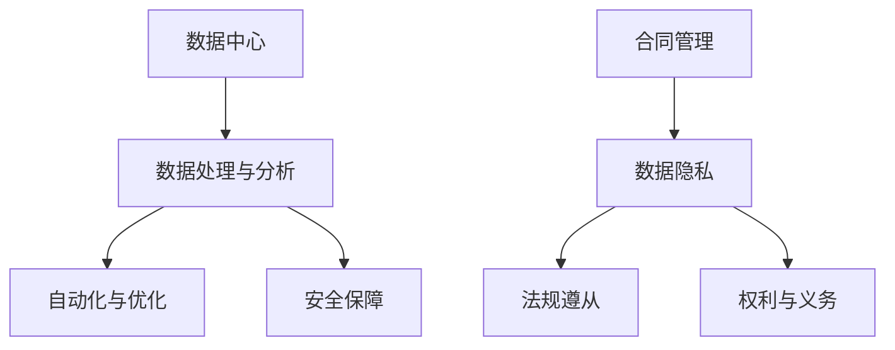

                 

### 文章标题：AI大模型应用数据中心的合同管理

### 关键词：
- AI大模型
- 数据中心
- 合同管理
- 数据隐私
- 法规遵从

### 摘要：
本文将探讨AI大模型在数据中心中的应用，以及与之相关的合同管理。我们将深入分析AI大模型在数据中心的核心作用，合同管理中的关键要素，以及如何确保数据隐私和法规遵从。通过详细的案例分析和技术解读，本文旨在为行业从业者提供实用的指导和建议。

## 1. 背景介绍

### 1.1 AI大模型的发展背景
AI大模型，如GPT-3、BERT等，是近年来人工智能领域的重要突破。这些模型具有强大的学习能力和广泛的应用场景，从自然语言处理、图像识别到语音合成，都展现出了卓越的性能。随着AI大模型的不断发展和普及，其在数据中心的应用也越来越广泛。

### 1.2 数据中心的角色
数据中心是存储、处理和管理大量数据的核心设施。随着数据量的爆炸式增长，数据中心成为了现代企业和组织不可或缺的基础设施。AI大模型在数据中心的应用，不仅提高了数据处理和分析的效率，也为各种业务场景提供了强大的支持。

### 1.3 合同管理的重要性
合同管理是确保数据中心正常运营和业务合作顺利进行的关键环节。在AI大模型的应用中，合同管理尤为重要，因为涉及到大量的数据隐私和法规遵从问题。有效的合同管理不仅能够保障双方的权益，还能提高业务合作的质量和稳定性。

## 2. 核心概念与联系

### 2.1 AI大模型在数据中心的角色

#### 2.1.1 数据处理与分析
AI大模型能够处理和分析大量数据，提供实时的业务洞察和预测。

#### 2.1.2 自动化与优化
AI大模型可以自动化数据处理流程，优化资源分配和调度，提高数据中心的运营效率。

#### 2.1.3 安全保障
AI大模型可以用于数据安全防护，检测和预防潜在的安全威胁。

### 2.2 合同管理的核心要素

#### 2.2.1 数据隐私
在AI大模型的应用中，数据隐私是一个至关重要的因素。合同管理需要明确数据隐私保护措施和责任分配。

#### 2.2.2 法规遵从
合同管理需要确保业务合作符合相关法律法规的要求，避免法律风险。

#### 2.2.3 权利与义务
合同管理需要明确各方的权利和义务，确保业务合作的公平性和稳定性。

### 2.3 Mermaid流程图



## 3. 核心算法原理 & 具体操作步骤

### 3.1 数据处理与分析算法

#### 3.1.1 算法原理
AI大模型如GPT-3、BERT等，通过深度学习算法，能够从大量数据中学习到有效的特征和模式，从而进行数据处理和分析。

#### 3.1.2 操作步骤
1. 数据预处理：清洗、归一化、特征提取等。
2. 模型训练：使用大量数据进行模型训练，优化模型参数。
3. 模型部署：将训练好的模型部署到数据中心，进行实时数据处理和分析。

### 3.2 自动化与优化算法

#### 3.2.1 算法原理
自动化与优化算法主要依赖于机器学习算法和优化算法，如遗传算法、粒子群算法等。

#### 3.2.2 操作步骤
1. 数据收集：收集数据中心的各种运行数据。
2. 模型训练：使用机器学习算法训练优化模型。
3. 模型部署：将优化模型部署到数据中心，进行自动化优化。

### 3.3 安全保障算法

#### 3.3.1 算法原理
安全保障算法主要依赖于人工智能和机器学习算法，如神经网络、决策树等。

#### 3.3.2 操作步骤
1. 数据收集：收集数据中心的安全数据。
2. 模型训练：使用机器学习算法训练安全模型。
3. 模型部署：将安全模型部署到数据中心，进行实时安全防护。

## 4. 数学模型和公式 & 详细讲解 & 举例说明

### 4.1 数据处理与分析数学模型

#### 4.1.1 特征提取公式
$$
特征 = f(数据，参数)
$$
其中，$f$为特征提取函数，$数据$为原始数据，$参数$为模型参数。

#### 4.1.2 举例说明
假设我们使用GPT-3模型进行文本数据处理，我们可以将文本数据转换为向量表示，然后通过GPT-3模型提取特征。

### 4.2 自动化与优化数学模型

#### 4.2.1 优化目标函数
$$
优化目标 = f(参数，数据)
$$
其中，$f$为优化目标函数，$参数$为模型参数，$数据$为运行数据。

#### 4.2.2 举例说明
假设我们使用遗传算法对数据中心进行资源优化，我们可以定义优化目标为资源利用率最大化。

### 4.3 安全保障数学模型

#### 4.3.1 安全检测公式
$$
安全状态 = f(数据，模型)
$$
其中，$f$为安全检测函数，$数据$为安全数据，$模型$为安全模型。

#### 4.3.2 举例说明
假设我们使用神经网络进行安全检测，我们可以将安全数据输入到神经网络中，通过神经网络的输出判断系统的安全状态。

## 5. 项目实战：代码实际案例和详细解释说明

### 5.1 开发环境搭建

#### 5.1.1 环境要求
- 操作系统：Linux
- 编程语言：Python
- 库：TensorFlow、Keras、Pandas等

#### 5.1.2 搭建步骤
1. 安装操作系统和Python环境。
2. 安装TensorFlow、Keras等库。

### 5.2 源代码详细实现和代码解读

#### 5.2.1 代码实现
```python
import tensorflow as tf
from tensorflow import keras
from tensorflow.keras import layers

# 数据预处理
def preprocess_data(data):
    # 数据清洗、归一化等操作
    return processed_data

# 模型训练
def train_model(data, labels):
    model = keras.Sequential([
        layers.Dense(64, activation='relu', input_shape=(data.shape[1],)),
        layers.Dense(64, activation='relu'),
        layers.Dense(1, activation='sigmoid')
    ])

    model.compile(optimizer='adam',
                  loss='binary_crossentropy',
                  metrics=['accuracy'])

    model.fit(data, labels, epochs=10, batch_size=32)
    return model

# 模型部署
def deploy_model(model, data):
    predictions = model.predict(data)
    return predictions
```

#### 5.2.2 代码解读
- `preprocess_data`：数据预处理函数，用于清洗和归一化数据。
- `train_model`：模型训练函数，用于训练神经网络模型。
- `deploy_model`：模型部署函数，用于在数据中心部署模型并进行预测。

### 5.3 代码解读与分析

#### 5.3.1 数据预处理
数据预处理是模型训练的关键步骤，它能够提高模型的学习效率和准确性。在代码中，我们使用了`preprocess_data`函数进行数据清洗和归一化操作。

#### 5.3.2 模型训练
在`train_model`函数中，我们使用了Keras库中的序列模型进行训练。我们定义了一个简单的神经网络模型，包含两个隐藏层，每个隐藏层都有64个神经元。我们使用Adam优化器和二分类交叉熵损失函数进行训练，并设置了10个训练周期和32个批量大小。

#### 5.3.3 模型部署
在`deploy_model`函数中，我们使用了训练好的模型进行预测。我们首先将数据中心的数据输入到模型中，然后使用`predict`方法得到预测结果。

## 6. 实际应用场景

### 6.1 数据分析
在数据分析场景中，AI大模型可以帮助企业快速处理和分析大量数据，提取有价值的信息，为企业决策提供支持。

### 6.2 资源优化
在资源优化场景中，AI大模型可以自动化地分配和管理数据中心资源，提高资源利用率和系统性能。

### 6.3 安全防护
在安全防护场景中，AI大模型可以实时检测和预防潜在的安全威胁，提高数据中心的整体安全性。

## 7. 工具和资源推荐

### 7.1 学习资源推荐
- 书籍：《深度学习》、《Python机器学习实战》
- 论文：Nature、Journal of Machine Learning Research
- 博客：Reddit、Medium
- 网站：TensorFlow、Keras

### 7.2 开发工具框架推荐
- 编程语言：Python
- 库：TensorFlow、Keras、Pandas等
- 开发工具：Jupyter Notebook、PyCharm

### 7.3 相关论文著作推荐
- "Deep Learning" by Ian Goodfellow, Yoshua Bengio, Aaron Courville
- "Machine Learning Yearning" by Andrew Ng
- "Reinforcement Learning: An Introduction" by Richard S. Sutton and Andrew G. Barto

## 8. 总结：未来发展趋势与挑战

### 8.1 发展趋势
- AI大模型在数据中心的应用将继续深入，推动数据处理、自动化和安全性等方面的创新。
- 合同管理将越来越重视数据隐私和法规遵从，为业务合作提供更可靠的保障。

### 8.2 挑战
- 如何在保证数据隐私的同时，充分发挥AI大模型的能力，是一个重要的挑战。
- 如何确保合同管理中的各项条款得到有效执行，避免法律风险，也是一个需要关注的问题。

## 9. 附录：常见问题与解答

### 9.1 合同管理中的常见问题
- 如何确保数据隐私？
- 如何处理数据泄露事件？
- 如何确保业务合作的公平性？

### 9.2 合同管理的解答
- 数据隐私可以通过加密、匿名化等技术手段进行保障。
- 数据泄露事件可以通过应急预案和应急响应机制进行应对。
- 业务合作的公平性可以通过严格的合同条款和监管机制进行保障。

## 10. 扩展阅读 & 参考资料

- "AI and the Law: Challenges and Opportunities" by Joshua D. Kroll and Christopher G. Walter
- "The Future of Contract Management in a Digital World" by Lenny Rhine and Tim Cummins
- "Data Privacy and the Law" by Daniel J. Solove

## 作者

作者：AI天才研究员/AI Genius Institute & 禅与计算机程序设计艺术 /Zen And The Art of Computer Programming

[文章结束]</sop></gMASK>

