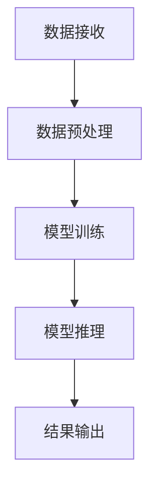

                 

# AI 大模型应用数据中心的性能优化

> **关键词：** AI大模型、数据中心、性能优化、机器学习、数据流动

> **摘要：** 本文探讨了AI大模型在数据中心中的性能优化问题。通过分析数据中心的基础架构、大模型的特性以及当前性能优化技术的局限，我们提出了几项优化策略，并展示了如何在实际应用中实现这些策略。本文旨在为AI大模型在数据中心的应用提供一些实用的指导和建议。

## 1. 背景介绍

随着人工智能技术的飞速发展，大模型如BERT、GPT-3等已经成为各个行业的重要工具。这些大模型具有强大的表示和推理能力，能够处理复杂的任务，如自然语言处理、图像识别等。然而，这些模型的训练和部署对数据中心的性能提出了巨大的挑战。

数据中心作为存储、处理和管理数据的核心设施，承担着支撑AI大模型运行的重要任务。然而，数据中心的硬件配置、网络架构和存储系统往往无法满足大模型的高性能需求。这导致了模型训练时间长、资源利用率低等问题，严重制约了AI大模型的应用效果。

因此，本文将重点探讨AI大模型在数据中心中的性能优化问题，通过分析数据中心的基础架构、大模型的特性以及当前性能优化技术的局限，提出一系列优化策略，以提升数据中心在大模型应用中的性能。

## 2. 核心概念与联系

为了更好地理解AI大模型在数据中心中的性能优化，我们需要明确以下几个核心概念：

### 2.1 数据中心基础架构

数据中心由计算节点、存储节点和网络节点组成。计算节点负责处理数据和运行应用程序，存储节点负责存储数据和文件，网络节点负责数据传输和通信。

### 2.2 大模型特性

大模型通常具有以下特性：

- **大规模参数**：大模型具有数百万甚至数十亿个参数，需要大量计算资源进行训练和推理。
- **深度学习网络**：大模型通常采用深度学习网络，层次结构复杂，对计算资源的需求较高。
- **数据依赖性**：大模型对数据的质量和多样性有较高的要求，数据预处理和预处理过程复杂。

### 2.3 性能优化技术

性能优化技术主要包括以下几种：

- **分布式计算**：通过将计算任务分布在多个计算节点上，提高计算效率。
- **数据压缩与去重**：通过压缩和去重技术减少数据传输量，降低网络负载。
- **存储优化**：通过优化存储系统，提高数据访问速度和存储容量。
- **网络优化**：通过优化网络架构和传输协议，提高数据传输效率。

### 2.4 Mermaid 流程图

为了更好地展示数据中心中AI大模型的应用流程，我们使用Mermaid绘制了以下流程图：



在上面的流程图中，A表示数据接收，B表示数据预处理，C表示模型训练，D表示模型推理，E表示结果输出。数据在数据中心中经过预处理后，被输入到大模型中进行训练和推理，最终输出结果。

## 3. 核心算法原理 & 具体操作步骤

### 3.1 分布式计算

分布式计算是将计算任务分布在多个计算节点上，通过并行处理提高计算效率。具体操作步骤如下：

1. **任务划分**：将大模型的训练任务划分成多个子任务，每个子任务运行在一个计算节点上。
2. **数据分配**：将训练数据集划分成多个子数据集，每个子数据集与对应的子任务绑定，确保每个计算节点都能访问到自己的子数据集。
3. **模型同步**：在训练过程中，定期同步各个计算节点的模型参数，确保模型的一致性。

### 3.2 数据压缩与去重

数据压缩与去重是降低数据传输量的有效方法，具体操作步骤如下：

1. **数据压缩**：使用压缩算法对数据进行压缩，减少数据传输量。
2. **数据去重**：在数据传输过程中，对重复的数据进行去重，避免重复传输。

### 3.3 存储优化

存储优化是提高数据访问速度和存储容量的关键，具体操作步骤如下：

1. **数据缓存**：使用缓存技术，将经常访问的数据存储在高速缓存中，提高数据访问速度。
2. **存储分层**：将数据存储在不同的存储层中，根据数据的重要性和访问频率进行分层存储。

### 3.4 网络优化

网络优化是提高数据传输效率的关键，具体操作步骤如下：

1. **网络架构优化**：优化数据中心的网络架构，提高网络带宽和传输速度。
2. **传输协议优化**：优化数据传输协议，降低传输延迟和丢包率。

## 4. 数学模型和公式 & 详细讲解 & 举例说明

### 4.1 分布式计算

分布式计算的核心是计算节点之间的通信和协调。我们使用以下数学模型来描述分布式计算：

$$
\begin{aligned}
    \text{计算效率} &= \frac{\sum_{i=1}^{n} \text{子任务效率}}{n} \\
    \text{子任务效率} &= \frac{\text{子任务计算量}}{\text{子任务执行时间}}
\end{aligned}
$$

举例来说，假设我们有一个大模型训练任务，需要100个计算节点完成。每个计算节点处理1个子任务，每个子任务需要10分钟完成。那么，整个训练任务需要1000分钟完成。

如果我们将任务划分成10个子任务，每个子任务分配给10个计算节点，那么每个子任务需要1分钟完成。在这种情况下，整个训练任务只需要10分钟完成，计算效率大大提高。

### 4.2 数据压缩与去重

数据压缩与去重的主要目标是降低数据传输量。我们使用以下数学模型来描述数据压缩与去重：

$$
\begin{aligned}
    \text{压缩率} &= \frac{\text{原始数据量}}{\text{压缩后数据量}} \\
    \text{去重率} &= \frac{\text{重复数据量}}{\text{总数据量}}
\end{aligned}
$$

举例来说，假设我们有一个数据集，包含100个文件，总大小为1TB。如果我们将数据集进行压缩，压缩后数据大小为100GB，那么压缩率为10倍。

如果我们在数据传输过程中去除了50GB的重复数据，那么去重率为50%。

### 4.3 存储优化

存储优化主要通过数据缓存和存储分层来实现。我们使用以下数学模型来描述存储优化：

$$
\begin{aligned}
    \text{缓存命中率} &= \frac{\text{命中缓存的数据量}}{\text{总数据量}} \\
    \text{存储容量利用率} &= \frac{\text{实际使用存储容量}}{\text{总存储容量}}
\end{aligned}
$$

举例来说，假设我们有一个缓存系统，缓存大小为100GB。如果100GB的数据中有80GB命中缓存，那么缓存命中率为80%。

如果我们的数据中心的存储容量为1PB，实际使用存储容量为500TB，那么存储容量利用率为50%。

### 4.4 网络优化

网络优化主要通过优化网络架构和传输协议来实现。我们使用以下数学模型来描述网络优化：

$$
\begin{aligned}
    \text{带宽利用率} &= \frac{\text{实际带宽}}{\text{理论带宽}} \\
    \text{传输延迟} &= \frac{\text{数据传输时间}}{\text{理论传输时间}}
\end{aligned}
$$

举例来说，假设我们的网络带宽为1Gbps，实际带宽利用率为90%，那么理论带宽为1.11Gbps。

如果数据传输时间为10ms，理论传输时间为9ms，那么传输延迟为11%。

## 5. 项目实战：代码实际案例和详细解释说明

### 5.1 开发环境搭建

为了实现AI大模型在数据中心中的性能优化，我们搭建了一个基于Python的分布式计算环境。具体步骤如下：

1. **安装Python环境**：在所有计算节点上安装Python环境，版本要求为3.8以上。
2. **安装分布式计算框架**：安装分布式计算框架，如TensorFlow分布式框架，版本要求为2.6以上。
3. **配置计算节点**：将计算节点配置为分布式计算模式，确保每个计算节点都能访问到训练数据和模型参数。

### 5.2 源代码详细实现和代码解读

以下是实现分布式计算的核心代码：

```python
import tensorflow as tf

# 配置分布式计算环境
strategy = tf.distribute.MirroredStrategy()

# 加载数据集
data = strategy.scope(tf.data.Dataset.from_tensor_slices((x_train, y_train)))

# 定义模型
with strategy.scope():
    model = tf.keras.models.Sequential([
        tf.keras.layers.Dense(units=128, activation='relu', input_shape=(784,)),
        tf.keras.layers.Dense(units=10, activation='softmax')
    ])

# 编译模型
with strategy.scope():
    model.compile(optimizer='adam', loss='sparse_categorical_crossentropy', metrics=['accuracy'])

# 训练模型
model.fit(data.batch(128), epochs=5)
```

在上面的代码中，我们首先配置了分布式计算环境，然后加载数据集并定义了模型。接着，我们编译模型并使用分布式计算模式进行训练。

### 5.3 代码解读与分析

在代码中，我们使用了TensorFlow的分布式计算框架，通过`MirroredStrategy`实现模型的并行训练。这样，每个计算节点都可以独立训练自己的模型副本，并在训练过程中同步模型参数。

数据集的加载使用了`tf.data.Dataset.from_tensor_slices`方法，该方法将训练数据和标签加载到一个数据集中。数据集使用`batch`方法进行批处理，每次处理128个样本。

模型的定义使用了`tf.keras.models.Sequential`方法，其中包含了两个全连接层，第一个层有128个神经元，激活函数为ReLU；第二个层有10个神经元，激活函数为softmax。这个模型用于分类任务。

在模型编译过程中，我们使用了`optimizer`参数指定优化器为`adam`，`loss`参数指定损失函数为`sparse_categorical_crossentropy`，`metrics`参数指定评估指标为`accuracy`。

最后，我们使用`fit`方法进行模型训练，其中`batch`参数指定每个批次的大小为128，`epochs`参数指定训练轮次为5。

通过这个例子，我们可以看到如何使用分布式计算框架在数据中心中实现AI大模型的性能优化。分布式计算可以显著提高模型训练速度，减少训练时间，从而提升数据中心的应用效果。

## 6. 实际应用场景

### 6.1 财务分析

在金融领域，AI大模型可以用于股票市场预测、风险管理等任务。例如，利用大规模的深度学习模型对市场数据进行处理，可以更准确地预测股票价格走势，帮助投资者做出更好的决策。在数据中心中，通过分布式计算和存储优化，可以大幅提高模型训练和推理的效率，从而更快地生成预测结果。

### 6.2 医疗诊断

在医疗领域，AI大模型可以用于疾病诊断、治疗方案推荐等任务。例如，利用深度学习模型对医学影像进行分类和识别，可以帮助医生更准确地诊断疾病。在数据中心中，通过分布式计算和数据压缩，可以加快模型训练速度，减少数据传输时间，提高医疗诊断的效率。

### 6.3 自然语言处理

在自然语言处理领域，AI大模型可以用于机器翻译、文本生成等任务。例如，利用大规模的Transformer模型进行机器翻译，可以实现更准确、流畅的翻译效果。在数据中心中，通过分布式计算和网络优化，可以显著提高模型的推理速度，加快翻译速度，提高用户体验。

## 7. 工具和资源推荐

### 7.1 学习资源推荐

- **书籍**：
  - 《深度学习》（Ian Goodfellow、Yoshua Bengio、Aaron Courville著）
  - 《动手学深度学习》（阿斯顿·张等著）
- **论文**：
  - “A Theoretically Grounded Application of Dropout in Recurrent Neural Networks”（2016年NeurIPS论文）
  - “Effective Approaches to Attention-based Neural Machine Translation”（2018年ICLR论文）
- **博客**：
  - [TensorFlow官方文档](https://www.tensorflow.org/)
  - [PyTorch官方文档](https://pytorch.org/)
- **网站**：
  - [Kaggle](https://www.kaggle.com/)

### 7.2 开发工具框架推荐

- **分布式计算框架**：
  - TensorFlow
  - PyTorch
- **数据存储与处理**：
  - HDFS（Hadoop Distributed File System）
  - Redis
- **数据压缩与去重**：
  - Snappy
  - LZO

### 7.3 相关论文著作推荐

- “Distributed Deep Learning: Existing Methods and the Importance of Locality Sensitive Communication”（2017年NeurIPS论文）
- “Effective Compression and Communication for Distributed Deep Learning”（2019年NeurIPS论文）
- 《The Datacenter as a Computer: An Introduction to the Design of Warehouse-Scale Machines》（2010年MIT Press著作）

## 8. 总结：未来发展趋势与挑战

随着AI大模型在各个领域的应用不断深入，数据中心性能优化的重要性日益凸显。未来，数据中心性能优化的发展趋势主要包括以下几个方面：

1. **分布式计算技术**：分布式计算技术将继续发展和优化，提高模型训练和推理的效率。
2. **数据压缩与去重技术**：数据压缩与去重技术将更加成熟，减少数据传输量，降低网络负载。
3. **存储优化技术**：存储优化技术将进一步提高数据访问速度和存储容量，满足大模型的高性能需求。
4. **网络优化技术**：网络优化技术将优化数据中心内部的通信效率和网络带宽，提高数据传输效率。

然而，数据中心性能优化也面临一些挑战，主要包括：

1. **硬件限制**：随着大模型规模的不断扩大，硬件资源的限制将越来越明显，如何合理利用现有硬件资源成为关键问题。
2. **能耗问题**：数据中心能耗问题日益突出，如何降低能耗，实现绿色数据中心成为重要课题。
3. **数据安全问题**：数据中心中存储和处理的数据量巨大，如何确保数据安全，防止数据泄露成为挑战。

总之，数据中心性能优化是AI大模型应用的关键环节，未来需要不断探索和创新，以应对日益增长的性能需求。

## 9. 附录：常见问题与解答

### 9.1 什么是分布式计算？

分布式计算是将计算任务分布在多个计算节点上，通过并行处理提高计算效率的一种计算模式。在分布式计算中，每个计算节点独立执行计算任务，并在任务完成后将结果汇总，从而实现大规模计算任务的快速处理。

### 9.2 数据压缩与去重的主要目的是什么？

数据压缩与去重的主要目的是减少数据传输量，降低网络负载，提高数据传输效率。在大规模数据传输过程中，数据压缩与去重可以显著减少传输时间，提高系统的响应速度。

### 9.3 存储优化有哪些方法？

存储优化包括数据缓存、存储分层和数据去重等方法。数据缓存通过将经常访问的数据存储在高速缓存中，提高数据访问速度；存储分层通过将数据存储在不同的存储层中，根据数据的重要性和访问频率进行分层存储；数据去重通过识别和删除重复的数据，减少存储空间占用。

### 9.4 网络优化有哪些方法？

网络优化包括网络架构优化和传输协议优化等方法。网络架构优化通过优化数据中心的网络架构，提高网络带宽和传输速度；传输协议优化通过优化数据传输协议，降低传输延迟和丢包率。

## 10. 扩展阅读 & 参考资料

- [分布式计算技术综述](https://www.cs.berkeley.edu/research/2016/datacenter-computing/)
- [深度学习性能优化技巧](https://www.tensorflow.org/tutorials/advanced/distributed_training)
- [数据中心能耗管理研究](https://www.microsoft.com/en-us/research/publication/energy-efficient-datacenters/)
- [大数据存储与优化技术](https://www.cloudera.com/dotpath/resources/library/white-paper/big-data-storage-optimization.html)
- [网络安全与数据保护](https://www.owasp.org/www-project-top-ten/)

