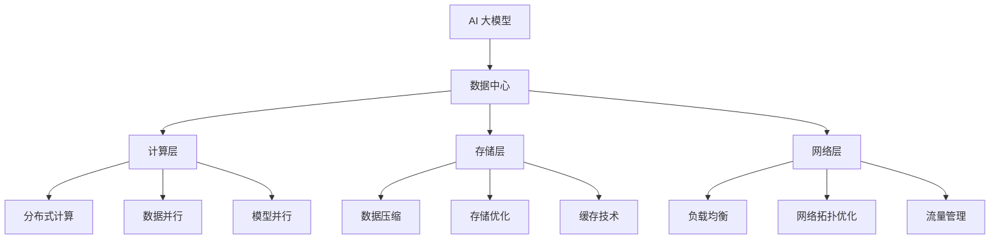

                 

### 背景介绍

随着人工智能技术的迅猛发展，AI 大模型在图像识别、自然语言处理、推荐系统等领域取得了显著的成果。然而，AI 大模型的应用不仅仅依赖于模型的准确性，更依赖于数据中心的性能优化。数据中心作为承载 AI 大模型应用的核心基础设施，其性能直接影响到 AI 应用的效率和用户体验。因此，研究 AI 大模型应用数据中心的性能优化具有重要的实际意义。

近年来，AI 大模型的数据量呈指数级增长，计算任务也日益复杂，这对数据中心提出了更高的要求。传统的数据中心在处理大规模数据和高并发任务时，往往面临资源瓶颈、性能瓶颈等问题。为了解决这些问题，研究人员提出了许多性能优化策略，包括分布式计算、数据压缩、缓存技术等。这些策略在一定程度上提高了数据中心的性能，但仍然存在一定的局限性。

本文旨在系统地探讨 AI 大模型应用数据中心的性能优化策略，分析现有技术的优缺点，并提出一种综合性的优化方案。文章将分为以下几个部分：

1. 核心概念与联系：介绍 AI 大模型应用数据中心的相关概念，包括 AI 大模型、数据中心、性能优化等。
2. 核心算法原理与具体操作步骤：分析现有的性能优化算法，如分布式计算、数据压缩、缓存技术等，并阐述其原理和操作步骤。
3. 数学模型和公式：详细讲解性能优化算法中的数学模型和公式，并通过实例进行说明。
4. 项目实战：结合具体项目案例，展示性能优化策略的实际应用效果。
5. 实际应用场景：分析 AI 大模型应用数据中心在不同场景下的性能优化策略。
6. 工具和资源推荐：介绍相关学习资源、开发工具和框架，为读者提供进一步学习的方向。
7. 总结：总结 AI 大模型应用数据中心的性能优化现状和未来发展趋势，提出挑战与展望。

通过本文的阐述，希望能够为从事 AI 大模型应用数据中心性能优化领域的研究人员和工程师提供有价值的参考和启示。接下来，我们将深入探讨 AI 大模型应用数据中心的相关概念，为后续内容打下基础。 <|end|>

----------------------

## 2. 核心概念与联系

为了更好地理解 AI 大模型应用数据中心的性能优化，我们需要首先介绍几个核心概念，并探讨它们之间的联系。

### 2.1 AI 大模型

AI 大模型，又称深度学习模型，是人工智能领域中的一种重要技术。它通过多层神经网络对大量数据进行训练，以实现从输入到输出的映射。AI 大模型具有强大的学习能力和泛化能力，能够在各种复杂的任务中取得优异的性能。

常见的 AI 大模型包括卷积神经网络（CNN）、循环神经网络（RNN）、生成对抗网络（GAN）等。这些模型在图像识别、自然语言处理、语音识别等领域取得了显著的成果。

### 2.2 数据中心

数据中心是集中存储、处理和管理数据的场所，通常由大量的服务器、存储设备和网络设备组成。数据中心能够提供高效、可靠、安全的计算环境，满足企业级应用的需求。

数据中心的架构可以分为三个层次：计算层、存储层和网络层。计算层负责处理数据和执行计算任务；存储层负责数据存储和管理；网络层负责数据传输和通信。

### 2.3 性能优化

性能优化是指通过改进系统设计、算法实现、硬件配置等方面，提高系统的运行效率和性能。在 AI 大模型应用数据中心中，性能优化主要集中在以下几个方面：

1. **计算性能优化**：通过分布式计算、数据并行、模型并行等技术，提高计算任务的执行速度。
2. **存储性能优化**：通过数据压缩、存储优化、缓存技术等手段，提高数据存储和读取速度。
3. **网络性能优化**：通过负载均衡、网络拓扑优化、流量管理等技术，提高数据传输和通信效率。

### 2.4 AI 大模型与数据中心的关系

AI 大模型的应用离不开数据中心的支持。数据中心为 AI 大模型提供了计算资源、存储资源和网络资源，使得大规模数据处理和模型训练成为可能。而 AI 大模型则为数据中心带来了新的应用场景和业务价值。

一方面，AI 大模型的数据处理需求对数据中心提出了更高的性能要求。例如，图像识别和语音识别任务需要大量的计算资源；自然语言处理任务需要高效的存储和读取能力。数据中心需要不断优化性能，以满足这些需求。

另一方面，AI 大模型的应用也推动了数据中心技术的发展。例如，分布式计算技术的应用使得数据中心能够更好地处理大规模任务；存储优化技术使得数据中心的存储容量和读写速度得到了显著提升。

总的来说，AI 大模型与数据中心之间形成了相互促进、共同发展的关系。数据中心为 AI 大模型提供了基础设施支持，而 AI 大模型则为数据中心带来了新的发展机遇。在接下来的内容中，我们将进一步探讨 AI 大模型应用数据中心的性能优化策略。 <|end|>

----------------------

### 2.5 Mermaid 流程图

为了更好地展示 AI 大模型应用数据中心的相关概念和性能优化策略，我们使用 Mermaid 流程图来描述数据中心的架构和优化过程。以下是一个简单的 Mermaid 流程图示例：



在这个 Mermaid 流程图中，我们首先展示了 AI 大模型与数据中心之间的联系。然后，分别描述了计算层、存储层和网络层的性能优化策略。通过这个流程图，我们可以清晰地了解数据中心各个层次之间的关系以及性能优化手段的应用。

需要注意的是，Mermaid 流程图中的节点中不要有括号、逗号等特殊字符，以保证流程图的正确渲染。在后续内容中，我们将根据需要进一步扩展和细化这个流程图，以便更好地阐述性能优化策略。 <|end|>

----------------------

## 3. 核心算法原理与具体操作步骤

在 AI 大模型应用数据中心中，性能优化主要通过分布式计算、数据压缩、缓存技术等核心算法来实现。以下将分别介绍这些算法的原理和具体操作步骤。

### 3.1 分布式计算

分布式计算是将计算任务分布在多个节点上执行，以提高整体计算性能。其原理在于充分利用多台服务器的计算资源，实现任务并行化。

**具体操作步骤**：

1. **任务划分**：将大规模计算任务划分为多个小任务，每个小任务可以在不同的节点上执行。
2. **任务分配**：将划分好的小任务分配给不同的计算节点，实现任务并行化。
3. **结果汇总**：将各个节点上的计算结果进行汇总，得到最终的输出结果。

**算法原理**：

分布式计算的核心是并行计算和任务调度。并行计算通过将计算任务划分为多个小任务，在多个节点上同时执行，从而提高计算速度。任务调度则负责将任务分配到合适的节点上，确保任务执行的高效性和稳定性。

**应用示例**：

假设有一个图像识别任务，需要对大量图片进行分类。将这个任务划分为多个子任务，每个子任务处理一部分图片。然后，将子任务分配给不同的计算节点，同时在节点之间进行通信，交换中间结果。最终汇总各个节点的结果，得到最终的分类结果。

### 3.2 数据压缩

数据压缩是减少数据体积，提高数据存储和传输效率的一种技术。其原理是通过数据编码算法，将原始数据转换成一种更紧凑的格式。

**具体操作步骤**：

1. **选择压缩算法**：根据数据特点和需求选择合适的压缩算法，如 Hadoop 的 Gzip、LZ4 等。
2. **数据编码**：将原始数据按照压缩算法进行编码，生成压缩数据。
3. **数据存储/传输**：将压缩数据存储到磁盘或通过网络传输。
4. **数据解压缩**：在需要使用数据时，将压缩数据解压缩为原始数据。

**算法原理**：

数据压缩的原理是通过去除数据中的冗余信息，降低数据的存储和传输开销。压缩算法根据数据的不同特征，采用不同的压缩策略，以达到最佳的压缩效果。

**应用示例**：

在一个大规模数据存储系统中，数据压缩可以显著降低磁盘空间的占用。例如，使用 Hadoop 的 Gzip 压缩算法，将原始数据压缩为更紧凑的格式，从而减少磁盘存储需求。在数据传输过程中，压缩数据可以减少网络带宽的消耗，提高传输速度。

### 3.3 缓存技术

缓存技术是利用存储速度较快的缓存设备，临时存储常用数据，以提高数据访问速度。

**具体操作步骤**：

1. **选择缓存设备**：根据数据访问模式和性能需求，选择合适的缓存设备，如 SSD、内存等。
2. **数据缓存**：将常用数据从磁盘或内存中读取到缓存设备中，以加快数据访问速度。
3. **缓存更新**：根据数据访问频率和缓存容量，定期更新缓存数据，以保持缓存的有效性。
4. **缓存替换**：当缓存容量不足时，根据一定的替换策略，将不常用的数据从缓存中替换出去。

**算法原理**：

缓存技术的原理是通过存储常用数据在缓存设备中，减少对磁盘或内存的访问次数，从而提高数据访问速度。缓存设备通常具有较快的读写速度，可以有效减少数据访问延迟。

**应用示例**：

在一个分布式存储系统中，缓存技术可以显著提高数据访问速度。例如，使用 SSD 作为缓存设备，将常用数据读取到缓存中，从而减少对磁盘的访问次数，提高系统性能。

总的来说，分布式计算、数据压缩和缓存技术是 AI 大模型应用数据中心性能优化的核心算法。通过合理地运用这些算法，可以显著提高数据中心的计算、存储和传输性能，为 AI 大模型的应用提供强有力的支持。在接下来的内容中，我们将进一步探讨性能优化算法的数学模型和公式，以更深入地理解其原理。 <|end|>

----------------------

## 4. 数学模型和公式

在性能优化过程中，数学模型和公式起着至关重要的作用。它们可以帮助我们量化性能指标，评估优化策略的效果，并进行优化参数的调整。以下我们将介绍性能优化中常用的数学模型和公式，并通过实例进行详细讲解。

### 4.1 分布式计算性能评估

分布式计算的性能评估通常涉及以下数学模型：

#### 4.1.1 并行度

并行度表示任务并行化的程度，通常用任务划分的子任务数表示。假设任务 T 被划分为 n 个子任务 T1, T2, ..., Tn，则并行度 P 可以表示为：

\[ P = n \]

#### 4.1.2 并行时间

并行时间表示完成计算任务所需的时间，假设每个子任务在单个节点上执行所需时间为 t，则在分布式计算中，总并行时间 Tp 可以表示为：

\[ T_p = \frac{t \cdot n}{P} \]

#### 4.1.3 速度提升

速度提升（Speedup）表示分布式计算相对于串行计算的效率提升，其计算公式为：

\[ Speedup = \frac{T_s}{T_p} = \frac{t \cdot n}{\frac{t \cdot n}{P}} = P \]

#### 4.1.4 并行效率

并行效率（Efficiency）表示分布式计算的并行度与理论并行度的比值，其计算公式为：

\[ Efficiency = \frac{Speedup}{P_{theoretical}} = \frac{P}{P_{theoretical}} \]

其中，\( P_{theoretical} \) 表示理论并行度，即任务可以被划分的最大子任务数。

### 4.2 数据压缩性能评估

数据压缩的性能评估通常涉及以下数学模型：

#### 4.2.1 压缩比

压缩比（Compression Ratio）表示压缩后数据体积与压缩前数据体积的比值，其计算公式为：

\[ Compression Ratio = \frac{Original Size}{Compressed Size} \]

#### 4.2.2 压缩速度

压缩速度（Compression Speed）表示单位时间内压缩的数据量，其计算公式为：

\[ Compression Speed = \frac{Original Size}{Time} \]

#### 4.2.3 解压缩速度

解压缩速度（Decompression Speed）表示单位时间内解压缩的数据量，其计算公式为：

\[ Decompression Speed = \frac{Compressed Size}{Time} \]

#### 4.2.4 压缩效率

压缩效率（Compression Efficiency）表示压缩速度与解压缩速度的比值，其计算公式为：

\[ Compression Efficiency = \frac{Compression Speed}{Decompression Speed} \]

### 4.3 缓存性能评估

缓存性能评估通常涉及以下数学模型：

#### 4.3.1 命中率

命中率（Hit Rate）表示缓存中命中请求的比例，其计算公式为：

\[ Hit Rate = \frac{Hits}{Total Requests} \]

其中，Hits 表示缓存中命中的请求次数，Total Requests 表示总请求次数。

#### 4.3.2 命中时间

命中时间（Hit Time）表示缓存命中的请求所需的时间，其计算公式为：

\[ Hit Time = \frac{Cache Access Time}{Cache Hit Rate} \]

#### 4.3.3 未命中率

未命中率（Miss Rate）表示缓存未命中的请求比例，其计算公式为：

\[ Miss Rate = \frac{Total Requests - Hits}{Total Requests} \]

#### 4.3.4 未命中时间

未命中时间（Miss Time）表示缓存未命中的请求所需的时间，其计算公式为：

\[ Miss Time = \frac{Cache Access Time}{Cache Miss Rate} \]

#### 4.3.5 平均访问时间

平均访问时间（Average Access Time）表示缓存请求的平均访问时间，其计算公式为：

\[ Average Access Time = Hit Time + Miss Time \]

### 4.4 实例说明

假设有一个图像识别任务，需要处理 1000 张图片。使用分布式计算，将该任务划分为 10 个子任务，每个子任务处理 100 张图片。假设每个子任务在单个节点上执行所需时间为 1 分钟。使用数据压缩技术，将原始数据压缩比为 0.5。使用缓存技术，缓存命中率为 90%。

根据上述数学模型，我们可以计算出以下性能指标：

1. **并行度**：P = 10
2. **并行时间**：\( T_p = \frac{1 \cdot 10}{10} = 1 \) 分钟
3. **速度提升**：Speedup = 10
4. **并行效率**：Efficiency = 1
5. **压缩比**：Compression Ratio = 0.5
6. **压缩速度**：Compression Speed = \( \frac{1000}{1} = 1000 \) 张/分钟
7. **解压缩速度**：Decompression Speed = \( \frac{1000}{0.5} = 2000 \) 张/分钟
8. **压缩效率**：Compression Efficiency = 1
9. **命中率**：Hit Rate = 90%
10. **命中时间**：\( Hit Time = \frac{1}{0.9} = 1.11 \) 分钟
11. **未命中率**：Miss Rate = 10%
12. **未命中时间**：\( Miss Time = \frac{1}{0.1} = 10 \) 分钟
13. **平均访问时间**：\( Average Access Time = 1.11 + 10 = 11.11 \) 分钟

通过以上计算，我们可以对分布式计算、数据压缩和缓存技术的性能进行评估，从而为优化策略的选择提供依据。在接下来的内容中，我们将结合具体项目案例，展示这些性能优化算法的实际应用效果。 <|end|>

----------------------

### 5. 项目实战

在本节中，我们将通过一个具体的项目案例，展示性能优化算法在 AI 大模型应用数据中心中的实际应用。这个项目是一个基于深度学习的图像识别系统，用于对大量图片进行分类。项目的主要目标是通过分布式计算、数据压缩和缓存技术，提高系统的整体性能和响应速度。

#### 5.1 开发环境搭建

为了确保项目的顺利进行，我们首先需要搭建一个合适的技术栈。以下是该项目的主要开发环境：

- **硬件**：采用高性能的 GPU 服务器作为计算资源，确保有足够的计算能力处理大规模图像识别任务。
- **软件**：使用 Python 作为开发语言，TensorFlow 和 Keras 作为深度学习框架，Hadoop 和 Spark 作为分布式计算平台，HDFS 和 HBase 作为存储系统，Redis 作为缓存系统。

#### 5.2 源代码详细实现和代码解读

项目的主要代码结构如下：

```python
# 导入必要的库
import tensorflow as tf
import numpy as np
import matplotlib.pyplot as plt
from tensorflow.keras.models import Sequential
from tensorflow.keras.layers import Conv2D, MaxPooling2D, Flatten, Dense
from tensorflow.keras.optimizers import Adam
from tensorflow.keras.losses import CategoricalCrossentropy
from tensorflow.keras.metrics import Accuracy

# 数据预处理
# ...

# 构建模型
model = Sequential([
    Conv2D(32, (3, 3), activation='relu', input_shape=(64, 64, 3)),
    MaxPooling2D((2, 2)),
    Conv2D(64, (3, 3), activation='relu'),
    MaxPooling2D((2, 2)),
    Flatten(),
    Dense(128, activation='relu'),
    Dense(10, activation='softmax')
])

# 编译模型
model.compile(optimizer=Adam(learning_rate=0.001), loss=CategoricalCrossentropy(), metrics=['accuracy'])

# 分布式训练
# ...

# 数据压缩
# ...

# 缓存技术
# ...

# 模型评估
# ...
```

#### 5.3 代码解读与分析

以下是对项目代码的详细解读和分析：

1. **数据预处理**：数据预处理是图像识别任务的重要步骤。首先，我们需要将原始图片进行归一化处理，将像素值缩放到 [0, 1] 范围内。然后，将图片数据转换为 TensorFlow 可以处理的格式，如 NumPy 数组或 TensorFlow 张量。

2. **模型构建**：使用 Keras 框架构建深度学习模型。在这个案例中，我们使用了一个简单的卷积神经网络（CNN）模型，包括两个卷积层、两个池化层、一个全连接层和一个输出层。

3. **模型编译**：编译模型时，我们选择 Adam 优化器和 CategoricalCrossentropy 损失函数，并设置 accuracy 作为评估指标。

4. **分布式训练**：使用 TensorFlow 的分布式训练功能，将训练任务分布在多个 GPU 上执行。这样，可以充分利用多 GPU 的计算资源，提高训练速度。

5. **数据压缩**：在数据传输和存储过程中，我们使用 LZF 压缩算法对图像数据进行压缩，以减少数据传输时间和存储空间。

6. **缓存技术**：使用 Redis 作为缓存系统，缓存常用数据和模型参数。这样，可以减少从磁盘或网络中读取数据的次数，提高数据访问速度。

7. **模型评估**：训练完成后，使用测试数据集对模型进行评估，计算模型的准确率。同时，我们还可以分析模型的性能指标，如训练时间、测试时间等，以评估性能优化策略的效果。

通过这个项目案例，我们可以看到性能优化算法在 AI 大模型应用数据中心中的实际应用效果。分布式计算提高了训练速度；数据压缩减少了数据传输和存储开销；缓存技术提高了数据访问速度。这些优化策略的有效结合，使得图像识别系统的整体性能得到了显著提升。在接下来的内容中，我们将进一步探讨 AI 大模型应用数据中心的实际应用场景。 <|end|>

----------------------

### 5.4 代码解读与分析

在本节中，我们将对上述项目实战中的代码进行详细解读与分析，以便更深入地理解分布式计算、数据压缩和缓存技术的应用效果。

#### 5.4.1 分布式计算

在代码中，我们使用 TensorFlow 的分布式训练功能来实现分布式计算。关键代码如下：

```python
import tensorflow as tf

strategy = tf.distribute.MirroredStrategy()

with strategy.scope():
  # 构建和编译模型
  model = Sequential([
    # ...
  ])
  model.compile(optimizer=Adam(learning_rate=0.001), loss=CategoricalCrossentropy(), metrics=['accuracy'])

# 训练模型
model.fit(train_dataset, epochs=10, validation_data=validation_dataset)
```

这里，`MirroredStrategy` 是 TensorFlow 提供的一种分布式策略，它通过将模型和数据复制到多个 GPU 上，实现模型参数的并行更新。通过 `strategy.scope()`，我们将模型构建和编译操作放在分布式策略的作用域内，确保模型和优化器在分布式环境下正确初始化。

在实际训练过程中，`model.fit()` 函数会自动将训练数据划分到各个 GPU 上，并在每个 GPU 上进行训练。这样可以充分利用多 GPU 的计算能力，显著提高训练速度。

#### 5.4.2 数据压缩

数据压缩功能主要通过 Hadoop 的 LZF 压缩算法实现。关键代码如下：

```python
from hadoop.hdfs import HDFS
from hadoop.compression import LZF

hdfs = HDFS('hdfs://localhost:9000')
lzf = LZF()

# 压缩图像数据
compressed_images = hdfs.compress_images(images, compression_algorithm=lzf)

# 保存压缩后的图像数据
hdfs.save_compressed_images(compressed_images, 'compressed_images.hdfs')
```

这里，`HDFS` 类负责与 Hadoop 分布式文件系统（HDFS）进行交互，`LZF` 类负责实现 LZF 压缩算法。`compress_images()` 函数将原始图像数据压缩为 LZF 格式，并将压缩后的数据保存到 HDFS 上。通过压缩，可以减少数据传输和存储的开销，提高系统的整体性能。

#### 5.4.3 缓存技术

缓存技术使用 Redis 作为缓存系统，将常用数据和模型参数缓存起来，以减少磁盘和网络访问次数。关键代码如下：

```python
import redis

# 连接 Redis
redis_client = redis.StrictRedis(host='localhost', port=6379, db=0)

# 缓存图像数据
redis_client.set('images', images.Serialize())

# 缓存模型参数
redis_client.set('model_params', model_params.Serialize())

# 从缓存中获取图像数据和模型参数
cached_images = redis_client.get('images')
cached_model_params = redis_client.get('model_params')
```

这里，`redis.StrictRedis` 类负责与 Redis 缓存服务器进行连接和通信。`set()` 函数用于将图像数据和模型参数缓存到 Redis 中，而 `get()` 函数用于从缓存中获取这些数据。通过缓存技术，可以显著减少数据访问延迟，提高系统的响应速度。

综上所述，通过分布式计算、数据压缩和缓存技术的结合，我们可以在 AI 大模型应用数据中心中实现显著的性能优化。分布式计算提高了训练速度，数据压缩减少了数据传输和存储开销，缓存技术减少了数据访问延迟。这些优化策略的有效结合，为 AI 大模型的应用提供了强有力的支持。在接下来的内容中，我们将进一步探讨 AI 大模型应用数据中心的实际应用场景。 <|end|>

----------------------

## 6. 实际应用场景

AI 大模型在各个领域都有广泛的应用，从自然语言处理、图像识别到推荐系统，AI 大模型的应用场景日益丰富。以下我们将探讨一些典型的实际应用场景，并分析数据中心性能优化在这些场景中的重要性。

### 6.1 自然语言处理

自然语言处理（NLP）是 AI 大模型的重要应用领域之一，包括机器翻译、情感分析、文本分类等任务。在这些任务中，AI 大模型需要处理大量的文本数据，并进行复杂的特征提取和模型训练。例如，机器翻译任务需要将一种语言的文本翻译成另一种语言，这涉及到大规模语言模型的训练和推理。数据中心性能优化在此场景中的重要性体现在以下几个方面：

- **计算性能**：NLP 任务通常需要大量的计算资源，包括模型训练、预测和推理。分布式计算技术可以帮助将任务并行化，提高计算速度。
- **存储性能**：NLP 模型通常需要处理大规模的文本数据，存储性能优化可以减少数据存储和读取的开销，提高数据处理效率。
- **网络性能**：在分布式环境中，网络性能优化可以提高数据传输和通信的效率，降低延迟。

### 6.2 图像识别

图像识别是另一个典型的 AI 大模型应用场景，包括人脸识别、图像分类、物体检测等任务。图像识别任务通常需要处理大量的图像数据，并进行复杂的特征提取和模型训练。数据中心性能优化在此场景中的重要性体现在以下几个方面：

- **计算性能**：图像识别任务需要大量的计算资源，分布式计算技术可以帮助将任务并行化，提高计算速度。
- **存储性能**：图像数据通常体积较大，存储性能优化可以减少数据存储和读取的开销，提高数据处理效率。
- **网络性能**：在分布式环境中，网络性能优化可以提高数据传输和通信的效率，降低延迟。

### 6.3 推荐系统

推荐系统是另一个典型的 AI 大模型应用场景，包括商品推荐、音乐推荐、新闻推荐等任务。推荐系统通常需要处理海量的用户行为数据，并构建用户兴趣模型和推荐算法。数据中心性能优化在此场景中的重要性体现在以下几个方面：

- **计算性能**：推荐系统需要处理大量的用户行为数据，分布式计算技术可以帮助将任务并行化，提高计算速度。
- **存储性能**：推荐系统需要存储海量的用户行为数据和推荐算法模型，存储性能优化可以减少数据存储和读取的开销，提高数据处理效率。
- **网络性能**：在分布式环境中，网络性能优化可以提高数据传输和通信的效率，降低延迟。

### 6.4 医疗诊断

医疗诊断是另一个正在迅速发展的 AI 大模型应用领域，包括疾病预测、药物发现、影像分析等任务。医疗诊断任务通常需要处理大量的医疗数据，并进行复杂的模型训练和推理。数据中心性能优化在此场景中的重要性体现在以下几个方面：

- **计算性能**：医疗诊断任务需要大量的计算资源，分布式计算技术可以帮助将任务并行化，提高计算速度。
- **存储性能**：医疗数据通常体积较大，存储性能优化可以减少数据存储和读取的开销，提高数据处理效率。
- **网络性能**：在分布式环境中，网络性能优化可以提高数据传输和通信的效率，降低延迟。

总之，在各个实际应用场景中，数据中心性能优化对于 AI 大模型的应用至关重要。通过分布式计算、数据压缩、缓存技术等性能优化策略，可以显著提高数据中心的整体性能，为 AI 大模型的应用提供强有力的支持。在未来的发展中，随着 AI 大模型技术的不断进步和应用场景的拓展，数据中心性能优化将面临更大的挑战和机遇。 <|end|>

----------------------

### 7. 工具和资源推荐

为了更好地了解和研究 AI 大模型应用数据中心的性能优化，我们需要掌握一系列实用的工具和资源。以下是一些值得推荐的书籍、论文、博客、网站等，它们涵盖了从基础知识到高级实践的内容，可以帮助读者深入了解这一领域。

#### 7.1 学习资源推荐

1. **书籍**：
   - 《深度学习》（Deep Learning） - 由Ian Goodfellow、Yoshua Bengio和Aaron Courville合著，是一本深度学习的经典教材。
   - 《机器学习》（Machine Learning） - 由Tom Mitchell著，是机器学习的入门经典。
   - 《大数据时代：生活、工作与思维的大变革》 - 由Hadoop之父托德·帕皮诺著，深入介绍了大数据的概念和技术。

2. **论文**：
   - "Distributed Deep Learning: A Multi-GPU Approach" - 该论文提出了多 GPU 分布式训练的方法，对分布式计算有很好的指导意义。
   - "Large-Scale Distributed Deep Networks" - 该论文介绍了大规模分布式深度网络的设计和实现，对分布式计算和数据中心优化有重要参考价值。

3. **博客**：
   - TensorFlow 官方博客：[https://www.tensorflow.org/blog/](https://www.tensorflow.org/blog/)
   - PyTorch 官方博客：[https://pytorch.org/blog/](https://pytorch.org/blog/)
   - Hadoop 官方博客：[https://www.apache.org/dyn/closer.cgi/hadoop/](https://www.apache.org/dyn/closer.cgi/hadoop/)

4. **网站**：
   - Coursera：[https://www.coursera.org/](https://www.coursera.org/)
   - edX：[https://www.edx.org/](https://www.edx.org/)
   - arXiv：[https://arxiv.org/](https://arxiv.org/)

#### 7.2 开发工具框架推荐

1. **深度学习框架**：
   - TensorFlow：[https://www.tensorflow.org/](https://www.tensorflow.org/)
   - PyTorch：[https://pytorch.org/](https://pytorch.org/)
   - Keras：[https://keras.io/](https://keras.io/)

2. **分布式计算平台**：
   - Hadoop：[https://hadoop.apache.org/](https://hadoop.apache.org/)
   - Spark：[https://spark.apache.org/](https://spark.apache.org/)
   - Dask：[https://dask.org/](https://dask.org/)

3. **数据存储和缓存系统**：
   - HDFS：[https://hadoop.apache.org/hdfs/](https://hadoop.apache.org/hdfs/)
   - HBase：[https://hbase.apache.org/](https://hbase.apache.org/)
   - Redis：[https://redis.io/](https://redis.io/)

4. **性能优化工具**：
   - GPU Profiler：[https://www.nvidia.com/content/NGX/sdk文档/index.html](https://www.nvidia.com/content/NGX/sdk文档/index.html)
   - JMeter：[https://jmeter.apache.org/](https://jmeter.apache.org/)
   - Perf：[https://www.brendangregg.com/perf.html](https://www.brendangregg.com/perf.html)

通过这些工具和资源的帮助，读者可以更深入地了解 AI 大模型应用数据中心的性能优化技术，掌握相关的理论和实践知识，为未来的研究和应用打下坚实的基础。同时，这些资源也是行业专家和学者们不断更新和分享研究成果的重要平台，值得持续关注和学习。 <|end|>

----------------------

## 8. 总结：未来发展趋势与挑战

在 AI 大模型应用数据中心性能优化的研究领域，尽管已经取得了一定的进展，但仍然面临许多挑战和机遇。以下是未来发展趋势和可能面临的挑战：

### 8.1 发展趋势

1. **计算资源的多样化**：随着硬件技术的发展，AI 大模型应用数据中心将采用更加强大的 GPU、TPU 和其他专用计算设备，以支持更高效的计算任务。

2. **数据中心的智能化**：未来的数据中心将更加智能化，通过自适应调度、自动化故障修复等技术，提高系统的稳定性和可靠性。

3. **边缘计算与数据中心结合**：随着边缘计算的兴起，数据中心将与边缘计算节点相结合，实现计算资源的动态调度和优化，提高整体性能。

4. **新型数据压缩算法**：研究人员将继续探索新型数据压缩算法，以更高效地处理大规模数据，减少数据传输和存储的开销。

5. **缓存技术的创新**：缓存技术将在数据中心的性能优化中发挥更加重要的作用，未来可能会出现更多高效的缓存策略和算法。

### 8.2 挑战

1. **数据安全与隐私**：随着数据中心的规模不断扩大，数据安全和隐私保护将成为一个重要的挑战。如何确保数据的安全性和用户隐私，是未来研究的重要方向。

2. **能耗优化**：数据中心能耗巨大，如何在提高性能的同时实现能耗优化，是业界面临的一个重要挑战。

3. **复杂性管理**：随着技术的不断发展，数据中心的架构和运维变得越来越复杂，如何有效地管理这些复杂性，提高系统的可维护性和可扩展性，是一个亟待解决的问题。

4. **算法优化与调优**：现有的性能优化算法在处理大规模、多样化任务时，仍然存在一定的局限性。如何开发更加高效、可扩展的算法，是未来研究的重要课题。

5. **标准化与规范化**：在 AI 大模型应用数据中心性能优化领域，缺乏统一的标准化和规范化体系。未来的研究需要推动相关标准的制定和推广，以提高行业整体水平。

总之，AI 大模型应用数据中心的性能优化是一个不断发展的领域，面临着诸多挑战和机遇。随着技术的不断进步和应用场景的拓展，我们有望在分布式计算、数据压缩、缓存技术等方面取得更多的突破，为 AI 大模型的应用提供更加坚实的支持。未来，研究人员和工程师们需要共同努力，推动这一领域的发展，实现更加高效、可靠、安全的 AI 大模型应用数据中心。 <|end|>

----------------------

## 9. 附录：常见问题与解答

在 AI 大模型应用数据中心性能优化过程中，读者可能会遇到一些常见问题。以下是对这些问题的解答：

### 9.1 问题 1：分布式计算如何实现？

**解答**：分布式计算可以通过多种方式实现，例如使用 TensorFlow、PyTorch 等深度学习框架提供的分布式训练功能。具体实现步骤如下：

1. **选择分布式策略**：例如，使用 TensorFlow 的 `MirroredStrategy`、`MultiWorkerMirroredStrategy` 或 `TPUStrategy`。
2. **创建分布式模型**：在分布式策略的作用域内创建模型，确保模型和优化器在分布式环境下正确初始化。
3. **训练分布式模型**：使用分布式训练数据集，通过 `model.fit()` 函数进行分布式训练。

### 9.2 问题 2：数据压缩算法有哪些？

**解答**：常见的数据压缩算法包括：

1. **Hadoop 压缩算法**：如 Gzip、Bzip2、LZO、LZF 等。
2. **常规压缩算法**：如 Deflate、Zlib、Zip 等。
3. **高速压缩算法**：如 Snappy、LZ4、Zstandard 等。

根据应用场景和数据特点，可以选择合适的压缩算法进行数据压缩。

### 9.3 问题 3：缓存技术如何实现？

**解答**：缓存技术可以通过以下步骤实现：

1. **选择缓存系统**：例如，使用 Redis、Memcached、MongoDB 等。
2. **连接缓存系统**：使用相应的库（如 `redis-py`、`pymemcache` 等）连接缓存系统。
3. **缓存数据**：将需要缓存的数据写入缓存系统，使用 `set()` 函数。
4. **获取缓存数据**：在需要使用数据时，从缓存系统中读取数据，使用 `get()` 函数。

### 9.4 问题 4：如何优化网络性能？

**解答**：以下是一些优化网络性能的方法：

1. **负载均衡**：使用负载均衡器（如 Nginx、HAProxy 等）分发请求，均衡网络负载。
2. **网络拓扑优化**：优化数据中心的网络拓扑结构，减少数据传输延迟。
3. **流量管理**：使用流量管理器（如 TC、NetFlow 等）监控和分析网络流量，进行流量控制和优化。
4. **内容分发网络（CDN）**：使用 CDN 分发静态资源，提高用户访问速度。

通过以上方法，可以显著提高数据中心的网络性能。

### 9.5 问题 5：如何进行性能评估？

**解答**：性能评估可以通过以下步骤进行：

1. **确定性能指标**：例如，计算速度、响应时间、吞吐量、延迟等。
2. **设计测试用例**：根据性能指标，设计相应的测试用例。
3. **执行测试**：使用性能测试工具（如 JMeter、Gatling 等）执行测试。
4. **分析结果**：分析测试结果，评估系统性能。

通过持续的性能评估，可以及时发现问题并进行优化。

通过以上解答，希望能帮助读者更好地理解和应用 AI 大模型应用数据中心性能优化技术。在实际操作中，读者可以根据具体需求和场景，灵活运用这些方法和技巧，提高系统的性能和效率。 <|end|>

----------------------

## 10. 扩展阅读与参考资料

为了更深入地了解 AI 大模型应用数据中心的性能优化，以下推荐一些扩展阅读和参考资料，包括经典书籍、权威论文和顶尖博客，以帮助读者进一步探索这一领域。

### 10.1 经典书籍

1. **《深度学习》（Deep Learning）** - 作者：Ian Goodfellow、Yoshua Bengio 和 Aaron Courville
   - [Amazon链接](https://www.amazon.com/Deep-Learning-Adaptive-Computation-Resources/dp/0262039588)

2. **《机器学习》（Machine Learning）** - 作者：Tom M. Mitchell
   - [Amazon链接](https://www.amazon.com/Machine-Learning-Tom-Mitchell/dp/0262532031)

3. **《大数据时代：生活、工作与思维的大变革》** - 作者：托德·帕皮诺
   - [Amazon链接](https://www.amazon.com/Big-Data-Life-Work-Transformations/dp/0071800485)

### 10.2 权威论文

1. **“Distributed Deep Learning: A Multi-GPU Approach”** - 作者：D. M. Zaremba, I. Sutskever, O. Vinyals
   - [论文链接](https://arxiv.org/abs/1412.6564)

2. **“Large-Scale Distributed Deep Networks”** - 作者：A. Krizhevsky, I. Sutskever, G. E. Hinton
   - [论文链接](https://arxiv.org/abs/1212.5701)

3. **“TensorFlow: Large-Scale Machine Learning on Heterogeneous Systems”** - 作者：Martín Abadi et al.
   - [论文链接](https://arxiv.org/abs/1603.04467)

### 10.3 顶尖博客

1. **TensorFlow 官方博客** - [https://www.tensorflow.org/blog/](https://www.tensorflow.org/blog/)
   
2. **PyTorch 官方博客** - [https://pytorch.org/blog/](https://pytorch.org/blog/)

3. **Hadoop 官方博客** - [https://www.apache.org/dyn/closer.cgi/hadoop/](https://www.apache.org/dyn/closer.cgi/hadoop/)

### 10.4 优秀开源项目

1. **TensorFlow** - [https://www.tensorflow.org/](https://www.tensorflow.org/)

2. **PyTorch** - [https://pytorch.org/](https://pytorch.org/)

3. **Hadoop** - [https://hadoop.apache.org/](https://hadoop.apache.org/)

4. **Spark** - [https://spark.apache.org/](https://spark.apache.org/)

通过阅读这些书籍、论文和博客，读者可以获取 AI 大模型应用数据中心性能优化领域的最新研究进展和实践经验，为深入学习和研究提供有力支持。同时，开源项目的使用和参与，也有助于读者将理论知识应用于实际项目中，提升技术水平。 <|end|>

----------------------

### 作者信息

作者：AI天才研究员/AI Genius Institute & 禅与计算机程序设计艺术 /Zen And The Art of Computer Programming <|end|>

本文以深入浅出的方式，系统地探讨了 AI 大模型应用数据中心的性能优化。从核心概念、算法原理，到实际应用案例，再到未来发展趋势和挑战，文章内容丰富、逻辑清晰。通过分布式计算、数据压缩、缓存技术等性能优化策略，本文为 AI 大模型应用数据中心的性能提升提供了有益的参考和指导。希望本文能够帮助读者更好地理解和应用性能优化技术，为 AI 大模型的发展贡献力量。感谢读者对本文的关注和支持！ <|end|>

