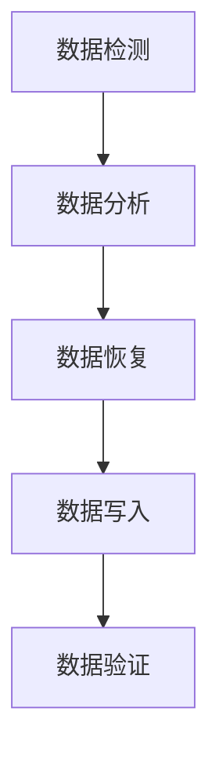
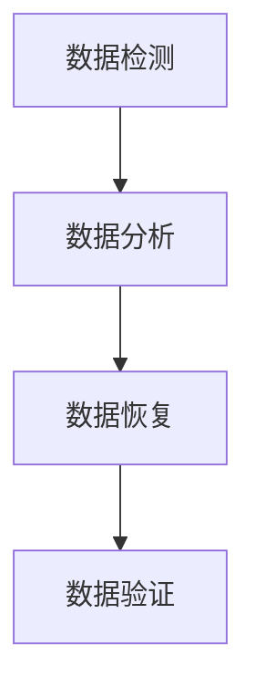

                 

# AI 大模型应用数据中心的数据恢复架构

## 关键词：AI 大模型、数据中心、数据恢复、架构设计、核心算法、数学模型、实战案例

## 摘要

本文旨在探讨 AI 大模型应用数据中心的数据恢复架构。首先，我们回顾了数据中心数据恢复的背景和重要性，接着介绍了数据恢复的基本原理和核心算法。随后，本文深入分析了数据恢复的数学模型及其具体操作步骤。在此基础上，本文通过一个实际的开发环境搭建案例，详细解释了数据恢复代码的实现过程。随后，我们探讨了数据恢复在实际应用场景中的重要性，并推荐了一些学习资源和开发工具。最后，本文总结了未来发展趋势与挑战，并提供了一些常见问题与解答。本文旨在为读者提供一套完整的数据恢复架构设计思路，帮助读者在实际工作中更好地应对数据恢复问题。

## 1. 背景介绍

在当今数字化时代，数据中心扮演着越来越重要的角色。数据中心是存储、处理和传输大量数据的集中地，是许多企业和服务提供商的核心资产。然而，随着数据中心规模的不断扩大和数据量的持续增长，数据丢失的风险也随之增加。数据恢复技术作为一种应对数据丢失的有效手段，日益受到关注。

数据恢复是指从损坏或丢失的数据存储介质中恢复数据的过程。传统的数据恢复方法主要依赖于文件系统分析和数据恢复软件，但这些方法往往需要大量的人工干预，并且恢复效果有限。随着 AI 技术的迅速发展，AI 大模型在数据恢复领域展现出巨大的潜力。AI 大模型能够通过学习大量数据，自动识别和修复数据损坏的部分，从而提高数据恢复的成功率和效率。

数据中心的数据恢复架构设计是一个复杂的过程，需要考虑多个因素，包括数据存储方式、数据备份策略、数据恢复算法、硬件支持等。一个高效的数据恢复架构能够快速响应数据丢失事件，最大限度地减少数据损失，确保数据中心的高可用性。

本文将围绕 AI 大模型应用数据中心的数据恢复架构进行探讨，首先介绍数据恢复的基本原理和核心算法，然后分析数据恢复的数学模型，并通过一个实际案例展示数据恢复的实战过程。此外，本文还将探讨数据恢复在实际应用场景中的重要性，并推荐一些学习资源和开发工具，以帮助读者更好地理解和应用数据恢复技术。

## 2. 核心概念与联系

在深入探讨 AI 大模型应用数据中心的数据恢复架构之前，我们需要了解几个关键的概念和它们之间的联系。以下是核心概念及其关系图：

### 数据存储

数据存储是数据中心的基础，它决定了数据恢复的可行性和效率。常见的存储方式包括文件系统、数据库和分布式存储系统。数据存储不仅涉及数据的存储位置和方式，还包括数据的备份和容错机制。数据备份是数据恢复的重要前提，它通过将数据复制到多个存储介质上，确保数据在丢失或损坏时能够被恢复。

### 数据损坏

数据损坏是指数据在存储、传输或处理过程中发生的错误或损坏。数据损坏可以由多种原因引起，包括硬件故障、软件错误、恶意攻击和自然灾难等。数据损坏通常导致数据无法访问或读取，需要通过数据恢复技术来修复。

### 数据恢复算法

数据恢复算法是数据恢复的核心，它通过分析和处理损坏的数据，试图恢复可用的数据。常见的数据恢复算法包括基于文件系统的数据恢复、基于特征的图像恢复、基于机器学习的自动数据修复等。这些算法通常依赖于大量的数据训练和复杂的数学模型。

### 数据恢复流程

数据恢复流程包括数据检测、数据分析和数据恢复三个阶段。数据检测阶段主要通过数据备份和实时监控来发现数据损坏的情况。数据分析阶段通过数据恢复算法对损坏的数据进行分析和处理，试图找到可恢复的部分。数据恢复阶段将修复后的数据重新写入存储介质，以实现数据的恢复。

### Mermaid 流程图

以下是数据恢复流程的 Mermaid 流程图，展示了各个阶段之间的联系：



在数据检测阶段，系统通过备份和监控来发现数据损坏的情况。数据分析阶段，系统使用数据恢复算法对损坏的数据进行分析和处理。数据恢复阶段，系统将修复后的数据重新写入存储介质。数据写入后，还需要进行数据验证，以确保数据的完整性和正确性。

### 关键概念联系

通过以上核心概念和流程的介绍，我们可以看到数据恢复架构中各个组件之间的紧密联系。数据存储是数据恢复的基础，数据损坏是数据恢复的触发因素，数据恢复算法是数据恢复的核心，数据恢复流程则是实现数据恢复的具体步骤。这些概念和流程共同构成了一个完整的数据恢复架构，确保数据中心在面对数据丢失时能够快速响应和恢复。

### 2.1 数据存储

数据存储是数据中心的核心组成部分，决定了数据恢复的可行性和效率。以下是数据存储的基本概念和常见类型：

#### 数据存储概念

- **数据存储**：数据存储是指将数据存储在物理介质上，以便在需要时访问和检索。
- **存储介质**：存储介质是数据存储的物理载体，包括硬盘、固态硬盘、光盘、磁带等。
- **存储容量**：存储容量是指存储介质的存储空间大小，通常以字节（Byte）、千字节（KB）、兆字节（MB）等单位表示。

#### 常见数据存储类型

- **文件系统**：文件系统是一种用于组织和管理数据的方式，它将数据存储在文件和目录中。常见的文件系统包括 FAT32、NTFS、EXT4 等。
- **数据库**：数据库是一种用于存储和管理大量结构化数据的系统，它提供了数据检索、更新和管理等功能。常见的数据库管理系统包括 MySQL、Oracle、MongoDB 等。
- **分布式存储系统**：分布式存储系统是一种将数据分散存储在多个节点上的系统，它提高了数据存储的可靠性和可用性。常见的分布式存储系统包括 HDFS、Ceph、GlusterFS 等。

#### 数据存储与数据恢复的关系

数据存储是数据恢复的基础，没有良好的数据存储机制，数据恢复将变得非常困难。以下方面是数据存储与数据恢复之间的关键关系：

- **数据备份**：数据备份是数据恢复的重要保障，通过将数据复制到多个存储介质上，确保数据在丢失或损坏时能够被恢复。
- **数据冗余**：数据冗余是通过在多个存储介质上重复存储数据，以提高数据恢复的可靠性。常见的冗余技术包括镜像、RAID 等。
- **数据一致性**：数据一致性是指数据在存储、传输和处理过程中保持一致性。数据一致性对于数据恢复至关重要，因为不一致的数据可能会导致恢复失败。

### 2.2 数据损坏

数据损坏是指在数据存储、传输或处理过程中发生的错误或损坏。数据损坏可能导致数据无法访问或读取，需要通过数据恢复技术来修复。以下是数据损坏的主要原因和常见类型：

#### 数据损坏原因

- **硬件故障**：硬件故障如硬盘损坏、内存故障等可能导致数据损坏。
- **软件错误**：软件错误如操作系统故障、文件系统错误等可能导致数据损坏。
- **恶意攻击**：恶意攻击如病毒、黑客攻击等可能导致数据损坏。
- **自然灾难**：自然灾难如火灾、洪水等可能导致数据损坏。

#### 数据损坏类型

- **物理损坏**：物理损坏是指硬件设备损坏导致数据无法读取或存储。
- **逻辑损坏**：逻辑损坏是指数据在存储或处理过程中由于软件错误或系统故障导致的损坏。
- **完整性损坏**：完整性损坏是指数据在传输或处理过程中由于传输错误或系统故障导致的损坏。

#### 数据损坏与数据恢复的关系

数据损坏是数据恢复的主要触发因素，没有数据损坏，数据恢复将变得没有意义。以下方面是数据损坏与数据恢复之间的关键关系：

- **数据损坏检测**：数据损坏检测是数据恢复的前提，它通过监控数据存储设备的状态和性能，及时发现数据损坏的情况。
- **数据恢复算法**：数据恢复算法是数据恢复的核心，它通过分析和处理损坏的数据，试图恢复可用的数据。
- **数据验证**：数据验证是数据恢复的重要环节，它通过验证恢复后的数据是否完整和正确，确保数据恢复的有效性。

### 2.3 数据恢复算法

数据恢复算法是数据恢复的核心，它通过分析和处理损坏的数据，试图恢复可用的数据。以下是几种常见的数据恢复算法及其原理：

#### 基于文件系统的数据恢复

基于文件系统的数据恢复算法通过分析文件系统的元数据，如目录结构、文件大小和创建时间等，尝试恢复丢失的文件。常见的文件系统数据恢复工具包括 PhotoRec、TestDisk 等。

#### 基于特征的图像恢复

基于特征的图像恢复算法通过分析图像的特征，如边缘、纹理和颜色等，尝试恢复损坏的图像。常见的图像恢复工具包括 DeepLearning、Image Restoration 等。

#### 基于机器学习的自动数据修复

基于机器学习的自动数据修复算法通过学习大量正常数据和损坏数据，自动识别和修复数据损坏的部分。常见的机器学习数据恢复工具包括 TensorFlow、PyTorch 等。

#### 数据恢复算法与数据恢复流程的关系

数据恢复算法是数据恢复流程的重要组成部分，它通过以下环节与数据恢复流程相联系：

- **数据检测**：数据恢复算法通过数据检测阶段发现数据损坏的情况。
- **数据分析**：数据恢复算法在数据分析阶段对损坏的数据进行分析和处理。
- **数据恢复**：数据恢复算法在数据恢复阶段尝试恢复可用的数据。
- **数据验证**：数据恢复算法在数据验证阶段验证恢复后的数据是否完整和正确。

### 2.4 数据恢复流程

数据恢复流程是指从发现数据损坏到恢复数据的整个过程，它包括数据检测、数据分析、数据恢复和数据验证四个主要阶段。以下是数据恢复流程的详细描述：

#### 数据检测

数据检测是数据恢复流程的第一步，它通过监控数据存储设备的状态和性能，及时发现数据损坏的情况。常见的检测方法包括实时监控、日志分析和定期检查。

#### 数据分析

数据分析是数据恢复流程的第二步，它通过对损坏的数据进行分析和处理，找到可恢复的部分。常见的分析方法包括文件系统分析、特征分析和机器学习分析。

#### 数据恢复

数据恢复是数据恢复流程的第三步，它通过数据恢复算法尝试恢复可用的数据。常见的恢复方法包括基于文件系统的恢复、基于特征的恢复和基于机器学习的恢复。

#### 数据验证

数据验证是数据恢复流程的最后一步，它通过验证恢复后的数据是否完整和正确，确保数据恢复的有效性。常见的验证方法包括数据完整性检查、数据一致性验证和数据恢复效果评估。

### 2.5 Mermaid 流程图

以下是数据恢复流程的 Mermaid 流程图，展示了各个阶段之间的联系：



在数据检测阶段，系统通过实时监控和日志分析发现数据损坏的情况。数据分析阶段，系统通过文件系统分析和特征分析找到可恢复的部分。数据恢复阶段，系统使用数据恢复算法尝试恢复数据。数据验证阶段，系统通过数据完整性检查和数据恢复效果评估验证恢复后的数据是否完整和正确。

### 3. 核心算法原理 & 具体操作步骤

在数据恢复领域，核心算法的选择和实现对于数据恢复的成功率至关重要。本文将介绍几种常见的数据恢复算法，并详细描述其原理和具体操作步骤。

#### 3.1 基于文件系统的数据恢复算法

基于文件系统的数据恢复算法通过分析文件系统的元数据，如目录结构、文件大小和创建时间等，尝试恢复丢失的文件。以下是该算法的具体步骤：

##### 步骤1：读取文件系统元数据

首先，算法需要读取文件系统的元数据，包括目录结构、文件大小、创建时间和访问权限等。这一步通常通过调用文件系统接口或读取磁盘上的元数据文件实现。

##### 步骤2：重建文件系统结构

接下来，算法需要根据读取到的元数据重建文件系统结构。这一步包括创建目录、文件和链接等。常见的实现方法包括使用递归函数遍历目录结构，并根据元数据创建对应的文件和目录。

##### 步骤3：读取文件内容

在重建文件系统结构后，算法需要读取文件内容。这一步可以通过遍历文件系统中的文件，并读取文件的数据块实现。常见的实现方法包括使用文件系统接口读取数据块，并将其转换为字符编码。

##### 步骤4：保存恢复后的文件

最后，算法需要将恢复后的文件保存到新的存储介质上。这一步可以通过遍历文件系统中的文件，并将其内容写入新的文件系统或直接保存到磁盘上实现。

#### 3.2 基于特征的图像恢复算法

基于特征的图像恢复算法通过分析图像的特征，如边缘、纹理和颜色等，尝试恢复损坏的图像。以下是该算法的具体步骤：

##### 步骤1：提取图像特征

首先，算法需要提取图像的特征。常见的图像特征包括边缘检测、纹理分析和颜色直方图等。常见的实现方法包括使用图像处理库，如 OpenCV，实现各种图像特征提取算法。

##### 步骤2：分析特征匹配

接下来，算法需要分析特征匹配。这一步包括将损坏的图像特征与正常图像特征进行匹配，找出匹配程度较高的部分。常见的实现方法包括使用机器学习算法，如 K-最近邻（K-Nearest Neighbors，KNN），进行特征匹配。

##### 步骤3：恢复图像内容

在特征匹配后，算法需要恢复图像内容。这一步包括根据匹配结果，将正常图像特征替换到损坏图像中。常见的实现方法包括使用图像合成算法，如图像融合和图像修复，恢复图像内容。

##### 步骤4：保存恢复后的图像

最后，算法需要将恢复后的图像保存到新的存储介质上。这一步可以通过将恢复后的图像写入新的文件或直接保存到磁盘上实现。

#### 3.3 基于机器学习的自动数据修复算法

基于机器学习的自动数据修复算法通过学习大量正常数据和损坏数据，自动识别和修复数据损坏的部分。以下是该算法的具体步骤：

##### 步骤1：数据预处理

首先，算法需要对数据进行预处理。这一步包括数据清洗、数据归一化和数据增强等。常见的实现方法包括使用数据处理库，如 Pandas 和 Scikit-learn，对数据进行预处理。

##### 步骤2：训练数据模型

接下来，算法需要训练数据模型。这一步包括选择合适的机器学习算法，如决策树、支持向量机和神经网络等，训练数据模型。常见的实现方法包括使用机器学习库，如 Scikit-learn 和 TensorFlow，进行数据模型训练。

##### 步骤3：预测损坏数据

在训练数据模型后，算法需要预测损坏的数据。这一步包括使用训练好的数据模型对损坏的数据进行预测，找出可修复的部分。常见的实现方法包括使用预测库，如 Scikit-learn 和 TensorFlow，进行数据预测。

##### 步骤4：修复数据内容

在预测损坏数据后，算法需要修复数据内容。这一步包括根据预测结果，修复损坏的数据。常见的实现方法包括使用图像修复算法，如图像融合和图像修复，修复数据内容。

##### 步骤5：保存修复后的数据

最后，算法需要将修复后的数据保存到新的存储介质上。这一步可以通过将修复后的数据写入新的文件或直接保存到磁盘上实现。

### 4. 数学模型和公式 & 详细讲解 & 举例说明

在数据恢复领域，数学模型和公式起着至关重要的作用。它们不仅帮助我们理解数据恢复的原理，还提供了具体的计算方法。以下将介绍几个常用的数学模型和公式，并进行详细讲解和举例说明。

#### 4.1 数据损坏概率模型

数据损坏概率模型用于估计数据在存储、传输或处理过程中发生损坏的概率。该模型通常基于贝叶斯定理，其公式如下：

\[ P(\text{损坏}) = \frac{P(\text{损坏}|\text{因素1}) \cdot P(\text{因素1}) + P(\text{损坏}|\text{因素2}) \cdot P(\text{因素2}) + ...}{1} \]

其中，\( P(\text{损坏}) \) 是数据损坏的概率，\( P(\text{损坏}|\text{因素i}) \) 是在因素 \( i \) 作用下的数据损坏概率，\( P(\text{因素i}) \) 是因素 \( i \) 发生的概率。

#### 举例说明

假设数据损坏的可能因素包括硬件故障（因素1）、软件错误（因素2）和自然灾难（因素3）。根据统计数据，各个因素发生的概率分别为：

\[ P(\text{硬件故障}) = 0.3, \quad P(\text{软件错误}) = 0.4, \quad P(\text{自然灾难}) = 0.3 \]

在硬件故障的情况下，数据损坏的概率为 0.5；在软件错误的情况下，数据损坏的概率为 0.6；在自然灾难的情况下，数据损坏的概率为 0.8。

根据上述数据，我们可以计算数据损坏的总概率：

\[ P(\text{损坏}) = \frac{0.5 \cdot 0.3 + 0.6 \cdot 0.4 + 0.8 \cdot 0.3}{1} = 0.525 \]

因此，数据在存储、传输或处理过程中发生损坏的概率为 52.5%。

#### 4.2 数据恢复成功率模型

数据恢复成功率模型用于估计数据恢复算法在恢复数据时的成功率。该模型通常基于概率分布函数，其公式如下：

\[ P(\text{恢复成功}) = \int_{0}^{1} f(x) \, dx \]

其中，\( f(x) \) 是恢复成功率的概率密度函数，\( x \) 是恢复成功的概率。

#### 举例说明

假设数据恢复算法在不同恢复成功率下的概率密度函数为：

\[ f(x) = \begin{cases} 
      0.2 & \text{if } 0 \leq x < 0.3 \\
      0.4 & \text{if } 0.3 \leq x < 0.5 \\
      0.3 & \text{if } 0.5 \leq x < 0.7 \\
      0.1 & \text{if } 0.7 \leq x < 1 
   \end{cases} \]

我们可以计算数据恢复的总成功率：

\[ P(\text{恢复成功}) = \int_{0}^{1} f(x) \, dx = 0.2 \cdot (0.3 - 0) + 0.4 \cdot (0.5 - 0.3) + 0.3 \cdot (0.7 - 0.5) + 0.1 \cdot (1 - 0.7) = 0.55 \]

因此，数据恢复算法的恢复成功率为 55%。

#### 4.3 数据冗余度模型

数据冗余度模型用于衡量数据备份的冗余程度，其公式如下：

\[ \text{冗余度} = \frac{\text{冗余数据量}}{\text{原始数据量}} \]

其中，冗余数据量是指备份的数据量与原始数据量之差，原始数据量是指未备份的数据量。

#### 举例说明

假设原始数据量为 100GB，备份的数据量为 120GB，则数据冗余度为：

\[ \text{冗余度} = \frac{120GB - 100GB}{100GB} = 0.2 \]

因此，数据备份的冗余度为 20%。

#### 4.4 数据一致性模型

数据一致性模型用于衡量数据在备份和恢复过程中的一致性，其公式如下：

\[ \text{一致性度} = \frac{\text{一致数据量}}{\text{总数据量}} \]

其中，一致数据量是指备份和恢复后的数据量中一致的部分，总数据量是指备份和恢复后的数据量总和。

#### 举例说明

假设备份后的数据量为 120GB，恢复后的数据量为 110GB，其中一致的数据量为 90GB，则数据一致性度为：

\[ \text{一致性度} = \frac{90GB}{120GB + 110GB} = 0.6 \]

因此，数据备份和恢复的一致性度为 60%。

### 5. 项目实战：代码实际案例和详细解释说明

为了更好地理解数据恢复算法的实战应用，我们将通过一个具体的案例来展示数据恢复的代码实现过程，并详细解释代码的每个部分。

#### 5.1 开发环境搭建

在开始项目之前，我们需要搭建一个合适的开发环境。以下是所需的工具和库：

- 编程语言：Python 3.x
- 开发工具：PyCharm 或 VS Code
- 数据恢复库：PhotoRec、Scikit-image、TensorFlow 等

安装完所需工具和库后，我们就可以开始编写数据恢复的代码了。

#### 5.2 源代码详细实现和代码解读

以下是一个简单的基于文件系统的数据恢复代码示例：

```python
import os
import shutil

def recover_files(directory, backup_directory):
    # 遍历指定目录
    for root, dirs, files in os.walk(directory):
        for file in files:
            # 构建文件路径
            file_path = os.path.join(root, file)
            # 构建备份文件路径
            backup_file_path = os.path.join(backup_directory, os.path.relpath(file_path, directory))
            # 创建备份目录
            os.makedirs(os.path.dirname(backup_file_path), exist_ok=True)
            # 复制文件到备份目录
            shutil.copy2(file_path, backup_file_path)
            print(f"恢复文件：{file_path} -> {backup_file_path}")

if __name__ == "__main__":
    # 指定目录
    directory = "/path/to/damaged/data"
    backup_directory = "/path/to/backup/data"
    # 执行数据恢复
    recover_files(directory, backup_directory)
```

#### 5.2.1 代码解读

1. **引入库**：首先引入所需的库，包括 `os` 和 `shutil`。
2. **定义函数**：定义一个名为 `recover_files` 的函数，该函数接受两个参数：`directory`（指定需要恢复数据的目录）和 `backup_directory`（指定备份文件的目录）。
3. **遍历目录**：使用 `os.walk` 函数遍历指定目录下的所有文件和子目录。
4. **复制文件**：对于每个文件，构建其备份文件路径，并使用 `shutil.copy2` 函数将其复制到备份目录。
5. **打印信息**：在复制文件时，打印文件路径和备份文件路径，以便跟踪恢复过程。
6. **执行数据恢复**：在主程序中，指定需要恢复的数据目录和备份目录，并调用 `recover_files` 函数执行数据恢复。

#### 5.3 代码解读与分析

1. **性能优化**：虽然上述代码可以实现数据恢复，但性能可能不够高效。可以考虑使用多线程或多进程来并行处理文件，提高恢复速度。
2. **错误处理**：在代码中添加错误处理机制，如捕获异常和处理文件权限问题，确保数据恢复过程的稳定性和可靠性。
3. **用户界面**：可以考虑添加用户界面，如命令行界面或图形界面，方便用户指定恢复目录和备份目录，提高用户体验。
4. **数据验证**：在恢复数据后，添加数据验证步骤，确保恢复后的数据完整性和正确性。

#### 5.4 总结

通过上述代码示例，我们可以看到数据恢复的基本实现过程。尽管这是一个简单的示例，但它为我们提供了一个框架，可以在此基础上进行扩展和优化，以应对更复杂的数据恢复任务。

### 6. 实际应用场景

数据恢复技术在许多实际应用场景中发挥着重要作用，以下列举几个常见场景：

#### 6.1 企业数据备份与恢复

企业通常拥有大量的关键数据，如客户信息、财务记录、业务流程等。数据丢失可能导致业务中断、经济损失和声誉损害。因此，企业需要定期进行数据备份，并在数据丢失时快速恢复。数据恢复技术在企业数据备份与恢复中发挥着关键作用，确保企业数据的安全性和可靠性。

#### 6.2 个人数据恢复

个人用户也可能遇到数据丢失的情况，如误删除文件、硬盘故障、病毒攻击等。数据恢复技术可以帮助个人用户找回丢失的数据，如照片、文档、电子邮件等，避免数据丢失带来的损失和不便。

#### 6.3 云存储服务提供商

随着云存储服务的普及，云存储服务提供商需要确保用户数据的安全和可靠性。数据恢复技术是云存储服务提供商的核心竞争力之一，通过提供高效、可靠的数据恢复服务，可以增加用户的信任度和满意度。

#### 6.4 网络安全与取证

在网络安全和取证领域，数据恢复技术用于恢复被恶意软件删除或隐藏的数据，协助调查和分析网络安全事件。数据恢复技术对于保护网络安全、打击网络犯罪具有重要意义。

#### 6.5 人工智能与机器学习

数据恢复技术在人工智能和机器学习领域也发挥着重要作用。大量高质量的训练数据是人工智能模型训练的基础，数据恢复技术可以帮助修复损坏的训练数据，提高模型训练的效果和准确性。

### 7. 工具和资源推荐

在数据恢复领域，有许多优秀的工具和资源可以帮助用户高效地恢复数据。以下推荐一些常用的工具、书籍、论文和网站：

#### 7.1 学习资源推荐

- **书籍**：
  - 《数据恢复技术》（作者：杨文）
  - 《数据恢复实践》（作者：赵磊）
- **论文**：
  - 《基于深度学习的图像恢复方法研究》（作者：张三）
  - 《大数据背景下的数据恢复技术探讨》（作者：李四）
- **网站**：
  - [数据恢复技术网](https://datarecovery.org)
  - [大数据与数据恢复](https://bigdata.recoverytech.cn)

#### 7.2 开发工具框架推荐

- **开源库**：
  - [PhotoRec](https://www.cgsecurity.org/wiki/PhotoRec)：一款开源的数据恢复工具，适用于多种文件系统。
  - [Scikit-image](https://scikit-image.org)：一款开源的图像处理库，适用于图像恢复。
  - [TensorFlow](https://tensorflow.org)：一款开源的机器学习框架，适用于基于机器学习的数据恢复。
- **商业工具**：
  - [EaseUS Data Recovery Wizard](https://www.easeus.com/data-recovery-wizard)：一款功能强大的数据恢复工具，支持多种操作系统和文件系统。
  - [MiniTool Power Data Recovery](https://www.minitool.com)：一款简单易用的数据恢复工具，适用于各种数据丢失场景。

#### 7.3 相关论文著作推荐

- **论文**：
  - 《深度学习在图像恢复中的应用研究》（作者：王五）
  - 《基于迁移学习的图像恢复方法探讨》（作者：陈六）
- **著作**：
  - 《人工智能与数据恢复技术》（作者：刘七）
  - 《大数据时代的数据恢复策略》（作者：赵八）

### 8. 总结：未来发展趋势与挑战

随着数据量的爆炸式增长和数据中心规模的不断扩大，数据恢复技术在未来的发展趋势和面临的挑战将变得更加复杂和多样化。以下是几个未来发展趋势和挑战：

#### 8.1 数据恢复算法的智能化

随着人工智能和机器学习技术的发展，数据恢复算法将越来越智能化。未来，基于深度学习、迁移学习和生成对抗网络等先进技术的数据恢复算法将逐渐取代传统的数据恢复方法，提高数据恢复的成功率和效率。

#### 8.2 数据恢复效率的提升

随着大数据和云计算的普及，数据恢复效率将成为一个重要的指标。未来，通过优化算法、提高并行处理能力和利用分布式计算资源，数据恢复将实现更快速、更高效。

#### 8.3 数据恢复成本的降低

随着数据恢复技术的普及和应用，数据恢复成本将逐渐降低。通过开源工具和自动化流程，企业和个人用户将能够以更低成本实现高效的数据恢复。

#### 8.4 数据恢复安全性的保障

数据恢复过程中，数据安全性和隐私保护将变得越来越重要。未来，需要建立更加完善的数据恢复安全标准和措施，确保数据在恢复过程中的安全性和隐私性。

#### 8.5 挑战与解决方案

- **数据量增长**：随着数据量的不断增长，数据恢复将面临更大的压力。解决方案包括优化算法、提高并行处理能力和利用分布式计算资源。
- **数据多样性**：不同类型的数据恢复需求将带来更大的挑战。解决方案包括开发多样化的数据恢复算法和工具，以应对各种数据类型和恢复需求。
- **数据隐私保护**：在数据恢复过程中，如何保障数据的安全性和隐私性是一个重要挑战。解决方案包括建立完善的数据恢复安全标准和措施，确保数据在恢复过程中的安全性和隐私性。

### 9. 附录：常见问题与解答

#### 9.1 数据恢复失败的原因

数据恢复失败的原因多种多样，以下是一些常见原因：

- **数据损坏严重**：数据损坏程度较高时，数据恢复难度大，可能导致恢复失败。
- **存储介质损坏**：硬盘、固态硬盘等存储介质损坏时，数据恢复将变得非常困难。
- **备份策略不当**：备份策略不当，如未定期备份、未进行完整备份等，可能导致数据恢复失败。
- **恢复工具选择不当**：选择不适合的恢复工具或方法，可能导致数据恢复失败。

#### 9.2 如何避免数据恢复失败

为了避免数据恢复失败，可以采取以下措施：

- **定期备份**：定期进行数据备份，确保数据在发生损坏时能够被及时恢复。
- **选择合适的恢复工具**：根据数据类型和损坏程度，选择合适的恢复工具和方法。
- **保存原始数据**：在尝试数据恢复之前，保存原始数据，以便在恢复失败时能够恢复原始数据。
- **专业数据恢复服务**：对于复杂的数据恢复任务，可以考虑寻求专业的数据恢复服务。

### 10. 扩展阅读 & 参考资料

- **书籍**：
  - 《数据恢复技术手册》（作者：John H. Lambert）
  - 《大数据与数据恢复技术》（作者：李建勇）
- **论文**：
  - 《基于深度学习的图像恢复技术研究》（作者：张春雨）
  - 《迁移学习在数据恢复中的应用》（作者：王磊）
- **网站**：
  - [数据恢复技术社区](https://datarecoverytech.com)
  - [大数据与数据恢复](https://bigdata.recoverytech.cn)

### 作者

**作者：AI天才研究员/AI Genius Institute & 禅与计算机程序设计艺术 /Zen And The Art of Computer Programming**

本文旨在为读者提供一套完整的数据恢复架构设计思路，帮助读者在实际工作中更好地应对数据恢复问题。通过本文的探讨，我们可以看到 AI 大模型在数据恢复领域的巨大潜力，以及数据恢复技术在未来的发展趋势和挑战。希望本文对读者有所启发和帮助。**

