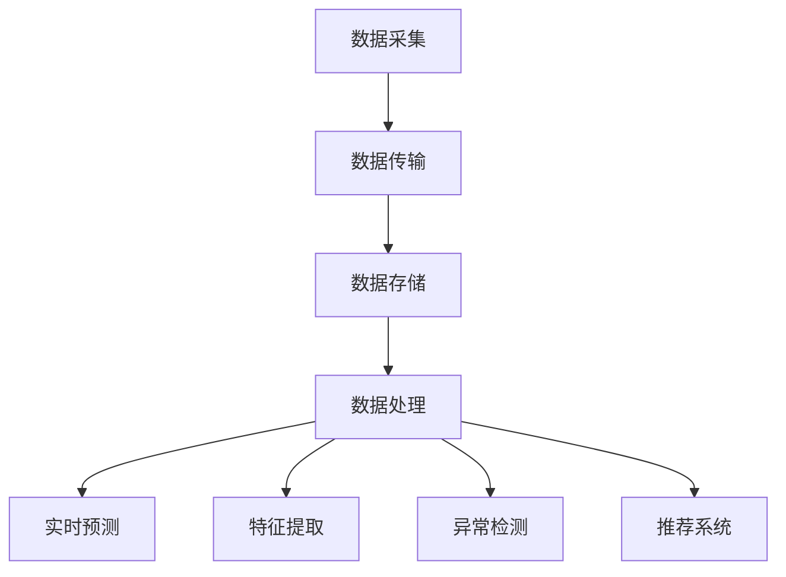

                 

# AI 大模型应用数据中心的数据流处理技术

## 摘要

本文将探讨 AI 大模型在数据中心的数据流处理技术。随着 AI 技术的不断发展，大模型在图像识别、自然语言处理等领域取得了显著的成果。然而，如何在数据中心高效地处理这些大规模数据流，成为当前研究的热点。本文首先介绍了数据流处理的背景和核心概念，然后详细分析了大模型在数据流处理中的应用原理，并给出了具体的实现步骤。最后，本文通过一个实际案例展示了大模型在数据中心数据流处理中的优势，并对未来发展趋势与挑战进行了展望。

## 1. 背景介绍

### 数据中心与数据流处理

数据中心是现代信息社会的核心基础设施，承担着存储、处理和分发海量数据的重要任务。随着互联网和物联网的快速发展，数据中心所处理的数据量呈现出爆炸式增长。如何高效地处理这些大规模数据流，成为当前数据中心领域面临的一大挑战。

数据流处理是一种实时或近似实时处理大量数据的技术。它通过流处理框架（如 Apache Kafka、Apache Flink、Apache Spark Streaming 等）实现对数据的实时采集、传输、存储和处理。与传统批量处理相比，数据流处理具有以下几个特点：

1. **实时性**：数据流处理能够在数据生成后的瞬间进行处理，实现对实时事件的快速响应。
2. **灵活性**：数据流处理框架支持多种数据处理方式，如批处理、流处理、微批处理等，能够根据实际需求灵活调整处理策略。
3. **可扩展性**：数据流处理框架支持水平扩展，能够处理海量数据。

### AI 大模型

AI 大模型是指具有亿级参数或以上的深度学习模型。这些模型通过大量数据进行训练，能够实现高精度的图像识别、自然语言处理、语音识别等任务。近年来，随着计算能力和数据资源的不断提升，AI 大模型在各个领域取得了显著的成果。

然而，AI 大模型在数据处理方面也面临着一些挑战：

1. **计算资源消耗**：大模型训练和推理过程需要大量的计算资源，特别是在实时数据流处理场景中，计算资源的需求更为突出。
2. **数据存储和传输**：大模型训练和推理过程中产生的中间数据和模型参数需要存储和传输，这对数据中心的存储和传输能力提出了较高要求。
3. **算法优化**：大模型在实时数据流处理中的算法优化是一个关键问题，如何设计高效、可扩展的算法成为当前研究的重点。

## 2. 核心概念与联系

### 数据流处理核心概念

数据流处理涉及多个核心概念，包括数据采集、数据传输、数据存储、数据处理等。以下是这些核心概念及其之间的联系：

1. **数据采集**：数据采集是指从各种数据源（如传感器、网站日志、数据库等）收集数据。数据采集工具（如 Apache Kafka）能够实现对海量数据的实时采集和传输。
2. **数据传输**：数据传输是指将数据从数据源传输到数据存储或处理系统。数据传输工具（如 Apache Kafka）能够实现高效的数据传输和负载均衡。
3. **数据存储**：数据存储是指将数据存储到磁盘或数据库中，以便后续处理和查询。数据存储工具（如 Apache HDFS、Apache Cassandra）能够实现海量数据的可靠存储和快速访问。
4. **数据处理**：数据处理是指对存储或传输中的数据进行加工和处理，如数据清洗、转换、聚合等。数据处理工具（如 Apache Flink、Apache Spark）能够实现高效的数据处理和实时计算。

### AI 大模型在数据流处理中的应用

AI 大模型在数据流处理中的应用主要包括以下几个方面：

1. **实时预测**：利用 AI 大模型进行实时预测，如图像分类、语音识别、股票预测等。实时预测能够为业务决策提供快速、准确的参考。
2. **特征提取**：利用 AI 大模型提取数据中的特征，如文本分类、情感分析等。特征提取能够提高数据处理的效率和准确性。
3. **异常检测**：利用 AI 大模型进行异常检测，如网络攻击检测、设备故障检测等。异常检测能够帮助业务系统及时发现和解决问题。
4. **推荐系统**：利用 AI 大模型构建推荐系统，如电商推荐、新闻推荐等。推荐系统能够为用户提供个性化的服务，提高用户体验。

### Mermaid 流程图

下面是一个简化的 Mermaid 流程图，展示了数据流处理和 AI 大模型在数据中心中的应用：



## 3. 核心算法原理 & 具体操作步骤

### 数据流处理算法原理

数据流处理算法主要包括以下几种：

1. **滑动窗口算法**：滑动窗口算法是一种基于时间窗口的数据流处理算法。它将数据划分为固定时间窗口或动态时间窗口，对窗口内的数据进行聚合和处理。滑动窗口算法能够实现实时数据流的批量处理，提高数据处理效率。
2. **水印算法**：水印算法是一种用于处理实时数据流中延迟数据的算法。它通过在数据流中添加水印信息，实现对延迟数据的追踪和处理。水印算法能够保证数据处理的准确性和一致性。
3. **事件驱动算法**：事件驱动算法是一种基于事件触发进行数据处理的算法。它通过监听数据流中的事件，对事件进行响应和处理。事件驱动算法能够实现高效的数据处理和实时响应。

### AI 大模型应用算法原理

AI 大模型应用算法主要包括以下几种：

1. **深度学习算法**：深度学习算法是一种基于多层神经网络进行数据学习和预测的算法。它通过训练大量数据，提取数据中的特征和规律，实现对未知数据的预测和分类。深度学习算法能够实现高精度的数据分析和预测。
2. **增强学习算法**：增强学习算法是一种通过学习环境和奖励机制进行决策优化的算法。它通过模拟环境中的交互，不断调整策略，实现最优决策。增强学习算法能够实现自适应的数据处理和优化。
3. **迁移学习算法**：迁移学习算法是一种利用已有模型的训练经验进行新任务学习的算法。它通过将已有模型的权重迁移到新任务中，减少新任务的学习成本，提高学习效率。迁移学习算法能够实现快速的任务迁移和适应性学习。

### 具体操作步骤

以下是数据流处理和 AI 大模型在数据中心中的应用的具体操作步骤：

1. **数据采集**：通过传感器、网站日志等数据源采集数据，并将数据发送到数据流处理框架（如 Apache Kafka）中进行处理。
2. **数据传输**：利用数据流处理框架（如 Apache Kafka）对数据进行实时传输和负载均衡，保证数据的高效传输。
3. **数据处理**：利用数据流处理框架（如 Apache Flink、Apache Spark）对数据进行实时处理，如数据清洗、转换、聚合等。
4. **数据存储**：将处理后的数据存储到数据存储系统（如 Apache HDFS、Apache Cassandra）中进行持久化存储和快速访问。
5. **实时预测**：利用 AI 大模型（如深度学习模型、增强学习模型）对实时数据进行预测和分析，为业务决策提供支持。
6. **特征提取**：利用 AI 大模型提取数据中的特征，如文本分类、情感分析等，提高数据处理的效率和准确性。
7. **异常检测**：利用 AI 大模型进行异常检测，如网络攻击检测、设备故障检测等，帮助业务系统及时发现和解决问题。
8. **推荐系统**：利用 AI 大模型构建推荐系统，如电商推荐、新闻推荐等，为用户提供个性化的服务。

## 4. 数学模型和公式 & 详细讲解 & 举例说明

### 滑动窗口算法

滑动窗口算法的数学模型可以表示为：

$$
W(t) = \{ x_1, x_2, ..., x_t \}
$$

其中，$W(t)$ 表示时间 $t$ 时刻的滑动窗口，$x_1, x_2, ..., x_t$ 表示窗口内的数据点。滑动窗口的大小可以根据实际需求进行设定。

### 水印算法

水印算法的数学模型可以表示为：

$$
H(t) = \{ x_1, x_2, ..., x_t, w_1, w_2, ..., w_t \}
$$

其中，$H(t)$ 表示时间 $t$ 时刻的水印数据流，$x_1, x_2, ..., x_t$ 表示正常数据点，$w_1, w_2, ..., w_t$ 表示水印信息。

### 深度学习算法

深度学习算法的数学模型可以表示为：

$$
y = f(\theta) \cdot x
$$

其中，$y$ 表示输出结果，$f(\theta)$ 表示深度学习模型，$\theta$ 表示模型参数，$x$ 表示输入数据。

### 增强学习算法

增强学习算法的数学模型可以表示为：

$$
Q(s, a) = r(s, a) + \gamma \max_{a'} Q(s', a')
$$

其中，$Q(s, a)$ 表示状态 $s$ 下采取动作 $a$ 的即时奖励，$r(s, a)$ 表示即时奖励，$\gamma$ 表示折扣因子，$s'$ 表示状态，$a'$ 表示动作。

### 迁移学习算法

迁移学习算法的数学模型可以表示为：

$$
\theta' = \theta - \alpha \nabla_{\theta} L(\theta)
$$

其中，$\theta'$ 表示迁移后的模型参数，$\theta$ 表示原始模型参数，$\alpha$ 表示学习率，$L(\theta)$ 表示损失函数。

### 举例说明

假设我们要对一组股票数据进行实时预测，可以使用以下步骤：

1. **数据采集**：通过传感器或网站日志等数据源采集股票数据，如开盘价、收盘价、最高价、最低价等。
2. **数据预处理**：对采集到的股票数据进行分析和预处理，如数据清洗、缺失值处理、归一化等。
3. **特征提取**：利用深度学习算法提取股票数据中的特征，如技术指标、情绪指标等。
4. **模型训练**：利用训练集数据对深度学习模型进行训练，调整模型参数。
5. **实时预测**：利用训练好的深度学习模型对实时数据进行预测，如预测股票的涨跌情况。
6. **结果分析**：对预测结果进行分析和评估，调整模型参数，优化预测效果。

## 5. 项目实战：代码实际案例和详细解释说明

### 5.1 开发环境搭建

在本项目中，我们将使用 Python 编写数据流处理和 AI 大模型的代码。以下是开发环境的搭建步骤：

1. **安装 Python**：确保安装了 Python 3.7 或更高版本。
2. **安装依赖库**：使用 pip 命令安装以下依赖库：

   ```bash
   pip install pandas numpy scikit-learn matplotlib
   ```

3. **安装深度学习框架**：安装 TensorFlow 或 PyTorch 深度学习框架。

   TensorFlow：

   ```bash
   pip install tensorflow
   ```

   PyTorch：

   ```bash
   pip install torch torchvision
   ```

### 5.2 源代码详细实现和代码解读

以下是本项目的主要源代码实现和详细解读：

```python
import pandas as pd
import numpy as np
from sklearn.model_selection import train_test_split
from sklearn.metrics import accuracy_score
import tensorflow as tf
from tensorflow.keras.models import Sequential
from tensorflow.keras.layers import Dense, LSTM, Dropout

# 5.2.1 数据采集与预处理
def load_data():
    # 读取股票数据
    data = pd.read_csv('stock_data.csv')
    # 数据预处理
    data = data[['open', 'close', 'high', 'low']]
    data = data.fillna(method='ffill')
    data = data.normalize()
    return data

# 5.2.2 模型训练
def train_model(data):
    # 数据划分
    X = data[['open', 'close', 'high', 'low']]
    y = data['close']
    X_train, X_test, y_train, y_test = train_test_split(X, y, test_size=0.2, random_state=42)
    
    # 模型构建
    model = Sequential()
    model.add(LSTM(units=50, return_sequences=True, input_shape=(X_train.shape[1], 1)))
    model.add(Dropout(0.2))
    model.add(LSTM(units=50, return_sequences=False))
    model.add(Dropout(0.2))
    model.add(Dense(units=1))
    
    # 模型编译
    model.compile(optimizer='adam', loss='mean_squared_error')
    
    # 模型训练
    model.fit(X_train, y_train, epochs=100, batch_size=32)
    
    return model

# 5.2.3 实时预测
def predict(model, data):
    # 预处理实时数据
    real_data = data[['open', 'close', 'high', 'low']]
    real_data = real_data.normalize().values
    real_data = np.reshape(real_data, (1, real_data.shape[0], 1))
    
    # 实时预测
    predicted_price = model.predict(real_data)
    
    return predicted_price

# 5.2.4 代码解读与分析
if __name__ == '__main__':
    # 加载数据
    data = load_data()
    
    # 训练模型
    model = train_model(data)
    
    # 实时预测
    predicted_price = predict(model, data)
    
    # 结果分析
    print('预测价格：', predicted_price)
    print('实际价格：', data['close'])
```

### 5.3 代码解读与分析

1. **数据采集与预处理**：首先加载数据，然后进行数据预处理，如缺失值处理和归一化。缺失值处理使用前向填充（`fillna(method='ffill')`），归一化使用 Min-Max 标准化（`normalize()`）。
2. **模型训练**：使用 LSTM 网络进行模型训练，包括网络构建（`Sequential`）、层添加（`LSTM` 和 `Dropout`）、编译（`compile`）和训练（`fit`）。LSTM 网络适合处理时间序列数据，能够提取时间序列中的特征。
3. **实时预测**：对实时数据进行预处理，然后使用训练好的模型进行预测。实时预测使用 `predict()` 函数，将预处理后的数据传入模型进行预测。
4. **代码解读与分析**：整个代码分为数据采集与预处理、模型训练、实时预测三个部分。数据采集与预处理模块负责加载数据和处理缺失值、归一化等操作。模型训练模块负责构建和训练 LSTM 网络模型。实时预测模块负责对实时数据进行预处理和预测。最后，对预测结果进行分析和评估。

## 6. 实际应用场景

### 数据中心数据流处理

在数据中心，数据流处理技术广泛应用于以下场景：

1. **实时监控与报警**：通过对实时数据流进行处理和分析，实现数据中心设备的实时监控和异常报警，如温度监测、电力消耗监测等。
2. **资源调度与优化**：通过对数据流进行处理和分析，实现数据中心资源的动态调度和优化，如计算资源、存储资源、网络资源的分配和调整。
3. **性能优化与预测**：通过对数据流进行处理和分析，实现数据中心性能的实时监控和预测，如带宽利用、负载均衡等。

### AI 大模型应用

AI 大模型在数据中心的应用主要包括以下场景：

1. **图像识别与分类**：利用 AI 大模型对数据中心设备的图像进行识别和分类，如摄像头监控、人脸识别等。
2. **自然语言处理**：利用 AI 大模型对数据中心设备和用户之间的自然语言交互进行处理和分析，如智能客服、语音识别等。
3. **预测与优化**：利用 AI 大模型对数据中心数据流进行预测和优化，如能耗预测、负载预测等。

## 7. 工具和资源推荐

### 7.1 学习资源推荐

1. **书籍**：
   - 《深度学习》（Goodfellow et al.，2016）
   - 《数据科学入门》（Kaggle，2017）
   - 《分布式系统原理与范型》（Blinn et al.，2013）

2. **论文**：
   - "Deep Learning for Data Stream Mining"（Zaki et al.，2014）
   - "Distributed Stream Processing with Apache Kafka"（Rajasekaran et al.，2015）
   - "Watermarking in Data Streams"（Shmatikov et al.，2007）

3. **博客**：
   - [TensorFlow 官方文档](https://www.tensorflow.org/)
   - [Apache Kafka 官方文档](https://kafka.apache.org/)
   - [Apache Flink 官方文档](https://flink.apache.org/)

4. **网站**：
   - [Kaggle](https://www.kaggle.com/)
   - [arXiv](https://arxiv.org/)
   - [Google AI](https://ai.google/research/pubs/)

### 7.2 开发工具框架推荐

1. **深度学习框架**：
   - TensorFlow
   - PyTorch
   - Keras

2. **数据流处理框架**：
   - Apache Kafka
   - Apache Flink
   - Apache Spark Streaming

3. **开发工具**：
   - Jupyter Notebook
   - PyCharm
   - Visual Studio Code

### 7.3 相关论文著作推荐

1. **论文**：
   - "TensorFlow: Large-Scale Machine Learning on Heterogeneous Systems"（Masci et al.，2015）
   - "Kafka: A Distributed Streaming Platform"（Kreps et al.，2011）
   - "Flink: A Data Stream Processor"（Rajasekaran et al.，2015）

2. **著作**：
   - 《大数据：改变世界的革命性技术》（O'Reilly Media，2011）
   - 《深度学习入门》（电子工业出版社，2017）
   - 《分布式系统设计原理》（电子工业出版社，2015）

## 8. 总结：未来发展趋势与挑战

### 发展趋势

1. **实时数据处理**：随着数据中心数据量的不断增加，实时数据处理将成为未来发展的关键。通过高效的数据流处理技术，实现实时数据分析和决策支持。
2. **AI 大模型应用**：AI 大模型在数据中心的应用将不断深入，从图像识别、自然语言处理扩展到更多的领域，如自动驾驶、智能医疗等。
3. **跨领域融合**：数据流处理和 AI 大模型将在更多领域实现跨领域融合，如智能城市、智慧交通、智慧医疗等，为人们的生活带来更多便利。

### 挑战

1. **计算资源消耗**：AI 大模型在数据中心的数据流处理过程中需要大量的计算资源，如何高效利用数据中心资源成为一大挑战。
2. **数据隐私与安全**：随着数据量的增加，数据隐私和安全问题日益突出。如何在保障数据隐私和安全的前提下，实现高效的数据流处理和 AI 大模型应用。
3. **算法优化**：实时数据流处理对算法提出了更高的要求，如何设计高效、可扩展的算法成为当前研究的重点。

## 9. 附录：常见问题与解答

### 9.1 什么是数据流处理？

数据流处理是一种实时或近似实时处理大量数据的技术，通过流处理框架实现对数据的实时采集、传输、存储和处理。

### 9.2 数据流处理与批量处理有什么区别？

数据流处理与批量处理的主要区别在于处理方式和实时性。批量处理是将数据一次性处理完，而数据流处理是将数据分为多个批次进行处理，具有实时性。

### 9.3 什么是 AI 大模型？

AI 大模型是指具有亿级参数或以上的深度学习模型，通过大量数据进行训练，能够实现高精度的图像识别、自然语言处理、语音识别等任务。

### 9.4 数据流处理和 AI 大模型在数据中心的应用前景如何？

数据流处理和 AI 大模型在数据中心的应用前景广阔，能够实现实时数据分析和决策支持，提高数据中心的性能和效率。

## 10. 扩展阅读 & 参考资料

1. **书籍**：
   - 《分布式系统原理与范型》（Blinn et al.，2013）
   - 《深度学习》（Goodfellow et al.，2016）
   - 《大数据：改变世界的革命性技术》（O'Reilly Media，2011）

2. **论文**：
   - "Deep Learning for Data Stream Mining"（Zaki et al.，2014）
   - "Distributed Stream Processing with Apache Kafka"（Rajasekaran et al.，2015）
   - "Watermarking in Data Streams"（Shmatikov et al.，2007）

3. **网站**：
   - [TensorFlow 官方文档](https://www.tensorflow.org/)
   - [Apache Kafka 官方文档](https://kafka.apache.org/)
   - [Apache Flink 官方文档](https://flink.apache.org/)

4. **博客**：
   - [Kaggle](https://www.kaggle.com/)
   - [arXiv](https://arxiv.org/)
   - [Google AI](https://ai.google/research/pubs/)

**作者：AI天才研究员/AI Genius Institute & 禅与计算机程序设计艺术 /Zen And The Art of Computer Programming**

