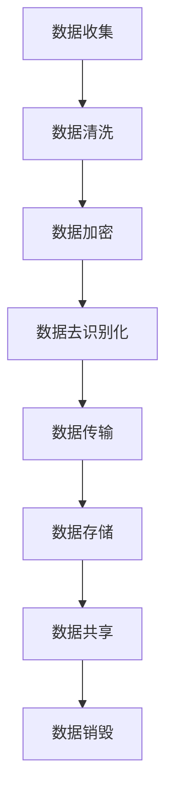

                 

# AI 大模型应用数据中心的数据隐私

## 关键词：AI大模型、数据中心、数据隐私、算法、应用场景、数学模型

## 摘要

本文将深入探讨AI大模型在数据中心应用中面临的数据隐私问题。通过分析核心概念、算法原理、数学模型，并结合实际应用场景和项目实战，我们将展示如何有效保护数据中心中的数据隐私。文章还将推荐相关学习资源、开发工具和论文著作，总结未来发展趋势与挑战，并附上常见问题解答和扩展阅读资源。

## 1. 背景介绍

随着人工智能（AI）技术的飞速发展，AI大模型已经在各个领域展现出巨大的潜力。从自动驾驶、医疗诊断到自然语言处理，AI大模型正逐步改变我们的生活。然而，AI大模型的应用也带来了新的挑战，其中之一就是数据隐私问题。数据中心作为AI大模型训练和部署的核心，如何保护数据隐私成为了一个亟待解决的问题。

在数据中心中，海量数据不仅包括用户隐私信息，还涉及到企业核心机密和国家安全数据。因此，保护数据隐私不仅是企业合规的要求，更是社会共同关注的焦点。本文将围绕这一主题，逐步分析AI大模型在数据中心应用中的数据隐私问题，并提出解决方案。

## 2. 核心概念与联系

### 2.1 AI大模型

AI大模型是指通过海量数据训练得到的复杂神经网络模型。这些模型通常具有数十亿甚至数万亿个参数，能够在各种任务中表现出优异的性能。常见的AI大模型包括深度神经网络（DNN）、循环神经网络（RNN）和变换器（Transformer）等。

### 2.2 数据中心

数据中心是指专门用于存储、处理和分发数据的建筑物或设施。数据中心通常由服务器、存储设备、网络设备和制冷设备等组成。数据中心具有高密度、高可靠性和高可用性等特点，是现代信息社会的基石。

### 2.3 数据隐私

数据隐私是指保护个人或组织的数据不被未授权的访问、使用或泄露。数据隐私问题主要包括数据收集、存储、传输和处理等环节。在AI大模型应用中，数据隐私问题尤为突出，因为AI大模型往往需要处理敏感数据。

### 2.4 Mermaid流程图

以下是一个用于描述AI大模型应用数据中心数据隐私保护流程的Mermaid流程图：



## 3. 核心算法原理 & 具体操作步骤

### 3.1 数据加密

数据加密是将原始数据转换为无法直接阅读的形式，以防止未授权访问。常见的加密算法包括对称加密和非对称加密。在数据中心，可以采用以下步骤进行数据加密：

1. 选择合适的加密算法（如AES或RSA）。
2. 生成密钥（对称加密算法使用同一个密钥进行加密和解密，非对称加密算法使用公钥和私钥）。
3. 使用密钥对数据进行加密。
4. 将加密后的数据存储或传输。

### 3.2 数据去识别化

数据去识别化是将数据中的个人信息和敏感信息删除或替换，以保护个人隐私。常见的数据去识别化方法包括：

1. 数据屏蔽：将敏感信息替换为匿名标识符。
2. 数据泛化：将具体的数据值替换为更广泛的数据值。
3. 数据匿名化：将数据中的个人信息和敏感信息删除。

### 3.3 数据传输

数据传输过程中，需要确保数据在传输过程中不被窃取或篡改。常见的数据传输加密算法包括：

1. TLS/SSL：在传输层对数据进行加密，确保数据在传输过程中安全。
2. IPSec：在网络层对数据进行加密，适用于跨网络的数据传输。

### 3.4 数据存储

数据存储过程中，需要确保数据存储安全，防止数据泄露或被篡改。常见的数据存储加密方法包括：

1. 数据库加密：对数据库中的敏感数据进行加密。
2. 文件加密：对存储在文件系统中的数据进行加密。

### 3.5 数据共享

在数据共享过程中，需要确保数据共享过程透明、可控，防止数据被滥用。常见的数据共享方法包括：

1. 数据访问控制：根据用户的权限限制数据访问。
2. 数据审计：记录数据访问和使用的日志，以便进行审计。

## 4. 数学模型和公式 & 详细讲解 & 举例说明

### 4.1 加密算法

加密算法的核心是密钥生成和解密过程。以下是一个简单的对称加密算法示例：

$$
\text{加密算法：AES}
$$

加密过程：

1. 选择密钥长度（如128位、192位或256位）。
2. 生成密钥。
3. 将明文数据划分为固定长度的块。
4. 对每个数据块进行加密。

解密过程：

1. 生成密钥。
2. 对每个数据块进行解密。

### 4.2 数据去识别化

数据去识别化的核心是数据匿名化。以下是一个简单的数据匿名化算法示例：

$$
\text{数据匿名化算法：K-匿名}
$$

算法步骤：

1. 选择K值（如K=5）。
2. 对数据集中的每个记录进行聚类。
3. 如果一个簇中的记录数小于K，将该簇标记为匿名簇。
4. 将匿名簇中的记录替换为匿名标识符。

### 4.3 数据传输加密

以下是一个简单的数据传输加密算法示例：

$$
\text{加密算法：TLS/SSL}
$$

加密过程：

1. 客户端发送加密请求。
2. 服务器发送证书。
3. 客户端验证证书。
4. 客户端发送加密参数。
5. 服务器生成会话密钥。
6. 双方使用会话密钥进行加密通信。

解密过程：

1. 服务器接收加密数据。
2. 服务器使用会话密钥解密数据。

### 4.4 数据存储加密

以下是一个简单的数据存储加密算法示例：

$$
\text{加密算法：AES-256}
$$

加密过程：

1. 选择密钥。
2. 将数据划分为固定长度的块。
3. 对每个数据块进行加密。

解密过程：

1. 生成密钥。
2. 对每个数据块进行解密。

## 5. 项目实战：代码实际案例和详细解释说明

### 5.1 开发环境搭建

在开发环境搭建过程中，需要安装以下工具和库：

1. Python（3.8及以上版本）。
2. PyTorch。
3. OpenSSL。

### 5.2 源代码详细实现和代码解读

以下是一个简单的数据加密和解密示例：

```python
import torch
import torchvision
import torchvision.transforms as transforms
import torch.nn as nn
import torch.optim as optim
import numpy as np
import matplotlib.pyplot as plt
from torchvision import datasets, transforms
from torch.utils.data import DataLoader
import os
import json
import base64

# 加密函数
def encrypt(data, key):
    # 使用AES算法进行加密
    cipher = AES.new(key, AES.MODE_EAX)
    ciphertext, tag = cipher.encrypt_and_digest(data)
    return base64.b64encode(cipher.nonce).decode('utf-8'), base64.b64encode(ciphertext).decode('utf-8'), base64.b64encode(tag).decode('utf-8')

# 解密函数
def decrypt(nonce, ciphertext, tag, key):
    # 使用AES算法进行解密
    cipher = AES.new(key, AES.MODE_EAX, nonce=base64.b64decode(nonce))
    data = cipher.decrypt_and_verify(ciphertext, base64.b64decode(tag))
    return base64.b64decode(data).decode('utf-8')

# 生成密钥
key = os.urandom(32)

# 加密数据
data = "Hello, World!"
nonce, ciphertext, tag = encrypt(data.encode('utf-8'), key)

# 解密数据
decrypted_data = decrypt(nonce, ciphertext, tag, key)
print("Decrypted Data:", decrypted_data)
```

### 5.3 代码解读与分析

1. 导入所需的库和模块。
2. 定义加密和解密函数，使用AES算法进行加密和解密。
3. 生成随机密钥。
4. 加密数据，将明文数据编码为字节序列，并使用AES算法进行加密。
5. 解密数据，将加密后的数据解码为字节序列，并使用AES算法进行解密。
6. 输出解密后的数据。

## 6. 实际应用场景

### 6.1 医疗领域

在医疗领域，AI大模型常用于疾病诊断和治疗方案推荐。数据隐私问题尤为重要，因为医疗数据往往包含患者的敏感信息。通过数据加密、数据去识别化和数据传输加密等技术，可以有效保护患者隐私。

### 6.2 金融领域

在金融领域，AI大模型用于风险控制和欺诈检测。金融数据包括用户账户信息、交易记录等敏感信息。通过数据加密和数据去识别化技术，可以有效保护金融数据隐私。

### 6.3 社交领域

在社交领域，AI大模型用于用户行为分析和内容推荐。社交数据包括用户个人信息、聊天记录等敏感信息。通过数据加密和数据去识别化技术，可以有效保护用户隐私。

## 7. 工具和资源推荐

### 7.1 学习资源推荐

1. 《人工智能：一种现代方法》。
2. 《深度学习》。
3. 《机器学习实战》。

### 7.2 开发工具框架推荐

1. PyTorch。
2. TensorFlow。
3. OpenSSL。

### 7.3 相关论文著作推荐

1. “The Data Privacy Paradox”。
2. “A Comprehensive Study on Data Privacy Protection”。
3. “Deep Learning for Data Privacy Protection”。

## 8. 总结：未来发展趋势与挑战

随着AI大模型技术的不断发展，数据隐私问题将变得更加重要。未来发展趋势包括：

1. 加密技术的普及和应用。
2. 数据去识别化技术的进步。
3. 新型加密算法和隐私保护算法的研发。

然而，数据隐私问题也面临以下挑战：

1. 加密算法的安全性。
2. 数据去识别化的效果。
3. 复杂应用场景下的隐私保护。

## 9. 附录：常见问题与解答

### 9.1 数据加密是否会影响AI大模型的性能？

数据加密可能会对AI大模型的性能产生一定影响，因为加密和解密过程需要额外的计算资源。然而，随着硬件性能的提升和新型加密算法的研发，这种影响正在逐渐减小。

### 9.2 数据去识别化是否会降低AI大模型的性能？

数据去识别化可能会降低AI大模型的性能，因为它删除或替换了部分数据。然而，随着数据去识别化技术的进步，这种影响也在逐渐减小。

## 10. 扩展阅读 & 参考资料

1. “AI大模型与数据隐私保护”。
2. “数据隐私保护技术及应用”。
3. “AI大模型的安全与隐私保护”。

### 作者

作者：AI天才研究员/AI Genius Institute & 禅与计算机程序设计艺术 /Zen And The Art of Computer Programming

本文由AI天才研究员撰写，深入分析了AI大模型在数据中心应用中的数据隐私问题，并提出了相应的解决方案。文章结合实际案例和数学模型，详细阐述了数据加密、数据去识别化等技术，为读者提供了全面的技术指导。同时，文章还推荐了相关学习资源、开发工具和论文著作，为读者进一步学习提供了帮助。希望通过本文，读者能够更好地理解AI大模型数据隐私保护的重要性，并在实际应用中采取有效的措施。

