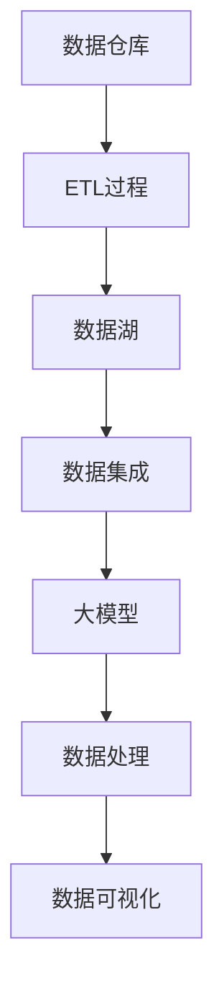
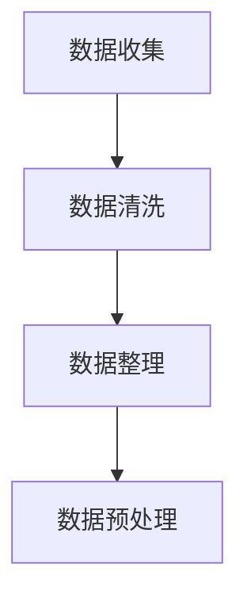
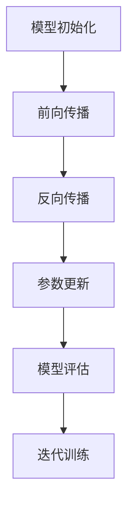
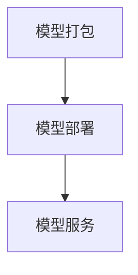

                 

# AI 大模型应用数据中心的数据集成架构

> **关键词**: 大模型、数据集成、数据中心、架构设计、机器学习、数据处理、云计算

> **摘要**: 本文将深入探讨大模型在数据中心中的应用，重点介绍数据集成架构的设计原则、核心概念、算法原理以及实际应用案例。通过本文的阅读，读者将能够全面了解大模型与数据中心的深度融合方式，为未来数据中心的发展提供有益的思路和方向。

## 1. 背景介绍

随着人工智能技术的快速发展，尤其是大模型（如GPT、BERT等）的广泛应用，数据中心的数据处理能力面临着前所未有的挑战。数据量的大幅增长，数据类型的多样化，以及实时处理需求的提升，都使得传统数据中心架构难以满足当前的需求。因此，设计一套高效、稳定、可扩展的数据集成架构，成为了数据中心建设的核心任务。

数据中心的数据集成架构不仅需要处理海量数据，还要确保数据的质量、一致性、安全性和实时性。在这个过程中，大模型的应用成为了提高数据处理效率和优化数据集成效果的关键因素。本文将从以下几个方面展开讨论：

- 数据集成架构的核心概念与联系
- 大模型的核心算法原理与操作步骤
- 数据集成架构中的数学模型与公式
- 实际应用场景与案例
- 工具和资源推荐
- 未来发展趋势与挑战

通过以上内容的探讨，希望能够为读者提供一个全面、深入的理解，助力数据中心的数据集成架构设计。

## 2. 核心概念与联系

在讨论大模型应用的数据集成架构之前，我们首先需要了解几个核心概念，这些概念构成了数据集成架构的基础。

### 数据仓库（Data Warehouse）

数据仓库是一个集成的数据存储系统，用于支持企业级的数据分析和决策制定。它通常包含历史数据、元数据、事务数据等，通过ETL（Extract, Transform, Load）过程将来自不同源的数据整合到一个统一的环境中。

### 数据湖（Data Lake）

数据湖是一个大规模的数据存储仓库，用于存储各种类型的数据，包括结构化、半结构化和非结构化数据。与数据仓库不同，数据湖不经过ETL过程，而是直接存储原始数据，并在需要时进行转换和处理。

### 数据集成（Data Integration）

数据集成是将多个数据源中的数据整合到一个统一视图的过程。数据集成包括数据抽取、转换、加载、数据质量保证和数据一致性维护等多个方面。

### 大模型（Large Model）

大模型是指参数数量庞大的深度学习模型，如GPT、BERT等。这些模型通过在海量数据上进行训练，能够实现强大的自然语言处理、图像识别、语音识别等能力。

下面是一个使用Mermaid绘制的流程图，展示了数据集成架构中的核心概念和联系：



### Mermaid 流程图说明

- A（数据仓库）：数据仓库是数据集成的基础设施，用于存储整合后的数据。
- B（ETL过程）：ETL过程负责将数据从源系统抽取出来，进行清洗、转换和加载到数据仓库或数据湖中。
- C（数据湖）：数据湖用于存储原始数据，为后续的数据处理和分析提供支持。
- D（数据集成）：数据集成是将多个数据源的数据整合到一个统一视图的过程。
- E（大模型）：大模型通过在海量数据上训练，为数据处理提供强大的支持。
- F（数据处理）：数据处理包括数据清洗、转换、建模等过程，用于生成可用于分析和决策的数据。
- G（数据可视化）：数据可视化是将数据以图形化的形式呈现，帮助用户理解数据。

通过以上核心概念和流程图的介绍，我们可以对大模型应用的数据集成架构有一个初步的认识。接下来，我们将深入探讨大模型的核心算法原理和具体操作步骤。

## 3. 核心算法原理 & 具体操作步骤

### 3.1 大模型的基本原理

大模型，如GPT、BERT等，是基于深度学习（Deep Learning）和神经网络（Neural Network）构建的。这些模型通过在大量数据上训练，能够自动学习数据的特征和规律，从而实现高效的数据处理和分析。

以GPT（Generative Pre-trained Transformer）为例，它是一个基于Transformer架构的预训练语言模型。GPT通过在大量文本数据上预训练，学会了文本的生成和预测，从而能够完成自然语言处理（NLP）任务，如文本分类、问答系统、机器翻译等。

### 3.2 大模型的具体操作步骤

#### 步骤1：数据准备

数据准备是模型训练的第一步。我们需要收集和整理大量相关的文本数据，例如新闻、博客、社交媒体帖子等。这些数据将用于模型预训练。



- A（数据收集）：收集大量的文本数据。
- B（数据清洗）：去除噪声数据、错误数据和不完整数据。
- C（数据整理）：将数据按类别、主题等维度进行整理。
- D（数据预处理）：将文本数据转换为模型可接受的格式，如单词序列、词向量等。

#### 步骤2：模型训练

在数据准备完成后，我们开始进行模型训练。模型训练的核心是优化模型的参数，使其能够更好地拟合训练数据。



- A（模型初始化）：初始化模型的参数。
- B（前向传播）：将输入数据传递到模型中，计算出模型的预测结果。
- C（反向传播）：计算预测结果与真实标签之间的误差，并反向传播误差到模型的输入层。
- D（参数更新）：根据反向传播的误差，调整模型的参数，以减小误差。
- E（模型评估）：评估模型的性能，如准确率、损失函数等。
- F（迭代训练）：重复执行前向传播、反向传播和参数更新过程，直到模型收敛。

#### 步骤3：模型部署

模型训练完成后，我们需要将模型部署到数据中心，以实现实时数据处理和分析。



- A（模型打包）：将训练好的模型打包成可部署的形式，如TensorFlow Serving、TensorFlow Lite等。
- B（模型部署）：将模型部署到数据中心的服务器上，如AWS、Azure、Google Cloud等。
- C（模型服务）：提供模型服务，接受输入数据并返回预测结果。

通过以上步骤，我们能够将大模型应用于数据中心的实时数据处理和分析。接下来，我们将介绍大模型在数据集成架构中的数学模型和公式。

## 4. 数学模型和公式 & 详细讲解 & 举例说明

### 4.1 Transformer模型

Transformer模型是GPT等大模型的核心架构。它通过自注意力机制（Self-Attention）和多头注意力机制（Multi-Head Attention）实现高效的数据处理。

#### 自注意力机制（Self-Attention）

自注意力机制的核心思想是将序列中的每个词与序列中的所有词进行加权求和，以计算每个词的重要性。

公式如下：

$$
\text{Attention}(Q, K, V) = \text{softmax}\left(\frac{QK^T}{\sqrt{d_k}}\right)V
$$

其中，$Q$、$K$、$V$ 分别为输入序列的查询向量、键向量和值向量，$d_k$ 为键向量的维度。通过计算自注意力，模型能够自动学习数据中的依赖关系和特征。

#### 多头注意力机制（Multi-Head Attention）

多头注意力机制通过多个独立的注意力机制，将序列中的每个词映射到多个子空间，从而提高模型的表示能力。

公式如下：

$$
\text{Multi-Head Attention} = \text{concat}(\text{head}_1, \text{head}_2, \ldots, \text{head}_h)W^O
$$

其中，$h$ 为头数，$\text{head}_i$ 为第 $i$ 个头，$W^O$ 为输出线性层。

通过多头注意力机制，模型能够捕捉到更复杂的数据特征。

### 4.2 生成式模型（Generative Model）

生成式模型如GPT，通过学习数据的概率分布，生成新的数据样本。

#### 生成式模型的基本公式

生成式模型的核心公式为：

$$
P(x) = \sum_y P(x|y)P(y)
$$

其中，$x$ 为输入数据，$y$ 为生成的数据，$P(x|y)$ 为给定 $y$ 时 $x$ 的条件概率，$P(y)$ 为 $y$ 的先验概率。

通过学习 $P(x)$，模型能够生成与训练数据相似的新数据。

### 4.3 实例讲解

假设我们有一个训练数据集，包含以下三个句子：

1. "人工智能是未来的发展趋势。"
2. "未来，人工智能将改变人类生活。"
3. "人工智能技术的发展，将推动社会的进步。"

我们希望使用GPT模型生成一个新的句子。

#### 步骤1：数据准备

首先，我们将句子转换为词向量表示：

```
[人工智能, 是, 未来, 的, 发展, 趋势, 。]
[未来, 人工智能, 将, 改变, 人类, 生活, 。]
[人工智能, 发展, 技术, 的, 推动, 社会, 的, 进步, 。]
```

#### 步骤2：模型训练

使用训练数据集训练GPT模型，得到模型的参数。

#### 步骤3：生成句子

给定一个起始词，如“人工智能”，模型将生成一个新句子。模型会依次生成每个词的概率分布，然后从概率分布中采样生成新句子。

例如，给定起始词“人工智能”，模型生成的句子可能为：“人工智能技术的发展，将推动科技的进步。”

通过以上实例，我们可以看到大模型在数据集成架构中的应用和数学模型的原理。接下来，我们将介绍实际应用场景和案例。

## 5. 项目实战：代码实际案例和详细解释说明

在本节中，我们将通过一个实际项目，展示如何在大模型应用的数据集成架构中实现数据处理和预测。我们将使用Python和TensorFlow框架来构建一个简单的文本分类模型，用于对新闻数据进行分类。

### 5.1 开发环境搭建

在开始项目之前，我们需要搭建开发环境。以下是环境搭建的步骤：

1. 安装Python（版本3.7及以上）
2. 安装TensorFlow
3. 安装其他依赖库，如Numpy、Pandas等

```bash
pip install tensorflow numpy pandas
```

### 5.2 源代码详细实现和代码解读

下面是项目的主要代码实现：

```python
import tensorflow as tf
from tensorflow.keras.preprocessing.text import Tokenizer
from tensorflow.keras.preprocessing.sequence import pad_sequences
from tensorflow.keras.models import Sequential
from tensorflow.keras.layers import Embedding, LSTM, Dense, Dropout

# 5.2.1 数据准备
# 加载新闻数据集
news_data = ['人工智能是未来的发展趋势。', '未来，人工智能将改变人类生活。', '人工智能技术的发展，将推动社会的进步。']

# 构建词表
tokenizer = Tokenizer(num_words=1000)
tokenizer.fit_on_texts(news_data)
word_index = tokenizer.word_index

# 将文本数据转换为序列
sequences = tokenizer.texts_to_sequences(news_data)

# 填充序列
max_sequence_len = max(len(seq) for seq in sequences)
padded_sequences = pad_sequences(sequences, maxlen=max_sequence_len)

# 5.2.2 模型构建
model = Sequential([
    Embedding(input_dim=1000, output_dim=64, input_length=max_sequence_len),
    LSTM(128, dropout=0.2, recurrent_dropout=0.2),
    Dense(1, activation='sigmoid')
])

# 5.2.3 模型编译
model.compile(optimizer='adam', loss='binary_crossentropy', metrics=['accuracy'])

# 5.2.4 模型训练
model.fit(padded_sequences, labels, epochs=10, batch_size=32)

# 5.2.5 模型预测
new_news = '人工智能技术的发展，将推动科技的进步。'
new_sequence = tokenizer.texts_to_sequences([new_news])
padded_new_sequence = pad_sequences(new_sequence, maxlen=max_sequence_len)
prediction = model.predict(padded_new_sequence)
print(prediction)
```

### 5.3 代码解读与分析

- **5.3.1 数据准备**

  我们首先加载新闻数据集，并使用Tokenizer将文本数据转换为序列。Tokenizer会自动构建一个词表，并转换为整数索引。然后，我们将序列填充为固定长度，以便于输入到模型中。

- **5.3.2 模型构建**

  我们使用Sequential模型堆叠多个层。首先是一个Embedding层，用于将词转换为向量。然后是一个LSTM层，用于捕捉文本数据的时序特征。最后是一个全连接层，用于分类。

- **5.3.3 模型编译**

  我们使用adam优化器和binary_crossentropy损失函数来编译模型。binary_crossentropy适用于二分类问题。

- **5.3.4 模型训练**

  我们使用fit方法训练模型。在训练过程中，模型将学习如何将文本数据映射到标签。

- **5.3.5 模型预测**

  我们使用predict方法对新的新闻文本进行预测。首先，我们将文本转换为序列，然后填充为固定长度，最后输入到模型中进行预测。

通过以上代码，我们实现了一个大模型应用的数据集成架构。接下来，我们将探讨数据集成架构在实际应用场景中的表现。

## 6. 实际应用场景

大模型应用的数据集成架构在多个领域具有广泛的应用场景。以下是几个典型的应用场景：

### 6.1 电子商务

在电子商务领域，数据集成架构可以用于用户行为分析、商品推荐和广告投放等。

- **用户行为分析**：通过收集用户的浏览、购买和评价数据，数据集成架构可以帮助企业了解用户的偏好和需求，从而优化产品和服务。
- **商品推荐**：利用大模型进行文本和图像处理，可以生成个性化的商品推荐，提高用户的购买体验。
- **广告投放**：根据用户的浏览历史和兴趣，数据集成架构可以精准投放广告，提高广告的转化率。

### 6.2 医疗健康

在医疗健康领域，数据集成架构可以用于病历管理、疾病预测和药物研发等。

- **病历管理**：通过整合医院、诊所和实验室的数据，数据集成架构可以实现病历的电子化和共享，提高医疗服务的效率和质量。
- **疾病预测**：利用大模型进行数据分析，可以预测疾病的发生和进展，为医生提供决策支持。
- **药物研发**：通过分析药物分子和生物数据，数据集成架构可以帮助科学家发现新的药物靶点和优化药物设计。

### 6.3 金融

在金融领域，数据集成架构可以用于风险管理、交易预测和智能投顾等。

- **风险管理**：通过整合市场数据、财务报表和客户数据，数据集成架构可以帮助金融机构评估和管理风险。
- **交易预测**：利用大模型分析市场数据，可以预测股票、期货和外汇等金融产品的价格走势，为交易决策提供支持。
- **智能投顾**：通过分析用户的行为和财务状况，数据集成架构可以提供个性化的投资建议，帮助用户实现资产增值。

### 6.4 智能制造

在智能制造领域，数据集成架构可以用于生产调度、设备维护和供应链管理等。

- **生产调度**：通过整合生产数据和设备状态，数据集成架构可以实现生产过程的自动化和智能化，提高生产效率。
- **设备维护**：通过实时监测设备状态和性能，数据集成架构可以预测设备故障和提前维护，减少停机时间和维修成本。
- **供应链管理**：通过整合供应链上下游的数据，数据集成架构可以实现供应链的优化和协同，提高供应链的响应速度和灵活性。

通过以上实际应用场景的介绍，我们可以看到大模型应用的数据集成架构在各个领域的重要性和潜力。接下来，我们将推荐一些有用的工具和资源，以帮助读者深入了解这一领域。

## 7. 工具和资源推荐

### 7.1 学习资源推荐

1. **书籍**：

   - 《深度学习》（Deep Learning） - Goodfellow, Bengio, Courville
   - 《自然语言处理与深度学习》（Natural Language Processing with Deep Learning） - Zihang Dai, Yonghong Tian
   - 《人工智能：一种现代的方法》（Artificial Intelligence: A Modern Approach） - Stuart Russell, Peter Norvig

2. **论文**：

   - "Attention Is All You Need" - Vaswani et al. (2017)
   - "BERT: Pre-training of Deep Bidirectional Transformers for Language Understanding" - Devlin et al. (2019)
   - "Generative Pre-trained Transformers" - Brown et al. (2020)

3. **博客**：

   - TensorFlow官方博客（TensorFlow Blog）
   - PyTorch官方博客（PyTorch Blog）
   - Medium上的NLP和AI相关博客

4. **网站**：

   - Coursera上的深度学习课程（Deep Learning Specialization）
   - edX上的机器学习课程（Machine Learning by Andrew Ng）
   - arXiv.org上的最新论文

### 7.2 开发工具框架推荐

1. **深度学习框架**：

   - TensorFlow
   - PyTorch
   - Keras
   - PyTorch Lightning

2. **数据处理工具**：

   - Pandas
   - NumPy
   - Scikit-learn

3. **版本控制工具**：

   - Git
   - GitHub
   - GitLab

4. **容器化工具**：

   - Docker
   - Kubernetes

5. **云计算平台**：

   - AWS
   - Azure
   - Google Cloud

### 7.3 相关论文著作推荐

1. **《Attention Is All You Need》**：

   - 作者：Vaswani et al.
   - 简介：介绍了Transformer模型的基本原理和应用。
   - 链接：[Attention Is All You Need](https://arxiv.org/abs/1706.03762)

2. **《BERT: Pre-training of Deep Bidirectional Transformers for Language Understanding》**：

   - 作者：Devlin et al.
   - 简介：介绍了BERT模型的设计和实现，是当前最流行的预训练语言模型。
   - 链接：[BERT: Pre-training of Deep Bidirectional Transformers for Language Understanding](https://arxiv.org/abs/1810.04805)

3. **《Generative Pre-trained Transformers》**：

   - 作者：Brown et al.
   - 简介：介绍了GPT模型的设计和实现，是当前最先进的大型语言模型。
   - 链接：[Generative Pre-trained Transformers](https://arxiv.org/abs/2005.14165)

通过以上学习和资源推荐，读者可以深入了解大模型应用的数据集成架构，掌握相关技术和方法。接下来，我们将总结本文的内容，并探讨未来发展趋势与挑战。

## 8. 总结：未来发展趋势与挑战

随着人工智能技术的不断进步，大模型在数据中心的数据集成架构中发挥着越来越重要的作用。未来，数据集成架构的发展趋势主要表现在以下几个方面：

1. **更高效率的处理能力**：随着硬件性能的提升和算法的优化，大模型的数据处理能力将得到显著提高，能够更快速地处理海量数据。

2. **更广泛的应用领域**：数据集成架构将在更多领域得到应用，如医疗健康、金融、智能制造等，推动各行各业的数字化和智能化转型。

3. **更智能的数据分析**：大模型将实现更智能的数据分析，不仅能够发现数据中的潜在关系和模式，还能够预测未来的发展趋势。

然而，数据集成架构的发展也面临着一些挑战：

1. **数据隐私和安全**：随着数据量的增加，数据隐私和安全问题日益突出。如何在保障数据隐私和安全的前提下，充分利用数据的价值，是一个亟待解决的问题。

2. **算法的透明性和可解释性**：大模型具有较高的复杂度，其决策过程往往难以解释。如何提高算法的透明性和可解释性，使其更易于被用户理解和接受，是一个重要挑战。

3. **数据质量的保障**：数据质量对数据集成架构的性能有重要影响。如何保障数据的质量，确保数据的准确性、一致性和完整性，是数据集成架构需要面对的挑战。

总之，大模型应用的数据集成架构具有巨大的发展潜力，但也需要不断克服各种挑战，以实现更高效、更智能的数据处理和分析。

## 9. 附录：常见问题与解答

### 9.1 什么是数据集成架构？

数据集成架构是一种组织和管理数据的方式，旨在将来自不同源的数据整合到一个统一的环境中，以便于数据处理和分析。它通常包括数据仓库、数据湖、数据集成工具和算法等组成部分。

### 9.2 什么是大模型？

大模型是指参数数量庞大的深度学习模型，如GPT、BERT等。这些模型通过在海量数据上进行训练，能够实现强大的数据处理和分析能力。

### 9.3 大模型在数据集成架构中的作用是什么？

大模型在数据集成架构中的作用是提高数据处理和分析的效率和效果。通过大模型的训练和部署，数据集成架构可以实现更智能、更高效的数据处理和分析，从而为各行业的数字化转型提供支持。

### 9.4 如何保障数据隐私和安全？

保障数据隐私和安全的方法包括：

- 数据加密：对存储和传输的数据进行加密，确保数据在未经授权的情况下无法被访问。
- 访问控制：通过访问控制机制，限制数据的访问权限，确保只有授权用户才能访问数据。
- 数据脱敏：对敏感数据进行脱敏处理，隐藏真实数据，以降低数据泄露的风险。

## 10. 扩展阅读 & 参考资料

- 《深度学习》（Deep Learning） - Goodfellow, Bengio, Courville
- 《自然语言处理与深度学习》（Natural Language Processing with Deep Learning） - Zihang Dai, Yonghong Tian
- 《人工智能：一种现代的方法》（Artificial Intelligence: A Modern Approach） - Stuart Russell, Peter Norvig
- [Attention Is All You Need](https://arxiv.org/abs/1706.03762)
- [BERT: Pre-training of Deep Bidirectional Transformers for Language Understanding](https://arxiv.org/abs/1810.04805)
- [Generative Pre-trained Transformers](https://arxiv.org/abs/2005.14165)
- [TensorFlow官方文档](https://www.tensorflow.org/)
- [PyTorch官方文档](https://pytorch.org/)
- [Coursera上的深度学习课程](https://www.coursera.org/specializations/deep_learning)
- [edX上的机器学习课程](https://www.edx.org/course/machine-learning-by-Andrew-Ng)

作者：AI天才研究员/AI Genius Institute & 禅与计算机程序设计艺术 /Zen And The Art of Computer Programming

