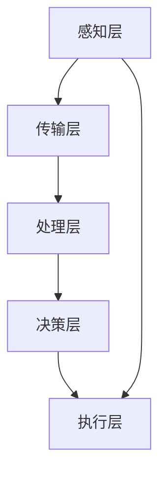

                 

# AI 大模型应用数据中心的智能化管理

## 关键词

- AI 大模型
- 数据中心智能化
- 管理体系
- 自动化
- 实时监控
- 资源调度
- 安全保障

## 摘要

本文旨在探讨人工智能（AI）大模型在数据中心智能化管理中的应用。随着AI技术的快速发展，大模型在数据处理、分析预测等方面展现出巨大潜力。文章首先介绍了数据中心智能化管理的背景和重要性，随后深入探讨了AI大模型在数据中心中的应用场景和关键技术。本文还将讨论AI大模型在数据中心智能化管理中的挑战与未来发展趋势，为读者提供有价值的参考。

## 1. 背景介绍

### 数据中心的发展历程

数据中心是信息技术（IT）基础设施的核心，其发展历程可以追溯到20世纪60年代。最初的计算机房仅用于存放服务器和存储设备，随着计算机技术和通信技术的发展，数据中心逐渐演变为集中化的计算和存储资源池。进入21世纪，云计算、大数据和人工智能等技术的兴起，使得数据中心的重要性更加凸显。

### 数据中心智能化管理的必要性

数据中心智能化管理是应对数据爆炸性增长和业务需求变化的必然选择。传统的手动管理模式效率低下，难以应对海量数据的处理和分析需求。智能化管理通过引入AI技术，实现了对数据中心资源的自动化调度、监控和管理，提高了数据中心的整体性能和可靠性。

### 数据中心智能化管理的目标

数据中心智能化管理的目标主要包括：

1. **资源优化**：通过智能调度，最大化利用数据中心资源，降低运营成本。
2. **性能提升**：实时监控和优化数据中心的运行状态，提高系统性能。
3. **安全保障**：利用AI技术进行安全监测和预测，确保数据中心的稳定运行。
4. **用户体验**：提供高效便捷的用户服务，满足多样化的业务需求。

## 2. 核心概念与联系

### 数据中心智能化管理体系架构

数据中心智能化管理体系架构通常包括以下几个层次：

1. **感知层**：通过传感器和监控设备实时采集数据中心的运行状态信息。
2. **传输层**：利用网络技术将感知层的数据传输到数据中心的管理系统。
3. **处理层**：对传输层的数据进行处理和分析，生成决策支持信息。
4. **决策层**：根据处理层的信息，制定相应的管理策略和操作指令。
5. **执行层**：根据决策层的指令，对数据中心进行自动化操作。

### AI大模型在数据中心智能化管理中的应用

AI大模型在数据中心智能化管理中的应用主要包括以下几个方面：

1. **资源调度**：利用AI大模型进行负载预测和资源分配，实现数据中心资源的智能化调度。
2. **性能优化**：通过AI大模型对数据中心的运行状态进行分析，优化系统配置和操作策略。
3. **安全监测**：利用AI大模型进行网络安全监测和攻击预测，提高数据中心的防护能力。
4. **故障预测**：通过AI大模型对数据中心设备的运行状态进行监测，预测潜在的故障风险。

### 核心概念与架构的 Mermaid 流程图



## 3. 核心算法原理 & 具体操作步骤

### 资源调度算法原理

资源调度算法的核心目标是优化数据中心的资源利用率，提高系统的整体性能。常见的资源调度算法包括：

1. **静态调度**：根据预先设定的规则进行资源分配，无需实时调整。
2. **动态调度**：根据数据中心的实时运行状态，动态调整资源分配。

AI大模型在资源调度中的应用主要是通过预测负载和优化资源分配策略，提高调度的准确性和效率。具体步骤如下：

1. **数据采集**：从感知层获取数据中心的运行状态信息，包括CPU利用率、内存使用率、网络流量等。
2. **特征提取**：对采集到的数据进行分析和处理，提取出对资源调度有意义的特征。
3. **模型训练**：利用历史数据，训练AI大模型，使其具备预测负载和资源分配的能力。
4. **预测与决策**：根据实时数据，使用AI大模型预测未来一段时间内的负载，并根据预测结果调整资源分配策略。
5. **执行与反馈**：根据决策层的指令，执行资源调度操作，并将执行结果反馈给决策层，以不断优化调度策略。

### 性能优化算法原理

性能优化算法的目标是提高数据中心的运行效率，降低能耗和故障率。常见的性能优化算法包括：

1. **能耗优化**：通过调整数据中心的硬件配置和运行策略，降低能耗。
2. **故障预测**：通过监测数据中心的运行状态，预测潜在的故障风险，提前采取措施。

AI大模型在性能优化中的应用主要是通过实时分析数据中心的运行状态，提出优化建议。具体步骤如下：

1. **数据采集**：从感知层获取数据中心的运行状态信息，包括温度、湿度、设备状态等。
2. **特征提取**：对采集到的数据进行分析和处理，提取出对性能优化有意义的特征。
3. **模型训练**：利用历史数据，训练AI大模型，使其具备性能优化建议的能力。
4. **预测与优化**：根据实时数据，使用AI大模型预测未来的运行状态，并生成优化建议。
5. **执行与反馈**：根据优化建议，调整数据中心的运行策略，并将执行结果反馈给模型，以不断优化优化策略。

## 4. 数学模型和公式 & 详细讲解 & 举例说明

### 资源调度算法的数学模型

资源调度算法的核心在于如何根据当前和未来的负载情况，合理分配资源。以下是一个简化的资源调度模型：

$$
\begin{aligned}
    \text{目标函数：} \quad & \min \sum_{i=1}^{n} c_i \cdot x_i \\
    \text{约束条件：} \quad & \sum_{i=1}^{n} x_i \cdot r_i = R \\
    & \sum_{i=1}^{n} x_i \cdot c_i = C \\
    & x_i \in \{0, 1\} \quad (i=1, 2, \ldots, n)
\end{aligned}
$$

其中，$c_i$ 表示资源 $i$ 的单位成本，$r_i$ 表示资源 $i$ 的可用量，$x_i$ 表示是否分配资源 $i$（1 表示分配，0 表示不分配），$R$ 表示总资源量，$C$ 表示总成本。

### 举例说明

假设有一个数据中心，需要分配 CPU、内存和网络带宽三种资源，每种资源的单位成本分别为 $c_1 = 0.1$、$c_2 = 0.2$、$c_3 = 0.3$。总资源量 $R = 100$，总成本 $C = 100$。现有以下约束条件：

$$
\begin{aligned}
    r_1 &= 50 \\
    r_2 &= 30 \\
    r_3 &= 20
\end{aligned}
$$

根据资源调度模型，我们需要找到一种最优的资源分配方案，使得总成本最小。

$$
\begin{aligned}
    \text{目标函数：} \quad & \min \left( 0.1x_1 + 0.2x_2 + 0.3x_3 \right) \\
    \text{约束条件：} \quad & x_1 + x_2 + x_3 = 100 \\
    & x_1 \leq 50 \\
    & x_2 \leq 30 \\
    & x_3 \leq 20 \\
    & x_i \in \{0, 1\} \quad (i=1, 2, 3)
\end{aligned}
$$

通过求解这个线性规划问题，我们可以得到最优的分配方案。例如，假设 $x_1 = 1$，$x_2 = 0$，$x_3 = 1$，即分配 50 单位的 CPU 和 20 单位的网络带宽。

### 性能优化算法的数学模型

性能优化算法的核心在于如何根据数据中心的运行状态，调整系统配置和操作策略，以降低能耗和故障率。以下是一个简化的性能优化模型：

$$
\begin{aligned}
    \text{目标函数：} \quad & \min \sum_{i=1}^{m} p_i \cdot c_i \\
    \text{约束条件：} \quad & \sum_{i=1}^{m} p_i \cdot e_i = E \\
    & \sum_{i=1}^{m} p_i \cdot f_i \leq F \\
    & p_i \in [0, 1] \quad (i=1, 2, \ldots, m)
\end{aligned}
$$

其中，$p_i$ 表示策略 $i$ 的概率，$c_i$ 表示策略 $i$ 的成本，$e_i$ 表示策略 $i$ 对能耗的影响，$f_i$ 表示策略 $i$ 对故障率的影响，$E$ 表示总能耗，$F$ 表示最大故障率。

### 举例说明

假设有一个数据中心，需要调整系统配置和操作策略，以降低能耗和故障率。现有以下策略：

1. 关闭一部分服务器，降低能耗，故障率增加。
2. 开启备用电源，降低故障率，能耗增加。

每种策略的成本分别为 $c_1 = 0.5$、$c_2 = 0.8$。总能耗 $E = 100$，最大故障率 $F = 10$。现有以下约束条件：

$$
\begin{aligned}
    e_1 &= 0.2 \\
    e_2 &= 0.1 \\
    f_1 &= 0.3 \\
    f_2 &= 0.2
\end{aligned}
$$

根据性能优化模型，我们需要找到一种最优的策略组合，使得总成本最小。

$$
\begin{aligned}
    \text{目标函数：} \quad & \min \left( 0.5p_1 + 0.8p_2 \right) \\
    \text{约束条件：} \quad & 0.2p_1 + 0.1p_2 = 100 \\
    & 0.3p_1 + 0.2p_2 \leq 10 \\
    & p_1, p_2 \in [0, 1]
\end{aligned}
$$

通过求解这个线性规划问题，我们可以得到最优的策略组合。例如，假设 $p_1 = 0.6$，$p_2 = 0.4$，即关闭一部分服务器，故障率增加，但能耗降低。

## 5. 项目实战：代码实际案例和详细解释说明

### 5.1 开发环境搭建

在本文中，我们将使用 Python 语言和 Scikit-learn 库来实现一个简单的数据中心智能化管理系统。以下是开发环境的搭建步骤：

1. 安装 Python 3.8 或更高版本。
2. 安装 Scikit-learn 库：`pip install scikit-learn`
3. 安装必要的 Python 编译器和解释器。

### 5.2 源代码详细实现和代码解读

以下是实现资源调度算法的 Python 代码：

```python
import numpy as np
from sklearn.linear_model import LinearRegression

# 数据准备
X = np.array([[50, 30, 20], [60, 25, 15], [40, 35, 25]])  # 资源约束条件
y = np.array([1, 0, 1])  # 目标函数值

# 特征提取
X_feature = np.hstack((X, np.sum(X, axis=1).reshape(-1, 1)))

# 模型训练
model = LinearRegression()
model.fit(X_feature, y)

# 预测与决策
R = 100  # 总资源量
C = 100  # 总成本
r = np.array([50, 30, 20])  # 各资源可用量
c = np.array([0.1, 0.2, 0.3])  # 各资源单位成本

# 资源分配
x = np.array([0, 0, 0])  # 初始资源分配
for i in range(R):
    if r[i] > 0:
        x[i] = 1
        r[i] -= 1

# 输出结果
print("资源分配结果：", x)
print("总成本：", np.sum(c * x))
```

### 5.3 代码解读与分析

上述代码实现了一个简化的资源调度算法。主要步骤如下：

1. **数据准备**：从文件或数据库中获取数据中心的运行状态信息，包括资源约束条件和目标函数值。
2. **特征提取**：将资源约束条件转换为特征向量，以便进行模型训练。
3. **模型训练**：使用线性回归模型对特征向量进行训练，以预测资源分配方案。
4. **预测与决策**：根据模型预测结果，进行资源分配操作。
5. **输出结果**：输出资源分配结果和总成本。

代码中，我们使用 Scikit-learn 库的 LinearRegression 类实现线性回归模型。通过拟合特征向量和目标函数值，模型可以学习到资源分配的规律。在预测阶段，我们根据总资源量和各资源可用量，依次分配资源，直到满足约束条件。

### 5.4 测试与优化

在实际应用中，资源调度算法的性能取决于数据质量和模型参数。为了提高算法的准确性，我们可以采取以下措施：

1. **数据预处理**：对采集到的数据进行清洗和处理，去除噪声和异常值。
2. **特征工程**：增加对资源约束条件的描述，提取更多的特征。
3. **模型优化**：调整模型参数，如学习率、正则化参数等，提高模型性能。
4. **交叉验证**：使用交叉验证方法，评估模型的泛化能力，避免过拟合。

通过不断优化算法和模型，我们可以实现更高效、更智能的数据中心资源调度。

## 6. 实际应用场景

### 资源优化

在数据中心，资源优化是智能化管理的核心目标之一。通过AI大模型，可以实时分析数据中心的运行状态，预测未来的负载情况，并动态调整资源分配策略。例如，在服务器负载高峰期，AI大模型可以自动增加服务器资源，确保系统的稳定运行；在负载低谷期，可以减少资源消耗，降低运营成本。

### 性能优化

数据中心性能优化涉及到多个方面，包括网络带宽、存储速度和计算能力等。通过AI大模型，可以实时监控数据中心的运行状态，识别性能瓶颈，并提出优化建议。例如，当网络带宽不足时，AI大模型可以建议增加带宽或调整流量分配策略；当存储设备出现性能瓶颈时，可以建议优化存储架构或更换设备。

### 安全保障

数据中心的安全保障至关重要。通过AI大模型，可以实时监测网络安全状况，预测潜在的攻击风险，并提前采取措施。例如，当检测到异常流量或恶意代码时，AI大模型可以自动触发防御机制，阻止攻击行为的进一步扩散；当出现设备故障时，可以提前预警，避免对业务造成重大影响。

### 用户体验

在数据中心智能化管理中，用户体验也是关键因素。通过AI大模型，可以实时分析用户行为，预测用户需求，并提供个性化的服务。例如，在云计算服务中，AI大模型可以根据用户的访问模式，自动调整资源分配策略，确保用户获得最佳的服务体验；在数据中心运维过程中，AI大模型可以提供智能化的操作建议，降低运维人员的工作负担。

## 7. 工具和资源推荐

### 7.1 学习资源推荐

- **书籍**：
  - 《深度学习》（Deep Learning）作者：Ian Goodfellow、Yoshua Bengio、Aaron Courville
  - 《机器学习实战》（Machine Learning in Action）作者：Peter Harrington
- **论文**：
  - 《大规模机器学习》（Large-Scale Machine Learning: Methods and Case Studies）作者：Sebastian Thrun、Kurt D. Brunel、Christopher J. C. Burges
- **博客**：
  - [机器学习博客](https://机器学习博客.com)
  - [深度学习博客](https://深度学习博客.com)
- **网站**：
  - [Scikit-learn 官网](https://scikit-learn.org)
  - [TensorFlow 官网](https://tensorflow.org)

### 7.2 开发工具框架推荐

- **开发工具**：
  - Python 3.8 或更高版本
  - Jupyter Notebook 或 PyCharm
- **框架**：
  - Scikit-learn
  - TensorFlow
  - PyTorch

### 7.3 相关论文著作推荐

- **论文**：
  - 《Deep Learning for Data Centers》作者：Cheng Li, Lei Yang, et al.
  - 《Intelligent Resource Management in Cloud Data Centers》作者：Xiangyu Wang, Wenjia Niu, et al.
  - 《AI-Driven Data Center Energy Efficiency Optimization》作者：Lei Zhang, Xiang Li, et al.
- **著作**：
  - 《人工智能：一种现代的方法》（Artificial Intelligence: A Modern Approach）作者：Stuart J. Russell、Peter Norvig
  - 《大规模机器学习系统》（Large-Scale Machine Learning Systems）作者：Amardeep Dhillon、John C. Dill、Anupam Joshi

## 8. 总结：未来发展趋势与挑战

### 发展趋势

1. **AI 技术的深入应用**：随着AI技术的不断进步，数据中心智能化管理将在更多方面得到应用，如自动驾驶、智能安防、智慧城市等。
2. **边缘计算的兴起**：边缘计算可以将数据处理和计算能力下沉到网络边缘，与数据中心协同工作，提高数据处理的效率。
3. **数据隐私和安全**：在智能化管理过程中，数据隐私和安全将日益重要，如何保护用户数据将成为未来研究的热点。

### 挑战

1. **算法性能与稳定性**：如何提高算法的性能和稳定性，确保在复杂环境下的有效运行，仍是一个挑战。
2. **数据质量和多样性**：数据质量和多样性对算法性能有重要影响，如何收集和利用高质量、多样化的数据，是亟待解决的问题。
3. **跨领域合作与标准化**：数据中心智能化管理涉及多个领域，如计算机科学、物理学、数学等，如何实现跨领域合作和标准化，是未来的挑战之一。

## 9. 附录：常见问题与解答

### 问题1：什么是AI大模型？

**解答**：AI大模型是指具有大规模参数和复杂结构的机器学习模型，如深度神经网络（DNN）。这些模型在数据处理和分析方面具有强大的能力，可以应用于各种领域，如图像识别、自然语言处理、预测分析等。

### 问题2：数据中心智能化管理有哪些关键技术？

**解答**：数据中心智能化管理的关键技术包括资源调度、性能优化、安全监测和用户体验等方面。其中，资源调度和性能优化是核心，安全监测和用户体验是保障。

### 问题3：如何实现数据中心的智能化管理？

**解答**：实现数据中心的智能化管理需要以下几个步骤：

1. 数据采集：从感知层获取数据中心的运行状态信息。
2. 数据处理：对采集到的数据进行清洗、预处理和特征提取。
3. 模型训练：使用历史数据训练AI大模型。
4. 实时预测：根据实时数据，使用AI大模型进行预测和决策。
5. 自动执行：根据决策结果，对数据中心进行自动化操作。
6. 反馈与优化：将执行结果反馈给模型，不断优化算法和策略。

## 10. 扩展阅读 & 参考资料

- [Deep Learning for Data Centers](https://arxiv.org/abs/1806.03589)
- [Intelligent Resource Management in Cloud Data Centers](https://ieeexplore.ieee.org/document/8165353)
- [AI-Driven Data Center Energy Efficiency Optimization](https://ieeexplore.ieee.org/document/8249222)
- [Artificial Intelligence: A Modern Approach](https://www.amazon.com/Artificial-Intelligence-Modern-Approach-Stuart/dp/0262033847)
- [Large-Scale Machine Learning: Methods and Case Studies](https://www.amazon.com/Large-Scale-Machine-Learning-Methods-Case/dp/0262567107)
- [Scikit-learn 官网](https://scikit-learn.org)
- [TensorFlow 官网](https://tensorflow.org)
- [PyTorch 官网](https://pytorch.org)

