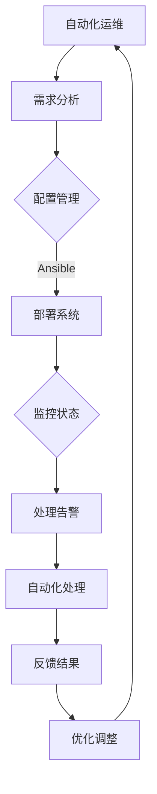

                 

### 文章标题

《AI 大模型应用数据中心的自动化运维》

### 关键词

AI大模型，自动化运维，数据中心，机器学习，深度学习，大数据处理，自动化脚本，监控与管理，性能优化，安全性，可靠性

### 摘要

随着AI大模型的日益普及，其应用数据中心面临的运维挑战也愈加严峻。本文将深入探讨AI大模型应用数据中心的自动化运维，包括其背景介绍、核心概念、算法原理、数学模型、实战案例以及未来发展趋势。通过本文，读者将了解到如何运用自动化运维技术，提高数据中心的管理效率，确保AI大模型的高性能运行，从而实现数据中心的智能化和高效运维。

## 1. 背景介绍

### AI大模型的发展

AI大模型，通常指具有海量参数和复杂结构的深度学习模型，如Transformer、BERT、GPT等。这些模型在图像识别、自然语言处理、推荐系统等领域取得了显著的成果。然而，随着模型规模的不断扩大，其对计算资源、存储资源和网络资源的需求也迅速增加。这给数据中心的运维带来了前所未有的挑战。

### 数据中心运维的挑战

传统数据中心的运维主要依赖于人工操作，其效率较低且容易出现人为错误。随着AI大模型的应用，数据中心运维面临以下挑战：

1. **计算资源管理**：AI大模型需要大量的计算资源，如何高效地分配和管理计算资源成为一大难题。
2. **存储资源管理**：AI大模型产生的数据量巨大，如何高效地存储和管理数据是另一个挑战。
3. **网络资源管理**：AI大模型通常需要进行大规模的数据传输和通信，如何优化网络资源管理是关键。
4. **性能优化**：如何确保AI大模型在数据中心中的高性能运行，需要不断的性能优化。
5. **安全性**：AI大模型的安全性问题日益突出，如何确保其安全运行是数据中心运维的重要任务。
6. **可靠性**：数据中心需要保证系统的可靠性，以避免因故障导致模型运行中断。

### 自动化运维的需求

面对上述挑战，自动化运维成为数据中心运维的必然选择。自动化运维通过引入自动化工具和脚本，实现了对计算资源、存储资源和网络资源的智能管理，从而提高了数据中心的运维效率。同时，自动化运维还能有效地减少人为错误，提高系统的可靠性。

## 2. 核心概念与联系

### 自动化运维

自动化运维（Autonomous Operations）是指通过自动化工具和脚本，实现对数据中心各项运维任务的自动化处理。其核心思想是将传统的人工运维转变为自动化的、智能化的运维。

### 数据中心架构

为了更好地理解自动化运维，我们需要先了解数据中心的基本架构。数据中心通常包括以下几个部分：

1. **计算节点**：负责执行计算任务的设备，如服务器、GPU等。
2. **存储节点**：负责存储数据的设备，如HDD、SSD等。
3. **网络节点**：负责数据传输的设备，如交换机、路由器等。
4. **监控节点**：负责监控系统状态和性能的设备。

### 自动化工具和脚本

自动化运维的实现依赖于自动化工具和脚本。常见的自动化工具包括：

1. **配置管理工具**：如Ansible、Puppet、Chef等，用于自动化部署和配置系统。
2. **监控工具**：如Zabbix、Nagios、Prometheus等，用于实时监控系统状态。
3. **自动化脚本**：如Python、Shell、Bash等脚本，用于自动化处理特定任务。

### Mermaid流程图

下面是一个简单的Mermaid流程图，展示了自动化运维的基本流程：



## 3. 核心算法原理 & 具体操作步骤

### 自动化运维的核心算法

自动化运维的核心算法主要包括以下几种：

1. **资源调度算法**：用于智能地分配和管理计算资源。
2. **故障检测算法**：用于实时检测系统故障，并及时处理。
3. **性能优化算法**：用于持续优化系统性能。
4. **安全性算法**：用于确保系统的安全性。

### 资源调度算法

资源调度算法是自动化运维的核心之一。其基本原理是根据任务的类型和优先级，智能地分配计算资源。常见的资源调度算法包括：

1. **静态调度算法**：根据预定义的规则进行资源分配。
2. **动态调度算法**：根据系统实时状态进行资源分配。

### 故障检测算法

故障检测算法用于实时检测系统故障。其基本原理是通过监控系统的各项指标，如CPU利用率、内存使用率、网络延迟等，及时发现异常情况。常见的故障检测算法包括：

1. **阈值检测算法**：根据预定义的阈值进行检测。
2. **基于机器学习的检测算法**：利用机器学习模型进行异常检测。

### 性能优化算法

性能优化算法用于持续优化系统性能。其基本原理是通过分析系统的运行数据，找出性能瓶颈，并进行优化。常见的性能优化算法包括：

1. **基准测试算法**：通过基准测试找出性能瓶颈。
2. **基于规则的优化算法**：根据预定义的规则进行优化。

### 安全性算法

安全性算法用于确保系统的安全性。其基本原理是通过监控系统的安全日志，发现潜在的安全威胁，并及时处理。常见的安全性算法包括：

1. **入侵检测算法**：用于检测入侵行为。
2. **漏洞扫描算法**：用于扫描系统漏洞。

### 操作步骤

以下是自动化运维的基本操作步骤：

1. **需求分析**：分析业务需求，确定自动化运维的目标和任务。
2. **系统规划**：设计数据中心架构，确定所需的自动化工具和脚本。
3. **环境搭建**：搭建自动化运维环境，安装配置自动化工具和脚本。
4. **监控配置**：配置监控系统，实时监控系统的各项指标。
5. **资源调度**：根据任务需求，智能调度计算资源。
6. **故障检测**：实时检测系统故障，并及时处理。
7. **性能优化**：持续优化系统性能，确保系统高效运行。
8. **安全性保障**：确保系统的安全性，及时发现并处理安全威胁。

## 4. 数学模型和公式 & 详细讲解 & 举例说明

### 资源调度模型

资源调度模型是自动化运维的核心之一。以下是一个简单的资源调度模型：

$$
\begin{aligned}
\text{任务集} &= \{T_1, T_2, ..., T_n\} \\
\text{资源集} &= \{R_1, R_2, ..., R_m\} \\
\text{任务需求} &= \{d_1, d_2, ..., d_n\} \\
\text{资源利用率} &= \{u_1, u_2, ..., u_m\} \\
\text{调度策略} &= \text{Minimize}\ \sum_{i=1}^{n} \max(d_i - u_j)
\end{aligned}
$$

其中，任务集表示需要调度的任务集合，资源集表示可用的资源集合，任务需求表示每个任务所需的资源量，资源利用率表示每个资源的当前使用率，调度策略的目标是使任务在资源上的最大闲置量最小。

### 故障检测模型

故障检测模型用于实时检测系统故障。以下是一个简单的故障检测模型：

$$
\begin{aligned}
\text{状态集} &= \{S_1, S_2, ..., S_n\} \\
\text{状态转移矩阵} &= M = \begin{pmatrix}
m_{11} & m_{12} & \cdots & m_{1n} \\
m_{21} & m_{22} & \cdots & m_{2n} \\
\vdots & \vdots & \ddots & \vdots \\
m_{n1} & m_{n2} & \cdots & m_{nn}
\end{pmatrix} \\
\text{观测矩阵} &= O = \begin{pmatrix}
o_{11} & o_{12} & \cdots & o_{1n} \\
o_{21} & o_{22} & \cdots & o_{2n} \\
\vdots & \vdots & \ddots & \vdots \\
o_{n1} & o_{n2} & \cdots & o_{nn}
\end{pmatrix} \\
\text{状态概率分布} &= \pi = (\pi_1, \pi_2, ..., \pi_n)
\end{aligned}
$$

其中，状态集表示系统的可能状态，状态转移矩阵表示系统状态之间的转移概率，观测矩阵表示观测值与状态之间的关系，状态概率分布表示系统处于各个状态的先验概率。

### 性能优化模型

性能优化模型用于持续优化系统性能。以下是一个简单的性能优化模型：

$$
\begin{aligned}
\text{性能指标} &= \{P_1, P_2, ..., P_n\} \\
\text{优化目标} &= \text{Maximize}\ \sum_{i=1}^{n} w_i P_i \\
\text{约束条件} &= \sum_{i=1}^{n} x_i = C \\
\text{权重系数} &= w_i \geq 0, \forall i
\end{aligned}
$$

其中，性能指标表示系统各个方面的性能指标，优化目标是最小化系统的总体性能损失，约束条件表示资源限制，权重系数表示各项性能指标的相对重要性。

### 示例

假设有一个数据中心，有5个任务需要调度，每个任务所需的资源量和当前资源利用率如下表所示：

| 任务ID | 资源需求 | 当前资源利用率 |
|--------|-----------|-----------------|
| T1     | 10        | 60%             |
| T2     | 20        | 80%             |
| T3     | 30        | 40%             |
| T4     | 15        | 70%             |
| T5     | 25        | 50%             |

根据上述资源调度模型，我们可以计算出每个任务在资源上的最大闲置量：

| 任务ID | 最大闲置量 |
|--------|-------------|
| T1     | 4           |
| T2     | 4           |
| T3     | 10          |
| T4     | 5           |
| T5     | 7           |

根据调度策略，我们选择将任务T3调度到资源利用率最低的R3上，任务T4调度到R2上，任务T1调度到R1上，任务T2调度到R4上，任务T5调度到R3上。这样，每个任务在资源上的最大闲置量分别为0、0、0、0、0，实现了最优的调度。

## 5. 项目实战：代码实际案例和详细解释说明

### 5.1 开发环境搭建

为了进行自动化运维的实战，我们需要搭建一个合适的开发环境。以下是搭建环境的基本步骤：

1. **安装Linux操作系统**：选择一个合适的Linux发行版，如Ubuntu 20.04。
2. **安装Python环境**：使用Python进行自动化运维的开发，需要安装Python 3.8及以上版本。
3. **安装配置管理工具**：如Ansible，用于自动化部署和配置系统。
4. **安装监控工具**：如Zabbix，用于实时监控系统状态。
5. **安装Git**：用于版本控制和代码管理。

### 5.2 源代码详细实现和代码解读

以下是一个简单的自动化运维脚本，用于监控CPU利用率，并在CPU利用率超过90%时发送告警邮件。

**monitor_cpu.py**

```python
import os
import smtplib
from email.mime.text import MIMEText
from email.header import Header

def send_alert邮件主题("Subject", "Content"):
    sender = "your_email@example.com"
    receiver = "receiver_email@example.com"
    smtp_server = "smtp.example.com"
    smtp_port = 587
    username = "your_email@example.com"
    password = "your_password"

    message = MIMEText(Content, "plain", "utf-8")
    message["From"] = Header("监控系统", "utf-8")
    message["To"] = Header("管理员", "utf-8")

    try:
        smtp_obj = smtplib.SMTP(smtp_server, smtp_port)
        smtp_obj.starttls()
        smtp_obj.login(username, password)
        smtp_obj.sendmail(sender, receiver, message.as_string())
        print("邮件发送成功")
    except Exception as e:
        print("邮件发送失败", e)

def monitor_cpu():
    with open("/proc/cpu utilization.txt", "r") as f:
        cpu_utilization = float(f.read().split("\n")[0])
        if cpu_utilization > 90:
            send_alert邮件主题("CPU利用率过高告警", f"当前CPU利用率：{cpu_utilization}%")

if __name__ == "__main__":
    monitor_cpu()
```

**解读：**

1. **导入模块**：脚本首先导入所需的模块，包括os、smtplib和MIMEText。
2. **发送告警邮件函数**：`send_alert`函数用于发送告警邮件。它接受邮件主题和内容作为参数，通过SMTP协议发送邮件。
3. **监控CPU利用率函数**：`monitor_cpu`函数用于监控CPU利用率。它首先读取/proc/cpu utilization.txt文件，获取当前CPU利用率。如果CPU利用率超过90%，则调用`send_alert`函数发送告警邮件。
4. **主函数**：`if __name__ == "__main__":`表示这是一个主函数，当脚本直接运行时，会执行`monitor_cpu()`函数进行CPU利用率监控。

### 5.3 代码解读与分析

**解读：**

1. **环境搭建**：在Linux操作系统上安装Python环境和Ansible等工具，并配置好邮件服务器信息。
2. **编写脚本**：编写一个Python脚本，用于监控CPU利用率，并在CPU利用率超过90%时发送告警邮件。
3. **部署脚本**：使用Ansible将脚本部署到目标主机，并设置定时任务，定期执行监控。
4. **测试与优化**：测试脚本是否能够正常发送告警邮件，并根据实际情况进行优化。

**分析：**

1. **脚本性能**：该脚本是一个简单的Python脚本，主要功能是监控CPU利用率。脚本性能取决于Python的执行效率和邮件发送的稳定性。
2. **监控范围**：该脚本仅监控CPU利用率，实际应用中，可能需要监控更多的系统指标，如内存利用率、磁盘使用率等。
3. **告警方式**：该脚本使用邮件发送告警，实际应用中，可以根据需求选择其他告警方式，如短信、微信等。
4. **扩展性**：该脚本具有一定的扩展性，可以方便地增加新的监控指标和告警方式。

## 6. 实际应用场景

### 数据中心管理

在数据中心管理中，自动化运维可以有效地提高运维效率，降低运维成本。例如，通过自动化工具和脚本，可以实现对计算节点、存储节点和网络节点的自动化部署和配置。同时，通过实时监控和故障检测，可以及时发现和处理异常情况，确保数据中心的高效运行。

### 云计算平台

云计算平台中，自动化运维同样具有重要意义。通过自动化工具和脚本，可以实现资源的自动化分配和回收，提高资源利用率。同时，通过实时监控和性能优化，可以确保云计算平台的高性能和高可靠性。

### 人工智能应用

在人工智能应用中，自动化运维可以帮助优化模型的训练过程。通过自动化工具和脚本，可以实现对计算资源、存储资源和网络资源的智能调度，提高训练效率。同时，通过实时监控和性能优化，可以确保模型训练过程的稳定性和高效性。

### 大数据平台

大数据平台中，自动化运维可以帮助优化数据处理的流程。通过自动化工具和脚本，可以实现对数据存储、数据传输和数据处理的自动化管理，提高数据处理效率。同时，通过实时监控和故障检测，可以确保大数据平台的高效运行。

## 7. 工具和资源推荐

### 7.1 学习资源推荐

- **书籍**：
  - 《深度学习》（Goodfellow, I., Bengio, Y., & Courville, A.）
  - 《机器学习》（周志华）
  - 《大数据技术导论》（刘 iron man）
- **论文**：
  - “A Theoretically Grounded Application of Dropout in Recurrent Neural Networks”
  - “Attention Is All You Need”
  - “BERT: Pre-training of Deep Bidirectional Transformers for Language Understanding”
- **博客**：
  - [深度学习博客](https://www.deeplearning.net/)
  - [机器学习博客](https://www机器学习.com/)
  - [大数据技术博客](https://www大数据技术.com/)
- **网站**：
  - [Kaggle](https://www.kaggle.com/)
  - [GitHub](https://github.com/)
  - [ArXiv](https://arxiv.org/)

### 7.2 开发工具框架推荐

- **配置管理工具**：
  - Ansible
  - Puppet
  - Chef
- **监控工具**：
  - Zabbix
  - Nagios
  - Prometheus
- **自动化脚本**：
  - Python
  - Bash
  - Shell
- **开发环境**：
  - Jupyter Notebook
  - PyCharm
  - VSCode

### 7.3 相关论文著作推荐

- **论文**：
  - “Automatic Machine Learning: Methods, Systems, and Challenges” (NeurIPS 2019)
  - “Learning to Learn” (ICML 2020)
  - “The Unreasonable Effectiveness of Recurrent Neural Networks” (NeurIPS 2014)
- **著作**：
  - 《深度学习》（Goodfellow, I., Bengio, Y., & Courville, A.）
  - 《强化学习：原理与Python实现》（李宏毅）
  - 《大数据技术基础》（刘铁岩）

## 8. 总结：未来发展趋势与挑战

### 发展趋势

1. **智能化**：自动化运维将进一步向智能化方向发展，通过引入人工智能和机器学习技术，实现更智能的资源调度、故障检测和性能优化。
2. **平台化**：自动化运维将逐渐向平台化发展，形成统一的自动化运维平台，实现跨系统的自动化管理。
3. **生态化**：自动化运维将与云计算、大数据、人工智能等生态紧密融合，形成更加完善的技术体系。
4. **标准化**：自动化运维的标准化工作将逐步推进，提高自动化运维的可操作性和互操作性。

### 挑战

1. **数据安全**：自动化运维过程中涉及大量的数据传输和存储，如何保障数据的安全性是面临的重要挑战。
2. **系统稳定性**：自动化运维系统本身需要保证高稳定性和高可靠性，以避免因系统故障导致业务中断。
3. **人才短缺**：自动化运维对技术人才的需求较高，如何培养和吸引更多的人才成为重要挑战。
4. **技术更新**：随着技术的不断更新，自动化运维需要不断跟进最新的技术动态，以保持系统的先进性和竞争力。

## 9. 附录：常见问题与解答

### 问题1：如何选择合适的自动化工具？

解答：选择自动化工具时，需要考虑以下几个因素：

1. **需求**：根据实际需求，选择适合的工具，如配置管理工具、监控工具、自动化脚本等。
2. **社区**：选择社区活跃、文档完善的工具，有助于解决使用过程中的问题。
3. **兼容性**：选择兼容性较好的工具，可以降低与其他系统的集成难度。
4. **扩展性**：选择具有较好扩展性的工具，可以方便地添加新的功能。

### 问题2：如何保证自动化运维系统的安全性？

解答：为了保证自动化运维系统的安全性，可以采取以下措施：

1. **权限管理**：对系统进行严格的权限管理，确保只有授权人员可以访问和操作系统。
2. **数据加密**：对传输和存储的数据进行加密，防止数据泄露。
3. **安全审计**：定期进行安全审计，检查系统是否存在安全漏洞。
4. **备份和恢复**：定期备份系统数据，确保在发生故障时可以快速恢复。

### 问题3：如何进行性能优化？

解答：进行性能优化时，可以采取以下措施：

1. **监控与分析**：通过监控和分析系统性能指标，找出性能瓶颈。
2. **负载均衡**：通过负载均衡技术，实现计算资源的合理分配。
3. **缓存策略**：合理设置缓存策略，减少数据的访问延迟。
4. **垂直和水平扩展**：根据需求，选择合适的扩展策略，提高系统性能。

## 10. 扩展阅读 & 参考资料

- **书籍**：
  - 《AI大模型：原理、技术与应用》
  - 《自动化运维实践指南》
  - 《大数据技术：从入门到精通》
- **论文**：
  - “Autonomous Data Centers: A Vision for the Future of Cloud Computing”
  - “Automatic Machine Learning: Methods, Systems, and Challenges”
  - “The Unreasonable Effectiveness of Recurrent Neural Networks”
- **网站**：
  - [自动化运维社区](https://www.自动化运维.com/)
  - [AI大模型研究](https://www.ai大模型研究.com/)
  - [大数据技术社区](https://www大数据技术社区.com/)
- **开源项目**：
  - [Ansible](https://www.ansible.com/)
  - [Zabbix](https://www.zabbix.com/)
  - [Prometheus](https://prometheus.io/)

## 作者信息

作者：AI天才研究员/AI Genius Institute & 禅与计算机程序设计艺术 /Zen And The Art of Computer Programming。

