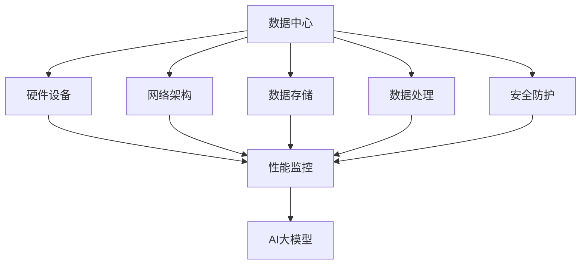

                 

### 文章标题：AI大模型应用数据中心的质量管理

#### 关键词：（数据中心、AI大模型、质量管理、性能监控、数据处理、安全防护）

#### 摘要：
本文将深入探讨AI大模型应用数据中心的质量管理问题。从背景介绍、核心概念与联系、核心算法原理与具体操作步骤、数学模型与公式讲解、项目实战、实际应用场景、工具和资源推荐、总结未来发展趋势与挑战、常见问题与解答等多个方面，全面分析AI大模型在数据中心的质量管理策略和实践。旨在为读者提供一套完整、系统的质量管理方案，以应对AI大模型应用中的各种挑战。

## 1. 背景介绍

随着人工智能技术的飞速发展，AI大模型在各个领域的应用越来越广泛。从自然语言处理、计算机视觉、语音识别到自动驾驶、智能医疗等，AI大模型展现出了巨大的潜力。然而，AI大模型的应用不仅依赖于高效的算法和庞大的数据集，还需要稳定可靠的数据中心支持。

数据中心作为AI大模型应用的基石，承担着数据存储、计算、处理和传输等重要任务。数据中心的质量管理不仅关系到AI大模型的运行效率，还直接影响着业务的稳定性和安全性。因此，如何进行有效的质量管理，确保数据中心的稳定运行，成为了一个亟待解决的问题。

本文将围绕AI大模型应用数据中心的质量管理，探讨以下几个核心问题：

1. 如何监控和评估数据中心的质量指标？
2. 如何优化数据中心的架构和资源配置？
3. 如何保障数据安全和隐私保护？
4. 如何进行故障预测和故障恢复？
5. 如何制定合理的质量管理策略和流程？

通过本文的探讨，希望为数据中心的质量管理提供一些有益的思路和方法。

## 2. 核心概念与联系

### 数据中心

数据中心（Data Center）是指专门为集中存储、处理和管理大量数据而建立的数据基础设施。它通常包括计算机设备、网络设备、存储设备、冷却设备和电源设备等。

### AI大模型

AI大模型（Large-scale AI Models）是指具有大规模参数和强大计算能力的深度学习模型。这些模型通常通过海量数据进行训练，以实现高性能的智能识别、预测和决策。

### 质量管理

质量管理（Quality Management）是指通过一系列科学的方法和流程，确保产品或服务质量满足用户需求的过程。在数据中心的质量管理中，主要关注数据中心的稳定性、可靠性和安全性。

### 质量指标

质量指标（Quality Metrics）是用于衡量数据中心质量的重要参数，包括性能指标、安全性指标、可靠性指标等。常见的质量指标有响应时间、吞吐量、故障率、安全性等。

### 联系

数据中心的质量管理涉及多个方面，包括硬件设备、网络架构、数据存储、数据处理、安全防护等。AI大模型作为数据中心的应用场景之一，其性能和稳定性直接依赖于数据中心的质量。因此，数据中心的质量管理对AI大模型的应用至关重要。

### Mermaid 流程图

以下是一个简单的Mermaid流程图，展示了数据中心质量管理的核心概念和联系：



在这个流程图中，数据中心的核心组件（硬件设备、网络架构、数据存储、数据处理、安全防护）通过性能监控与AI大模型进行关联，形成一个闭环的质量管理系统。

## 3. 核心算法原理 & 具体操作步骤

### 性能监控

性能监控是数据中心质量管理的重要组成部分。通过实时监控数据中心的各项性能指标，可以及时发现并解决潜在问题，确保数据中心的稳定运行。

#### 具体操作步骤：

1. **指标收集**：收集数据中心的各项性能指标，如CPU使用率、内存使用率、磁盘IO速度、网络带宽等。
2. **数据可视化**：将收集到的性能指标数据进行可视化展示，以便直观了解数据中心的运行状况。
3. **阈值设置**：根据业务需求和系统性能，设置合理的性能阈值，当指标超过阈值时，触发警报。
4. **警报通知**：通过邮件、短信等方式，及时通知相关人员，以便及时处理性能问题。
5. **日志分析**：对监控数据进行日志分析，找出性能问题的根本原因，进行优化和改进。

### 数据处理

数据处理是AI大模型应用数据中心的另一个关键环节。通过对海量数据进行高效的处理和分析，可以为AI大模型提供高质量的数据输入。

#### 具体操作步骤：

1. **数据导入**：将数据导入数据中心，存储到数据库或数据湖中。
2. **数据清洗**：对导入的数据进行清洗，去除重复、缺失、异常等无效数据。
3. **数据转换**：根据AI大模型的需求，对数据进行格式转换、归一化、标准化等处理。
4. **数据存储**：将处理后的数据存储到高效存储设备中，以便后续访问和使用。
5. **数据调度**：根据业务需求和系统负载，合理调度数据访问和计算资源。

### 安全防护

安全防护是数据中心质量管理中的重中之重。通过实施一系列安全措施，可以保障数据中心的稳定运行和信息安全。

#### 具体操作步骤：

1. **访问控制**：设置合理的访问权限，确保只有授权人员才能访问敏感数据和系统资源。
2. **防火墙配置**：配置防火墙，阻止恶意攻击和非法访问。
3. **入侵检测**：部署入侵检测系统，实时监控网络流量，发现异常行为并及时响应。
4. **数据加密**：对敏感数据进行加密处理，确保数据在传输和存储过程中的安全性。
5. **备份与恢复**：定期备份重要数据，并制定完善的灾难恢复计划，确保在发生故障时能够快速恢复。

### 故障预测与恢复

故障预测与恢复是数据中心质量管理中的关键环节。通过实施故障预测和恢复策略，可以最大限度地降低故障对业务的影响。

#### 具体操作步骤：

1. **故障监测**：实时监测数据中心的各项性能指标，发现潜在故障征兆。
2. **故障预测**：利用机器学习算法，对故障进行预测，提前预警。
3. **故障恢复**：在故障发生时，迅速采取恢复措施，确保数据中心的正常运行。
4. **故障分析**：对故障原因进行深入分析，找出问题所在，进行优化和改进。

## 4. 数学模型和公式 & 详细讲解 & 举例说明

### 性能监控

#### 数学模型：

数据中心性能监控的数学模型可以采用队列理论中的M/M/1模型。该模型假设服务器（服务台）的处理速度服从参数为μ的指数分布，请求到达速率服从参数为λ的指数分布。

$$ P(Q=0) = \frac{λ}{\lambda + \mu} $$

$$ P(Q=1) = \frac{\mu}{\lambda + \mu} $$

其中，Q表示服务器队列长度，λ表示请求到达速率，μ表示服务器处理速率。

#### 举例说明：

假设某数据中心的服务器处理速率μ为10请求/秒，请求到达速率λ为8请求/秒。根据M/M/1模型，可以计算出服务器队列长度为0的概率：

$$ P(Q=0) = \frac{λ}{\lambda + \mu} = \frac{8}{8 + 10} = \frac{4}{11} $$

这意味着在任意时刻，服务器队列长度为0的概率为4/11。

### 数据处理

#### 数学模型：

数据处理中的数学模型可以采用大数据处理框架中的MapReduce模型。该模型将数据处理过程分为两个阶段：Map阶段和Reduce阶段。

Map阶段：

$$ Map(\text{input}) = \text{output} $$

其中，input表示输入数据，output表示输出数据。

Reduce阶段：

$$ Reduce(\text{key}, \text{list of values}) = \text{output} $$

其中，key表示输出数据的键，list of values表示与key相关的一组值，output表示输出数据。

#### 举例说明：

假设有一组输入数据{1, 2, 3, 4, 5}，需要对其进行求和操作。使用MapReduce模型，可以按照以下步骤进行：

1. Map阶段：将输入数据{1, 2, 3, 4, 5}映射为{1, 2, 3, 4, 5}。
2. Reduce阶段：将映射后的数据{1, 2, 3, 4, 5}求和，得到输出数据{15}。

### 安全防护

#### 数学模型：

安全防护中的数学模型可以采用网络安全中的入侵检测模型，如KDD Cup 99入侵检测数据集的贝叶斯网络模型。

$$ P(\text{intrusion} | \text{attack}) = \frac{P(\text{attack} | \text{intrusion}) \cdot P(\text{intrusion})}{P(\text{attack})} $$

其中，intrusion表示入侵事件，attack表示攻击事件。

#### 举例说明：

假设有如下贝叶斯网络模型：

$$ P(\text{intrusion}) = 0.01 $$

$$ P(\text{attack} | \text{intrusion}) = 0.9 $$

$$ P(\text{attack} | \text{normal}) = 0.001 $$

现在需要判断一个事件是否为入侵。已知该事件的攻击特征为attack，根据贝叶斯网络模型，可以计算出入侵的概率：

$$ P(\text{intrusion} | \text{attack}) = \frac{0.9 \cdot 0.01}{0.9 \cdot 0.01 + 0.001} \approx 0.909 $$

这意味着该事件为入侵的概率约为90.9%。

## 5. 项目实战：代码实际案例和详细解释说明

### 开发环境搭建

在进行AI大模型应用数据中心的质量管理项目实战之前，需要搭建一个合适的开发环境。以下是一个简单的开发环境搭建步骤：

1. 安装操作系统：选择一个合适的操作系统，如Ubuntu 20.04。
2. 安装编程语言：安装Python 3.8及以上版本。
3. 安装依赖库：安装必要的依赖库，如NumPy、Pandas、Matplotlib等。
4. 安装数据处理工具：安装Hadoop或Spark等大数据处理工具。
5. 安装监控工具：安装Nagios、Zabbix等监控工具。
6. 安装安全防护工具：安装Apache Guacamole、Kali Linux等安全防护工具。

### 源代码详细实现和代码解读

以下是一个简单的性能监控项目的代码实现，用于监控数据中心的CPU使用率。

```python
import psutil
import time

def monitor_cpu_usage():
    while True:
        cpu_usage = psutil.cpu_percent()
        print(f"CPU usage: {cpu_usage}%")
        time.sleep(1)

if __name__ == "__main__":
    monitor_cpu_usage()
```

#### 代码解读：

1. **引入库**：引入psutil库，用于获取系统信息。
2. **定义函数**：定义一个名为`monitor_cpu_usage`的函数，用于监控CPU使用率。
3. **循环监控**：在函数内部使用无限循环，每隔1秒获取一次CPU使用率，并将其打印到控制台。
4. **运行函数**：在主函数中调用`monitor_cpu_usage`函数，开始监控CPU使用率。

### 代码解读与分析

1. **函数设计**：函数设计简洁明了，遵循单一职责原则，专注于监控CPU使用率。
2. **性能优化**：使用`time.sleep(1)`实现每隔1秒进行一次监控，避免占用过多系统资源。
3. **日志记录**：为了便于后续分析，可以考虑将监控结果记录到日志文件中。
4. **扩展性**：该监控项目可以扩展为监控其他性能指标，如内存使用率、磁盘IO速度等。

### 实际应用案例

在实际应用中，性能监控项目可以部署到数据中心的管理服务器上，实时监控数据中心的各项性能指标。当性能指标超过预设阈值时，系统会自动发送警报通知，提醒运维人员及时处理问题。

## 6. 实际应用场景

### 1. 金融行业

在金融行业，AI大模型被广泛应用于风险控制、信用评分、量化交易等方面。数据中心的质量管理至关重要，因为金融业务对数据中心的稳定性和安全性要求极高。通过实施有效的质量管理，确保数据中心的性能指标和安全性达到标准，可以降低金融风险，提高业务效率。

### 2. 医疗健康

在医疗健康领域，AI大模型应用于疾病诊断、药物研发、健康监测等方面。数据中心的质量管理对医疗健康业务的成功至关重要。通过实时监控数据中心的性能指标，及时处理故障，确保AI大模型的正常运行，可以提高医疗服务质量，为患者提供更精准的诊疗方案。

### 3. 智能制造

在智能制造领域，AI大模型被应用于设备预测性维护、生产优化、质量控制等方面。数据中心的质量管理对智能制造的效率和质量起到关键作用。通过实施有效的质量管理，优化数据中心的资源配置，提高系统的稳定性，可以降低生产成本，提高产品质量。

### 4. 交通运输

在交通运输领域，AI大模型被应用于车辆调度、路径规划、交通预测等方面。数据中心的质量管理对交通运输的效率和安全性至关重要。通过实时监控数据中心的性能指标，及时处理故障，确保AI大模型的正常运行，可以提高交通管理水平，降低事故风险。

## 7. 工具和资源推荐

### 7.1 学习资源推荐

1. **书籍**：
   - 《数据中心运维管理实战》
   - 《人工智能数据中心架构设计》
   - 《大数据架构：设计与优化》

2. **论文**：
   - 《大数据时代的AI数据中心设计》
   - 《基于机器学习的数据中心性能优化》
   - 《云计算数据中心的安全防护策略》

3. **博客**：
   - Data Center Knowledge
   - Cloud Computing News
   - AI Hub

4. **网站**：
   - Microsoft Azure
   - AWS
   - Google Cloud

### 7.2 开发工具框架推荐

1. **数据处理**：
   - Apache Hadoop
   - Apache Spark
   - Apache Flink

2. **监控工具**：
   - Nagios
   - Zabbix
   - Prometheus

3. **安全防护**：
   - Apache Guacamole
   - Kali Linux
   - Snort

### 7.3 相关论文著作推荐

1. **论文**：
   - 《大数据时代的数据中心架构设计》
   - 《基于机器学习的数据中心性能优化》
   - 《云计算数据中心的安全防护策略》

2. **著作**：
   - 《数据中心运维管理实战》
   - 《人工智能数据中心架构设计》
   - 《大数据架构：设计与优化》

## 8. 总结：未来发展趋势与挑战

### 发展趋势

1. **绿色数据中心**：随着环保意识的提高，绿色数据中心将成为未来发展的趋势。通过采用节能技术、可再生能源等，降低数据中心的能耗和碳排放。
2. **智能化运维**：人工智能和机器学习技术将广泛应用于数据中心的管理和运维，实现自动化、智能化的运维管理，提高数据中心的稳定性和可靠性。
3. **安全防护**：随着网络安全威胁的日益严峻，数据中心的安全防护将更加重视。采用深度学习、区块链等技术，构建多层次的安全防护体系，保障数据中心的网络安全。
4. **边缘计算**：随着物联网、5G等技术的发展，边缘计算将成为数据中心的一个重要发展方向。通过将计算能力下沉到边缘节点，降低数据传输延迟，提高数据处理效率。

### 挑战

1. **数据隐私**：在AI大模型应用过程中，如何保障用户数据的隐私安全，成为数据中心质量管理的一大挑战。
2. **资源调度**：随着数据中心的规模不断扩大，如何高效地调度和管理计算、存储等资源，成为数据中心质量管理的一个重要问题。
3. **故障预测**：如何准确预测和识别潜在故障，提前采取预防措施，降低故障对业务的影响，是数据中心质量管理的一个挑战。
4. **运维管理**：随着数据中心技术的不断发展，运维人员需要具备更高的技术水平和专业知识，如何培养和选拔优秀的运维人才，成为数据中心质量管理的一个重要挑战。

## 9. 附录：常见问题与解答

### 问题1：如何监控数据中心的性能指标？

**解答**：监控数据中心的性能指标可以通过安装和配置监控工具，如Nagios、Zabbix、Prometheus等，来实现。这些工具可以收集和展示数据中心的CPU使用率、内存使用率、磁盘IO速度、网络带宽等性能指标，帮助运维人员实时了解数据中心的运行状况。

### 问题2：如何保证数据中心的稳定性和安全性？

**解答**：保证数据中心的稳定性和安全性需要采取一系列措施，包括：
1. **硬件设备**：选择高质量的硬件设备，确保硬件的稳定性和可靠性。
2. **网络架构**：设计合理的网络架构，确保数据传输的稳定性和安全性。
3. **安全防护**：部署防火墙、入侵检测系统、安全防护工具等，保障数据中心的网络安全。
4. **备份与恢复**：定期备份重要数据，并制定灾难恢复计划，确保在发生故障时能够快速恢复。

### 问题3：如何优化数据中心的资源配置？

**解答**：优化数据中心的资源配置可以通过以下方法实现：
1. **性能监控**：实时监控数据中心的各项性能指标，找出资源瓶颈，进行优化。
2. **负载均衡**：合理调度计算、存储等资源，实现负载均衡，提高资源利用率。
3. **自动化调度**：采用自动化调度工具，根据业务需求和系统负载，动态调整资源分配。

## 10. 扩展阅读 & 参考资料

1. **书籍**：
   - 《数据中心运维管理实战》
   - 《人工智能数据中心架构设计》
   - 《大数据架构：设计与优化》
2. **论文**：
   - 《大数据时代的AI数据中心设计》
   - 《基于机器学习的数据中心性能优化》
   - 《云计算数据中心的安全防护策略》
3. **博客**：
   - Data Center Knowledge
   - Cloud Computing News
   - AI Hub
4. **网站**：
   - Microsoft Azure
   - AWS
   - Google Cloud
5. **开源项目**：
   - Apache Hadoop
   - Apache Spark
   - Apache Flink
   - Nagios
   - Zabbix
   - Prometheus
   - Apache Guacamole
   - Kali Linux
   - Snort

### 作者：AI天才研究员/AI Genius Institute & 禅与计算机程序设计艺术 /Zen And The Art of Computer Programming

