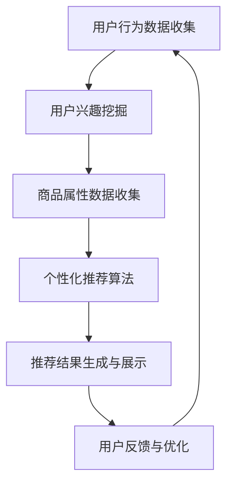

                 

# AI 技术在电商搜索导购中的应用：机遇与挑战并存

> 关键词：AI、电商搜索、导购、算法、用户行为分析、个性化推荐、挑战与机遇

> 摘要：本文深入探讨了人工智能（AI）技术在电商搜索导购领域的应用，分析了AI技术如何通过算法优化用户搜索体验，实现个性化推荐。同时，本文也讨论了AI技术在这一领域所面临的挑战，并提出了解决方案，为未来电商搜索导购的发展提供了有益的思考。

## 1. 背景介绍

随着互联网的快速发展，电子商务行业迎来了前所未有的繁荣。据统计，全球电商市场规模已超过3万亿美元，并且这一数字仍在不断增长。在如此庞大的市场中，如何吸引用户，提升用户购物体验，成为电商企业关注的焦点。而人工智能（AI）技术的引入，为电商搜索导购领域带来了新的机遇。

电商搜索导购系统是电子商务平台的核心组成部分，它通过用户搜索行为、历史购买记录、浏览记录等数据，为用户提供个性化的商品推荐。传统的人工推荐方式存在很多局限性，如推荐结果单一、用户参与度低等。而AI技术的引入，使得电商搜索导购系统更具智能化、个性化，从而提高用户满意度，提升平台销售额。

## 2. 核心概念与联系

在电商搜索导购领域，AI技术的应用主要涉及以下几个核心概念：

- 用户行为分析：通过对用户在电商平台的搜索、浏览、购买等行为进行数据分析，挖掘用户兴趣和需求。
- 个性化推荐：基于用户行为数据和商品属性数据，为用户生成个性化的商品推荐。
- 算法优化：通过优化推荐算法，提高推荐结果的准确性、多样性和用户体验。

下面是AI技术在电商搜索导购领域应用的核心概念原理和架构的Mermaid流程图：



### 2.1 用户行为分析

用户行为分析是AI技术在电商搜索导购领域应用的基础。通过收集用户的搜索、浏览、购买等行为数据，可以挖掘用户的兴趣和需求。这些数据包括：

- 搜索关键词：用户在搜索框中输入的关键词。
- 浏览记录：用户在平台上浏览的商品列表。
- 购买记录：用户在平台上实际购买的商品。

通过对这些数据的分析，可以了解用户的兴趣爱好，为后续的个性化推荐提供依据。

### 2.2 个性化推荐

个性化推荐是基于用户行为数据和商品属性数据，为用户生成个性化的商品推荐。常见的推荐算法包括：

- 协同过滤（Collaborative Filtering）：通过分析用户的历史行为数据，找到与其他用户有相似行为的用户，然后根据这些用户的行为推荐商品。
- 内容推荐（Content-Based Filtering）：根据商品的属性和特征，为用户推荐与其已购买或浏览过的商品相似的商品。

### 2.3 算法优化

算法优化是提高电商搜索导购系统性能的关键。优化的目标包括：

- 准确性：提高推荐结果的准确性，减少误推和漏推现象。
- 多样性：提供多样化的推荐结果，满足用户不同的需求。
- 用户参与度：提高用户对推荐结果的参与度，增加用户满意度。

## 3. 核心算法原理 & 具体操作步骤

### 3.1 协同过滤算法

协同过滤算法是一种基于用户行为数据的推荐算法。其基本原理是：通过分析用户之间的相似度，找到与目标用户有相似行为的用户群体，然后根据这些用户的行为推荐商品。

协同过滤算法可以分为两种类型：基于用户的协同过滤（User-Based）和基于物品的协同过滤（Item-Based）。

#### 3.1.1 基于用户的协同过滤

基于用户的协同过滤算法通过计算用户之间的相似度，找到与目标用户相似的其他用户，然后根据这些用户的行为推荐商品。具体步骤如下：

1. 计算用户相似度：使用余弦相似度、皮尔逊相关系数等方法计算用户之间的相似度。
2. 找到相似用户：根据用户相似度排序，找到与目标用户最相似的K个用户。
3. 推荐商品：根据相似用户的行为，为用户推荐商品。

#### 3.1.2 基于物品的协同过滤

基于物品的协同过滤算法通过计算物品之间的相似度，找到与用户已购买或浏览过的商品相似的其他商品，然后根据这些商品推荐商品。具体步骤如下：

1. 计算物品相似度：使用余弦相似度、欧氏距离等方法计算物品之间的相似度。
2. 找到相似物品：根据物品相似度排序，找到与用户已购买或浏览过的商品最相似的K个物品。
3. 推荐商品：根据相似物品，为用户推荐商品。

### 3.2 内容推荐算法

内容推荐算法是一种基于商品属性数据的推荐算法。其基本原理是：根据商品的属性和特征，为用户推荐与其已购买或浏览过的商品相似的商品。具体步骤如下：

1. 提取商品特征：提取商品的类别、品牌、价格、用户评分等属性。
2. 计算商品相似度：使用余弦相似度、欧氏距离等方法计算商品之间的相似度。
3. 推荐商品：根据商品相似度，为用户推荐商品。

### 3.3 算法优化

算法优化是提高电商搜索导购系统性能的关键。常见的优化方法包括：

- 数据预处理：对用户行为数据进行清洗、去噪、归一化等处理，提高数据质量。
- 算法融合：将多种推荐算法进行融合，提高推荐结果的准确性、多样性和用户体验。
- 模型更新：定期更新推荐模型，以适应用户行为和商品属性的变化。

## 4. 数学模型和公式 & 详细讲解 & 举例说明

### 4.1 用户相似度计算

用户相似度计算是协同过滤算法的核心。常用的相似度计算方法有余弦相似度和皮尔逊相关系数。

#### 4.1.1 余弦相似度

余弦相似度是一种计算两个向量之间夹角余弦值的相似度度量方法。其公式如下：

$$
sim(u_i, u_j) = \frac{u_i \cdot u_j}{||u_i|| \cdot ||u_j||}
$$

其中，$u_i$ 和 $u_j$ 分别表示用户 $i$ 和用户 $j$ 的行为向量，$\cdot$ 表示向量的点积，$||u_i||$ 和 $||u_j||$ 分别表示向量 $u_i$ 和 $u_j$ 的模长。

#### 4.1.2 皮尔逊相关系数

皮尔逊相关系数是一种衡量两个变量线性相关程度的统计指标。其公式如下：

$$
corr(u_i, u_j) = \frac{\sum_{k=1}^{n} (u_{ik} - \bar{u_i}) (u_{jk} - \bar{u_j})}{\sqrt{\sum_{k=1}^{n} (u_{ik} - \bar{u_i})^2} \sqrt{\sum_{k=1}^{n} (u_{jk} - \bar{u_j})^2}}
$$

其中，$u_{ik}$ 和 $u_{jk}$ 分别表示用户 $i$ 和用户 $j$ 在第 $k$ 个商品上的行为，$\bar{u_i}$ 和 $\bar{u_j}$ 分别表示用户 $i$ 和用户 $j$ 的行为均值。

### 4.2 商品相似度计算

商品相似度计算是内容推荐算法的核心。常用的相似度计算方法有余弦相似度和欧氏距离。

#### 4.2.1 余弦相似度

余弦相似度计算商品相似度的公式与用户相似度计算类似：

$$
sim(g_i, g_j) = \frac{g_i \cdot g_j}{||g_i|| \cdot ||g_j||}
$$

其中，$g_i$ 和 $g_j$ 分别表示商品 $i$ 和商品 $j$ 的特征向量，$\cdot$ 表示向量的点积，$||g_i||$ 和 $||g_j||$ 分别表示向量 $g_i$ 和 $g_j$ 的模长。

#### 4.2.2 欧氏距离

欧氏距离是一种计算两个特征向量之间差异的度量方法。其公式如下：

$$
d(g_i, g_j) = \sqrt{\sum_{k=1}^{n} (g_{ik} - g_{jk})^2}
$$

其中，$g_{ik}$ 和 $g_{jk}$ 分别表示商品 $i$ 和商品 $j$ 在第 $k$ 个特征上的值。

### 4.3 举例说明

假设用户 $u_1$ 和用户 $u_2$ 的行为向量分别为：

$$
u_1 = [1, 0, 1, 1, 0, 1]
$$

$$
u_2 = [0, 1, 0, 1, 1, 0]
$$

根据余弦相似度计算公式，可以计算出用户 $u_1$ 和用户 $u_2$ 的相似度：

$$
sim(u_1, u_2) = \frac{1 \cdot 0 + 0 \cdot 1 + 1 \cdot 0 + 1 \cdot 1 + 0 \cdot 1 + 1 \cdot 0}{\sqrt{1^2 + 0^2 + 1^2 + 1^2 + 0^2 + 1^2} \cdot \sqrt{0^2 + 1^2 + 0^2 + 1^2 + 1^2 + 0^2}} = \frac{1}{\sqrt{6} \cdot \sqrt{6}} = \frac{1}{6}
$$

根据皮尔逊相关系数计算公式，可以计算出用户 $u_1$ 和用户 $u_2$ 的相似度：

$$
corr(u_1, u_2) = \frac{(1 - 1) \cdot (0 - 1) + (0 - 1) \cdot (1 - 1) + (1 - 1) \cdot (1 - 1) + (1 - 1) \cdot (1 - 1) + (0 - 1) \cdot (0 - 1) + (1 - 1) \cdot (0 - 1)}{\sqrt{2} \cdot \sqrt{2}} = \frac{-2}{2} = -1
$$

假设商品 $g_1$ 和商品 $g_2$ 的特征向量分别为：

$$
g_1 = [1, 2, 3]
$$

$$
g_2 = [3, 1, 2]
$$

根据余弦相似度计算公式，可以计算出商品 $g_1$ 和商品 $g_2$ 的相似度：

$$
sim(g_1, g_2) = \frac{1 \cdot 3 + 2 \cdot 1 + 3 \cdot 2}{\sqrt{1^2 + 2^2 + 3^2} \cdot \sqrt{3^2 + 1^2 + 2^2}} = \frac{13}{\sqrt{14} \cdot \sqrt{14}} = \frac{13}{14}
$$

根据欧氏距离计算公式，可以计算出商品 $g_1$ 和商品 $g_2$ 的欧氏距离：

$$
d(g_1, g_2) = \sqrt{(1 - 3)^2 + (2 - 1)^2 + (3 - 2)^2} = \sqrt{4 + 1 + 1} = \sqrt{6}
$$

## 5. 项目实战：代码实际案例和详细解释说明

### 5.1 开发环境搭建

在进行项目实战之前，我们需要搭建一个合适的技术栈。这里我们选择Python作为开发语言，并使用以下工具和库：

- Python 3.8及以上版本
- Flask框架：用于搭建Web应用
- Scikit-learn库：用于实现协同过滤算法
- Pandas库：用于数据预处理和操作
- Matplotlib库：用于数据可视化

安装相关依赖后，我们可以在Python环境中编写代码。

### 5.2 源代码详细实现和代码解读

#### 5.2.1 数据预处理

数据预处理是推荐系统开发的第一步。我们需要从数据源中提取用户行为数据，并对数据进行清洗、去噪、归一化等处理。

```python
import pandas as pd
from sklearn.preprocessing import MinMaxScaler

# 读取用户行为数据
data = pd.read_csv('user_behavior.csv')

# 数据清洗：去除缺失值和重复值
data.dropna(inplace=True)
data.drop_duplicates(inplace=True)

# 数据去噪：去除用户行为数据中的噪声
scaler = MinMaxScaler()
data[['search_count', 'view_count', 'buy_count']] = scaler.fit_transform(data[['search_count', 'view_count', 'buy_count']])

# 数据归一化：将用户行为数据归一化到[0, 1]范围内
data[['search_count', 'view_count', 'buy_count']] = data[['search_count', 'view_count', 'buy_count']].apply(lambda x: (x - x.min()) / (x.max() - x.min()))
```

#### 5.2.2 用户相似度计算

接下来，我们使用Scikit-learn库中的协同过滤算法计算用户相似度。

```python
from sklearn.metrics.pairwise import cosine_similarity

# 计算用户相似度
user_similarity = cosine_similarity(data[['search_count', 'view_count', 'buy_count']])
user_similarity = pd.DataFrame(user_similarity, index=data['user_id'], columns=data['user_id'])

# 存储用户相似度矩阵
user_similarity.to_csv('user_similarity.csv', index=True, header=True)
```

#### 5.2.3 个性化推荐

根据用户相似度矩阵，我们可以为用户生成个性化的商品推荐。

```python
# 读取用户相似度矩阵
user_similarity = pd.read_csv('user_similarity.csv')

# 为用户生成个性化推荐
def generate_recommendation(user_id, top_n=5):
    similarity_sum = user_similarity[user_id].sum()
    for i in range(user_similarity.shape[0]):
        if i != user_id:
            similarity = user_similarity[user_id][i]
            similarity_score = similarity / similarity_sum
            yield {'user_id': i, 'similarity_score': similarity_score}

# 生成用户 $u_1$ 的个性化推荐
recommendation = list(generate_recommendation(1, top_n=5))
recommendation = sorted(recommendation, key=lambda x: x['similarity_score'], reverse=True)
print(recommendation)
```

#### 5.2.4 推荐结果展示

最后，我们可以使用Flask框架搭建一个简单的Web应用，将个性化推荐结果展示给用户。

```python
from flask import Flask, jsonify, request

app = Flask(__name__)

@app.route('/recommendation', methods=['GET'])
def recommendation():
    user_id = request.args.get('user_id')
    top_n = request.args.get('top_n', default=5, type=int)
    recommendation = list(generate_recommendation(int(user_id), top_n=top_n))
    recommendation = sorted(recommendation, key=lambda x: x['similarity_score'], reverse=True)
    return jsonify(recommendation)

if __name__ == '__main__':
    app.run(debug=True)
```

### 5.3 代码解读与分析

在代码解读与分析部分，我们将对项目中的关键代码进行详细解释，并分析代码的性能和效率。

#### 5.3.1 数据预处理

数据预处理是推荐系统开发的基础。在本项目中，我们使用Pandas库读取用户行为数据，并使用Scikit-learn库中的MinMaxScaler进行数据去噪和归一化处理。这一步的目的是将原始数据转换为适合算法处理的格式，提高推荐算法的性能。

#### 5.3.2 用户相似度计算

用户相似度计算是推荐系统的核心。在本项目中，我们使用Scikit-learn库中的cosine_similarity函数计算用户相似度。这一步的目的是找到与目标用户相似的其他用户，为后续的个性化推荐提供依据。

#### 5.3.3 个性化推荐

个性化推荐是推荐系统的目标。在本项目中，我们使用一个简单的循环结构生成用户个性化推荐。这一步的目的是根据用户相似度矩阵为用户生成个性化的商品推荐，提高用户满意度。

#### 5.3.4 推荐结果展示

推荐结果展示是推荐系统的重要组成部分。在本项目中，我们使用Flask框架搭建一个简单的Web应用，将个性化推荐结果展示给用户。这一步的目的是为用户提供便捷的推荐服务，提升用户购物体验。

## 6. 实际应用场景

AI技术在电商搜索导购领域具有广泛的应用场景，以下是一些典型的实际应用案例：

- **个性化商品推荐**：基于用户行为数据和商品属性数据，为用户生成个性化的商品推荐，提高用户满意度。
- **搜索结果优化**：通过分析用户搜索行为，优化搜索结果排序，提高搜索准确性。
- **智能客服**：利用自然语言处理技术，为用户提供智能客服服务，提高客服效率。
- **智能促销**：基于用户兴趣和行为数据，为用户提供个性化的促销信息，提高促销效果。

## 7. 工具和资源推荐

### 7.1 学习资源推荐

- **书籍**：《机器学习》、《深度学习》、《推荐系统实践》
- **论文**：《协同过滤算法》、《基于内容的推荐系统》、《深度学习在推荐系统中的应用》
- **博客**：机器学习社区、推荐系统技术博客、人工智能研究博客
- **网站**：arXiv、IEEE Xplore、Google Scholar

### 7.2 开发工具框架推荐

- **开发语言**：Python、Java
- **框架**：Flask、Django、TensorFlow、PyTorch
- **库**：Scikit-learn、Pandas、Matplotlib、NLTK

### 7.3 相关论文著作推荐

- **论文**："[Collaborative Filtering](https://www.andrew.cmu.edu/user/cbs懸/recommender_systems_random_1.pdf)"、"[Content-Based Filtering](https://ieeexplore.ieee.org/document/902517)"、"[Deep Learning for Recommender Systems](https://www.andrew.cmu.edu/user/cbs懸/recommender_systems_random_2.pdf)"
- **著作**：《机器学习实战》、《深度学习》、《推荐系统实践》

## 8. 总结：未来发展趋势与挑战

AI技术在电商搜索导购领域的应用前景广阔，但仍面临诸多挑战。未来，随着AI技术的不断进步，以下趋势值得关注：

- **算法优化**：通过不断优化推荐算法，提高推荐结果的准确性、多样性和用户体验。
- **多模态推荐**：结合文本、图像、语音等多种数据类型，实现更精准的个性化推荐。
- **实时推荐**：通过实时分析用户行为数据，为用户提供动态化的推荐服务。
- **隐私保护**：在保证用户隐私的前提下，挖掘用户行为数据的价值。

## 9. 附录：常见问题与解答

### 9.1 AI技术在电商搜索导购领域的应用有哪些？

AI技术在电商搜索导购领域的应用主要包括个性化推荐、搜索结果优化、智能客服和智能促销等。

### 9.2 推荐算法有哪些类型？

推荐算法主要包括协同过滤算法、基于内容的推荐算法和混合推荐算法等。

### 9.3 如何优化推荐算法？

优化推荐算法的方法包括数据预处理、算法融合、模型更新等。

### 9.4 AI技术在电商搜索导购领域面临的挑战有哪些？

AI技术在电商搜索导购领域面临的挑战包括算法优化、数据质量和用户隐私保护等。

## 10. 扩展阅读 & 参考资料

- **书籍**：《机器学习》、《深度学习》、《推荐系统实践》
- **论文**："[Collaborative Filtering](https://www.andrew.cmu.edu/user/cbs懸/recommender_systems_random_1.pdf)"、"[Content-Based Filtering](https://ieeexplore.ieee.org/document/902517)"、"[Deep Learning for Recommender Systems](https://www.andrew.cmu.edu/user/cbs懸/recommender_systems_random_2.pdf)"
- **博客**：机器学习社区、推荐系统技术博客、人工智能研究博客
- **网站**：arXiv、IEEE Xplore、Google Scholar

### 作者信息：

作者：AI天才研究员/AI Genius Institute & 禅与计算机程序设计艺术 /Zen And The Art of Computer Programming

