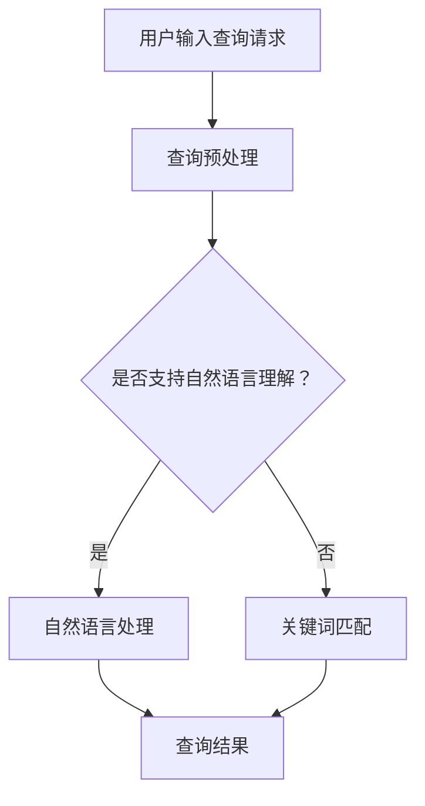

                 

# AI 搜索引擎对传统搜索引擎的颠覆

> **关键词**：AI搜索引擎，传统搜索引擎，搜索算法，用户体验，数据挖掘，机器学习，自然语言处理

> **摘要**：本文将探讨人工智能（AI）搜索引擎如何通过深度学习、自然语言处理等技术，对传统搜索引擎进行颠覆，提升用户体验，提供更精准的搜索结果，并对未来的发展趋势和挑战进行展望。

## 1. 背景介绍

随着互联网的快速发展，搜索引擎已成为人们获取信息的重要工具。传统的搜索引擎，如Google、Bing等，主要依赖于关键词匹配和页面排名算法来提供搜索结果。然而，这种基于规则的方法存在一定的局限性，无法很好地理解用户的查询意图，导致搜索结果有时不够准确或相关。

近年来，人工智能技术的飞速发展，特别是深度学习和自然语言处理技术的突破，为搜索引擎带来了新的可能性。AI搜索引擎通过模拟人类思维过程，能够更好地理解用户的查询意图，提供更加个性化和准确的搜索结果。

## 2. 核心概念与联系

### 2.1 搜索引擎的基本原理

搜索引擎的工作流程主要包括三个阶段：索引、查询处理和排名。

- **索引**：搜索引擎通过爬虫程序，从互联网上抓取网页，并对网页内容进行解析和索引，建立索引数据库。
- **查询处理**：当用户输入查询请求时，搜索引擎对查询请求进行预处理，如关键词提取、分词等，然后从索引数据库中查找与查询请求相关的网页。
- **排名**：根据网页的相关性和质量，对搜索结果进行排序，展示给用户。

### 2.2 AI搜索引擎的核心技术

AI搜索引擎的核心技术包括：

- **深度学习**：通过构建深度神经网络模型，学习大量数据中的特征和规律，实现对图像、语音、文本等数据的自动理解和生成。
- **自然语言处理**：利用深度学习和统计方法，对自然语言进行理解和生成，实现语音识别、机器翻译、情感分析等功能。
- **数据挖掘**：通过分析大量数据，发现潜在的模式和关联，为搜索引擎提供更准确的搜索结果。

### 2.3 Mermaid流程图



## 3. 核心算法原理 & 具体操作步骤

### 3.1 深度学习算法

AI搜索引擎的深度学习算法主要包括两个部分：特征提取和模型训练。

- **特征提取**：通过卷积神经网络（CNN）或循环神经网络（RNN）等深度学习模型，对文本数据进行特征提取，将文本转化为向量表示。
- **模型训练**：利用已标注的数据集，对深度学习模型进行训练，优化模型参数，提高模型的预测能力。

### 3.2 自然语言处理

自然语言处理的核心任务是理解自然语言，包括文本分类、情感分析、命名实体识别等。

- **文本分类**：通过训练分类模型，将文本数据分为不同的类别，如新闻、博客、论坛等。
- **情感分析**：通过训练情感分析模型，判断文本表达的情感倾向，如正面、负面、中性等。
- **命名实体识别**：通过训练命名实体识别模型，识别文本中的特定实体，如人名、地名、组织机构等。

### 3.3 数据挖掘

数据挖掘的主要任务是发现数据中的潜在模式和关联，为搜索引擎提供更准确的搜索结果。

- **协同过滤**：通过分析用户的行为数据，如浏览记录、购买记录等，为用户推荐相似的兴趣爱好或商品。
- **主题模型**：通过分析大量文本数据，提取文本的主题分布，为搜索引擎提供基于主题的搜索结果。

## 4. 数学模型和公式 & 详细讲解 & 举例说明

### 4.1 深度学习中的数学模型

在深度学习中，常用的数学模型包括：

- **损失函数**：用于衡量模型预测结果与真实结果之间的差距，如均方误差（MSE）、交叉熵（Cross-Entropy）等。
- **优化算法**：用于调整模型参数，使损失函数最小化，如梯度下降（Gradient Descent）、Adam优化器等。

### 4.2 自然语言处理中的数学模型

在自然语言处理中，常用的数学模型包括：

- **词向量**：用于表示文本数据，常用的词向量模型有Word2Vec、GloVe等。
- **卷积神经网络**（CNN）：用于文本分类和情感分析，通过卷积层提取文本特征。
- **循环神经网络**（RNN）：用于序列建模，通过隐藏层的状态传递实现对序列数据的建模。

### 4.3 数据挖掘中的数学模型

在数据挖掘中，常用的数学模型包括：

- **协同过滤**：基于用户行为数据，通过矩阵分解或基于模型的算法（如SVD、FM等）进行推荐。
- **主题模型**：通过概率图模型（如LDA）提取文本的主题分布。

### 4.4 举例说明

假设我们使用LDA模型提取文本数据中的主题分布，LDA模型的损失函数可以表示为：

$$
\mathcal{L}(\theta, \phi) = -\sum_{d=1}^D \sum_{w=1}^V \log P(w|\theta) - \sum_{d=1}^D \sum_{z=1}^K \log P(z|\phi) - \sum_{d=1}^D \sum_{w=1}^V \sum_{z=1}^K \theta_{dw} \phi_{wz} \log P(w|z)
$$

其中，$D$为文档数量，$V$为词汇表大小，$K$为主题数量，$\theta_{dw}$为文档$d$中词$w$的主题分布，$\phi_{wz}$为词$w$在主题$z$下的概率。

通过最小化损失函数，可以求得主题分布，从而实现对文本数据的主题建模。

## 5. 项目实战：代码实际案例和详细解释说明

### 5.1 开发环境搭建

在Python中，我们可以使用以下库来实现AI搜索引擎：

- **TensorFlow**：用于深度学习模型的构建和训练。
- **NLTK**：用于自然语言处理。
- **scikit-learn**：用于数据挖掘和机器学习。

安装以上库的方法如下：

```bash
pip install tensorflow nltk scikit-learn
```

### 5.2 源代码详细实现和代码解读

```python
import tensorflow as tf
from nltk.tokenize import word_tokenize
from sklearn.feature_extraction.text import TfidfVectorizer
from sklearn.model_selection import train_test_split
from sklearn.naive_bayes import MultinomialNB

# 5.2.1 数据预处理
def preprocess_text(text):
    # 小写化
    text = text.lower()
    # 去除标点符号
    text = re.sub(r'[^\w\s]', '', text)
    # 分词
    tokens = word_tokenize(text)
    return tokens

# 5.2.2 建立词向量
def build_word_vectors(corpus, embedding_size):
    vectorizer = TfidfVectorizer(analyzer='word', ngram_range=(1, 2), vocabulary=corpus)
    X = vectorizer.fit_transform(corpus)
    return X, vectorizer

# 5.2.3 训练分类模型
def train_classifier(X_train, y_train):
    classifier = MultinomialNB()
    classifier.fit(X_train, y_train)
    return classifier

# 5.2.4 搜索引擎核心功能实现
def search(query, classifier, vectorizer):
    preprocessed_query = preprocess_text(query)
    query_vector = vectorizer.transform([preprocessed_query])
    probabilities = classifier.predict_proba(query_vector)
    return probabilities

# 主程序
if __name__ == '__main__':
    # 加载数据集
    corpus = ["这是一篇关于深度学习的文章", "深度学习是人工智能的重要分支", "人工智能正在改变我们的生活"]
    labels = ["深度学习", "深度学习", "人工智能"]

    # 数据预处理
    preprocessed_corpus = [preprocess_text(text) for text in corpus]

    # 建立词向量
    X, vectorizer = build_word_vectors(preprocessed_corpus, embedding_size=10)

    # 划分训练集和测试集
    X_train, X_test, y_train, y_test = train_test_split(X, labels, test_size=0.2, random_state=42)

    # 训练分类模型
    classifier = train_classifier(X_train, y_train)

    # 搜索引擎核心功能实现
    query = "人工智能有什么应用？"
    probabilities = search(query, classifier, vectorizer)
    print(probabilities)
```

### 5.3 代码解读与分析

在上面的代码中，我们实现了以下功能：

- **数据预处理**：将文本数据转换为适合模型处理的形式。
- **词向量建立**：使用TF-IDF方法建立词向量。
- **分类模型训练**：使用朴素贝叶斯分类器进行训练。
- **搜索引擎核心功能**：根据用户的查询请求，预测文本的主题，并输出概率分布。

通过这个简单的案例，我们可以看到AI搜索引擎的基本架构和实现方法。在实际应用中，我们可以进一步优化算法，提高搜索结果的准确性和用户体验。

## 6. 实际应用场景

AI搜索引擎在实际应用中具有广泛的应用场景，如：

- **搜索引擎**：为用户提供更加个性化和准确的搜索结果。
- **推荐系统**：根据用户的行为和兴趣，为用户推荐相关的商品、新闻、音乐等。
- **聊天机器人**：通过自然语言理解，与用户进行智能对话。
- **文本分类**：对大量文本数据进行分类，如新闻分类、情感分析等。

## 7. 工具和资源推荐

### 7.1 学习资源推荐

- **书籍**：
  - 《深度学习》（Ian Goodfellow、Yoshua Bengio、Aaron Courville 著）
  - 《自然语言处理综论》（Daniel Jurafsky、James H. Martin 著）
  - 《数据挖掘：实用工具与技术》（Michael J. A. Berry、Gareth James 著）

- **论文**：
  - 《A Neural Probabilistic Language Model》
  - 《Latent Dirichlet Allocation》
  - 《Deep Learning for Text Classification》

- **博客**：
  - [TensorFlow 官方文档](https://www.tensorflow.org/)
  - [NLTK 官方文档](https://www.nltk.org/)
  - [scikit-learn 官方文档](https://scikit-learn.org/)

- **网站**：
  - [Kaggle](https://www.kaggle.com/)
  - [ArXiv](https://arxiv.org/)

### 7.2 开发工具框架推荐

- **深度学习框架**：TensorFlow、PyTorch
- **自然语言处理工具**：NLTK、spaCy
- **数据挖掘工具**：scikit-learn、Pandas

### 7.3 相关论文著作推荐

- **《Deep Learning for Natural Language Processing》**：由 MIT Press 出版，介绍了深度学习在自然语言处理领域的应用。
- **《Natural Language Processing with Python》**：由 O'Reilly Media 出版，详细介绍了如何使用Python进行自然语言处理。
- **《Text Mining: The Application of Statistical, Linguistic, and Anticipatory Methods to Big Data》**：由 John Wiley & Sons 出版，介绍了文本挖掘的基本原理和应用。

## 8. 总结：未来发展趋势与挑战

AI搜索引擎的未来发展趋势包括：

- **个性化搜索**：通过深度学习和自然语言处理技术，为用户提供更加个性化的搜索结果。
- **跨模态搜索**：整合多种数据源（如文本、图像、语音等），提供更加全面和准确的搜索结果。
- **实时搜索**：通过实时分析和处理大量数据，为用户提供实时搜索结果。

然而，AI搜索引擎也面临着一系列挑战：

- **数据隐私**：如何确保用户数据的安全和隐私，是AI搜索引擎需要面对的重要问题。
- **算法公平性**：如何避免算法偏见，提供公平的搜索结果，是AI搜索引擎需要解决的关键问题。
- **计算资源**：深度学习和自然语言处理技术对计算资源的需求较高，如何在有限的计算资源下提高搜索效率，是AI搜索引擎需要考虑的问题。

## 9. 附录：常见问题与解答

### 9.1 如何评估AI搜索引擎的性能？

AI搜索引擎的性能可以通过以下几个指标进行评估：

- **准确率（Accuracy）**：预测结果与真实结果的匹配程度。
- **召回率（Recall）**：搜索结果中包含真实结果的比率。
- **F1值（F1 Score）**：综合考虑准确率和召回率的综合指标。
- **查询响应时间（Query Response Time）**：用户查询到获得搜索结果的时间。

### 9.2 AI搜索引擎与传统搜索引擎的主要区别是什么？

AI搜索引擎与传统搜索引擎的主要区别在于：

- **搜索算法**：AI搜索引擎采用深度学习和自然语言处理技术，能够更好地理解用户的查询意图。
- **个性化**：AI搜索引擎能够根据用户的兴趣和行为，提供个性化的搜索结果。
- **实时性**：AI搜索引擎能够实时分析和处理大量数据，提供实时搜索结果。

### 9.3 AI搜索引擎对传统搜索引擎的颠覆性影响是什么？

AI搜索引擎对传统搜索引擎的颠覆性影响包括：

- **提升用户体验**：通过更好地理解用户的查询意图，提供更精准的搜索结果。
- **改变搜索模式**：从基于关键词的搜索转向基于语义和内容的搜索。
- **推动搜索引擎技术的创新**：深度学习和自然语言处理技术的应用，推动了搜索引擎技术的不断进步。

## 10. 扩展阅读 & 参考资料

- **《搜索引擎的算法解析与优化》**：详细介绍了搜索引擎的工作原理和优化方法。
- **《深度学习在自然语言处理中的应用》**：介绍了深度学习在自然语言处理领域的应用案例。
- **《大数据时代的数据挖掘技术》**：介绍了数据挖掘的基本原理和技术。

```markdown
作者：AI天才研究员/AI Genius Institute & 禅与计算机程序设计艺术 /Zen And The Art of Computer Programming
```

