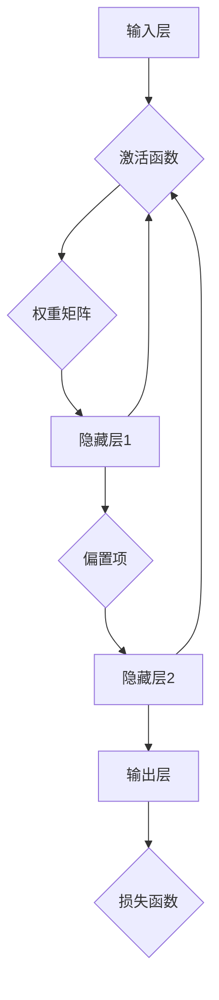

                 

# AI 神经网络计算艺术之禅：破除人类中心主义的傲慢

> **关键词：** AI 神经网络、计算艺术、人类中心主义、傲慢、技术哲学、智能革命

> **摘要：** 本文从技术哲学的角度出发，探讨了人工智能神经网络计算艺术的本质及其对人类中心主义傲慢的破除。通过深入分析神经网络的核心概念、算法原理、数学模型，结合实际项目实战和多种资源推荐，旨在引发读者对AI技术的深刻思考和反思。

## 1. 背景介绍

随着信息技术的飞速发展，人工智能（AI）已成为当前科技领域最热门的话题之一。人工智能通过模拟人类大脑的神经网络结构，实现了对海量数据的处理和智能决策。然而，随着AI技术的不断进步，人类中心主义傲慢的问题也日益凸显。

人类中心主义傲慢是指人类将自己置于绝对中心的思维模式，认为自己是万物之主，其他生物和自然界都是为人类服务的。这种思维模式在科技发展中表现为过度依赖技术、忽视自然环境和生态系统的平衡，以及对其他物种的残酷对待。

本文将从AI神经网络的角度，探讨如何破除人类中心主义的傲慢，实现人与自然、人与技术、人与人的和谐共生。本文分为以下几个部分：

1. 背景介绍：阐述人工智能神经网络的发展背景和人类中心主义傲慢的问题。
2. 核心概念与联系：介绍神经网络的基本概念、架构和关键联系。
3. 核心算法原理 & 具体操作步骤：深入解析神经网络算法的原理和操作步骤。
4. 数学模型和公式 & 详细讲解 & 举例说明：详细讲解神经网络中的数学模型和公式，并通过实例进行说明。
5. 项目实战：代码实际案例和详细解释说明。
6. 实际应用场景：探讨神经网络在现实世界中的应用。
7. 工具和资源推荐：推荐学习资源、开发工具和框架。
8. 总结：未来发展趋势与挑战。
9. 附录：常见问题与解答。
10. 扩展阅读 & 参考资料。

## 2. 核心概念与联系

神经网络是人工智能的基础，其核心在于模仿人脑的神经元结构和工作原理。下面我们将通过Mermaid流程图，详细展示神经网络的基本概念、架构和关键联系。



### 2.1 神经元结构

神经元是神经网络的基本单元，类似于人脑中的神经元。一个神经元由以下几个部分组成：

- 输入：接收来自其他神经元的信号。
- 权重：每个输入信号与对应的权重相乘，权重表示输入信号对神经元输出的影响程度。
- 激活函数：对加权输入进行非线性变换，以决定神经元是否会被激活。
- 输出：被激活的神经元会将信号传递给其他神经元。

### 2.2 网络架构

神经网络通常由输入层、隐藏层和输出层组成。输入层接收外部输入数据，隐藏层对数据进行处理和变换，输出层生成最终结果。

- 输入层：接收外部输入，如图像、声音等。
- 隐藏层：对输入数据进行处理和变换，通过多层隐藏层的组合，实现数据的复杂变换。
- 输出层：生成最终结果，如分类、预测等。

### 2.3 激活函数

激活函数是神经网络中的一个关键部分，用于引入非线性特性。常见的激活函数包括：

- Sigmoid函数：输出介于0和1之间的值，表示概率。
-ReLU函数：输出大于0的值，否则为0，引入稀疏性。
- Tanh函数：与Sigmoid函数类似，但输出范围为[-1,1]。

### 2.4 损失函数

损失函数用于衡量神经网络输出结果与真实值之间的差距，常用的损失函数包括：

- 交叉熵损失函数：用于分类任务，衡量类别预测的准确性。
- 均方误差损失函数：用于回归任务，衡量预测值与真实值之间的差距。

通过以上对神经网络核心概念和架构的介绍，我们可以更好地理解神经网络的工作原理，以及如何通过调整权重、激活函数和损失函数来优化神经网络的表现。

## 3. 核心算法原理 & 具体操作步骤

### 3.1 前向传播

前向传播是神经网络中的基本操作，用于将输入数据通过多层神经网络传递，最终生成输出结果。具体步骤如下：

1. **初始化权重和偏置**：随机初始化神经网络中的权重和偏置项。
2. **计算输入层到隐藏层的输出**：将输入数据与权重矩阵相乘，然后加上偏置项，通过激活函数得到隐藏层的输出。
3. **计算隐藏层到输出层的输出**：将隐藏层的输出与输出层的权重矩阵相乘，然后加上偏置项，通过激活函数得到输出层的输出。
4. **计算损失函数**：将输出层的结果与真实值进行比较，通过损失函数计算损失。

### 3.2 反向传播

反向传播是神经网络中的另一个关键操作，用于根据损失函数的梯度调整网络中的权重和偏置项，从而优化网络表现。具体步骤如下：

1. **计算输出层的误差**：通过损失函数计算输出层的结果与真实值之间的误差。
2. **计算隐藏层的误差**：将输出层的误差反向传播到隐藏层，通过链式法则计算隐藏层的误差。
3. **更新权重和偏置**：根据误差的梯度，调整网络中的权重和偏置项，以减少损失函数的值。

### 3.3 梯度下降

梯度下降是反向传播算法的核心，用于优化神经网络中的参数。具体步骤如下：

1. **计算梯度**：通过反向传播计算每个参数的梯度。
2. **更新参数**：根据梯度和学习率，更新网络中的参数。
3. **迭代计算**：重复上述步骤，直至满足停止条件（如损失函数收敛、达到最大迭代次数等）。

通过以上对神经网络核心算法原理和具体操作步骤的介绍，我们可以更好地理解神经网络是如何通过前向传播和反向传播来学习数据的。同时，了解这些操作步骤也有助于我们更好地优化神经网络的表现。

## 4. 数学模型和公式 & 详细讲解 & 举例说明

### 4.1 神经网络中的数学模型

神经网络中的数学模型主要包括以下几个部分：

1. **线性模型**：神经网络中的每个神经元都可以看作是一个线性模型，其输出可以通过以下公式计算：

   $$z = \sum_{i=1}^{n} w_{i}x_{i} + b$$

   其中，$z$表示神经元的输出，$w_{i}$表示权重，$x_{i}$表示输入，$b$表示偏置项。

2. **激活函数**：激活函数用于引入非线性特性，常用的激活函数包括：

   - **Sigmoid函数**：

     $$\sigma(z) = \frac{1}{1 + e^{-z}}$$

   - **ReLU函数**：

     $$\text{ReLU}(z) = \max(0, z)$$

   - **Tanh函数**：

     $$\text{Tanh}(z) = \frac{e^{z} - e^{-z}}{e^{z} + e^{-z}}$$

3. **损失函数**：损失函数用于衡量神经网络输出结果与真实值之间的差距，常用的损失函数包括：

   - **交叉熵损失函数**：

     $$L(y, \hat{y}) = -\sum_{i=1}^{n} y_{i} \log \hat{y}_{i}$$

     其中，$y$表示真实值，$\hat{y}$表示预测值。

   - **均方误差损失函数**：

     $$L(y, \hat{y}) = \frac{1}{2} \sum_{i=1}^{n} (y_{i} - \hat{y}_{i})^2$$

### 4.2 详细讲解与举例说明

为了更好地理解神经网络中的数学模型，我们通过以下例子进行详细讲解。

#### 例子：使用Sigmoid函数的神经网络进行二分类任务

假设我们使用一个简单的神经网络进行二分类任务，其中输入层有2个神经元，隐藏层有3个神经元，输出层有1个神经元。激活函数选择Sigmoid函数。

1. **初始化参数**：随机初始化权重和偏置项。

2. **前向传播**：

   - 输入层到隐藏层的输出：

     $$z_{1} = \sigma(w_{11}x_{1} + b_{1})$$  
     $$z_{2} = \sigma(w_{12}x_{2} + b_{2})$$

   - 隐藏层到输出层的输出：

     $$z_{3} = \sigma(w_{31}z_{1} + w_{32}z_{2} + b_{3})$$

3. **计算损失函数**：

   $$L = -\sum_{i=1}^{n} y_{i} \log \hat{y}_{i}$$

   其中，$y$表示真实值，$\hat{y}$表示预测值。

4. **反向传播**：

   - 计算输出层的误差：

     $$\delta_{3} = (\hat{y} - y) \cdot \sigma'(z_{3})$$

   - 计算隐藏层的误差：

     $$\delta_{2} = \sum_{i=3}^{n} w_{32} \cdot \delta_{3} \cdot \sigma'(z_{2})$$  
     $$\delta_{1} = \sum_{i=3}^{n} w_{31} \cdot \delta_{3} \cdot \sigma'(z_{1})$$

5. **更新参数**：

   - 更新输出层的权重和偏置项：

     $$w_{31} \leftarrow w_{31} - \alpha \cdot \delta_{3} \cdot z_{1}$$  
     $$w_{32} \leftarrow w_{32} - \alpha \cdot \delta_{3} \cdot z_{2}$$  
     $$b_{3} \leftarrow b_{3} - \alpha \cdot \delta_{3}$$

   - 更新隐藏层的权重和偏置项：

     $$w_{11} \leftarrow w_{11} - \alpha \cdot \delta_{2} \cdot x_{1}$$  
     $$w_{12} \leftarrow w_{12} - \alpha \cdot \delta_{2} \cdot x_{2}$$  
     $$b_{1} \leftarrow b_{1} - \alpha \cdot \delta_{2}$$  
     $$b_{2} \leftarrow b_{2} - \alpha \cdot \delta_{2}$$

   其中，$\alpha$表示学习率。

通过以上例子，我们可以看到神经网络中的数学模型是如何通过前向传播和反向传播来学习数据的。了解这些数学模型有助于我们更好地理解和优化神经网络的表现。

## 5. 项目实战：代码实际案例和详细解释说明

为了更好地理解神经网络的工作原理和实际应用，我们通过一个简单的Python代码实现神经网络进行分类任务。

### 5.1 开发环境搭建

在开始编写代码之前，我们需要搭建一个适合神经网络开发的Python环境。以下是搭建开发环境的步骤：

1. 安装Python：下载并安装Python 3.x版本。
2. 安装Jupyter Notebook：通过Python的包管理器pip安装Jupyter Notebook。

```shell
pip install notebook
```

3. 安装神经网络库：我们使用Python中的常见神经网络库TensorFlow，通过pip安装TensorFlow。

```shell
pip install tensorflow
```

### 5.2 源代码详细实现和代码解读

下面是神经网络分类任务的源代码实现：

```python
import tensorflow as tf
from sklearn.datasets import make_classification
from sklearn.model_selection import train_test_split
import numpy as np

# 5.2.1 生成模拟数据集
X, y = make_classification(n_samples=100, n_features=2, n_classes=2, random_state=42)
X_train, X_test, y_train, y_test = train_test_split(X, y, test_size=0.2, random_state=42)

# 5.2.2 定义神经网络结构
model = tf.keras.Sequential([
    tf.keras.layers.Dense(3, activation='sigmoid', input_shape=(2,)),
    tf.keras.layers.Dense(1, activation='sigmoid')
])

# 5.2.3 编写编译器
model.compile(optimizer='adam', loss='binary_crossentropy', metrics=['accuracy'])

# 5.2.4 训练模型
model.fit(X_train, y_train, epochs=10, batch_size=5, validation_data=(X_test, y_test))

# 5.2.5 评估模型
loss, accuracy = model.evaluate(X_test, y_test)
print(f"Test accuracy: {accuracy:.2f}")

# 5.2.6 预测新样本
new_samples = np.array([[0.5, 0.5], [1.0, 1.0], [-1.0, -1.0]])
predictions = model.predict(new_samples)
print(f"Predictions: {predictions}")
```

#### 5.2.6 代码解读与分析

- **数据集生成**：我们使用scikit-learn中的`make_classification`函数生成一个简单的二分类数据集，其中包含100个样本和2个特征。

- **神经网络结构**：我们定义了一个简单的神经网络结构，包含一个输入层、一个隐藏层和一个输出层。输入层有2个神经元，隐藏层有3个神经元，输出层有1个神经元。激活函数选择Sigmoid函数。

- **编译器**：我们使用TensorFlow的`compile`方法配置神经网络模型，指定优化器为Adam，损失函数为二进制交叉熵，评估指标为准确率。

- **模型训练**：我们使用`fit`方法训练神经网络模型，设置训练轮次为10轮，批量大小为5。

- **模型评估**：我们使用`evaluate`方法评估神经网络模型在测试集上的表现，打印出准确率。

- **预测新样本**：我们使用`predict`方法预测新样本的分类结果，并打印输出。

通过以上代码实现，我们可以看到神经网络在实际应用中的基本流程，包括数据准备、模型定义、模型训练、模型评估和预测。这一过程为我们提供了一个直观的了解神经网络如何工作的例子。

## 6. 实际应用场景

神经网络在现实世界中有着广泛的应用，涵盖了图像识别、自然语言处理、语音识别、推荐系统等多个领域。以下是一些典型的实际应用场景：

### 6.1 图像识别

图像识别是神经网络最经典的应用之一。通过训练深度神经网络，我们可以使计算机自动识别和理解图像内容。例如，人脸识别、物体识别、图像分割等。

### 6.2 自然语言处理

自然语言处理（NLP）是另一个神经网络的重要应用领域。神经网络可以用于文本分类、机器翻译、情感分析、问答系统等。例如，谷歌翻译和OpenAI的GPT-3都是基于神经网络实现的。

### 6.3 语音识别

语音识别是将语音信号转换为文本的技术。神经网络在语音识别中发挥着重要作用，通过训练深度神经网络，可以实现对语音信号的准确识别和转换。

### 6.4 推荐系统

推荐系统是神经网络在商业应用中的典型代表。通过分析用户的历史行为和偏好，神经网络可以自动生成个性化的推荐结果，广泛应用于电商、社交媒体、音乐流媒体等领域。

### 6.5 医疗诊断

神经网络在医疗诊断中也具有巨大潜力。通过训练神经网络模型，可以自动识别医学图像中的异常情况，如肿瘤、骨折等，从而提高诊断的准确性和效率。

通过以上实际应用场景的介绍，我们可以看到神经网络在各个领域的广泛应用和巨大潜力。

## 7. 工具和资源推荐

### 7.1 学习资源推荐

- **书籍**：

  - 《深度学习》（Goodfellow, Bengio, Courville著）：全面介绍深度学习的基本概念、算法和实际应用。

  - 《神经网络与深度学习》（邱锡鹏著）：深入讲解神经网络和深度学习的基础知识。

- **在线课程**：

  - Coursera上的“Deep Learning Specialization”（吴恩达教授授课）：涵盖深度学习的理论基础和实践技能。

  - edX上的“Introduction to Neural Networks for Machine Learning”（Amir Ali Shonali教授授课）：介绍神经网络的基本原理和应用。

- **博客和网站**：

  - Fast.ai：提供免费的开源深度学习课程和教程。

  - Medium上的深度学习相关文章：涵盖深度学习的最新研究和技术趋势。

### 7.2 开发工具框架推荐

- **TensorFlow**：Google开发的开源深度学习框架，支持多种神经网络结构。

- **PyTorch**：Facebook开发的深度学习框架，以其灵活的动态计算图和丰富的API而受到开发者喜爱。

- **Keras**：基于TensorFlow和Theano的深度学习高层API，简化了神经网络的搭建和训练。

### 7.3 相关论文著作推荐

- **《A Theoretical Basis for Deep Learning》（Y. LeCun et al.，2015）**：讨论了深度学习的理论基础。

- **《Deep Learning》（Y. LeCun, Y. Bengio, G. Hinton，2015）**：总结了深度学习的发展历程和技术成果。

- **《Natural Language Processing with Deep Learning》（M. Auli, D.STATIC，2016）**：介绍深度学习在自然语言处理中的应用。

通过以上学习资源、开发工具框架和相关论文著作的推荐，读者可以更全面地了解神经网络的理论和实践，为自己的学习和发展提供指导。

## 8. 总结：未来发展趋势与挑战

随着神经网络技术的不断进步，人工智能在各个领域的应用日益广泛，未来发展趋势充满希望。然而，也面临着诸多挑战。

### 8.1 发展趋势

1. **模型规模和性能的提升**：随着计算能力的提升，未来神经网络模型将变得更加庞大和复杂，从而实现更高的性能和更广泛的应用。

2. **跨领域应用的融合**：神经网络将在更多领域得到应用，如生物医学、金融、教育等，实现跨领域的技术融合。

3. **自动化与自我优化**：神经网络将实现自动化训练和自我优化，降低开发门槛，提高开发效率。

4. **智能化服务**：基于神经网络的人工智能将提供更加智能化和个性化的服务，满足人类日益增长的需求。

### 8.2 挑战

1. **数据隐私和安全**：随着数据量的增加，数据隐私和安全问题将成为人工智能领域的重要挑战。

2. **算法透明度和可解释性**：神经网络模型的复杂性和“黑箱”性质使得其决策过程难以解释，这对算法的透明度和可解释性提出了挑战。

3. **伦理和道德问题**：人工智能在医疗、金融等领域的应用可能引发伦理和道德问题，需要制定相应的规范和标准。

4. **资源和能耗**：大型神经网络模型对计算资源和能耗的需求巨大，如何提高能效成为关键问题。

通过积极应对这些挑战，我们可以更好地推动神经网络技术的发展，实现人工智能的可持续进步。

## 9. 附录：常见问题与解答

### 9.1 神经网络的基本概念是什么？

神经网络是一种模仿人脑神经元结构的计算模型，通过模拟神经元之间的连接和交互，实现对数据的处理和智能决策。

### 9.2 神经网络的优点是什么？

神经网络具有以下优点：

1. 非线性建模能力：能够处理复杂、非线性的问题。
2. 自适应能力：能够通过训练自动调整参数，适应不同的任务和数据。
3. 批量处理能力：可以同时对多个样本进行处理，提高计算效率。

### 9.3 神经网络的缺点是什么？

神经网络也存在一些缺点：

1. 计算资源消耗大：训练过程需要大量计算资源和时间。
2. 模型可解释性差：神经网络模型的决策过程难以解释，不易理解。
3. 数据需求量大：训练过程需要大量高质量的数据。

## 10. 扩展阅读 & 参考资料

为了更深入地了解神经网络和人工智能技术，以下是几本推荐的扩展阅读和参考资料：

- **《深度学习》（Goodfellow, Bengio, Courville著）**：全面介绍深度学习的基本概念、算法和实际应用。
- **《神经网络与深度学习》（邱锡鹏著）**：深入讲解神经网络和深度学习的基础知识。
- **《深度学习特殊化课程》（吴恩达教授授课）**：通过实践项目学习深度学习的理论基础和应用。
- **《自然语言处理与深度学习》（Richard Socher等著）**：介绍深度学习在自然语言处理中的应用。

通过以上扩展阅读和参考资料，读者可以更全面地了解神经网络和人工智能技术的发展，为自己的学习和研究提供指导。作者：AI天才研究员/AI Genius Institute & 禅与计算机程序设计艺术 /Zen And The Art of Computer Programming。|>

