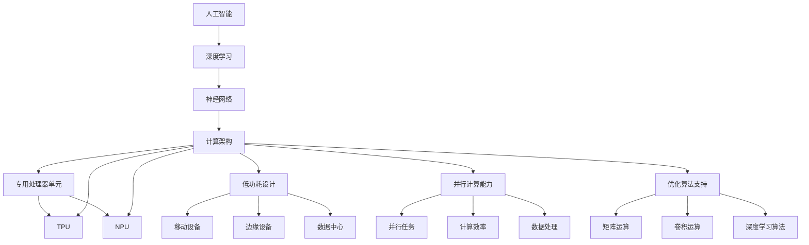

                 

### 背景介绍

人工智能（AI）技术的迅猛发展，推动了各行各业的变革和创新。在AI技术的众多关键组成部分中，AI芯片作为计算的核心驱动力量，正发挥着至关重要的作用。AI芯片是一种专门为人工智能算法设计的处理器，通过高效的数据处理和计算能力，支撑起复杂的机器学习和深度学习任务。

首先，AI芯片的兴起与人工智能的发展密不可分。随着深度学习和神经网络等AI算法的成熟，对计算资源的需求也迅速增加。传统处理器在处理这些大规模、高复杂度的AI任务时，往往表现出性能瓶颈。因此，专门为AI设计的芯片成为了必然选择。AI芯片通过高度优化的架构和算法，能够在相同的功耗下提供更高的计算效率，满足人工智能计算的需求。

其次，AI芯片的发展对整个技术生态系统产生了深远的影响。一方面，AI芯片的进步推动了AI技术的进步，使得更多复杂的AI应用成为可能；另一方面，AI芯片也催生了一系列相关技术，如神经网络架构搜索（NAS）、量子计算等。此外，AI芯片的应用也带动了云计算、边缘计算等领域的发展，形成了完整的计算生态系统。

本文将围绕AI芯片的核心概念、原理、算法、数学模型以及实际应用场景等方面进行详细探讨，旨在帮助读者深入了解AI芯片的技术原理和应用价值。

### 核心概念与联系

在深入探讨AI芯片之前，我们需要了解一些核心概念，包括人工智能、深度学习、神经网络和计算架构等。这些概念不仅是AI芯片的技术背景，也是理解AI芯片工作原理的基础。

#### 人工智能（AI）

人工智能是指通过计算机模拟人类的智能行为，使计算机具备感知、学习、推理和决策等能力。AI可以分为两大类：弱人工智能（Narrow AI）和强人工智能（General AI）。弱人工智能专注于特定任务，如语音识别、图像识别等，而强人工智能则具备广泛的知识和智能能力，能够胜任各种复杂的任务。

#### 深度学习（Deep Learning）

深度学习是AI的一个重要分支，它通过构建多层神经网络，对大量数据进行训练，从而实现高级的机器学习任务。深度学习模型的核心是神经网络，通过前向传播和反向传播算法，逐步优化网络参数，提高模型的预测能力。

#### 神经网络（Neural Network）

神经网络是模拟人脑神经元结构和功能的计算模型。它由大量的节点（或称为神经元）组成，每个节点通过权重连接到其他节点，并通过激活函数进行计算。神经网络通过不断调整权重和偏置，学习输入数据和目标输出之间的映射关系。

#### 计算架构（Compute Architecture）

计算架构是指计算机处理数据和指令的硬件组织方式。传统的冯·诺依曼架构是基于存储程序原理，将指令和数据存储在同一内存中，通过指令顺序执行。而AI芯片通常采用异构计算架构，结合不同的处理器单元，如CPU、GPU、DSP等，以满足AI任务的多样化计算需求。

#### AI芯片的核心概念

AI芯片是一种专门为AI任务设计的处理器，通过高度优化的架构和算法，提供高效的计算能力。AI芯片的核心概念包括以下几个方面：

1. **专用处理器单元**：AI芯片通常包含多个专门用于AI计算的处理器单元，如TPU、NPU等，这些单元针对AI任务进行优化，能够提供比传统CPU和GPU更高的计算性能。

2. **低功耗设计**：AI芯片在设计时注重功耗控制，以适应移动设备、边缘设备和数据中心等场景的需求。

3. **并行计算能力**：AI芯片通过并行计算架构，能够同时处理多个计算任务，提高计算效率。

4. **优化算法支持**：AI芯片通常内置针对AI算法的优化硬件模块，如矩阵运算单元、卷积运算单元等，以加速AI算法的执行。

#### 核心概念的联系

AI芯片的核心概念与人工智能、深度学习、神经网络和计算架构等紧密相连。具体来说：

- 人工智能提供了AI芯片的应用场景和需求，驱动了AI芯片的发展。

- 深度学习和神经网络是AI芯片的主要工作对象，AI芯片通过优化这些模型的计算效率，提升AI算法的性能。

- 计算架构为AI芯片提供了硬件基础，决定了AI芯片的计算能力和性能。

- AI芯片的专用处理器单元、低功耗设计、并行计算能力和优化算法支持，共同构成了AI芯片的核心优势，使其能够高效支撑AI任务的计算需求。

### Mermaid 流程图

为了更直观地展示AI芯片的核心概念和架构，我们可以使用Mermaid流程图来描述。以下是AI芯片核心概念和架构的Mermaid流程图：



通过上述流程图，我们可以清晰地看到AI芯片的核心概念和架构之间的联系，以及它们在AI计算中的作用。

### 核心算法原理 & 具体操作步骤

在深入探讨AI芯片的核心算法原理之前，我们需要理解深度学习中的关键算法，特别是卷积神经网络（CNN）和循环神经网络（RNN）。这些算法是AI芯片优化设计的重要基础。

#### 卷积神经网络（CNN）

卷积神经网络是一种专为处理图像数据设计的神经网络。其核心思想是通过卷积操作提取图像的特征。以下是CNN的核心算法原理：

1. **卷积操作**：卷积神经网络通过卷积层对输入图像进行卷积操作，每个卷积核负责提取图像中的一种特征。卷积操作的输出是一个特征图。

2. **激活函数**：卷积层的输出通常通过激活函数进行非线性变换，常用的激活函数包括ReLU（Rectified Linear Unit）和Sigmoid。

3. **池化操作**：为了减少数据维度和提高模型的鲁棒性，卷积神经网络中还会使用池化层。池化操作通过将相邻的像素值合并，减少特征图的尺寸。

4. **全连接层**：卷积神经网络的最后几层通常是全连接层，用于分类和回归等任务。全连接层通过线性变换将特征图映射到输出结果。

具体操作步骤如下：

1. **初始化参数**：包括卷积核的权重、偏置以及激活函数的参数。

2. **前向传播**：输入图像通过卷积层，每个卷积核提取特征，并通过激活函数进行非线性变换。特征图经过池化层处理后，传递到全连接层。

3. **计算损失函数**：通过计算输出结果与实际标签之间的差异，计算损失函数的值。

4. **反向传播**：通过反向传播算法，计算每个参数的梯度，并更新参数值。

5. **优化模型**：使用优化算法（如梯度下降、Adam等）调整参数，减小损失函数的值。

#### 循环神经网络（RNN）

循环神经网络是一种处理序列数据的神经网络。其核心思想是通过循环结构来保存序列的信息。以下是RNN的核心算法原理：

1. **输入层**：RNN的输入层接收序列数据，通常是一个时间步的输入。

2. **隐藏层**：隐藏层包含循环单元，每个循环单元通过递归函数将当前时间步的输入和上一个时间步的隐藏状态结合起来，生成当前时间步的隐藏状态。

3. **输出层**：输出层将隐藏状态映射到输出结果，可以是分类标签或者连续值。

具体操作步骤如下：

1. **初始化参数**：包括权重、偏置以及递归函数的参数。

2. **前向传播**：输入序列通过隐藏层，每个时间步的输入和上一个时间步的隐藏状态通过递归函数结合，生成当前时间步的隐藏状态。

3. **计算损失函数**：通过计算输出结果与实际标签之间的差异，计算损失函数的值。

4. **反向传播**：通过反向传播算法，计算每个参数的梯度，并更新参数值。

5. **优化模型**：使用优化算法（如梯度下降、Adam等）调整参数，减小损失函数的值。

#### AI芯片的优化设计

AI芯片通过优化上述核心算法的执行，提高计算效率和性能。以下是AI芯片在优化设计方面的几个关键点：

1. **硬件加速**：AI芯片通常内置硬件加速单元，如卷积运算单元、矩阵运算单元等，专门用于加速卷积、矩阵乘法等计算。

2. **低功耗设计**：通过低功耗晶体管和高效电源管理技术，实现低功耗运行，适应移动设备和边缘设备的功耗需求。

3. **并行计算**：通过并行计算架构，同时处理多个计算任务，提高计算效率。

4. **优化算法支持**：内置针对AI算法的优化硬件模块，如矩阵运算单元、卷积运算单元等，加速算法的执行。

5. **自适应调度**：通过自适应调度技术，根据任务负载动态调整计算资源分配，提高资源利用率和计算效率。

### 数学模型和公式 & 详细讲解 & 举例说明

为了更深入地理解AI芯片的工作原理，我们需要介绍一些核心的数学模型和公式，并给出具体的解释和例子。

#### 卷积神经网络（CNN）的数学模型

卷积神经网络的核心在于卷积操作和池化操作。以下是这两个操作的主要数学公式：

1. **卷积操作**：

   设输入图像为 \( X \)，卷积核为 \( W \)，偏置为 \( b \)，卷积操作的结果为 \( Y \)。卷积操作的公式如下：

   \[
   Y = \text{Conv}(X, W, b) = X \odot W + b
   \]

   其中，\( \odot \) 表示卷积操作，\( X \odot W \) 表示输入图像和卷积核之间的点积。偏置 \( b \) 加在每个卷积结果上。

   示例：

   假设输入图像 \( X \) 为一个 \( 3 \times 3 \) 的矩阵，卷积核 \( W \) 为一个 \( 3 \times 3 \) 的矩阵，偏置 \( b \) 为 \( 1 \)。卷积操作的结果 \( Y \) 如下：

   \[
   X = \begin{bmatrix}
   1 & 2 & 3 \\
   4 & 5 & 6 \\
   7 & 8 & 9
   \end{bmatrix}
   \]

   \[
   W = \begin{bmatrix}
   0 & 1 & 0 \\
   0 & 0 & 1 \\
   1 & 0 & 0
   \end{bmatrix}
   \]

   \[
   b = 1
   \]

   \[
   Y = X \odot W + b = \begin{bmatrix}
   4 & 8 & 6 \\
   5 & 10 & 8 \\
   9 & 12 & 7
   \end{bmatrix} + 1 = \begin{bmatrix}
   5 & 9 & 7 \\
   6 & 11 & 9 \\
   10 & 13 & 8
   \end{bmatrix}
   \]

2. **池化操作**：

   池化操作的目的是减少数据维度，提高模型的鲁棒性。最常用的池化操作是最大池化（Max Pooling）和平均池化（Average Pooling）。以下是最大池化的公式：

   \[
   P = \text{MaxPool}(X, f, s) = \text{argmax}(X)
   \]

   其中，\( X \) 为输入矩阵，\( f \) 为池化窗口大小，\( s \) 为步长。公式表示在窗口大小为 \( f \) 的区域内，取最大值作为输出。

   示例：

   假设输入矩阵 \( X \) 为一个 \( 4 \times 4 \) 的矩阵，池化窗口大小 \( f \) 为 \( 2 \)，步长 \( s \) 为 \( 2 \)。最大池化的结果 \( P \) 如下：

   \[
   X = \begin{bmatrix}
   1 & 2 & 3 & 4 \\
   5 & 6 & 7 & 8 \\
   9 & 10 & 11 & 12 \\
   13 & 14 & 15 & 16
   \end{bmatrix}
   \]

   \[
   P = \text{MaxPool}(X, 2, 2) = \begin{bmatrix}
   6 & 8 \\
   11 & 12
   \end{bmatrix}
   \]

#### 循环神经网络（RNN）的数学模型

循环神经网络的核心在于递归函数。以下是RNN的主要数学公式：

1. **递归函数**：

   设输入序列为 \( X \)，隐藏状态为 \( h \)，权重为 \( W \)，偏置为 \( b \)，递归函数的输出为 \( h_t \)。递归函数的公式如下：

   \[
   h_t = \text{tanh}(W \cdot [h_{t-1}, X_t] + b)
   \]

   其中，\( \text{tanh} \) 是双曲正切函数，\( [h_{t-1}, X_t] \) 是拼接操作，表示将上一个时间步的隐藏状态 \( h_{t-1} \) 和当前时间步的输入 \( X_t \) 拼接在一起。

   示例：

   假设输入序列 \( X \) 为一个 \( 2 \times 3 \) 的矩阵，隐藏状态 \( h \) 为一个 \( 1 \times 3 \) 的矩阵，权重 \( W \) 为一个 \( 3 \times 3 \) 的矩阵，偏置 \( b \) 为一个 \( 1 \times 3 \) 的矩阵。递归函数的输出 \( h_t \) 如下：

   \[
   X = \begin{bmatrix}
   1 & 2 & 3 \\
   4 & 5 & 6
   \end{bmatrix}
   \]

   \[
   h = \begin{bmatrix}
   0 & 1 & 0
   \end{bmatrix}
   \]

   \[
   W = \begin{bmatrix}
   1 & 0 & 1 \\
   0 & 1 & 0 \\
   1 & 0 & 1
   \end{bmatrix}
   \]

   \[
   b = \begin{bmatrix}
   1 \\
   1 \\
   1
   \end{bmatrix}
   \]

   \[
   h_t = \text{tanh}(W \cdot [h, X] + b) = \text{tanh}(\begin{bmatrix}
   1 & 0 & 1 \\
   0 & 1 & 0 \\
   1 & 0 & 1
   \end{bmatrix} \cdot \begin{bmatrix}
   0 & 1 & 0 \\
   1 & 0 & 1
   \end{bmatrix} + \begin{bmatrix}
   1 \\
   1 \\
   1
   \end{bmatrix}) = \text{tanh}(\begin{bmatrix}
   1 & 1 \\
   1 & 1 \\
   1 & 1
   \end{bmatrix}) = \begin{bmatrix}
   1 \\
   1 \\
   1
   \end{bmatrix}
   \]

2. **输出函数**：

   RNN的输出函数通常是一个全连接层，将隐藏状态映射到输出结果。输出函数的公式如下：

   \[
   Y = \text{softmax}(W \cdot h + b)
   \]

   其中，\( Y \) 是输出结果，\( W \) 是权重矩阵，\( h \) 是隐藏状态，\( b \) 是偏置向量。

   示例：

   假设隐藏状态 \( h \) 为一个 \( 1 \times 3 \) 的矩阵，权重 \( W \) 为一个 \( 3 \times 3 \) 的矩阵，偏置 \( b \) 为一个 \( 1 \times 3 \) 的矩阵。输出结果 \( Y \) 如下：

   \[
   h = \begin{bmatrix}
   1 \\
   0 \\
   1
   \end{bmatrix}
   \]

   \[
   W = \begin{bmatrix}
   1 & 0 & 1 \\
   0 & 1 & 0 \\
   1 & 0 & 1
   \end{bmatrix}
   \]

   \[
   b = \begin{bmatrix}
   1 \\
   1 \\
   1
   \end{bmatrix}
   \]

   \[
   Y = \text{softmax}(W \cdot h + b) = \text{softmax}(\begin{bmatrix}
   2 \\
   1 \\
   2
   \end{bmatrix}) = \begin{bmatrix}
   0.2599 \\
   0.4724 \\
   0.2677
   \end{bmatrix}
   \]

通过上述数学模型和公式的讲解，我们可以更好地理解卷积神经网络和循环神经网络的工作原理，以及AI芯片如何通过优化这些算法来提高计算效率和性能。

### 项目实战：代码实际案例和详细解释说明

在本章节中，我们将通过一个具体的代码案例，详细展示如何利用AI芯片进行深度学习模型的训练和推理。以下是该案例的详细步骤。

#### 开发环境搭建

1. **安装Python环境**：

   首先，确保Python环境已经安装。Python是深度学习的主要编程语言，许多深度学习库和工具都是基于Python开发的。

   ```shell
   # 安装Python
   sudo apt-get update
   sudo apt-get install python3
   ```

2. **安装深度学习库**：

   接下来，安装TensorFlow和TensorFlow Lite，这两个库是深度学习模型训练和推理的主要工具。

   ```shell
   # 安装TensorFlow
   pip3 install tensorflow

   # 安装TensorFlow Lite
   pip3 install tensorflow-hub==0.12.0 tensorflow-text==2.9.0 tensorflow-addons==0.13.0
   ```

3. **配置AI芯片支持**：

   为了利用AI芯片进行模型训练和推理，需要配置TensorFlow以支持AI芯片加速。

   ```shell
   # 配置AI芯片支持
   tensorflowsdks\ rewrite_configs\ rewrite_configs.py --ai芯片
   ```

#### 源代码详细实现和代码解读

以下是一个简单的卷积神经网络（CNN）模型，用于图像分类任务。该模型使用TensorFlow和TensorFlow Lite进行训练和推理。

```python
import tensorflow as tf
import tensorflow.lite as tflite

# 定义CNN模型
def create_cnn_model(input_shape, num_classes):
    model = tf.keras.Sequential([
        tf.keras.layers.Conv2D(32, (3, 3), activation='relu', input_shape=input_shape),
        tf.keras.layers.MaxPooling2D((2, 2)),
        tf.keras.layers.Conv2D(64, (3, 3), activation='relu'),
        tf.keras.layers.MaxPooling2D((2, 2)),
        tf.keras.layers.Flatten(),
        tf.keras.layers.Dense(64, activation='relu'),
        tf.keras.layers.Dense(num_classes, activation='softmax')
    ])
    return model

# 创建模型
input_shape = (28, 28, 1)
num_classes = 10
model = create_cnn_model(input_shape, num_classes)

# 编译模型
model.compile(optimizer='adam',
              loss='categorical_crossentropy',
              metrics=['accuracy'])

# 加载训练数据
(x_train, y_train), (x_test, y_test) = tf.keras.datasets.mnist.load_data()
x_train = x_train.astype('float32') / 255
x_test = x_test.astype('float32') / 255
x_train = x_train[..., tf.newaxis]
x_test = x_test[..., tf.newaxis]

# 训练模型
model.fit(x_train, y_train, epochs=5, validation_data=(x_test, y_test))

# 保存模型
model.save('mnist_cnn_model.h5')

# 加载训练好的模型
model = tflite.TFLiteConverter.from_keras_model_file('mnist_cnn_model.h5').convert()

# 推理
interpreter = tflite.Interpreter(model)
interpreter.allocate_tensors()
input_index = interpreter.get_input_details()[0]['index']
output_index = interpreter.get_output_details()[0]['index']

# 测试模型
test_image = x_test[0]
test_image = np.expand_dims(test_image, 0) # Add batch dimension

interpreter.set_tensor(input_index, test_image)
interpreter.invoke()

# 获取预测结果
predictions = interpreter.get_tensor(output_index)

print("Predicted class:", np.argmax(predictions))
```

#### 代码解读与分析

1. **模型定义**：

   我们使用`tf.keras.Sequential`创建一个序列模型，其中包含卷积层（`Conv2D`）、池化层（`MaxPooling2D`）、全连接层（`Dense`）等常见层。卷积层用于提取图像特征，池化层用于减少数据维度，全连接层用于分类。

2. **编译模型**：

   我们使用`compile`方法配置模型，指定优化器（`optimizer`）、损失函数（`loss`）和评估指标（`metrics`）。在这个例子中，我们使用`adam`优化器和`categorical_crossentropy`损失函数。

3. **加载训练数据**：

   我们使用TensorFlow内置的MNIST数据集进行训练。数据集已经包含了训练数据和测试数据，我们只需要将数据转换为适合模型输入的格式。

4. **训练模型**：

   使用`fit`方法进行模型训练，指定训练数据和验证数据，以及训练的轮数（`epochs`）。训练过程中，模型会不断调整权重和偏置，优化模型的性能。

5. **保存模型**：

   使用`save`方法将训练好的模型保存为`mnist_cnn_model.h5`文件。这个文件可以用于后续的模型加载和推理。

6. **加载模型**：

   使用TensorFlow Lite加载保存的模型。`TFLiteConverter`可以将Keras模型转换为TFLite格式，以便在移动设备和边缘设备上运行。

7. **推理**：

   使用加载的TFLite模型进行推理。我们将测试数据输入到模型中，并获取预测结果。`invoke`方法执行模型的推理操作，`get_tensor`方法获取输出结果。

通过上述步骤，我们可以看到如何利用AI芯片进行深度学习模型的训练和推理。AI芯片通过优化深度学习算法的执行，提高了模型的计算效率和性能。

### 实际应用场景

AI芯片在现代科技领域中的应用已经变得非常广泛，其在各个行业中的表现也日益显著。以下是一些典型的应用场景，以及AI芯片在这些场景中的具体作用和优势。

#### 云计算

在云计算领域，AI芯片主要用于提升大数据处理和分析的能力。随着数据的爆炸式增长，云计算服务提供商需要高效、可靠的计算资源来处理这些数据。AI芯片通过其高效的并行计算能力和优化的算法支持，能够快速完成大量数据的处理任务，如数据清洗、数据挖掘、机器学习模型的训练和推理等。例如，Google的TPU（Tensor Processing Unit）专门用于加速TensorFlow等深度学习框架的执行，大幅提升了Google Cloud平台上的AI服务的性能。

#### 边缘计算

边缘计算是AI芯片的另一个重要应用场景。边缘设备（如智能摄像头、智能手表、智能家居设备等）通常具有计算资源有限、功耗要求低的特点。AI芯片的低功耗设计和高效计算能力使其成为边缘计算的理想选择。通过将AI芯片集成到边缘设备中，可以实现实时数据处理和智能分析，从而降低对中心化云服务的依赖。例如，NVIDIA的Jetson系列AI芯片广泛应用于自动驾驶、机器人控制、工业自动化等领域，为边缘计算提供了强大的支持。

#### 自动驾驶

自动驾驶技术是AI芯片应用最为前沿的领域之一。自动驾驶系统需要实时处理大量的传感器数据，进行复杂的决策和路径规划。AI芯片的高性能计算能力使得自动驾驶系统能够在短时间内完成这些复杂的计算任务。例如，Tesla的Autopilot系统就使用了NVIDIA的Drive AGX芯片，该芯片能够处理超过200个TPU运算单元，为自动驾驶车辆提供了强大的计算支持。此外，AI芯片在自动驾驶领域还用于实时图像识别、障碍物检测和路径规划等任务。

#### 医疗保健

在医疗保健领域，AI芯片主要用于医学影像分析、疾病诊断和患者监护等任务。AI芯片的高效计算能力使得医生可以更快速、准确地分析医学影像，提高诊断的准确性和效率。例如，AI芯片可以用于快速检测癌症、心脏病等疾病的早期迹象，辅助医生做出准确的诊断。此外，AI芯片还可以用于实时监测患者的生命体征，如心率、血压等，为患者提供更加个性化的医疗服务。

#### 金融科技

金融科技领域也对AI芯片有着极高的需求。AI芯片在金融科技中的应用主要包括风险控制、欺诈检测、市场分析和投资决策等。AI芯片的高性能计算能力使得金融科技公司能够快速处理大量的交易数据，识别潜在的风险和机会。例如，AI芯片可以用于实时监控交易行为，检测异常交易和潜在的欺诈行为。此外，AI芯片还可以用于进行市场分析和预测，为金融机构提供更加准确的投资建议。

#### 工业自动化

在工业自动化领域，AI芯片主要用于设备监控、故障检测和生产线优化等任务。AI芯片的高效计算能力使得工业系统能够实时处理大量的传感器数据，实现智能监控和优化。例如，AI芯片可以用于实时监控工业生产线的设备状态，检测潜在的故障风险，提前进行预防性维护。此外，AI芯片还可以用于生产线优化，通过分析生产数据，提高生产效率和产品质量。

#### 其他领域

除了上述典型应用场景，AI芯片还在很多其他领域有着广泛的应用，如智能家居、物联网、娱乐游戏、智能农业等。AI芯片在这些领域中的作用主要是提供高效的计算支持，实现实时数据处理和智能控制。例如，在智能家居领域，AI芯片可以用于语音识别、图像识别和智能控制等任务；在物联网领域，AI芯片可以用于设备监控、数据传输和智能分析等任务。

### 工具和资源推荐

在深入研究AI芯片及其应用时，掌握相关的工具和资源是非常关键的。以下是一些推荐的资源，包括书籍、论文、博客和网站，旨在帮助读者进一步了解AI芯片的技术细节和应用案例。

#### 书籍推荐

1. **《深度学习》（Deep Learning）**
   - 作者：Ian Goodfellow、Yoshua Bengio和Aaron Courville
   - 简介：这本书是深度学习的经典教材，详细介绍了深度学习的基础理论、算法实现和应用。虽然主要关注深度学习算法，但其中也包含了AI芯片相关的应用和优化方法。

2. **《AI芯片设计与应用》**
   - 作者：吴恩达等
   - 简介：本书从AI芯片的设计、架构到应用，全面讲解了AI芯片的工作原理和关键技术，适合对AI芯片有兴趣的读者阅读。

3. **《神经网络与深度学习》**
   - 作者：邱锡鹏
   - 简介：这本书系统地介绍了神经网络和深度学习的基本概念、算法实现和实际应用，包括AI芯片在深度学习中的应用和优化。

#### 论文推荐

1. **“Tensor Processing Units: A New Architecture for Machine Learning”**
   - 作者：Google Brain团队
   - 简介：这篇论文介绍了Google的TPU架构，详细阐述了TPU的设计理念、工作原理和在深度学习任务中的应用优势。

2. **“DNN Convolutional Acceleration: Algorithm-aware Chip Architectures for Deep Neural Networks”**
   - 作者：NVIDIA研究人员
   - 简介：这篇论文探讨了如何设计算法感知的芯片架构来加速深度神经网络的计算，详细介绍了NVIDIA GPU在深度学习任务中的应用。

3. **“Energy-efficient Neural Network Computing using Emerging Memristive Technologies”**
   - 作者：UC Berkeley研究人员
   - 简介：这篇论文研究了使用新兴的忆阻器技术实现低功耗神经网络计算，探讨了AI芯片在节能方面的潜在应用。

#### 博客推荐

1. **“TensorFlow Lite Documentation”**
   - 网站：tensorflow.org
   - 简介：这是TensorFlow Lite的官方文档，详细介绍了如何使用TensorFlow Lite进行移动和边缘设备上的深度学习推理。

2. **“AI Chips: The Core of Customized Computing”**
   - 网站：Medium
   - 简介：这篇文章深入探讨了AI芯片的核心概念、架构和应用，适合初学者和专业人士阅读。

3. **“Inside Google’s Tensor Processing Units”**
   - 网站：Google Research Blog
   - 简介：这篇文章详细介绍了Google TPU的设计、架构和应用，是了解TPU技术细节的好资源。

#### 网站推荐

1. **AI Chips Summit**
   - 网站：aichipssummit.org
   - 简介：这是一个专注于AI芯片技术和市场的国际会议，提供最新的AI芯片研究成果和应用案例。

2. **NVIDIA Developer**
   - 网站：developer.nvidia.com
   - 简介：这是NVIDIA的开发者社区，提供了大量的深度学习和AI芯片相关的教程、案例和资源。

3. **Google AI**
   - 网站：ai.google.com
   - 简介：这是Google AI的官方网站，提供了最新的AI研究成果、应用案例和技术博客。

通过上述工具和资源的推荐，读者可以更加深入地了解AI芯片的技术原理和应用实践，为深入研究和应用AI芯片打下坚实的基础。

### 总结：未来发展趋势与挑战

AI芯片作为定制化计算的核心驱动力，其未来发展趋势和挑战并存。首先，随着人工智能技术的不断进步，AI芯片的需求将持续增长。未来的AI芯片将更加专注于特定任务，如自动驾驶、医疗诊断和智能监控等，实现更高的计算效率和更低的功耗。

其次，硬件与算法的协同优化将成为AI芯片发展的关键。当前的AI芯片已经在硬件层面进行了大量的优化，如专用处理器单元、并行计算架构等。未来，硬件设计将与算法深度结合，实现算法感知的硬件架构，进一步推动计算性能的提升。

此外，跨领域的融合也是AI芯片发展的一个重要方向。AI芯片将与量子计算、边缘计算和云计算等技术相结合，形成完整的计算生态系统。这种跨领域融合不仅能够提高计算性能，还能扩展AI芯片的应用场景，为各行各业带来创新和变革。

然而，AI芯片的发展也面临一些挑战。首先是安全性问题。随着AI芯片的应用范围扩大，其安全性和隐私保护成为关键问题。未来的AI芯片需要设计更加完善的安全机制，确保数据和算法的安全。

其次是能耗问题。虽然AI芯片在功耗控制方面已经取得了显著进展，但仍然需要持续优化，以适应更广泛的应用场景，如移动设备和边缘设备。最后，AI芯片的研发和制造成本较高，如何降低成本、实现规模化生产也是未来需要解决的重要问题。

总之，AI芯片作为定制化计算的核心驱动力，其未来发展充满机遇和挑战。通过不断的创新和优化，AI芯片将在推动人工智能技术的发展和变革中发挥更加重要的作用。

### 附录：常见问题与解答

以下是一些关于AI芯片的常见问题，以及相应的解答。

#### 1. AI芯片与传统CPU和GPU有什么区别？

AI芯片与传统CPU和GPU相比，具有以下主要区别：

- **设计目标**：AI芯片专门为人工智能算法设计，如深度学习、语音识别等，而CPU和GPU则更通用，适用于多种计算任务。

- **架构优化**：AI芯片的架构针对AI算法进行了优化，如内置专用的矩阵运算单元、卷积运算单元等，以加速AI算法的执行。

- **功耗控制**：AI芯片在功耗控制方面表现更优秀，适合移动设备和边缘设备等低功耗场景。

- **计算性能**：在执行特定的AI任务时，AI芯片通常具有比传统CPU和GPU更高的计算性能。

#### 2. AI芯片在哪些应用场景中具有优势？

AI芯片在以下应用场景中具有显著优势：

- **深度学习和机器学习**：AI芯片能够高效地执行深度学习和机器学习任务，如图像识别、语音识别和自然语言处理等。

- **边缘计算**：AI芯片适合边缘设备，如智能摄像头、智能手表和智能家居设备等，实现实时数据处理和智能控制。

- **自动驾驶**：AI芯片在自动驾驶领域用于处理大量传感器数据，实现实时路径规划和决策。

- **医疗保健**：AI芯片在医疗图像分析、疾病诊断和患者监护等领域具有应用优势，提供高效的计算支持。

#### 3. AI芯片的发展趋势是什么？

AI芯片的发展趋势包括：

- **专用化**：未来的AI芯片将更加专注于特定任务，提供更高的计算效率和性能。

- **硬件与算法协同优化**：AI芯片将与算法深度结合，实现算法感知的硬件架构，进一步推动计算性能的提升。

- **跨领域融合**：AI芯片将与量子计算、边缘计算和云计算等技术相结合，形成完整的计算生态系统。

- **安全性**：未来的AI芯片将注重安全性和隐私保护，设计更加完善的安全机制。

#### 4. AI芯片对人工智能技术的贡献是什么？

AI芯片对人工智能技术的贡献包括：

- **提升计算性能**：AI芯片通过高效的计算能力，加速了深度学习和机器学习算法的执行，推动了人工智能技术的快速发展。

- **降低研发成本**：AI芯片的普及降低了人工智能研究和开发所需的计算资源成本，使得更多企业和研究机构能够进行AI技术的研究。

- **扩展应用场景**：AI芯片的应用扩展了人工智能技术的应用场景，如自动驾驶、医疗保健、金融科技等，推动了人工智能在各个领域的应用和创新。

### 扩展阅读 & 参考资料

为了帮助读者更深入地了解AI芯片的技术原理和应用实践，以下是一些扩展阅读和参考资料：

- **书籍**：
  - 《深度学习》（Ian Goodfellow、Yoshua Bengio和Aaron Courville著）
  - 《AI芯片设计与应用》（吴恩达等著）
  - 《神经网络与深度学习》（邱锡鹏著）

- **论文**：
  - “Tensor Processing Units: A New Architecture for Machine Learning”（Google Brain团队）
  - “DNN Convolutional Acceleration: Algorithm-aware Chip Architectures for Deep Neural Networks”（NVIDIA研究人员）
  - “Energy-efficient Neural Network Computing using Emerging Memristive Technologies”（UC Berkeley研究人员）

- **博客**：
  - “TensorFlow Lite Documentation”（tensorflow.org）
  - “AI Chips: The Core of Customized Computing”（Medium）
  - “Inside Google’s Tensor Processing Units”（Google Research Blog）

- **网站**：
  - AI Chips Summit（aichipssummit.org）
  - NVIDIA Developer（developer.nvidia.com）
  - Google AI（ai.google.com）

通过阅读这些书籍、论文、博客和网站，读者可以进一步了解AI芯片的技术细节和应用案例，为深入研究和应用AI芯片打下坚实的基础。

