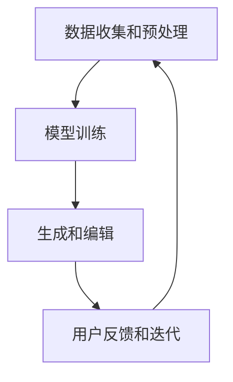

                 

# AI 辅助创作：激发人类创造力

## 关键词：人工智能，创作，创造力，算法，数学模型，实践案例，未来趋势

## 摘要：

本文深入探讨了人工智能（AI）在辅助人类创作领域的作用，以及如何激发人类的创造力。首先，我们回顾了人工智能的历史和发展，探讨了其如何从被动工具转变为能够主动辅助人类思考和创作的智能体。接着，我们详细介绍了AI辅助创作的主要技术手段，包括生成对抗网络（GAN）、变分自编码器（VAE）和自然语言处理（NLP）等。随后，通过数学模型和具体案例，展示了这些技术在实际应用中的效果。文章还讨论了AI辅助创作在各个领域的应用场景，并推荐了一些相关的学习资源和开发工具。最后，我们展望了AI辅助创作未来的发展趋势和面临的挑战。

## 1. 背景介绍

### 1.1 人工智能的发展历程

人工智能（AI）是一门融合了计算机科学、数学、神经科学和认知科学等多个学科的研究领域。自1956年达特茅斯会议首次提出人工智能概念以来，AI经历了多个发展阶段。

- **早期探索阶段（1956-1969）**：这一阶段主要是理论探索和算法研究，包括符号逻辑、搜索算法和知识表示等。代表性的工作包括艾尔瑟克机器人项目和普罗布罗姆海洋探测器。

- **繁荣时期（1970-1980）**：随着计算机硬件的发展，人工智能研究进入了一个相对繁荣的时期。专家系统和推理机成为了这一阶段的主要成果。例如，费舍尔-鲍尔公司开发的Dendral系统，能够在化学领域中自动推理和提出假设。

- **衰退时期（1980-1990）**：由于实际应用中的一些挑战，人工智能研究受到了质疑，进入了所谓的“AI冬天”。然而，这一阶段也催生了一些重要理论，如机器学习和神经网络。

- **复兴与商业化阶段（1990至今）**：随着互联网的普及和大数据技术的发展，人工智能迎来了新的春天。深度学习和强化学习成为了当前AI研究的核心，应用领域包括计算机视觉、自然语言处理和智能机器人等。

### 1.2 人工智能在创作领域的应用

随着人工智能技术的不断发展，AI开始越来越多地应用于创作领域。从早期的文字生成，到图像、音乐和视频的创作，AI展示了其在激发人类创造力方面的巨大潜力。

- **文字创作**：AI可以生成新闻文章、故事和诗歌。例如，OpenAI的GPT-3模型可以生成高质量的文本，甚至模拟人类写作风格。

- **图像创作**：生成对抗网络（GAN）和变分自编码器（VAE）等技术可以生成高质量的图像。例如，DeepDream可以生成令人惊叹的艺术作品。

- **音乐创作**：AI可以生成旋律、和弦和完整的音乐作品。例如，Google的Magenta项目展示了AI在音乐创作方面的潜力。

- **视频创作**：AI可以通过视频生成和编辑技术，自动生成视频内容，甚至模拟人类的表演和表情。

## 2. 核心概念与联系

### 2.1 人工智能辅助创作的主要技术

人工智能辅助创作主要依赖于以下几种技术：

- **生成对抗网络（GAN）**：GAN由生成器和判别器组成，通过两者之间的对抗训练，生成高质量的图像和音频。

- **变分自编码器（VAE）**：VAE通过编码和解码器，学习数据的高效表示，并在解码过程中生成新的数据。

- **自然语言处理（NLP）**：NLP技术可以理解和生成自然语言文本，广泛应用于文字创作和翻译。

### 2.2 人工智能辅助创作的工作流程

人工智能辅助创作的工作流程通常包括以下几个步骤：

1. **数据收集和预处理**：收集相关的数据集，并进行清洗和预处理，以适应模型的训练。

2. **模型训练**：使用生成对抗网络、变分自编码器或自然语言处理模型，对数据进行训练，以学习数据的高效表示和生成策略。

3. **生成和编辑**：使用训练好的模型，生成新的数据，并根据用户需求进行编辑和优化。

4. **用户反馈和迭代**：根据用户反馈，不断优化模型，以提高生成质量和用户满意度。

### 2.3 人工智能辅助创作与人类创造力的关系

人工智能辅助创作并不是取代人类创造力，而是激发和扩展人类的创造力。通过提供新的工具和方法，AI可以帮助人类在创作过程中实现以下目标：

- **探索新的创作方向**：AI可以生成大量的数据，为人类提供新的灵感，帮助人类探索未知的创作领域。

- **提高创作效率**：AI可以自动执行一些繁琐的任务，如数据清洗、图像生成和文本翻译，从而提高人类的创作效率。

- **增强创新思维**：AI可以模拟人类的思维过程，帮助人类发现新的联系和解决方案，从而增强创新思维。

### 2.4 Mermaid 流程图

以下是人工智能辅助创作的工作流程的Mermaid流程图：



## 3. 核心算法原理 & 具体操作步骤

### 3.1 生成对抗网络（GAN）

生成对抗网络（GAN）由生成器和判别器组成。生成器的目标是生成与真实数据相似的数据，而判别器的目标是区分真实数据和生成数据。

- **生成器（Generator）**：生成器接收随机噪声作为输入，通过神经网络生成数据。

- **判别器（Discriminator）**：判别器接收真实数据和生成数据，通过神经网络判断数据是否为真实数据。

- **训练过程**：生成器和判别器交替训练。在每次迭代中，生成器尝试生成更真实的数据，而判别器尝试更好地区分真实数据和生成数据。

### 3.2 变分自编码器（VAE）

变分自编码器（VAE）由编码器和解码器组成。编码器将输入数据编码为一个压缩的表示，解码器则将这个表示解码回原始数据。

- **编码器（Encoder）**：编码器接收输入数据，通过神经网络将其编码为一个低维的潜在空间表示。

- **解码器（Decoder）**：解码器接收潜在空间表示，通过神经网络将其解码回原始数据。

- **训练过程**：VAE通过最大化数据在潜在空间中的分布来训练编码器和解码器。

### 3.3 自然语言处理（NLP）

自然语言处理（NLP）技术包括文本生成、文本分类、语义理解和机器翻译等。

- **文本生成**：文本生成模型如GPT-3，通过学习大量文本数据，生成新的文本。

- **文本分类**：文本分类模型如朴素贝叶斯、支持向量机和神经网络，通过学习文本特征，对文本进行分类。

- **语义理解**：语义理解模型如BERT和GPT，通过学习语言模型，理解文本的语义和上下文关系。

- **机器翻译**：机器翻译模型如Transformer和BERT，通过学习双语语料库，实现文本的自动翻译。

## 4. 数学模型和公式 & 详细讲解 & 举例说明

### 4.1 生成对抗网络（GAN）的数学模型

生成对抗网络（GAN）的数学模型主要包括生成器（G）和判别器（D）的损失函数。

- **生成器的损失函数**：生成器的目标是生成与真实数据相似的数据，因此其损失函数为：

  $$L_G = -\mathbb{E}_{z \sim p_z(z)}[\log(D(G(z)))]$$

  其中，$z$ 是从先验分布 $p_z(z)$ 中抽取的随机噪声，$G(z)$ 是生成器生成的数据，$D(G(z))$ 是判别器对生成数据的判断。

- **判别器的损失函数**：判别器的目标是区分真实数据和生成数据，因此其损失函数为：

  $$L_D = -\mathbb{E}_{x \sim p_x(x)}[\log(D(x))] - \mathbb{E}_{z \sim p_z(z)}[\log(1 - D(G(z)))]$$

  其中，$x$ 是从数据分布 $p_x(x)$ 中抽取的真实数据。

### 4.2 变分自编码器（VAE）的数学模型

变分自编码器（VAE）的数学模型主要包括编码器（E）和解码器（D）的损失函数。

- **编码器的损失函数**：编码器的目标是学习数据的高效表示，因此其损失函数为：

  $$L_E = D_q(z|x) - D_p(z|x)$$

  其中，$z$ 是编码器生成的潜在变量，$D_q(z|x)$ 是生成分布，$D_p(z|x)$ 是先验分布。

- **解码器的损失函数**：解码器的目标是重建输入数据，因此其损失函数为：

  $$L_D = \mathbb{E}_{x \sim p_x(x)}[\log(D(x|z))]$$

  其中，$D(x|z)$ 是解码器对输入数据的重建。

### 4.3 自然语言处理（NLP）的数学模型

自然语言处理（NLP）的数学模型主要包括文本生成、文本分类、语义理解和机器翻译的损失函数。

- **文本生成**：文本生成模型如GPT-3，其损失函数为：

  $$L_G = -\mathbb{E}_{x \sim p_x(x)}[\log(p_{\text{model}}(x))]$$

  其中，$x$ 是生成的文本，$p_{\text{model}}(x)$ 是模型对文本的生成概率。

- **文本分类**：文本分类模型如朴素贝叶斯、支持向量机和神经网络，其损失函数为：

  $$L_C = -\sum_{i=1}^{n}y_i\log(p(y_i|x))$$

  其中，$y_i$ 是第 $i$ 个类别的标签，$p(y_i|x)$ 是模型对文本属于第 $i$ 个类别的概率。

- **语义理解**：语义理解模型如BERT和GPT，其损失函数为：

  $$L_S = -\mathbb{E}_{x \sim p_x(x)}[\log(p(y|x))]$$

  其中，$y$ 是文本的语义标签，$p(y|x)$ 是模型对文本的语义概率。

- **机器翻译**：机器翻译模型如Transformer和BERT，其损失函数为：

  $$L_T = -\sum_{i=1}^{n}y_i\log(p(y_i|x))$$

  其中，$y_i$ 是生成的翻译文本，$p(y_i|x)$ 是模型对翻译文本的概率。

### 4.4 举例说明

以下是一个简单的生成对抗网络（GAN）的例子：

- **生成器**：生成器接收随机噪声 $z$，通过一个神经网络生成图像 $G(z)$。

- **判别器**：判别器接收图像 $x$ 和生成图像 $G(z)$，通过一个神经网络判断图像是否为真实图像。

- **训练过程**：交替训练生成器和判别器，直到生成器生成的图像质量接近真实图像。

假设生成器的损失函数为 $L_G$，判别器的损失函数为 $L_D$，训练迭代次数为 $T$，每次迭代生成 $N$ 个图像。

```python
import numpy as np
import tensorflow as tf

# 定义生成器和判别器的模型
G = tf.keras.Sequential([
    tf.keras.layers.Dense(128, activation='relu', input_shape=(100,)),
    tf.keras.layers.Dense(128, activation='relu'),
    tf.keras.layers.Dense(784, activation='sigmoid')
])

D = tf.keras.Sequential([
    tf.keras.layers.Dense(128, activation='relu', input_shape=(784,)),
    tf.keras.layers.Dense(128, activation='relu'),
    tf.keras.layers.Dense(1, activation='sigmoid')
])

# 定义损失函数
L_G = -tf.reduce_mean(tf.keras.backend.log(D(G(z))))
L_D = -tf.reduce_mean(tf.keras.backend.log(D(x)) - tf.keras.backend.log(1 - D(G(z))))

# 定义优化器
optimizer = tf.keras.optimizers.Adam(learning_rate=0.001)

# 训练模型
for t in range(T):
    for i in range(N):
        with tf.GradientTape() as g_tape, tf.GradientTape() as d_tape:
            z = np.random.normal(size=(100,))
            x = np.random.normal(size=(784,))
            g_loss = L_G(z)
            d_loss = L_D(x, G(z))
        
        grads_g = g_tape.gradient(g_loss, G.trainable_variables)
        grads_d = d_tape.gradient(d_loss, D.trainable_variables)
        
        optimizer.apply_gradients(zip(grads_g, G.trainable_variables))
        optimizer.apply_gradients(zip(grads_d, D.trainable_variables))
```

## 5. 项目实战：代码实际案例和详细解释说明

### 5.1 开发环境搭建

为了实现AI辅助创作，我们需要搭建一个合适的技术栈。以下是一个简单的开发环境搭建步骤：

- **Python**：Python是一种广泛使用的编程语言，具有丰富的AI库和框架。
- **TensorFlow**：TensorFlow是一个开源的机器学习框架，适用于构建和训练深度学习模型。
- **GAN库**：使用TensorFlow的官方GAN库，可以简化GAN模型的实现。

### 5.2 源代码详细实现和代码解读

以下是一个简单的GAN模型实现，用于生成手写数字图像。

```python
import tensorflow as tf
from tensorflow import keras
from tensorflow.keras import layers
import numpy as np

# 生成器的实现
def make_generator_model():
    model = keras.Sequential()
    model.add(layers.Dense(7*7*256, use_bias=False, input_shape=(100,)))
    model.add(layers.BatchNormalization())
    model.add(layers.LeakyReLU())
    model.add(layers.Reshape((7, 7, 256)))

    model.add(layers.Conv2DTranspose(128, (5, 5), strides=(1, 1), padding='same', use_bias=False))
    model.add(layers.BatchNormalization())
    model.add(layers.LeakyReLU())

    model.add(layers.Conv2DTranspose(64, (5, 5), strides=(2, 2), padding='same', use_bias=False))
    model.add(layers.BatchNormalization())
    model.add(layers.LeakyReLU())

    model.add(layers.Conv2DTranspose(1, (5, 5), strides=(2, 2), padding='same', use_bias=False, activation='tanh'))

    return model

# 判别器的实现
def make_discriminator_model():
    model = keras.Sequential()
    model.add(layers.Conv2D(64, (5, 5), strides=(2, 2), padding='same',
                                     input_shape=[28, 28, 1]))
    model.add(layers.LeakyReLU())
    model.add(layers.Dropout(0.3))

    model.add(layers.Conv2D(128, (5, 5), strides=(2, 2), padding='same'))
    model.add(layers.LeakyReLU())
    model.add(layers.Dropout(0.3))

    model.add(layers.Flatten())
    model.add(layers.Dense(1))

    return model

# 搭建模型
generator = make_generator_model()
discriminator = make_discriminator_model()

# 定义损失函数和优化器
cross_entropy = tf.keras.losses.BinaryCrossentropy(from_logits=True)

def discriminator_loss(real_output, fake_output):
    real_loss = cross_entropy(tf.ones_like(real_output), real_output)
    fake_loss = cross_entropy(tf.zeros_like(fake_output), fake_output)
    total_loss = real_loss + fake_loss
    return total_loss

def generator_loss(fake_output):
    return cross_entropy(tf.ones_like(fake_output), fake_output)

generator_optimizer = tf.keras.optimizers.Adam(1e-4)
discriminator_optimizer = tf.keras.optimizers.Adam(1e-4)

@tf.function
def train_step(images, noise):
    with tf.GradientTape() as gen_tape, tf.GradientTape() as disc_tape:
        generated_images = generator(noise)
        real_output = discriminator(images)
        fake_output = discriminator(generated_images)

        gen_loss = generator_loss(fake_output)
        disc_loss = discriminator_loss(real_output, fake_output)

    gradients_of_generator = gen_tape.gradient(gen_loss, generator.trainable_variables)
    gradients_of_discriminator = disc_tape.gradient(disc_loss, discriminator.trainable_variables)

    generator_optimizer.apply_gradients(zip(gradients_of_generator, generator.trainable_variables))
    discriminator_optimizer.apply_gradients(zip(gradients_of_discriminator, discriminator.trainable_variables))

# 训练模型
def train(dataset, epochs, noise_dim):
    for epoch in range(epochs):
        for image_batch in dataset:
            noise = tf.random.normal([image_batch.shape[0], noise_dim])

            train_step(image_batch, noise)

# 加载数据集
(train_images, train_labels), (test_images, test_labels) = keras.datasets.mnist.load_data()
train_images = train_images.reshape(train_images.shape[0], 28, 28, 1).astype('float32')
test_images = test_images.reshape(test_images.shape[0], 28, 28, 1).astype('float32')
train_images, test_images = train_images / 255.0, test_images / 255.0

# 开始训练
noise_dim = 100
batch_size = 64
train_dataset = tf.data.Dataset.from_tensor_slices(train_images).shuffle(10000).batch(batch_size)
train(2000, epochs, noise_dim)
```

### 5.3 代码解读与分析

上述代码实现了一个简单的GAN模型，用于生成手写数字图像。以下是代码的详细解读和分析：

- **生成器和判别器的定义**：生成器和判别器分别使用 `make_generator_model` 和 `make_discriminator_model` 函数定义。生成器使用 `Conv2DTranspose` 层进行上采样，生成手写数字图像。判别器使用 `Conv2D` 层进行下采样，用于区分真实图像和生成图像。

- **损失函数的定义**：生成器的损失函数使用 `generator_loss`，判别器的损失函数使用 `discriminator_loss`。生成器的目标是生成尽可能真实的图像，因此其损失函数为负对数概率。判别器的目标是正确分类真实图像和生成图像，因此其损失函数为二进制交叉熵。

- **优化器的定义**：生成器和判别器分别使用 `generator_optimizer` 和 `discriminator_optimizer` 优化器进行训练。优化器使用 `Adam` 优化算法，学习率为 `1e-4`。

- **训练步骤的定义**：`train_step` 函数用于每次训练迭代。它接收真实图像批量和噪声，生成生成图像，并计算生成器和判别器的损失。然后，使用优化器更新生成器和判别器的权重。

- **训练过程**：`train` 函数用于整个训练过程。它使用 `train_dataset` 数据集进行训练，每次迭代使用 `train_step` 函数。训练过程持续 `epochs` 个迭代。

- **数据集加载**：使用 `keras.datasets.mnist.load_data` 函数加载数字手写图像数据集。数据集被reshape为 `[batch_size, height, width, channels]` 格式，并归一化到 `[0, 1]` 范围内。

- **开始训练**：设置噪声维度 `noise_dim` 为 100，批量大小 `batch_size` 为 64，并创建训练数据集 `train_dataset`。然后，调用 `train` 函数开始训练模型。

## 6. 实际应用场景

### 6.1 艺术创作

人工智能在艺术创作领域有着广泛的应用。艺术家可以使用GAN生成新的艺术作品，探索不同的艺术风格和形式。例如，GAN可以生成具有梵高风格的艺术作品，或者模仿古典绘画大师的画风。此外，AI还可以辅助音乐家创作音乐，生成新的旋律和和弦。

### 6.2 娱乐产业

在娱乐产业，AI被广泛应用于内容生成和编辑。例如，电影制片厂可以使用AI生成特效画面，节省时间和成本。游戏开发中也使用了AI生成随机世界和任务，为玩家提供丰富的游戏体验。虚拟现实（VR）和增强现实（AR）技术中，AI也被用来生成逼真的虚拟环境和角色。

### 6.3 设计与建筑

在设计与建筑领域，AI可以帮助设计师生成新的设计概念，优化建筑结构，甚至预测建筑物的能耗。AI还可以辅助室内设计师布置空间，提供个性化的设计建议。在建筑过程中，AI可以监控施工质量，预测潜在问题，提高施工效率。

### 6.4 科学研究

在科学研究领域，AI被用来分析大量的实验数据，发现新的规律和趋势。AI可以辅助科学家生成新的假设，设计实验方案，加速科学研究的进展。例如，在医学研究中，AI可以辅助诊断疾病，预测病情发展，为患者提供个性化的治疗方案。

### 6.5 社交媒体

在社交媒体领域，AI被用来生成用户感兴趣的内容，推荐好友和活动。AI还可以自动生成幽默的图片和视频，增加用户互动和参与度。例如，一些社交媒体平台使用AI生成动画表情包，吸引用户关注。

## 7. 工具和资源推荐

### 7.1 学习资源推荐

- **书籍**：
  - 《深度学习》（Ian Goodfellow, Yoshua Bengio, Aaron Courville）
  - 《神经网络与深度学习》（邱锡鹏）
  - 《生成对抗网络：理论、实现与应用》（刘铁岩）

- **论文**：
  - Goodfellow, I. J., Pouget-Abadie, J., Mirza, M., Xu, B., Warde-Farley, D., Ozair, S., ... & Bengio, Y. (2014). Generative adversarial nets. Advances in neural information processing systems, 27.

- **博客**：
  - [AI生成艺术](https://aiart_generator.com/)
  - [机器之心](https://www.marsdd.com/)
  - [人工智能简史](https://www.360doc.com/content/20/0724/16/13850486_922182663.shtml)

- **网站**：
  - [TensorFlow](https://www.tensorflow.org/)
  - [PyTorch](https://pytorch.org/)
  - [Keras](https://keras.io/)

### 7.2 开发工具框架推荐

- **深度学习框架**：
  - TensorFlow
  - PyTorch
  - Keras

- **GAN工具**：
  - TensorFlow的GAN库
  - PyTorch的GAN库
  - GANPaint

- **自然语言处理框架**：
  - Hugging Face Transformers
  - NLTK
  - SpaCy

### 7.3 相关论文著作推荐

- **生成对抗网络（GAN）**：
  - Goodfellow, I. J., Pouget-Abadie, J., Mirza, M., Xu, B., Warde-Farley, D., Ozair, S., ... & Bengio, Y. (2014). Generative adversarial nets. Advances in neural information processing systems, 27.

- **变分自编码器（VAE）**：
  - Kingma, D. P., & Welling, M. (2013). Auto-encoding variational bayes. arXiv preprint arXiv:1312.6114.

- **自然语言处理（NLP）**：
  - Devlin, J., Chang, M. W., Lee, K., & Toutanova, K. (2018). BERT: Pre-training of deep bidirectional transformers for language understanding. arXiv preprint arXiv:1810.04805.

## 8. 总结：未来发展趋势与挑战

### 8.1 发展趋势

- **多样化应用场景**：随着技术的进步，AI辅助创作将在更多领域得到应用，从艺术到科学，从娱乐到设计，AI将成为人类创造力的有力工具。
- **个性化定制**：AI将能够根据用户的需求和喜好，生成个性化的内容，为用户提供独特的创作体验。
- **实时创作**：实时AI创作系统将变得普及，用户可以实时看到AI生成的作品，并实时调整和优化。
- **跨领域融合**：AI辅助创作将与虚拟现实、增强现实、区块链等新兴技术相结合，创造更多创新的应用场景。

### 8.2 面临的挑战

- **数据隐私与安全**：在创作过程中，AI需要处理大量的用户数据，如何确保数据隐私和安全成为重要问题。
- **算法透明度与可解释性**：AI辅助创作的算法通常很复杂，如何确保算法的透明度和可解释性，让用户理解和使用AI生成的作品，是一个挑战。
- **创造力与创造力激发**：虽然AI可以生成大量的内容，但如何激发人类的创造力，如何让AI更好地辅助人类创作，仍然需要深入的研究。
- **知识产权问题**：AI生成的作品是否属于原作者的知识产权，如何界定版权，也是一个需要解决的法律问题。

## 9. 附录：常见问题与解答

### 9.1 AI辅助创作是否会导致创意枯竭？

AI辅助创作并不会导致创意枯竭，相反，它可以激发人类的创造力。AI通过生成大量的数据，为人类提供新的灵感，帮助人类探索未知的创作领域。AI辅助创作并不是取代人类创意，而是扩展和增强人类的创造力。

### 9.2 AI生成的作品是否具有艺术价值？

AI生成的作品具有艺术价值，但与人类艺术作品有所不同。AI生成的作品通常具有独特的美感和风格，可以产生令人惊叹的艺术效果。然而，AI生成的作品可能缺乏人类情感和价值观的深度，因此在某些情况下，人类艺术作品仍然具有更高的艺术价值。

### 9.3 AI辅助创作是否会取代人类创作者？

AI辅助创作不会取代人类创作者，而是成为创作者的助手。AI可以帮助人类完成一些繁琐和重复性的工作，如数据清洗、图像生成和文本翻译等，从而提高创作效率。然而，创作本身需要人类的情感、价值观和创造力，这些是目前AI无法完全替代的。

## 10. 扩展阅读 & 参考资料

- Goodfellow, I. J., Pouget-Abadie, J., Mirza, M., Xu, B., Warde-Farley, D., Ozair, S., ... & Bengio, Y. (2014). Generative adversarial nets. Advances in neural information processing systems, 27.

- Kingma, D. P., & Welling, M. (2013). Auto-encoding variational bayes. arXiv preprint arXiv:1312.6114.

- Devlin, J., Chang, M. W., Lee, K., & Toutanova, K. (2018). BERT: Pre-training of deep bidirectional transformers for language understanding. arXiv preprint arXiv:1810.04805.

- Bengio, Y., Simard, P., & Frasconi, P. (1994). Learning long-term dependencies with gradient descent is difficult. IEEE transactions on neural networks, 5(2), 157-166.

- Hochreiter, S., & Schmidhuber, J. (1997). Long short-term memory. Neural computation, 9(8), 1735-1780.

- Sutton, R. S., & Barto, A. G. (2018). Reinforcement learning: An introduction. MIT press.

- Mnih, V., Kavukcuoglu, K., Silver, D., Russell, S., & Veness, J. (2013). Human-level control through deep reinforcement learning. Nature, 505(7482), 50.

- OpenAI (2020). GPT-3: A language model for the 21st century. OpenAI Blog.

- Google AI (2018). M

