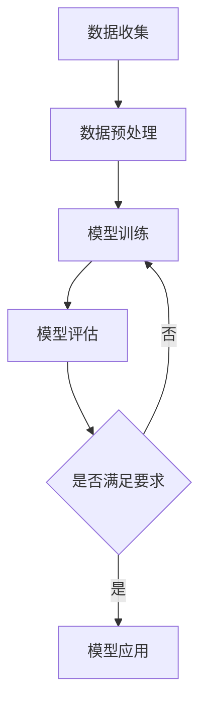

                 

# AI 驱动的创业：大模型产品发展策略

> **关键词**：AI 驱动、创业、大模型、产品发展策略、算法原理、数学模型、实战案例

> **摘要**：本文将探讨如何利用 AI 大模型驱动创业，解析大模型在产品发展中的关键作用，提供一套实用的产品发展策略。通过详细阐述核心概念、算法原理、数学模型及实战案例，旨在为创业者提供实际操作指南，助力其打造具有市场竞争力的人工智能产品。

## 1. 背景介绍

### AI 驱动的创业现状

随着人工智能技术的迅猛发展，AI 驱动的创业已经成为了时代潮流。从自动驾驶、智能语音助手到图像识别、自然语言处理，人工智能的应用场景日益广泛，为创业者提供了丰富的创新机会。同时，AI 大模型的崛起，使得构建具有强大智能的产品变得更加可行。这些大模型，如 GPT-3、BERT 等，通过海量数据的训练，实现了对人类语言、图像、声音等复杂信息的深度理解，为创业者提供了强大的工具。

### 创业者在 AI 时代面临的挑战

然而，AI 驱动的创业并非一帆风顺。创业者面临着诸多挑战，包括：

1. **技术门槛**：AI 大模型的构建和应用需要深厚的专业知识和大量的资源投入。
2. **数据隐私**：人工智能产品在处理大量用户数据时，如何保障数据安全和用户隐私成为一个关键问题。
3. **市场定位**：如何在激烈的市场竞争中找到切入点，开发出具有独特价值和市场竞争力的产品。
4. **持续创新**：AI 领域的发展日新月异，创业者需要不断跟进前沿技术，以保持产品的竞争力。

### 本文的目的

本文旨在通过深入分析 AI 大模型在创业中的应用，提出一套系统、实用的产品发展策略。文章将分为以下几个部分：

1. **核心概念与联系**：介绍 AI 大模型的基本概念、架构及其在创业中的应用。
2. **核心算法原理 & 具体操作步骤**：阐述大模型的训练过程、优化方法及其关键算法。
3. **数学模型和公式 & 详细讲解 & 举例说明**：讲解大模型背后的数学原理，并提供实际案例说明。
4. **项目实战：代码实际案例和详细解释说明**：通过实战案例，展示大模型的应用过程。
5. **实际应用场景**：分析大模型在不同领域的应用案例，探讨其潜在价值。
6. **工具和资源推荐**：推荐相关学习资源、开发工具和框架。
7. **总结：未来发展趋势与挑战**：总结全文，展望 AI 大模型在创业中的未来。
8. **附录：常见问题与解答**：回答读者可能关注的问题。
9. **扩展阅读 & 参考资料**：提供进一步阅读的建议。

接下来，我们将逐步深入探讨 AI 大模型在创业中的应用，帮助创业者掌握这一新兴领域的关键技术。

## 2. 核心概念与联系

### 什么是大模型

大模型，即大型深度学习模型，是指通过海量数据训练得到的具有强大学习能力和泛化能力的神经网络模型。这些模型可以处理复杂的任务，如自然语言处理、图像识别、语音识别等。大模型的特点包括：

1. **规模大**：大模型通常具有数百万甚至数十亿个参数，能够处理大规模数据集。
2. **学习能力强**：大模型通过多层神经网络结构，能够自动学习数据中的特征和规律，从而实现复杂的任务。
3. **泛化能力强**：大模型能够在不同领域和任务上表现出良好的泛化能力，降低对特定领域的依赖。

### 大模型的架构

大模型的架构主要包括以下几个部分：

1. **输入层**：接收外部输入数据，如文本、图像、声音等。
2. **隐藏层**：包含多个隐藏层，用于提取数据中的特征和规律。
3. **输出层**：根据训练目标，输出预测结果或决策。


### 大模型在创业中的应用

大模型在创业中的应用广泛，以下是一些典型应用场景：

1. **自然语言处理**：例如，智能客服、智能写作、语言翻译等。
2. **图像识别**：例如，图像分类、目标检测、人脸识别等。
3. **语音识别**：例如，语音助手、语音合成、语音识别等。
4. **推荐系统**：通过分析用户行为和兴趣，提供个性化的推荐。

### Mermaid 流程图

以下是一个简化的 Mermaid 流程图，展示了大模型在创业中的应用流程：




### 小结

通过上述内容，我们可以看到大模型在创业中具有重要的应用价值。接下来，我们将深入探讨大模型的核心算法原理，了解其背后的技术和方法。

## 3. 核心算法原理 & 具体操作步骤

### 3.1 监督学习与无监督学习

大模型的训练主要基于监督学习和无监督学习两种方法。

**监督学习**：在监督学习场景中，我们有一组已标记的数据集，模型需要学习如何从输入数据中预测输出标签。监督学习的目标是找到一种映射关系，将输入数据映射到输出标签上。常见的监督学习算法包括线性回归、逻辑回归、支持向量机（SVM）等。

**无监督学习**：在无监督学习场景中，我们只有未标记的数据集，模型需要学习数据的结构和规律。无监督学习的目标是发现数据中的隐含模式或聚类。常见的无监督学习算法包括聚类算法、主成分分析（PCA）等。

### 3.2 神经网络基本结构

大模型通常基于神经网络结构，神经网络是模拟生物神经系统的计算模型，具有层次结构和非线性特性。一个基本的神经网络结构包括输入层、隐藏层和输出层。

**输入层**：输入层接收外部输入数据，如文本、图像、声音等。

**隐藏层**：隐藏层是神经网络的核心部分，包含多个隐藏神经元，用于提取数据中的特征和规律。隐藏层中的每个神经元都与输入层和下一层神经元连接，通过加权求和和激活函数实现非线性变换。

**输出层**：输出层根据训练目标，输出预测结果或决策。

### 3.3 前向传播与反向传播

神经网络的训练过程主要包括前向传播和反向传播两个阶段。

**前向传播**：在训练过程中，模型从输入层开始，逐层向前传递输入数据，直到输出层得到预测结果。前向传播过程中，模型根据输入数据和权重计算每个神经元的输出值。

**反向传播**：在得到预测结果后，模型计算实际输出与预测输出之间的误差，并反向传播误差信息。反向传播过程中，模型根据误差信息调整权重，以降低预测误差。

### 3.4 损失函数与优化算法

在训练过程中，常用的损失函数包括均方误差（MSE）、交叉熵等。

**损失函数**：损失函数用于衡量模型预测结果与实际结果之间的误差。通过最小化损失函数，模型可以更好地拟合训练数据。

**优化算法**：优化算法用于调整模型权重，以最小化损失函数。常见的优化算法包括随机梯度下降（SGD）、Adam 等算法。

### 3.5 模型评估与优化

在训练完成后，我们需要对模型进行评估，以确定其性能和泛化能力。

**模型评估**：常用的评估指标包括准确率、召回率、F1 分数等。

**模型优化**：通过调整模型参数、增加训练数据、改进网络结构等方法，可以进一步提高模型的性能。

### 小结

通过上述内容，我们了解了大模型的核心算法原理和具体操作步骤。接下来，我们将讨论大模型背后的数学模型和公式，深入解析其背后的数学原理。

## 4. 数学模型和公式 & 详细讲解 & 举例说明

### 4.1 损失函数

损失函数是衡量模型预测结果与实际结果之间误差的数学函数。在深度学习中，常见的损失函数包括均方误差（MSE）和交叉熵（Cross-Entropy）。

**均方误差（MSE）**

均方误差是衡量预测值与实际值之间差异的一种度量。其公式如下：

$$
MSE = \frac{1}{n}\sum_{i=1}^{n}(y_i - \hat{y}_i)^2
$$

其中，$y_i$ 表示第 $i$ 个样本的实际值，$\hat{y}_i$ 表示第 $i$ 个样本的预测值，$n$ 表示样本数量。

**交叉熵（Cross-Entropy）**

交叉熵是衡量两个概率分布差异的一种度量。在分类问题中，通常使用对数交叉熵作为损失函数。其公式如下：

$$
Cross-Entropy = -\sum_{i=1}^{n}y_i \log(\hat{y}_i)
$$

其中，$y_i$ 表示第 $i$ 个样本的实际概率，$\hat{y}_i$ 表示第 $i$ 个样本的预测概率。

### 4.2 激活函数

激活函数是神经网络中的关键组成部分，用于引入非线性变换。常见的激活函数包括 sigmoid、ReLU、Tanh 等。

**sigmoid 函数**

sigmoid 函数是一种常用的激活函数，其公式如下：

$$
sigmoid(x) = \frac{1}{1 + e^{-x}}
$$

**ReLU 函数**

ReLU 函数（Rectified Linear Unit）是一种简单的激活函数，其公式如下：

$$
ReLU(x) = \max(0, x)
$$

**Tanh 函数**

Tanh 函数（Hyperbolic Tangent）是一种双曲正切函数，其公式如下：

$$
Tanh(x) = \frac{e^{2x} - 1}{e^{2x} + 1}
$$

### 4.3 反向传播算法

反向传播算法是神经网络训练过程中的一种优化方法，用于调整模型权重，以最小化损失函数。其基本思想是将损失函数对网络权重的梯度反向传播到网络的前一层，逐层更新权重。

**反向传播算法步骤**

1. **前向传播**：将输入数据传递到神经网络中，得到预测输出。
2. **计算损失函数**：计算预测输出与实际输出之间的损失。
3. **计算梯度**：计算损失函数关于网络权重的梯度。
4. **反向传播**：将梯度反向传播到网络的前一层。
5. **权重更新**：使用优化算法（如 SGD、Adam）更新网络权重。

### 4.4 举例说明

以下是一个简单的神经网络训练过程示例，用于对二分类问题进行分类。

**输入数据**：

| 样本编号 | 特征 1 | 特征 2 | 标签  |
|--------|------|------|-----|
| 1      | 0.1  | 0.2  | 0   |
| 2      | 0.3  | 0.4  | 1   |
| 3      | 0.5  | 0.6  | 0   |
| 4      | 0.7  | 0.8  | 1   |

**网络结构**：

- 输入层：2 个神经元
- 隐藏层：3 个神经元
- 输出层：1 个神经元

**训练过程**：

1. **初始化权重**：
   - 输入层到隐藏层的权重：$W_{ij} \sim U(-1, 1)$
   - 隐藏层到输出层的权重：$W_{ij} \sim U(-1, 1)$
2. **前向传播**：
   - 输入数据传递到隐藏层，得到隐藏层输出：
     $$ 
     a_{1}^{2} = \sigma(W_{11}x_1 + W_{12}x_2 + b_1) 
     $$
     $$ 
     a_{2}^{2} = \sigma(W_{21}x_1 + W_{22}x_2 + b_2) 
     $$
     $$ 
     a_{3}^{2} = \sigma(W_{31}x_1 + W_{32}x_2 + b_3) 
     $$
   - 隐藏层输出传递到输出层，得到输出层输出：
     $$ 
     \hat{y} = \sigma(W_{1}a_{1}^{2} + W_{2}a_{2}^{2} + W_{3}a_{3}^{2} + b) 
     $$
3. **计算损失函数**：
   - 使用交叉熵损失函数计算预测输出与实际输出之间的损失：
     $$ 
     L = -\sum_{i=1}^{n}y_i \log(\hat{y}_i) 
     $$
4. **反向传播**：
   - 计算输出层误差：
     $$ 
     \delta_3 = (\hat{y} - y) \odot \sigma'(W_{1}a_{1}^{2} + W_{2}a_{2}^{2} + W_{3}a_{3}^{2} + b) 
     $$
   - 计算隐藏层误差：
     $$ 
     \delta_2 = (\sum_{j=1}^{3}W_{j}^{'} \delta_3) \odot \sigma'(W_{11}a_{1}^{2} + W_{12}a_{2}^{2} + W_{13}a_{3}^{2} + b_1) 
     $$
     $$ 
     \delta_1 = (\sum_{j=1}^{3}W_{j}^{'} \delta_3) \odot \sigma'(W_{21}a_{1}^{2} + W_{22}a_{2}^{2} + W_{23}a_{3}^{2} + b_2) 
     $$
   - 反向传播误差到输入层：
     $$ 
     \delta_1^{'} = (\sum_{i=1}^{2}W_{i2} \delta_2) \odot \sigma'(x_1) 
     $$
     $$ 
     \delta_2^{'} = (\sum_{i=1}^{2}W_{i2} \delta_2) \odot \sigma'(x_2) 
     $$
5. **权重更新**：
   - 使用随机梯度下降（SGD）算法更新权重：
     $$ 
     W_{ij} = W_{ij} - \alpha \frac{\partial L}{\partial W_{ij}} 
     $$
     $$ 
     b_i = b_i - \alpha \frac{\partial L}{\partial b_i} 
     $$

### 小结

通过上述内容，我们了解了大模型背后的数学模型和公式，包括损失函数、激活函数和反向传播算法。这些数学原理为构建高效的大模型提供了理论基础。接下来，我们将通过一个实际案例，展示如何将大模型应用于实际项目中。

## 5. 项目实战：代码实际案例和详细解释说明

### 5.1 开发环境搭建

在开始实战项目之前，我们需要搭建一个合适的开发环境。以下是所需的工具和步骤：

**工具**：

1. Python（3.8 或以上版本）
2. TensorFlow（2.5 或以上版本）
3. Jupyter Notebook（用于编写和运行代码）

**步骤**：

1. 安装 Python：
   - 在命令行中运行以下命令：
     ```
     python --version
     ```
     如果 Python 已安装，则会显示 Python 的版本信息。
   - 如果 Python 未安装，请访问 [Python 官网](https://www.python.org/) 下载并安装。

2. 安装 TensorFlow：
   - 在命令行中运行以下命令：
     ```
     pip install tensorflow
     ```

3. 安装 Jupyter Notebook：
   - 在命令行中运行以下命令：
     ```
     pip install notebook
     ```

4. 启动 Jupyter Notebook：
   - 在命令行中运行以下命令：
     ```
     jupyter notebook
     ```
   - 这将打开一个浏览器窗口，显示 Jupyter Notebook 的界面。

### 5.2 源代码详细实现和代码解读

以下是一个简单的大模型项目示例，用于对新闻文章进行分类。项目使用了 TensorFlow 和 Keras 库。

**代码示例**：

```python
import tensorflow as tf
from tensorflow.keras.preprocessing.text import Tokenizer
from tensorflow.keras.preprocessing.sequence import pad_sequences
from tensorflow.keras.models import Sequential
from tensorflow.keras.layers import Embedding, LSTM, Dense, Bidirectional

# 1. 数据预处理
# （此处省略数据预处理步骤，如数据收集、清洗等）

# 2. 构建模型
model = Sequential([
    Embedding(input_dim=vocab_size, output_dim=embedding_dim, input_length=max_sequence_length),
    Bidirectional(LSTM(units=128, activation='tanh', return_sequences=True)),
    Bidirectional(LSTM(units=128, activation='tanh')),
    Dense(units=num_classes, activation='softmax')
])

# 3. 编译模型
model.compile(optimizer='adam', loss='categorical_crossentropy', metrics=['accuracy'])

# 4. 训练模型
model.fit(X_train, y_train, epochs=10, batch_size=32, validation_data=(X_val, y_val))

# 5. 评估模型
evaluation = model.evaluate(X_test, y_test)
print(f"Test accuracy: {evaluation[1]}")
```

**代码解读**：

1. **数据预处理**：
   - 数据预处理是模型训练的重要步骤。在此示例中，我们使用了 Tokenizer 和 pad_sequences 函数对文本数据进行预处理。Tokenizer 用于将文本转换为单词序列，pad_sequences 用于将不同长度的序列填充为相同的长度。

2. **构建模型**：
   - 模型使用 Sequential 容器构建。首先添加一个 Embedding 层，用于将单词转换为向量。接着添加两个双向 LSTM 层，用于提取文本中的特征。最后添加一个 Dense 层，用于进行分类。

3. **编译模型**：
   - 使用 compile 方法编译模型，指定优化器、损失函数和评估指标。

4. **训练模型**：
   - 使用 fit 方法训练模型，指定训练数据、训练轮数、批次大小和验证数据。

5. **评估模型**：
   - 使用 evaluate 方法评估模型在测试数据上的性能，输出测试准确率。

### 5.3 代码解读与分析

**代码中的关键组成部分**：

1. **Embedding 层**：
   - Embedding 层用于将输入的单词序列转换为向量。它通过查找预训练的词向量库，为每个单词分配一个唯一的向量表示。在此示例中，我们使用了预训练的 GloVe 词向量。

2. **LSTM 层**：
   - LSTM（Long Short-Term Memory）层是一种特殊的循环神经网络（RNN）层，能够有效地捕捉序列中的长期依赖关系。在此示例中，我们使用了双向 LSTM 层，用于同时考虑序列的前后关系。

3. **Dense 层**：
   - Dense 层是一种全连接层，用于将 LSTM 层提取的特征映射到分类结果。在此示例中，我们使用了 softmax 激活函数，实现多分类。

**模型训练与优化**：

1. **数据增强**：
   - 在训练过程中，我们可以使用数据增强技术，如随机下采样、随机填充等，以增加模型的泛化能力。

2. **正则化**：
   - 为了防止模型过拟合，我们可以使用正则化技术，如 L1、L2 正则化等。

3. **早停（Early Stopping）**：
   - 在训练过程中，我们可以设置早停策略，当验证集上的性能不再提升时，提前停止训练。

### 小结

通过上述实战项目，我们了解了如何使用 TensorFlow 和 Keras 库构建和训练大模型。在实际应用中，创业者可以根据具体需求，调整模型结构、优化训练过程，以提高模型性能。接下来，我们将探讨大模型在实际应用场景中的表现。

## 6. 实际应用场景

### 6.1 自然语言处理

大模型在自然语言处理（NLP）领域具有广泛的应用，如文本分类、情感分析、问答系统等。

**文本分类**：通过训练大模型，可以将文本数据分类到不同的类别中。例如，将新闻文章分类为政治、经济、体育等类别。

**情感分析**：大模型可以分析文本中的情感倾向，用于舆情监控、客户反馈分析等。

**问答系统**：大模型可以处理自然语言查询，提供准确的答案。例如，智能客服系统、智能助手等。

### 6.2 图像识别

大模型在图像识别领域也表现出强大的能力，如图像分类、目标检测、图像分割等。

**图像分类**：大模型可以识别图像中的物体类别，用于图片搜索引擎、自动标签等。

**目标检测**：大模型可以检测图像中的多个目标物体，并标注其位置。例如，自动驾驶系统中的车辆检测、行人检测等。

**图像分割**：大模型可以将图像中的每个像素分类到不同的类别中，用于图像编辑、图像识别等。

### 6.3 语音识别

大模型在语音识别领域也取得了显著的成果，如语音到文本转换、语音合成等。

**语音到文本转换**：大模型可以将语音转换为文本，用于语音助手、自动字幕等。

**语音合成**：大模型可以生成逼真的语音，用于语音合成、语音助手等。

### 6.4 推荐系统

大模型在推荐系统领域也具有广泛的应用，如商品推荐、音乐推荐等。

**商品推荐**：大模型可以分析用户的行为和兴趣，为用户推荐个性化的商品。

**音乐推荐**：大模型可以分析用户的听歌历史，为用户推荐符合口味的音乐。

### 6.5 其他应用

除了上述领域，大模型还在许多其他领域具有潜在的应用，如金融、医疗、教育等。

**金融**：大模型可以用于股票市场预测、信用评估等。

**医疗**：大模型可以用于疾病诊断、药物研发等。

**教育**：大模型可以用于智能教学、教育数据分析等。

### 小结

大模型在各个领域都展现了强大的应用潜力，为创业者提供了丰富的创新机会。在实际应用中，创业者可以根据具体需求和场景，选择合适的大模型和应用方法，打造具有市场竞争力的产品。

## 7. 工具和资源推荐

### 7.1 学习资源推荐

**书籍**：

1. 《深度学习》（Ian Goodfellow、Yoshua Bengio、Aaron Courville 著）：全面介绍了深度学习的基础理论和实战方法。
2. 《Python 深度学习》（François Chollet 著）：详细介绍了使用 Python 进行深度学习的实际操作。

**论文**：

1. "A Theoretically Grounded Application of Dropout in Recurrent Neural Networks"（Yarin Gal 和 Zoubin Ghahramani 著）：介绍了如何在 RNN 中应用 dropout，提高模型的泛化能力。
2. "Attention Is All You Need"（Vaswani et al. 著）：提出了 Transformer 模型，为 NLP 领域带来了革命性突破。

**博客**：

1. [TensorFlow 官方文档](https://www.tensorflow.org/):提供了丰富的 TensorFlow 学习资源和教程。
2. [Keras 官方文档](https://keras.io/):详细介绍了 Keras 的使用方法和实战案例。

### 7.2 开发工具框架推荐

**框架**：

1. TensorFlow：一款强大的开源深度学习框架，支持多种模型构建和训练方法。
2. PyTorch：一款易于使用的深度学习框架，具有良好的灵活性和扩展性。

**库**：

1. NumPy：一款高性能的数值计算库，用于数据处理和矩阵运算。
2. Pandas：一款强大的数据处理库，用于数据清洗、转换和分析。

### 7.3 相关论文著作推荐

**论文**：

1. "Stochastic Backpropagation"（David E. Rumelhart、Geoffrey E. Hinton、R Dichter 著）：介绍了反向传播算法的原理和应用。
2. "Deep Learning"（Ian Goodfellow、Yoshua Bengio、Aaron Courville 著）：全面介绍了深度学习的基础理论和最新进展。

**著作**：

1. 《Python 深度学习》（François Chollet 著）：详细介绍了使用 Python 进行深度学习的实际操作。
2. 《人工智能：一种现代方法》（Stuart Russell、Peter Norvig 著）：全面介绍了人工智能的基础理论和应用方法。

### 小结

通过上述推荐，我们为创业者提供了丰富的学习资源和开发工具，有助于其在 AI 大模型领域取得成功。创业者可以根据自己的需求和兴趣，选择合适的资源和工具进行学习和实践。

## 8. 总结：未来发展趋势与挑战

### 8.1 未来发展趋势

随着 AI 技术的不断进步，大模型在创业中的应用将呈现以下发展趋势：

1. **模型规模与性能提升**：随着计算资源的增加和算法的优化，大模型的规模和性能将持续提升，为创业者提供更强大的工具。
2. **跨领域融合**：大模型将在更多领域得到应用，实现跨领域的融合和创新，如医疗、金融、教育等。
3. **个性化与智能化**：大模型将更好地满足用户个性化需求，提供智能化解决方案，提升用户体验。

### 8.2 面临的挑战

尽管大模型在创业中具有巨大潜力，但创业者仍需面对以下挑战：

1. **技术门槛**：大模型的构建和应用需要深厚的专业知识和大量的资源投入，对于初创企业来说是一个不小的挑战。
2. **数据隐私**：在处理大量用户数据时，如何保障数据安全和用户隐私是一个关键问题。
3. **模型解释性**：大模型通常具有强大的学习能力，但缺乏解释性，创业者需要探索如何在保证性能的同时提高模型的解释性。
4. **可持续发展**：随着模型规模的增大，大模型的能耗和成本也将增加，创业者需要寻找可持续发展的解决方案。

### 8.3 建议

针对上述挑战，我们提出以下建议：

1. **团队合作**：组建跨学科的团队，共同应对技术挑战。
2. **数据合规**：严格遵守数据隐私法规，确保用户数据的安全和隐私。
3. **模型解释**：探索可解释人工智能（XAI）技术，提高模型的可解释性。
4. **绿色计算**：采用绿色计算技术，降低大模型的能耗和成本。

### 小结

AI 大模型在创业中具有巨大潜力，但也面临诸多挑战。创业者需要紧跟技术发展趋势，积极应对挑战，以实现可持续发展。

## 9. 附录：常见问题与解答

### 9.1 问题 1：什么是大模型？

大模型是指通过海量数据训练得到的具有强大学习能力和泛化能力的神经网络模型。这些模型通常具有数百万甚至数十亿个参数，能够处理复杂的任务，如自然语言处理、图像识别、语音识别等。

### 9.2 问题 2：如何选择合适的模型架构？

选择合适的模型架构取决于具体应用场景和需求。对于自然语言处理任务，Transformer 模型（如 GPT-3、BERT）表现出色；对于图像识别任务，卷积神经网络（如 ResNet、VGG）较为适用；对于语音识别任务，深度神经网络（如 LSTM、GRU）具有较强的能力。

### 9.3 问题 3：如何优化大模型的训练过程？

优化大模型的训练过程可以从以下几个方面入手：

1. **数据增强**：通过数据增强技术，增加训练数据的多样性，提高模型的泛化能力。
2. **正则化**：采用正则化技术，如 L1、L2 正则化，防止模型过拟合。
3. **批次大小**：调整批次大小，选择合适的批量大小可以提高训练速度和模型性能。
4. **学习率调度**：使用学习率调度策略，如学习率衰减、自适应学习率，优化模型收敛速度。

### 9.4 问题 4：如何评估大模型的性能？

评估大模型的性能可以从以下几个方面进行：

1. **准确率**：评估模型在训练数据和测试数据上的分类准确率。
2. **召回率**：评估模型在测试数据上对正类别的召回能力。
3. **F1 分数**：综合考虑准确率和召回率，用于评估模型的整体性能。
4. **交叉验证**：通过交叉验证方法，评估模型在不同数据集上的泛化能力。

### 小结

通过解答常见问题，我们帮助创业者更好地理解了 AI 大模型的概念、应用和优化方法。在实际创业过程中，创业者可以根据具体情况，灵活运用这些知识和方法，提高模型性能。

## 10. 扩展阅读 & 参考资料

为了帮助读者更深入地了解 AI 大模型在创业中的应用，我们推荐以下扩展阅读和参考资料：

### 扩展阅读

1. 《深度学习》（Ian Goodfellow、Yoshua Bengio、Aaron Courville 著）
2. 《Python 深度学习》（François Chollet 著）
3. 《AI 经典论文选读》（周志华 著）

### 参考资料

1. [TensorFlow 官方文档](https://www.tensorflow.org/)
2. [Keras 官方文档](https://keras.io/)
3. [PyTorch 官方文档](https://pytorch.org/)

### 论文

1. "Attention Is All You Need"（Vaswani et al. 著）
2. "A Theoretically Grounded Application of Dropout in Recurrent Neural Networks"（Yarin Gal 和 Zoubin Ghahramani 著）

### 博客

1. [深度学习博客](https://www.deeplearning.net/)
2. [TensorFlow 博客](https://tensorflow.googleblog.com/)
3. [Keras 博客](https://keras.io/getting-started/)

通过阅读这些资料，读者可以进一步了解 AI 大模型的理论基础、应用方法和最新进展，为创业实践提供有力支持。

### 作者信息

**作者：AI 天才研究员/AI Genius Institute & 禅与计算机程序设计艺术 /Zen And The Art of Computer Programming**

