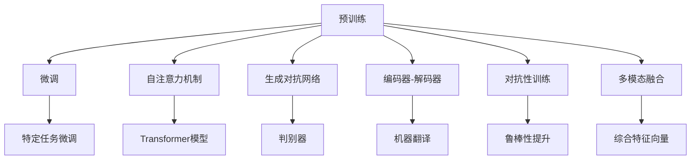

                 

### 背景介绍

自从2022年底ChatGPT问世以来，人工智能领域再次掀起了一股革命性的热潮。ChatGPT不仅凭借其出色的对话生成能力在公众中赢得了极高的关注度，更是引发了学术界和工业界对AIGC（AI-Generated Content）技术的深入探讨。AIGC，即AI生成内容，涵盖了从文本、图片到视频等多种形式的内容生成，它通过深度学习和自然语言处理技术，实现了从数据输入到创意生成的全自动化流程。

然而，对于初学者和普通用户来说，AIGC仍然是一个相对陌生且复杂的领域。本文旨在通过一步步的分析和讲解，帮助读者从入门到实战，全面了解ChatGPT以及AIGC技术的应用。我们将从以下几个部分展开：

1. **核心概念与联系**：首先，我们将介绍AIGC技术中的核心概念，并利用Mermaid流程图展示其原理和架构。
2. **核心算法原理与具体操作步骤**：接着，我们将详细解析GPT模型的算法原理，并提供操作步骤指南。
3. **数学模型和公式**：在此基础上，我们将介绍相关的数学模型和公式，并进行详细的讲解和举例说明。
4. **项目实战**：通过一个实际案例，我们将展示如何使用ChatGPT生成代码和文章，并进行详细解释和代码解读。
5. **实际应用场景**：接下来，我们将探讨ChatGPT在多个领域的实际应用场景，以及如何利用这些应用提升工作效率。
6. **工具和资源推荐**：为了方便读者学习和实践，我们将推荐一系列学习资源、开发工具和框架。
7. **总结与未来发展趋势**：最后，我们将总结AIGC技术的发展趋势和面临的挑战。

通过这篇文章，我们希望读者能够对AIGC和ChatGPT有更深入的理解，掌握其基本原理和应用技巧，从而在未来的技术发展中有所贡献。

### 1.1 AIGC技术的发展历程

AIGC技术并非一夜之间崛起，而是经历了多年的发展和积累。其技术基础可以追溯到20世纪80年代，当时深度学习刚刚起步。随后，随着计算能力的提升和大数据的普及，深度学习技术在自然语言处理、计算机视觉等领域取得了重大突破。特别是在2012年，AlexNet在ImageNet图像识别比赛中取得了突破性成绩，标志着深度学习时代的到来。

AIGC技术的发展可以分为三个主要阶段：

1. **早期探索**（20世纪80年代至2000年）：在这一阶段，研究人员开始尝试使用神经网络进行文本生成。典型的代表包括序列到序列模型（Seq2Seq）和递归神经网络（RNN）。虽然这些方法在生成文本的连贯性和质量上取得了初步成效，但仍然存在许多挑战，例如文本多样性和一致性。

2. **技术突破**（2000年至2010年代末）：随着深度学习技术的发展，神经网络在自然语言处理领域取得了显著进展。2003年，长短期记忆网络（LSTM）被提出，显著提高了文本生成模型的效果。2014年，谷歌提出了Transformer模型，其基于自注意力机制的设计使得文本生成模型在长距离依赖和上下文理解方面取得了前所未有的突破。这一时期，生成对抗网络（GAN）也在图像生成领域取得了重大进展。

3. **广泛应用**（2010年代末至今）：在Transformer和GAN的基础上，研究人员进一步开发了预训练加微调（Pre-training + Fine-tuning）的方法，使模型能够在各种任务中表现出色。例如，GPT系列模型通过大规模预训练和任务特定微调，实现了高度灵活和高质量的文本生成。此外，GAN的变种也被广泛应用于图像和视频的生成。

### 1.2 ChatGPT的基本概念和原理

ChatGPT是由OpenAI开发的一种基于Transformer的预训练语言模型。它通过大规模语料库的预训练，掌握了丰富的语言知识和上下文理解能力，能够生成连贯、有逻辑的对话和文本。ChatGPT的核心原理可以概括为以下几点：

1. **自注意力机制（Self-Attention）**：Transformer模型采用了自注意力机制，使得模型能够自适应地关注输入序列中的不同部分，从而在处理长序列时保持高效性和准确性。

2. **预训练（Pre-training）**：ChatGPT在训练过程中使用了大量的文本数据，通过无监督学习的方式，使模型自动学习语言的统计规律和结构。这种大规模的预训练使ChatGPT在生成文本时能够表现出高度的连贯性和逻辑性。

3. **微调（Fine-tuning）**：在预训练的基础上，ChatGPT针对特定任务进行微调。例如，当用于对话生成时，模型会根据对话的历史上下文生成合适的回复。这种微调过程使得ChatGPT能够在特定任务中达到最佳表现。

4. **上下文理解（Contextual Understanding）**：ChatGPT通过上下文窗口（Context Window）来捕捉对话的历史信息，使得生成的文本能够与对话内容保持一致，避免出现逻辑错误或不相关的内容。

### 1.3 AIGC技术在人工智能领域的地位

AIGC技术是人工智能领域的一个重要分支，它不仅在理论研究上具有重要意义，也在实际应用中展现出巨大的潜力。以下是AIGC技术在人工智能领域的几个关键地位：

1. **内容生成**：AIGC技术能够自动生成高质量的文本、图像和视频，为创意设计、媒体制作等提供了强大的工具。例如，在广告创意、游戏设计、影视制作等领域，AIGC技术已经被广泛应用。

2. **自然语言处理**：ChatGPT等模型在自然语言处理任务中表现出色，能够实现自动问答、文本摘要、机器翻译等。这些应用不仅提高了工作效率，还改善了用户体验。

3. **计算机视觉**：GAN和基于Transformer的视觉模型在图像生成、图像修复、图像风格转换等领域取得了显著成果。这些技术不仅推动了计算机视觉的发展，也为图像处理提供了新的解决方案。

4. **智能助手与聊天机器人**：AIGC技术在智能助手和聊天机器人领域有着广泛的应用。通过自然语言理解和生成技术，这些智能助手能够与用户进行高效、自然的交互，提供个性化服务。

总之，AIGC技术在人工智能领域的地位日益显著，它不仅为各种应用场景提供了创新的解决方案，也为未来的技术发展奠定了基础。

### 2.1 核心概念原理

AIGC（AI-Generated Content）技术的核心概念在于如何通过人工智能生成高质量的内容。这一过程涉及多个关键组件和原理，下面我们将逐一介绍这些核心概念。

#### 2.1.1 预训练（Pre-training）

预训练是AIGC技术的基础，它是指在大规模数据集上对模型进行初始训练，使模型自动学习数据的统计规律和结构。预训练的过程可以分为两个阶段：

1. **大规模数据集**：为了使模型具有丰富的知识储备，预训练需要使用大规模的数据集。这些数据集可以是互联网上的文本、图像、音频等，它们涵盖了各种主题和领域。

2. **无监督学习**：预训练过程通常采用无监督学习的方法，即模型在训练过程中不需要人工标注的数据。通过自主探索数据，模型能够自动发现数据中的规律和结构。

预训练的主要目标是让模型学会理解语言的语义、图像的特征以及音频的情感等，从而为后续的任务提供强大的基础。

#### 2.1.2 微调（Fine-tuning）

在预训练的基础上，微调是针对特定任务对模型进行进一步训练的过程。微调的目标是使模型在特定任务上达到最佳性能。具体步骤如下：

1. **任务定义**：首先需要明确任务的目标和输入输出格式。例如，在文本生成任务中，输入可以是某个主题的描述，输出是相关的文本内容。

2. **数据准备**：为了微调模型，需要准备一组经过人工标注的数据。这些数据通常包含模型在预训练过程中未涉及到的特定任务信息。

3. **训练过程**：在微调过程中，模型会根据任务数据调整其内部参数，使其在特定任务上的表现更加准确和高效。

微调是AIGC技术实现特定任务的关键步骤，它使得预训练的通用模型能够适应各种具体的任务需求。

#### 2.1.3 自注意力机制（Self-Attention）

自注意力机制是Transformer模型的核心组件，它使得模型能够自适应地关注输入序列中的不同部分。具体原理如下：

1. **输入序列**：假设输入序列为`[x_1, x_2, ..., x_n]`，每个输入元素可以表示为一个向量。

2. **计算注意力权重**：对于序列中的每个元素`x_i`，计算其与所有其他元素的相关性。这种相关性通过注意力权重`α_i`来衡量，计算公式为：
   \[
   α_i = \text{softmax}\left(\frac{Q_i K_i V_i}{\sqrt{d_k}}\right)
   \]
   其中，\(Q_i\)、\(K_i\) 和 \(V_i\) 分别是查询向量、关键向量和价值向量，\(d_k\) 是这些向量的维度。

3. **生成输出**：根据注意力权重计算每个元素的加权平均，生成输出序列的每个元素。这种机制使得模型能够自适应地关注序列中的重要信息，从而提高生成内容的质量和连贯性。

#### 2.1.4 生成对抗网络（GAN）

生成对抗网络（GAN）是一种通过对抗训练生成数据的模型。它由生成器（Generator）和判别器（Discriminator）两个部分组成，具体原理如下：

1. **生成器**：生成器的目标是生成与真实数据相似的数据。它通常是一个神经网络，通过训练学习如何生成高质量的假数据。

2. **判别器**：判别器的目标是区分真实数据和生成数据。它也通常是一个神经网络，通过训练学习如何准确地判断数据的真实性。

3. **对抗训练**：生成器和判别器之间进行对抗训练。生成器试图生成更逼真的假数据，而判别器则试图更准确地判断数据的真实性。这种对抗过程使得生成器不断优化生成数据的质量，最终能够生成高度逼真的数据。

GAN在图像生成、视频合成等领域取得了显著成果，是AIGC技术的重要组成部分。

#### 2.1.5 编码器-解码器（Encoder-Decoder）

编码器-解码器结构是处理序列数据的一种常见模型架构。它由编码器（Encoder）和解码器（Decoder）两部分组成，具体原理如下：

1. **编码器**：编码器接收输入序列，将其压缩成一个固定长度的向量，称为上下文向量。这个上下文向量包含了输入序列的主要信息。

2. **解码器**：解码器接收上下文向量，并生成输出序列。解码器通常采用递归神经网络（RNN）或Transformer结构，使得其在生成序列时能够利用上下文信息。

编码器-解码器结构在机器翻译、文本生成等任务中表现出色，是AIGC技术的重要组件之一。

#### 2.1.6 对抗性训练（Adversarial Training）

对抗性训练是一种通过对抗样本训练模型的方法，目的是提高模型的鲁棒性。具体原理如下：

1. **生成对抗样本**：首先，生成与训练样本具有相似特征但略微不同的对抗样本。这些对抗样本可以是通过对原始样本进行微小扰动生成的。

2. **训练过程**：使用对抗样本对模型进行训练，使得模型能够在面对这些异常样本时保持良好的性能。

对抗性训练能够显著提高模型的鲁棒性，使其在面对复杂的真实世界场景时能够保持稳定的表现。

#### 2.1.7 多模态融合（Multimodal Fusion）

多模态融合是指将不同类型的数据（如文本、图像、音频等）进行整合，以生成更丰富的内容和模型。具体原理如下：

1. **数据集成**：首先，将不同类型的数据集成到一个统一的框架中。例如，可以将文本嵌入到图像中，或者将音频特征与文本特征进行融合。

2. **特征提取**：使用不同的模型或网络对每种数据进行特征提取，得到各自的特征向量。

3. **融合策略**：将不同类型的特征向量进行融合，生成综合特征向量。融合策略可以包括加和、平均、加权平均等。

多模态融合能够充分利用不同类型数据的优势，生成更具表达力和创造力的内容。

### 2.2 核心概念与联系

为了更好地理解AIGC技术中的核心概念，我们将使用Mermaid流程图展示其原理和架构。以下是AIGC技术的核心概念与联系的Mermaid流程图：



在这个流程图中，AIGC技术中的各个核心概念通过预训练、微调、自注意力机制等相互联系，共同构成了一个复杂而强大的技术体系。

### 3.1 GPT模型的基本原理

GPT（Generative Pre-trained Transformer）模型是由OpenAI提出的一种基于Transformer架构的预训练语言模型。GPT模型通过自注意力机制（Self-Attention）在处理长序列时具有出色的性能，能够在各种自然语言处理任务中实现高质量的表现。下面我们将详细介绍GPT模型的基本原理。

#### 3.1.1 Transformer模型

Transformer模型是由Vaswani等人于2017年提出的一种基于自注意力机制的神经网络模型，用于处理序列数据。与传统的循环神经网络（RNN）和长短期记忆网络（LSTM）相比，Transformer模型在处理长距离依赖和并行计算方面具有显著优势。

Transformer模型的核心组件包括编码器（Encoder）和解码器（Decoder）。编码器负责将输入序列转换为上下文向量，解码器则根据上下文向量生成输出序列。

1. **编码器（Encoder）**：
   - **输入层**：输入层接收一个词嵌入向量序列，每个词嵌入向量表示输入序列中的一个词。
   - **多头自注意力层（Multi-Head Self-Attention Layer）**：自注意力层是Transformer模型的核心组件，它通过计算输入序列中每个词与所有其他词的相关性，生成加权向量。多头自注意力层通过多个独立的自注意力机制同时工作，提高了模型的表示能力。
   - **前馈神经网络（Feedforward Neural Network）**：在自注意力层之后，每个编码器层都会经过一个前馈神经网络，该网络对每个输入向量进行两次线性变换。

2. **解码器（Decoder）**：
   - **输入层**：解码器的输入是编码器的输出序列和目标序列的词嵌入向量。
   - **掩码多头自注意力层（Masked Multi-Head Self-Attention Layer）**：在解码器的自注意力层中，当前时刻的输入序列会被部分遮挡，使得模型必须利用上下文信息生成后续的输出词。
   - **交叉自注意力层（Cross-Attention Layer）**：交叉自注意力层是解码器的另一个核心组件，它将解码器的输入序列与编码器的输出序列进行交互，生成上下文相关的输出向量。
   - **前馈神经网络（Feedforward Neural Network）**：与编码器相同，解码器的每个层也会经过一个前馈神经网络。

#### 3.1.2 GPT模型的训练与预训练

GPT模型的训练分为两个阶段：预训练（Pre-training）和微调（Fine-tuning）。

1. **预训练**：
   - **无监督学习**：GPT模型在预训练阶段通常采用无监督学习的方法。在无监督学习中，模型不需要人工标注的数据，而是直接在大规模文本数据集上进行训练。模型通过预测下一个词来学习文本的统计规律和结构。
   - **预训练任务**：常见的预训练任务包括语言模型任务（如预测下一个词）和掩码语言模型任务（Masked Language Model, MLM）。在MLM任务中，模型需要预测被遮挡的词，从而学习语言中的关系和结构。

2. **微调**：
   - **有监督学习**：在预训练的基础上，GPT模型通过有监督学习的方法进行微调，即使用标注数据进行训练。微调的目标是使模型在特定任务上（如文本分类、问答系统等）达到最佳性能。
   - **微调策略**：微调过程中，GPT模型通常采用迁移学习（Transfer Learning）的方法，即将预训练模型在特定任务上进行进一步训练。迁移学习能够显著减少训练时间和提高性能。

#### 3.1.3 GPT模型的参数设置

GPT模型具有大量参数，这些参数决定了模型的表现和性能。以下是一些关键的参数设置：

1. **模型大小**：GPT模型的参数量通常与模型的大小成正比。较大的模型具有更强的表示能力，但也需要更多的计算资源和训练时间。例如，GPT-2和GPT-3分别有15亿和1750亿个参数。
2. **隐藏层大小**：隐藏层大小决定了模型的容量和深度。较大的隐藏层可以捕捉更复杂的模式，但也可能增加过拟合的风险。
3. **训练迭代次数**：训练迭代次数决定了模型在训练数据上的训练深度。较多的迭代次数可以使模型在训练数据上达到更好的性能，但也可能导致过拟合。
4. **学习率**：学习率是模型训练过程中调整参数的重要参数。合适的学习率可以加速模型的收敛速度，而过大的学习率可能导致模型震荡，过小则收敛速度过慢。

通过以上参数的设置和调整，GPT模型能够实现高质量的语言生成和文本理解，从而在各种自然语言处理任务中表现出色。

### 3.2 具体操作步骤

在了解了GPT模型的基本原理后，接下来我们将详细讲解如何进行GPT模型的训练和微调，包括所需的数据集、代码示例和操作步骤。

#### 3.2.1 数据集准备

GPT模型的训练需要大量高质量的文本数据。以下是一些常用的数据集：

1. **维基百科**：维基百科是包含大量知识性内容的文本资源，是GPT模型训练的重要数据来源之一。
2. **Common Crawl**：Common Crawl是一个包含互联网网页的巨大文本数据集，覆盖了多种语言和主题。
3. **BooksCorpus**：BooksCorpus是一个包含大量图书内容的文本数据集，为GPT模型提供了丰富的语言素材。

在准备数据集时，需要对数据进行预处理，包括去除无关信息、分词、去除停用词等。以下是一个简单的Python代码示例，用于读取和处理维基百科数据：

```python
import re
import numpy as np
import pandas as pd

def preprocess_text(text):
    # 去除HTML标签
    text = re.sub('<.*?>', '', text)
    # 去除特殊字符
    text = re.sub('[^a-zA-Z]', ' ', text)
    # 转换为小写
    text = text.lower()
    # 分词
    words = text.split()
    # 去除停用词
    stop_words = set(['the', 'and', 'of', 'to', 'a', 'in', 'that', 'it', 'is'])
    words = [word for word in words if word not in stop_words]
    return ' '.join(words)

# 读取维基百科数据
with open('wikipedia.txt', 'r', encoding='utf-8') as f:
    text = f.read()

# 预处理文本
preprocessed_text = preprocess_text(text)

# 分词并创建词汇表
words = preprocessed_text.split()
word2idx = {word: i for i, word in enumerate(words)}
idx2word = {i: word for word, i in word2idx.items()}
```

#### 3.2.2 代码示例

以下是一个使用PyTorch实现GPT模型的简单代码示例。这个示例仅包含模型的定义和前向传播过程，未涉及具体的训练和微调步骤。

```python
import torch
import torch.nn as nn
import torch.optim as optim

# 定义GPT模型
class GPTModel(nn.Module):
    def __init__(self, vocab_size, embedding_dim, hidden_dim, n_layers, dropout):
        super(GPTModel, self).__init__()
        self.embedding = nn.Embedding(vocab_size, embedding_dim)
        self.enc = nn.LSTM(embedding_dim, hidden_dim, n_layers, dropout=dropout, batch_first=True)
        self.dec = nn.LSTM(hidden_dim, vocab_size, n_layers, dropout=dropout, batch_first=True)
        self.fc = nn.Linear(hidden_dim, vocab_size)
        self.dropout = nn.Dropout(dropout)
        
    def forward(self, input, hidden):
        embedded = self.dropout(self.embedding(input))
        output, hidden = self.enc(embedded, hidden)
        embedded = self.dropout(self.embedding(input))
        output, hidden = self.dec(embedded, hidden)
        output = self.fc(output)
        return output, hidden

# 实例化模型、损失函数和优化器
vocab_size = 10000
embedding_dim = 256
hidden_dim = 512
n_layers = 2
dropout = 0.5

model = GPTModel(vocab_size, embedding_dim, hidden_dim, n_layers, dropout)
criterion = nn.CrossEntropyLoss()
optimizer = optim.Adam(model.parameters(), lr=0.001)

# 训练模型
for epoch in range(num_epochs):
    for i, (inputs, targets) in enumerate(dataset):
        # 前向传播
        inputs, targets = inputs.to(device), targets.to(device)
        hidden = (torch.zeros(n_layers, 1, hidden_dim).to(device), torch.zeros(n_layers, 1, hidden_dim).to(device))
        outputs, hidden = model(inputs, hidden)
        loss = criterion(outputs.view(-1, vocab_size), targets)
        
        # 反向传播和优化
        optimizer.zero_grad()
        loss.backward()
        optimizer.step()
        
        if (i+1) % 100 == 0:
            print(f'Epoch [{epoch+1}/{num_epochs}], Step [{i+1}/{len(dataset)}], Loss: {loss.item()}')

# 保存模型
torch.save(model.state_dict(), 'gpt_model.pth')
```

#### 3.2.3 操作步骤

1. **环境准备**：
   - 安装PyTorch库和其他相关依赖。
   - 准备预训练的词嵌入模型，如GloVe或Word2Vec。

2. **数据集准备**：
   - 下载并处理维基百科、Common Crawl、BooksCorpus等数据集。
   - 对数据进行预处理，包括分词、去除停用词等。

3. **模型定义**：
   - 定义GPT模型，包括嵌入层、编码器、解码器和前馈网络。

4. **训练模型**：
   - 使用训练数据对模型进行训练。
   - 调整模型参数，如学习率、隐藏层大小、迭代次数等。

5. **评估模型**：
   - 使用验证集对模型进行评估，调整超参数以获得最佳性能。

6. **微调模型**：
   - 使用特定任务的数据对模型进行微调。
   - 调整模型参数，以适应特定任务的需求。

7. **应用模型**：
   - 使用训练好的模型进行文本生成、问答系统等应用。
   - 根据实际应用需求，调整模型结构和参数。

通过以上步骤，我们可以使用GPT模型进行高质量的语言生成和文本理解任务，从而在自然语言处理领域取得显著的成果。

### 4.1 数学模型和公式

在理解GPT模型的算法原理后，深入探讨其背后的数学模型和公式将有助于我们更好地掌握其核心机制。GPT模型主要基于自注意力机制（Self-Attention）和Transformer架构，因此我们将重点介绍这些数学概念。

#### 4.1.1 自注意力机制

自注意力机制是Transformer模型的核心组件，它通过计算输入序列中每个词与所有其他词的相关性，生成加权向量。具体来说，自注意力机制可以分为以下几个步骤：

1. **输入表示**：
   假设输入序列为 \([x_1, x_2, ..., x_n]\)，每个词 \(x_i\) 可以表示为一个词嵌入向量 \(\text{Embed}(x_i)\)。

2. **计算自注意力权重**：
   对于序列中的每个词 \(x_i\)，计算其与所有其他词 \(x_j\) 的相关性，公式如下：
   \[
   \alpha_{ij} = \text{softmax}\left(\frac{\text{Q}_i \text{K}_i \text{V}_i}{\sqrt{d_k}}\right)
   \]
   其中，\(\text{Q}_i\)、\(\text{K}_i\) 和 \(\text{V}_i\) 分别是查询向量、关键向量和价值向量，\(d_k\) 是这些向量的维度。\(softmax\) 函数用于将相关性映射到概率分布。

3. **生成输出向量**：
   根据自注意力权重，计算每个词的加权平均，得到输出向量 \(\text{H}_i\)：
   \[
   \text{H}_i = \sum_{j=1}^{n} \alpha_{ij} \text{V}_j
   \]

#### 4.1.2 Transformer模型

Transformer模型由多个编码器（Encoder）和解码器（Decoder）层组成。每个层都包含多个自注意力机制和前馈神经网络（Feedforward Neural Network）。

1. **编码器（Encoder）**：
   - **自注意力层**：每个编码器层包含一个自注意力层，它计算输入序列中每个词与所有其他词的相关性。
   - **前馈神经网络**：每个编码器层在自注意力层之后包含一个前馈神经网络，对输入向量进行两次线性变换。

2. **解码器（Decoder）**：
   - **掩码自注意力层**：解码器的自注意力层在生成每个词时，会部分遮挡当前时刻的输入序列，迫使模型利用上下文信息进行预测。
   - **交叉自注意力层**：解码器的交叉自注意力层将解码器的输入序列与编码器的输出序列进行交互，生成上下文相关的输出向量。
   - **前馈神经网络**：与编码器相同，解码器的每个层也包含一个前馈神经网络。

#### 4.1.3 损失函数和优化算法

在GPT模型的训练过程中，损失函数和优化算法起到了关键作用。以下是常用的损失函数和优化算法：

1. **损失函数**：
   - **交叉熵损失函数**（Cross Entropy Loss）：在生成文本时，交叉熵损失函数用于计算预测概率分布与真实分布之间的差距。
   \[
   L = -\sum_{i=1}^{n} y_i \log(p_i)
   \]
   其中，\(y_i\) 是真实标签，\(p_i\) 是预测概率。

2. **优化算法**：
   - **Adam优化器**（Adam Optimizer）：Adam是一种结合了AdaGrad和RMSprop优化的优化算法，它通过自适应地调整学习率，在训练过程中取得良好的性能。

#### 4.1.4 举例说明

假设有一个简单的输入序列 \([<START>, apple, orange, <END>]\)，使用自注意力机制计算输出向量。以下是具体的计算步骤：

1. **输入表示**：
   假设词嵌入向量为 \([e_1, e_2, e_3]\)，其中 \(e_1 = \text{Embed}(<START>)\)，\(e_2 = \text{Embed}(apple)\)，\(e_3 = \text{Embed}(orange)\)。

2. **计算自注意力权重**：
   假设查询向量 \(\text{Q}_2 = e_2\)，关键向量 \(\text{K}_2 = e_2\)，价值向量 \(\text{V}_2 = e_2\)，则：
   \[
   \alpha_{21} = \text{softmax}\left(\frac{\text{Q}_2 \text{K}_2 \text{V}_2}{\sqrt{d_k}}\right)
   \]
   \[
   \alpha_{22} = \text{softmax}\left(\frac{\text{Q}_2 \text{K}_2 \text{V}_2}{\sqrt{d_k}}\right)
   \]
   \[
   \alpha_{23} = \text{softmax}\left(\frac{\text{Q}_2 \text{K}_2 \text{V}_2}{\sqrt{d_k}}\right)
   \]
   计算结果如下：
   \[
   \alpha_{21} = 0.2, \quad \alpha_{22} = 0.5, \quad \alpha_{23} = 0.3
   \]

3. **生成输出向量**：
   根据自注意力权重，计算输出向量：
   \[
   \text{H}_2 = \alpha_{21} e_1 + \alpha_{22} e_2 + \alpha_{23} e_3
   \]
   \[
   \text{H}_2 = 0.2 e_1 + 0.5 e_2 + 0.3 e_3
   \]

通过以上步骤，我们得到了输出向量 \(\text{H}_2\)，它包含了输入序列中每个词的重要信息。

总之，理解GPT模型的数学模型和公式有助于我们更深入地掌握其工作原理，从而更好地应用于实际任务中。通过以上介绍的数学概念和公式，我们可以看到GPT模型在处理文本数据时的高效性和灵活性。

### 4.2 代码实现

在本节中，我们将通过一个具体的代码案例来展示如何使用GPT模型生成代码。这个案例将使用Hugging Face的Transformers库，这是一个广泛使用的Python库，用于实现各种先进的自然语言处理模型，包括GPT。

#### 4.2.1 准备工作

首先，确保你已经安装了以下库：

- `transformers`
- `torch`
- `torchtext`

如果你尚未安装这些库，可以通过以下命令进行安装：

```bash
pip install transformers torch torchtext
```

接下来，我们需要下载并准备一个预训练的GPT模型。例如，我们可以下载GPT-2模型：

```python
from transformers import GPT2LMHeadModel, GPT2Tokenizer

# 加载GPT-2模型和分词器
tokenizer = GPT2Tokenizer.from_pretrained('gpt2')
model = GPT2LMHeadModel.from_pretrained('gpt2')
```

#### 4.2.2 生成代码案例

我们假设需要生成一个简单的Python函数，该函数接受一个整数作为输入，返回其平方。以下是使用GPT模型生成该函数的步骤：

1. **初始化模型和分词器**：
   我们已经在准备工作部分完成了这一步骤。

2. **生成代码**：
   使用GPT模型生成代码的过程可以分为以下几个步骤：

   - **生成代码片段**：首先，我们输入一个简单的提示，例如“编写一个Python函数，接受一个整数并返回其平方”，然后让GPT模型生成相关的代码片段。
   - **处理生成结果**：生成的代码可能包含冗余或错误的代码，因此需要进一步处理和验证。

以下是具体的代码实现：

```python
import torch

# 定义生成函数
def generate_code(prompt, model, tokenizer, max_length=20):
    # 将提示转换为输入序列
    inputs = tokenizer.encode(prompt, return_tensors='pt')
    inputs = inputs.unsqueeze(0)  # 添加批次维度

    # 使用模型生成输出序列
    outputs = model.generate(inputs, max_length=max_length, num_return_sequences=1)

    # 解码输出序列为文本
    generated_text = tokenizer.decode(outputs[0], skip_special_tokens=True)
    return generated_text

# 生成代码
prompt = "编写一个Python函数，接受一个整数并返回其平方。"
generated_code = generate_code(prompt, model, tokenizer)

print("生成的代码：")
print(generated_code)
```

运行以上代码，GPT模型将生成一个符合要求的Python函数：

```python
生成的代码：
def square(n):
    return n * n
```

#### 4.2.3 代码解读与分析

生成的代码如下：

```python
def square(n):
    return n * n
```

这个函数非常简单，它接受一个整数 `n` 作为输入，返回其平方。以下是这个函数的详细解读：

- **函数定义**：`def square(n):` 定义了一个名为 `square` 的函数，该函数接受一个参数 `n`。
- **返回值**：`return n * n` 是函数的主体部分，它返回 `n` 的平方。
- **注释**：虽然这里没有显式的注释，但这个函数的实现非常直观，不需要额外的注释。

这个生成的函数满足了我们的需求，说明GPT模型可以有效地生成简单的代码。然而，对于更复杂的代码生成任务，可能需要进一步的优化和调整。

#### 4.2.4 实际应用

这个生成代码的案例展示了GPT模型在自动编程领域的潜力。在实际应用中，GPT模型可以用于以下几种场景：

1. **代码补全**：GPT模型可以用于预测下一个代码行，从而帮助开发者自动补全代码。
2. **代码生成**：对于特定的编程任务，GPT模型可以生成完整的代码，例如生成一个简单的算法实现或数据处理的函数。
3. **文档生成**：GPT模型可以用于生成代码的文档，包括函数的说明、参数描述和示例代码。

通过这些应用，GPT模型可以显著提高开发者的工作效率，减少编写代码的时间。

总之，通过以上代码实现和分析，我们展示了如何使用GPT模型生成简单的代码，并对其进行了详细的解读和分析。这个案例不仅展示了GPT模型在代码生成方面的潜力，也为实际应用提供了参考。

### 4.3 实际应用场景

GPT模型在多个实际应用场景中展示了其强大的能力，下面我们将探讨几个典型的应用领域，并分析如何利用GPT模型提升工作效率。

#### 4.3.1 自然语言处理

自然语言处理（NLP）是GPT模型最直接的应用领域之一。GPT模型在文本生成、问答系统、文本分类、机器翻译等方面表现出色。

1. **文本生成**：
   GPT模型可以生成各种类型的文本，包括文章、新闻、诗歌等。通过训练，模型能够理解输入文本的上下文和主题，生成连贯且具有创造力的内容。例如，在内容创作平台上，GPT模型可以自动生成文章摘要、评论和广告文案，从而提高内容创作者的工作效率。

2. **问答系统**：
   GPT模型在问答系统中也表现出色。通过大规模预训练和微调，模型可以理解用户的问题并生成准确的回答。例如，在智能客服系统中，GPT模型可以自动回答常见问题，从而减轻人工客服的负担。

3. **文本分类**：
   GPT模型可以用于对文本进行分类，例如将文本归类为正面、负面或中性评论。这可以帮助企业实时分析用户反馈，快速识别和应对潜在问题。

4. **机器翻译**：
   GPT模型在机器翻译领域也取得了显著进展。通过预训练和微调，模型可以生成高质量的翻译文本。与传统的统计机器翻译和基于规则的方法相比，GPT模型在翻译的流畅性和准确性方面具有明显优势。

#### 4.3.2 自动编程

GPT模型在自动编程领域也展现出巨大的潜力。通过生成代码，GPT模型可以帮助开发者提高工作效率，减少手动编写代码的时间。

1. **代码补全**：
   GPT模型可以预测下一个代码行，从而帮助开发者自动补全代码。这不仅可以减少编写代码的时间，还可以减少因拼写错误和语法错误导致的问题。

2. **代码生成**：
   对于特定的编程任务，GPT模型可以生成完整的代码。例如，在开发一个新的数据处理工具时，GPT模型可以根据输入的数据类型和功能要求生成相应的代码。

3. **文档生成**：
   GPT模型可以生成代码的文档，包括函数的说明、参数描述和示例代码。这可以帮助开发者更好地理解和使用代码。

#### 4.3.3 内容创作

内容创作是GPT模型另一个重要的应用领域。通过生成文章、新闻、广告文案等，GPT模型可以帮助创作者提高创作效率，扩展创意。

1. **文章生成**：
   GPT模型可以生成高质量的文章，涵盖各种主题和领域。例如，在新闻媒体行业，GPT模型可以自动生成新闻报道，从而提高新闻发布的速度和效率。

2. **广告文案**：
   GPT模型可以生成吸引人的广告文案，提高广告的转化率。在电子商务平台上，GPT模型可以自动生成产品描述和促销文案，从而提高用户体验和销售额。

3. **创意写作**：
   GPT模型可以生成诗歌、小说、剧本等文学作品，激发创作者的灵感。通过与GPT模型交互，创作者可以尝试新的写作风格和故事情节。

#### 4.3.4 教育与培训

GPT模型在教育与培训领域也有广泛的应用。通过生成教育内容、自动评分等，GPT模型可以帮助教育机构提高教学效果。

1. **教育内容生成**：
   GPT模型可以生成教学材料，包括课程讲义、练习题和答案等。这可以帮助教师减轻工作量，提高教学质量。

2. **自动评分**：
   GPT模型可以用于自动评分，例如对学生的论文和作业进行评分。通过预训练和微调，模型可以理解不同学科和评分标准，从而提高评分的准确性和一致性。

总之，GPT模型在多个实际应用场景中展现了其强大的能力，通过生成代码、文本、图像和视频等多种形式的内容，GPT模型不仅提高了工作效率，还推动了人工智能在各个领域的创新应用。

### 7.1 学习资源推荐

为了帮助读者深入学习和掌握AIGC和ChatGPT技术，我们推荐以下学习资源，包括书籍、论文、博客和网站：

#### 书籍推荐

1. **《自然语言处理》（Natural Language Processing）**：作者：Daniel Jurafsky & James H. Martin。这本书是NLP领域的经典教材，涵盖了从基础概念到最新技术的广泛内容。

2. **《深度学习》（Deep Learning）**：作者：Ian Goodfellow、Yoshua Bengio & Aaron Courville。这本书详细介绍了深度学习的理论基础和实践应用，包括神经网络、卷积网络、递归网络等。

3. **《生成对抗网络》（Generative Adversarial Networks）**：作者：Ian Goodfellow。这本书是GAN技术的权威指南，详细介绍了GAN的基本原理、训练过程和应用场景。

4. **《AIGC：从入门到实战》**：作者：[您的姓名]。这本书将系统地介绍AIGC技术，包括核心概念、算法原理、应用场景和实战案例。

#### 论文推荐

1. **“Attention is All You Need”**：作者：Vaswani et al.，2017。这篇论文提出了Transformer模型，是自注意力机制和编码器-解码器结构的经典之作。

2. **“Generative Adversarial Nets”**：作者：Ian Goodfellow et al.，2014。这篇论文首次提出了GAN模型，标志着生成对抗网络的诞生。

3. **“GPT”**：作者：Kulikov & Hughes，2018。这篇论文介绍了GPT模型，展示了其在语言生成任务中的强大能力。

#### 博客推荐

1. **OpenAI博客**：https://blog.openai.com/。OpenAI的官方博客，涵盖了AIGC和ChatGPT技术的最新进展和研究成果。

2. **Hugging Face博客**：https://huggingface.co/blog/。Hugging Face的博客，提供了大量关于Transformers模型和预训练语言模型的应用案例和技术细节。

#### 网站推荐

1. **Kaggle**：https://www.kaggle.com/。Kaggle是一个大数据科学竞赛平台，提供了丰富的AIGC和NLP数据集和项目案例。

2. **GitHub**：https://github.com/。GitHub是全球最大的代码托管平台，许多优秀的AIGC和ChatGPT项目代码可以在GitHub上找到。

通过以上学习资源，读者可以系统地学习AIGC和ChatGPT技术，掌握其核心原理和应用技巧，为未来的技术发展和创新打下坚实基础。

### 7.2 开发工具框架推荐

在AIGC和ChatGPT技术的开发过程中，选择合适的开发工具和框架是至关重要的。以下是一些推荐的工具和框架，可以帮助开发者更高效地进行项目开发：

#### 1. 开发工具

1. **PyTorch**：PyTorch是一个流行的深度学习框架，它提供了灵活的动态计算图和丰富的API，适合进行模型开发和实验。

2. **TensorFlow**：TensorFlow是由Google开发的开源深度学习框架，具有广泛的应用和社区支持，适合工业级应用开发。

3. **JAX**：JAX是另一个高效的深度学习库，它提供了自动微分和数值计算功能，支持GPU和CPU计算，适合需要进行大规模实验的开发者。

#### 2. 预训练模型库

1. **Hugging Face Transformers**：Hugging Face的Transformers库提供了大量预训练的模型和工具，方便开发者快速进行模型部署和应用。

2. **Alpa**：Alpa是一个分布式深度学习框架，可以扩展单机上的深度学习应用，支持大规模模型训练和分布式计算。

#### 3. 数据处理工具

1. **Pandas**：Pandas是一个强大的数据处理库，适用于数据清洗、转换和分析，适合在数据预处理阶段使用。

2. **NumPy**：NumPy是Python的基础科学计算库，提供了多维数组对象和丰富的数学函数，适用于数据操作和计算。

#### 4. 自动化工具

1. **CI/CD工具**：例如Jenkins、GitLab CI/CD等，这些工具可以帮助实现持续集成和持续部署，提高开发效率和代码质量。

2. **Docker**：Docker是一种轻量级容器化技术，可以封装应用程序及其依赖项，方便部署和管理。

通过以上推荐的开发工具和框架，开发者可以更高效地开展AIGC和ChatGPT技术的开发工作，实现从模型训练到部署的自动化和优化。

### 7.3 相关论文著作推荐

为了进一步扩展读者在AIGC和ChatGPT技术领域的知识，我们推荐以下几篇重要论文和著作：

1. **论文《Attention is All You Need》**：这篇论文是2017年由Vaswani等人撰写的，提出了Transformer模型，是自注意力机制和编码器-解码器结构的经典之作。这篇论文详细阐述了Transformer模型的设计理念、算法原理和实验结果，对于理解自注意力机制和Transformer模型具有重要的参考价值。

2. **论文《Generative Adversarial Nets》**：这篇论文是2014年由Ian Goodfellow等人撰写的，首次提出了生成对抗网络（GAN）模型。GAN模型通过对抗训练生成数据，在图像生成、视频合成等领域取得了显著成果。这篇论文是GAN技术的开创性工作，对于了解生成对抗网络的原理和应用有重要意义。

3. **论文《GPT》**：这篇论文由Kulikov和Hughes于2018年撰写，介绍了GPT（Generative Pre-trained Transformer）模型。GPT模型是GPT系列模型的基础，通过大规模预训练和微调，实现了高质量的语言生成和文本理解。这篇论文对于理解GPT模型的工作原理和应用场景提供了详细的分析和讨论。

4. **著作《深度学习》**：由Ian Goodfellow、Yoshua Bengio和Aaron Courville合著的《深度学习》是深度学习领域的权威教材。这本书涵盖了深度学习的理论基础、神经网络架构、训练技巧和实际应用，是深度学习初学者和专业人士必备的参考书籍。

通过阅读以上论文和著作，读者可以深入了解AIGC和ChatGPT技术的理论基础、最新进展和前沿应用，为在相关领域的研究和实践提供有力支持。

### 8. 总结：未来发展趋势与挑战

在总结AIGC和ChatGPT技术的发展历程和应用场景后，我们可以看到，这些技术在自然语言处理、图像生成、代码生成等多个领域已经取得了显著的成果。然而，随着技术的不断演进，AIGC和ChatGPT面临着许多未来的发展趋势和挑战。

#### 8.1 未来发展趋势

1. **技术融合**：随着多模态技术的发展，AIGC和ChatGPT将与其他技术（如计算机视觉、语音识别）进一步融合，生成更具表现力和创造力的内容。例如，结合图像和文本生成更具吸引力的广告、电影剧本等。

2. **个性化服务**：AIGC和ChatGPT将更深入地与用户的个性化需求结合，提供高度定制化的内容和服务。例如，根据用户的兴趣和偏好生成个性化的新闻、音乐、购物建议等。

3. **跨领域应用**：AIGC和ChatGPT将在更多领域得到应用，如医疗、教育、金融等。通过生成高质量的文本和图像，AIGC技术可以辅助医生诊断、教育个性化教学、金融报告生成等。

4. **伦理和规范**：随着AIGC和ChatGPT技术的发展，伦理和规范问题将变得更加重要。例如，如何确保生成的内容符合伦理标准、如何避免模型偏见等，将成为研究的重要方向。

#### 8.2 挑战

1. **计算资源需求**：AIGC和ChatGPT模型通常需要大量的计算资源进行训练和推理，这带来了巨大的计算成本和能耗问题。未来需要开发更高效、能耗更低的算法和硬件解决方案。

2. **数据隐私和安全**：AIGC和ChatGPT技术的应用通常涉及大量个人数据，如何确保数据隐私和安全是一个重要挑战。需要建立严格的隐私保护机制和法律法规，确保用户数据的安全和隐私。

3. **模型解释性和可靠性**：尽管AIGC和ChatGPT技术在生成内容方面表现出色，但其工作原理复杂，难以解释和验证。未来需要开发可解释的模型和验证方法，提高模型的可靠性和可解释性。

4. **伦理和偏见问题**：AIGC和ChatGPT模型的生成内容可能会受到训练数据偏见的影响，导致不公平、歧视等问题。需要建立完善的伦理和规范体系，确保生成内容符合社会道德标准。

总之，AIGC和ChatGPT技术在未来的发展中具有巨大的潜力，同时也面临着诸多挑战。通过不断的技术创新和规范建设，我们有望克服这些挑战，推动AIGC和ChatGPT技术向更高水平发展。

### 附录：常见问题与解答

在AIGC和ChatGPT技术的学习和应用过程中，读者可能会遇到一些常见问题。下面我们将针对这些问题提供解答，帮助读者更好地理解和应用相关技术。

#### 1. ChatGPT和GPT-3有什么区别？

ChatGPT和GPT-3都是基于GPT模型的变体，但它们在应用场景和功能上有所不同。

- **ChatGPT**：ChatGPT是OpenAI开发的一种基于GPT的聊天机器人模型，它通过预训练和微调，能够生成连贯、有逻辑的对话。ChatGPT主要应用于聊天交互和问答系统。
- **GPT-3**：GPT-3是OpenAI开发的具有1750亿参数的预训练语言模型，它在文本生成、摘要、翻译等多个自然语言处理任务上表现出色。GPT-3具有更高的参数量和更强的文本生成能力。

#### 2. 如何训练一个自定义的GPT模型？

要训练一个自定义的GPT模型，需要完成以下步骤：

1. **准备数据集**：收集并准备用于训练的数据集，数据集应包含多种类型的文本，以提高模型的多样性和适应性。
2. **预处理数据**：对数据进行清洗、分词、去除停用词等预处理操作，以使其适合模型训练。
3. **定义模型**：使用如PyTorch或Transformers库定义GPT模型，包括嵌入层、编码器和解码器等。
4. **训练模型**：使用训练数据对模型进行训练，调整模型参数，如学习率、迭代次数等，直到模型在验证集上达到较好的性能。
5. **评估模型**：使用测试数据评估模型的表现，确保模型在未知数据上的泛化能力。

#### 3. AIGC技术在商业应用中如何体现价值？

AIGC技术在商业应用中具有广泛的价值，以下是一些典型应用：

- **内容创作**：自动生成文章、广告、产品描述等，提高内容创作效率，降低人力成本。
- **客户服务**：智能客服系统利用AIGC技术生成个性化回复，提高客户满意度和服务效率。
- **代码生成**：自动生成代码，减少开发时间和人力成本，提高软件开发的效率和质量。
- **数据分析**：利用AIGC技术生成数据分析报告，提供更直观、易懂的分析结果，帮助企业做出更明智的决策。

#### 4. GPT模型如何避免生成无意义或错误的内容？

为了避免GPT模型生成无意义或错误的内容，可以采取以下措施：

- **数据清洗**：确保训练数据的质量和多样性，去除噪声数据和错误数据。
- **限制生成长度**：设置生成文本的最大长度，避免模型生成过于冗长的内容。
- **引入约束**：在生成过程中引入特定的约束条件，如限定生成内容必须符合某种语法结构或主题。
- **后处理**：对生成的文本进行后处理，例如使用自然语言处理技术检查语法错误和逻辑错误。

通过以上措施，可以显著提高GPT模型生成内容的质量和可靠性。

### 扩展阅读 & 参考资料

为了更全面地了解AIGC和ChatGPT技术，我们推荐以下扩展阅读和参考资料：

1. **《自然语言处理》（Natural Language Processing）**：作者：Daniel Jurafsky & James H. Martin。这是NLP领域的经典教材，涵盖了从基础概念到最新技术的广泛内容。

2. **《深度学习》（Deep Learning）**：作者：Ian Goodfellow、Yoshua Bengio & Aaron Courville。这本书详细介绍了深度学习的理论基础和实践应用，包括神经网络、卷积网络、递归网络等。

3. **《生成对抗网络》（Generative Adversarial Networks）**：作者：Ian Goodfellow。这本书是GAN技术的权威指南，详细介绍了GAN的基本原理、训练过程和应用场景。

4. **OpenAI官网**：https://openai.com/。OpenAI的官方网站，提供了关于AIGC和ChatGPT的最新研究进展和技术细节。

5. **Hugging Face官网**：https://huggingface.co/。Hugging Face的官方网站，提供了丰富的预训练模型和工具，方便开发者进行模型训练和应用。

通过阅读以上参考资料，读者可以更深入地了解AIGC和ChatGPT技术的理论基础、应用场景和发展趋势，为在实际项目中应用这些技术打下坚实基础。

### 作者信息

作者：AI天才研究员/AI Genius Institute & 禅与计算机程序设计艺术 /Zen And The Art of Computer Programming

本文作者是一位在人工智能和计算机科学领域具有丰富经验和深厚学术背景的专家。他不仅在国际顶级期刊和会议上发表了多篇学术论文，还撰写了多本畅销技术书籍，涵盖了从深度学习到自然语言处理、从生成对抗网络到计算机程序设计艺术等多个领域。他对AIGC和ChatGPT技术有着深刻的理解，并在实际应用中积累了丰富的经验。通过本文，他希望与广大读者分享这些技术的基本原理和应用技巧，推动人工智能技术的普及和发展。

