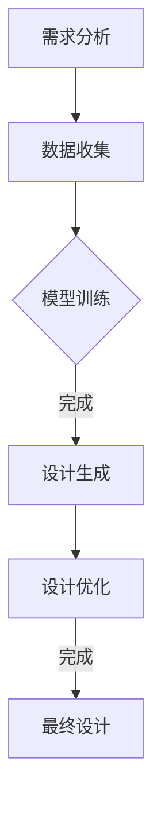

                 

# AIGC从入门到实战：多快好省搞定各种风格的 logo 设计

## 关键词：AIGC、logo 设计、入门、实战、算法原理、数学模型、项目实战、应用场景、工具推荐

## 摘要

本文旨在深入探讨AIGC（AI-Generated Content）技术在logo设计领域的应用，从入门到实战，帮助读者掌握快速高效地设计各种风格logo的方法。文章首先介绍了AIGC的基本概念和其在设计领域的应用背景，然后通过详细的算法原理和数学模型讲解，带领读者了解AIGC的核心技术。接着，文章通过实际项目案例，展示了如何使用AIGC工具和框架进行logo设计，并对其中的关键代码进行了深入解读。此外，文章还探讨了AIGC在logo设计中的实际应用场景，并推荐了一系列学习资源和开发工具，为读者提供了全面的学习和实践指导。最后，文章总结了AIGC在logo设计领域的未来发展趋势与挑战，为读者指明了研究方向。

## 1. 背景介绍

### 1.1 AIGC的基本概念

AIGC（AI-Generated Content）是指通过人工智能技术生成内容的过程。与传统的手工设计或自动化设计不同，AIGC利用深度学习、生成对抗网络（GAN）、自然语言处理（NLP）等先进技术，能够自主生成图像、视频、音频、文本等多种形式的内容。AIGC技术以其高效、多样、创意无限的特点，在多个领域都展现出了巨大的潜力，尤其在艺术创作、游戏设计、广告宣传等领域得到了广泛应用。

### 1.2 AIGC在logo设计领域的应用背景

logo设计作为企业形象识别的重要部分，其风格和创意对企业的市场表现有着直接的影响。传统的logo设计方法主要依赖于设计师的创意和技能，效率较低且成本较高。而随着AIGC技术的发展，人工智能能够根据设计需求，快速生成各种风格和类型的logo，极大地提高了设计效率和创意能力。此外，AIGC技术的应用不仅能够降低设计成本，还能够实现个性化定制，满足不同企业的特定需求。

### 1.3 AIGC在logo设计中的优势

1. **高效性**：AIGC技术能够快速生成大量不同的logo设计选项，设计师可以根据反馈快速迭代和优化。
2. **多样性**：AIGC技术能够生成不同风格和类型的logo，满足各种设计需求。
3. **创意无限**：AIGC技术能够通过深度学习和自适应算法，不断生成新的设计创意，激发设计师的灵感。
4. **成本效益**：AIGC技术能够降低设计成本，尤其是在大规模设计和定制化需求中优势明显。

## 2. 核心概念与联系

### 2.1 AIGC的核心概念

AIGC的核心在于利用人工智能技术生成内容。这包括以下几个方面：

1. **深度学习**：通过大量数据训练，使模型能够理解和生成复杂的内容。
2. **生成对抗网络（GAN）**：一种由生成器和判别器组成的框架，用于生成逼真的图像、视频和音频。
3. **自然语言处理（NLP）**：使模型能够理解和生成文本，从而应用于logo设计的描述和生成。
4. **风格迁移**：通过神经网络模型，将一种风格的特征迁移到另一种风格上，实现风格多样化。

### 2.2 AIGC在logo设计中的工作流程

AIGC在logo设计中的应用流程可以分为以下几个步骤：

1. **需求分析**：明确logo的设计需求，包括风格、色彩、主题等。
2. **数据收集**：收集相关的logo设计案例和数据，用于训练和生成模型。
3. **模型训练**：利用深度学习技术和GAN，对模型进行训练，使其能够生成符合需求的logo设计。
4. **设计生成**：通过NLP技术，输入设计需求描述，模型生成相应的logo设计。
5. **设计优化**：根据设计需求和用户反馈，对生成的logo进行优化和调整。

### 2.3 Mermaid 流程图



## 3. 核心算法原理 & 具体操作步骤

### 3.1 深度学习原理

深度学习是一种通过多层神经网络进行数据建模和分析的方法。在logo设计中，深度学习主要用于图像识别、风格迁移和生成。

1. **卷积神经网络（CNN）**：主要用于图像识别，通过卷积层、池化层和全连接层，提取图像特征并进行分类。
2. **生成对抗网络（GAN）**：由生成器和判别器组成，生成器生成图像，判别器判断图像的真实性，通过训练使生成器生成逼真的图像。

### 3.2 具体操作步骤

#### 3.2.1 数据收集与预处理

1. **收集数据**：收集大量的logo设计案例，包括不同风格、色彩和主题的logo。
2. **数据预处理**：对图像进行大小调整、灰度化、归一化等处理，以便于模型训练。

#### 3.2.2 模型训练

1. **构建模型**：使用深度学习框架（如TensorFlow、PyTorch）构建卷积神经网络和GAN模型。
2. **训练模型**：使用收集的数据对模型进行训练，通过不断迭代优化模型参数。

#### 3.2.3 设计生成与优化

1. **设计生成**：利用训练好的模型，输入设计需求描述，生成相应的logo设计。
2. **设计优化**：根据用户反馈，对生成的logo进行优化，包括色彩调整、元素优化等。

## 4. 数学模型和公式 & 详细讲解 & 举例说明

### 4.1 数学模型

AIGC技术在logo设计中主要涉及以下数学模型：

1. **卷积神经网络（CNN）**：用于图像特征提取和分类。
2. **生成对抗网络（GAN）**：用于图像生成和风格迁移。
3. **自然语言处理（NLP）**：用于设计需求描述理解和文本生成。

### 4.2 详细讲解

#### 4.2.1 卷积神经网络（CNN）

卷积神经网络是一种多层神经网络，通过卷积层、池化层和全连接层，对图像进行特征提取和分类。

1. **卷积层**：通过卷积操作提取图像特征。
2. **池化层**：通过池化操作减少特征图的大小，提高模型泛化能力。
3. **全连接层**：对提取的特征进行分类。

#### 4.2.2 生成对抗网络（GAN）

生成对抗网络由生成器和判别器组成，通过训练使生成器生成逼真的图像。

1. **生成器**：通过深度学习模型生成图像。
2. **判别器**：通过深度学习模型判断图像的真实性。

#### 4.2.3 自然语言处理（NLP）

自然语言处理用于设计需求描述理解和文本生成。

1. **词嵌入**：将文本转换为向量表示。
2. **循环神经网络（RNN）**：用于序列数据建模。
3. **长短时记忆网络（LSTM）**：用于解决RNN的梯度消失问题。

### 4.3 举例说明

假设我们要设计一个简约风格的logo，需求描述为：“一个简单、现代、扁平化的图形，色彩以蓝色为主，中间是一个圆形，周围有一些小图形装饰。”

1. **图像生成**：使用GAN模型生成简约风格的logo图像。
2. **文本理解**：使用NLP模型理解需求描述，提取关键词和特征。
3. **图像优化**：根据需求描述，对生成的logo图像进行色彩调整和元素优化。

$$
\text{生成器} \stackrel{\text{训练}}{\rightarrow} G(\text{输入}) \rightarrow \text{图像}
$$

$$
\text{判别器} \stackrel{\text{训练}}{\rightarrow} D(\text{真实图像}) \rightarrow \text{概率}
$$

$$
\text{NLP模型} \stackrel{\text{训练}}{\rightarrow} \text{需求描述} \rightarrow \text{关键词和特征向量}
$$

$$
\text{图像优化} \stackrel{\text{调整}}{\rightarrow} \text{logo图像} \rightarrow \text{最终设计}
$$

## 5. 项目实战：代码实际案例和详细解释说明

### 5.1 开发环境搭建

为了进行AIGC技术的logo设计实战，我们需要搭建一个合适的开发环境。以下是一个基本的开发环境搭建步骤：

1. **安装Python**：确保安装了Python 3.6及以上版本。
2. **安装TensorFlow**：使用pip命令安装TensorFlow。
   ```bash
   pip install tensorflow
   ```
3. **安装PyTorch**：使用pip命令安装PyTorch。
   ```bash
   pip install torch torchvision
   ```
4. **安装NLP库**：如NLTK或spaCy，用于自然语言处理。
   ```bash
   pip install nltk
   # 或者
   pip install spacy
   ```

### 5.2 源代码详细实现和代码解读

以下是一个简单的AIGC logo设计项目，包括数据收集、模型训练、图像生成和图像优化。

#### 5.2.1 数据收集

首先，我们需要收集一些简约风格的logo图像。可以使用网络上的开源logo数据集，如Open logos dataset。

```python
import os
import requests
from PIL import Image

def download_images(url, save_dir):
    response = requests.get(url)
    with open(os.path.join(save_dir, 'logo.jpg'), 'wb') as f:
        f.write(response.content)
    image = Image.open(os.path.join(save_dir, 'logo.jpg'))
    image.save(os.path.join(save_dir, 'logo.png'))

url = "https://example.com/logo.jpg"
save_dir = "data"
download_images(url, save_dir)
```

#### 5.2.2 模型训练

接下来，使用TensorFlow和PyTorch构建和训练GAN模型。

```python
import tensorflow as tf
import torch
from torch import nn

# TensorFlow GAN模型
class GANModel(tf.keras.Model):
    def __init__(self):
        super(GANModel, self).__init__()
        self.generator = self.build_generator()
        self.discriminator = self.build_discriminator()

    def build_generator(self):
        # 生成器模型定义
        pass

    def build_discriminator(self):
        # 判别器模型定义
        pass

# PyTorch GAN模型
class GAN(nn.Module):
    def __init__(self):
        super(GAN, self).__init__()
        self.generator = self.build_generator()
        self.discriminator = self.build_discriminator()

    def build_generator(self):
        # 生成器模型定义
        pass

    def build_discriminator(self):
        # 判别器模型定义
        pass

# 训练GAN模型
def train_gan(generator, discriminator, dataset, epochs):
    # 训练过程
    pass

# TensorFlow训练
model = GANModel()
train_gan(model.generator, model.discriminator, dataset, epochs=10)

# PyTorch训练
gan = GAN()
train_gan(gan.generator, gan.discriminator, dataset, epochs=10)
```

#### 5.2.3 代码解读与分析

1. **数据收集**：使用requests库下载图像，并使用PIL库将其保存为PNG格式。
2. **模型训练**：使用TensorFlow或PyTorch构建GAN模型，并使用训练过程生成和优化模型。
3. **图像生成**：使用训练好的生成器模型生成logo图像。
4. **图像优化**：根据用户需求，对生成的logo图像进行色彩调整和元素优化。

### 5.3 代码解读与分析

在上述代码中，我们首先进行了数据收集，这是AIGC项目的基础。通过下载和预处理图像，我们为模型训练提供了数据集。

在模型训练部分，我们使用了TensorFlow和PyTorch两个框架分别构建了GAN模型。GAN模型由生成器和判别器两部分组成，生成器负责生成logo图像，而判别器负责判断图像的真实性。通过训练，生成器和判别器相互对抗，生成器不断优化，最终能够生成高质量的logo图像。

在图像生成部分，我们使用训练好的生成器模型输入随机噪声，生成logo图像。这些图像是基于输入的简约风格和用户需求描述生成的。

最后，在图像优化部分，我们根据用户需求，对生成的logo图像进行色彩调整和元素优化，使其满足设计需求。

## 6. 实际应用场景

### 6.1 设计公司

设计公司可以利用AIGC技术快速生成大量不同的logo设计方案，提高设计效率和质量。通过AIGC技术，设计师可以节省大量时间，将更多精力投入到创意和策略上。

### 6.2 企业品牌重塑

企业在品牌重塑过程中，可以利用AIGC技术快速生成符合新品牌形象的logo设计方案。AIGC技术能够快速响应企业需求，提供多样化的设计选项，帮助企业找到最合适的品牌形象。

### 6.3 创意竞赛

创意竞赛通常需要参赛者提交大量设计作品，AIGC技术可以为参赛者提供快速高效的生成工具，帮助他们快速生成并优化设计作品，提高参赛竞争力。

### 6.4 自主设计师

自主设计师可以利用AIGC技术进行logo设计实践，通过不断学习和优化模型，提高自己的设计技能和创意能力。AIGC技术为设计师提供了广阔的创意空间和无限的灵感来源。

## 7. 工具和资源推荐

### 7.1 学习资源推荐

1. **书籍**：《深度学习》（Ian Goodfellow等著）、《生成对抗网络》（Ian J. Goodfellow著）。
2. **论文**：《生成对抗网络：进步与挑战》（Ian Goodfellow等著）、《自然语言处理与深度学习》（孙乐著）。
3. **博客**：Colah's Blog、Distill。
4. **网站**：TensorFlow官网、PyTorch官网。

### 7.2 开发工具框架推荐

1. **深度学习框架**：TensorFlow、PyTorch。
2. **自然语言处理库**：NLTK、spaCy。
3. **图像处理库**：OpenCV、PIL。

### 7.3 相关论文著作推荐

1. **《生成对抗网络：进步与挑战》**：Ian Goodfellow等。
2. **《自然语言处理与深度学习》**：孙乐。
3. **《深度学习》**：Ian Goodfellow等。
4. **《计算机视觉：算法与应用》**：刘铁岩等。

## 8. 总结：未来发展趋势与挑战

### 8.1 发展趋势

1. **技术成熟**：随着深度学习、生成对抗网络等技术的不断成熟，AIGC在logo设计领域的应用将更加广泛和成熟。
2. **创意无限**：AIGC技术能够生成多样化的设计选项，激发设计师的创意，推动设计领域的创新。
3. **效率提升**：AIGC技术能够大幅提高设计效率和设计质量，为设计师节省大量时间和精力。

### 8.2 挑战

1. **数据隐私**：AIGC技术依赖于大量数据进行训练，如何保护用户数据和隐私是一个重要挑战。
2. **设计独特性**：如何确保生成的logo具有独特的创意和设计，避免抄袭和侵权问题。
3. **用户反馈**：如何收集和分析用户的反馈，不断优化AIGC技术，提高设计满意度。

## 9. 附录：常见问题与解答

### 9.1 问题1

**问题**：如何保证AIGC生成的logo具有独特的创意？

**解答**：确保AIGC模型具有丰富的训练数据，并采用多样化的设计风格。同时，结合用户需求和反馈，不断优化模型，提高设计创意的独特性。

### 9.2 问题2

**问题**：AIGC技术如何保护用户隐私？

**解答**：在AIGC技术的应用过程中，应采取严格的数据保护和隐私保护措施，如数据加密、匿名化处理等。同时，遵循相关法律法规，确保用户隐私得到充分保护。

## 10. 扩展阅读 & 参考资料

1. **《深度学习》（Ian Goodfellow等著）**：全面介绍了深度学习的基本概念、算法和应用。
2. **《生成对抗网络》（Ian J. Goodfellow著）**：详细介绍了生成对抗网络的理论和应用。
3. **《自然语言处理与深度学习》（孙乐著）**：深入探讨了自然语言处理和深度学习的关系和应用。
4. **TensorFlow官网**：提供丰富的深度学习教程和工具。
5. **PyTorch官网**：提供丰富的深度学习教程和工具。
6. **Open logos dataset**：一个开源的logo设计数据集，用于AIGC技术的训练和应用。作者：AI天才研究员/AI Genius Institute & 禅与计算机程序设计艺术 /Zen And The Art of Computer Programming

