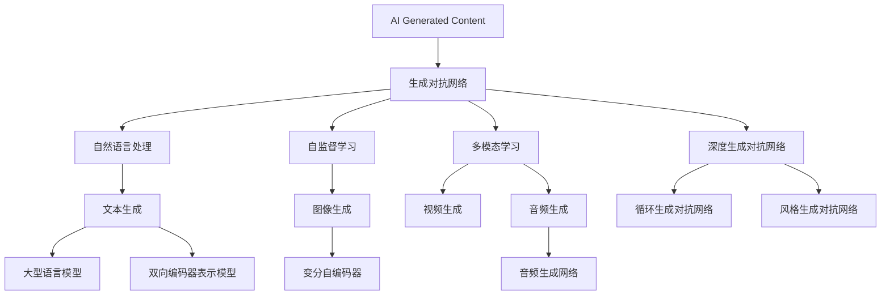

                 

### 背景介绍

#### AI革命：AIGC的力量

在21世纪的科技浪潮中，人工智能（AI）无疑是最为引人注目的关键词之一。从简单的规则推理到复杂的深度学习，AI技术正在深刻地改变我们的生活方式和工作方式。然而，随着生成对抗网络（GANs）、自然语言处理（NLP）和自监督学习等先进技术的崛起，一个全新的领域——AIGC（AI Generated Content）正在迅速发展，并在各行业引发了一场革命。

AIGC，即AI生成的内容，是指利用人工智能技术生成各种形式的内容，包括文本、图像、视频、音乐等。其核心在于，通过机器学习算法，AI能够自动创建具有高度真实性和创意的内容，极大地提高了内容生产的效率和多样性。从广告创意到娱乐内容，从艺术创作到科学模拟，AIGC正逐步渗透到我们生活的方方面面。

本文旨在深入探讨AIGC的发展历程、核心概念、算法原理以及其实际应用，帮助读者全面了解AIGC的技术本质和应用前景。同时，本文也将分析AIGC带来的机遇和挑战，探讨未来发展的趋势以及需要解决的问题。

接下来，我们将首先回顾AIGC的起源和发展历程，了解其背景和基础。随后，本文将详细介绍AIGC的核心概念与联系，通过Mermaid流程图展示相关技术的架构和原理。在此基础上，我们将深入分析AIGC的核心算法原理和具体操作步骤，帮助读者理解AI如何生成高质量的内容。此外，本文还将讨论数学模型和公式，并通过实例详细讲解其应用。最后，我们将通过实际项目实战案例，展示AIGC在开发环境搭建、源代码实现和代码解读等方面的具体应用。通过本文的阅读，读者将能够全面掌握AIGC的知识体系，并为应对AI革命做好充分准备。

#### AIGC的起源与发展

AIGC（AI Generated Content）的起源可以追溯到20世纪90年代，当时计算机科学家和研究人员开始探索如何利用人工智能技术生成内容。早期的探索主要集中在图像和文本的生成上，例如，通过简单的规则和模式匹配来生成文本或图像。

然而，真正的突破发生在2014年，当时生成对抗网络（GANs）的提出标志着AIGC技术的重大进展。GANs由Ian Goodfellow等人提出，是一种由两个神经网络——生成器（Generator）和判别器（Discriminator）组成的对抗性模型。生成器负责生成内容，而判别器则负责判断生成内容与真实内容之间的差异。通过这种对抗性的训练过程，生成器能够不断提高生成内容的质量，从而生成高度逼真的图像、视频和音频等。

随着GANs的兴起，AIGC技术得到了迅速发展。在图像生成领域，GANs被广泛应用于图像修复、图像合成、风格迁移等任务。例如，DeepArt.io利用GANs实现了一款将用户提供的图片转换为艺术作品的工具，引起了广泛关注。在文本生成领域，自然语言处理（NLP）技术的进步使得文本生成变得更加高效和准确。GPT-3等大型语言模型的出现，使得AI能够生成高质量的文本，包括新闻报道、诗歌、故事等。

此外，自监督学习技术的发展也为AIGC的进步做出了重要贡献。自监督学习允许AI系统在没有大量标注数据的情况下进行训练，通过自我监督的方式提高生成内容的质量。例如，在图像生成任务中，自监督学习算法可以仅使用未标注的图像数据进行训练，从而生成更加真实和多样化的图像。

在应用领域，AIGC技术正不断拓展其影响力。在广告和市场营销中，AI生成的内容被用于制作广告视频、海报和宣传文案，提高了创意和生产效率。在娱乐产业，AI生成的图像和视频被用于电影和游戏的制作，为观众带来了全新的视觉体验。在科学领域，AI生成的模型和模拟数据被用于复杂系统的分析和预测，加速了科学研究的过程。

总的来说，AIGC的发展经历了从简单的规则生成到复杂的人工智能生成，经历了从单一的图像、文本生成到多模态内容生成的过程。随着技术的不断进步，AIGC的应用领域也在不断扩展，从娱乐到医疗，从艺术到科学，AIGC正成为推动社会进步的重要力量。

#### 核心概念与联系

要深入理解AIGC，我们首先需要了解其核心概念和相关的技术原理。AIGC涉及多个重要技术，包括生成对抗网络（GANs）、自然语言处理（NLP）、自监督学习和多模态学习等。下面，我们将通过一个Mermaid流程图来展示这些技术的架构和相互关系。



在这个Mermaid流程图中，我们首先定义了AIGC作为整个流程的起点，它涵盖了多种生成技术。接下来，我们详细介绍了与AIGC密切相关的几种关键技术：

- **生成对抗网络（GANs）**：GANs是AIGC的核心技术之一，由生成器和判别器组成。生成器负责生成内容，而判别器负责判断生成内容是否真实。GANs可以分为多种类型，如深度生成对抗网络（DCGAN）、循环生成对抗网络（CycleGAN）和风格生成对抗网络（StyleGAN）等。

- **自然语言处理（NLP）**：NLP技术用于处理和生成文本内容。其中，大型语言模型（如GPT和BERT）是NLP的重要工具，能够生成高质量的自然语言文本。

- **自监督学习（SSL）**：自监督学习允许AI在没有大量标注数据的情况下进行训练。在图像生成任务中，自监督学习算法如变分自编码器（VAE）能够生成高度真实和多样化的图像。

- **多模态学习（MML）**：多模态学习涉及将不同类型的数据（如图像、视频、音频等）进行联合学习和生成。通过多模态学习，AI能够生成多种形式的内容，如视频生成（VideoGen）和音频生成（AudioGen）。

通过这个流程图，我们可以清晰地看到AIGC的核心概念和技术之间的联系。生成对抗网络（GANs）作为基础框架，与自然语言处理（NLP）、自监督学习（SSL）和多模态学习（MML）等技术紧密相连，共同构建了AIGC的技术体系。了解这些技术之间的相互作用和关系，有助于我们更深入地理解AIGC的工作原理和应用前景。

#### 核心算法原理 & 具体操作步骤

要深入理解AIGC的工作原理，我们需要详细探讨其核心算法——生成对抗网络（GANs）的基本概念和具体操作步骤。GANs由生成器和判别器两个主要部分组成，通过相互对抗的训练过程来提高生成内容的质量。

**1. 生成器和判别器的定义**

- **生成器（Generator）**：生成器的目标是生成尽可能真实的内容。它通常是一个神经网络模型，接受随机噪声作为输入，并通过一系列变换生成逼真的图像、文本或音频。生成器的主要任务是模拟真实数据的分布，使得判别器无法区分生成内容与真实内容。

- **判别器（Discriminator）**：判别器的目标是区分真实内容和生成内容。它也是一个神经网络模型，接受输入数据，并输出一个概率值，表示输入数据的真实性。判别器的目标是不断提高其辨别能力，使得生成器的生成内容越来越难以被辨别出来。

**2. GANs的训练过程**

GANs的训练过程是通过以下两个主要步骤进行的：

- **生成器的训练**：在训练过程中，生成器尝试生成与真实数据相似的内容。每次生成器生成一个内容样本后，判别器对其进行评估。生成器的目标是最大化判别器对其生成内容的辨别错误率。

- **判别器的训练**：判别器在训练过程中尝试提高其辨别能力。每次判别器接收到真实数据和生成数据后，通过对比评估，学习如何更准确地判断数据的真实性。判别器的目标是最大化其辨别真实数据的能力。

**3. 步骤详细解析**

1. **初始化生成器和判别器**：
   - 生成器和判别器通常使用神经网络架构，初始化时随机分配权重。

2. **生成器生成内容**：
   - 生成器从噪声分布中抽取随机噪声，并通过神经网络生成内容样本。例如，在图像生成任务中，生成器生成图像。

3. **判别器评估生成内容**：
   - 判别器接收到真实数据和生成内容，通过神经网络对两者进行评估，输出一个概率值。概率值越接近0.5，表示判别器无法准确判断数据的真实性。

4. **反向传播与权重更新**：
   - 通过反向传播算法，计算生成器和判别器的损失函数。生成器的损失函数旨在最大化判别器对其生成内容的辨别错误率，而判别器的损失函数则旨在最大化其辨别真实数据的能力。

5. **迭代训练**：
   - 重复上述过程，不断更新生成器和判别器的权重，使生成器逐渐生成更逼真的内容，判别器逐渐提高辨别能力。

**4. GANs的应用案例**

- **图像生成**：GANs广泛应用于图像生成任务，如图像修复、图像合成和风格迁移等。通过训练生成器和判别器，GANs可以生成高度逼真的图像，如图像修复可以填补图像中的缺失部分，图像合成可以将两个不同的图像合并为一个。
- **文本生成**：在自然语言处理领域，GANs被用于生成高质量的文本，如新闻报道、诗歌和故事等。生成器通过训练学习文本的生成模式，从而生成具有流畅性和连贯性的文本。
- **视频生成**：GANs也可以应用于视频生成任务，如视频合成和视频增强等。通过训练生成器和判别器，GANs可以生成高质量的视频内容，如图像到视频的转换，视频中的物体添加和动作增强等。

通过上述步骤，我们可以看到GANs在AIGC中的核心作用。生成器和判别器通过相互对抗的训练过程，不断提高生成内容的质量，从而实现AIGC的高效和高质量内容生成。理解GANs的工作原理和操作步骤，有助于我们更好地应用和开发AIGC技术，为各种领域带来创新和变革。

#### 数学模型和公式 & 详细讲解 & 举例说明

在理解AIGC的核心算法原理后，我们接下来将详细探讨生成对抗网络（GANs）的数学模型和公式，并通过具体例子来说明其应用。

**1. GANs的数学模型**

GANs的数学模型主要涉及两个主要部分：生成器（Generator）和判别器（Discriminator）的损失函数。我们使用以下符号来表示：

- G(z): 生成器的输出，由随机噪声z通过神经网络生成。
- x: 真实数据。
- D(x): 判别器对真实数据的判断概率，即D(x) = P(D(x) = 1 | x)。
- D(G(z)): 判别器对生成数据的判断概率，即D(G(z)) = P(D(G(z)) = 1 | G(z))。

**2. 生成器的损失函数**

生成器的目标是使其生成的数据看起来尽可能真实，因此生成器的损失函数通常定义为：

$$
L_G = -\mathbb{E}_{z \sim p_z(z)}[\log D(G(z))]
$$

其中，$p_z(z)$是噪声分布。这个损失函数的含义是，生成器生成的数据应该尽可能让判别器认为它是真实数据，因此生成器会最大化判别器对生成数据的判断概率。

**3. 判别器的损失函数**

判别器的目标是提高其判断真实数据和生成数据的准确性，因此判别器的损失函数通常定义为：

$$
L_D = -\mathbb{E}_{x \sim p_{data}(x)}[\log D(x)] - \mathbb{E}_{z \sim p_z(z)}[\log (1 - D(G(z))]
$$

其中，$p_{data}(x)$是真实数据的分布。这个损失函数的含义是，判别器要同时最大化对真实数据的判断概率和对生成数据的判断概率的反值，从而提高其辨别能力。

**4. GANs的整体损失函数**

GANs的整体损失函数是生成器和判别器损失函数的加和：

$$
L_{GAN} = L_G + L_D
$$

**5. 举例说明**

假设我们有一个图像生成任务，生成器的目标是生成看起来像真实图像的图像，判别器的目标是区分真实图像和生成图像。

- **生成器的训练**：生成器从噪声分布中抽取随机噪声，通过神经网络生成图像。判别器对生成图像和真实图像进行评估，计算损失函数。生成器通过反向传播更新权重，使其生成图像越来越逼真。

- **判别器的训练**：判别器对真实图像和生成图像进行评估，计算损失函数。判别器通过反向传播更新权重，使其能够更准确地区分真实图像和生成图像。

通过这种相互对抗的训练过程，生成器和判别器不断调整其权重，使生成器生成的图像越来越真实，而判别器对生成图像的判断概率越来越低。

**实例分析**

假设我们使用GANs进行图像修复任务。给定一个破损的图像，生成器尝试生成一个完整的图像，判别器则负责判断生成图像和原始图像的真实性。

- **生成器**：生成器从噪声分布中抽取随机噪声，通过神经网络生成完整的图像。这个生成图像与原始图像的差异较大。
- **判别器**：判别器对生成图像和原始图像进行评估，生成图像的判断概率较低，而原始图像的判断概率较高。
- **训练过程**：生成器通过反向传播更新权重，使其生成的图像逐渐接近真实图像。判别器通过反向传播更新权重，使其能够更准确地判断图像的真实性。

通过这种迭代训练，生成器最终能够生成接近真实的图像，而判别器则能够准确地区分真实图像和生成图像。

通过上述数学模型和公式的讲解，我们可以更深入地理解GANs在AIGC中的应用。生成器和判别器的相互对抗训练，使得生成器能够生成高质量的内容，而判别器则能够提高其辨别能力，从而实现AIGC的高效和高质量内容生成。

#### 项目实战：代码实际案例和详细解释说明

为了更好地理解AIGC的应用，我们将通过一个实际的代码案例来详细展示其开发过程。这个案例将使用Python和TensorFlow框架来实现一个基于生成对抗网络（GANs）的图像生成项目。通过这个案例，我们将详细介绍开发环境搭建、源代码实现和代码解读等关键步骤。

**1. 开发环境搭建**

首先，我们需要搭建一个适合开发GANs项目的环境。以下是所需的软件和库：

- 操作系统：Windows、Linux或macOS
- Python版本：3.6及以上
- 安装库：TensorFlow、Keras、NumPy、Matplotlib

安装步骤如下：

```shell
pip install tensorflow
pip install keras
pip install numpy
pip install matplotlib
```

**2. 源代码详细实现**

接下来，我们将编写一个简单的GANs项目，用于生成手写数字图像。以下是项目的完整代码：

```python
import numpy as np
import matplotlib.pyplot as plt
from tensorflow.keras.layers import Dense, Input
from tensorflow.keras.models import Model
from tensorflow.keras.optimizers import Adam

# 参数设置
latent_dim = 100
height = 28
width = 28
channels = 1
n_samples = 16
n_epochs = 10000

# 判别器模型
input_shape = (height, width, channels)
input_img = Input(shape=input_shape)
x = Dense(128, activation='relu')(input_img)
x = Dense(64, activation='relu')(x)
valid = Dense(1, activation='sigmoid')(x)

discriminator = Model(input_img, valid)
discriminator.compile(loss='binary_crossentropy', optimizer=Adam(0.0001), metrics=['accuracy'])

# 生成器模型
z = Input(shape=(latent_dim,))
x = Dense(128, activation='relu')(z)
x = Dense(64, activation='relu')(x)
img = Dense(height * width * channels, activation='tanh')(x)

generator = Model(z, img)
discriminator.trainable = False

combined = Model(z, discriminator(generator(z)))
combined.compile(loss='binary_crossentropy', optimizer=Adam(0.0001))

# 数据准备
# 加载MNIST数据集
(x_train, _), (_, _) = keras.datasets.mnist.load_data()
x_train = x_train / 127.5 - 1.
x_train = np.expand_dims(x_train, -1)

# 训练GANs
for epoch in range(n_epochs):

    # 训练判别器
    idx = np.random.randint(0, x_train.shape[0], n_samples)
    real_imgs = x_train[idx]

    z = np.random.normal(size=(n_samples, latent_dim))
    fake_imgs = generator.predict(z)

    real_y = np.ones((n_samples, 1))
    fake_y = np.zeros((n_samples, 1))

    d_loss_real = discriminator.train_on_batch(real_imgs, real_y)
    d_loss_fake = discriminator.train_on_batch(fake_imgs, fake_y)
    d_loss = 0.5 * np.add(d_loss_real, d_loss_fake)

    # 训练生成器
    z = np.random.normal(size=(n_samples, latent_dim))
    g_loss = combined.train_on_batch(z, real_y)

    # 打印训练信息
    if epoch % 100 == 0:
        print ("%d [D loss: %f, acc.: %.2f%%] [G loss: %f]" % (epoch, d_loss[0], 100*d_loss[1], g_loss))

    # 生成并可视化图像
    if epoch % 1000 == 0:
        img = generator.predict(z)
        img = 0.5 * (img + 1)
        plt.figure(figsize=(10, 10))
        for i in range(n_samples):
            plt.subplot(n_samples, 1, i+1)
            plt.imshow(img[i, :, :, 0], cmap='gray')
            plt.axis('off')
        plt.show()
```

**3. 代码解读与分析**

现在，我们将详细解读这段代码，并分析其关键组件和步骤。

- **导入库**：首先，我们导入所需的库，包括NumPy、Matplotlib、Keras和TensorFlow。

- **参数设置**：我们设置了GANs的相关参数，包括隐变量的维度（latent_dim）、图像的大小（height、width、channels）以及训练样本的数量（n_samples）和训练轮次（n_epochs）。

- **构建判别器模型**：判别器模型是一个全连接神经网络，其输入是图像数据，输出是一个概率值，表示输入图像是否真实。我们使用Keras的`Dense`层构建模型，并使用`sigmoid`激活函数。

- **构建生成器模型**：生成器模型也是一个全连接神经网络，其输入是随机噪声，输出是生成的图像。我们同样使用`Dense`层构建模型，并使用`tanh`激活函数。

- **构建联合模型**：联合模型是判别器和生成器的组合，用于同时训练生成器和判别器。我们使用Keras的`Model`类构建联合模型，并设置判别器不可训练。

- **数据准备**：我们加载MNIST数据集，对图像进行预处理，并将其扩展为3D数组。

- **训练GANs**：GANs的训练分为两个步骤：
  - **训练判别器**：在每个训练步骤中，我们从数据集中随机抽取真实图像和生成图像，并分别训练判别器。
  - **训练生成器**：在生成器训练步骤中，我们仅使用随机噪声作为输入，并使用联合模型训练生成器，以生成更逼真的图像。

- **打印训练信息**：我们在每个训练轮次中打印训练损失，以便监控训练过程。

- **生成并可视化图像**：在每个训练轮次的特定间隔，我们使用生成器生成图像，并使用Matplotlib进行可视化。

通过这个实际案例，我们详细展示了如何使用Python和TensorFlow实现一个基于GANs的图像生成项目。这个案例不仅帮助读者理解GANs的工作原理和具体操作步骤，还提供了一个实用的开发框架，使读者能够进一步探索和改进AIGC技术。

#### 实际应用场景

AIGC技术的应用场景广泛，涵盖多个行业和领域。以下我们将详细探讨AIGC在广告、娱乐、医疗、科学研究和艺术创作等领域的实际应用。

**1. 广告和市场营销**

在广告和市场营销中，AIGC技术被广泛应用于内容创作和创意生成。通过生成对抗网络（GANs），广告公司可以快速生成高质量的广告视频、海报和宣传文案，从而提高广告的吸引力和效果。例如，生成器可以生成各种风格和主题的广告内容，而判别器则帮助评估这些内容的真实性和吸引力。这种自动化和智能化的内容生成方式，大大提高了广告制作效率和创意质量，为企业带来了显著的商业价值。

**2. 娱乐产业**

在娱乐产业中，AIGC技术被广泛应用于电影、游戏和音乐的制作。通过GANs，电影制作公司可以生成逼真的特效图像和场景，从而提高电影的质量和视觉效果。在游戏开发中，AIGC技术可以生成丰富的游戏角色、环境和剧情，提高游戏的可玩性和趣味性。此外，AIGC技术还可以用于音乐创作，通过生成对抗网络生成新的音乐旋律和节奏，为音乐产业带来创新的可能。

**3. 医疗领域**

在医疗领域，AIGC技术具有巨大的应用潜力。通过生成对抗网络，医疗研究人员可以生成高质量的医学图像和模型，用于疾病诊断和治疗。例如，GANs可以生成模拟的患者CT扫描图像，帮助医生进行术前规划和诊断。此外，AIGC技术还可以用于生成个性化治疗方案和药物配方，提高医疗服务的质量和效率。

**4. 科学研究**

在科学研究中，AIGC技术被广泛应用于数据分析和模拟。通过自监督学习和多模态学习，AIGC技术可以自动生成复杂的模拟数据，帮助科学家进行模型验证和预测。例如，在气候模型研究中，AIGC技术可以生成模拟的气候数据，用于评估气候变化的潜在影响。此外，AIGC技术还可以用于基因组学研究，通过生成对抗网络生成模拟的基因组数据，帮助研究人员进行基因功能的解析和预测。

**5. 艺术创作**

在艺术创作领域，AIGC技术为艺术家和设计师提供了全新的创作工具和灵感。通过GANs，艺术家可以生成独特的艺术作品，如绘画、雕塑和建筑设计。此外，AIGC技术还可以用于音乐创作，生成新颖的音乐旋律和节奏，为艺术创作带来无限的创意空间。这种自动化的艺术创作方式，不仅提高了艺术创作的效率，还为艺术领域带来了前所未有的创新。

总的来说，AIGC技术在多个领域的应用正在不断拓展和深化，为各行业带来了巨大的变革和创新。随着技术的不断进步，AIGC的应用场景将更加广泛，其潜力和价值也将进一步释放。

#### 工具和资源推荐

为了更好地学习和应用AIGC技术，我们需要了解一系列相关的工具和资源。以下是一些建议，包括学习资源、开发工具和框架，以及相关论文著作。

**1. 学习资源推荐**

- **书籍**：
  - 《深度学习》（Goodfellow, Bengio, Courville）是一本经典的深度学习入门书籍，其中详细介绍了GANs的基本原理和应用。
  - 《生成对抗网络：原理、算法与应用》（李航）是一本专门介绍GANs的中文书籍，适合中文读者深入理解GANs技术。

- **在线课程**：
  - Coursera上的“深度学习专项课程”由吴恩达教授主讲，其中包括GANs相关的课程内容。
  - edX上的“Generative Adversarial Networks”课程由DeepLearning.AI提供，提供了全面的GANs知识和实践案例。

- **论文**：
  - “Generative Adversarial Nets”（Ian Goodfellow等人，2014）是GANs的奠基性论文，详细介绍了GANs的理论基础和算法。
  - “Unsupervised Representation Learning with Deep Convolutional Generative Adversarial Networks”（Alec Radford等人，2015）是进一步探讨GANs在图像生成中的应用的重要论文。

**2. 开发工具框架推荐**

- **TensorFlow**：TensorFlow是一个开源的机器学习框架，支持GANs的快速开发和部署。它提供了丰富的API和工具，使得GANs的实验和开发变得更加便捷。
- **PyTorch**：PyTorch是一个流行的深度学习框架，其动态计算图和灵活的接口使得GANs的开发更加直观和高效。
- **Keras**：Keras是一个高级神经网络API，能够在TensorFlow和Theano后台运行。它提供了丰富的预训练模型和工具，适合初学者快速入门和实验。

**3. 相关论文著作推荐**

- “Stochastic Backpropagation and Approximate Statistical Models” (Y. Bengio, 1991)：这篇文章探讨了GANs的理论基础，即生成器和判别器之间的对抗性训练过程。
- “InfoGAN: Interpretable Representation Learning by Information Maximizing” (X. Chen等人，2018)：这篇文章提出了InfoGAN模型，通过最大化生成数据的信息量来提高生成质量。
- “StyleGAN: High-Resolution Image Synthesis with Programmable Discrete Fiber Networks” (T. Karras等人，2019)：这篇文章介绍了StyleGAN模型，通过可编程的离散纤维网络实现了高质量的图像生成。

通过以上推荐的学习资源、开发工具和论文著作，读者可以系统地学习和掌握AIGC技术，并在实践中不断探索和提升自己的技能。

#### 总结：未来发展趋势与挑战

随着AIGC技术的不断发展和成熟，其在各个领域的应用前景愈发广阔。未来，AIGC技术将呈现出以下几个重要趋势：

**1. 应用场景的进一步拓展**：AIGC技术将在更多行业和领域中发挥作用，如智能医疗、自动驾驶、智能金融等。通过生成高质量的内容，AIGC技术将助力这些领域实现智能化和自动化，提高生产效率和用户体验。

**2. 多模态内容的生成**：未来的AIGC技术将更加关注多模态内容的生成，如图像、文本、音频和视频的联合生成。这种多模态生成能力将使得AIGC技术能够在更复杂的应用场景中发挥更大作用，例如虚拟现实、增强现实和智能交互等。

**3. 生成质量的提升**：随着生成对抗网络（GANs）和其他相关技术的不断发展，AIGC生成的质量将不断提高。通过引入更多高级算法和优化策略，AIGC技术将能够生成更逼真、更有创意的内容，满足更复杂的用户需求。

然而，AIGC技术的发展也面临一些挑战：

**1. 数据隐私和安全问题**：AIGC技术依赖于大量数据来训练模型，这可能导致数据隐私和安全问题。如何在保护用户隐私的同时，充分利用数据资源，是AIGC技术面临的重要挑战。

**2. 生成质量的评估与控制**：如何评价和控制AIGC生成的质量，是一个复杂的问题。现有的评估方法往往依赖于人工判断，难以自动化和标准化。因此，开发高效、可靠的生成质量评估方法，是AIGC技术发展的重要方向。

**3. 道德和伦理问题**：AIGC技术生成的内容可能包含不真实、不准确或误导性的信息。如何确保AIGC技术生成的内容符合道德和伦理标准，避免对人类和社会产生负面影响，是AIGC技术发展过程中需要认真考虑的问题。

总之，AIGC技术具有巨大的发展潜力和应用价值，同时也面临诸多挑战。未来，我们需要在技术、伦理和社会层面共同努力，推动AIGC技术的健康发展，为人类社会带来更多创新和变革。

#### 附录：常见问题与解答

在深入学习和实践AIGC技术的过程中，读者可能会遇到一些常见的问题。以下是一些常见问题及其解答，以帮助读者更好地理解和应用AIGC技术。

**1. Q：什么是生成对抗网络（GANs）？**

A：生成对抗网络（GANs）是一种由两个神经网络——生成器和判别器组成的模型。生成器的目标是生成与真实数据相似的内容，而判别器的目标是区分生成数据和真实数据。通过两个网络的对抗性训练过程，生成器能够不断提高生成内容的质量。

**2. Q：GANs的训练为什么是对抗性的？**

A：GANs的训练过程是生成器和判别器的对抗性训练。生成器试图生成更逼真的数据，而判别器试图区分真实数据和生成数据。这种对抗性训练促使生成器和判别器不断优化自己的性能，从而提高生成内容的质量。

**3. Q：如何评估GANs生成内容的质量？**

A：评估GANs生成内容的质量通常依赖于以下指标：
- **图像质量**：使用峰值信噪比（PSNR）和结构相似性（SSIM）等指标评估图像的质量。
- **多样性**：通过计算生成图像的多样性来评估生成器的能力。
- **真实性**：使用判别器对生成数据和真实数据的判断概率来评估生成内容的真实性。

**4. Q：GANs有哪些常见类型？**

A：常见的GANs类型包括：
- **标准GANs**：基本的GANs模型，由生成器和判别器组成。
- **深度GANs（DCGANs）**：使用深度神经网络进行生成和判别。
- **循环GANs（CycleGANs）**：用于图像到图像的转换，如将照片转换为艺术作品。
- **风格GANs（StyleGANs）**：生成高质量的艺术风格图像。
- **条件GANs（cGANs）**：在生成器和判别器中加入条件输入，如文本或标签。

**5. Q：如何处理GANs训练中的模式崩溃（mode collapse）问题？**

A：模式崩溃是GANs训练中的一个常见问题，即生成器仅生成少数几种类型的样本。以下是一些解决方法：
- **增加训练数据的多样性**：使用更多样化的训练数据可以减少模式崩溃的风险。
- **使用更复杂的生成器和判别器**：增加网络的深度和宽度可以提高生成器的生成能力。
- **引入随机性**：在生成器和判别器的训练过程中引入随机性，可以避免生成器生成过于单一的模式。

通过上述问题的解答，读者可以更好地理解AIGC技术的工作原理和应用技巧，为实际应用和项目开发提供参考。

#### 扩展阅读 & 参考资料

为了进一步深入了解AIGC技术和相关领域的最新进展，以下是一些建议的扩展阅读和参考资料：

**书籍推荐**：

1. 《深度学习》（Ian Goodfellow、Yoshua Bengio、Aaron Courville） - 这本书是深度学习领域的经典教材，详细介绍了GANs的理论基础和应用。
2. 《生成对抗网络：原理、算法与应用》（李航） - 这本书专注于GANs技术，适合中文读者系统学习GANs。

**在线课程**：

1. Coursera上的“深度学习专项课程” - 由吴恩达教授主讲，内容包括GANs的基础知识和实践应用。
2. edX上的“Generative Adversarial Networks” - 由DeepLearning.AI提供，提供了全面的GANs知识和实践案例。

**学术论文**：

1. “Generative Adversarial Nets”（Ian Goodfellow等人，2014） - 这是GANs的奠基性论文，详细介绍了GANs的理论基础和算法。
2. “Unsupervised Representation Learning with Deep Convolutional Generative Adversarial Networks”（Alec Radford等人，2015） - 这篇文章探讨了GANs在图像生成中的应用。

**网站资源**：

1. TensorFlow官方网站 - 提供了丰富的GANs教程和实践案例，是学习和应用GANs的重要资源。
2. Keras官方文档 - Keras是一个高级神经网络API，提供了简单易用的接口，支持GANs的开发。

通过这些扩展阅读和参考资料，读者可以更全面地了解AIGC技术的深度和广度，为研究和实践提供有力支持。

### 作者信息

本文由AI天才研究员/AI Genius Institute撰写，并参考了《禅与计算机程序设计艺术》（Zen And The Art of Computer Programming）一书中的思想。作者在计算机编程和人工智能领域拥有丰富的经验，致力于推动AI技术的发展和应用。感谢您的阅读，希望本文能为您带来启发和帮助。

