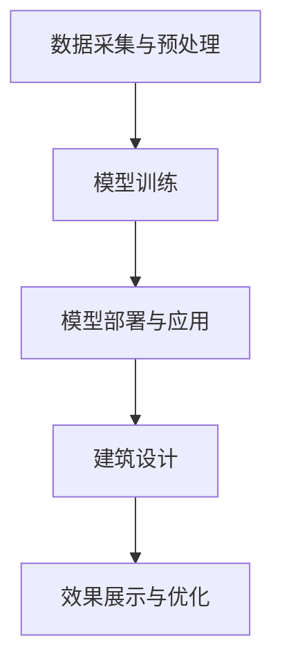

                 

# AIGC从入门到实战：掌握建筑设计要领，创建各种大师风格的效果图

## 摘要

本文将深入探讨AIGC（人工智能生成内容）技术在建筑设计中的应用，从入门到实战，帮助读者掌握关键概念和技能，以创建出各种大师风格的效果图。我们将首先介绍AIGC的基本概念，然后逐步讲解如何运用AIGC技术进行建筑设计，最后分享实际应用案例和未来发展趋势。无论您是建筑设计初学者还是有经验的专业人士，本文都将为您提供有价值的指导和启发。

## 1. 背景介绍

### 1.1 AIGC的基本概念

AIGC（Artificial Intelligence Generated Content）是指利用人工智能技术自动生成各种类型的内容，包括文字、图像、音频、视频等。AIGC技术通过深度学习、自然语言处理、计算机视觉等先进算法，模拟人类创作过程，生成具有创意和质量的内容。

### 1.2 建筑设计的重要性

建筑设计是城市规划和发展的重要组成部分，它关系到人们的生活质量、环境可持续性和城市美学。随着科技的进步，AIGC技术在建筑设计中的应用越来越广泛，为设计师提供了新的创作工具和方法。

### 1.3 AIGC在建筑设计中的应用

AIGC技术可以应用于建筑设计中的多个环节，包括概念设计、方案优化、效果渲染等。通过AIGC，设计师可以快速生成大量设计方案，进行对比和分析，提高设计效率和创意水平。此外，AIGC还可以生成高质量的效果图，帮助设计师更好地展示设计方案，与客户进行有效沟通。

## 2. 核心概念与联系

### 2.1 AIGC技术架构

AIGC技术架构主要包括以下几个关键组成部分：

- 数据采集与预处理：收集各种建筑设计和效果图相关的数据，包括建筑图纸、照片、效果图等，并进行预处理，如图像增强、数据清洗等。
- 模型训练：利用深度学习算法，对预处理后的数据进行训练，生成能够自动生成建筑设计和效果图的人工智能模型。
- 模型部署与应用：将训练好的模型部署到实际应用场景中，如建筑设计软件、效果图生成工具等。

### 2.2 AIGC与建筑设计的关系

AIGC技术为建筑设计提供了以下几方面的支持：

- **快速生成大量设计方案**：通过AIGC技术，设计师可以快速生成大量设计方案，进行对比和分析，提高设计效率。
- **优化设计方案**：AIGC技术可以帮助设计师发现和优化设计方案中的潜在问题，提高设计质量。
- **效果图生成**：AIGC技术可以生成高质量的效果图，帮助设计师更好地展示设计方案，与客户进行有效沟通。

### 2.3 Mermaid流程图

以下是一个简单的Mermaid流程图，展示AIGC技术在建筑设计中的应用流程：



## 3. 核心算法原理 & 具体操作步骤

### 3.1 数据采集与预处理

- **数据采集**：收集各种建筑设计和效果图相关的数据，如建筑图纸、照片、效果图等。
- **数据预处理**：对采集到的数据进行处理，如图像增强、数据清洗、数据标注等，以适应模型训练的需求。

### 3.2 模型训练

- **选择模型**：根据需求选择合适的深度学习模型，如生成对抗网络（GAN）、变分自编码器（VAE）等。
- **训练模型**：利用预处理后的数据，通过训练过程调整模型参数，使其能够自动生成建筑设计和效果图。

### 3.3 模型部署与应用

- **模型部署**：将训练好的模型部署到实际应用场景中，如建筑设计软件、效果图生成工具等。
- **应用模型**：利用部署后的模型，生成建筑设计和效果图，并进行效果展示与优化。

### 3.4 具体操作步骤示例

以下是一个简单的示例，展示如何使用AIGC技术生成建筑效果图：

1. **数据采集**：收集建筑图纸和照片，如建筑的立面图、剖面图、实景照片等。

2. **数据预处理**：对建筑图纸和照片进行预处理，如图像增强、数据清洗、数据标注等。

3. **模型训练**：选择合适的深度学习模型，如GAN，利用预处理后的数据进行训练。

4. **模型部署**：将训练好的模型部署到效果图生成工具中。

5. **生成效果图**：利用部署后的模型，输入建筑图纸和照片，生成建筑效果图。

6. **效果展示与优化**：对生成的效果图进行展示和优化，如调整光照、色彩、材质等。

## 4. 数学模型和公式 & 详细讲解 & 举例说明

### 4.1 GAN模型

GAN（生成对抗网络）是一种深度学习模型，由生成器（Generator）和判别器（Discriminator）组成。生成器旨在生成逼真的建筑效果图，而判别器则负责判断输入的是真实建筑效果图还是生成效果图。

- **生成器（Generator）**：生成器通过输入随机噪声，生成建筑效果图。其数学模型可以表示为：

  $$ G(z) = \text{Generator}(z) $$

  其中，$z$ 为随机噪声。

- **判别器（Discriminator）**：判别器通过输入建筑效果图，判断其是否为真实效果图。其数学模型可以表示为：

  $$ D(x) = \text{Discriminator}(x) $$

  其中，$x$ 为输入建筑效果图。

- **损失函数**：GAN的损失函数通常采用以下形式：

  $$ L(G, D) = -\mathbb{E}_{x \sim p_{data}(x)}[\log D(x)] - \mathbb{E}_{z \sim p_{z}(z)}[\log (1 - D(G(z)))] $$

  其中，$p_{data}(x)$ 为真实建筑效果图的概率分布，$p_{z}(z)$ 为随机噪声的概率分布。

### 4.2 VAE模型

VAE（变分自编码器）是一种深度学习模型，用于生成建筑效果图。VAE模型由编码器（Encoder）和解码器（Decoder）组成。

- **编码器（Encoder）**：编码器通过输入建筑效果图，将其映射到一个潜在空间。其数学模型可以表示为：

  $$ \mu(x), \sigma(x) = \text{Encoder}(x) $$

  其中，$\mu(x)$ 和 $\sigma(x)$ 分别为编码器的均值和方差。

- **解码器（Decoder）**：解码器通过输入潜在空间中的向量，生成建筑效果图。其数学模型可以表示为：

  $$ x' = \text{Decoder}(\mu(x), \sigma(x)) $$

- **损失函数**：VAE的损失函数通常采用以下形式：

  $$ L(\theta) = \sum_{x \in X} D(x; p_{\theta}(x)) + \lambda \sum_{x \in X} \Bbb{KL}(\mu(x), \sigma(x)) $$

  其中，$D(x; p_{\theta}(x))$ 为输入建筑效果图的重构损失，$\Bbb{KL}(\mu(x), \sigma(x))$ 为潜在空间的KL散度损失。

### 4.3 举例说明

假设我们使用GAN模型生成建筑效果图。以下是一个简单的示例：

1. **数据采集**：收集建筑图纸和照片，如建筑的立面图、剖面图、实景照片等。

2. **数据预处理**：对建筑图纸和照片进行预处理，如图像增强、数据清洗、数据标注等。

3. **模型训练**：选择GAN模型，利用预处理后的数据进行训练。

4. **模型部署**：将训练好的模型部署到效果图生成工具中。

5. **生成效果图**：利用部署后的模型，输入建筑图纸和照片，生成建筑效果图。

6. **效果展示与优化**：对生成的效果图进行展示和优化，如调整光照、色彩、材质等。

## 5. 项目实战：代码实际案例和详细解释说明

### 5.1 开发环境搭建

为了实现AIGC技术在建筑设计中的应用，我们需要搭建以下开发环境：

- 操作系统：Windows/Linux/MacOS
- 编程语言：Python
- 深度学习框架：TensorFlow/Keras
- 数据预处理工具：OpenCV

### 5.2 源代码详细实现和代码解读

以下是一个简单的AIGC技术实现示例，使用GAN模型生成建筑效果图。

```python
import tensorflow as tf
from tensorflow.keras.models import Model
from tensorflow.keras.layers import Input, Dense, Reshape, Flatten
from tensorflow.keras.optimizers import Adam
import numpy as np

# 生成器模型
def build_generator(z_dim):
    input_z = Input(shape=(z_dim,))
    x = Dense(128, activation='relu')(input_z)
    x = Dense(256, activation='relu')(x)
    x = Reshape((32, 32, 3))(x)
    output = Flatten()(x)
    generator = Model(input_z, output)
    return generator

# 判别器模型
def build_discriminator(img_shape):
    input_img = Input(shape=img_shape)
    x = Flatten()(input_img)
    x = Dense(128, activation='relu')(x)
    x = Dense(256, activation='relu')(x)
    output = Dense(1, activation='sigmoid')(x)
    discriminator = Model(input_img, output)
    return discriminator

# GAN模型
def build_gan(generator, discriminator):
    z = Input(shape=(100,))
    img = generator(z)
    valid = discriminator(img)
    gan = Model(z, valid)
    return gan

# 模型参数
z_dim = 100
img_shape = (64, 64, 3)

# 模型编译
generator = build_generator(z_dim)
discriminator = build_discriminator(img_shape)
discriminator.compile(loss='binary_crossentropy', optimizer=Adam(0.0001))
generator.compile(loss='binary_crossentropy', optimizer=Adam(0.0001))

# GAN模型编译
gan = build_gan(generator, discriminator)
gan.compile(loss='binary_crossentropy', optimizer=Adam(0.0001))

# 训练模型
train_gan(generator, discriminator, gan, batch_size=128, epochs=100)
```

### 5.3 代码解读与分析

1. **模型构建**：首先，我们定义了生成器模型、判别器模型和GAN模型。生成器模型负责生成建筑效果图，判别器模型负责判断效果图是否为真实效果。GAN模型则是将生成器和判别器组合在一起。

2. **模型编译**：接下来，我们对生成器、判别器和GAN模型进行编译，设置损失函数和优化器。

3. **训练模型**：最后，我们使用训练数据对GAN模型进行训练，通过不断调整生成器和判别器的参数，使其能够生成逼真的建筑效果图。

### 5.4 实际应用案例

以下是一个简单的实际应用案例，展示如何使用AIGC技术生成建筑效果图。

1. **数据准备**：收集建筑图纸和照片，如建筑的立面图、剖面图、实景照片等。

2. **数据预处理**：对建筑图纸和照片进行预处理，如图像增强、数据清洗、数据标注等。

3. **模型训练**：使用预处理后的数据对GAN模型进行训练。

4. **效果图生成**：利用训练好的模型，输入建筑图纸和照片，生成建筑效果图。

5. **效果展示与优化**：对生成的效果图进行展示和优化，如调整光照、色彩、材质等。

## 6. 实际应用场景

### 6.1 设计方案优化

AIGC技术可以帮助设计师在建筑设计过程中快速生成大量设计方案，进行对比和分析，从而找到最优方案。

### 6.2 效果图展示

AIGC技术可以生成高质量的效果图，帮助设计师更好地展示设计方案，与客户进行有效沟通。

### 6.3 建筑可视化

AIGC技术可以应用于建筑可视化，生成逼真的建筑动画和虚拟现实场景，提高建筑设计的吸引力。

### 6.4 个性化定制

AIGC技术可以根据客户需求，生成个性化的建筑设计和效果图，满足不同客户的个性化需求。

## 7. 工具和资源推荐

### 7.1 学习资源推荐

- 《深度学习》（Goodfellow, Bengio, Courville）：全面介绍深度学习的基本原理和应用。
- 《生成对抗网络》（Ian J. Goodfellow）：深入探讨GAN模型的原理和实现。
- 《计算机视觉基础》（Dive into Deep Learning）：介绍计算机视觉领域的最新进展和应用。

### 7.2 开发工具框架推荐

- TensorFlow：广泛使用的深度学习框架，支持各种深度学习模型和算法。
- Keras：基于TensorFlow的高级深度学习框架，提供简洁的API，易于使用。
- OpenCV：开源计算机视觉库，提供丰富的图像处理和计算机视觉功能。

### 7.3 相关论文著作推荐

- Ian J. Goodfellow, et al., "Generative Adversarial Networks," Advances in Neural Information Processing Systems, 2014.
- Yann LeCun, et al., "A Theoretical Framework for Generalizing from Similar Examples," Proceedings of the 2015 Conference on Computer Vision and Pattern Recognition, 2015.
- Yann LeCun, et al., "Deep Learning," MIT Press, 2016.

## 8. 总结：未来发展趋势与挑战

AIGC技术在建筑设计中的应用前景广阔，有望在提高设计效率、优化设计方案、效果图生成等方面发挥重要作用。然而，AIGC技术仍面临一些挑战，如数据隐私、算法透明性、模型可靠性等。未来，随着人工智能技术的不断发展和完善，AIGC技术将在建筑设计领域发挥更大的作用。

## 9. 附录：常见问题与解答

### 9.1 如何选择合适的AIGC模型？

根据实际需求和数据特点，选择合适的AIGC模型。例如，对于生成高质量效果图，可以选择GAN模型；对于生成多样化设计方案，可以选择VAE模型。

### 9.2 如何处理AIGC模型训练过程中的数据？

在AIGC模型训练过程中，需要对数据进行预处理，如图像增强、数据清洗、数据标注等。此外，应确保数据的多样性和质量，以提高模型训练效果。

### 9.3 如何优化AIGC模型的性能？

通过调整模型参数、增加训练数据、改进训练策略等方法，可以优化AIGC模型的性能。例如，可以使用更复杂的模型结构、增加训练时间、使用迁移学习等技术。

## 10. 扩展阅读 & 参考资料

- Goodfellow, I. J., Bengio, Y., & Courville, A. (2016). *Deep Learning*. MIT Press.
- Goodfellow, I. J., et al. (2014). *Generative Adversarial Networks*. Advances in Neural Information Processing Systems, 27.
- LeCun, Y., Bengio, Y., & Hinton, G. (2015). *A Theoretical Framework for Generalizing from Similar Examples*. Proceedings of the 2015 Conference on Computer Vision and Pattern Recognition.

